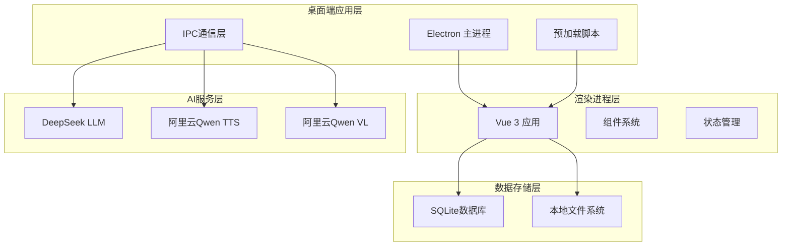
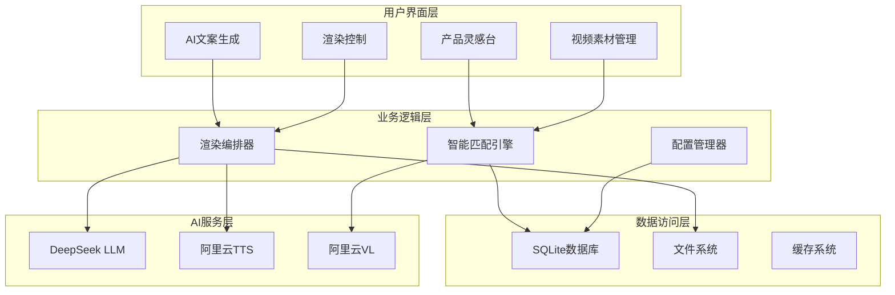
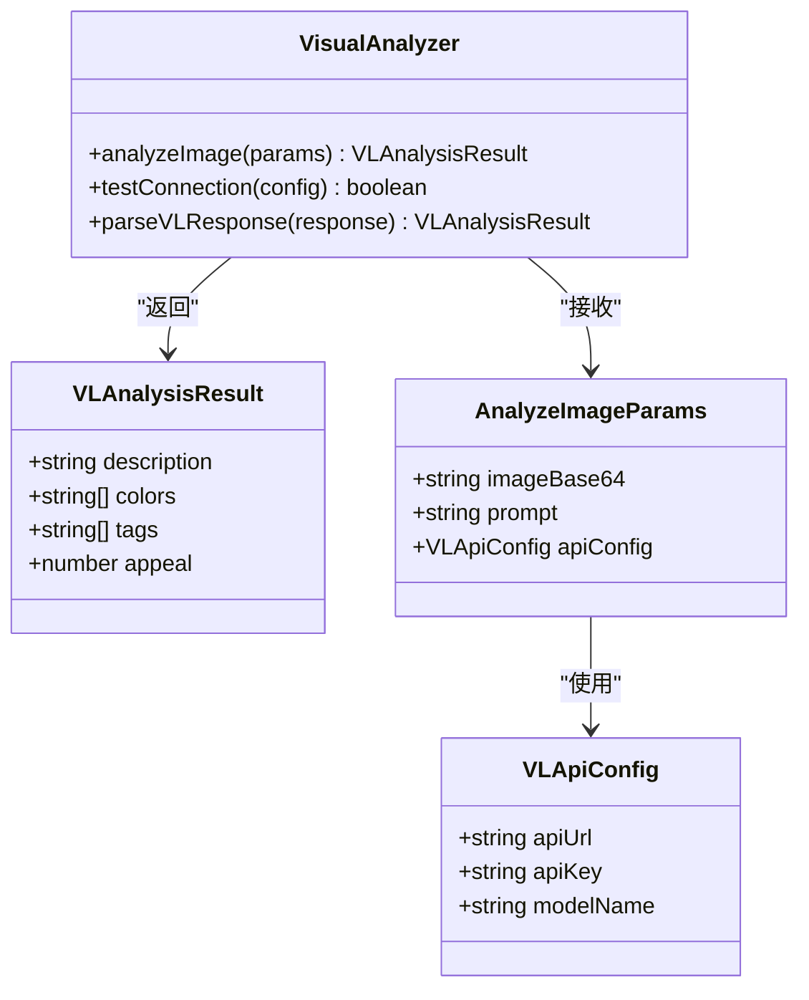
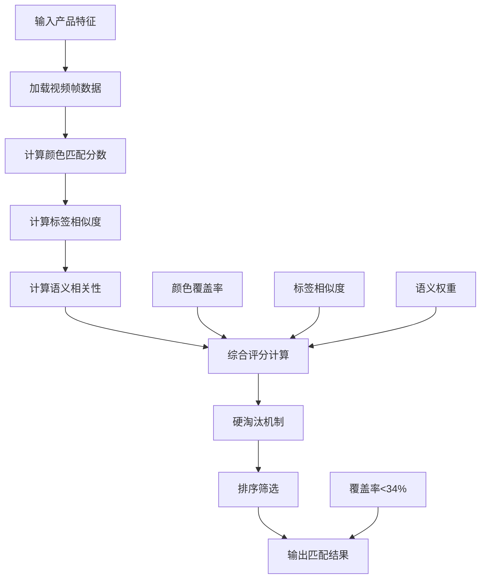
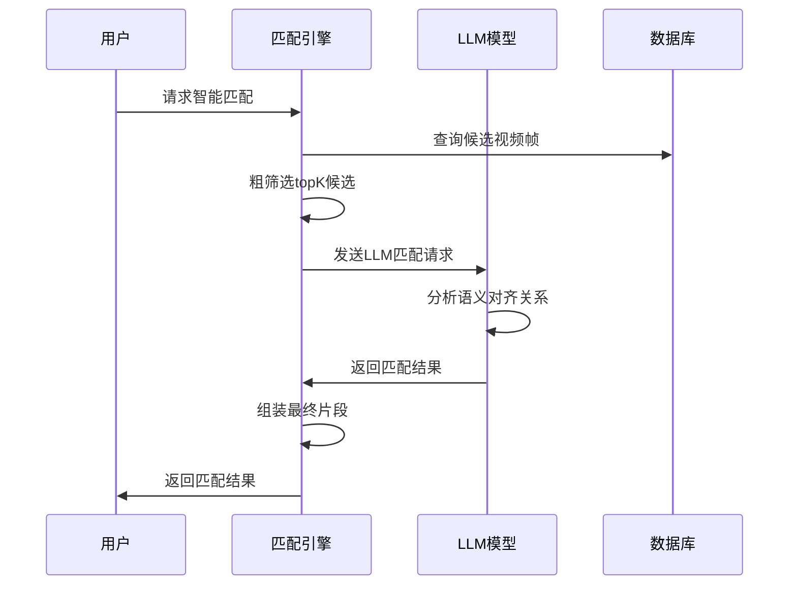
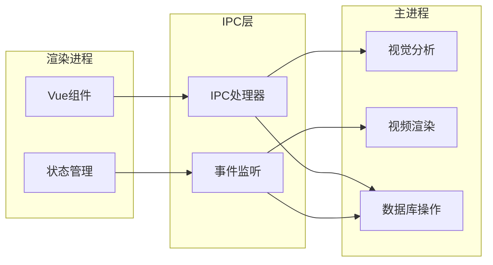
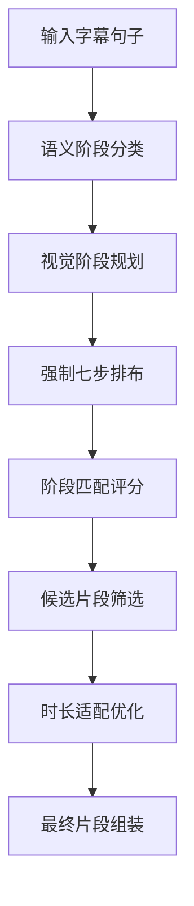
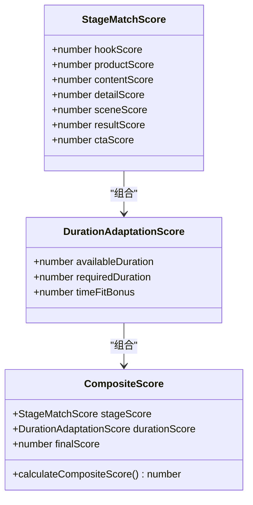

# AI视频匹配系统

<cite>
**本文档引用的文件**
- [package.json](file://package.json)
- [README.md](file://README.md)
- [electron/main.ts](file://electron/main.ts)
- [src/main.ts](file://src/main.ts)
- [electron/ipc.ts](file://electron/ipc.ts)
- [electron/sqlite/index.ts](file://electron/sqlite/index.ts)
- [electron/vl/index.ts](file://electron/vl/index.ts)
- [electron/vl/match.ts](file://electron/vl/match.ts)
- [electron/vl/llm-match.ts](file://electron/vl/llm-match.ts)
- [electron/vl/llm-match-core.ts](file://electron/vl/llm-match-core.ts)
- [electron/vl/types.ts](file://electron/vl/types.ts)
- [src/views/Home/index.vue](file://src/views/Home/index.vue)
- [src/views/Home/components/ProductReference.vue](file://src/views/Home/components/ProductReference.vue)
- [src/views/Home/components/TextGenerate.vue](file://src/views/Home/components/TextGenerate.vue)
- [src/store/app.ts](file://src/store/app.ts)
- [docs/plan-llm-video-match.md](file://docs/plan-llm-video-match.md)
</cite>

## 更新摘要
**变更内容**
- 从三阶段结构（hook → content → cta）升级为七阶段结构（hook → product → content → detail → scene → result → cta）
- 新增视觉阶段规划系统，实现强制性的七步视频轨道排布
- 增强评分机制，引入阶段匹配分数和时长适配评分
- 新增候选片段阶段提示推断系统
- 完善片段组装和时长分配算法

## 目录
1. [简介](#简介)
2. [项目结构](#项目结构)
3. [核心组件](#核心组件)
4. [架构概览](#架构概览)
5. [详细组件分析](#详细组件分析)
6. [依赖关系分析](#依赖关系分析)
7. [性能考量](#性能考量)
8. [故障排除指南](#故障排除指南)
9. [结论](#结论)

## 简介

AI视频匹配系统是一个基于人工智能技术的自动化视频生成平台，专为抖店、快手、TikTok等电商平台的带货视频制作而设计。该系统能够实现日产1000+条视频的批量自动化生成，通过AI技术实现从商品分析到视频渲染的全流程自动化。

**重大升级**：系统已从传统的三阶段结构（hook → content → cta）升级为先进的七阶段结构（hook → product → content → detail → scene → result → cta），并新增了视觉阶段规划系统和增强的评分机制。

系统的核心特色包括：
- **AI口播文案生成**：基于DeepSeek模型生成80-150字的带货脚本
- **智能视频匹配**：通过颜色、标签、语义三重对齐实现精准素材匹配
- **语音合成**：支持多种音色的自然语音合成
- **批量自动化**：支持一键日产1000+条视频的自动化生产
- **七阶段视觉规划**：强制性的视频轨道排布，确保内容结构完整性
- **增强评分机制**：基于阶段匹配和时长适配的复合评分系统

## 项目结构

该项目采用Electron + Vue 3的技术架构，实现了桌面端应用的完整功能。



**图表来源**
- [electron/main.ts:1-204](file://electron/main.ts#L1-L204)
- [src/main.ts:1-127](file://src/main.ts#L1-L127)

**章节来源**
- [README.md:39-75](file://README.md#L39-L75)
- [package.json:1-85](file://package.json#L1-L85)

## 核心组件

### 1. 视觉分析引擎
系统的核心在于其强大的视觉分析能力，通过阿里云Qwen VL模型实现：

- **产品特征提取**：自动识别产品颜色、标签和描述
- **视频帧分析**：对素材库中的每个视频帧进行深度分析
- **语义理解**：理解画面内容和场景类型

### 2. 智能匹配算法
系统提供两种匹配策略：

- **传统匹配算法**：基于颜色覆盖率、标签相似度和语义权重的混合评分
- **LLM增强匹配**：利用大型语言模型实现更精准的语义对齐，现已升级为七阶段结构

### 3. 渲染流水线
完整的视频渲染流程包括：

1. **文案生成**：AI生成带货口播脚本
2. **语音合成**：将文案转换为自然语音
3. **智能匹配**：根据文案语义选择最佳视频片段
4. **视频合成**：FFmpeg完成最终视频渲染

**章节来源**
- [electron/vl/index.ts:1-152](file://electron/vl/index.ts#L1-L152)
- [electron/vl/match.ts:275-679](file://electron/vl/match.ts#L275-L679)
- [electron/vl/llm-match.ts:161-241](file://electron/vl/llm-match.ts#L161-L241)

## 架构概览

系统采用分层架构设计，确保各组件间的松耦合和高内聚。



**图表来源**
- [src/views/Home/index.vue:1-433](file://src/views/Home/index.vue#L1-L433)
- [electron/ipc.ts:98-352](file://electron/ipc.ts#L98-L352)
- [electron/sqlite/index.ts:144-210](file://electron/sqlite/index.ts#L144-L210)

## 详细组件分析

### 视觉分析组件

视觉分析组件负责从图像中提取产品特征信息，为后续的智能匹配提供基础数据。



**图表来源**
- [electron/vl/index.ts:1-152](file://electron/vl/index.ts#L1-L152)
- [electron/vl/types.ts:1-93](file://electron/vl/types.ts#L1-L93)

### 智能匹配算法

系统提供了两种智能匹配策略，以适应不同的使用场景和性能需求。

#### 传统匹配算法

传统算法基于多维度评分机制：



**图表来源**
- [electron/vl/match.ts:46-137](file://electron/vl/match.ts#L46-L137)
- [electron/vl/match.ts:275-679](file://electron/vl/match.ts#L275-L679)

#### LLM增强匹配算法

**重大升级**：LLM算法通过大型语言模型实现更精准的语义对齐，现已升级为七阶段结构。



**新增功能**：
- **七阶段结构**：hook → product → content → detail → scene → result → cta
- **视觉阶段规划**：强制性的视频轨道排布
- **增强评分机制**：基于阶段匹配和时长适配的复合评分

**图表来源**
- [electron/vl/llm-match.ts:161-241](file://electron/vl/llm-match.ts#L161-L241)
- [electron/vl/llm-match-core.ts:317-515](file://electron/vl/llm-match-core.ts#L317-L515)

**章节来源**
- [electron/vl/match.ts:46-137](file://electron/vl/match.ts#L46-L137)
- [electron/vl/llm-match.ts:161-241](file://electron/vl/llm-match.ts#L161-L241)

### IPC通信机制

系统通过IPC（Inter-Process Communication）实现主进程和渲染进程间的高效通信。



**图表来源**
- [electron/ipc.ts:98-352](file://electron/ipc.ts#L98-L352)
- [src/views/Home/index.vue:196-250](file://src/views/Home/index.vue#L196-L250)

**章节来源**
- [electron/ipc.ts:98-352](file://electron/ipc.ts#L98-L352)
- [src/views/Home/index.vue:196-250](file://src/views/Home/index.vue#L196-L250)

### 七阶段视觉规划系统

**新增功能**：系统现在具备强大的视觉阶段规划能力，确保视频内容结构的完整性。



**七阶段结构**：
1. **Hook（开头抓人）**：黄金3秒强视觉冲击
2. **Product（产品展示）**：产品整体展示和主体明确
3. **Content（中段卖点）**：泛化中段卖点素材
4. **Detail（细节展示）**：产品近景、材质、接口、纹理、做工
5. **Scene（场景实战）**：真实使用场景、实战、演示
6. **Result（结果展示）**：前后对比、效果反馈、结果展示
7. **CTA（结尾转化）**：收尾、展示全貌、适合转化

**图表来源**
- [electron/vl/llm-match-core.ts:128-153](file://electron/vl/llm-match-core.ts#L128-L153)
- [electron/vl/llm-match-core.ts:41-49](file://electron/vl/llm-match-core.ts#L41-L49)

**章节来源**
- [electron/vl/llm-match-core.ts:128-153](file://electron/vl/llm-match-core.ts#L128-L153)
- [electron/vl/llm-match-core.ts:41-49](file://electron/vl/llm-match-core.ts#L41-L49)

### 增强评分机制

**重大升级**：系统引入了基于阶段匹配和时长适配的复合评分机制。



**评分规则**：
- **Hook阶段**：强视觉冲击优先，最高80分
- **Product阶段**：产品展示优先，65分基线
- **Detail阶段**：细节展示优先，72分基线
- **Scene阶段**：场景实战优先，45分基线
- **Result阶段**：结果展示优先，60分基线
- **CTA阶段**：转化引导优先，45分基线
- **Content阶段**：通用卖点，55分基线

**图表来源**
- [electron/vl/llm-match-core.ts:185-236](file://electron/vl/llm-match-core.ts#L185-L236)

**章节来源**
- [electron/vl/llm-match-core.ts:185-236](file://electron/vl/llm-match-core.ts#L185-L236)

## 依赖关系分析

系统采用了现代化的技术栈，确保了良好的可维护性和扩展性。

```mermaid
graph TB
subgraph "运行时依赖"
D1[Electron 22.3.27]
D2[better-sqlite3 9.6.0]
D3[ffmpeg-static 5.2.0]
D4[i18next 25.4.0]
end
subgraph "开发时依赖"
DE1[@ai-sdk/openai 3.0.26]
DE2[vue 3.5.17]
DE3[pinia 3.0.3]
DE4[vite 7.0.3]
end
subgraph "AI服务"
A1[DeepSeek API]
A2[阿里云Qwen TTS]
A3[阿里云Qwen VL]
end
D1 --> A1
D1 --> A2
D1 --> A3
DE1 --> A1
```

**图表来源**
- [package.json:22-64](file://package.json#L22-L64)

**章节来源**
- [package.json:22-64](file://package.json#L22-L64)
- [README.md:22-36](file://README.md#L22-L36)

## 性能考量

系统在设计时充分考虑了性能优化，特别是在大规模视频生成场景下的表现。

### 数据库优化
- 使用SQLite作为本地数据库，支持高效的查询和索引
- 为视频帧分析表建立专门的索引以加速查询
- 支持批量插入和更新操作，减少数据库往返次数

### 缓存策略
- 内存缓存常用查询结果
- 文件系统缓存分析过的视频帧数据
- 智能重用已分析的素材，避免重复计算

### 并行处理
- 多线程并发处理视频分析任务
- 异步处理大量素材的批处理操作
- 流式处理音频和视频数据，减少内存占用

### 七阶段结构优化
- **阶段匹配优化**：通过阶段关键词匹配提高素材选择准确性
- **时长适配优化**：智能计算片段时长，避免过度裁剪
- **候选筛选优化**：基于阶段提示的候选片段筛选，减少LLM处理负担

## 故障排除指南

### 常见问题及解决方案

#### 1. 视觉分析失败
**症状**：产品特征提取失败或分析结果不准确
**解决方案**：
- 检查阿里云API配置是否正确
- 确认网络连接正常
- 验证图片质量和清晰度

#### 2. 智能匹配效果不佳
**症状**：视频片段与文案语义不匹配
**解决方案**：
- 调整匹配算法参数
- 重新训练或优化产品特征
- 检查素材库质量

#### 3. 渲染性能问题
**症状**：视频渲染速度慢或内存占用过高
**解决方案**：
- 优化FFmpeg参数配置
- 增加系统内存或CPU资源
- 调整并发处理数量

#### 4. 七阶段结构异常
**症状**：视频内容结构不符合预期
**解决方案**：
- 检查字幕解析是否正确
- 验证阶段关键词配置
- 确认候选片段阶段提示推断正常

**章节来源**
- [electron/vl/index.ts:125-149](file://electron/vl/index.ts#L125-L149)
- [electron/vl/match.ts:275-679](file://electron/vl/match.ts#L275-L679)

## 结论

AI视频匹配系统通过先进的AI技术和精心设计的架构，实现了从商品分析到视频渲染的全流程自动化。经过重大升级，系统现已具备以下优势：

1. **高度自动化**：从产品录入到视频导出全程无需人工干预
2. **智能匹配**：基于AI的精准素材匹配，显著提升视频质量
3. **七阶段结构**：强制性的视频轨道排布，确保内容结构完整性
4. **增强评分**：基于阶段匹配和时长适配的复合评分系统
5. **高性能**：优化的算法和架构支持大规模批量生产
6. **易用性强**：直观的用户界面和完善的配置选项

**重大升级价值**：
- **结构完整性**：七阶段结构确保视频内容的逻辑连贯性
- **匹配准确性**：阶段匹配评分显著提升素材选择的准确性
- **时长适配**：智能时长计算避免片段过度裁剪
- **扩展性**：模块化的架构便于未来功能扩展

该系统为电商带货视频制作提供了全新的解决方案，能够帮助商家大幅提高视频制作效率和质量，是现代电商运营不可或缺的工具。