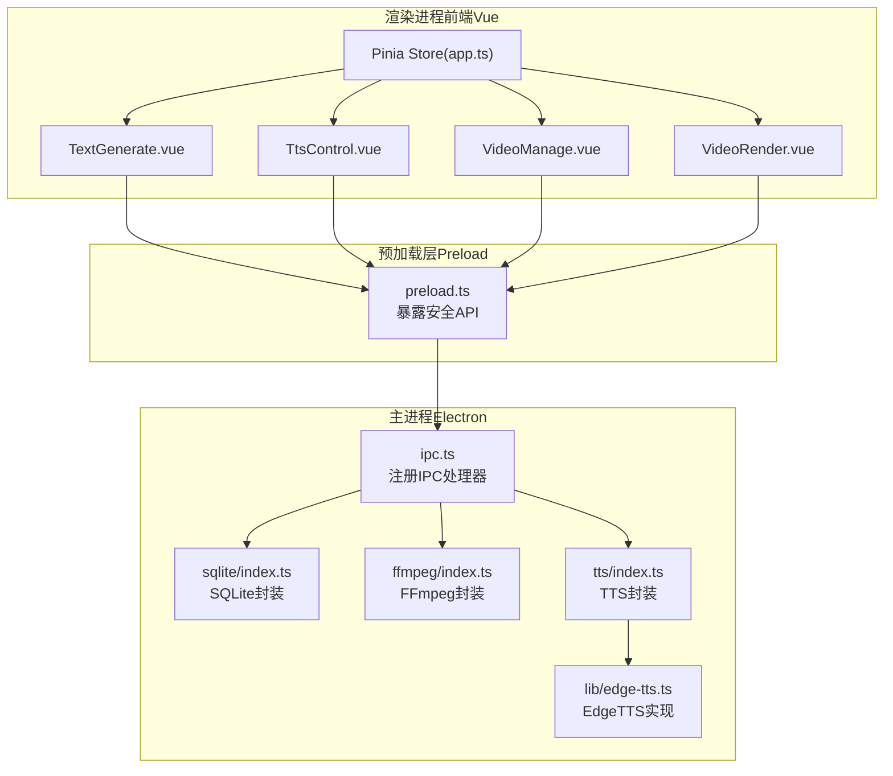
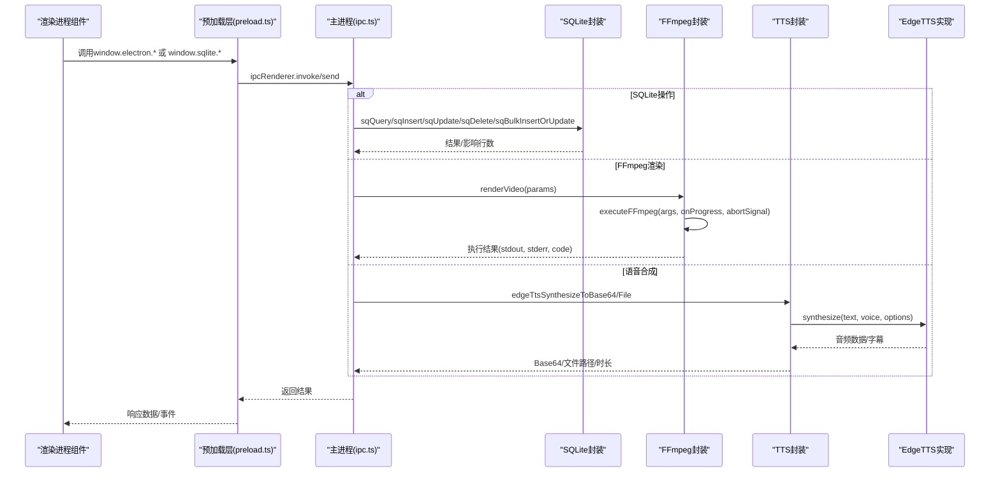
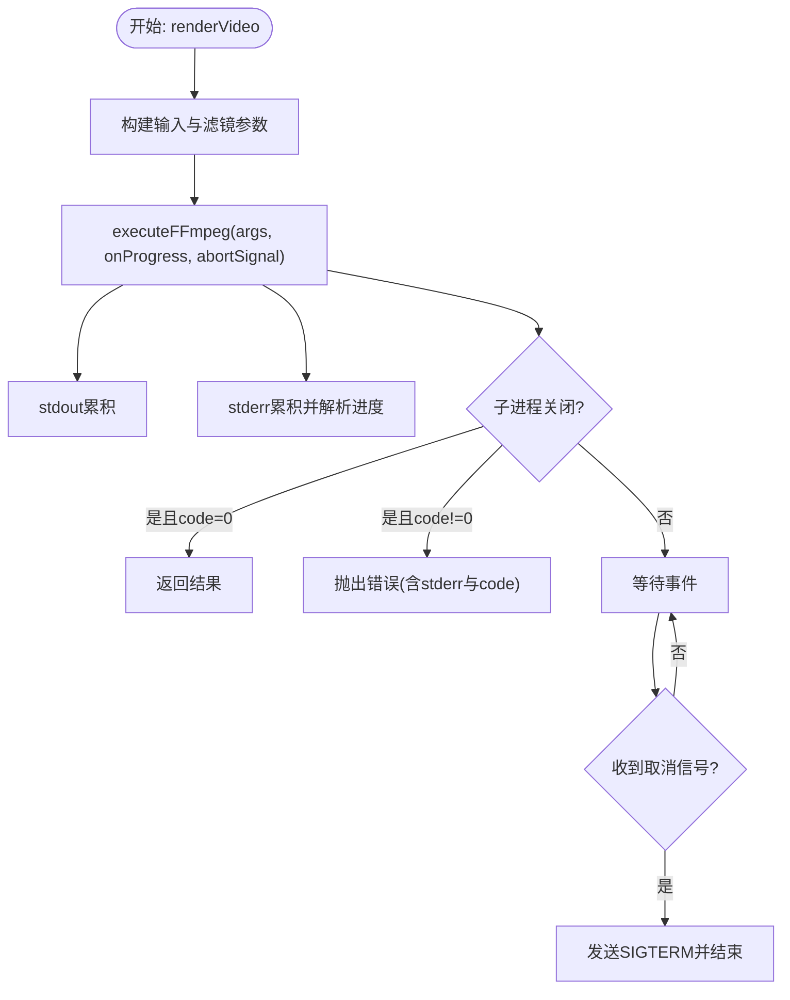
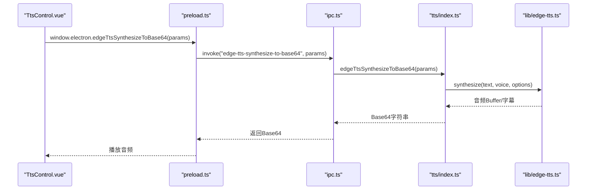
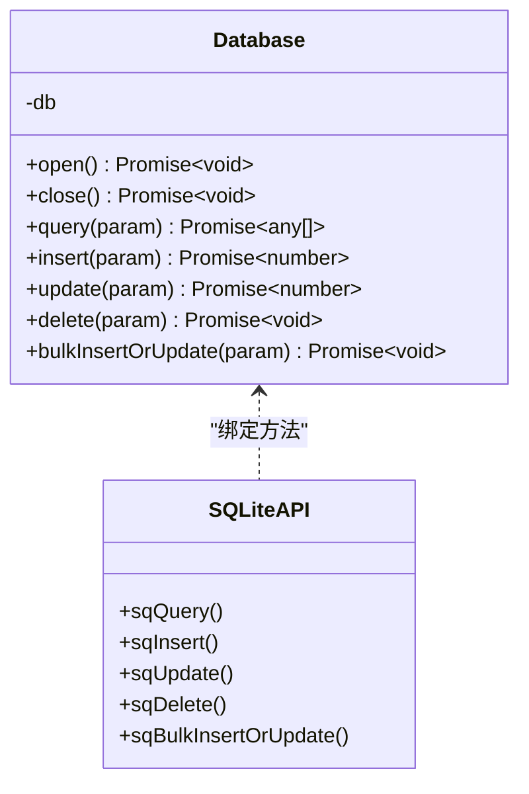
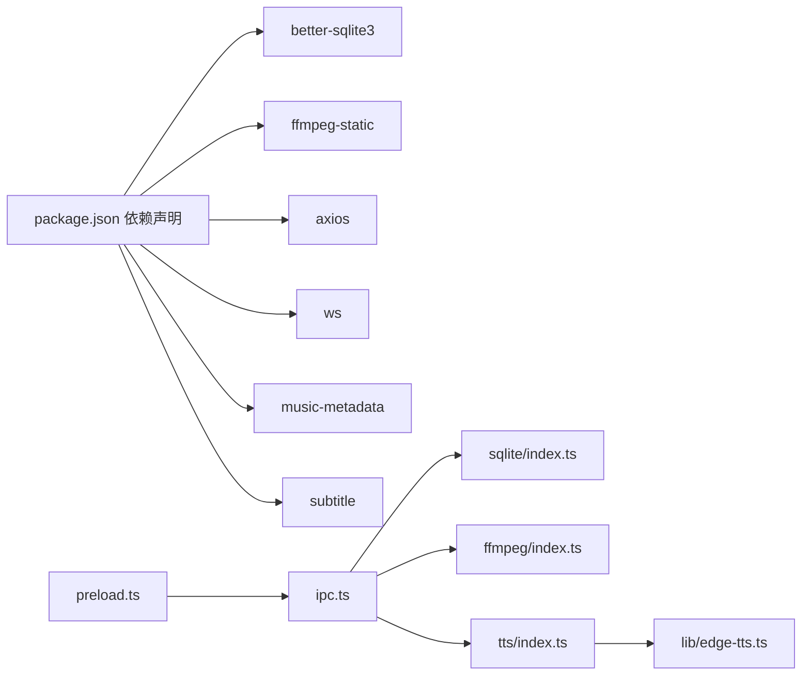

# API参考文档

<cite>
**本文档引用的文件**
- [electron/ipc.ts](file://electron/ipc.ts)
- [electron/preload.ts](file://electron/preload.ts)
- [electron/types.ts](file://electron/types.ts)
- [electron/ffmpeg/index.ts](file://electron/ffmpeg/index.ts)
- [electron/ffmpeg/types.ts](file://electron/ffmpeg/types.ts)
- [electron/tts/index.ts](file://electron/tts/index.ts)
- [electron/tts/types.ts](file://electron/tts/types.ts)
- [electron/sqlite/index.ts](file://electron/sqlite/index.ts)
- [electron/sqlite/types.ts](file://electron/sqlite/types.ts)
- [electron/lib/edge-tts.ts](file://electron/lib/edge-tts.ts)
- [src/views/Home/components/TextGenerate.vue](file://src/views/Home/components/TextGenerate.vue)
- [src/views/Home/components/TtsControl.vue](file://src/views/Home/components/TtsControl.vue)
- [src/views/Home/components/VideoManage.vue](file://src/views/Home/components/VideoManage.vue)
- [src/views/Home/components/VideoRender.vue](file://src/views/Home/components/VideoRender.vue)
- [src/store/app.ts](file://src/store/app.ts)
- [package.json](file://package.json)
- [README.md](file://README.md)
</cite>

## 目录
1. [简介](#简介)
2. [项目结构](#项目结构)
3. [核心组件](#核心组件)
4. [架构总览](#架构总览)
5. [详细组件分析](#详细组件分析)
6. [依赖关系分析](#依赖关系分析)
7. [性能考虑](#性能考虑)
8. [故障排除指南](#故障排除指南)
9. [结论](#结论)
10. [附录](#附录)

## 简介
本API参考文档面向短视频工厂项目的开发者，系统梳理了以下能力的IPC接口、FFmpeg相关API、语音合成API、SQLite数据库API以及Vue组件API，并提供版本兼容性与迁移指南、调用示例与常见使用场景，帮助快速集成与扩展。

## 项目结构
项目采用Electron主进程与Vue前端分离的架构，主进程负责系统级能力（文件选择、对话框、FFmpeg渲染、语音合成、SQLite数据库等），前端通过preload桥接暴露安全的API给渲染进程使用。

**图表来源**
- [electron/preload.ts:1-75](file://electron/preload.ts#L1-L75)
- [electron/ipc.ts:77-187](file://electron/ipc.ts#L77-L187)
- [electron/sqlite/index.ts:38-154](file://electron/sqlite/index.ts#L38-L154)
- [electron/ffmpeg/index.ts:26-272](file://electron/ffmpeg/index.ts#L26-L272)
- [electron/tts/index.ts:1-86](file://electron/tts/index.ts#L1-L86)
- [electron/lib/edge-tts.ts:420-632](file://electron/lib/edge-tts.ts#L420-L632)

**章节来源**
- [electron/preload.ts:1-75](file://electron/preload.ts#L1-L75)
- [electron/ipc.ts:77-187](file://electron/ipc.ts#L77-L187)

## 核心组件
- IPC接口：主进程注册并处理来自渲染进程的调用，涵盖SQLite、文件系统、窗口控制、统计事件、语音合成、FFmpeg渲染等。
- FFmpeg封装：提供视频渲染、进度回调、取消控制、命令构建与执行。
- 语音合成（EdgeTTS）：提供语音列表查询、文本转语音（Base64/文件）、字幕生成、元数据解析。
- SQLite封装：提供查询、插入、更新、删除、批量插入或更新，支持事务。
- Vue组件：提供文案生成、TTS控制、素材管理、渲染控制等UI交互与状态管理。

**章节来源**
- [electron/ipc.ts:77-187](file://electron/ipc.ts#L77-L187)
- [electron/ffmpeg/index.ts:26-272](file://electron/ffmpeg/index.ts#L26-L272)
- [electron/tts/index.ts:1-86](file://electron/tts/index.ts#L1-L86)
- [electron/sqlite/index.ts:38-154](file://electron/sqlite/index.ts#L38-L154)
- [src/views/Home/components/TextGenerate.vue:110-272](file://src/views/Home/components/TextGenerate.vue#L110-L272)
- [src/views/Home/components/TtsControl.vue:59-234](file://src/views/Home/components/TtsControl.vue#L59-L234)
- [src/views/Home/components/VideoManage.vue:60-308](file://src/views/Home/components/VideoManage.vue#L60-L308)
- [src/views/Home/components/VideoRender.vue:175-246](file://src/views/Home/components/VideoRender.vue#L175-L246)

## 架构总览
下图展示了从渲染进程发起调用到主进程处理与系统资源交互的端到端流程。

**图表来源**
- [electron/preload.ts:49-75](file://electron/preload.ts#L49-L75)
- [electron/ipc.ts:77-187](file://electron/ipc.ts#L77-L187)
- [electron/sqlite/index.ts:149-154](file://electron/sqlite/index.ts#L149-L154)
- [electron/ffmpeg/index.ts:26-272](file://electron/ffmpeg/index.ts#L26-L272)
- [electron/tts/index.ts:39-85](file://electron/tts/index.ts#L39-L85)
- [electron/lib/edge-tts.ts:477-504](file://electron/lib/edge-tts.ts#L477-L504)

## 详细组件分析

### IPC接口规范
- 接口命名与职责
  - 数据库类
    - sqlite-query: 查询
    - sqlite-insert: 插入
    - sqlite-update: 更新
    - sqlite-delete: 删除
    - sqlite-bulk-insert-or-update: 批量插入或更新
  - 窗口控制类
    - is-win-maxed: 查询窗口是否最大化
    - win-min: 最小化
    - win-max: 切换最大化/还原
    - win-close: 关闭窗口
  - 文件与系统类
    - open-external: 打开外部链接
    - select-folder: 选择文件夹（带默认路径回退策略）
    - list-files-from-folder: 列举文件夹内文件（仅返回文件条目）
  - 统计事件
    - stat-track: 发送统计事件
  - 语音合成
    - edge-tts-get-voice-list: 获取语音列表
    - edge-tts-synthesize-to-base64: 文本转语音并返回Base64
    - edge-tts-synthesize-to-file: 文本转语音并写入文件（可选生成字幕）
  - 视频渲染
    - render-video: 视频渲染（支持进度事件与取消）

- 参数与返回
  - 所有invoke型接口均通过ipcRenderer.invoke调用；on/send用于事件与命令发送。
  - 取消机制：渲染视频支持AbortController，主进程监听取消事件后终止FFmpeg子进程。
  - 进度回调：渲染视频在主进程内部向渲染进程发送“render-video-progress”事件。

- 错误处理
  - 选择文件夹：无法获取窗口时抛出错误。
  - FFmpeg：非零退出码或启动失败时抛出错误。
  - TTS：音频时长解析失败或无效时抛出错误。
  - SQLite：异常捕获并记录日志，不吞没错误。

- 调用示例（路径引用）
  - 选择文件夹：[src/views/Home/components/VideoManage.vue:82-91](file://src/views/Home/components/VideoManage.vue#L82-L91)
  - 列举文件夹：[src/views/Home/components/VideoManage.vue:103-107](file://src/views/Home/components/VideoManage.vue#L103-L107)
  - 获取语音列表：[src/views/Home/components/TtsControl.vue:165-193](file://src/views/Home/components/TtsControl.vue#L165-L193)
  - 文本转语音（Base64）：[src/views/Home/components/TtsControl.vue:102-111](file://src/views/Home/components/TtsControl.vue#L102-L111)
  - 文本转语音（文件）：[src/views/Home/components/TtsControl.vue:213-226](file://src/views/Home/components/TtsControl.vue#L213-L226)
  - 渲染视频：[electron/ipc.ts:172-186](file://electron/ipc.ts#L172-L186)
  - 渲染进度监听：[src/views/Home/components/VideoRender.vue:197-199](file://src/views/Home/components/VideoRender.vue#L197-L199)

**章节来源**
- [electron/ipc.ts:77-187](file://electron/ipc.ts#L77-L187)
- [electron/preload.ts:49-75](file://electron/preload.ts#L49-L75)
- [electron/types.ts:1-26](file://electron/types.ts#L1-L26)

### FFmpeg相关API
- 方法签名与参数
  - renderVideo(params & { onProgress?, abortSignal? }): Promise<ExecuteFFmpegResult>
    - videoFiles: string[]（视频输入路径数组）
    - timeRanges: [string, string][]（每个视频片段的起止时间）
    - audioFiles?: { voice?: string; bgm?: string }（语音与背景音乐）
    - subtitleFile?: string（字幕文件路径）
    - outputSize: { width: number; height: number }（输出分辨率）
    - outputPath: string（输出文件路径）
    - outputDuration?: string（输出时长）
    - audioVolume?: AudioVolumeConfig（音量配置）
    - onProgress?: (progress: number) => void（进度回调，上限99%）
    - abortSignal?: AbortSignal（取消信号）
  - executeFFmpeg(args: string[], options?): Promise<ExecuteFFmpegResult>
    - args: FFmpeg命令行参数数组
    - options.cwd?: string
    - options.onProgress?: (progress: number) => void
    - options.abortSignal?: AbortSignal

- 返回值
  - ExecuteFFmpegResult: { stdout: string; stderr: string; code: number }

- 命令参数说明与使用示例
  - 输入：-i <文件路径>（多个视频与音频输入）
  - 滤镜链：使用复杂滤镜（filter_complex）实现裁剪、缩放、拼接、重采样、响度归一化、混合等
  - 输出：libx264编码、AAC音频、固定帧率、指定尺寸、进度输出到标准错误
  - 取消：当收到取消信号时，向FFmpeg子进程发送SIGTERM

- 错误码与处理
  - 非零退出码：抛出包含stderr与退出码的错误
  - 启动失败：抛出启动失败错误
  - Windows可执行权限校验：缺失执行权限时报错

- 调用示例（路径引用）
  - 渲染视频入口：[electron/ipc.ts:172-186](file://electron/ipc.ts#L172-L186)
  - 执行命令与进度解析：[electron/ffmpeg/index.ts:188-244](file://electron/ffmpeg/index.ts#L188-L244)
  - 时间戳解析进度：[electron/ffmpeg/index.ts:261-271](file://electron/ffmpeg/index.ts#L261-L271)

**图表来源**
- [electron/ffmpeg/index.ts:26-186](file://electron/ffmpeg/index.ts#L26-L186)
- [electron/ffmpeg/index.ts:188-244](file://electron/ffmpeg/index.ts#L188-L244)

**章节来源**
- [electron/ffmpeg/index.ts:26-272](file://electron/ffmpeg/index.ts#L26-L272)
- [electron/ffmpeg/types.ts:1-23](file://electron/ffmpeg/types.ts#L1-L23)

### 语音合成API（EdgeTTS）
- 方法签名与参数
  - edgeTtsGetVoiceList(): Promise<EdgeTTSVoice[]>
  - edgeTtsSynthesizeToBase64(params: EdgeTtsSynthesizeCommonParams): Promise<string>
  - edgeTtsSynthesizeToFile(params: EdgeTtsSynthesizeToFileParams): Promise<{ duration: number }>
  - getTempTtsVoiceFilePath(): string（临时语音文件路径）
  - clearCurrentTtsFiles(): void（清理当前会话的临时文件）

- 参数类型
  - EdgeTtsSynthesizeCommonParams: { text: string; voice: string; options: SynthesisOptions }
  - EdgeTtsSynthesizeToFileParams: { withCaption?: boolean; outputPath?: string } + CommonParams
  - SynthesisOptions: { pitch?: number; rate?: number; volume?: number }

- 返回值
  - Base64：字符串
  - 文件：包含duration（秒）的对象
  - 语音列表：EdgeTTSVoice[]

- 配置选项与调用方式
  - 语音列表：首次进入页面拉取，存储于全局状态，后续筛选语言与性别
  - 试听：调用edgeTtsSynthesizeToBase64，返回Base64后创建Audio播放
  - 导出：调用edgeTtsSynthesizeToFile，可选生成SRT字幕
  - 字幕生成：基于SSML词边界信息生成SRT字幕字符串

- 错误处理
  - 无效配置：返回警告并中断
  - 网络/服务异常：统一toast提示，支持复制错误详情
  - 时长解析失败：抛出错误并提示检查配置或网络

- 调用示例（路径引用）
  - 获取语音列表：[src/views/Home/components/TtsControl.vue:165-193](file://src/views/Home/components/TtsControl.vue#L165-L193)
  - 试听语音：[src/views/Home/components/TtsControl.vue:102-111](file://src/views/Home/components/TtsControl.vue#L102-L111)
  - 写入文件并生成字幕：[src/views/Home/components/TtsControl.vue:213-226](file://src/views/Home/components/TtsControl.vue#L213-L226)
  - 语音实现与SSML构造：[electron/lib/edge-tts.ts:477-504](file://electron/lib/edge-tts.ts#L477-L504)

**图表来源**
- [electron/preload.ts:59-64](file://electron/preload.ts#L59-L64)
- [electron/ipc.ts:163-169](file://electron/ipc.ts#L163-L169)
- [electron/tts/index.ts:39-43](file://electron/tts/index.ts#L39-L43)
- [electron/lib/edge-tts.ts:477-504](file://electron/lib/edge-tts.ts#L477-L504)

**章节来源**
- [electron/tts/index.ts:1-86](file://electron/tts/index.ts#L1-L86)
- [electron/tts/types.ts:1-20](file://electron/tts/types.ts#L1-L20)
- [electron/lib/edge-tts.ts:420-632](file://electron/lib/edge-tts.ts#L420-L632)

### SQLite数据库API
- 数据模型
  - 数据库文件：位于用户数据目录下的data.db
  - 原生绑定：根据平台与架构选择对应better-sqlite3原生模块
  - 外键约束：开启foreign_keys pragma

- 操作方法
  - query({ sql, params? }): Promise<any[]>
  - insert({ table, data }): Promise<number>（返回lastInsertRowid）
  - update({ table, data, condition }): Promise<number>（返回变更行数）
  - delete({ table, condition }): Promise<void>
  - bulkInsertOrUpdate({ table, data }): Promise<void>（按id冲突更新）

- 调用方式
  - 渲染进程通过window.sqlite.*调用，预加载层暴露invoke接口
  - 主进程注册ipc处理器，转发到sqQuery/sqInsert/sqUpdate/sqDelete/sqBulkInsertOrUpdate

- 调用示例（路径引用）
  - 预加载暴露SQLite API：[electron/preload.ts:67-74](file://electron/preload.ts#L67-L74)
  - 主进程注册处理器：[electron/ipc.ts:79-87](file://electron/ipc.ts#L79-L87)
  - 封装类与事务：[electron/sqlite/index.ts:38-154](file://electron/sqlite/index.ts#L38-L154)

**图表来源**
- [electron/sqlite/index.ts:38-154](file://electron/sqlite/index.ts#L38-L154)

**章节来源**
- [electron/sqlite/index.ts:1-154](file://electron/sqlite/index.ts#L1-L154)
- [electron/sqlite/types.ts:1-26](file://electron/sqlite/types.ts#L1-L26)

### Vue组件API
- TextGenerate.vue
  - 属性
    - disabled?: boolean（禁用表单）
  - 事件
    - 无显式事件，通过内部状态与store交互
  - 方法
    - expose: handleGenerate(options?), handleStopGenerate(), getCurrentOutputText(), clearOutputText()

- TtsControl.vue
  - 属性
    - disabled?: boolean（禁用表单）
  - 事件
    - 无显式事件
  - 方法
    - expose: synthesizedSpeechToFile(option: { text, withCaption? })

- VideoManage.vue
  - 属性
    - disabled?: boolean（禁用表单）
  - 事件
    - 无显式事件
  - 方法
    - expose: getVideoSegments(options: { duration })

- VideoRender.vue
  - 属性
    - 无
  - 事件
    - emit: renderVideo, cancelRender
  - 方法
    - 无显式expose

- 状态管理（Pinia）
  - RenderStatus枚举：None、GenerateText、SynthesizedSpeech、SegmentVideo、Rendering、Completed、Failed
  - appStore：集中管理语言、性别、语音、速度、渲染配置、渲染状态等

- 调用示例（路径引用）
  - 文案生成与停止：[src/views/Home/components/TextGenerate.vue:132-198](file://src/views/Home/components/TextGenerate.vue#L132-L198)
  - TTS试听与导出：[src/views/Home/components/TtsControl.vue:91-138](file://src/views/Home/components/TtsControl.vue#L91-L138)
  - 素材库刷新与片段抽取：[src/views/Home/components/VideoManage.vue:97-300](file://src/views/Home/components/VideoManage.vue#L97-L300)
  - 渲染状态与进度监听：[src/views/Home/components/VideoRender.vue:188-240](file://src/views/Home/components/VideoRender.vue#L188-L240)
  - 状态定义：[src/store/app.ts:5-13](file://src/store/app.ts#L5-L13)

**章节来源**
- [src/views/Home/components/TextGenerate.vue:110-272](file://src/views/Home/components/TextGenerate.vue#L110-L272)
- [src/views/Home/components/TtsControl.vue:59-234](file://src/views/Home/components/TtsControl.vue#L59-L234)
- [src/views/Home/components/VideoManage.vue:60-308](file://src/views/Home/components/VideoManage.vue#L60-L308)
- [src/views/Home/components/VideoRender.vue:175-246](file://src/views/Home/components/VideoRender.vue#L175-L246)
- [src/store/app.ts:15-114](file://src/store/app.ts#L15-L114)

## 依赖关系分析
- 外部依赖
  - better-sqlite3：本地数据库
  - ffmpeg-static：FFmpeg可执行文件
  - axios、ws：网络与WebSocket通信
  - music-metadata：音频元数据解析
  - subtitle：字幕生成
- 预加载层对主进程IPC的桥接，确保渲染进程只能通过白名单API访问系统能力

**图表来源**
- [package.json:22-84](file://package.json#L22-L84)
- [electron/preload.ts:49-75](file://electron/preload.ts#L49-L75)
- [electron/ipc.ts:77-187](file://electron/ipc.ts#L77-L187)

**章节来源**
- [package.json:22-84](file://package.json#L22-L84)

## 性能考虑
- FFmpeg
  - 使用响度归一化与混合策略保证音量一致性
  - 滤镜链优化：先trim/setpts/scale/pad/fps/format，再拼接与字幕叠加
  - 进度解析基于stderr时间戳，上限99%，避免100%误判
- TTS
  - 分块合成与偏移补偿，避免长文本SSML边界问题
  - 字幕生成基于词边界，支持紧凑文字脚本合并
- SQLite
  - 事务批量插入减少IO开销
  - 外键约束启用，保证参照完整性

[本节为通用指导，无需特定文件引用]

## 故障排除指南
- 无法打开外部链接
  - 检查参数url合法性与网络环境
  - 参考：[electron/ipc.ts:115-117](file://electron/ipc.ts#L115-L117)
- 选择文件夹失败
  - 窗口句柄为空或默认路径不可用，检查窗口生命周期与路径权限
  - 参考：[electron/ipc.ts:120-144](file://electron/ipc.ts#L120-L144)
- FFmpeg渲染失败
  - 非零退出码或启动失败，查看stderr与code
  - Windows缺少执行权限或FFmpeg路径错误
  - 参考：[electron/ffmpeg/index.ts:224-235](file://electron/ffmpeg/index.ts#L224-L235)，[electron/ffmpeg/index.ts:246-259](file://electron/ffmpeg/index.ts#L246-L259)
- 语音合成失败
  - 时长解析失败或网络异常，检查TTS配置与网络
  - 参考：[electron/tts/index.ts:74-81](file://electron/tts/index.ts#L74-L81)
- SQLite异常
  - 数据库未初始化或原生绑定路径错误，检查APP_ROOT与userData路径
  - 参考：[electron/sqlite/index.ts:140-147](file://electron/sqlite/index.ts#L140-L147)

**章节来源**
- [electron/ipc.ts:115-144](file://electron/ipc.ts#L115-L144)
- [electron/ffmpeg/index.ts:224-259](file://electron/ffmpeg/index.ts#L224-L259)
- [electron/tts/index.ts:74-81](file://electron/tts/index.ts#L74-L81)
- [electron/sqlite/index.ts:140-147](file://electron/sqlite/index.ts#L140-L147)

## 结论
本API参考文档覆盖了短视频工厂项目的核心IPC接口、FFmpeg渲染、EdgeTTS语音合成、SQLite数据库与Vue组件API。通过明确的方法签名、参数类型、返回值与错误处理，结合调用示例与流程图，开发者可快速集成与扩展功能。建议在生产环境中关注FFmpeg与TTS的网络与资源限制，并合理使用取消与进度回调机制。

[本节为总结，无需特定文件引用]

## 附录

### API版本兼容性与迁移指南
- 版本信息
  - 项目版本：1.2.2
  - Node引擎要求：>=22.17.0
  - 包管理器：pnpm >=10.12.4
- 迁移建议
  - 升级Node版本至要求范围，确保better-sqlite3与ffmpeg-static原生模块匹配
  - 若更换FFmpeg版本，需验证静态二进制路径与权限
  - 若扩展TTS接口，保持SynthesisOptions与EdgeTTSVoice结构稳定

**章节来源**
- [package.json:4, 80-84](file://package.json#L4,L80-L84)
- [README.md:65-71](file://README.md#L65-L71)