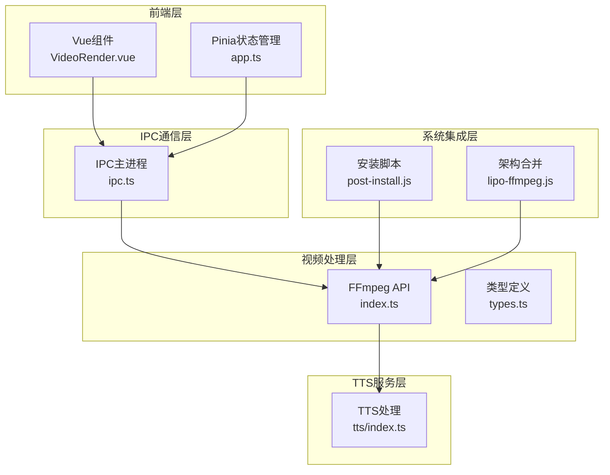
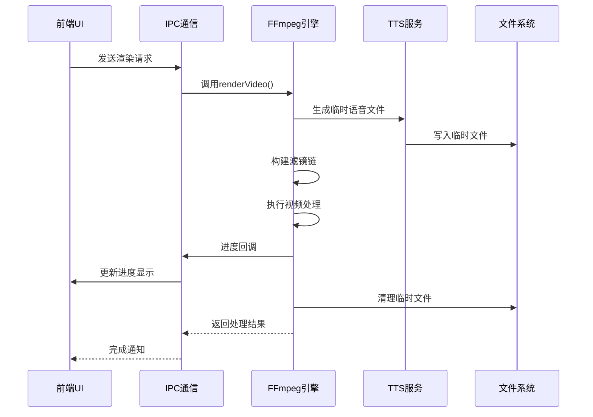
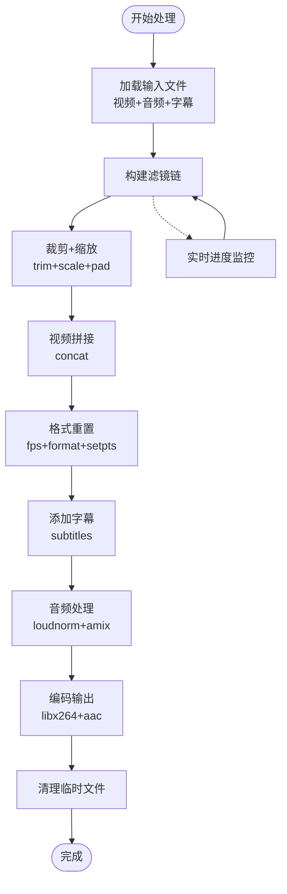
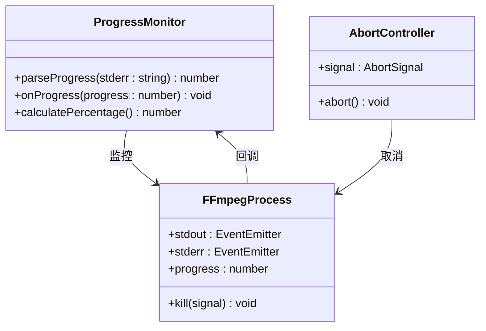
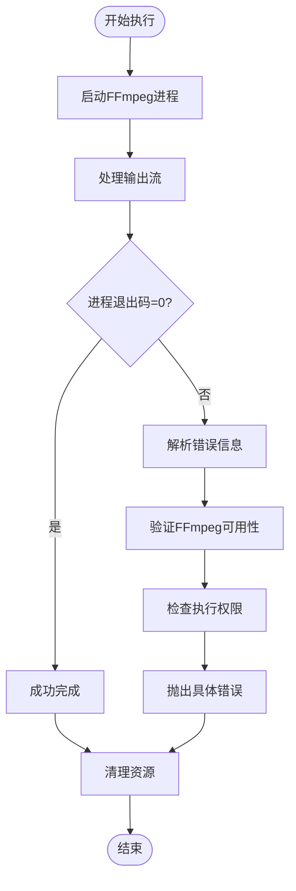

# FFmpeg视频处理API

<cite>
**本文档引用的文件**
- [electron/ffmpeg/index.ts](file://electron/ffmpeg/index.ts)
- [electron/ffmpeg/types.ts](file://electron/ffmpeg/types.ts)
- [electron/ipc.ts](file://electron/ipc.ts)
- [electron/tts/index.ts](file://electron/tts/index.ts)
- [src/views/Home/components/VideoRender.vue](file://src/views/Home/components/VideoRender.vue)
- [src/store/app.ts](file://src/store/app.ts)
- [scripts/post-install.js](file://scripts/post-install.js)
- [scripts/lipo-ffmpeg.js](file://scripts/lipo-ffmpeg.js)
- [package.json](file://package.json)
</cite>

## 目录
1. [简介](#简介)
2. [项目结构](#项目结构)
3. [核心组件](#核心组件)
4. [架构概览](#架构概览)
5. [详细组件分析](#详细组件分析)
6. [依赖关系分析](#依赖关系分析)
7. [性能考虑](#性能考虑)
8. [故障排除指南](#故障排除指南)
9. [结论](#结论)
10. [附录](#附录)

## 简介

本项目提供了一套完整的FFmpeg视频处理API，专注于短视频自动合成与渲染。该API实现了从视频片段拼接、音频混合到字幕嵌入的全流程视频处理能力，支持实时进度监控、错误处理和性能优化。

主要功能包括：
- 视频片段裁剪与拼接
- 分辨率转换与画面填充
- 音频响度归一化与混合
- 字幕嵌入与同步
- 实时进度监控与取消机制
- 跨平台FFmpeg集成

## 项目结构

项目采用Electron桌面应用架构，核心视频处理功能位于`electron/ffmpeg`目录下：



**图表来源**
- [electron/ffmpeg/index.ts:1-272](file://electron/ffmpeg/index.ts#L1-L272)
- [electron/ipc.ts:1-188](file://electron/ipc.ts#L1-L188)
- [src/views/Home/components/VideoRender.vue:1-246](file://src/views/Home/components/VideoRender.vue#L1-L246)

**章节来源**
- [electron/ffmpeg/index.ts:1-272](file://electron/ffmpeg/index.ts#L1-L272)
- [electron/ipc.ts:77-187](file://electron/ipc.ts#L77-L187)

## 核心组件

### FFmpeg渲染引擎

`renderVideo`函数是整个视频处理的核心入口，负责构建完整的FFmpeg命令行参数并执行视频合成任务。

**主要特性：**
- 支持多视频片段输入与拼接
- 自动字幕文件生成与嵌入
- 音频响度归一化与混合
- 实时进度监控
- 取消机制支持

**章节来源**
- [electron/ffmpeg/index.ts:26-186](file://electron/ffmpeg/index.ts#L26-L186)

### FFmpeg执行器

`executeFFmpeg`函数提供了底层的FFmpeg进程管理能力，包括进程启动、输出解析和错误处理。

**关键功能：**
- 进程生命周期管理
- 标准输出/错误流解析
- 进度计算与回调
- 异步取消支持

**章节来源**
- [electron/ffmpeg/index.ts:188-244](file://electron/ffmpeg/index.ts#L188-L244)

### 类型定义系统

项目提供了完整的TypeScript类型定义，确保API使用的类型安全性和开发体验。

**核心类型：**
- `RenderVideoParams`: 渲染参数接口
- `AudioVolumeConfig`: 音频音量配置
- `ExecuteFFmpegResult`: 执行结果接口

**章节来源**
- [electron/ffmpeg/types.ts:1-23](file://electron/ffmpeg/types.ts#L1-L23)

## 架构概览

系统采用分层架构设计，确保各组件职责清晰、耦合度低：



**图表来源**
- [electron/ipc.ts:171-186](file://electron/ipc.ts#L171-L186)
- [electron/ffmpeg/index.ts:26-186](file://electron/ffmpeg/index.ts#L26-L186)
- [electron/tts/index.ts:45-85](file://electron/tts/index.ts#L45-L85)

## 详细组件分析

### 视频处理流水线

视频处理采用复杂的滤镜链组合，实现多步骤的视频变换：



**图表来源**
- [electron/ffmpeg/index.ts:71-164](file://electron/ffmpeg/index.ts#L71-L164)

#### 滤镜链详细分析

**视频处理阶段：**
1. **裁剪与缩放**: 使用`trim`和`scale`确保所有片段符合目标分辨率
2. **画面填充**: 通过`pad`保持画布中心对齐
3. **帧率统一**: 设置固定帧率30fps
4. **色彩空间**: 转换为yuv420p格式以保证兼容性

**音频处理阶段：**
1. **响度归一化**: 使用`loudnorm`确保音量一致性
2. **时长控制**: 通过`atrim`限制输出时长
3. **音频混合**: 使用`amix`进行语音和背景音乐混合

**章节来源**
- [electron/ffmpeg/index.ts:71-133](file://electron/ffmpeg/index.ts#L71-L133)

### 进度监控系统

系统实现了多层次的进度监控机制：



**图表来源**
- [electron/ffmpeg/index.ts:211-243](file://electron/ffmpeg/index.ts#L211-L243)
- [electron/ffmpeg/index.ts:261-271](file://electron/ffmpeg/index.ts#L261-L271)

**进度计算逻辑：**
- 从标准错误流解析时间戳信息
- 将HH:MM:SS.sss格式转换为秒数
- 实时更新进度百分比（最高99%，完成后100%）

**章节来源**
- [electron/ffmpeg/index.ts:211-271](file://electron/ffmpeg/index.ts#L211-L271)

### 错误处理机制

系统提供了完善的错误处理策略：



**图表来源**
- [electron/ffmpeg/index.ts:224-243](file://electron/ffmpeg/index.ts#L224-L243)
- [electron/ffmpeg/index.ts:246-259](file://electron/ffmpeg/index.ts#L246-L259)

**错误类型：**
- FFmpeg进程启动失败
- FFmpeg执行异常退出
- 文件权限问题
- 输入参数验证失败

**章节来源**
- [electron/ffmpeg/index.ts:224-259](file://electron/ffmpeg/index.ts#L224-L259)

## 依赖关系分析

### 外部依赖

项目依赖的关键外部组件：

```mermaid
graph LR
subgraph "核心依赖"
FFmpegStatic[ffmpeg-static@5.2.0]
BetterSqlite3[better-sqlite3@9.6.0]
Axios[axios^1.11.0]
end
subgraph "开发依赖"
Electron[electron^22.3.27]
Vue[Vue 3.5.17]
Vite[vite^7.0.3]
TypeScript[typescript@5.6.2]
end
subgraph "运行时依赖"
MusicMetadata[music-metadata^11.7.3]
Subtitle[subtitle@4.2.2-alpha.0]
WebSocket[ws^8.18.3]
end
FFmpegStatic --> FFmpegAPI[FFmpeg API]
BetterSqlite3 --> SQLite[SQLite数据库]
Electron --> IPC[IPC通信]
Vue --> UI[用户界面]
```

**图表来源**
- [package.json:22-31](file://package.json#L22-L31)
- [package.json:32-63](file://package.json#L32-L63)

### 版本兼容性

**Node.js要求**: >=22.17.0
**包管理器**: pnpm >=10.12.4
**FFmpeg版本**: 5.2.0 (静态二进制)

**章节来源**
- [package.json:80-84](file://package.json#L80-L84)

## 性能考虑

### 并发处理优化

系统支持多任务并发处理，通过以下机制优化性能：

1. **异步处理**: 所有视频处理任务都是异步执行
2. **内存管理**: 及时清理临时文件和中间结果
3. **进度优化**: 实时进度计算减少UI阻塞
4. **架构适配**: 支持x64和ARM64双架构合并

### 编码参数优化

默认编码配置在质量与性能间取得平衡：
- **视频编码**: libx264，CRF 23，中等预设
- **音频编码**: AAC，128kbps
- **帧率**: 30fps固定帧率
- **色彩空间**: yuv420p确保广泛兼容性

**章节来源**
- [electron/ffmpeg/index.ts:141-164](file://electron/ffmpeg/index.ts#L141-L164)

## 故障排除指南

### 常见问题及解决方案

**FFmpeg找不到或权限不足**
- 检查FFmpeg二进制文件是否存在
- 验证执行权限（非Windows需要X_OK权限）
- 使用post-install脚本重新下载

**进度监控不准确**
- 确认FFmpeg输出包含time字段
- 检查标准错误流是否正常输出
- 验证进度解析正则表达式匹配

**音频混合问题**
- 检查响度归一化参数设置
- 确认音频时长匹配
- 验证amix滤镜参数正确性

**内存使用过高**
- 优化输入视频分辨率
- 减少同时处理的任务数量
- 检查临时文件清理机制

**章节来源**
- [electron/ffmpeg/index.ts:246-259](file://electron/ffmpeg/index.ts#L246-L259)
- [scripts/post-install.js:1-19](file://scripts/post-install.js#L1-L19)

### 调试技巧

1. **启用详细日志**: 注释掉命令打印行以查看完整FFmpeg输出
2. **逐步验证**: 分别测试滤镜链的各个部分
3. **参数验证**: 检查所有输入参数的有效性
4. **资源监控**: 监控CPU、内存和磁盘使用情况

## 结论

本FFmpeg视频处理API提供了完整的短视频合成解决方案，具有以下优势：

- **功能完整性**: 覆盖从素材准备到最终输出的全流程
- **用户体验**: 实时进度监控和取消机制
- **可靠性**: 完善的错误处理和资源管理
- **可扩展性**: 模块化的架构设计便于功能扩展

建议在生产环境中：
1. 预先验证FFmpeg安装和权限
2. 合理配置输出参数以平衡质量和性能
3. 实施适当的错误恢复策略
4. 监控系统资源使用情况

## 附录

### API使用示例

**基本视频渲染调用：**
```typescript
const params: RenderVideoParams = {
  videoFiles: ['/path/to/video1.mp4', '/path/to/video2.mp4'],
  timeRanges: [['00:00:00', '00:00:10'], ['00:00:05', '00:00:15']],
  outputSize: { width: 1080, height: 1920 },
  outputPath: '/path/to/output.mp4'
};

const result = await renderVideo(params);
```

**带进度监控的渲染：**
```typescript
const result = await renderVideo({
  ...params,
  onProgress: (progress) => {
    console.log(`进度: ${progress}%`);
  }
});
```

**带取消功能的渲染：**
```typescript
const controller = new AbortController();
const result = await renderVideo({
  ...params,
  abortSignal: controller.signal
});

// 取消渲染
controller.abort();
```

**章节来源**
- [electron/ffmpeg/types.ts:7-16](file://electron/ffmpeg/types.ts#L7-L16)
- [electron/ffmpeg/index.ts:26-31](file://electron/ffmpeg/index.ts#L26-L31)