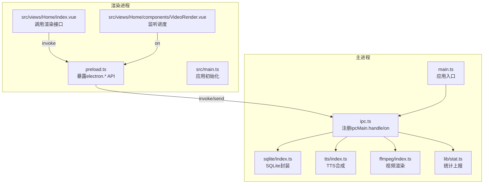
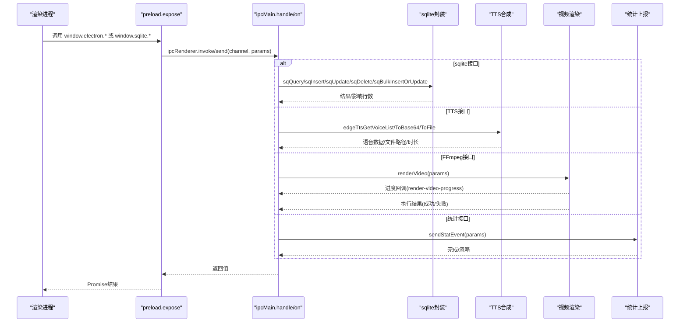
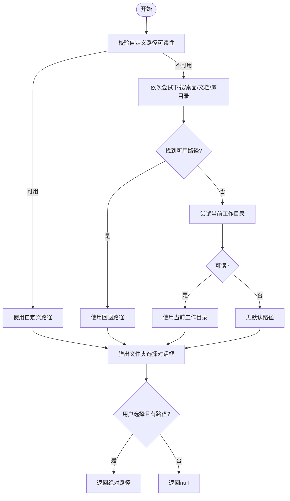
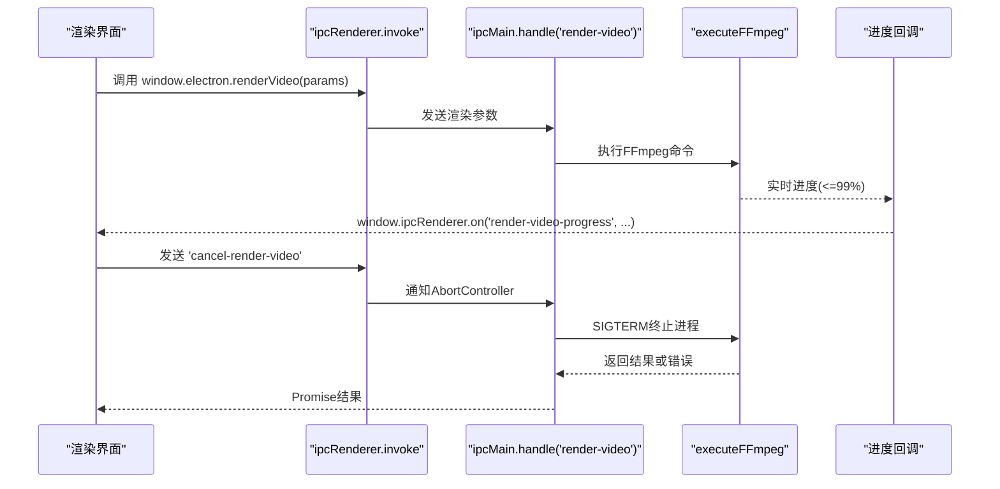
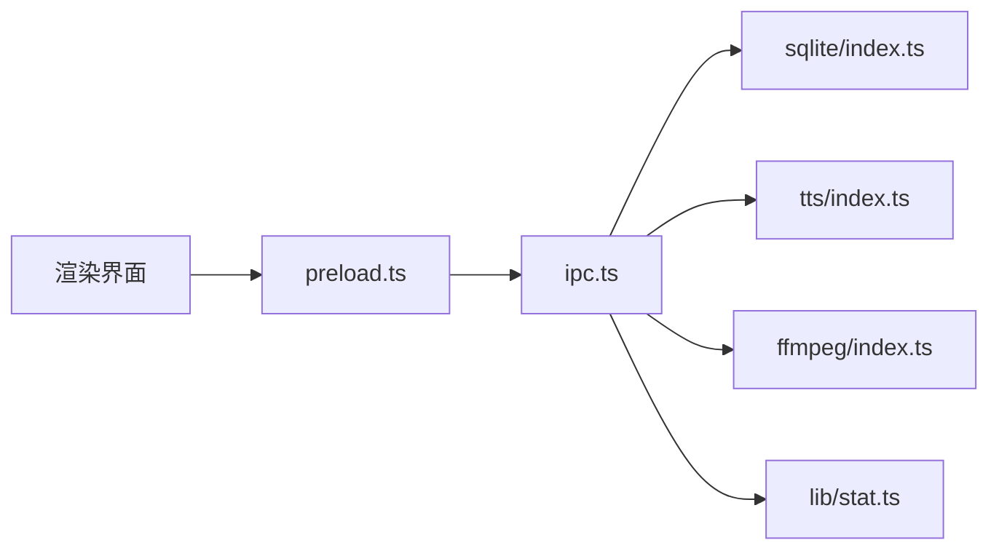

# IPC接口规范

<cite>
**本文档引用的文件**
- [electron/ipc.ts](file://electron/ipc.ts)
- [electron/preload.ts](file://electron/preload.ts)
- [electron/types.ts](file://electron/types.ts)
- [electron/sqlite/types.ts](file://electron/sqlite/types.ts)
- [electron/tts/types.ts](file://electron/tts/types.ts)
- [electron/ffmpeg/types.ts](file://electron/ffmpeg/types.ts)
- [electron/main.ts](file://electron/main.ts)
- [electron/sqlite/index.ts](file://electron/sqlite/index.ts)
- [electron/tts/index.ts](file://electron/tts/index.ts)
- [electron/ffmpeg/index.ts](file://electron/ffmpeg/index.ts)
- [electron/lib/stat.ts](file://electron/lib/stat.ts)
- [electron/electron-env.d.ts](file://electron/electron-env.d.ts)
- [src/main.ts](file://src/main.ts)
- [src/views/Home/index.vue](file://src/views/Home/index.vue)
- [src/views/Home/components/VideoRender.vue](file://src/views/Home/components/VideoRender.vue)
</cite>

## 目录
1. [简介](#简介)
2. [项目结构](#项目结构)
3. [核心组件](#核心组件)
4. [架构总览](#架构总览)
5. [详细组件分析](#详细组件分析)
6. [依赖关系分析](#依赖关系分析)
7. [性能考虑](#性能考虑)
8. [故障排除指南](#故障排除指南)
9. [结论](#结论)
10. [附录](#附录)

## 简介
本文件为短视频工厂项目的IPC通信层接口规范，覆盖主进程与渲染进程之间的消息传递接口，包括文件系统操作、外部程序调用、系统功能访问、数据库操作、TTS语音合成、视频渲染等能力。文档详细说明每个接口的方法签名、参数类型定义、返回值格式与错误处理机制，并提供实际调用示例与使用场景，帮助开发者快速集成与扩展。

## 项目结构
IPC相关代码主要分布在以下位置：
- 主进程IPC注册与处理：electron/ipc.ts
- 渲染进程桥接暴露：electron/preload.ts
- 类型定义：electron/types.ts、electron/sqlite/types.ts、electron/tts/types.ts、electron/ffmpeg/types.ts
- 具体功能实现：electron/sqlite/index.ts、electron/tts/index.ts、electron/ffmpeg/index.ts、electron/lib/stat.ts
- 应用入口与调用示例：electron/main.ts、src/main.ts、src/views/Home/index.vue、src/views/Home/components/VideoRender.vue

**图表来源**
- [electron/preload.ts:1-75](file://electron/preload.ts#L1-L75)
- [electron/ipc.ts:77-187](file://electron/ipc.ts#L77-L187)
- [electron/sqlite/index.ts:38-154](file://electron/sqlite/index.ts#L38-L154)
- [electron/tts/index.ts:1-86](file://electron/tts/index.ts#L1-L86)
- [electron/ffmpeg/index.ts:26-272](file://electron/ffmpeg/index.ts#L26-L272)
- [electron/lib/stat.ts:1-80](file://electron/lib/stat.ts#L1-L80)
- [electron/main.ts:187-204](file://electron/main.ts#L187-L204)

**章节来源**
- [electron/ipc.ts:77-187](file://electron/ipc.ts#L77-L187)
- [electron/preload.ts:18-75](file://electron/preload.ts#L18-L75)
- [electron/main.ts:187-204](file://electron/main.ts#L187-L204)

## 核心组件
- IPC注册与处理：在主进程中通过ipcMain.handle/on注册各类接口，统一管理窗口控制、文件系统、外部程序、TTS、视频渲染、统计上报等。
- 预加载桥接：在preload中通过contextBridge将安全的API暴露给渲染进程，包含通用ipcRenderer方法与特定功能API。
- 数据库封装：基于better-sqlite3提供查询、插入、更新、删除、批量插入或更新等接口。
- TTS合成：提供语音列表获取、文本转语音为Base64、保存为文件并可选生成字幕。
- 视频渲染：基于FFmpeg进行多视频片段拼接、音频混合、响度归一化、字幕叠加与编码输出。
- 统计上报：按配置条件向远端服务发送事件统计，支持开发与生产模式差异。

**章节来源**
- [electron/ipc.ts:77-187](file://electron/ipc.ts#L77-L187)
- [electron/preload.ts:18-75](file://electron/preload.ts#L18-L75)
- [electron/sqlite/index.ts:38-154](file://electron/sqlite/index.ts#L38-L154)
- [electron/tts/index.ts:1-86](file://electron/tts/index.ts#L1-L86)
- [electron/ffmpeg/index.ts:26-272](file://electron/ffmpeg/index.ts#L26-L272)
- [electron/lib/stat.ts:1-80](file://electron/lib/stat.ts#L1-L80)

## 架构总览
下图展示IPC从渲染进程到主进程再到具体功能模块的调用链路与数据流向。

**图表来源**
- [electron/preload.ts:20-74](file://electron/preload.ts#L20-L74)
- [electron/ipc.ts:77-187](file://electron/ipc.ts#L77-L187)
- [electron/sqlite/index.ts:63-135](file://electron/sqlite/index.ts#L63-L135)
- [electron/tts/index.ts:35-85](file://electron/tts/index.ts#L35-L85)
- [electron/ffmpeg/index.ts:26-244](file://electron/ffmpeg/index.ts#L26-L244)
- [electron/lib/stat.ts:39-80](file://electron/lib/stat.ts#L39-L80)

## 详细组件分析

### 接口总览与分类
- 窗口控制类
  - is-win-maxed：查询窗口是否最大化
  - win-min：最小化窗口
  - win-max：最大化/还原窗口
  - win-close：关闭窗口
- 文件系统与对话框
  - open-external：打开外部链接
  - select-folder：选择文件夹（带标题与默认路径回退策略）
  - list-files-from-folder：列出文件夹内所有文件（仅文件，非子目录）
- 数据库操作
  - sqlite-query：SQL查询
  - sqlite-insert：插入
  - sqlite-update：更新
  - sqlite-delete：删除
  - sqlite-bulk-insert-or-update：按id冲突合并
- 系统功能与统计
  - stat-track：统计事件上报
- TTS语音合成
  - edge-tts-get-voice-list：获取可用语音列表
  - edge-tts-synthesize-to-base64：文本转语音为Base64
  - edge-tts-synthesize-to-file：文本转语音保存为文件（可选生成字幕）
- 视频渲染
  - render-video：多片段拼接、音频混合、响度归一化、字幕叠加、编码输出
  - 渲染进度：主进程向渲染进程发送 render-video-progress

**章节来源**
- [electron/ipc.ts:77-187](file://electron/ipc.ts#L77-L187)
- [electron/preload.ts:49-74](file://electron/preload.ts#L49-L74)
- [electron/types.ts:1-26](file://electron/types.ts#L1-L26)
- [electron/sqlite/types.ts:1-26](file://electron/sqlite/types.ts#L1-L26)
- [electron/tts/types.ts:1-20](file://electron/tts/types.ts#L1-L20)
- [electron/ffmpeg/types.ts:1-23](file://electron/ffmpeg/types.ts#L1-L23)

### 窗口控制接口
- 方法签名与调用方式
  - 查询最大化：window.electron.isWinMaxed()
  - 最小化：window.electron.winMin()
  - 最大化/还原：window.electron.winMax()
  - 关闭：window.electron.winClose()
- 参数与返回
  - isWinMaxed：无参数，返回布尔值
  - win-min/win-max/win-close：无参数，无返回
- 错误处理
  - 通过主进程BrowserWindow上下文获取失败时抛出异常
- 使用场景
  - 快捷键绑定、菜单项状态同步、全屏切换

**章节来源**
- [electron/ipc.ts:89-112](file://electron/ipc.ts#L89-L112)
- [electron/preload.ts:50-53](file://electron/preload.ts#L50-L53)

### 外部链接与文件夹选择
- open-external
  - 参数：OpenExternalParams.url
  - 返回：无
  - 错误：由shell.openExternal内部处理
- select-folder
  - 参数：SelectFolderParams（title、defaultPath）
  - 默认路径回退策略：优先自定义路径可读性校验；否则尝试下载、桌面、文档、家目录；最后尝试当前工作目录；均不可用则记录警告
  - 返回：选中的绝对路径或null
  - 错误：无法获取窗口时抛出错误
- list-files-from-folder
  - 参数：ListFilesFromFolderParams.folderPath
  - 返回：文件名与路径数组（路径统一为/分隔）
  - 错误：文件系统异常抛出

**图表来源**
- [electron/ipc.ts:119-144](file://electron/ipc.ts#L119-L144)
- [electron/ipc.ts:29-75](file://electron/ipc.ts#L29-L75)

**章节来源**
- [electron/ipc.ts:114-155](file://electron/ipc.ts#L114-L155)
- [electron/types.ts:1-26](file://electron/types.ts#L1-L26)

### 数据库操作接口
- 接口映射
  - sqlite-query -> sqQuery
  - sqlite-insert -> sqInsert
  - sqlite-update -> sqUpdate
  - sqlite-delete -> sqDelete
  - sqlite-bulk-insert-or-update -> sqBulkInsertOrUpdate
- 参数类型
  - QueryParams：sql与可选参数数组
  - InsertParams：表名与数据对象
  - UpdateParams：表名、数据对象、条件字符串
  - DeleteParams：表名、条件字符串
  - BulkInsertOrUpdateParams：表名与数据数组（按id冲突合并）
- 返回值
  - sqQuery：查询结果数组
  - sqInsert：返回新增行的id
  - sqUpdate：返回受影响行数
  - sqDelete：无返回
  - sqBulkInsertOrUpdate：无返回
- 错误处理
  - SQL语法错误、约束冲突、连接异常等由底层数据库抛出

**章节来源**
- [electron/ipc.ts:78-87](file://electron/ipc.ts#L78-L87)
- [electron/preload.ts:67-74](file://electron/preload.ts#L67-L74)
- [electron/sqlite/types.ts:1-26](file://electron/sqlite/types.ts#L1-L26)
- [electron/sqlite/index.ts:63-135](file://electron/sqlite/index.ts#L63-L135)

### 统计事件上报
- 接口：stat-track
- 参数：StatEventParams（title、screen、language、url、userAgent）
- 行为：根据环境变量与模式决定是否发送；构造payload并POST到远端统计服务；开发模式下失败会打印警告
- 返回：Promise<void>，成功或被忽略
- 使用场景：页面访问、功能使用、错误上报等

**章节来源**
- [electron/ipc.ts:160-161](file://electron/ipc.ts#L160-L161)
- [electron/preload.ts:64](file://electron/preload.ts#L64)
- [electron/types.ts:19-25](file://electron/types.ts#L19-L25)
- [electron/lib/stat.ts:39-80](file://electron/lib/stat.ts#L39-L80)

### TTS语音合成
- 接口映射
  - edge-tts-get-voice-list -> edgeTtsGetVoiceList
  - edge-tts-synthesize-to-base64 -> edgeTtsSynthesizeToBase64
  - edge-tts-synthesize-to-file -> edgeTtsSynthesizeToFile
- 参数类型
  - EdgeTtsSynthesizeCommonParams：text、voice、options
  - EdgeTtsSynthesizeToFileParams：继承common并可选withCaption、outputPath
- 返回值
  - get-voice-list：语音列表
  - to-base64：Base64字符串
  - to-file：包含duration的对象
- 错误处理
  - 音频元数据解析失败或时长无效时抛出错误
  - 临时文件清理在应用退出前执行

**章节来源**
- [electron/ipc.ts:157-169](file://electron/ipc.ts#L157-L169)
- [electron/preload.ts:58-64](file://electron/preload.ts#L58-L64)
- [electron/tts/types.ts:1-20](file://electron/tts/types.ts#L1-L20)
- [electron/tts/index.ts:35-85](file://electron/tts/index.ts#L35-L85)

### 视频渲染
- 接口：render-video
- 参数：RenderVideoParams（视频文件数组、时间范围、音频文件、字幕、输出尺寸、输出路径、可选时长、音量配置）
- 进度回调：主进程在渲染过程中向渲染进程发送 render-video-progress
- 取消机制：渲染期间渲染进程发送 cancel-render-video，主进程终止FFmpeg进程
- 返回：执行结果对象（stdout、stderr、code）
- 错误处理：FFmpeg启动失败、执行失败、输出路径不存在、Windows可执行权限校验失败等

**图表来源**
- [electron/ipc.ts:171-186](file://electron/ipc.ts#L171-L186)
- [electron/preload.ts:63](file://electron/preload.ts#L63)
- [electron/ffmpeg/index.ts:26-244](file://electron/ffmpeg/index.ts#L26-L244)
- [src/views/Home/index.vue:156-177](file://src/views/Home/index.vue#L156-L177)
- [src/views/Home/index.vue:229-231](file://src/views/Home/index.vue#L229-L231)
- [src/views/Home/components/VideoRender.vue:196-199](file://src/views/Home/components/VideoRender.vue#L196-L199)

**章节来源**
- [electron/ipc.ts:171-186](file://electron/ipc.ts#L171-L186)
- [electron/ffmpeg/types.ts:7-23](file://electron/ffmpeg/types.ts#L7-L23)
- [electron/ffmpeg/index.ts:26-244](file://electron/ffmpeg/index.ts#L26-L244)
- [src/views/Home/index.vue:156-177](file://src/views/Home/index.vue#L156-L177)
- [src/views/Home/index.vue:229-231](file://src/views/Home/index.vue#L229-L231)
- [src/views/Home/components/VideoRender.vue:196-199](file://src/views/Home/components/VideoRender.vue#L196-L199)

### 类型定义与API暴露
- 渲染进程暴露的API命名空间
  - window.ipcRenderer：on/once/off/send/invoke
  - window.electron：窗口控制、外部链接、文件夹选择、文件列表、TTS、渲染、统计
  - window.sqlite：数据库操作
- TypeScript声明文件提供类型提示

**章节来源**
- [electron/preload.ts:20-74](file://electron/preload.ts#L20-L74)
- [electron/electron-env.d.ts:52-61](file://electron/electron-env.d.ts#L52-L61)

## 依赖关系分析
- 模块耦合
  - ipc.ts集中注册所有接口，耦合度高但职责清晰
  - preload.ts仅负责桥接，低耦合高内聚
  - 功能模块（sqlite/tts/ffmpeg/stat）通过函数调用被ipc.ts复用
- 外部依赖
  - better-sqlite3：本地数据库
  - ffmpeg-static：视频处理
  - axios：统计上报HTTP请求
- 潜在循环依赖
  - 未发现直接循环依赖；各模块通过函数调用解耦

**图表来源**
- [electron/preload.ts:1-75](file://electron/preload.ts#L1-L75)
- [electron/ipc.ts:1-187](file://electron/ipc.ts#L1-L187)
- [electron/sqlite/index.ts:1-154](file://electron/sqlite/index.ts#L1-L154)
- [electron/tts/index.ts:1-86](file://electron/tts/index.ts#L1-L86)
- [electron/ffmpeg/index.ts:1-272](file://electron/ffmpeg/index.ts#L1-L272)
- [electron/lib/stat.ts:1-80](file://electron/lib/stat.ts#L1-L80)

**章节来源**
- [electron/ipc.ts:1-187](file://electron/ipc.ts#L1-L187)
- [electron/preload.ts:1-75](file://electron/preload.ts#L1-L75)

## 性能考虑
- 渲染进度回调
  - FFmpeg输出解析实时进度，上限限制在99%，完成后触发100%
- 取消机制
  - 使用AbortController中断进程，避免长时间阻塞
- 文件系统与路径
  - 选择文件夹时采用多级回退策略，减少失败概率
- 统计上报
  - 异步POST，超时控制，开发模式下静默失败

**章节来源**
- [electron/ffmpeg/index.ts:211-244](file://electron/ffmpeg/index.ts#L211-L244)
- [electron/ipc.ts:178-186](file://electron/ipc.ts#L178-L186)
- [electron/ipc.ts:120-144](file://electron/ipc.ts#L120-L144)
- [electron/lib/stat.ts:63-80](file://electron/lib/stat.ts#L63-L80)

## 故障排除指南
- 无法获取窗口
  - 现象：选择文件夹接口抛出“无法获取窗口”
  - 原因：BrowserWindow上下文丢失
  - 处理：确保在有效窗口上下文中调用
- 默认路径不可用
  - 现象：选择文件夹无默认路径或警告
  - 原因：下载/桌面/文档/家目录均不可读
  - 处理：检查系统权限与路径有效性
- FFmpeg不可用
  - 现象：渲染报错或找不到可执行文件
  - 原因：Windows缺少执行权限或路径不正确
  - 处理：确认安装与权限，或在开发环境使用内置静态资源
- 统计上报失败
  - 现象：开发模式下无日志，生产模式下失败
  - 原因：网络或服务端问题
  - 处理：检查ANALYTICS_IN_DEV配置与网络连通性

**章节来源**
- [electron/ipc.ts:120-144](file://electron/ipc.ts#L120-L144)
- [electron/ffmpeg/index.ts:246-259](file://electron/ffmpeg/index.ts#L246-L259)
- [electron/lib/stat.ts:39-80](file://electron/lib/stat.ts#L39-L80)

## 结论
本IPC接口规范系统性地梳理了主进程与渲染进程之间的消息通道，覆盖窗口控制、文件系统、数据库、TTS、视频渲染与统计上报等核心能力。通过明确的参数类型、返回值与错误处理机制，以及实际调用示例与流程图，开发者可以快速理解并集成这些接口。建议在后续迭代中持续完善类型声明与错误码约定，增强接口的可维护性与可扩展性。

## 附录

### 版本兼容性与变更历史
- 当前仓库未发现明确的版本号或变更日志文件
- 建议在后续版本中增加CHANGELOG与语义化版本标识，以便追踪接口变更与破坏性更新

### 调用示例与使用场景
- 选择文件夹
  - 场景：用户选择素材目录
  - 调用：window.electron.selectFolder({ title: "选择素材目录", defaultPath: "/path/to/default" })
- 打开外部链接
  - 场景：帮助页跳转
  - 调用：window.electron.openExternal({ url: "https://example.com" })
- 列出文件夹内容
  - 场景：预览素材列表
  - 调用：window.electron.listFilesFromFolder({ folderPath: "/path/to/folder" })
- 统计事件上报
  - 场景：页面访问统计
  - 调用：window.electron.statTrack({ title: "首页访问", userAgent: navigator.userAgent })
- TTS合成
  - 场景：文本转语音并保存
  - 调用：window.electron.edgeTtsSynthesizeToFile({ text, voice, options, withCaption: true })
- 视频渲染
  - 场景：批量视频拼接与导出
  - 调用：window.electron.renderVideo(renderParams)
  - 进度监听：window.ipcRenderer.on("render-video-progress", (p) => {...})
  - 取消：window.ipcRenderer.send("cancel-render-video")

**章节来源**
- [electron/preload.ts:54-64](file://electron/preload.ts#L54-L64)
- [src/views/Home/index.vue:156-177](file://src/views/Home/index.vue#L156-L177)
- [src/views/Home/index.vue:229-231](file://src/views/Home/index.vue#L229-L231)
- [src/views/Home/components/VideoRender.vue:196-199](file://src/views/Home/components/VideoRender.vue#L196-L199)