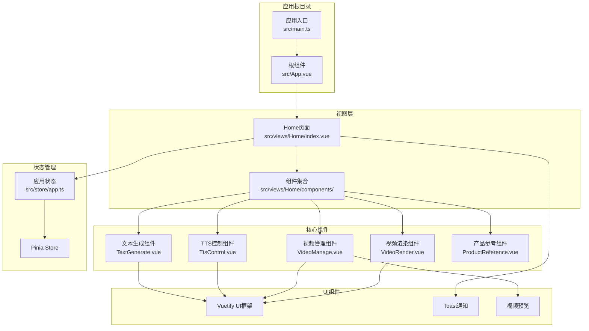
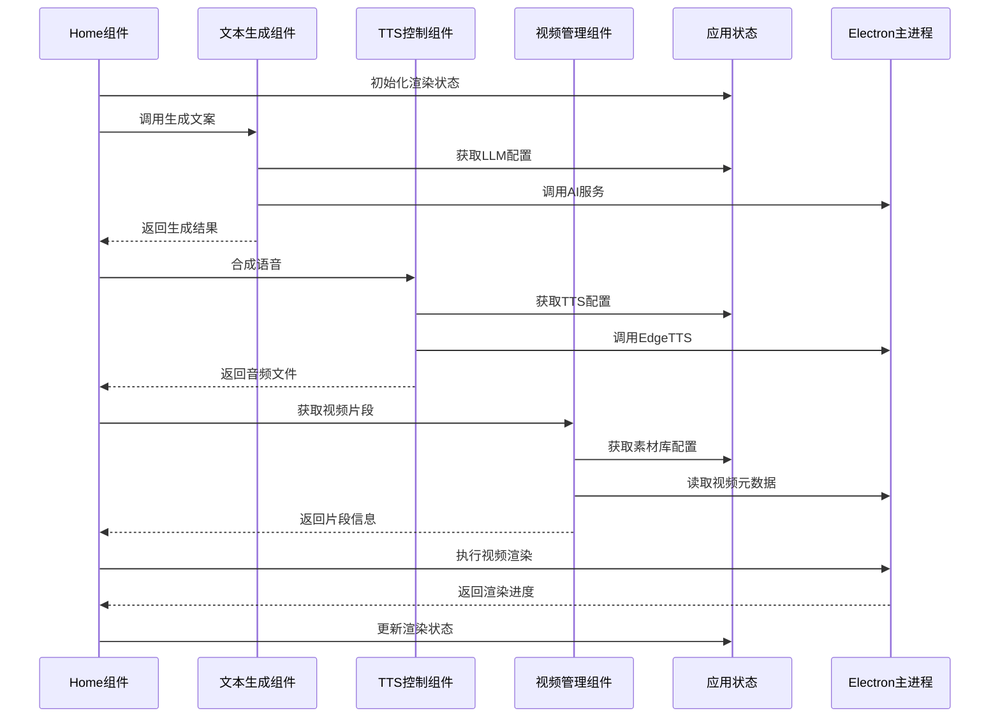
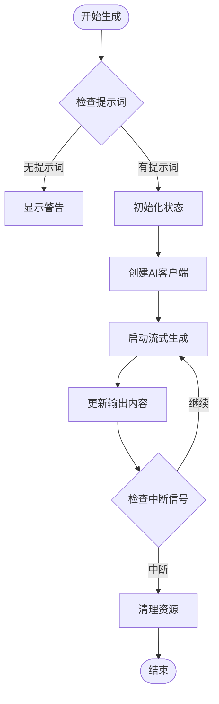
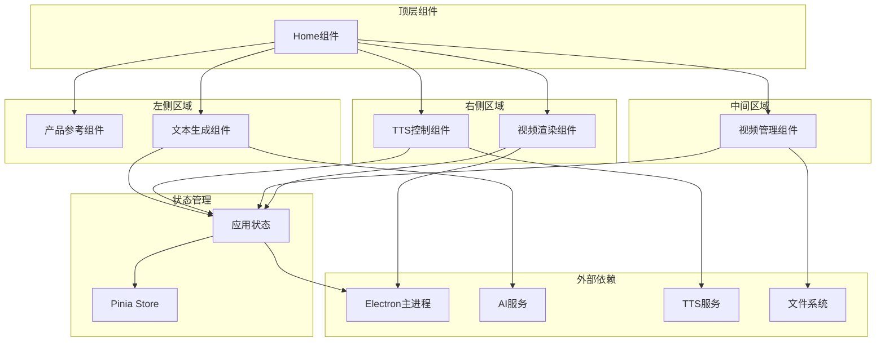

# Vue组件API

<cite>
**本文档引用的文件**
- [Home/index.vue](file://src/views/Home/index.vue)
- [TextGenerate.vue](file://src/views/Home/components/TextGenerate.vue)
- [TtsControl.vue](file://src/views/Home/components/TtsControl.vue)
- [VideoManage.vue](file://src/views/Home/components/VideoManage.vue)
- [VideoRender.vue](file://src/views/Home/components/VideoRender.vue)
- [ProductReference.vue](file://src/views/Home/components/ProductReference.vue)
- [VideoAutoPreview.vue](file://src/components/VideoAutoPreview.vue)
- [ActionToastEmbed.vue](file://src/components/ActionToastEmbed.vue)
- [app.ts](file://src/store/app.ts)
- [index.ts](file://src/router/index.ts)
</cite>

## 目录
1. [简介](#简介)
2. [项目结构](#项目结构)
3. [核心组件](#核心组件)
4. [架构概览](#架构概览)
5. [详细组件分析](#详细组件分析)
6. [依赖关系分析](#依赖关系分析)
7. [性能考虑](#性能考虑)
8. [故障排除指南](#故障排除指南)
9. [结论](#结论)

## 简介

这是一个基于Vue 3的短视频工厂应用，提供了完整的视频内容创作工作流。本文档详细记录了Home页面四个核心功能组件的公共API接口，包括属性(props)、事件(events)、方法(methods)和插槽(slots)的完整定义。系统采用Pinia状态管理，通过组件间通信实现完整的视频渲染流程。

## 项目结构

该项目采用模块化的Vue 3架构设计，主要目录结构如下：

**图表来源**
- [index.ts:1-22](file://src/router/index.ts#L1-L22)
- [app.ts:1-147](file://src/store/app.ts#L1-L147)

**章节来源**
- [index.ts:1-22](file://src/router/index.ts#L1-L22)

## 核心组件

本系统包含四个核心功能组件，每个组件都有明确的职责分工：

### 组件职责矩阵

| 组件名称 | 主要职责 | 关键功能 | 状态管理 |
|---------|----------|----------|----------|
| TextGenerate | 文本生成与LLM集成 | AI文案生成、配置管理、实时流式输出 | LLM配置、生成状态 |
| TtsControl | 语音合成控制 | EdgeTTS语音合成、试听功能、参数配置 | TTS配置、语音列表 |
| VideoManage | 视频素材管理 | 素材库管理、智能匹配、分析统计 | 素材库、分析状态 |
| VideoRender | 视频渲染控制 | 渲染流程控制、进度监控、配置管理 | 渲染状态、输出配置 |

**章节来源**
- [TextGenerate.vue:1-272](file://src/views/Home/components/TextGenerate.vue#L1-L272)
- [TtsControl.vue:1-234](file://src/views/Home/components/TtsControl.vue#L1-L234)
- [VideoManage.vue:1-394](file://src/views/Home/components/VideoManage.vue#L1-L394)
- [VideoRender.vue:1-276](file://src/views/Home/components/VideoRender.vue#L1-L276)

## 架构概览

系统采用分层架构设计，通过Pinia进行状态管理，组件间通过props和events进行通信：

**图表来源**
- [Home/index.vue:84-281](file://src/views/Home/index.vue#L84-L281)
- [app.ts:6-14](file://src/store/app.ts#L6-L14)

## 详细组件分析

### TextGenerate 组件API

TextGenerate组件负责AI文案生成功能，是整个视频创作流程的起点。

#### 属性定义

| 属性名 | 类型 | 默认值 | 必填 | 描述 |
|--------|------|--------|------|------|
| disabled | boolean | false | 否 | 控制组件禁用状态 |

#### 方法定义

| 方法名 | 参数 | 返回值 | 描述 |
|--------|------|--------|------|
| handleGenerate | options?: { noToast?: boolean; productContext?: string } | Promise<string> | 开始生成文案，支持传入产品上下文 |
| handleStopGenerate | - | void | 停止当前生成任务 |
| getCurrentOutputText | - | string | 获取当前输出的文案内容 |
| clearOutputText | - | void | 清空输出框内容 |

#### 事件定义

组件内部使用defineExpose暴露方法，供父组件调用。

#### 生命周期钩子

- setup阶段初始化：创建响应式状态、配置对话框、测试状态
- 组件挂载：监听生成状态变化

#### 数据流

**图表来源**
- [TextGenerate.vue:132-193](file://src/views/Home/components/TextGenerate.vue#L132-L193)

**章节来源**
- [TextGenerate.vue:124-126](file://src/views/Home/components/TextGenerate.vue#L124-L126)
- [TextGenerate.vue:257-266](file://src/views/Home/components/TextGenerate.vue#L257-L266)

### TtsControl 组件API

TtsControl组件负责语音合成控制，提供完整的TTS功能。

#### 属性定义

| 属性名 | 类型 | 默认值 | 必填 | 描述 |
|--------|------|--------|------|------|
| disabled | boolean | false | 否 | 控制组件禁用状态 |

#### 方法定义

| 方法名 | 参数 | 返回值 | 描述 |
|--------|------|--------|------|
| synthesizedSpeechToFile | { text: string; withCaption?: boolean } | Promise<any> | 将文本合成到音频文件，支持字幕生成 |

#### 计算属性

| 计算属性 | 类型 | 描述 |
|----------|------|------|
| filteredVoicesList | EdgeTTSVoice[] | 根据语言和性别过滤的语音列表 |
| genderItems | Array | 性别选项列表 |
| speedItems | Array | 语速选项列表 |

#### 生命周期钩子

- onMounted: 加载语音列表，验证当前语音有效性
- onUnmounted: 清理音频播放资源

#### 错误处理

组件内置完善的错误处理机制，包括：
- 语音列表加载失败
- 试听音频播放失败  
- 语音合成失败
- 配置验证失败

**章节来源**
- [TtsControl.vue:71-73](file://src/views/Home/components/TtsControl.vue#L71-L73)
- [TtsControl.vue:209-228](file://src/views/Home/components/TtsControl.vue#L209-L228)

### VideoManage 组件API

VideoManage组件负责视频素材库管理，提供智能匹配和分析功能。

#### 属性定义

| 属性名 | 类型 | 默认值 | 必填 | 描述 |
|--------|------|--------|------|------|
| disabled | boolean | false | 否 | 控制组件禁用状态 |

#### 方法定义

| 方法名 | 参数 | 返回值 | 描述 |
|--------|------|--------|------|
| getVideoSegments | { duration: number } | Promise<RenderVideoParams> | 获取指定时长的视频片段组合 |

#### 计算属性

| 计算属性 | 类型 | 描述 |
|----------|------|------|
| hasVLConfig | boolean | 检查视觉分析配置是否完整 |
| analysisStatsText | string | 分析统计文本 |

#### 事件监听

组件监听以下IPC事件：
- `vl-analysis-progress`: 视频分析进度更新
- `render-video-progress`: 渲染进度更新

#### 数据缓存

- videoDurationCache: 视频时长缓存，避免重复读取
- videoAssets: 当前素材库内容

**章节来源**
- [VideoManage.vue:114-116](file://src/views/Home/components/VideoManage.vue#L114-L116)
- [VideoManage.vue:282-386](file://src/views/Home/components/VideoManage.vue#L282-L386)

### VideoRender 组件API

VideoRender组件负责视频渲染流程控制，提供完整的渲染管理界面。

#### 属性定义

组件不接受外部属性。

#### 事件定义

| 事件名 | 参数 | 描述 |
|--------|------|------|
| renderVideo | - | 触发视频渲染开始 |
| cancelRender | - | 触发视频渲染取消 |

#### 计算属性

| 计算属性 | 类型 | 描述 |
|----------|------|------|
| taskInProgress | boolean | 检查是否有正在进行的任务 |
| renderProgress | number | 渲染进度百分比 |

#### 配置管理

组件维护两套配置：
- renderConfig: 渲染输出配置
- vlConfig: 视觉分析配置

#### 进度监控

通过IPC监听渲染进度：
- `render-video-progress`: 实时进度更新

**章节来源**
- [VideoRender.vue:210-213](file://src/views/Home/components/VideoRender.vue#L210-L213)
- [VideoRender.vue:215-221](file://src/views/Home/components/VideoRender.vue#L215-L221)

### ProductReference 组件API

ProductReference组件负责产品参考管理，为AI生成提供产品上下文。

#### 属性定义

组件不接受外部属性。

#### 方法定义

| 方法名 | 参数 | 返回值 | 描述 |
|--------|------|--------|------|
| handleSelectProduct | id: string | void | 选择产品 |
| handleAnalyzeProduct | - | Promise<void> | 分析产品外观特征 |
| handleDeleteProduct | - | Promise<void> | 删除产品 |

#### 计算属性

| 计算属性 | 类型 | 描述 |
|----------|------|------|
| productItems | Array | 产品下拉列表项 |
| currentImagePaths | string[] | 当前产品图片路径数组 |
| currentColors | string[] | 当前产品颜色标签 |
| currentTags | string[] | 当前产品特征标签 |
| hasVLConfig | boolean | 检查视觉分析配置 |

#### 对话框管理

- showAddDialog: 新增产品对话框显示状态
- saveLoading: 保存操作加载状态

**章节来源**
- [ProductReference.vue:184-190](file://src/views/Home/components/ProductReference.vue#L184-L190)
- [ProductReference.vue:192-205](file://src/views/Home/components/ProductReference.vue#L192-L205)

### VideoAutoPreview 组件API

VideoAutoPreview组件提供视频文件的自动预览功能。

#### 属性定义

| 属性名 | 类型 | 默认值 | 必填 | 描述 |
|--------|------|--------|------|------|
| asset | ListFilesFromFolderRecord | - | 是 | 视频文件对象 |

#### 方法定义

| 方法名 | 参数 | 返回值 | 描述 |
|--------|------|--------|------|
| handleMouseEnter | - | void | 鼠标悬停时开始播放 |
| handleMouseLeave | - | void | 鼠标离开时暂停播放 |

#### 计算属性

| 计算属性 | 类型 | 描述 |
|----------|------|------|
| fileSrc | string | 本地文件URL地址 |

**章节来源**
- [VideoAutoPreview.vue:20-26](file://src/components/VideoAutoPreview.vue#L20-L26)

## 依赖关系分析

系统组件间的依赖关系呈现清晰的层次结构：

**图表来源**
- [Home/index.vue:36-49](file://src/views/Home/index.vue#L36-L49)
- [app.ts:16-140](file://src/store/app.ts#L16-L140)

### 组件间通信机制

系统采用多种通信机制确保组件协作：

1. **Props传递**: 父组件向子组件传递配置和状态
2. **事件发射**: 子组件向父组件发送用户交互事件
3. **方法暴露**: 子组件通过defineExpose暴露内部方法
4. **状态共享**: 通过Pinia共享全局状态

**章节来源**
- [Home/index.vue:13-30](file://src/views/Home/index.vue#L13-L30)
- [app.ts:73-79](file://src/store/app.ts#L73-L79)

## 性能考虑

### 响应式数据优化

1. **计算属性缓存**: 使用computed缓存昂贵的计算结果
2. **条件渲染**: 仅在需要时渲染复杂组件
3. **懒加载**: 延迟加载大型资源

### 内存管理

1. **资源清理**: 在组件卸载时清理定时器和事件监听器
2. **缓存策略**: 合理使用缓存避免重复计算
3. **音频资源**: 及时释放音频播放资源

### 异步操作优化

1. **并发控制**: 避免同时发起多个耗时请求
2. **错误恢复**: 提供优雅的错误处理和重试机制
3. **进度反馈**: 实时更新用户操作进度

## 故障排除指南

### 常见问题诊断

#### 文本生成问题
- 检查LLM配置是否正确
- 验证网络连接状态
- 查看AI服务返回的错误信息

#### TTS合成问题
- 确认语音列表加载成功
- 检查语音配置的有效性
- 验证EdgeTTS服务可用性

#### 视频管理问题
- 检查素材文件夹权限
- 验证视频文件格式支持
- 确认文件系统访问权限

#### 渲染流程问题
- 监控渲染状态变化
- 检查输出配置完整性
- 验证磁盘空间充足

### 调试技巧

1. **日志记录**: 使用console.log记录关键状态变化
2. **状态检查**: 定期检查Pinia状态同步
3. **错误捕获**: 使用try-catch包装异步操作
4. **进度监控**: 实时跟踪各阶段执行状态

**章节来源**
- [TextGenerate.vue:160-188](file://src/views/Home/components/TextGenerate.vue#L160-L188)
- [TtsControl.vue:112-137](file://src/views/Home/components/TtsControl.vue#L112-L137)
- [VideoManage.vue:156-178](file://src/views/Home/components/VideoManage.vue#L156-L178)

## 结论

本Vue组件系统提供了完整的短视频创作解决方案，具有以下特点：

1. **模块化设计**: 四个核心组件职责清晰，便于维护和扩展
2. **状态统一管理**: 通过Pinia实现全局状态共享
3. **完善的错误处理**: 每个组件都具备健壮的错误处理机制
4. **用户体验优化**: 提供丰富的进度反馈和配置选项
5. **可扩展性**: 组件接口设计支持后续功能扩展

系统采用现代化的Vue 3技术栈，结合Electron实现桌面应用，为用户提供高效的视频内容创作体验。通过标准化的API设计和清晰的组件边界，为后续的功能扩展和维护奠定了良好基础。