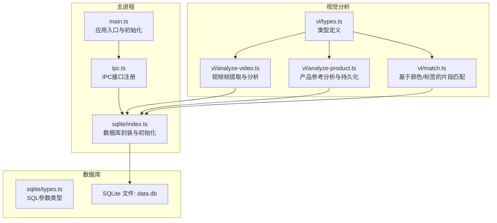
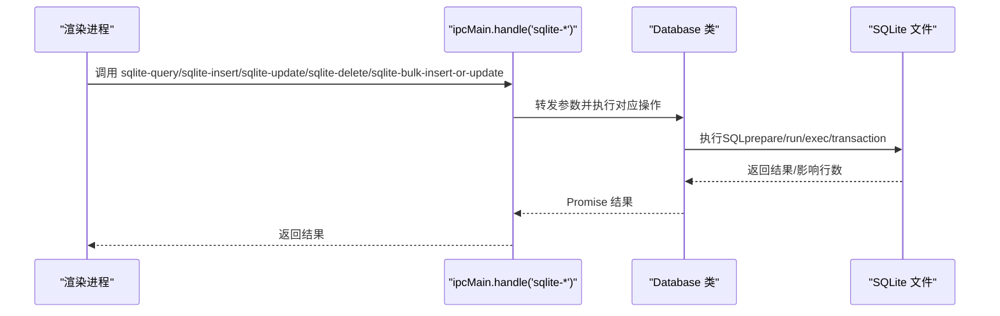
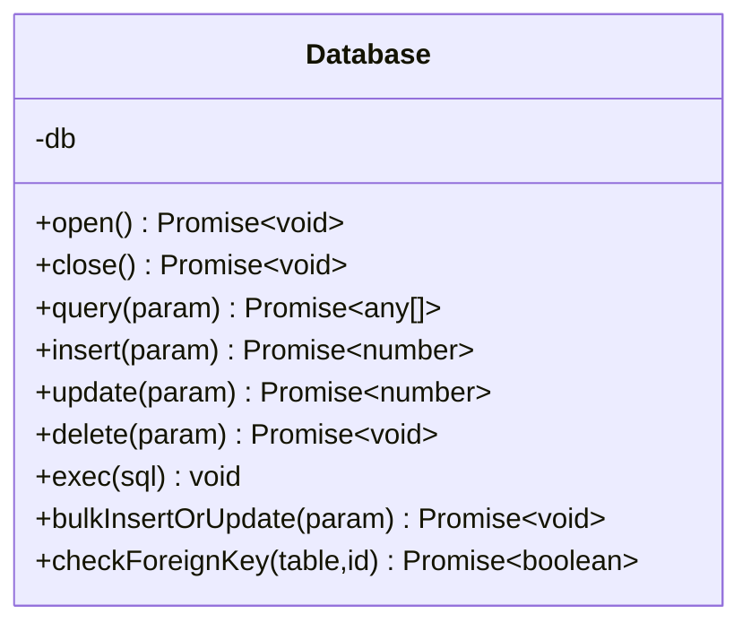
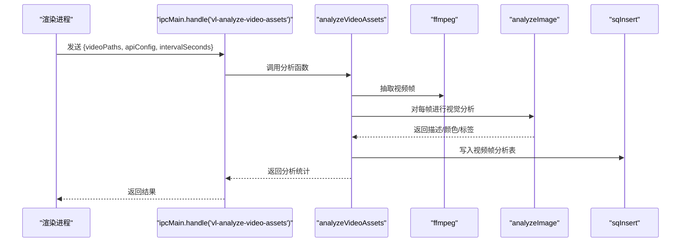
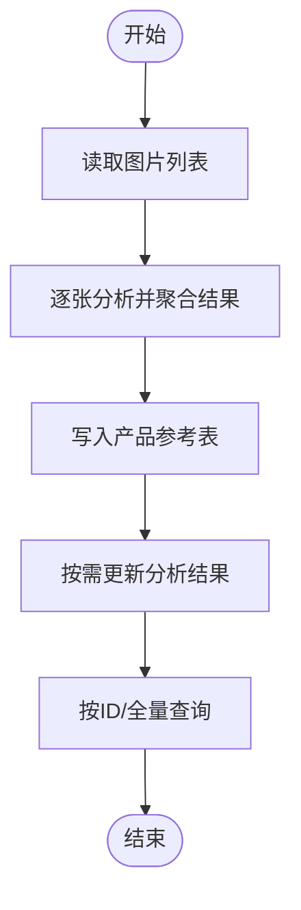
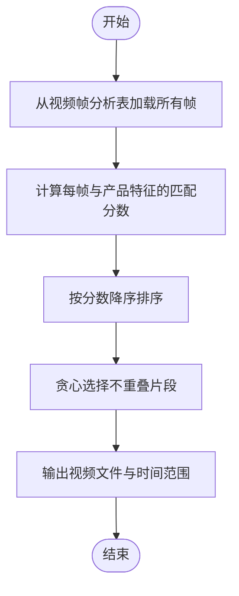
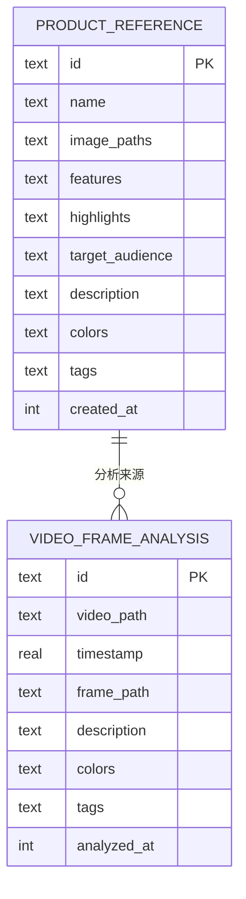
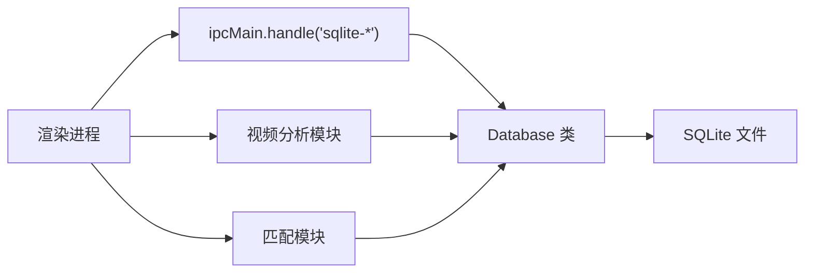

# 数据库API

<cite>
**本文引用的文件**
- [electron/sqlite/index.ts](file://electron/sqlite/index.ts)
- [electron/sqlite/types.ts](file://electron/sqlite/types.ts)
- [electron/main.ts](file://electron/main.ts)
- [electron/ipc.ts](file://electron/ipc.ts)
- [electron/vl/analyze-video.ts](file://electron/vl/analyze-video.ts)
- [electron/vl/analyze-product.ts](file://electron/vl/analyze-product.ts)
- [electron/vl/match.ts](file://electron/vl/match.ts)
- [electron/vl/types.ts](file://electron/vl/types.ts)
- [electron/vl/index.ts](file://electron/vl/index.ts)
</cite>

## 目录
1. [简介](#简介)
2. [项目结构](#项目结构)
3. [核心组件](#核心组件)
4. [架构总览](#架构总览)
5. [详细组件分析](#详细组件分析)
6. [依赖分析](#依赖分析)
7. [性能考虑](#性能考虑)
8. [故障排查指南](#故障排查指南)
9. [结论](#结论)
10. [附录](#附录)

## 简介
本文件为视频素材管理系统的数据库API文档，聚焦于SQLite数据层的设计与使用，涵盖素材信息查询、元数据存储、索引管理、CRUD操作、事务与并发控制、性能优化策略以及数据备份与迁移升级的实践建议。系统采用Electron + better-sqlite3实现本地数据库，结合IPC桥接渲染进程调用，支撑视频帧级分析、产品参考管理与智能选片匹配等核心功能。

## 项目结构
数据库相关代码主要分布在以下模块：
- 数据库封装与初始化：electron/sqlite
- IPC接口暴露：electron/ipc.ts
- 视觉分析与数据写入：electron/vl/analyze-video.ts、electron/vl/analyze-product.ts
- 匹配与查询：electron/vl/match.ts
- 类型定义：electron/vl/types.ts、electron/sqlite/types.ts

图表来源
- [electron/main.ts:187-191](file://electron/main.ts#L187-L191)
- [electron/ipc.ts:89-99](file://electron/ipc.ts#L89-L99)
- [electron/sqlite/index.ts:144-187](file://electron/sqlite/index.ts#L144-L187)
- [electron/vl/analyze-video.ts:95-177](file://electron/vl/analyze-video.ts#L95-L177)
- [electron/vl/analyze-product.ts:57-102](file://electron/vl/analyze-product.ts#L57-L102)
- [electron/vl/match.ts:67-149](file://electron/vl/match.ts#L67-L149)

章节来源
- [electron/main.ts:187-191](file://electron/main.ts#L187-L191)
- [electron/ipc.ts:89-99](file://electron/ipc.ts#L89-L99)
- [electron/sqlite/index.ts:144-187](file://electron/sqlite/index.ts#L144-L187)

## 核心组件
- 数据库封装类：提供连接、查询、插入、更新、删除、批量插入/更新、执行DDL等能力，并在初始化时启用外键约束与创建必要表及索引。
- IPC接口：将数据库操作以IPC形式暴露给渲染进程，统一命名空间为“sqlite-*”。
- 视觉分析模块：负责视频帧提取、并发分析、结果入库；产品参考分析结果持久化；基于颜色/标签的片段匹配与统计查询。
- 类型系统：明确SQL参数结构与业务实体结构，保证调用一致性与可维护性。

章节来源
- [electron/sqlite/index.ts:38-140](file://electron/sqlite/index.ts#L38-L140)
- [electron/sqlite/types.ts:1-26](file://electron/sqlite/types.ts#L1-L26)
- [electron/ipc.ts:89-99](file://electron/ipc.ts#L89-L99)
- [electron/vl/analyze-video.ts:95-177](file://electron/vl/analyze-video.ts#L95-L177)
- [electron/vl/analyze-product.ts:57-102](file://electron/vl/analyze-product.ts#L57-L102)
- [electron/vl/match.ts:67-149](file://electron/vl/match.ts#L67-L149)
- [electron/vl/types.ts:62-84](file://electron/vl/types.ts#L62-L84)

## 架构总览
数据库层通过better-sqlite3连接本地SQLite文件，主进程启动时完成初始化，创建产品参考表与视频帧分析表，并建立视频路径索引。渲染进程通过IPC调用数据库接口，实现素材管理、元数据存储与检索。

图表来源
- [electron/ipc.ts:91-99](file://electron/ipc.ts#L91-L99)
- [electron/sqlite/index.ts:63-139](file://electron/sqlite/index.ts#L63-L139)

## 详细组件分析

### 数据库封装与初始化
- 初始化流程
  - 打开数据库并启用外键约束
  - 创建产品参考表（字段：id、name、image_paths、features、highlights、target_audience、description、colors、tags、created_at）
  - 创建视频帧分析表（字段：id、video_path、timestamp、frame_path、description、colors、tags、analyzed_at）
  - 为视频帧分析表创建视频路径索引，加速按视频路径查询
- 基础操作
  - 查询：支持带参SQL与无参SQL
  - 插入：动态构造列与占位符，返回lastInsertRowid
  - 更新：动态构造SET子句与WHERE条件，返回变更行数
  - 删除：按条件删除
  - 批量插入/更新：使用UPSERT（ON CONFLICT），配合事务逐条执行
  - 执行DDL：exec直接执行SQL
- 并发与事务
  - 使用db.transaction包裹批量操作，确保原子性
  - 默认串行执行，避免竞态与锁冲突

图表来源
- [electron/sqlite/index.ts:38-140](file://electron/sqlite/index.ts#L38-L140)

章节来源
- [electron/sqlite/index.ts:144-187](file://electron/sqlite/index.ts#L144-L187)
- [electron/sqlite/index.ts:63-139](file://electron/sqlite/index.ts#L63-L139)

### IPC接口与调用约定
- 暴露的IPC名称
  - sqlite-query
  - sqlite-insert
  - sqlite-update
  - sqlite-delete
  - sqlite-bulk-insert-or-update
- 参数与返回
  - 参数类型：QueryParams、InsertParams、UpdateParams、DeleteParams、BulkInsertOrUpdateParams
  - 返回值：Promise包装的查询结果或影响行数
- 使用建议
  - 渲染进程通过ipcRenderer.invoke调用，主进程通过ipcMain.handle接收
  - 对于大体量写入，优先使用批量插入/更新接口

章节来源
- [electron/ipc.ts:89-99](file://electron/ipc.ts#L89-L99)
- [electron/sqlite/types.ts:1-26](file://electron/sqlite/types.ts#L1-L26)

### 视频帧分析与元数据存储
- 帧提取
  - 基于ffmpeg按时间间隔抽取帧，缓存至用户数据目录下的frame-cache
  - 通过并发限制函数控制同时分析的帧数量
- 分析与入库
  - 将帧转为base64，调用视觉分析接口获取描述、颜色、标签
  - 将结果写入视频帧分析表，包含视频路径、时间戳、帧路径、分析元数据与时间戳
- 增量分析
  - 在开始分析前检查是否已存在该视频的分析记录，避免重复
- 清理
  - 支持按视频清理分析数据（删除记录与本地帧文件）或全量清理

图表来源
- [electron/ipc.ts:207-224](file://electron/ipc.ts#L207-L224)
- [electron/vl/analyze-video.ts:95-177](file://electron/vl/analyze-video.ts#L95-L177)
- [electron/vl/index.ts:53-100](file://electron/vl/index.ts#L53-L100)

章节来源
- [electron/vl/analyze-video.ts:29-68](file://electron/vl/analyze-video.ts#L29-L68)
- [electron/vl/analyze-video.ts:95-177](file://electron/vl/analyze-video.ts#L95-L177)
- [electron/vl/analyze-video.ts:182-215](file://electron/vl/analyze-video.ts#L182-L215)

### 产品参考管理与元数据存储
- 分析
  - 对产品图片集合进行视觉分析，聚合描述、颜色、标签
- 保存
  - 生成唯一ID，写入产品参考表，包含基础信息与分析结果
- 更新
  - 基于ID更新分析结果字段
- 查询
  - 支持按ID查询与全量查询（按创建时间倒序）

图表来源
- [electron/vl/analyze-product.ts:14-52](file://electron/vl/analyze-product.ts#L14-L52)
- [electron/vl/analyze-product.ts:57-102](file://electron/vl/analyze-product.ts#L57-L102)
- [electron/vl/analyze-product.ts:107-124](file://electron/vl/analyze-product.ts#L107-L124)

章节来源
- [electron/vl/analyze-product.ts:57-102](file://electron/vl/analyze-product.ts#L57-L102)
- [electron/vl/analyze-product.ts:107-124](file://electron/vl/analyze-product.ts#L107-L124)

### 片段匹配与统计查询
- 匹配算法
  - 计算颜色与标签的相似度分数（颜色权重更高）
  - 对所有帧打分并排序，贪心选择不重叠的时间片段，直至达到目标时长
- 统计查询
  - 统计指定视频集合中已完成分析的视频数量与总数

图表来源
- [electron/vl/match.ts:67-149](file://electron/vl/match.ts#L67-L149)
- [electron/vl/match.ts:154-170](file://electron/vl/match.ts#L154-L170)

章节来源
- [electron/vl/match.ts:67-149](file://electron/vl/match.ts#L67-L149)
- [electron/vl/match.ts:154-170](file://electron/vl/match.ts#L154-L170)

### 数据模型与表结构
- 产品参考表（product_reference）
  - 字段：id（主键）、name、image_paths（JSON数组）、features、highlights、target_audience、description、colors（JSON数组）、tags（JSON数组）、created_at
- 视频帧分析表（video_frame_analysis）
  - 字段：id（主键）、video_path、timestamp、frame_path、description、colors（JSON数组）、tags（JSON数组）、analyzed_at
- 索引
  - idx_vfa_video_path(video_path)：加速按视频路径查询

图表来源
- [electron/sqlite/index.ts:149-181](file://electron/sqlite/index.ts#L149-L181)

章节来源
- [electron/sqlite/index.ts:149-181](file://electron/sqlite/index.ts#L149-L181)

## 依赖分析
- 组件耦合
  - 视觉分析模块依赖数据库封装进行数据持久化
  - IPC层作为统一入口，解耦渲染进程与数据库实现
- 外部依赖
  - better-sqlite3：高性能本地SQLite驱动
  - ffmpeg：视频帧提取
  - 视觉分析服务：外部API（通过请求模块调用）

图表来源
- [electron/ipc.ts:89-99](file://electron/ipc.ts#L89-L99)
- [electron/sqlite/index.ts:38-140](file://electron/sqlite/index.ts#L38-L140)

章节来源
- [electron/ipc.ts:89-99](file://electron/ipc.ts#L89-L99)
- [electron/sqlite/index.ts:38-140](file://electron/sqlite/index.ts#L38-L140)

## 性能考虑
- 索引优化
  - 为视频路径建立索引，显著降低按视频筛选的查询成本
- 并发控制
  - 帧分析采用并发限制，避免IO与CPU过载
  - 批量写入使用事务，减少提交次数，提高吞吐
- 数据序列化
  - JSON字符串存储数组字段，便于查询但需注意解析开销
- I/O策略
  - 帧缓存目录位于用户数据目录，避免跨盘符移动带来的性能损耗
- 建议
  - 对高频查询字段增加索引
  - 控制批量写入批次大小，平衡内存与性能
  - 定期清理过期或冗余数据（如分析缓存）

[本节为通用性能指导，不直接分析具体文件]

## 故障排查指南
- 数据库连接失败
  - 检查数据库文件路径与权限
  - 确认初始化流程已执行（外键开启、表与索引创建）
- 查询异常
  - 确认SQL语法与参数绑定顺序一致
  - 对IN子句使用占位符拼接，避免注入风险
- 写入失败
  - 检查事务是否正确提交
  - 核对JSON字段序列化/反序列化是否正确
- 帧分析失败
  - 检查ffmpeg可用性与输入路径
  - 关注并发限制与磁盘空间
- 清理无效数据
  - 使用按视频清理接口删除记录与本地帧文件
  - 全量清理时注意备份

章节来源
- [electron/sqlite/index.ts:144-187](file://electron/sqlite/index.ts#L144-L187)
- [electron/vl/analyze-video.ts:182-215](file://electron/vl/analyze-video.ts#L182-L215)

## 结论
本数据库API围绕视频素材管理场景，提供了完善的CRUD、索引与事务支持，并通过IPC桥接渲染进程，实现了从视频帧分析到产品参考管理再到智能匹配的闭环。建议在生产环境中进一步完善索引策略、监控写入性能与磁盘占用，并制定数据备份与迁移方案以保障长期稳定性。

[本节为总结性内容，不直接分析具体文件]

## 附录

### API清单与使用示例（路径指引）
- 查询
  - IPC名称：sqlite-query
  - 参数：QueryParams
  - 示例路径：[electron/ipc.ts:91](file://electron/ipc.ts#L91)
  - 参数结构：[electron/sqlite/types.ts:1-4](file://electron/sqlite/types.ts#L1-L4)
- 插入
  - IPC名称：sqlite-insert
  - 参数：InsertParams
  - 示例路径：[electron/ipc.ts:93](file://electron/ipc.ts#L93)
  - 参数结构：[electron/sqlite/types.ts:6-9](file://electron/sqlite/types.ts#L6-L9)
- 更新
  - IPC名称：sqlite-update
  - 参数：UpdateParams
  - 示例路径：[electron/ipc.ts:95](file://electron/ipc.ts#L95)
  - 参数结构：[electron/sqlite/types.ts:11-15](file://electron/sqlite/types.ts#L11-L15)
- 删除
  - IPC名称：sqlite-delete
  - 参数：DeleteParams
  - 示例路径：[electron/ipc.ts:97](file://electron/ipc.ts#L97)
  - 参数结构：[electron/sqlite/types.ts:17-20](file://electron/sqlite/types.ts#L17-L20)
- 批量插入/更新
  - IPC名称：sqlite-bulk-insert-or-update
  - 参数：BulkInsertOrUpdateParams
  - 示例路径：[electron/ipc.ts:99](file://electron/ipc.ts#L99)
  - 参数结构：[electron/sqlite/types.ts:22-25](file://electron/sqlite/types.ts#L22-L25)

### 视频帧分析与产品参考管理（路径指引）
- 视频帧分析
  - IPC名称：vl-analyze-video-assets
  - 示例路径：[electron/ipc.ts:207-224](file://electron/ipc.ts#L207-L224)
  - 实现路径：[electron/vl/analyze-video.ts:95-177](file://electron/vl/analyze-video.ts#L95-L177)
- 产品参考分析与保存
  - IPC名称：vl-analyze-product-reference、vl-save-product-reference、vl-update-product-analysis、vl-get-product-references、vl-get-product-reference-by-id、vl-delete-product-reference
  - 示例路径：[electron/ipc.ts:246-274](file://electron/ipc.ts#L246-L274)
  - 实现路径：[electron/vl/analyze-product.ts:14-135](file://electron/vl/analyze-product.ts#L14-L135)
- 片段匹配与统计
  - IPC名称：vl-match-video-segments、vl-get-analysis-stats
  - 示例路径：[electron/ipc.ts:239-242](file://electron/ipc.ts#L239-L242)
  - 实现路径：[electron/vl/match.ts:67-149](file://electron/vl/match.ts#L67-L149)

### 数据模型与索引（路径指引）
- 表结构与索引
  - 实现路径：[electron/sqlite/index.ts:149-181](file://electron/sqlite/index.ts#L149-L181)
- 类型定义
  - 实现路径：[electron/vl/types.ts:62-84](file://electron/vl/types.ts#L62-L84)