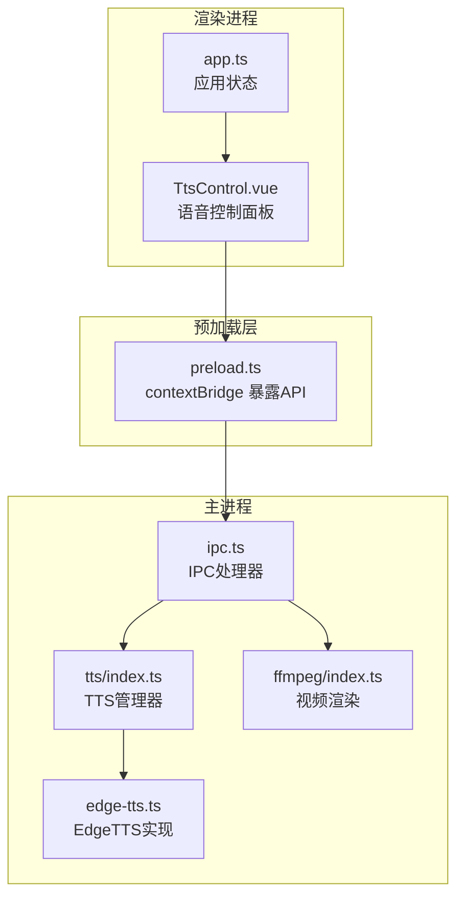
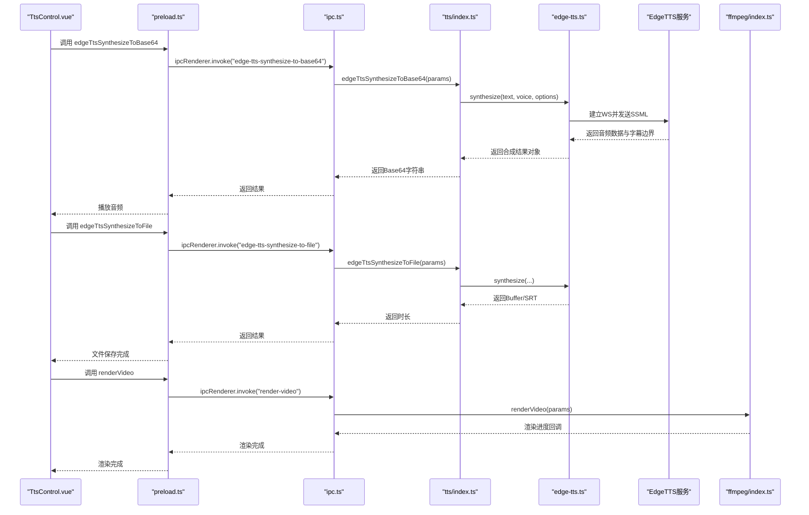
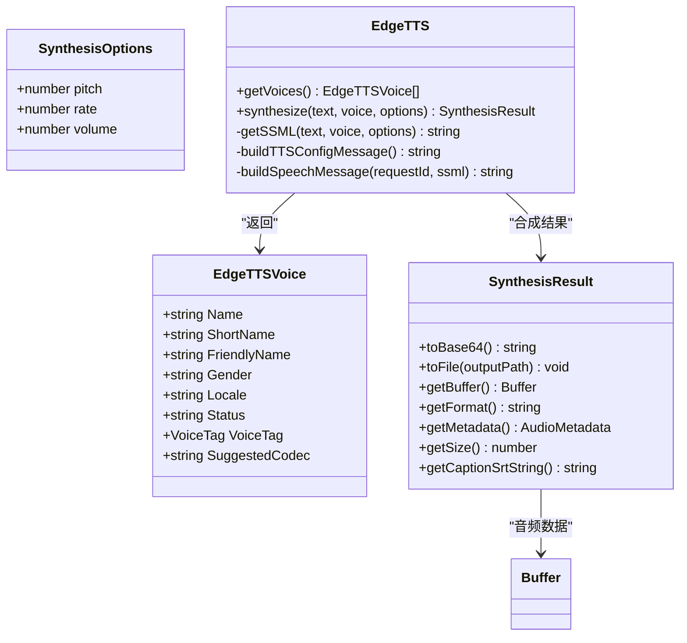
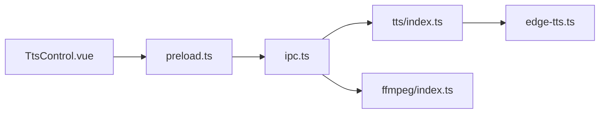

# 语音合成API

<cite>
**本文引用的文件**
- [electron/tts/index.ts](file://electron/tts/index.ts)
- [electron/tts/types.ts](file://electron/tts/types.ts)
- [electron/lib/edge-tts.ts](file://electron/lib/edge-tts.ts)
- [electron/ipc.ts](file://electron/ipc.ts)
- [electron/preload.ts](file://electron/preload.ts)
- [src/views/Home/components/TtsControl.vue](file://src/views/Home/components/TtsControl.vue)
- [src/store/app.ts](file://src/store/app.ts)
- [electron/ffmpeg/index.ts](file://electron/ffmpeg/index.ts)
- [locales/zh-CN/common.json](file://locales/zh-CN/common.json)
</cite>

## 目录
1. [简介](#简介)
2. [项目结构](#项目结构)
3. [核心组件](#核心组件)
4. [架构概览](#架构概览)
5. [详细组件分析](#详细组件分析)
6. [依赖关系分析](#依赖关系分析)
7. [性能考量](#性能考量)
8. [故障排查指南](#故障排查指南)
9. [结论](#结论)
10. [附录](#附录)

## 简介
本文件为 EdgeTTS 语音合成功能的详细 API 参考文档，覆盖语音参数配置接口（语言选择、性别设置、语速调节、音色选择）、语音列表获取、试听播放、批量合成等核心能力，并提供质量优化、缓存策略、错误处理最佳实践，以及与视频渲染系统的集成方案与性能指标说明，帮助开发者高效实现高质量的短视频语音合成与渲染流程。

## 项目结构
语音合成相关模块主要分布在以下位置：
- Electron 主进程：语音合成与 IPC 暴露、FFmpeg 视频渲染
- 预加载脚本：向渲染进程暴露安全的 API
- Vue 渲染层：语音控制面板、状态管理与 UI 交互
- 本地化资源：错误提示与 UI 文案

图表来源
- [electron/ipc.ts:169-182](file://electron/ipc.ts#L169-L182)
- [electron/tts/index.ts:35-85](file://electron/tts/index.ts#L35-L85)
- [electron/lib/edge-tts.ts:420-631](file://electron/lib/edge-tts.ts#L420-L631)
- [electron/preload.ts:50-90](file://electron/preload.ts#L50-L90)
- [src/views/Home/components/TtsControl.vue:1-234](file://src/views/Home/components/TtsControl.vue#L1-L234)
- [src/store/app.ts:16-146](file://src/store/app.ts#L16-L146)
- [electron/ffmpeg/index.ts:26-186](file://electron/ffmpeg/index.ts#L26-L186)

章节来源
- [electron/ipc.ts:169-182](file://electron/ipc.ts#L169-L182)
- [electron/tts/index.ts:35-85](file://electron/tts/index.ts#L35-L85)
- [electron/lib/edge-tts.ts:420-631](file://electron/lib/edge-tts.ts#L420-L631)
- [electron/preload.ts:50-90](file://electron/preload.ts#L50-L90)
- [src/views/Home/components/TtsControl.vue:1-234](file://src/views/Home/components/TtsControl.vue#L1-L234)
- [src/store/app.ts:16-146](file://src/store/app.ts#L16-L146)
- [electron/ffmpeg/index.ts:26-186](file://electron/ffmpeg/index.ts#L26-L186)

## 核心组件
- 语音参数配置接口
  - 语言选择：基于语音列表中的 Locale/FriendlyName 过滤
  - 性别设置：Male/Female
  - 语速调节：-100% 到 100%，以百分比表示
  - 音色选择：通过 Voice 的 ShortName 指定
- 语音列表获取：调用 getVoices 接口返回 EdgeTTSVoice 列表
- 试听播放：将合成结果转为 Base64 并在浏览器中播放
- 批量合成：支持将合成结果写入文件并生成字幕 SRT
- 视频渲染集成：自动挂载 TTS 音轨与字幕轨道，进行统一渲染

章节来源
- [electron/tts/types.ts:3-19](file://electron/tts/types.ts#L3-L19)
- [electron/lib/edge-tts.ts:82-86](file://electron/lib/edge-tts.ts#L82-L86)
- [src/views/Home/components/TtsControl.vue:143-163](file://src/views/Home/components/TtsControl.vue#L143-L163)
- [electron/tts/index.ts:35-85](file://electron/tts/index.ts#L35-L85)
- [electron/ffmpeg/index.ts:36-48](file://electron/ffmpeg/index.ts#L36-L48)

## 架构概览
EdgeTTS 语音合成通过 WebSocket 与微软服务通信，采用 SSML 控制音色、音高、语速与音量；主进程负责网络请求与音频数据拼接，渲染进程负责 UI 交互与播放控制；最终通过 FFmpeg 将语音与视频素材合并为成品视频。

图表来源
- [electron/preload.ts:59-63](file://electron/preload.ts#L59-L63)
- [electron/ipc.ts:169-182](file://electron/ipc.ts#L169-L182)
- [electron/tts/index.ts:39-85](file://electron/tts/index.ts#L39-L85)
- [electron/lib/edge-tts.ts:477-548](file://electron/lib/edge-tts.ts#L477-L548)
- [electron/ffmpeg/index.ts:26-186](file://electron/ffmpeg/index.ts#L26-L186)

## 详细组件分析

### 语音参数配置接口
- 参数类型与约束
  - pitch：整数，范围 [-100, 100]，单位 Hz
  - rate：数值，范围 [-100, 100]，单位 百分比
  - volume：整数，范围 [-100, 100]，单位 百分比
- 语言与性别过滤
  - 语言列表来源于语音列表的 FriendlyName 解析
  - 性别列表包含 Male/Female
- 音色选择
  - 使用 Voice 的 ShortName 作为唯一标识
- 试听播放
  - 将合成结果转为 Base64，构造 data:audio/mp3;base64 数据源播放

图表来源
- [electron/lib/edge-tts.ts:82-141](file://electron/lib/edge-tts.ts#L82-L141)
- [electron/lib/edge-tts.ts:420-631](file://electron/lib/edge-tts.ts#L420-L631)

章节来源
- [electron/lib/edge-tts.ts:82-86](file://electron/lib/edge-tts.ts#L82-L86)
- [electron/lib/edge-tts.ts:449-468](file://electron/lib/edge-tts.ts#L449-L468)
- [electron/lib/edge-tts.ts:551-563](file://electron/lib/edge-tts.ts#L551-L563)
- [src/views/Home/components/TtsControl.vue:143-163](file://src/views/Home/components/TtsControl.vue#L143-L163)

### 语音列表获取
- 接口职责：拉取可用语音列表，供 UI 过滤与选择
- 返回字段：Name/ShortName/FriendlyName/Gender/Locale/VoiceTag/SuggestedCodec 等
- UI 行为：首次加载后缓存至 store，后续根据语言与性别筛选

章节来源
- [electron/tts/index.ts:35-37](file://electron/tts/index.ts#L35-L37)
- [electron/lib/edge-tts.ts:421-439](file://electron/lib/edge-tts.ts#L421-L439)
- [src/views/Home/components/TtsControl.vue:165-199](file://src/views/Home/components/TtsControl.vue#L165-L199)

### 试听播放
- 流程：渲染层调用 preload 暴露的 edgeTtsSynthesizeToBase64，主进程合成后返回 Base64，前端构造 Audio 播放
- 错误处理：捕获网络/服务端异常，提示用户并支持复制错误详情

章节来源
- [electron/preload.ts:60-61](file://electron/preload.ts#L60-L61)
- [electron/ipc.ts:175-178](file://electron/ipc.ts#L175-L178)
- [src/views/Home/components/TtsControl.vue:91-138](file://src/views/Home/components/TtsControl.vue#L91-L138)

### 批量合成与字幕生成
- 接口：edgeTtsSynthesizeToFile 支持输出到文件并可选生成 SRT 字幕
- 时长计算：通过 music-metadata 解析 MP3 元数据获取时长，若无效则抛出错误
- 临时文件清理：应用退出前清理当前会话的临时语音与字幕文件

章节来源
- [electron/tts/index.ts:45-85](file://electron/tts/index.ts#L45-L85)
- [electron/tts/index.ts:20-29](file://electron/tts/index.ts#L20-L29)
- [electron/ffmpeg/index.ts:36-48](file://electron/ffmpeg/index.ts#L36-L48)

### 与视频渲染系统集成
- 自动挂载音轨：渲染时默认将 TTS 语音文件作为音轨，若未指定则使用临时文件路径
- 字幕挂载：自动定位同目录下的 SRT 字幕文件并叠加到视频
- 音量归一化与混合：使用 loudnorm 归一化语音音量，可选叠加背景音乐并混合输出

章节来源
- [electron/ffmpeg/index.ts:36-48](file://electron/ffmpeg/index.ts#L36-L48)
- [electron/ffmpeg/index.ts:96-133](file://electron/ffmpeg/index.ts#L96-L133)

## 依赖关系分析
- 渲染层依赖预加载层提供的安全 API
- 预加载层通过 ipcRenderer.invoke 与主进程通信
- 主进程通过 tts/index.ts 管理 EdgeTTS 实现与文件输出
- FFmpeg 作为外部工具参与最终视频渲染

图表来源
- [electron/preload.ts:50-90](file://electron/preload.ts#L50-L90)
- [electron/ipc.ts:169-182](file://electron/ipc.ts#L169-L182)
- [electron/tts/index.ts:35-85](file://electron/tts/index.ts#L35-L85)
- [electron/lib/edge-tts.ts:420-631](file://electron/lib/edge-tts.ts#L420-L631)
- [electron/ffmpeg/index.ts:26-186](file://electron/ffmpeg/index.ts#L26-L186)

章节来源
- [electron/preload.ts:50-90](file://electron/preload.ts#L50-L90)
- [electron/ipc.ts:169-182](file://electron/ipc.ts#L169-L182)
- [electron/tts/index.ts:35-85](file://electron/tts/index.ts#L35-L85)
- [electron/lib/edge-tts.ts:420-631](file://electron/lib/edge-tts.ts#L420-L631)
- [electron/ffmpeg/index.ts:26-186](file://electron/ffmpeg/index.ts#L26-L186)

## 性能考量
- 文本分块与拼接
  - 当文本超过阈值时自动拆分为多段，逐段合成后再拼接，减少单次请求压力
- 音频格式与采样
  - 默认输出为 24kHz 单声道 MP3（48kbitrate），兼顾体积与质量
- 字幕边界解析
  - 基于 WordBoundary 计算字幕时间轴，保证字幕与语音同步
- 渲染阶段优化
  - 使用 loudnorm 归一化音量，避免混音时爆音
  - 优先以语音时长为基准进行 trim，再进行混合，提升稳定性

章节来源
- [electron/lib/edge-tts.ts:482-503](file://electron/lib/edge-tts.ts#L482-L503)
- [electron/lib/edge-tts.ts:50-58](file://electron/lib/edge-tts.ts#L50-L58)
- [electron/lib/edge-tts.ts:361-417](file://electron/lib/edge-tts.ts#L361-L417)
- [electron/ffmpeg/index.ts:96-133](file://electron/ffmpeg/index.ts#L96-L133)

## 故障排查指南
- 获取语音列表失败
  - 检查网络连通性与代理设置；查看错误提示并复制详细信息
- 试听合成失败
  - 网络异常或服务端返回错误；确认语音参数合法且网络稳定
- 合成文件时长为 0 或损坏
  - 检查 TTS 配置与网络连接；确认输出路径存在且可写
- 渲染阶段报错
  - 检查输出路径、分辨率、文件名等配置是否齐全；确认 FFmpeg 可执行文件可用

章节来源
- [src/views/Home/components/TtsControl.vue:165-199](file://src/views/Home/components/TtsControl.vue#L165-L199)
- [src/views/Home/components/TtsControl.vue:112-138](file://src/views/Home/components/TtsControl.vue#L112-L138)
- [electron/tts/index.ts:74-80](file://electron/tts/index.ts#L74-L80)
- [locales/zh-CN/common.json:114-121](file://locales/zh-CN/common.json#L114-L121)

## 结论
本方案提供了完整的 EdgeTTS 语音合成能力，涵盖参数配置、列表获取、试听播放、批量合成与视频渲染集成。通过严格的参数校验、字幕边界解析与 FFmpeg 音量归一化，能够稳定产出高质量的短视频语音内容。建议在生产环境中结合缓存策略与错误重试机制，进一步提升用户体验与稳定性。

## 附录

### API 定义与使用说明

- 获取语音列表
  - 渲染层调用：window.electron.edgeTtsGetVoiceList()
  - 主进程处理：ipcMain.handle('edge-tts-get-voice-list')
  - 返回：EdgeTTSVoice[]

- 语音合成（Base64）
  - 渲染层调用：window.electron.edgeTtsSynthesizeToBase64(params)
  - 主进程处理：ipcMain.handle('edge-tts-synthesize-to-base64')
  - 参数：text, voice(ShortName), options(pitch, rate, volume)
  - 返回：Base64 字符串

- 语音合成（文件）
  - 渲染层调用：window.electron.edgeTtsSynthesizeToFile(params)
  - 主进程处理：ipcMain.handle('edge-tts-synthesize-to-file')
  - 参数：text, voice, options, withCaption?, outputPath?
  - 返回：{ duration: number }

- 语音参数类型
  - SynthesisOptions：pitch(-100~100), rate(-100~100), volume(-100~100)
  - EdgeTTSVoice：Name/ShortName/FriendlyName/Gender/Locale/VoiceTag/SuggestedCodec

- 与视频渲染集成
  - 渲染层调用：window.electron.renderVideo(params)
  - 主进程处理：ipcMain.handle('render-video')
  - 自动挂载 TTS 音轨与字幕轨道，支持背景音乐混合

章节来源
- [electron/preload.ts:59-63](file://electron/preload.ts#L59-L63)
- [electron/ipc.ts:169-182](file://electron/ipc.ts#L169-L182)
- [electron/tts/types.ts:3-19](file://electron/tts/types.ts#L3-L19)
- [electron/lib/edge-tts.ts:82-86](file://electron/lib/edge-tts.ts#L82-L86)
- [electron/ffmpeg/index.ts:36-48](file://electron/ffmpeg/index.ts#L36-L48)

### 语言与方言配置示例
- 语言选择：通过语音列表 FriendlyName 中的语言部分过滤
- 性别设置：Male/Female
- 语速调节：-30（慢）、0（中）、30（快）
- 音色选择：使用 Voice 的 ShortName 指定具体音色

章节来源
- [src/views/Home/components/TtsControl.vue:143-163](file://src/views/Home/components/TtsControl.vue#L143-L163)
- [src/store/app.ts:42-57](file://src/store/app.ts#L42-L57)

### 最佳实践
- 参数校验：在 UI 层对 pitch/rate/volume 进行范围校验，避免非法值
- 缓存策略：语音列表与常用音色可缓存于 store，减少重复请求
- 错误处理：统一捕获网络与服务端异常，提供可复制的错误详情
- 渲染优化：合理设置输出分辨率与时长，启用 loudnorm 保持音量一致

章节来源
- [electron/lib/edge-tts.ts:449-468](file://electron/lib/edge-tts.ts#L449-L468)
- [src/views/Home/components/TtsControl.vue:75-87](file://src/views/Home/components/TtsControl.vue#L75-L87)
- [electron/ffmpeg/index.ts:96-133](file://electron/ffmpeg/index.ts#L96-L133)