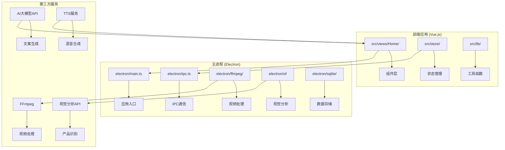
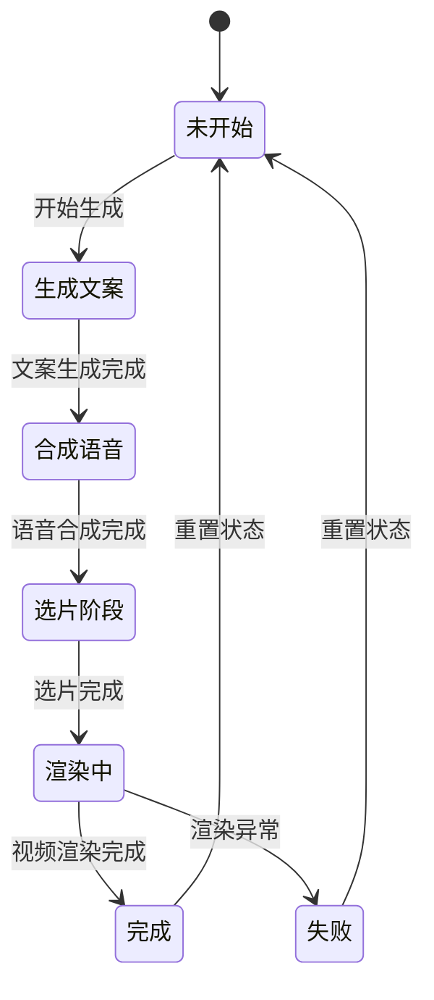
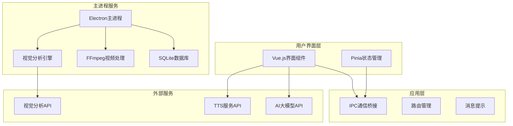
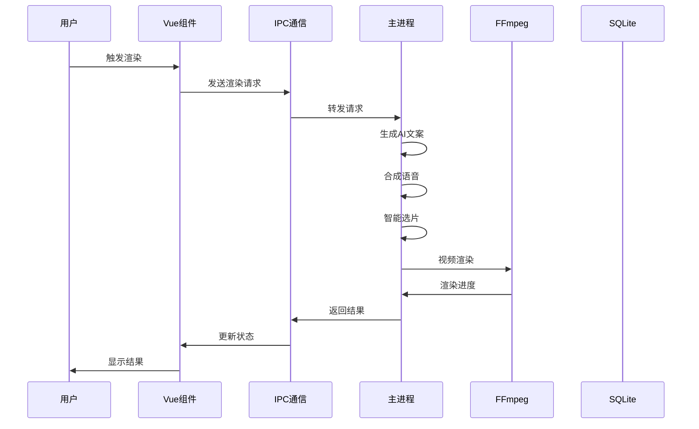
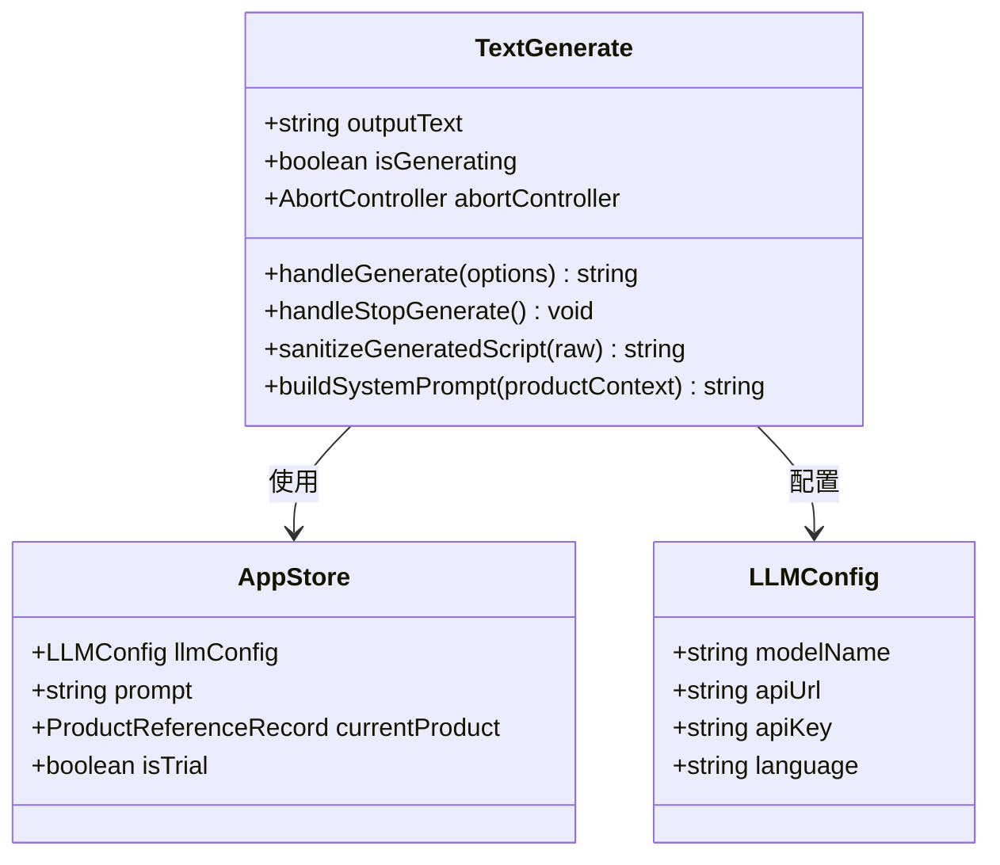
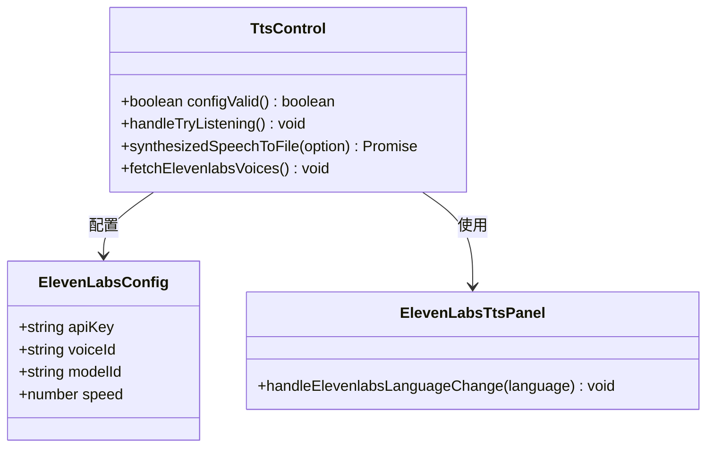
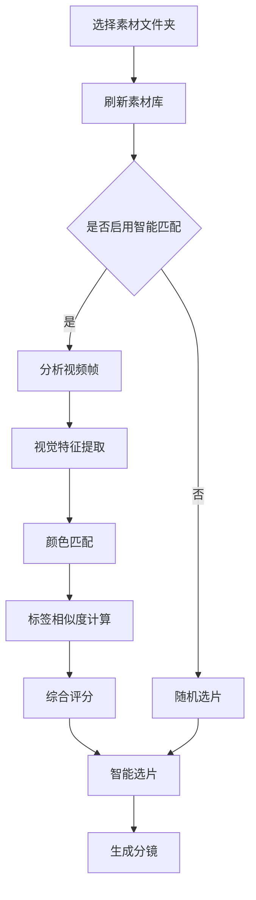
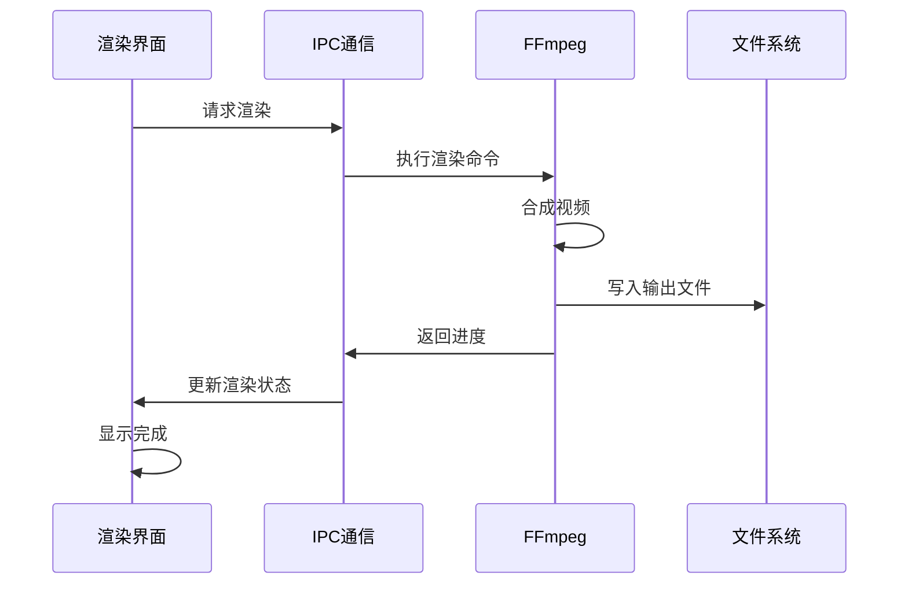
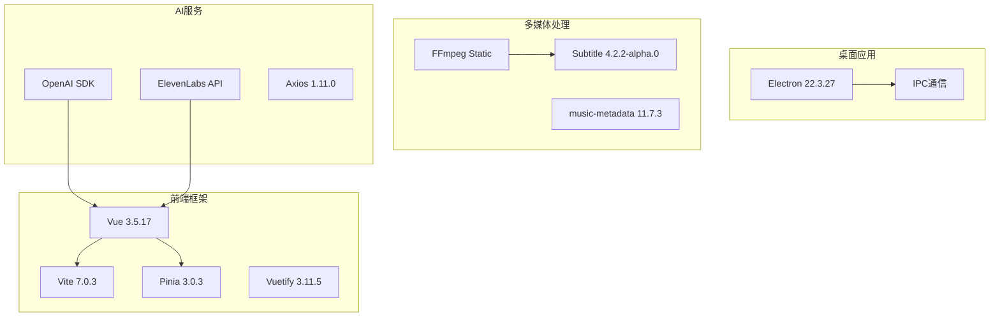
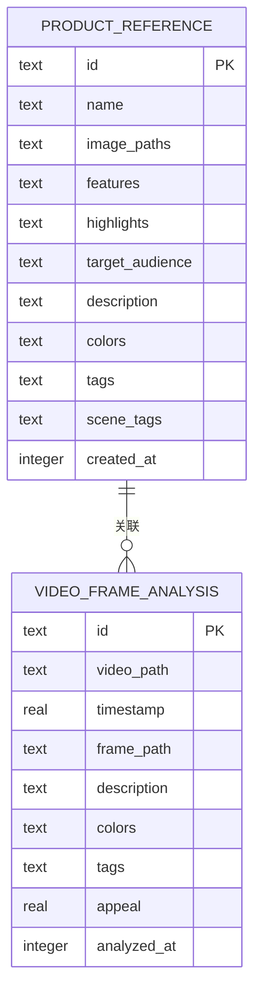

# Home创意工作台

<cite>
**本文档引用的文件**
- [package.json](file://package.json)
- [src/main.ts](file://src/main.ts)
- [electron/main.ts](file://electron/main.ts)
- [src/views/Home/index.vue](file://src/views/Home/index.vue)
- [src/views/Home/components/TextGenerate.vue](file://src/views/Home/components/TextGenerate.vue)
- [src/views/Home/components/TtsControl.vue](file://src/views/Home/components/TtsControl.vue)
- [src/views/Home/components/VideoManage.vue](file://src/views/Home/components/VideoManage.vue)
- [src/views/Home/components/VideoRender.vue](file://src/views/Home/components/VideoRender.vue)
- [src/store/app.ts](file://src/store/app.ts)
- [electron/ipc.ts](file://electron/ipc.ts)
- [electron/ffmpeg/index.ts](file://electron/ffmpeg/index.ts)
- [electron/vl/index.ts](file://electron/vl/index.ts)
- [electron/vl/match.ts](file://electron/vl/match.ts)
- [electron/vl/llm-match.ts](file://electron/vl/llm-match.ts)
- [electron/vl/analyze-product.ts](file://electron/vl/analyze-product.ts)
- [electron/vl/analyze-video.ts](file://electron/vl/analyze-video.ts)
- [electron/sqlite/index.ts](file://electron/sqlite/index.ts)
</cite>

## 目录
1. [项目概述](#项目概述)
2. [项目结构](#项目结构)
3. [核心组件](#核心组件)
4. [架构概览](#架构概览)
5. [详细组件分析](#详细组件分析)
6. [依赖关系分析](#依赖关系分析)
7. [性能考量](#性能考量)
8. [故障排除指南](#故障排除指南)
9. [结论](#结论)

## 项目概述

Home创意工作台是一个基于Electron和Vue.js开发的智能短视频创作平台，专为电商带货视频制作而设计。该系统集成了AI大模型文案生成、智能语音合成、视觉分析和视频渲染等功能，能够实现从产品素材到成品视频的全流程自动化创作。

### 主要特性

- **AI驱动的内容创作**：集成多种大模型API，支持多语言文案生成
- **智能视频选片**：基于视觉分析的AI智能匹配系统
- **多引擎语音合成**：支持ElevenLabs和Edge TTS等多种TTS服务
- **专业视频编辑**：完整的视频渲染和后期处理流水线
- **跨平台部署**：支持Windows、macOS和Linux系统

## 项目结构

该项目采用现代化的前后端分离架构，结合Electron实现桌面应用：

**图表来源**
- [src/views/Home/index.vue:1-433](file://src/views/Home/index.vue#L1-L433)
- [electron/main.ts:1-204](file://electron/main.ts#L1-L204)
- [electron/ipc.ts:1-352](file://electron/ipc.ts#L1-L352)

**章节来源**
- [package.json:1-85](file://package.json#L1-L85)
- [src/main.ts:1-127](file://src/main.ts#L1-L127)
- [electron/main.ts:1-204](file://electron/main.ts#L1-L204)

## 核心组件

### 应用状态管理

应用使用Pinia进行状态管理，定义了完整的渲染状态机：

**图表来源**
- [src/store/app.ts:5-13](file://src/store/app.ts#L5-L13)

### 主要业务流程

系统的核心工作流包括四个主要阶段：

1. **AI文案生成**：基于产品信息和营销策略生成短视频脚本
2. **语音合成**：将文案转换为自然流畅的语音
3. **智能选片**：根据产品特征和文案内容自动匹配视频片段
4. **视频渲染**：将选中的片段、语音和背景音乐合成最终视频

**章节来源**
- [src/store/app.ts:1-151](file://src/store/app.ts#L1-L151)
- [src/views/Home/index.vue:95-318](file://src/views/Home/index.vue#L95-L318)

## 架构概览

### 整体架构设计

**图表来源**
- [src/main.ts:1-127](file://src/main.ts#L1-L127)
- [electron/main.ts:1-204](file://electron/main.ts#L1-L204)
- [electron/ipc.ts:1-352](file://electron/ipc.ts#L1-L352)

### 数据流架构

**图表来源**
- [src/views/Home/index.vue:99-318](file://src/views/Home/index.vue#L99-L318)
- [electron/ipc.ts:214-229](file://electron/ipc.ts#L214-L229)

## 详细组件分析

### 文案生成组件 (TextGenerate)

该组件负责与AI大模型交互，生成符合电商营销需求的短视频脚本：

**图表来源**
- [src/views/Home/components/TextGenerate.vue:149-370](file://src/views/Home/components/TextGenerate.vue#L149-L370)
- [src/store/app.ts:24-34](file://src/store/app.ts#L24-L34)

#### 核心功能特性

- **多语言支持**：支持中文、英文、日文、韩文等多种语言
- **智能提示词**：根据产品特征生成定制化提示词
- **实时流式生成**：支持边生成边显示的用户体验
- **内容净化**：自动清理AI生成的冗余内容和格式标记

**章节来源**
- [src/views/Home/components/TextGenerate.vue:1-428](file://src/views/Home/components/TextGenerate.vue#L1-L428)
- [src/store/app.ts:24-34](file://src/store/app.ts#L24-L34)

### 语音合成组件 (TtsControl)

集成多种TTS服务，提供高质量的语音合成能力：

**图表来源**
- [src/views/Home/components/TtsControl.vue:96-304](file://src/views/Home/components/TtsControl.vue#L96-L304)

#### 支持的TTS引擎

- **ElevenLabs**：支持多语言、多音色的高质量语音合成
- **Edge TTS**：微软提供的免费TTS服务
- **智能字幕**：自动生成与语音同步的字幕文件

**章节来源**
- [src/views/Home/components/TtsControl.vue:1-421](file://src/views/Home/components/TtsControl.vue#L1-L421)

### 视频素材管理 (VideoManage)

提供完整的视频素材浏览、分析和智能匹配功能：

**图表来源**
- [src/views/Home/components/VideoManage.vue:137-358](file://src/views/Home/components/VideoManage.vue#L137-L358)

#### 视觉分析功能

- **产品颜色识别**：自动提取产品主体颜色
- **场景标签分类**：识别视频内容的中文物品标签
- **视觉吸引力评分**：评估画面的视觉冲击力
- **智能匹配算法**：基于颜色、标签和语义的综合匹配

**章节来源**
- [src/views/Home/components/VideoManage.vue:1-457](file://src/views/Home/components/VideoManage.vue#L1-L457)
- [electron/vl/analyze-video.ts:95-199](file://electron/vl/analyze-video.ts#L95-L199)

### 视频渲染组件 (VideoRender)

负责最终的视频合成和输出：

**图表来源**
- [src/views/Home/components/VideoRender.vue:212-326](file://src/views/Home/components/VideoRender.vue#L212-L326)
- [electron/ffmpeg/index.ts:27-101](file://electron/ffmpeg/index.ts#L27-L101)

#### 渲染特性

- **进度监控**：实时显示渲染进度和状态
- **多格式支持**：支持MP4等多种视频格式
- **质量控制**：自动调整分辨率和码率
- **错误处理**：完善的异常捕获和恢复机制

**章节来源**
- [src/views/Home/components/VideoRender.vue:1-578](file://src/views/Home/components/VideoRender.vue#L1-L578)
- [electron/ffmpeg/index.ts:1-237](file://electron/ffmpeg/index.ts#L1-L237)

## 依赖关系分析

### 技术栈依赖

**图表来源**
- [package.json:22-63](file://package.json#L22-L63)

### 数据库设计

**图表来源**
- [electron/sqlite/index.ts:148-197](file://electron/sqlite/index.ts#L148-L197)

**章节来源**
- [package.json:22-63](file://package.json#L22-L63)
- [electron/sqlite/index.ts:144-203](file://electron/sqlite/index.ts#L144-L203)

## 性能考量

### 视频处理优化

系统采用了多项性能优化策略：

- **并发处理**：视频帧分析采用并发执行，提升处理效率
- **缓存机制**：抽取的视频帧和分析结果进行本地缓存
- **内存管理**：及时释放临时文件和内存资源
- **进度反馈**：实时显示处理进度，提升用户体验

### AI集成优化

- **模型选择**：支持多种AI模型，可根据需求选择最优配置
- **请求优化**：智能重试和超时处理机制
- **成本控制**：提供试用版本和使用限制

## 故障排除指南

### 常见问题及解决方案

#### 渲染失败

**症状**：视频渲染过程中出现错误

**可能原因**：
- FFmpeg可执行文件缺失
- 输出路径权限不足
- 音频文件损坏

**解决步骤**：
1. 检查FFmpeg安装状态
2. 验证输出目录权限
3. 重新生成语音文件

#### AI模型连接失败

**症状**：文案生成或语音合成API调用失败

**解决方法**：
1. 检查API密钥配置
2. 验证网络连接
3. 查看API服务状态

#### 视频分析异常

**症状**：视觉分析功能无法正常工作

**排查步骤**：
1. 确认视频文件格式支持
2. 检查磁盘空间
3. 重启分析服务

**章节来源**
- [src/views/Home/index.vue:294-317](file://src/views/Home/index.vue#L294-L317)
- [electron/vl/analyze-video.ts:128-144](file://electron/vl/analyze-video.ts#L128-L144)

## 结论

Home创意工作台是一个功能完整、架构清晰的智能视频创作平台。通过集成AI大模型、视觉分析和专业视频处理技术，实现了从内容创作到成品输出的全流程自动化。

### 主要优势

- **高度自动化**：减少人工干预，提高创作效率
- **智能化程度高**：AI驱动的内容生成和选片匹配
- **扩展性强**：模块化设计便于功能扩展
- **用户体验优秀**：直观的操作界面和实时反馈

### 发展方向

- **更多AI模型支持**：集成更多先进的AI服务
- **云端协作**：支持多用户协作创作
- **模板系统**：提供丰富的视频模板库
- **数据分析**：内置视频效果分析和优化建议

该系统为电商短视频创作提供了强有力的技术支撑，能够帮助创作者快速制作高质量的带货视频内容。