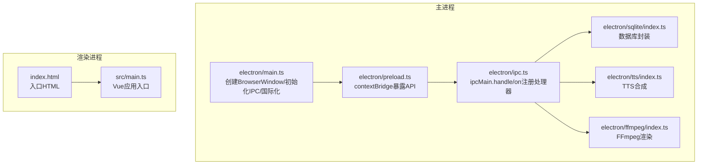
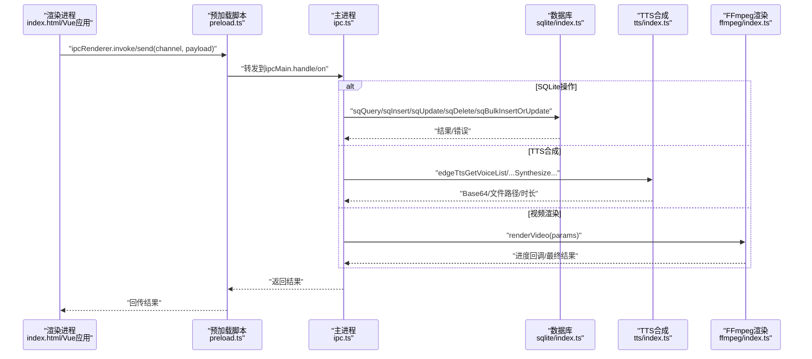
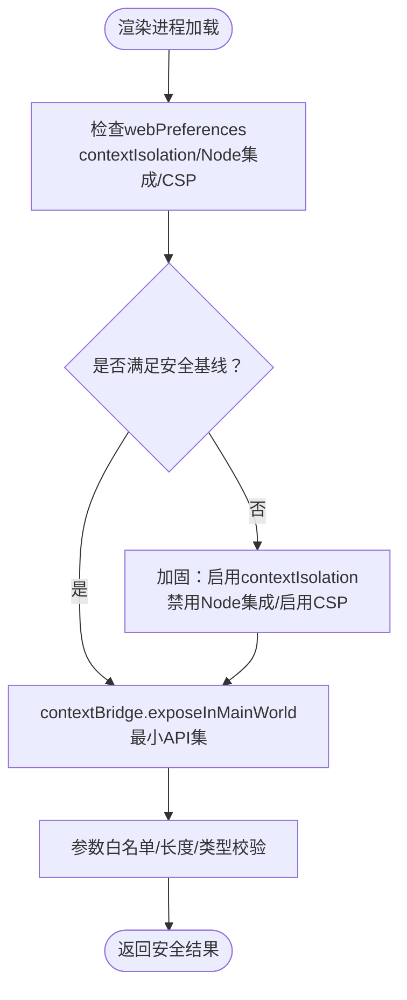
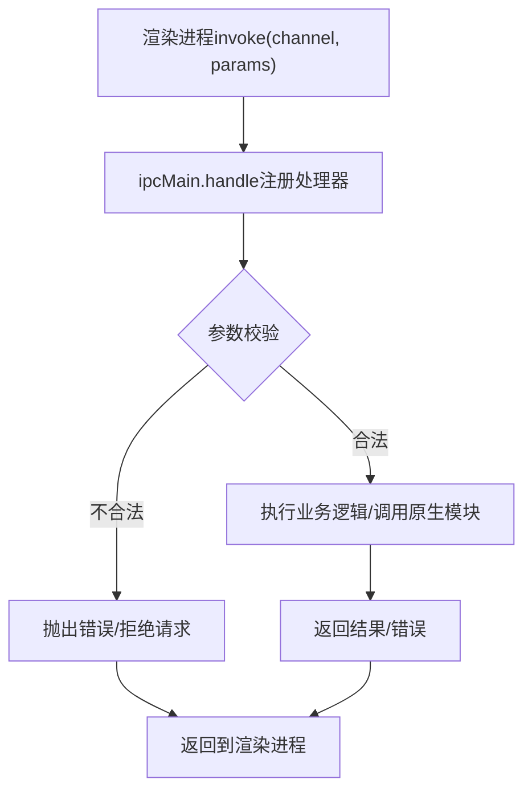
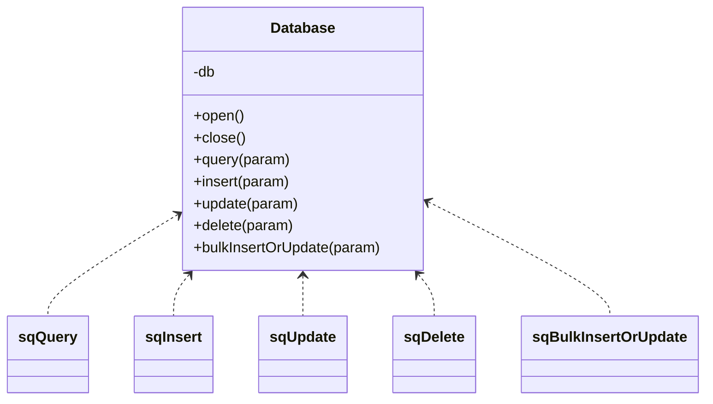
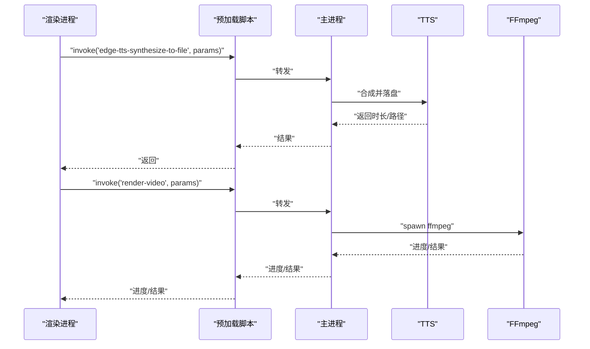
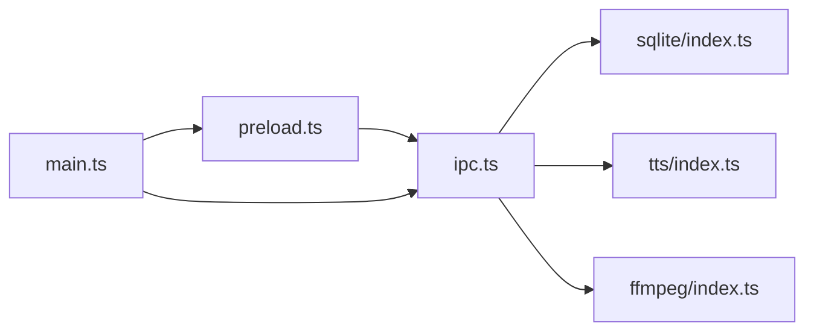

# IPC安全与上下文隔离

<cite>
**本文引用的文件**
- [electron/main.ts](file://electron/main.ts)
- [electron/preload.ts](file://electron/preload.ts)
- [electron/ipc.ts](file://electron/ipc.ts)
- [electron/sqlite/index.ts](file://electron/sqlite/index.ts)
- [electron/sqlite/types.ts](file://electron/sqlite/types.ts)
- [electron/tts/index.ts](file://electron/tts/index.ts)
- [electron/tts/types.ts](file://electron/tts/types.ts)
- [electron/ffmpeg/index.ts](file://electron/ffmpeg/index.ts)
- [electron/ffmpeg/types.ts](file://electron/ffmpeg/types.ts)
- [electron/types.ts](file://electron/types.ts)
- [index.html](file://index.html)
- [electron/lib/cookie-allow-cross-site.ts](file://electron/lib/cookie-allow-cross-site.ts)
- [electron/lib/is-dev.ts](file://electron/lib/is-dev.ts)
- [package.json](file://package.json)
</cite>

## 目录
1. [简介](#简介)
2. [项目结构](#项目结构)
3. [核心组件](#核心组件)
4. [架构总览](#架构总览)
5. [详细组件分析](#详细组件分析)
6. [依赖关系分析](#依赖关系分析)
7. [性能考量](#性能考量)
8. [故障排查指南](#故障排查指南)
9. [结论](#结论)
10. [附录：安全配置检查清单与审计要点](#附录安全配置检查清单与审计要点)

## 简介
本文件聚焦短视频工厂项目中的IPC安全与上下文隔离机制，系统性梳理Electron安全模型、上下文隔离策略、CSP配置现状与风险、XSS与代码注入防护、安全的IPC调用模式与最佳实践，并给出可操作的检查清单与审计要点。项目采用预加载脚本通过contextBridge向渲染进程暴露受控API，主进程通过ipcMain.handle/on集中处理业务逻辑，结合SQLite/TTS/FFmpeg等能力完成视频生成与媒体处理。

## 项目结构
- Electron主进程入口负责创建BrowserWindow、初始化IPC与数据库、国际化与菜单；预加载脚本通过contextBridge暴露有限API；渲染侧通过ipcRenderer调用主进程能力。
- 关键文件分布于electron目录，前端页面由Vite构建后由主进程加载。

图示来源
- [electron/main.ts:40-76](file://electron/main.ts#L40-L76)
- [electron/preload.ts:18-75](file://electron/preload.ts#L18-L75)
- [electron/ipc.ts:77-187](file://electron/ipc.ts#L77-L187)
- [electron/sqlite/index.ts:38-140](file://electron/sqlite/index.ts#L38-L140)
- [electron/tts/index.ts:35-85](file://electron/tts/index.ts#L35-L85)
- [electron/ffmpeg/index.ts:26-186](file://electron/ffmpeg/index.ts#L26-L186)
- [index.html:1-15](file://index.html#L1-L15)

章节来源
- [electron/main.ts:40-76](file://electron/main.ts#L40-L76)
- [index.html:1-15](file://index.html#L1-L15)

## 核心组件
- 主进程窗口与安全偏好
  - BrowserWindow.webPreferences中未启用contextIsolation与nodeIntegration，且webSecurity被设置为false，存在显著安全风险。
- 预加载脚本与API暴露
  - 通过contextBridge.exposeInMainWorld将有限API暴露至渲染进程，仅暴露必要方法，避免直接暴露Node/Electron全局。
- IPC处理器
  - 主进程统一通过ipcMain.handle/on注册通道，集中校验参数、访问系统资源与调用原生模块，避免渲染进程直接操作敏感资源。
- 数据库、TTS与FFmpeg
  - 数据库封装在主进程侧，TTS与FFmpeg作为子进程执行，均在主进程内进行权限与路径校验。

章节来源
- [electron/main.ts:51-54](file://electron/main.ts#L51-L54)
- [electron/preload.ts:18-75](file://electron/preload.ts#L18-L75)
- [electron/ipc.ts:77-187](file://electron/ipc.ts#L77-L187)
- [electron/sqlite/index.ts:38-140](file://electron/sqlite/index.ts#L38-L140)
- [electron/tts/index.ts:35-85](file://electron/tts/index.ts#L35-L85)
- [electron/ffmpeg/index.ts:26-186](file://electron/ffmpeg/index.ts#L26-L186)

## 架构总览
下图展示从渲染进程发起调用到主进程处理与系统资源交互的端到端流程。

图示来源
- [electron/preload.ts:20-41](file://electron/preload.ts#L20-L41)
- [electron/ipc.ts:77-187](file://electron/ipc.ts#L77-L187)
- [electron/sqlite/index.ts:189-194](file://electron/sqlite/index.ts#L189-L194)
- [electron/tts/index.ts:35-85](file://electron/tts/index.ts#L35-L85)
- [electron/ffmpeg/index.ts:26-186](file://electron/ffmpeg/index.ts#L26-L186)

## 详细组件分析

### 1) 上下文隔离与预加载脚本
- 当前实现
  - webPreferences未启用contextIsolation，且未设置nodeIntegration: false，渲染进程可直接访问DOM与Node能力，存在高风险。
  - 预加载脚本通过contextBridge.exposeInMainWorld仅暴露有限API，形成“最小暴露面”。
- 安全建议
  - 强制开启contextIsolation与nodeIntegration: false，移除webSecurity禁用或改为严格CSP。
  - 将预加载暴露的API进一步收敛为只读接口，避免传递可变对象或函数句柄。
  - 对所有来自渲染进程的参数进行白名单校验与长度/范围限制。

图示来源
- [electron/main.ts:51-54](file://electron/main.ts#L51-L54)
- [electron/preload.ts:18-75](file://electron/preload.ts#L18-L75)

章节来源
- [electron/main.ts:51-54](file://electron/main.ts#L51-L54)
- [electron/preload.ts:18-75](file://electron/preload.ts#L18-L75)

### 2) IPC通道设计与参数校验
- 设计原则
  - 仅暴露必要通道，避免通用exec/eval类通道。
  - 所有invoke通道在主进程集中校验参数、路径合法性与权限。
  - on通道仅用于事件广播，不承载敏感操作。
- 典型通道与校验点
  - sqlite系列：参数对象包含SQL与绑定值，需防注入与越权访问。
  - 文件夹选择/文件列表：校验路径存在性与可读性，避免目录穿越。
  - TTS/FFmpeg：校验输出路径、临时文件清理、时长有效性。

图示来源
- [electron/ipc.ts:77-187](file://electron/ipc.ts#L77-L187)
- [electron/sqlite/types.ts:1-26](file://electron/sqlite/types.ts#L1-L26)
- [electron/types.ts:1-26](file://electron/types.ts#L1-L26)
- [electron/tts/types.ts:1-20](file://electron/tts/types.ts#L1-L20)
- [electron/ffmpeg/types.ts:1-23](file://electron/ffmpeg/types.ts#L1-L23)

章节来源
- [electron/ipc.ts:77-187](file://electron/ipc.ts#L77-L187)
- [electron/sqlite/types.ts:1-26](file://electron/sqlite/types.ts#L1-L26)
- [electron/types.ts:1-26](file://electron/types.ts#L1-L26)
- [electron/tts/types.ts:1-20](file://electron/tts/types.ts#L1-L20)
- [electron/ffmpeg/types.ts:1-23](file://electron/ffmpeg/types.ts#L1-L23)

### 3) 数据库层安全
- 访问控制
  - 数据库实例位于主进程，路径固定在用户数据目录，避免渲染进程直接访问。
  - SQL通过参数化查询执行，减少注入风险。
- 最佳实践
  - 对外暴露的查询接口必须严格限定表名/字段白名单。
  - 批量写入使用事务，失败回滚。
  - 定期清理无用数据，避免敏感信息残留。

图示来源
- [electron/sqlite/index.ts:38-140](file://electron/sqlite/index.ts#L38-L140)
- [electron/sqlite/index.ts:189-194](file://electron/sqlite/index.ts#L189-L194)

章节来源
- [electron/sqlite/index.ts:38-140](file://electron/sqlite/index.ts#L38-L140)
- [electron/sqlite/index.ts:189-194](file://electron/sqlite/index.ts#L189-L194)

### 4) TTS与FFmpeg安全
- TTS
  - 语音合成结果写入应用临时目录，结束后清理；输出时解析音频元数据并校验时长。
- FFmpeg
  - 子进程执行，参数拼接严格控制；支持AbortController取消；输出路径存在性校验；进度回调在主进程统一处理。

图示来源
- [electron/preload.ts:58-64](file://electron/preload.ts#L58-L64)
- [electron/ipc.ts:163-186](file://electron/ipc.ts#L163-L186)
- [electron/tts/index.ts:45-85](file://electron/tts/index.ts#L45-L85)
- [electron/ffmpeg/index.ts:188-244](file://electron/ffmpeg/index.ts#L188-L244)

章节来源
- [electron/tts/index.ts:45-85](file://electron/tts/index.ts#L45-L85)
- [electron/ffmpeg/index.ts:188-244](file://electron/ffmpeg/index.ts#L188-L244)

### 5) 内容安全策略（CSP）现状与建议
- 现状
  - 未在HTML中声明Content-Security-Policy meta标签；主进程webPreferences禁用了webSecurity，降低浏览器内置CSP效果。
- 建议
  - 在开发与生产环境分别配置严格的CSP，限制脚本来源、内联脚本/样式、插件与外链资源。
  - 优先使用nonce或哈希避免内联脚本；对动态注入的脚本使用白名单。
  - 对webSecurity=false场景，应通过CSP弥补浏览器级防护缺失。

章节来源
- [index.html:1-15](file://index.html#L1-L15)
- [electron/main.ts:52](file://electron/main.ts#L52)

### 6) XSS与代码注入防护
- 输入校验
  - 所有来自渲染进程的参数必须进行白名单/长度/类型校验；对路径参数进行存在性与可读性检查。
- 输出转义
  - 渲染侧对用户可控文本进行HTML转义；避免将不可信字符串直接写入innerHTML。
- 资源来源
  - 限制外链资源与脚本来源；对外部链接使用安全属性与协议白名单。

章节来源
- [electron/ipc.ts:119-144](file://electron/ipc.ts#L119-L144)
- [electron/ffmpeg/index.ts:50-54](file://electron/ffmpeg/index.ts#L50-L54)

### 7) 跨站Cookie与网络请求
- 跨站Cookie
  - 通过webRequest拦截响应头，为Set-Cookie追加SameSite=None;Secure，解决新版Electron跨域携带问题。
- CORS与私有网络
  - 主进程禁用CORS与私有网络限制，需谨慎评估风险并配合CSP与白名单策略。

章节来源
- [electron/lib/cookie-allow-cross-site.ts:6-17](file://electron/lib/cookie-allow-cross-site.ts#L6-L17)
- [electron/main.ts:197-202](file://electron/main.ts#L197-L202)

## 依赖关系分析
- 模块耦合
  - 预加载脚本仅依赖ipcRenderer与contextBridge，耦合度低。
  - 主进程IPC集中处理，依赖sqlite/tts/ffmpeg模块，职责清晰。
- 外部依赖
  - better-sqlite3、ffmpeg-static、i18n等，版本与打包策略需关注兼容性与安全补丁。

图示来源
- [electron/preload.ts:18-75](file://electron/preload.ts#L18-L75)
- [electron/ipc.ts:77-187](file://electron/ipc.ts#L77-L187)
- [electron/sqlite/index.ts:38-140](file://electron/sqlite/index.ts#L38-L140)
- [electron/tts/index.ts:35-85](file://electron/tts/index.ts#L35-L85)
- [electron/ffmpeg/index.ts:26-186](file://electron/ffmpeg/index.ts#L26-L186)
- [electron/main.ts:40-76](file://electron/main.ts#L40-L76)

章节来源
- [package.json:22-63](file://package.json#L22-L63)

## 性能考量
- IPC调用
  - invoke适合一次性请求/响应，on适合事件广播；避免在高频事件中进行昂贵的磁盘/网络操作。
- 渲染与主进程分离
  - 将耗时任务（TTS/FFmpeg）放在主进程并使用子进程，避免阻塞UI线程。
- 资源管理
  - 及时释放临时文件与数据库连接，避免内存泄漏与磁盘占用。

## 故障排查指南
- 无法加载预加载脚本
  - 检查preload路径与打包产物一致性；确认webPreferences.preload正确指向。
- IPC调用无响应
  - 确认通道名称一致；检查主进程ipcMain.handle/on是否注册；查看参数校验日志。
- SQLite报错
  - 检查SQL语法与表结构；确认参数绑定顺序；查看数据库文件是否存在。
- TTS/FFmpeg失败
  - 校验输出路径可写；确认临时文件清理逻辑；查看子进程stderr输出。
- CSP冲突
  - 若webSecurity=false，需确保CSP策略允许必要资源；避免内联脚本与eval。

章节来源
- [electron/main.ts:51-54](file://electron/main.ts#L51-L54)
- [electron/ipc.ts:77-187](file://electron/ipc.ts#L77-L187)
- [electron/sqlite/index.ts:38-140](file://electron/sqlite/index.ts#L38-L140)
- [electron/tts/index.ts:35-85](file://electron/tts/index.ts#L35-L85)
- [electron/ffmpeg/index.ts:188-244](file://electron/ffmpeg/index.ts#L188-L244)

## 结论
当前项目通过预加载脚本与集中式IPC实现了相对安全的API暴露与业务处理，但webPreferences未启用contextIsolation与nodeIntegration，且webSecurity被禁用，存在较高风险。建议立即启用上下文隔离、禁用Node集成、实施严格CSP与参数校验，同时完善XSS与代码注入防护策略，以在保证功能性的同时实现更严格的边界控制。

## 附录：安全配置检查清单与审计要点
- 浏览器安全基线
  - 启用contextIsolation
  - 禁用nodeIntegration
  - 设置webSecurity为true（或通过CSP替代）
  - 配置Content-Security-Policy meta标签
- 预加载脚本
  - 仅暴露必要API，避免暴露全局对象
  - 对所有输入参数进行白名单/长度/类型校验
- IPC通道
  - 仅开放必要通道，避免通用exec类通道
  - invoke通道集中校验参数与权限
  - on通道仅用于事件广播
- 数据库
  - 参数化查询，限制表/字段白名单
  - 批量写入使用事务
- TTS/FFmpeg
  - 输出路径存在性与可写性校验
  - 临时文件清理与时长校验
- 网络与Cookie
  - 跨站Cookie SameSite/Secure配置
  - CORS与私有网络限制策略评估
- 开发与发布
  - 生产构建剥离调试信息
  - 依赖版本与安全补丁跟踪

章节来源
- [electron/main.ts:51-54](file://electron/main.ts#L51-L54)
- [index.html:1-15](file://index.html#L1-L15)
- [electron/preload.ts:18-75](file://electron/preload.ts#L18-L75)
- [electron/ipc.ts:77-187](file://electron/ipc.ts#L77-L187)
- [electron/lib/cookie-allow-cross-site.ts:6-17](file://electron/lib/cookie-allow-cross-site.ts#L6-L17)
- [electron/lib/is-dev.ts:1-2](file://electron/lib/is-dev.ts#L1-L2)