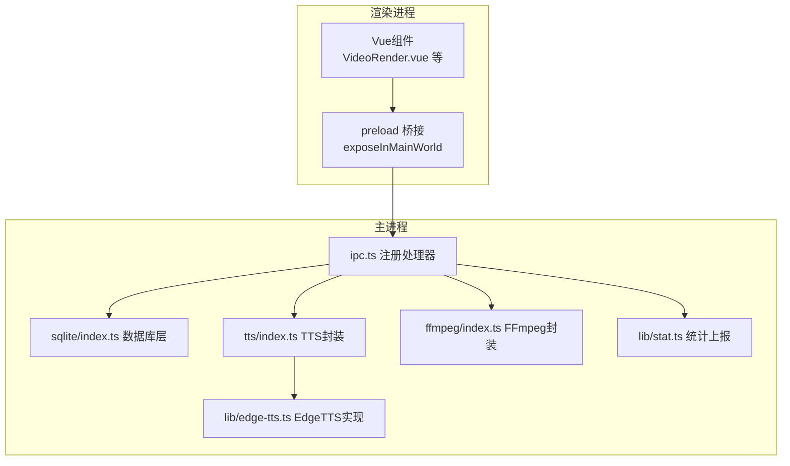
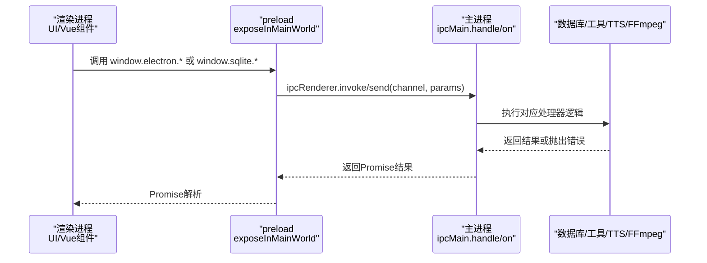
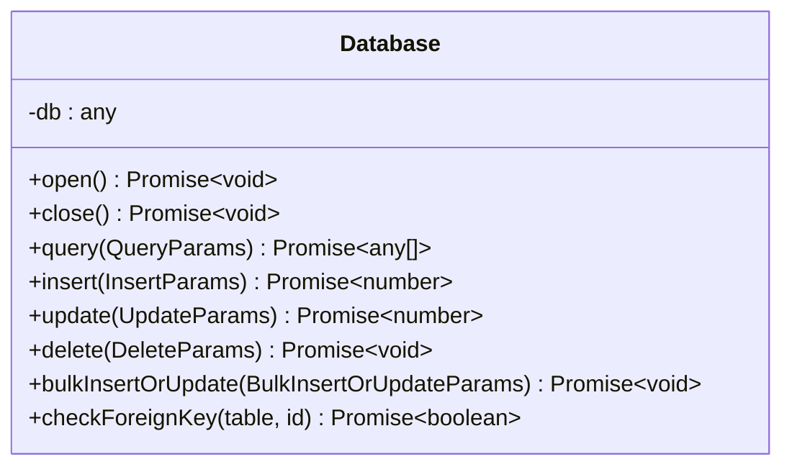
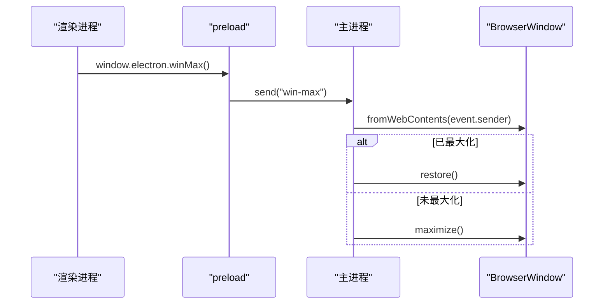
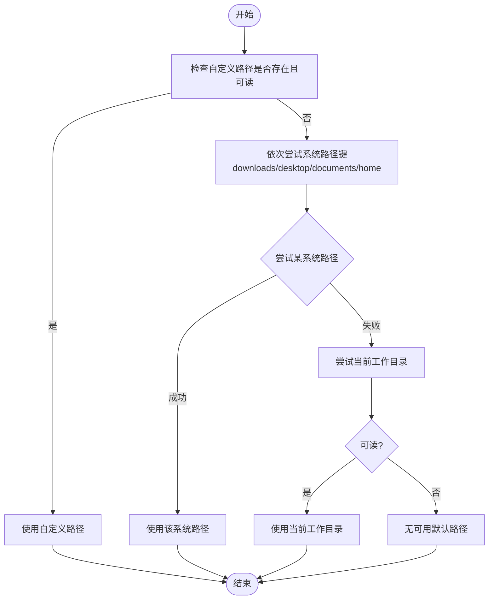
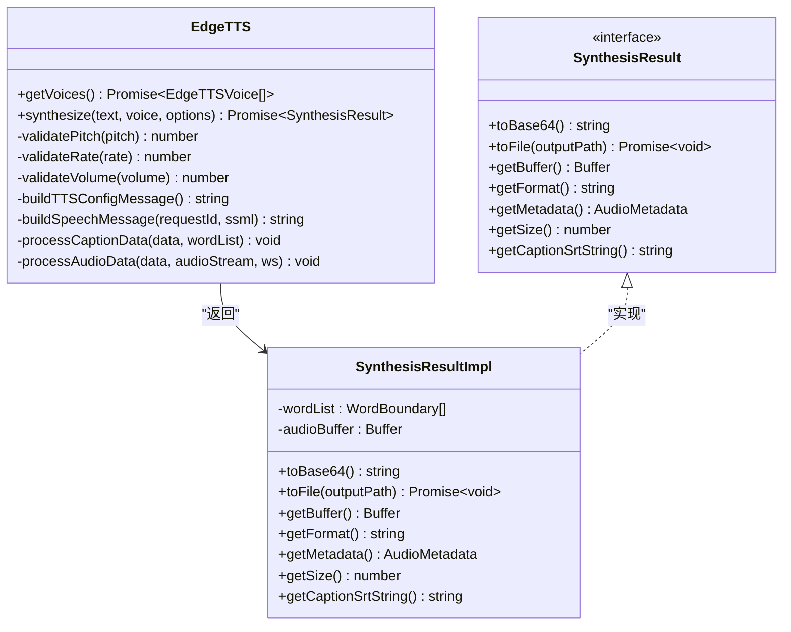
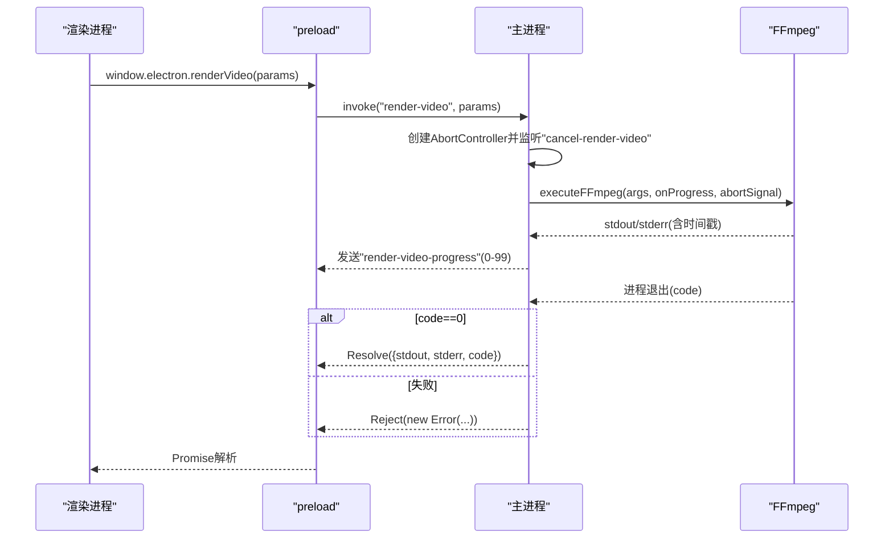
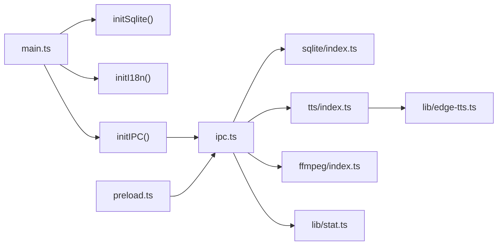

# IPC接口处理器

<cite>
**本文引用的文件**
- [electron/ipc.ts](file://electron/ipc.ts)
- [electron/preload.ts](file://electron/preload.ts)
- [electron/sqlite/index.ts](file://electron/sqlite/index.ts)
- [electron/sqlite/types.ts](file://electron/sqlite/types.ts)
- [electron/tts/index.ts](file://electron/tts/index.ts)
- [electron/tts/types.ts](file://electron/tts/types.ts)
- [electron/lib/edge-tts.ts](file://electron/lib/edge-tts.ts)
- [electron/ffmpeg/index.ts](file://electron/ffmpeg/index.ts)
- [electron/ffmpeg/types.ts](file://electron/ffmpeg/types.ts)
- [electron/types.ts](file://electron/types.ts)
- [electron/main.ts](file://electron/main.ts)
- [electron/lib/stat.ts](file://electron/lib/stat.ts)
- [electron/lib/tools.ts](file://electron/lib/tools.ts)
</cite>

## 目录
1. [简介](#简介)
2. [项目结构](#项目结构)
3. [核心组件](#核心组件)
4. [架构总览](#架构总览)
5. [详细组件分析](#详细组件分析)
6. [依赖关系分析](#依赖关系分析)
7. [性能考量](#性能考量)
8. [故障排查指南](#故障排查指南)
9. [结论](#结论)
10. [附录](#附录)

## 简介
本文件面向短视频工厂项目的IPC接口处理器，系统性梳理并解释各类处理器的实现与功能，涵盖：
- SQLite数据库操作处理器（查询、插入、更新、删除、批量操作）
- 窗口控制处理器（最大化、最小化、关闭）
- 文件系统操作处理器（文件夹选择、文件列表获取）
- EdgeTTS语音合成处理器（语音列表获取、语音合成到Base64、语音合成到文件）
- 视频渲染处理器（基于FFmpeg的多片段拼接、音视频混合、字幕叠加、响度归一化）

文档同时说明各处理器的参数格式、返回值类型、错误处理机制，提供使用示例与最佳实践，并解释处理器的注册与调用流程及扩展方法。

## 项目结构
IPC处理器位于Electron主进程中，通过ipcMain.handle/on对外暴露；渲染进程通过preload桥接暴露的API进行调用。SQLite、TTS、FFmpeg等子模块分别封装具体能力。

图表来源
- [electron/ipc.ts:77-187](file://electron/ipc.ts#L77-L187)
- [electron/preload.ts:20-74](file://electron/preload.ts#L20-L74)
- [electron/sqlite/index.ts:38-154](file://electron/sqlite/index.ts#L38-L154)
- [electron/tts/index.ts:1-86](file://electron/tts/index.ts#L1-L86)
- [electron/lib/edge-tts.ts:420-632](file://electron/lib/edge-tts.ts#L420-L632)
- [electron/ffmpeg/index.ts:26-186](file://electron/ffmpeg/index.ts#L26-L186)
- [electron/lib/stat.ts:39-81](file://electron/lib/stat.ts#L39-L81)

章节来源
- [electron/main.ts:187-203](file://electron/main.ts#L187-L203)
- [electron/ipc.ts:77-187](file://electron/ipc.ts#L77-L187)
- [electron/preload.ts:20-74](file://electron/preload.ts#L20-L74)

## 核心组件
- SQLite处理器：提供查询、插入、更新、删除、批量插入或更新，参数类型来自sqlite/types.ts，返回值类型见下文“详细组件分析”。
- 窗口控制处理器：提供窗口最大化/还原、最小化、关闭，使用BrowserWindow.fromWebContents(event.sender)定位调用窗口。
- 文件系统处理器：选择文件夹（带默认路径回退策略）、读取文件夹内文件列表。
- EdgeTTS处理器：获取语音列表、合成到Base64、合成到文件（可选生成字幕），并计算音频时长。
- 视频渲染处理器：基于FFmpeg的多片段拼接、裁剪、缩放、字幕叠加、响度归一化、音视频混合、进度回调与取消。
- 统计事件处理器：上报统计事件，支持开发/生产模式开关与默认屏幕尺寸、语言等填充。

章节来源
- [electron/ipc.ts:78-186](file://electron/ipc.ts#L78-L186)
- [electron/sqlite/types.ts:1-26](file://electron/sqlite/types.ts#L1-L26)
- [electron/tts/types.ts:1-20](file://electron/tts/types.ts#L1-L20)
- [electron/ffmpeg/types.ts:1-23](file://electron/ffmpeg/types.ts#L1-L23)
- [electron/types.ts:1-26](file://electron/types.ts#L1-L26)

## 架构总览
IPC处理器注册与调用流程如下：

图表来源
- [electron/preload.ts:20-74](file://electron/preload.ts#L20-L74)
- [electron/ipc.ts:77-187](file://electron/ipc.ts#L77-L187)

## 详细组件分析

### SQLite数据库处理器
- 接口注册
  - 查询：sqlite-query → sqQuery
  - 插入：sqlite-insert → sqInsert
  - 更新：sqlite-update → sqUpdate
  - 删除：sqlite-delete → sqDelete
  - 批量插入或更新：sqlite-bulk-insert-or-update → sqBulkInsertOrUpdate
- 参数与返回
  - 查询：QueryParams(sql, params?) → Promise<any[]>
  - 插入：InsertParams(table, data) → Promise<number>(lastInsertRowid)
  - 更新：UpdateParams(table, data, condition) → Promise<number>(changes)
  - 删除：DeleteParams(table, condition) → Promise<void>
  - 批量：BulkInsertOrUpdateParams(table, data[]) → Promise<void>
- 错误处理
  - 数据库连接失败、SQL执行异常会向上抛出；调用方需捕获处理。
- 性能与事务
  - 批量插入使用事务包裹，提升吞吐；建议按批次提交，避免单次过大。
- 最佳实践
  - 使用占位符参数，避免SQL注入；合理设计表结构与索引；批量操作前确认数据规模。

章节来源
- [electron/ipc.ts:78-87](file://electron/ipc.ts#L78-L87)
- [electron/sqlite/index.ts:63-135](file://electron/sqlite/index.ts#L63-L135)
- [electron/sqlite/types.ts:1-26](file://electron/sqlite/types.ts#L1-L26)

#### 类图：SQLite数据库类与方法

图表来源
- [electron/sqlite/index.ts:38-136](file://electron/sqlite/index.ts#L38-L136)

### 窗口控制处理器
- 接口注册
  - is-win-maxed → 判断当前窗口是否最大化
  - win-min → 最小化
  - win-max → 切换最大化/还原
  - win-close → 关闭窗口
- 行为说明
  - 通过event.sender获取BrowserWindow实例，避免跨窗口误操作。
- 最佳实践
  - 在UI中提供明确的状态反馈（如按钮文案切换）；注意macOS平台行为差异。

章节来源
- [electron/ipc.ts:89-112](file://electron/ipc.ts#L89-L112)

#### 序列图：窗口最大化/还原

图表来源
- [electron/ipc.ts:99-107](file://electron/ipc.ts#L99-L107)

### 文件系统处理器
- 选择文件夹（select-folder）
  - 参数：SelectFolderParams(title?, defaultPath?)
  - 默认路径回退策略：优先使用自定义路径，否则尝试downloads/desktop/documents/home，最后尝试当前工作目录
  - 返回：Promise<string|null>（绝对路径或null）
  - 错误：无法获取窗口时抛出错误
- 读取文件夹内文件（list-files-from-folder）
  - 参数：ListFilesFromFolderParams(folderPath)
  - 返回：Promise<ListFilesFromFolderRecord[]>（仅文件，不含子目录）
- 最佳实践
  - 调用前校验folderPath存在性；对返回路径统一规范化（正斜杠替换）。

章节来源
- [electron/ipc.ts:119-155](file://electron/ipc.ts#L119-L155)
- [electron/types.ts:5-17](file://electron/types.ts#L5-L17)

#### 流程图：选择文件夹默认路径回退

图表来源
- [electron/ipc.ts:29-75](file://electron/ipc.ts#L29-L75)

### EdgeTTS语音合成处理器
- 接口注册
  - 获取语音列表：edge-tts-get-voice-list
  - 合成到Base64：edge-tts-synthesize-to-base64
  - 合成到文件：edge-tts-synthesize-to-file（可选生成字幕.srt）
- 参数与返回
  - 通用参数：EdgeTtsSynthesizeCommonParams(text, voice, options)
  - 文件合成参数：EdgeTtsSynthesizeToFileParams(继承通用，增加withCaption?, outputPath?)
  - 文件合成返回：EdgeTtsSynthesizeToFileResult(duration)
- 内部实现要点
  - 文本预处理：移除不兼容字符；按字节长度切分文本，避免超长XML实体。
  - WebSocket连接：建立WSS，发送speech.config与ssml消息，解析audio.metadata与audio数据。
  - 结果对象：提供toBase64、toFile、getBuffer、getFormat、getMetadata、getSize、getCaptionSrtString。
  - 时长计算：使用music-metadata解析MP3时长，失败则抛错；时长必须为有限数值。
- 错误处理
  - 网络/WS错误、元数据解析失败、无效时长均抛出错误。
- 最佳实践
  - 合成前校验文本长度与字符集；合理设置音色与语速；需要字幕时开启withCaption。

章节来源
- [electron/ipc.ts:157-169](file://electron/ipc.ts#L157-L169)
- [electron/tts/index.ts:35-85](file://electron/tts/index.ts#L35-L85)
- [electron/tts/types.ts:1-20](file://electron/tts/types.ts#L1-L20)
- [electron/lib/edge-tts.ts:420-632](file://electron/lib/edge-tts.ts#L420-L632)

#### 类图：EdgeTTS与合成结果

图表来源
- [electron/lib/edge-tts.ts:420-632](file://electron/lib/edge-tts.ts#L420-L632)
- [electron/tts/index.ts:35-85](file://electron/tts/index.ts#L35-L85)

### 视频渲染处理器
- 接口注册：render-video
- 参数与返回
  - 输入：RenderVideoParams（videoFiles, timeRanges, audioFiles?, subtitleFile?, outputSize, outputPath, outputDuration?, audioVolume?）
  - 返回：ExecuteFFmpegResult（stdout, stderr, code）
- 处理流程
  - 默认音频：语音音轨默认指向临时TTS文件；背景音乐可选；字幕默认从同目录同名.srt生成。
  - 输出路径：若目录不存在则报错；输出文件名去重。
  - FFmpeg参数：多输入视频、音频，复杂滤镜链（裁剪、缩放、拼接、重采样、响度归一化、混合），映射输出流，编码参数固定。
  - 进度回调：通过stdout/stderr解析时间戳，实时回调0-99%，完成时回调100%。
  - 取消：监听“cancel-render-video”，收到后向FFmpeg发送SIGTERM。
- 错误处理
  - FFmpeg启动失败、执行失败、权限问题、输出路径不存在等均抛出错误。
- 最佳实践
  - 合理设置输出分辨率与帧率；启用响度归一化保证音量一致；必要时限制输出时长。

章节来源
- [electron/ipc.ts:171-186](file://electron/ipc.ts#L171-L186)
- [electron/ffmpeg/index.ts:26-186](file://electron/ffmpeg/index.ts#L26-L186)
- [electron/ffmpeg/types.ts:1-23](file://electron/ffmpeg/types.ts#L1-L23)

#### 序列图：视频渲染与进度回调

图表来源
- [electron/ipc.ts:171-186](file://electron/ipc.ts#L171-L186)
- [electron/ffmpeg/index.ts:188-244](file://electron/ffmpeg/index.ts#L188-L244)

### 统计事件处理器
- 接口注册：stat-track
- 参数：StatEventParams（title, screen?, language?, url?, userAgent?）
- 行为：根据开发/生产模式决定是否上报；自动填充默认屏幕尺寸、语言、主机名、URL与Referrer；超时5秒。
- 最佳实践：在关键页面加载或功能触发时上报，避免频繁上报造成性能影响。

章节来源
- [electron/ipc.ts:160-161](file://electron/ipc.ts#L160-L161)
- [electron/lib/stat.ts:39-81](file://electron/lib/stat.ts#L39-L81)
- [electron/types.ts:19-25](file://electron/types.ts#L19-L25)

## 依赖关系分析
- 主进程入口初始化顺序：initSqlite → initI18n → initIPC → createWindow
- preload桥接将ipcRenderer与业务API暴露给渲染进程
- 各处理器依赖各自子模块：sqlite、tts、ffmpeg、stat、tools

图表来源
- [electron/main.ts:187-203](file://electron/main.ts#L187-L203)
- [electron/ipc.ts:77-187](file://electron/ipc.ts#L77-L187)
- [electron/preload.ts:20-74](file://electron/preload.ts#L20-L74)

章节来源
- [electron/main.ts:187-203](file://electron/main.ts#L187-L203)
- [electron/ipc.ts:77-187](file://electron/ipc.ts#L77-L187)

## 性能考量
- SQLite
  - 批量写入使用事务，减少磁盘IO；建议分批提交，避免单事务过大。
  - 合理使用索引，避免全表扫描；查询参数化，减少编译开销。
- EdgeTTS
  - 文本切分避免超长XML；并发合成建议串行或少量并发，避免WS连接过多。
  - 时长解析使用指定mimeType，提高解析稳定性。
- FFmpeg
  - 合理设置分辨率与帧率；启用响度归一化但避免过度trim导致质量损失。
  - 进度解析基于stderr时间戳，注意不同平台输出差异。
- 文件系统
  - 选择文件夹默认路径回退避免阻塞；读取文件列表过滤非文件项，减少后续处理成本。

## 故障排查指南
- 无法获取窗口（选择文件夹）
  - 现象：抛出“无法获取窗口”错误
  - 处理：确认调用上下文是否在有效BrowserWindow中；检查event.sender有效性
- 输出路径不存在（视频渲染）
  - 现象：抛出“输出路径不存在”错误
  - 处理：确保输出目录存在；或在调用前创建目录
- FFmpeg不可执行/找不到
  - 现象：启动失败或权限不足
  - 处理：检查ffmpeg-static下载与权限设置；Windows平台无需X_OK；参考脚本post-install.js与lipo-ffmpeg.js
- EdgeTTS时长无效
  - 现象：抛出“音频时长无效，请检查TTS配置或网络连接”
  - 处理：检查网络连通性、TTS配置、文本长度；确保返回音频可被正确解析
- 统计上报失败
  - 现象：开发模式下警告日志
  - 处理：检查ANALYTICS_IN_DEV环境变量；确认网络可达与超时设置

章节来源
- [electron/ipc.ts:120-124](file://electron/ipc.ts#L120-L124)
- [electron/ffmpeg/index.ts:50-53](file://electron/ffmpeg/index.ts#L50-L53)
- [electron/ffmpeg/index.ts:246-259](file://electron/ffmpeg/index.ts#L246-L259)
- [electron/tts/index.ts:74-80](file://electron/tts/index.ts#L74-L80)
- [electron/lib/stat.ts:75-79](file://electron/lib/stat.ts#L75-L79)

## 结论
本IPC处理器体系以清晰的职责划分与参数约束，提供了稳定可靠的数据库、窗口、文件系统、语音合成与视频渲染能力。通过统一的注册与调用机制，配合错误处理与性能优化建议，能够满足短视频工厂的日常使用场景。扩展新处理器时，建议遵循现有参数类型、返回值约定与错误处理风格，并在preload中同步暴露API。

## 附录

### 处理器清单与调用方式
- 数据库
  - 查询：window.sqlite.query(params)
  - 插入：window.sqlite.insert(params)
  - 更新：window.sqlite.update(params)
  - 删除：window.sqlite.delete(params)
  - 批量插入或更新：window.sqlite.bulkInsertOrUpdate(params)
- 窗口控制
  - 判断最大化：window.electron.isWinMaxed()
  - 最小化：window.electron.winMin()
  - 最大化/还原：window.electron.winMax()
  - 关闭：window.electron.winClose()
- 文件系统
  - 选择文件夹：window.electron.selectFolder(params)
  - 列出文件：window.electron.listFilesFromFolder(params)
- EdgeTTS
  - 获取语音列表：window.electron.edgeTtsGetVoiceList()
  - 合成到Base64：window.electron.edgeTtsSynthesizeToBase64(params)
  - 合成到文件：window.electron.edgeTtsSynthesizeToFile(params)
- 视频渲染
  - 渲染：window.electron.renderVideo(params)
  - 取消：window.ipcRenderer.send('cancel-render-video')
  - 进度监听：window.ipcRenderer.on('render-video-progress', cb)
- 统计事件
  - 上报：window.electron.statTrack(params)

章节来源
- [electron/preload.ts:49-74](file://electron/preload.ts#L49-L74)
- [electron/ipc.ts:171-186](file://electron/ipc.ts#L171-L186)

### 扩展新处理器步骤
- 定义参数类型
  - 在对应模块的types.ts中新增接口，如MyHandlerParams
- 实现处理器逻辑
  - 在对应模块实现函数（如myHandler）
- 注册IPC处理器
  - 在ipc.ts中添加ipcMain.handle('my-handler', (_event, params) => myHandler(params))
- 暴露到渲染进程
  - 在preload.ts中通过contextBridge.exposeInMainWorld暴露window.electron.myHandler
- 使用示例
  - 渲染进程调用：await window.electron.myHandler(params)

章节来源
- [electron/ipc.ts:77-187](file://electron/ipc.ts#L77-L187)
- [electron/preload.ts:20-74](file://electron/preload.ts#L20-L74)