# IPC核心通信机制

<cite>
**本文档引用的文件**
- [electron/ipc.ts](file://electron/ipc.ts)
- [electron/preload.ts](file://electron/preload.ts)
- [electron/main.ts](file://electron/main.ts)
- [electron/types.ts](file://electron/types.ts)
- [electron/sqlite/types.ts](file://electron/sqlite/types.ts)
- [electron/tts/types.ts](file://electron/tts/types.ts)
- [electron/ffmpeg/types.ts](file://electron/ffmpeg/types.ts)
- [electron/i18n/index.ts](file://electron/i18n/index.ts)
- [src/views/Home/components/TtsControl.vue](file://src/views/Home/components/TtsControl.vue)
- [src/views/Home/components/VideoManage.vue](file://src/views/Home/components/VideoManage.vue)
- [src/views/Home/components/VideoRender.vue](file://src/views/Home/components/VideoRender.vue)
- [src/views/Home/index.vue](file://src/views/Home/index.vue)
- [src/lib/i18n.ts](file://src/lib/i18n.ts)
</cite>

## 目录
1. [简介](#简介)
2. [项目结构](#项目结构)
3. [核心组件](#核心组件)
4. [架构概览](#架构概览)
5. [详细组件分析](#详细组件分析)
6. [依赖关系分析](#依赖关系分析)
7. [性能考虑](#性能考虑)
8. [故障排除指南](#故障排除指南)
9. [结论](#结论)

## 简介

短视频工厂项目采用Electron框架构建桌面应用，其中IPC（Inter-Process Communication，进程间通信）是连接主进程与渲染进程的核心机制。本文档深入解析该项目的IPC通信架构，包括：

- 主进程与渲染进程之间的通信原理
- ipcMain.handle与ipcRenderer.invoke的使用模式
- 消息传递协议设计（请求-响应模式与事件广播机制）
- 数据序列化与反序列化处理
- 预加载脚本与上下文隔离机制
- 性能优化策略与错误处理机制

## 项目结构

该项目采用典型的Electron应用结构，主要分为三个部分：

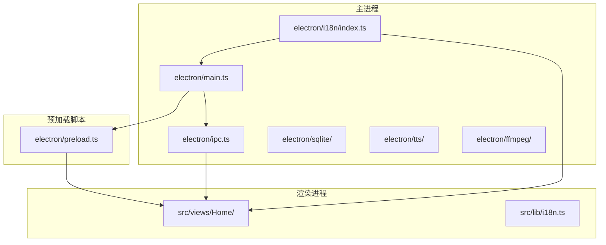

**图表来源**
- [electron/main.ts:1-204](file://electron/main.ts#L1-L204)
- [electron/ipc.ts:1-188](file://electron/ipc.ts#L1-L188)
- [electron/preload.ts:1-75](file://electron/preload.ts#L1-L75)

**章节来源**
- [electron/main.ts:1-204](file://electron/main.ts#L1-L204)
- [electron/ipc.ts:1-188](file://electron/ipc.ts#L1-L188)
- [electron/preload.ts:1-75](file://electron/preload.ts#L1-L75)

## 核心组件

### 主进程IPC处理器

主进程通过`ipcMain.handle`注册各种异步API，实现请求-响应模式：

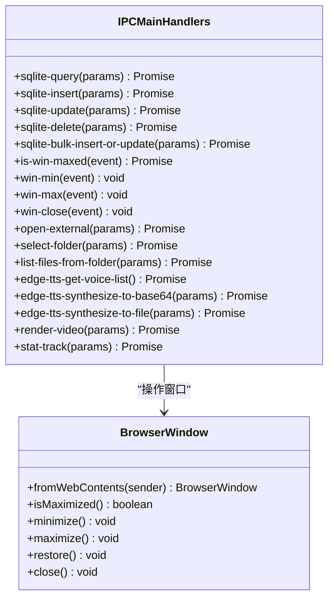

**图表来源**
- [electron/ipc.ts:77-187](file://electron/ipc.ts#L77-L187)

### 预加载脚本与上下文隔离

预加载脚本通过`contextBridge`安全地向渲染进程暴露API：

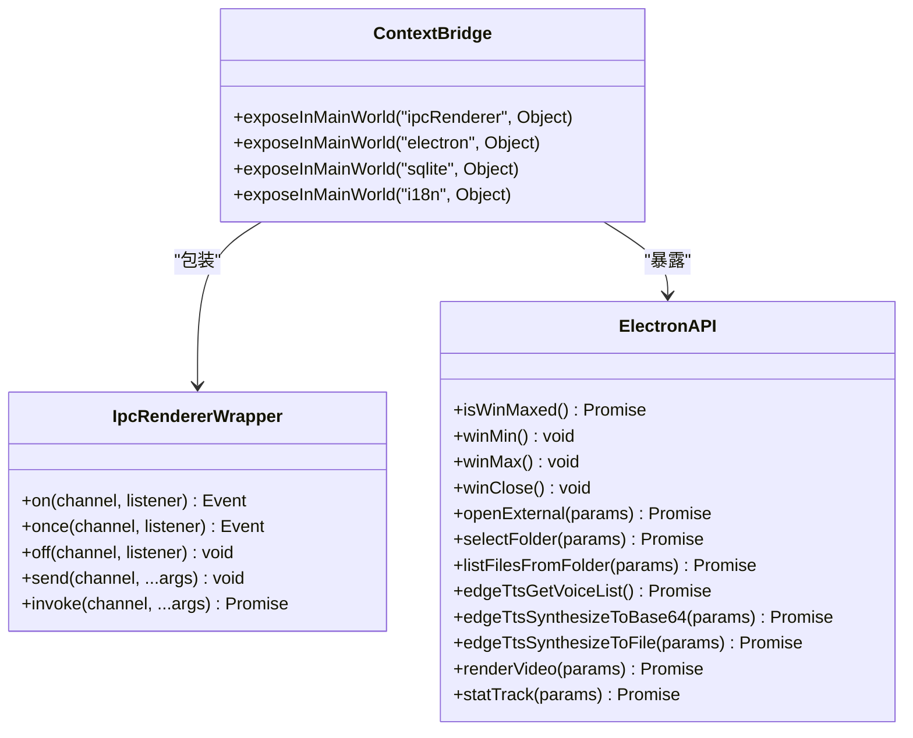

**图表来源**
- [electron/preload.ts:20-75](file://electron/preload.ts#L20-L75)

**章节来源**
- [electron/ipc.ts:77-187](file://electron/ipc.ts#L77-L187)
- [electron/preload.ts:18-75](file://electron/preload.ts#L18-L75)

## 架构概览

短视频工厂的IPC架构采用分层设计，确保安全性与功能性并重：

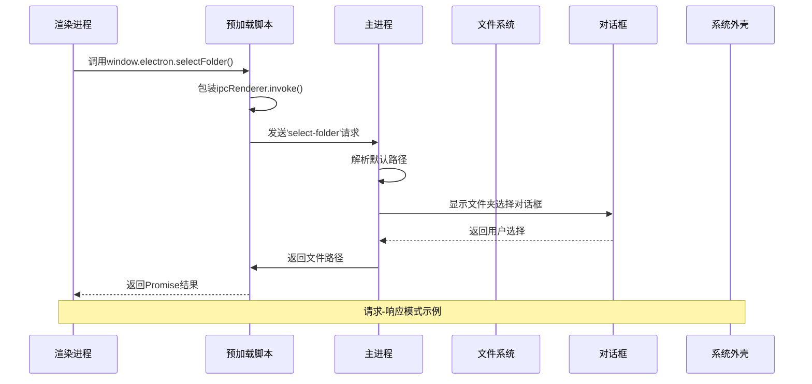

**图表来源**
- [electron/preload.ts:55-57](file://electron/preload.ts#L55-L57)
- [electron/ipc.ts:119-144](file://electron/ipc.ts#L119-L144)

### 事件广播机制

对于长时间运行的任务，采用事件广播机制：

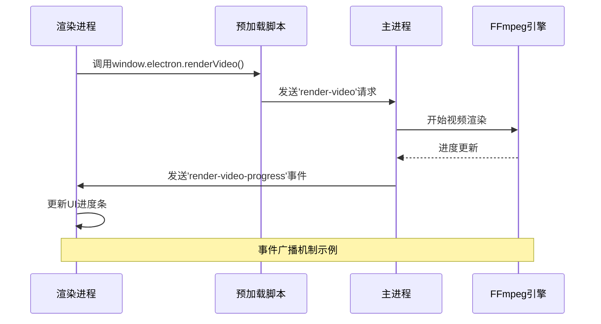

**图表来源**
- [electron/ipc.ts:171-186](file://electron/ipc.ts#L171-L186)
- [src/views/Home/components/VideoRender.vue:197-199](file://src/views/Home/components/VideoRender.vue#L197-L199)

## 详细组件分析

### SQLite数据库访问层

SQLite模块提供了完整的CRUD操作API：

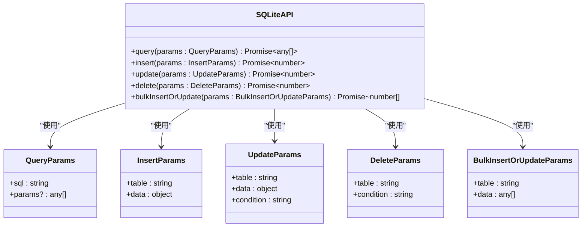

**图表来源**
- [electron/preload.ts:67-74](file://electron/preload.ts#L67-L74)
- [electron/sqlite/types.ts:1-26](file://electron/sqlite/types.ts#L1-L26)

### TTS语音合成服务

EdgeTTS集成提供了语音合成能力：

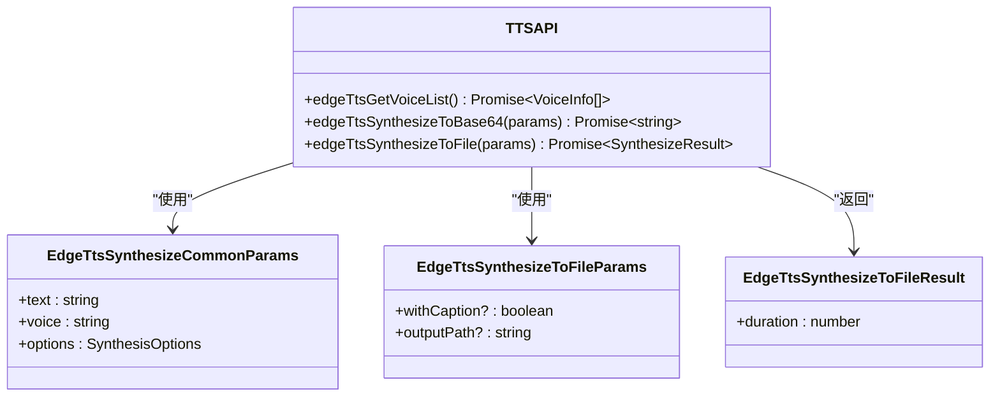

**图表来源**
- [electron/preload.ts:58-64](file://electron/preload.ts#L58-L64)
- [electron/tts/types.ts:1-20](file://electron/tts/types.ts#L1-L20)

### 视频渲染引擎

FFmpeg集成实现了视频合成功能：

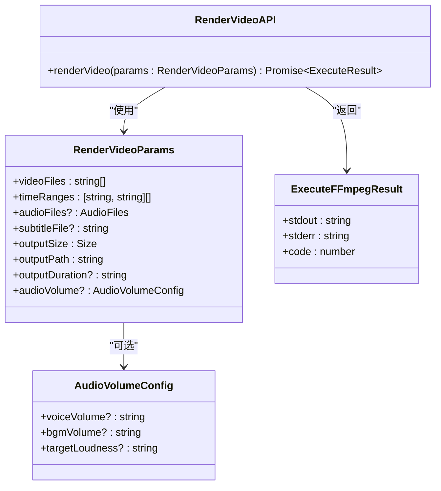

**图表来源**
- [electron/preload.ts:63-63](file://electron/preload.ts#L63-L63)
- [electron/ffmpeg/types.ts:1-23](file://electron/ffmpeg/types.ts#L1-L23)

**章节来源**
- [electron/sqlite/types.ts:1-26](file://electron/sqlite/types.ts#L1-L26)
- [electron/tts/types.ts:1-20](file://electron/tts/types.ts#L1-L20)
- [electron/ffmpeg/types.ts:1-23](file://electron/ffmpeg/types.ts#L1-L23)

### 国际化支持

多语言系统通过IPC实现：

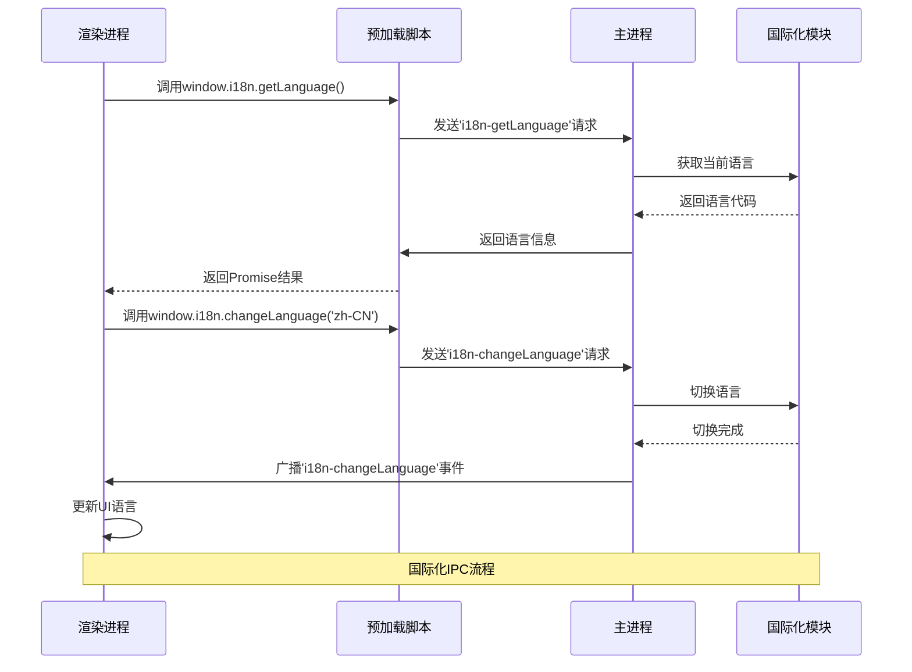

**图表来源**
- [electron/preload.ts:43-47](file://electron/preload.ts#L43-L47)
- [electron/i18n/index.ts:24-42](file://electron/i18n/index.ts#L24-L42)

**章节来源**
- [electron/i18n/index.ts:13-42](file://electron/i18n/index.ts#L13-L42)
- [src/lib/i18n.ts:7-23](file://src/lib/i18n.ts#L7-L23)

## 依赖关系分析

IPC系统的依赖关系呈现清晰的层次结构：

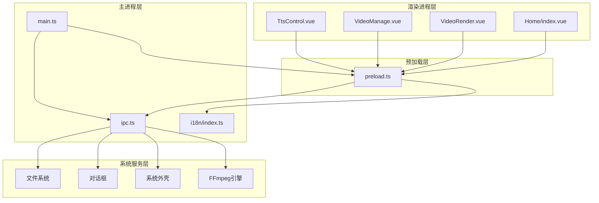

**图表来源**
- [electron/main.ts:187-191](file://electron/main.ts#L187-L191)
- [electron/preload.ts:18-75](file://electron/preload.ts#L18-L75)
- [electron/ipc.ts:77-187](file://electron/ipc.ts#L77-L187)

**章节来源**
- [electron/main.ts:187-191](file://electron/main.ts#L187-L191)
- [electron/preload.ts:18-75](file://electron/preload.ts#L18-L75)

## 性能考虑

### IPC调用优化策略

1. **批量操作优化**
   - 使用`sqlite-bulk-insert-or-update`处理大量数据
   - 合并多个小操作为单个批量操作

2. **事件驱动架构**
   - 长时间任务使用事件广播而非轮询
   - 实现进度回调机制

3. **内存管理**
   - 及时清理音频资源
   - 合理使用AbortController中断长时间操作

4. **缓存策略**
   - 缓存语音列表和文件列表
   - 避免重复的文件系统查询

### 错误处理机制

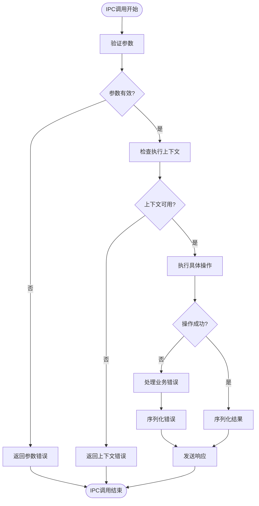

**图表来源**
- [electron/ipc.ts:119-144](file://electron/ipc.ts#L119-L144)
- [electron/ipc.ts:171-186](file://electron/ipc.ts#L171-L186)

## 故障排除指南

### 常见问题诊断

1. **IPC调用超时**
   - 检查主进程是否正确注册了对应的handle
   - 验证预加载脚本是否正确暴露了API
   - 确认渲染进程的调用时机

2. **权限相关错误**
   - 文件系统访问权限不足
   - 对话框权限被阻止
   - 外部链接打开失败

3. **数据序列化问题**
   - 复杂对象的循环引用
   - 不可序列化的数据类型
   - 大文件传输优化

### 调试技巧

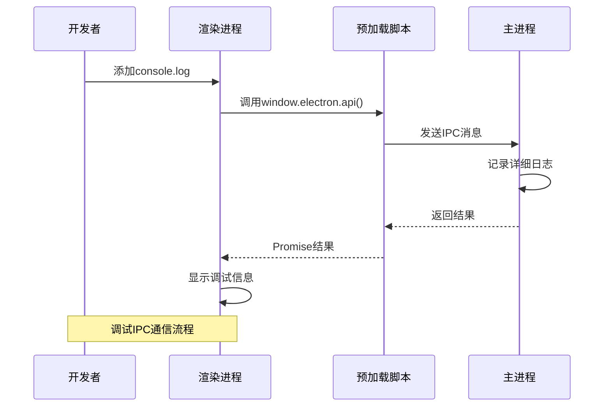

**章节来源**
- [src/views/Home/components/TtsControl.vue:102-112](file://src/views/Home/components/TtsControl.vue#L102-L112)
- [src/views/Home/components/VideoManage.vue:102-118](file://src/views/Home/components/VideoManage.vue#L102-L118)

## 结论

短视频工厂项目的IPC架构展现了现代Electron应用的最佳实践：

1. **安全性优先**：通过上下文隔离和严格的API暴露控制，确保渲染进程只能访问授权的功能。

2. **性能优化**：采用事件驱动的长任务处理、批量操作和合理的缓存策略，提升用户体验。

3. **可维护性**：清晰的模块划分和标准化的IPC协议，便于代码维护和功能扩展。

4. **错误处理**：完善的异常捕获和错误反馈机制，提供良好的用户反馈。

该架构为类似多媒体处理应用的IPC设计提供了优秀的参考模板，特别是在处理复杂数据流和长时间任务方面具有重要借鉴价值。