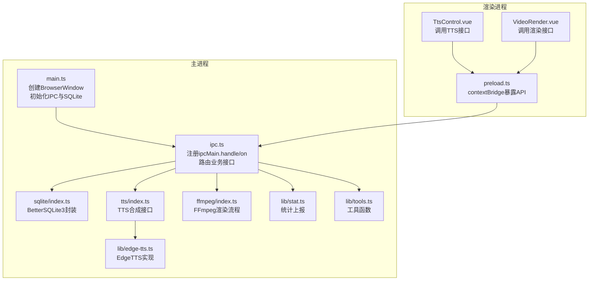
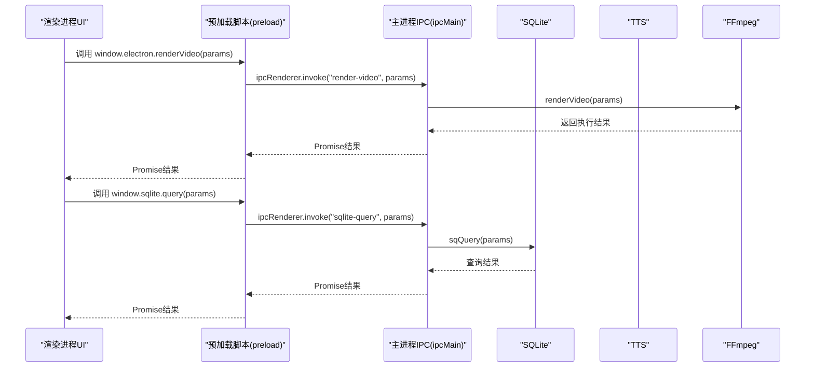
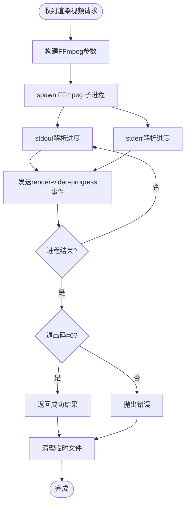
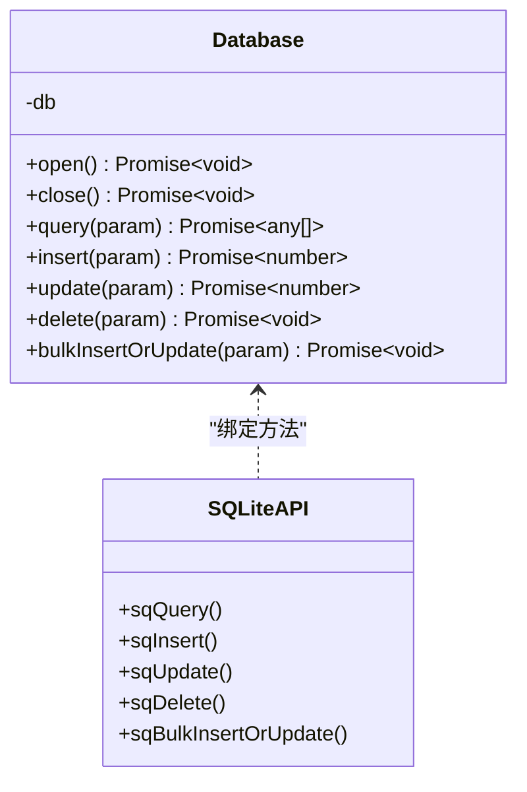
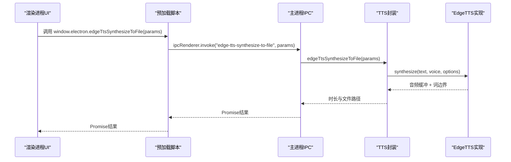
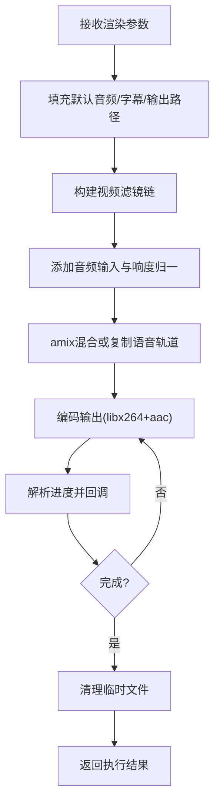
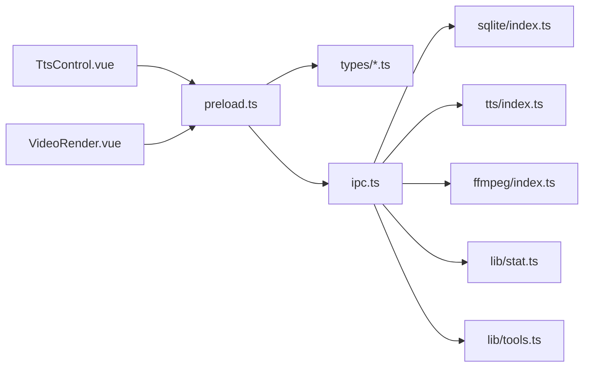

# IPC通信层

<cite>
**本文引用的文件**
- [electron/ipc.ts](file://electron/ipc.ts)
- [electron/main.ts](file://electron/main.ts)
- [electron/preload.ts](file://electron/preload.ts)
- [electron/sqlite/index.ts](file://electron/sqlite/index.ts)
- [electron/sqlite/types.ts](file://electron/sqlite/types.ts)
- [electron/tts/index.ts](file://electron/tts/index.ts)
- [electron/tts/types.ts](file://electron/tts/types.ts)
- [electron/ffmpeg/index.ts](file://electron/ffmpeg/index.ts)
- [electron/ffmpeg/types.ts](file://electron/ffmpeg/types.ts)
- [electron/types.ts](file://electron/types.ts)
- [electron/lib/edge-tts.ts](file://electron/lib/edge-tts.ts)
- [electron/lib/stat.ts](file://electron/lib/stat.ts)
- [electron/lib/tools.ts](file://electron/lib/tools.ts)
- [src/views/Home/components/TtsControl.vue](file://src/views/Home/components/TtsControl.vue)
- [src/views/Home/components/VideoRender.vue](file://src/views/Home/components/VideoRender.vue)
</cite>

## 目录
1. [引言](#引言)
2. [项目结构](#项目结构)
3. [核心组件](#核心组件)
4. [架构总览](#架构总览)
5. [详细组件分析](#详细组件分析)
6. [依赖关系分析](#依赖关系分析)
7. [性能考虑](#性能考虑)
8. [故障排查指南](#故障排查指南)
9. [结论](#结论)
10. [附录](#附录)

## 引言
本文件聚焦短视频工厂项目的IPC（进程间通信）层，系统性阐述主进程与渲染进程之间的通信机制、消息协议、数据序列化与反序列化流程，以及IPC处理器的设计与实现。内容覆盖SQLite操作、文件系统访问、TTS控制、视频渲染等接口封装，并解释预加载脚本的安全机制与上下文隔离策略。同时提供IPC接口的使用示例、错误处理机制、通信性能优化与调试技巧，以及IPC在整体架构中的关键作用与设计考量。

## 项目结构
IPC通信层位于Electron应用的“electron”目录下，采用“按职责分层”的组织方式：
- 主进程入口与窗口管理：electron/main.ts
- IPC处理器注册与业务逻辑：electron/ipc.ts
- 预加载脚本与上下文桥接：electron/preload.ts
- SQLite数据库封装：electron/sqlite/index.ts 及其类型定义
- TTS语音合成：electron/tts/index.ts、底层实现 electron/lib/edge-tts.ts
- 视频渲染：electron/ffmpeg/index.ts 及其类型定义
- 辅助工具：electron/lib/tools.ts、统计上报 electron/lib/stat.ts
- 类型定义：electron/types.ts、electron/sqlite/types.ts、electron/tts/types.ts、electron/ffmpeg/types.ts

图表来源
- [electron/main.ts:187-204](file://electron/main.ts#L187-L204)
- [electron/ipc.ts:77-187](file://electron/ipc.ts#L77-L187)
- [electron/preload.ts:18-75](file://electron/preload.ts#L18-L75)

章节来源
- [electron/main.ts:187-204](file://electron/main.ts#L187-L204)
- [electron/ipc.ts:77-187](file://electron/ipc.ts#L77-L187)
- [electron/preload.ts:18-75](file://electron/preload.ts#L18-L75)

## 核心组件
- 主进程IPC处理器：集中注册所有ipcMain.handle与ipcMain.on，负责路由到具体业务模块（SQLite、TTS、FFmpeg、文件系统、窗口控制、统计上报等）。
- 预加载脚本：通过contextBridge将安全的API暴露给渲染进程，统一包装ipcRenderer.on/send/invoke，形成稳定的对外接口。
- SQLite封装：BetterSQLite3本地数据库封装，提供查询、插入、更新、删除、批量插入或更新等能力。
- TTS合成：基于EdgeTTS的语音合成，支持Base64返回、文件落盘、字幕生成与时长解析。
- FFmpeg渲染：视频拼接、裁剪、缩放、字幕叠加、音频响度归一与混合、编码输出。
- 工具与统计：生成唯一文件名、临时目录管理、统计事件上报。

章节来源
- [electron/ipc.ts:77-187](file://electron/ipc.ts#L77-L187)
- [electron/preload.ts:18-75](file://electron/preload.ts#L18-L75)
- [electron/sqlite/index.ts:38-154](file://electron/sqlite/index.ts#L38-L154)
- [electron/tts/index.ts:35-86](file://electron/tts/index.ts#L35-L86)
- [electron/ffmpeg/index.ts:26-272](file://electron/ffmpeg/index.ts#L26-L272)
- [electron/lib/tools.ts:8-28](file://electron/lib/tools.ts#L8-L28)
- [electron/lib/stat.ts:39-81](file://electron/lib/stat.ts#L39-L81)

## 架构总览
主进程负责承载系统能力与资源访问，渲染进程负责UI与用户交互。IPC通过“通道名（channel）+ 参数对象”的约定进行消息传递，主进程以handle/on响应，渲染进程以invoke/send触发。预加载脚本作为“安全网关”，仅暴露必要API并统一封装事件监听与调用。

图表来源
- [electron/preload.ts:49-74](file://electron/preload.ts#L49-L74)
- [electron/ipc.ts:77-187](file://electron/ipc.ts#L77-L187)
- [electron/sqlite/index.ts:63-69](file://electron/sqlite/index.ts#L63-L69)
- [electron/ffmpeg/index.ts:26-186](file://electron/ffmpeg/index.ts#L26-L186)

## 详细组件分析

### IPC处理器设计与实现
- 注册点：initIPC函数集中注册所有通道，handle用于异步调用（返回Promise），on用于事件通知（无返回值）。
- 通道分类：
  - 数据库：sqlite-query、sqlite-insert、sqlite-update、sqlite-delete、sqlite-bulk-insert-or-update
  - 文件系统：select-folder、list-files-from-folder、open-external
  - 窗口控制：is-win-maxed、win-min、win-max、win-close
  - TTS：edge-tts-get-voice-list、edge-tts-synthesize-to-base64、edge-tts-synthesize-to-file
  - 渲染：render-video（含进度回调与取消信号）
  - 统计：stat-track
- 安全与容错：
  - 选择文件夹时对默认路径进行可访问性校验与回退策略。
  - 渲染视频通过AbortController支持取消，主进程监听“cancel-render-video”事件并终止子进程。
  - 进度回调通过事件通道实时推送到渲染进程，避免阻塞主线程。

图表来源
- [electron/ipc.ts:171-186](file://electron/ipc.ts#L171-L186)
- [electron/ffmpeg/index.ts:188-244](file://electron/ffmpeg/index.ts#L188-L244)

章节来源
- [electron/ipc.ts:77-187](file://electron/ipc.ts#L77-L187)
- [electron/ffmpeg/index.ts:26-186](file://electron/ffmpeg/index.ts#L26-L186)

### SQLite封装与数据序列化
- 数据库连接：BetterSQLite3，按平台与架构选择原生绑定，数据库文件位于用户数据目录。
- 接口设计：
  - sqQuery：动态SQL + 参数数组，返回行数组
  - sqInsert：表名 + 键值对象，返回最后插入ID
  - sqUpdate：表名 + 数据对象 + 条件字符串，返回变更行数
  - sqDelete：表名 + 条件字符串
  - sqBulkInsertOrUpdate：批量插入或按ID更新（事务包裹）
- 序列化策略：参数对象通过IPC传输，主进程侧直接使用参数；渲染进程侧通过预加载脚本invoke传递，无需额外序列化。

图表来源
- [electron/sqlite/index.ts:38-154](file://electron/sqlite/index.ts#L38-L154)

章节来源
- [electron/sqlite/index.ts:38-154](file://electron/sqlite/index.ts#L38-L154)
- [electron/sqlite/types.ts:1-26](file://electron/sqlite/types.ts#L1-L26)

### TTS控制与字幕生成
- 语音列表：调用EdgeTTS获取可用语音清单，过滤语言与性别后展示。
- 合成流程：
  - 基于文本切片与SSML参数，建立WebSocket连接，接收音频数据与词边界元数据。
  - 支持Base64返回与文件落盘，可选生成SRT字幕。
  - 时长解析：通过音乐元数据解析MP3时长，确保后续渲染一致性。
- 临时文件管理：应用退出前清理临时TTS文件，避免磁盘占用。

图表来源
- [electron/preload.ts:58-64](file://electron/preload.ts#L58-L64)
- [electron/ipc.ts:157-169](file://electron/ipc.ts#L157-L169)
- [electron/tts/index.ts:45-86](file://electron/tts/index.ts#L45-L86)
- [electron/lib/edge-tts.ts:477-549](file://electron/lib/edge-tts.ts#L477-L549)

章节来源
- [electron/tts/index.ts:35-86](file://electron/tts/index.ts#L35-L86)
- [electron/lib/edge-tts.ts:420-632](file://electron/lib/edge-tts.ts#L420-L632)
- [electron/tts/types.ts:1-20](file://electron/tts/types.ts#L1-L20)

### 视频渲染与进度回调
- 输入参数：视频片段、时间范围、输出尺寸、输出路径、可选背景音乐与字幕、可选输出时长与音量配置。
- 渲染策略：
  - 视频：逐段trim、setpts、scale、pad、fps、format、setpts
  - 拼接：concat过滤器
  - 字幕：在拼接后叠加SRT字幕
  - 音频：loudnorm响度归一，amix混合，支持按目标时长trim
  - 编码：libx264 + aac，固定帧率与分辨率
- 进度与取消：
  - 通过FFmpeg标准输出解析时间戳计算进度，上限99%，完成后置100%
  - 支持AbortSignal取消，主进程监听“cancel-render-video”事件并终止子进程

图表来源
- [electron/ffmpeg/index.ts:26-186](file://electron/ffmpeg/index.ts#L26-L186)
- [electron/ffmpeg/types.ts:7-23](file://electron/ffmpeg/types.ts#L7-L23)

章节来源
- [electron/ffmpeg/index.ts:26-272](file://electron/ffmpeg/index.ts#L26-L272)
- [electron/ffmpeg/types.ts:1-23](file://electron/ffmpeg/types.ts#L1-L23)

### 预加载脚本的安全机制与上下文隔离
- contextBridge暴露：
  - 将ipcRenderer、i18n、electron、sqlite等API安全地注入到window对象
  - 对on/once/off/send/invoke进行轻量包装，保证事件监听与调用的一致性
- 隔离策略：
  - 仅暴露必要接口，避免直接访问Node/Electron能力
  - 所有调用均通过通道名与参数对象进行，便于审计与限制
- 类型约束：
  - electron-env.d.ts声明了window上的API签名，确保类型安全

章节来源
- [electron/preload.ts:18-75](file://electron/preload.ts#L18-L75)
- [electron/electron-env.d.ts:24-54](file://electron/electron-env.d.ts#L24-L54)

### IPC接口使用示例与错误处理
- TTS试听（Base64）：渲染进程调用 window.electron.edgeTtsSynthesizeToBase64，捕获异常并提示用户复制错误详情。
- 合成到文件并生成字幕：调用 window.electron.edgeTtsSynthesizeToFile，返回时长用于后续渲染配置。
- 视频渲染：调用 window.electron.renderVideo，订阅“render-video-progress”事件更新UI进度；点击取消发送“cancel-render-video”事件。
- 文件夹选择：window.electron.selectFolder，支持标题与默认路径，返回绝对路径或null。
- SQLite查询：window.sqlite.query，传入SQL与参数数组，返回行数组。

章节来源
- [src/views/Home/components/TtsControl.vue:91-138](file://src/views/Home/components/TtsControl.vue#L91-L138)
- [src/views/Home/components/TtsControl.vue:209-226](file://src/views/Home/components/TtsControl.vue#L209-L226)
- [src/views/Home/components/VideoRender.vue:196-199](file://src/views/Home/components/VideoRender.vue#L196-L199)
- [electron/preload.ts:58-64](file://electron/preload.ts#L58-L64)
- [electron/preload.ts:67-74](file://electron/preload.ts#L67-L74)

## 依赖关系分析
- 主进程依赖：
  - sqlite/index.ts：数据库能力
  - tts/index.ts：TTS能力
  - ffmpeg/index.ts：视频渲染能力
  - lib/stat.ts：统计上报
  - lib/tools.ts：工具函数
- 预加载脚本依赖：
  - electron/types.ts、sqlite/types.ts、tts/types.ts、ffmpeg/types.ts：参数类型
- 渲染进程依赖：
  - 预加载脚本暴露的API，通过window.electron/window.sqlite/window.ipcRenderer使用

图表来源
- [electron/preload.ts:18-75](file://electron/preload.ts#L18-L75)
- [electron/ipc.ts:5-14](file://electron/ipc.ts#L5-L14)
- [electron/types.ts:1-26](file://electron/types.ts#L1-L26)
- [electron/sqlite/types.ts:1-26](file://electron/sqlite/types.ts#L1-L26)
- [electron/tts/types.ts:1-20](file://electron/tts/types.ts#L1-L20)
- [electron/ffmpeg/types.ts:1-23](file://electron/ffmpeg/types.ts#L1-L23)

章节来源
- [electron/ipc.ts:5-14](file://electron/ipc.ts#L5-L14)
- [electron/preload.ts:18-75](file://electron/preload.ts#L18-L75)

## 性能考虑
- IPC调用粒度：将大任务拆分为多个小步骤（如TTS分片、FFmpeg分阶段滤镜），减少单次调用的阻塞时间。
- 进度回调：通过事件通道推送进度，避免轮询带来的CPU消耗。
- 取消机制：AbortController + “cancel-render-video”事件，快速中断耗时任务。
- 编码参数：固定帧率与分辨率、合理CRF与码率，平衡质量与体积。
- 临时文件：及时清理，避免磁盘压力与IO抖动。

## 故障排查指南
- FFmpeg找不到或权限不足：检查可执行文件路径与可执行权限，Windows平台跳过X_OK校验。
- TTS合成失败：检查网络连通性、语音参数合法性、SSML构造是否正确。
- SQLite连接失败：确认数据库文件存在且可写，原生绑定路径匹配当前平台与架构。
- 渲染进度异常：核对FFmpeg输出解析逻辑，确保未被日志干扰。
- 统计上报失败：检查ANALYTICS_IN_DEV环境变量与超时设置。

章节来源
- [electron/ffmpeg/index.ts:246-259](file://electron/ffmpeg/index.ts#L246-L259)
- [electron/tts/index.ts:74-81](file://electron/tts/index.ts#L74-L81)
- [electron/sqlite/index.ts:35-36](file://electron/sqlite/index.ts#L35-L36)
- [electron/lib/stat.ts:13-28](file://electron/lib/stat.ts#L13-L28)

## 结论
IPC通信层通过明确的通道命名、严格的参数类型与统一的预加载脚本暴露，实现了主进程能力与渲染进程UI的解耦。SQLite、TTS、FFmpeg等核心能力以模块化方式接入，既保证了扩展性，也强化了安全性与稳定性。结合进度回调与取消机制，系统在复杂任务场景下仍能保持良好的用户体验。

## 附录
- 关键通道一览
  - 数据库：sqlite-query、sqlite-insert、sqlite-update、sqlite-delete、sqlite-bulk-insert-or-update
  - 文件系统：select-folder、list-files-from-folder、open-external
  - 窗口控制：is-win-maxed、win-min、win-max、win-close
  - TTS：edge-tts-get-voice-list、edge-tts-synthesize-to-base64、edge-tts-synthesize-to-file
  - 渲染：render-video、render-video-progress、cancel-render-video
  - 统计：stat-track