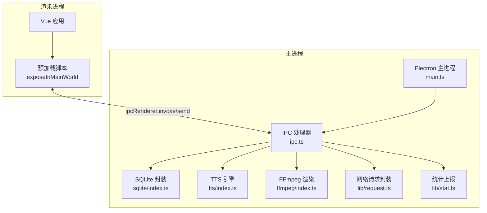
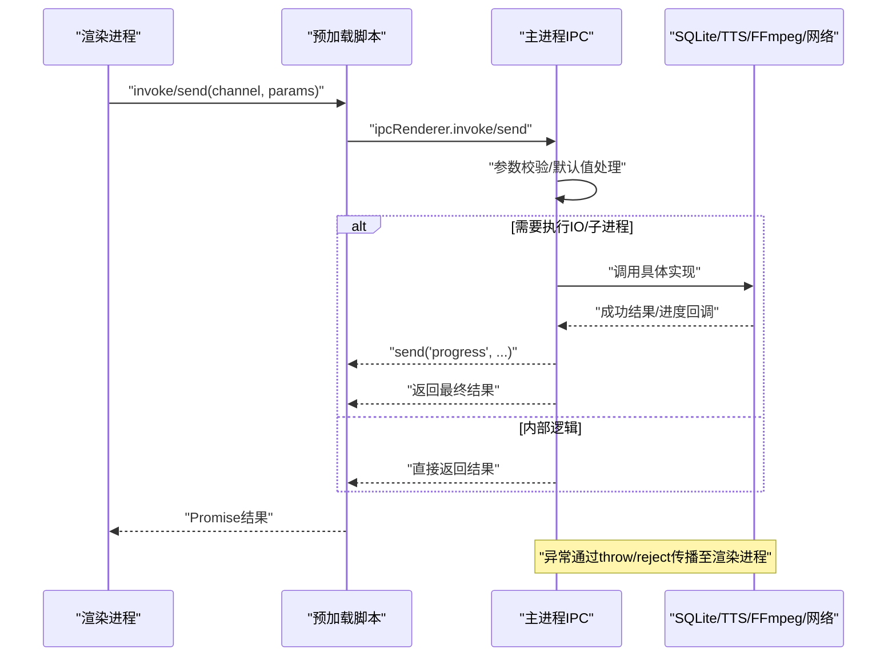
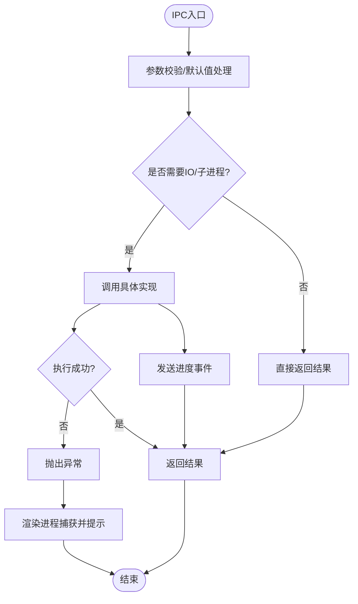
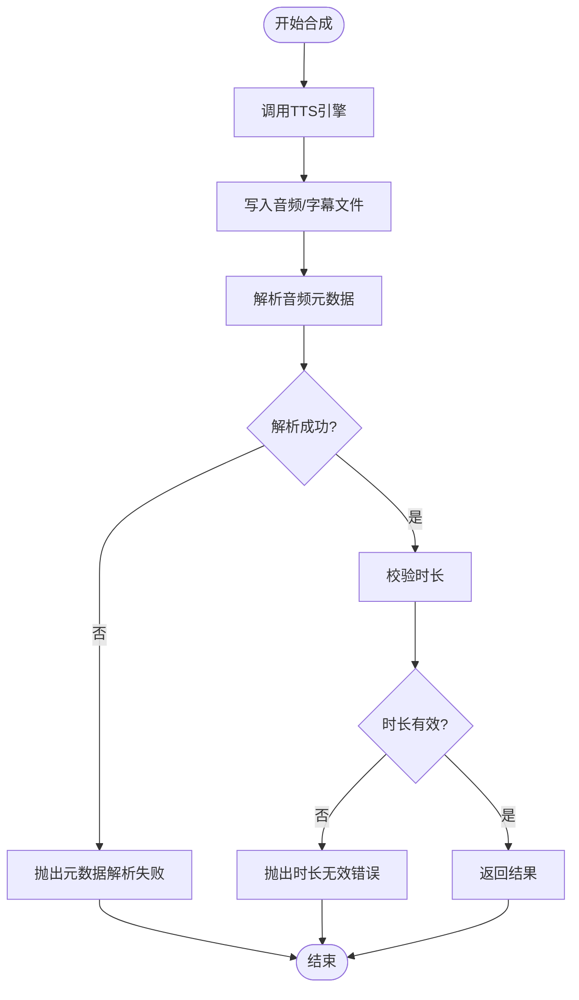
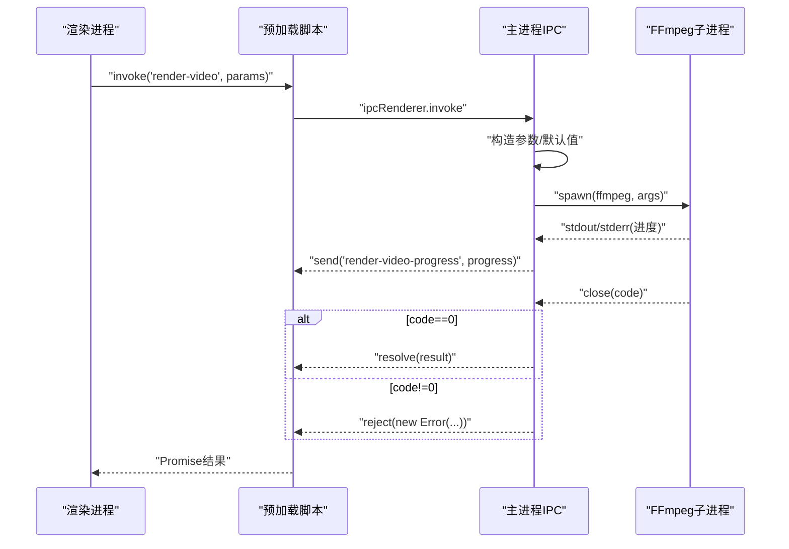
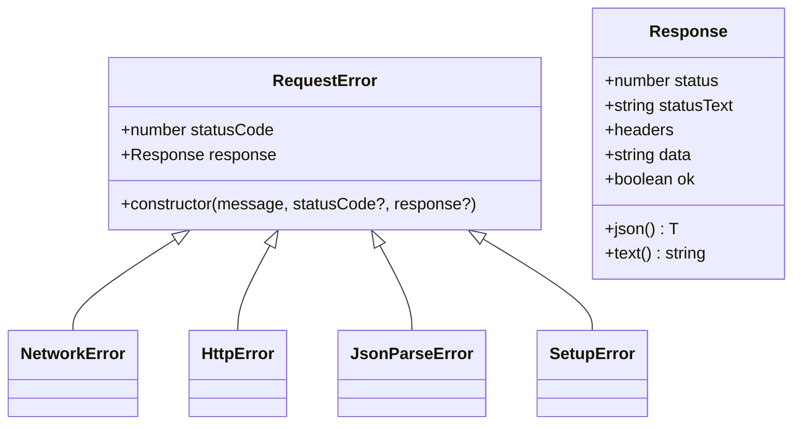
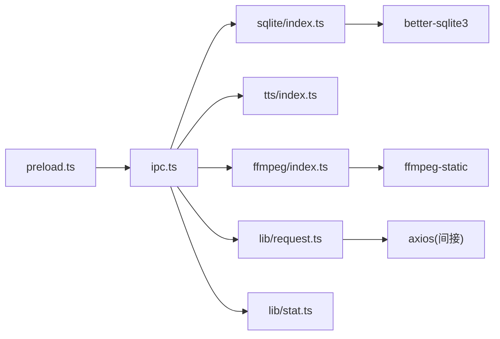

# IPC错误处理与调试

<cite>
**本文引用的文件**
- [electron/ipc.ts](file://electron/ipc.ts)
- [electron/main.ts](file://electron/main.ts)
- [electron/preload.ts](file://electron/preload.ts)
- [electron/sqlite/index.ts](file://electron/sqlite/index.ts)
- [electron/tts/index.ts](file://electron/tts/index.ts)
- [electron/ffmpeg/index.ts](file://electron/ffmpeg/index.ts)
- [electron/lib/request.ts](file://electron/lib/request.ts)
- [electron/lib/stat.ts](file://electron/lib/stat.ts)
- [src/lib/error-copy.ts](file://src/lib/error-copy.ts)
- [electron/lib/tools.ts](file://electron/lib/tools.ts)
- [electron/lib/is-dev.ts](file://electron/lib/is-dev.ts)
- [electron/vl/types.ts](file://electron/vl/types.ts)
- [package.json](file://package.json)
</cite>

## 目录
1. [简介](#简介)
2. [项目结构](#项目结构)
3. [核心组件](#核心组件)
4. [架构总览](#架构总览)
5. [详细组件分析](#详细组件分析)
6. [依赖关系分析](#依赖关系分析)
7. [性能考量](#性能考量)
8. [故障排查指南](#故障排查指南)
9. [结论](#结论)
10. [附录](#附录)

## 简介
本文件聚焦短视频工厂项目中的IPC（进程间通信）错误处理与调试机制，覆盖错误类型与传播路径、最佳实践（try-catch包装、错误格式化、用户友好提示）、调试方法（日志、追踪、性能监控）、常见问题诊断与解决方案、开发与生产环境的监控策略，以及错误恢复与降级处理建议。文档基于实际代码实现进行分析，并提供可视化图示帮助理解。

## 项目结构
本项目采用Electron主进程与渲染进程分离的架构，IPC通过ipcMain/ipcRenderer桥接，预加载脚本通过contextBridge对外暴露受控API。数据库、TTS、FFmpeg、网络请求等能力均通过IPC在主进程侧执行，渲染进程仅通过invoke/send调用。

图表来源
- [electron/main.ts:187-204](file://electron/main.ts#L187-L204)
- [electron/preload.ts:21-100](file://electron/preload.ts#L21-L100)
- [electron/ipc.ts:89-295](file://electron/ipc.ts#L89-L295)
- [electron/sqlite/index.ts:144-194](file://electron/sqlite/index.ts#L144-L194)
- [electron/tts/index.ts:35-86](file://electron/tts/index.ts#L35-L86)
- [electron/ffmpeg/index.ts:26-272](file://electron/ffmpeg/index.ts#L26-L272)
- [electron/lib/request.ts:121-219](file://electron/lib/request.ts#L121-L219)
- [electron/lib/stat.ts:39-81](file://electron/lib/stat.ts#L39-L81)

章节来源
- [electron/main.ts:187-204](file://electron/main.ts#L187-L204)
- [electron/preload.ts:21-100](file://electron/preload.ts#L21-L100)
- [electron/ipc.ts:89-295](file://electron/ipc.ts#L89-L295)

## 核心组件
- 预加载脚本：通过contextBridge将安全可控的API暴露给渲染进程，统一封装ipcRenderer.on/send/invoke。
- IPC处理器：集中注册ipcMain.handle/on，负责业务编排、参数校验、异常抛出与进度回调。
- 数据库层：Better-SQLite3封装，提供查询、插入、更新、删除、批量插入/更新等能力，并在初始化阶段创建表与索引。
- TTS引擎：基于EdgeTTS合成音频，支持Base64返回与文件落盘，包含元数据解析与时长校验。
- FFmpeg渲染：拼接复杂滤镜链，实时解析进度，支持AbortSignal取消，严格校验输出路径与可执行权限。
- 网络请求：自定义RequestError类，统一处理超时、JSON解析失败、HTTP错误码等。
- 统计上报：条件性上报统计事件，带超时控制与开发模式开关。

章节来源
- [electron/preload.ts:21-100](file://electron/preload.ts#L21-L100)
- [electron/ipc.ts:89-295](file://electron/ipc.ts#L89-L295)
- [electron/sqlite/index.ts:144-194](file://electron/sqlite/index.ts#L144-L194)
- [electron/tts/index.ts:35-86](file://electron/tts/index.ts#L35-L86)
- [electron/ffmpeg/index.ts:26-272](file://electron/ffmpeg/index.ts#L26-L272)
- [electron/lib/request.ts:57-219](file://electron/lib/request.ts#L57-L219)
- [electron/lib/stat.ts:39-81](file://electron/lib/stat.ts#L39-L81)

## 架构总览
下图展示IPC调用链与错误传播路径，涵盖主进程API注册、渲染进程调用、参数校验、异常抛出与进度回调。

图表来源
- [electron/preload.ts:21-100](file://electron/preload.ts#L21-L100)
- [electron/ipc.ts:89-295](file://electron/ipc.ts#L89-L295)
- [electron/sqlite/index.ts:63-139](file://electron/sqlite/index.ts#L63-L139)
- [electron/tts/index.ts:39-85](file://electron/tts/index.ts#L39-L85)
- [electron/ffmpeg/index.ts:188-244](file://electron/ffmpeg/index.ts#L188-L244)
- [electron/lib/request.ts:121-219](file://electron/lib/request.ts#L121-L219)

## 详细组件分析

### IPC处理器与错误传播
- 注册点：主进程在启动时调用initIPC，集中注册所有ipcMain.handle/on。
- 错误传播：主进程中多数异步处理通过throw/reject向上抛出；渲染进程通过ipcRenderer.invoke捕获异常并转为用户可见错误。
- 进度回调：视频渲染、素材分析等耗时任务通过事件通道实时反馈进度。
- 取消机制：通过AbortController与once监听实现可中断操作。

图表来源
- [electron/ipc.ts:184-198](file://electron/ipc.ts#L184-L198)
- [electron/ipc.ts:208-224](file://electron/ipc.ts#L208-L224)
- [electron/ffmpeg/index.ts:205-243](file://electron/ffmpeg/index.ts#L205-L243)

章节来源
- [electron/ipc.ts:89-295](file://electron/ipc.ts#L89-L295)
- [electron/ffmpeg/index.ts:26-272](file://electron/ffmpeg/index.ts#L26-L272)

### SQLite错误处理与最佳实践
- 初始化：打开数据库、建表、建索引，异常通过日志输出。
- 查询/写入：使用Better-SQLite3原生异常，建议在调用方捕获并格式化。
- 批量操作：事务包裹，减少部分失败风险。
- 最佳实践：
  - 在调用方使用try-catch包装，捕获并格式化为用户可读错误。
  - 对外暴露统一的错误类型或错误码，便于前端统一提示。
  - 记录关键上下文（如SQL、参数、表名）以便定位问题。

章节来源
- [electron/sqlite/index.ts:144-194](file://electron/sqlite/index.ts#L144-L194)
- [electron/sqlite/index.ts:63-139](file://electron/sqlite/index.ts#L63-L139)

### TTS合成与音频元数据解析
- 功能：语音合成、Base64返回、文件落盘、字幕生成。
- 错误点：元数据解析失败、时长无效、文件写入失败。
- 处理：解析失败抛出明确错误；时长非有限数或<=0时抛出用户可理解的提示。

图表来源
- [electron/tts/index.ts:39-85](file://electron/tts/index.ts#L39-L85)

章节来源
- [electron/tts/index.ts:35-86](file://electron/tts/index.ts#L35-L86)

### FFmpeg渲染与进度/取消机制
- 参数校验：输出路径存在性、可执行权限校验。
- 进度解析：从stderr解析时间戳，换算进度百分比，上限99%防止阻塞。
- 取消：AbortSignal触发SIGTERM终止子进程。
- 错误：子进程非0退出码与error事件统一转换为错误信息。

图表来源
- [electron/ffmpeg/index.ts:26-272](file://electron/ffmpeg/index.ts#L26-L272)
- [electron/ipc.ts:184-198](file://electron/ipc.ts#L184-L198)

章节来源
- [electron/ffmpeg/index.ts:188-244](file://electron/ffmpeg/index.ts#L188-L244)
- [electron/ffmpeg/index.ts:246-272](file://electron/ffmpeg/index.ts#L246-L272)

### 网络请求与错误类型
- 自定义RequestError：携带statusCode/response，便于区分网络错误、超时、HTTP错误码、JSON解析失败。
- 超时：统一超时控制，超时后abort并拒绝。
- 错误分类：
  - 网络错误：req.on('error')捕获。
  - HTTP错误：status不在2xx范围时拒绝。
  - JSON解析失败：response.json()内部异常时拒绝。
  - 请求构造失败：try/catch包裹后拒绝。

图表来源
- [electron/lib/request.ts:57-69](file://electron/lib/request.ts#L57-L69)
- [electron/lib/request.ts:37-52](file://electron/lib/request.ts#L37-L52)

章节来源
- [electron/lib/request.ts:121-219](file://electron/lib/request.ts#L121-L219)

### 统计上报与开发模式
- 条件上报：开发模式可通过环境变量开启/关闭。
- 超时控制：请求超时5秒，失败在开发模式下仅警告。
- 上报字段：屏幕尺寸、语言、标题、主机名、URL、来源等。

章节来源
- [electron/lib/stat.ts:39-81](file://electron/lib/stat.ts#L39-L81)
- [electron/lib/is-dev.ts:1-2](file://electron/lib/is-dev.ts#L1-L2)

### 错误格式化与复制
- 渲染进程提供格式化函数，将错误信息转为JSON字符串，便于复制粘贴。
- 建议在UI中提供一键复制按钮，提升问题反馈效率。

章节来源
- [src/lib/error-copy.ts:1-17](file://src/lib/error-copy.ts#L1-L17)

## 依赖关系分析
- 预加载脚本依赖ipcRenderer，向外暴露统一API。
- IPC处理器依赖各能力模块（SQLite、TTS、FFmpeg、网络、统计）。
- 统一错误类型：RequestError用于网络层；主进程通过throw/reject用于其他模块。
- 开发模式：isDev用于控制统计上报与日志行为。

图表来源
- [electron/preload.ts:21-100](file://electron/preload.ts#L21-L100)
- [electron/ipc.ts:89-295](file://electron/ipc.ts#L89-L295)
- [electron/sqlite/index.ts:1-11](file://electron/sqlite/index.ts#L1-L11)
- [electron/ffmpeg/index.ts:12-14](file://electron/ffmpeg/index.ts#L12-L14)
- [electron/lib/request.ts:1-1](file://electron/lib/request.ts#L1-L1)
- [package.json:22-31](file://package.json#L22-L31)

章节来源
- [electron/preload.ts:21-100](file://electron/preload.ts#L21-L100)
- [electron/ipc.ts:89-295](file://electron/ipc.ts#L89-L295)
- [package.json:22-31](file://package.json#L22-L31)

## 性能考量
- 进度上限：FFmpeg进度解析最大99%，避免UI卡死。
- 子进程取消：AbortSignal触发SIGTERM，快速释放资源。
- 文件路径生成：唯一文件名生成避免覆盖，减少重试成本。
- 统计上报：短超时避免阻塞主流程。

章节来源
- [electron/ffmpeg/index.ts:214-216](file://electron/ffmpeg/index.ts#L214-L216)
- [electron/ffmpeg/index.ts:238-242](file://electron/ffmpeg/index.ts#L238-L242)
- [electron/lib/tools.ts:8-20](file://electron/lib/tools.ts#L8-L20)
- [electron/lib/stat.ts:72-74](file://electron/lib/stat.ts#L72-L74)

## 故障排查指南

### 常见IPC错误与诊断
- 无法获取窗口
  - 现象：选择文件夹/图片时报错“无法获取窗口”。
  - 原因：BrowserWindow.fromWebContents(event.sender)为空。
  - 处理：确认渲染进程调用时机与窗口生命周期。
  - 章节来源
    - [electron/ipc.ts:134-136](file://electron/ipc.ts#L134-L136)
    - [electron/ipc.ts:279-281](file://electron/ipc.ts#L279-L281)

- 输出路径不存在
  - 现象：渲染视频时报错“输出路径不存在”。
  - 原因：输出目录不存在或无权限。
  - 处理：提前创建目录或提示用户选择有效路径。
  - 章节来源
    - [electron/ffmpeg/index.ts:51-54](file://electron/ffmpeg/index.ts#L51-L54)

- FFmpeg不可执行/缺失
  - 现象：启动失败或抛出“未找到”“无执行权限”。
  - 原因：打包后路径不正确或缺少执行权限。
  - 处理：核对ffmpeg-static安装与asar解包路径；Windows可忽略X_OK校验。
  - 章节来源
    - [electron/ffmpeg/index.ts:246-259](file://electron/ffmpeg/index.ts#L246-L259)

- TTS元数据解析失败/时长无效
  - 现象：音频时长为0或解析失败。
  - 原因：音频格式识别失败或网络/配置异常。
  - 处理：检查TTS配置、网络连通性；必要时重试或更换语音。
  - 章节来源
    - [electron/tts/index.ts:74-80](file://electron/tts/index.ts#L74-L80)

- 网络请求超时/HTTP错误
  - 现象：RequestError包含statusCode/response。
  - 原因：超时、服务端错误、JSON解析失败。
  - 处理：增加重试、检查接口可用性与鉴权。
  - 章节来源
    - [electron/lib/request.ts:135-142](file://electron/lib/request.ts#L135-L142)
    - [electron/lib/request.ts:182-188](file://electron/lib/request.ts#L182-L188)
    - [electron/lib/request.ts:169-174](file://electron/lib/request.ts#L169-L174)

- SQLite初始化失败
  - 现象：数据库打开失败或建表失败。
  - 原因：权限不足、路径异常。
  - 处理：检查userData目录权限与磁盘空间。
  - 章节来源
    - [electron/sqlite/index.ts:184-186](file://electron/sqlite/index.ts#L184-L186)

### 调试方法与工具
- 日志记录
  - 主进程：大量console输出，便于定位问题。
  - 统计上报：开发模式下失败仅警告，避免干扰。
  - 章节来源
    - [electron/sqlite/index.ts:50](file://electron/sqlite/index.ts#L50)
    - [electron/lib/stat.ts:76-78](file://electron/lib/stat.ts#L76-L78)

- 错误追踪
  - 使用统一错误类型（RequestError）便于前端分类处理。
  - 在渲染进程捕获并格式化，提供一键复制。
  - 章节来源
    - [electron/lib/request.ts:57-69](file://electron/lib/request.ts#L57-L69)
    - [src/lib/error-copy.ts:1-17](file://src/lib/error-copy.ts#L1-L17)

- 性能监控
  - FFmpeg进度上限99%，避免UI阻塞。
  - 统一超时控制，避免长时间挂起。
  - 章节来源
    - [electron/ffmpeg/index.ts:214-216](file://electron/ffmpeg/index.ts#L214-L216)
    - [electron/lib/stat.ts:72-74](file://electron/lib/stat.ts#L72-L74)

### 开发与生产环境监控
- 开发环境
  - 开启统计上报开关（ANALYTICS_IN_DEV）。
  - 使用VITE_DEV_SERVER_URL进行差异化路径处理。
  - 章节来源
    - [electron/lib/stat.ts:13-28](file://electron/lib/stat.ts#L13-L28)
    - [electron/main.ts:32-36](file://electron/main.ts#L32-L36)

- 生产环境
  - 默认启用统计上报；失败静默，不影响主流程。
  - 严格超时与错误分类，保障稳定性。
  - 章节来源
    - [electron/lib/stat.ts:24-28](file://electron/lib/stat.ts#L24-L28)
    - [electron/lib/stat.ts:75-80](file://electron/lib/stat.ts#L75-L80)

### 错误恢复与降级
- FFmpeg渲染
  - 支持取消（AbortSignal），失败后清理临时文件。
  - 建议：提供重试按钮与更详细的错误提示。
  - 章节来源
    - [electron/ffmpeg/index.ts:238-242](file://electron/ffmpeg/index.ts#L238-L242)
    - [electron/ffmpeg/index.ts:173-180](file://electron/ffmpeg/index.ts#L173-L180)

- TTS合成
  - 元数据解析失败时抛出明确错误；可引导用户检查网络与配置。
  - 章节来源
    - [electron/tts/index.ts:74-80](file://electron/tts/index.ts#L74-L80)

- 网络请求
  - 超时与HTTP错误分类处理；建议在前端实现指数退避重试。
  - 章节来源
    - [electron/lib/request.ts:135-142](file://electron/lib/request.ts#L135-L142)
    - [electron/lib/request.ts:182-188](file://electron/lib/request.ts#L182-L188)

### 调试工具使用指南
- 预加载脚本
  - 通过exposeInMainWorld暴露的API在渲染进程直接调用，便于快速复现问题。
  - 章节来源
    - [electron/preload.ts:21-100](file://electron/preload.ts#L21-L100)

- 错误格式化
  - 使用格式化函数生成标准JSON，便于复制到问题反馈渠道。
  - 章节来源
    - [src/lib/error-copy.ts:1-17](file://src/lib/error-copy.ts#L1-L17)

- 故障排除流程
  1) 确认主进程日志与统计上报状态。
  2) 在渲染进程捕获异常并格式化输出。
  3) 针对网络/FFmpeg/TTS分别检查对应模块的错误类型与提示。
  4) 必要时启用重试与降级策略。
  5) 收集并复制错误信息，提交至问题跟踪系统。

## 结论
本项目在IPC层面实现了清晰的职责划分与错误传播路径：预加载脚本统一暴露API，主进程集中处理业务与异常，各能力模块（SQLite、TTS、FFmpeg、网络、统计）通过明确的错误类型与日志输出支撑调试。建议在渲染进程侧进一步完善错误分类与用户提示，并在前端集成一键复制错误信息的能力，以提升问题反馈效率与用户体验。

## 附录
- 关键类型与参数
  - VL视觉大模型相关类型定义，便于理解IPC参数结构。
  - 章节来源
    - [electron/vl/types.ts:1-85](file://electron/vl/types.ts#L1-L85)