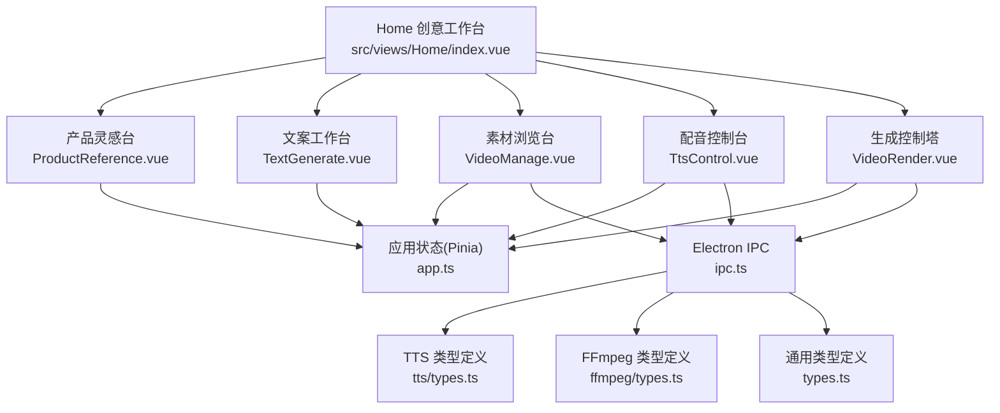
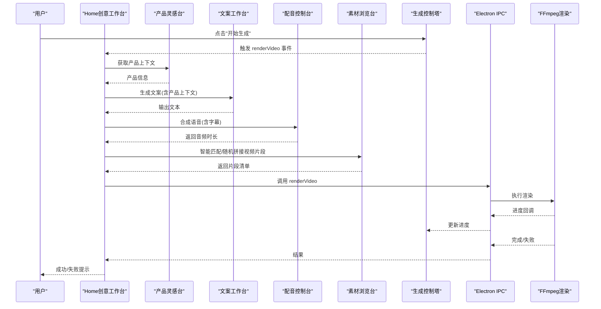
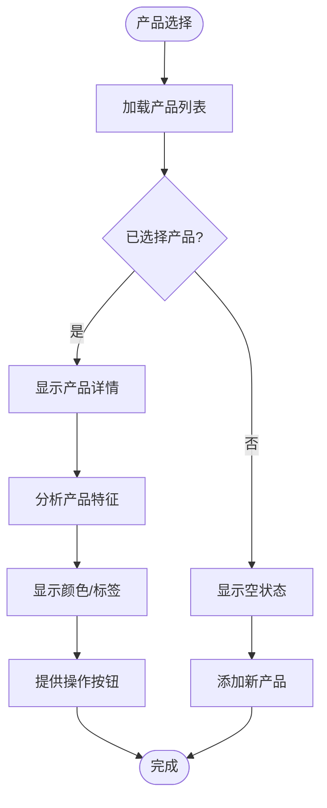
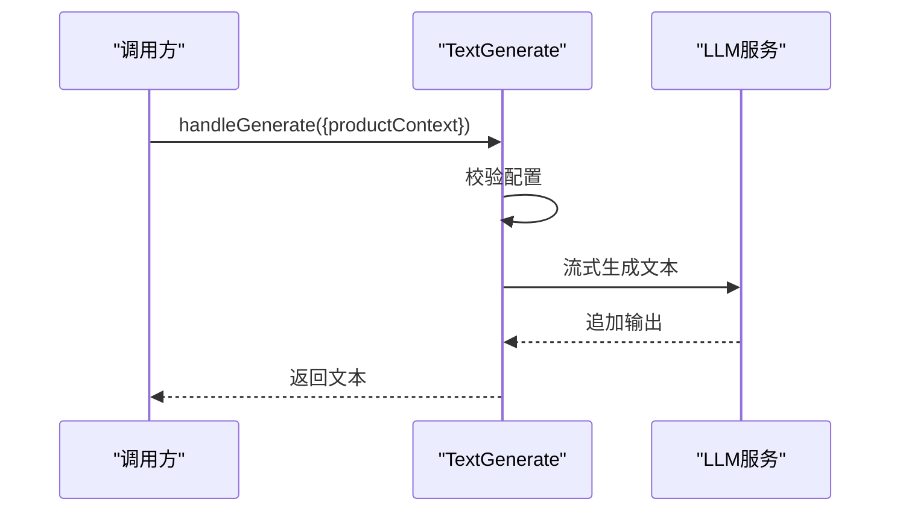
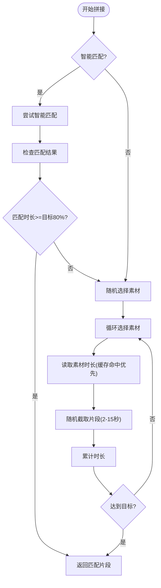
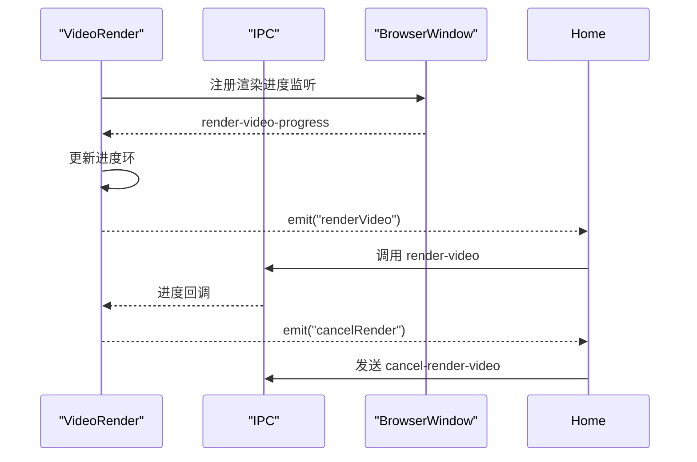
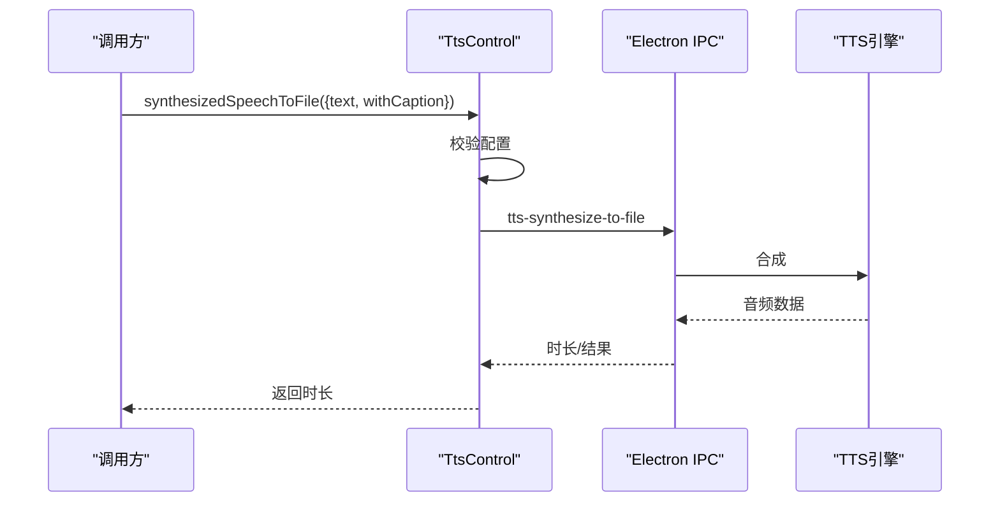
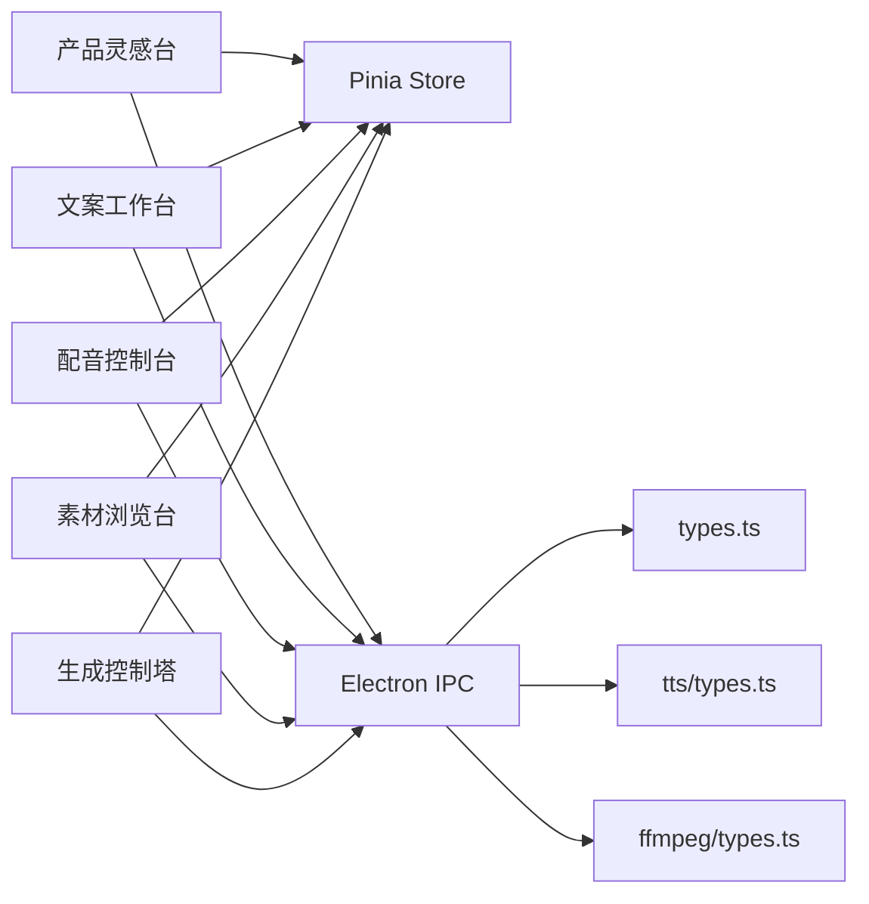

# UI组件系统

<cite>
**本文引用的文件**
- [src/views/Home/index.vue](file://src/views/Home/index.vue)
- [src/views/Home/components/ProductReference.vue](file://src/views/Home/components/ProductReference.vue)
- [src/views/Home/components/TextGenerate.vue](file://src/views/Home/components/TextGenerate.vue)
- [src/views/Home/components/TtsControl.vue](file://src/views/Home/components/TtsControl.vue)
- [src/views/Home/components/VideoManage.vue](file://src/views/Home/components/VideoManage.vue)
- [src/views/Home/components/VideoRender.vue](file://src/views/Home/components/VideoRender.vue)
- [src/store/app.ts](file://src/store/app.ts)
- [src/components/VideoAutoPreview.vue](file://src/components/VideoAutoPreview.vue)
- [src/components/ActionToastEmbed.vue](file://src/components/ActionToastEmbed.vue)
- [electron/ipc.ts](file://electron/ipc.ts)
- [electron/types.ts](file://electron/types.ts)
- [electron/tts/types.ts](file://electron/tts/types.ts)
- [electron/ffmpeg/types.ts](file://electron/ffmpeg/types.ts)
- [locales/zh-CN/common.json](file://locales/zh-CN/common.json)
- [uno.config.ts](file://uno.config.ts)
- [src/assets/base.scss](file://src/assets/base.scss)
- [package.json](file://package.json)
- [README.md](file://README.md)
</cite>

## 更新摘要
**变更内容**
- 全面重构Home Creative Workbench设计规范，采用新的创意工作台设计语言
- 更新三个核心组件的界面设计和交互模式
- 引入新的视觉层次和组件级变更
- 实现更高级别的创意控制台风格界面

## 目录
1. [简介](#简介)
2. [项目结构](#项目结构)
3. [核心组件](#核心组件)
4. [架构总览](#架构总览)
5. [详细组件分析](#详细组件分析)
6. [设计规范与视觉系统](#设计规范与视觉系统)
7. [依赖关系分析](#依赖关系分析)
8. [性能考量](#性能考量)
9. [故障排查指南](#故障排查指南)
10. [结论](#结论)
11. [附录](#附录)

## 简介
短视频工厂UI组件系统围绕"产品灵感台—文案工作台—素材浏览台—生成控制塔"四步创意工作流构建，采用Vue 3 + Vuetify + Pinia + Electron的桌面端技术栈。系统通过Pinia集中管理渲染状态与配置，通过Electron IPC桥接渲染进程与主进程，完成文件系统操作、TTS语音合成与FFmpeg视频渲染等底层能力。全新的Home Creative Workbench设计规范将界面升级为更高级别的创意控制台风格，强化了视觉层次和用户体验。

## 项目结构
- 视图层：Home页面作为创意工作台容器，组合四个功能组件，负责编排创意流程与状态流转。
- 组件层：产品灵感台、文案工作台、素材浏览台、生成控制塔四个核心组件；辅助组件包括视频预览与错误提示。
- 状态层：Pinia应用状态集中管理渲染配置、渲染状态、TTS语音列表与LLM配置。
- 平台层：Electron IPC封装文件系统、TTS、统计与渲染进度事件。

**图表来源**
- [src/views/Home/index.vue:1-405](file://src/views/Home/index.vue#L1-L405)
- [src/views/Home/components/ProductReference.vue:1-576](file://src/views/Home/components/ProductReference.vue#L1-L576)
- [src/views/Home/components/TextGenerate.vue:1-500](file://src/views/Home/components/TextGenerate.vue#L1-L500)
- [src/views/Home/components/VideoManage.vue:1-566](file://src/views/Home/components/VideoManage.vue#L1-L566)
- [src/views/Home/components/TtsControl.vue:1-307](file://src/views/Home/components/TtsControl.vue#L1-L307)
- [src/views/Home/components/VideoRender.vue:1-433](file://src/views/Home/components/VideoRender.vue#L1-L433)
- [src/store/app.ts:1-114](file://src/store/app.ts#L1-L114)
- [electron/ipc.ts:1-188](file://electron/ipc.ts#L1-188)
- [electron/tts/types.ts:1-20](file://electron/tts/types.ts#L1-L20)
- [electron/ffmpeg/types.ts:1-23](file://electron/ffmpeg/types.ts#L1-L23)
- [electron/types.ts:1-26](file://electron/types.ts#L1-L26)

**章节来源**
- [src/views/Home/index.vue:1-405](file://src/views/Home/index.vue#L1-L405)
- [uno.config.ts:1-45](file://uno.config.ts#L1-L45)
- [src/assets/base.scss:1-436](file://src/assets/base.scss#L1-L436)

## 核心组件
- **产品灵感台**：提供产品选择、分析和素材管理，采用rich source-material面板设计，强化产品上下文的重要性。
- **文案工作台**：提供提示词输入、配置LLM参数、流式生成文案、停止生成、清空输出与读取当前输出的能力，采用editor-style表面设计。
- **素材浏览台**：提供素材库选择与刷新、智能匹配分析、预览、读取视频时长缓存、按目标时长随机拼接视频片段并返回片段清单。
- **生成控制塔**：提供渲染状态展示、进度环、启动/取消渲染、渲染配置对话框、自动批量开关、打开外链，采用execution panel设计。

**章节来源**
- [src/views/Home/components/ProductReference.vue:1-576](file://src/views/Home/components/ProductReference.vue#L1-L576)
- [src/views/Home/components/TextGenerate.vue:124-500](file://src/views/Home/components/TextGenerate.vue#L124-L500)
- [src/views/Home/components/VideoManage.vue:76-566](file://src/views/Home/components/VideoManage.vue#L76-L566)
- [src/views/Home/components/VideoRender.vue:183-433](file://src/views/Home/components/VideoRender.vue#L183-L433)

## 架构总览
系统采用"创意工作台容器编排 + 功能组件自治 + 状态中心 + 平台桥接"的分层架构。Home创意工作台作为编排器，按顺序调用各组件能力，同时通过Pinia状态机驱动创意流程与UI反馈；组件通过window.electron与window.ipcRenderer与Electron交互。

**图表来源**
- [src/views/Home/index.vue:99-298](file://src/views/Home/index.vue#L99-L298)
- [src/views/Home/components/TextGenerate.vue:226-295](file://src/views/Home/components/TextGenerate.vue#L226-L295)
- [src/views/Home/components/TtsControl.vue:230-248](file://src/views/Home/components/TtsControl.vue#L230-L248)
- [src/views/Home/components/VideoManage.vue:361-465](file://src/views/Home/components/VideoManage.vue#L361-L465)
- [electron/ipc.ts:171-186](file://electron/ipc.ts#L171-L186)

## 详细组件分析

### 产品灵感台（ProductReference）
- **设计理念**：从简单的表单卡片升级为rich source-material面板，强调产品作为创作素材的重要性，提供更高级别的视觉权重。
- **关键能力**
  - 产品选择与管理：提供产品列表选择、添加新产品、删除产品功能。
  - 产品分析：集成视觉分析功能，提取颜色、标签等特征。
  - 空状态处理：提供明确的空状态框架和引导信息。
- **Props**
  - 无
- **事件与插槽**
  - 未使用事件与具名插槽
- **样式定制**
  - 使用新的workbench-editor-surface类，提供更丰富的视觉层次

**图表来源**
- [src/views/Home/components/ProductReference.vue:259-405](file://src/views/Home/components/ProductReference.vue#L259-L405)

**章节来源**
- [src/views/Home/components/ProductReference.vue:1-576](file://src/views/Home/components/ProductReference.vue#L1-L576)

### 文案工作台（TextGenerate）
- **设计理念**：将提示词和输出整合为连续的editorial surface，提供工具栏区，强化文案创作的编辑体验。
- **关键能力**
  - 提示词编辑：提供专门的提示词编辑区域，支持产品上下文注入。
  - 流式生成：使用流式接口逐步追加输出，支持AbortController中断。
  - 配置管理：对话框内维护临时配置，支持保存至Pinia状态。
  - 计数器：实时显示输出字数。
- **Props**
  - disabled?: boolean（禁用态）
- **暴露方法（expose）**
  - handleGenerate(options?)：开始生成
  - handleStopGenerate()：中断生成
  - getCurrentOutputText()：读取当前输出
  - clearOutputText()：清空输出
- **事件与插槽**
  - 未使用事件与具名插槽
- **样式定制**
  - 使用workbench-editor-surface类，提供编辑器风格的视觉效果

**图表来源**
- [src/views/Home/components/TextGenerate.vue:226-295](file://src/views/Home/components/TextGenerate.vue#L226-L295)

**章节来源**
- [src/views/Home/components/TextGenerate.vue:124-500](file://src/views/Home/components/TextGenerate.vue#L124-L500)

### 素材浏览台（VideoManage）
- **设计理念**：从媒体库的角度重构界面，强化资产网格的视觉主导地位，提供更清晰的操作分层。
- **关键能力**
  - 素材库管理：选择文件夹后读取MP4列表，支持刷新与空状态提示。
  - 智能匹配：集成VL分析功能，支持智能匹配和随机模式切换。
  - 预览：使用VideoAutoPreview组件自动循环播放。
  - 时长读取：基于HTMLVideoElement元数据读取并缓存。
  - 片段拼接：按目标时长随机拼接，确保最后一段不小于最小片段时长。
- **Props**
  - disabled?: boolean（禁用态）
- **暴露方法（expose）**
  - getVideoSegments({ duration })：返回片段清单
- **事件与插槽**
  - 未使用事件与具名插槽
- **样式定制**
  - 使用workbench-editor-surface类，提供媒体库风格的视觉效果

**图表来源**
- [src/views/Home/components/VideoManage.vue:361-465](file://src/views/Home/components/VideoManage.vue#L361-L465)

**章节来源**
- [src/views/Home/components/VideoManage.vue:76-566](file://src/views/Home/components/VideoManage.vue#L76-L566)
- [src/components/VideoAutoPreview.vue:1-42](file://src/components/VideoAutoPreview.vue#L1-L42)

### 生成控制塔（VideoRender）
- **设计理念**：从空盒子升级为真正的execution panel，提供清晰的状态指示、进度展示和操作反馈。
- **关键能力**
  - 渲染状态：根据Pinia状态显示不同状态芯片，提供清晰的流程反馈。
  - 进度监听：订阅IPC渲染进度事件，更新进度环。
  - 配置对话框：输出分辨率、文件名、导出目录、背景音乐目录等。
  - 自动批量：开启后渲染完成后自动触发下一次。
  - 底部信息：提供品牌信息和链接。
- **Props**
  - 无
- **事件**
  - renderVideo：启动渲染
  - cancelRender：取消渲染
- **插槽**
  - 未使用具名插槽
- **样式定制**
  - 使用workbench-editor-surface类，提供执行面板风格的视觉效果

**图表来源**
- [src/views/Home/components/VideoRender.vue:291-293](file://src/views/Home/components/VideoRender.vue#L291-L293)
- [electron/ipc.ts:171-186](file://electron/ipc.ts#L171-L186)

**章节来源**
- [src/views/Home/components/VideoRender.vue:183-433](file://src/views/Home/components/VideoRender.vue#L183-L433)

### 配音控制台（TtsControl）
- **设计理念**：从分散的控件重构为紧凑的audio console，提供更集中的语音控制体验。
- **关键能力**
  - 语音配置：提供音色、语种选择，支持配置对话框。
  - 试听功能：将文本转为Base64音频并播放。
  - 合成到文件：将文本合成到文件并返回音频时长，供视频拼接使用。
- **Props**
  - disabled?: boolean（禁用态）
- **暴露方法（expose）**
  - synthesizedSpeechToFile({ text, withCaption? })：合成到文件并返回时长
- **事件与插槽**
  - 未使用事件与具名插槽
- **样式定制**
  - 使用workbench-editor-surface类，提供音频控制台风格的视觉效果

**图表来源**
- [src/views/Home/components/TtsControl.vue:230-248](file://src/views/Home/components/TtsControl.vue#L230-L248)
- [electron/ipc.ts:168-169](file://electron/ipc.ts#L168-L169)
- [electron/tts/types.ts:9-19](file://electron/tts/types.ts#L9-L19)

**章节来源**
- [src/views/Home/components/TtsControl.vue:136-307](file://src/views/Home/components/TtsControl.vue#L136-L307)

### 辅助组件
- **视频自动预览（VideoAutoPreview）**
  - 作用：自动播放MP4素材，悬停播放、离开暂停并回到开头。
  - 关键点：将本地路径标准化为file://协议，避免跨平台差异。
- **错误提示嵌入（ActionToastEmbed）**
  - 作用：在全局提示中嵌入可点击的"复制错误详情"按钮，缩短问题定位时间。

**章节来源**
- [src/components/VideoAutoPreview.vue:16-36](file://src/components/VideoAutoPreview.vue#L16-L36)
- [src/components/ActionToastEmbed.vue:16-30](file://src/components/ActionToastEmbed.vue#L16-L30)

## 设计规范与视觉系统

### 创意工作台设计语言
系统引入了全新的workbench视觉系统，采用温暖的米色系背景和柔和的阴影效果，营造高端创意工具的氛围。

#### 设计方向
- **温暖背景**：使用#f3eee5作为基础背景色，配合径向渐变增强深度感
- **中性色彩**：采用255/251/247的米色系作为面板基色，提供舒适的视觉环境
- **强调色**：使用#5c56ea作为主色调，提供专业而现代的科技感
- **柔和阴影**：使用0-32px的阴影范围，创造层次分明的空间感

#### 组件级变更
- **页面外壳**：采用home-workbench容器，提供整体的创意工作台框架
- **列布局**：使用CSS Grid实现三列布局，左列430px+，中列360px+，右列320px+
- **面板系统**：引入workbench-panel和workbench-panel--strong两类面板
- **编辑器表面**：使用workbench-editor-surface类，提供编辑器风格的视觉效果

#### 视觉层次
- **产品灵感台**：使用workbench-panel--strong，提供最突出的视觉权重
- **文案工作台**：使用workbench-panel，提供标准的面板效果
- **素材浏览台**：使用workbench-panel，强调内容的丰富性
- **生成控制塔**：使用workbench-panel，提供简洁的执行界面

**章节来源**
- [src/assets/base.scss:1-436](file://src/assets/base.scss#L1-L436)
- [src/views/Home/index.vue:327-404](file://src/views/Home/index.vue#L327-L404)

## 依赖关系分析
- **组件间耦合**
  - Home创意工作台对四个子组件存在强耦合（编排与数据传递），但通过暴露方法与事件解耦具体实现细节。
  - 子组件之间低耦合，主要通过Pinia共享状态与Electron IPC进行间接通信。
- **外部依赖**
  - Electron IPC：封装文件系统、TTS、统计与渲染进度事件。
  - Pinia：集中管理渲染状态、配置与LLM/TTS参数。
  - Vuetify：提供UI控件与布局能力。
- **循环依赖**
  - 未发现循环依赖，组件树结构清晰。

**图表来源**
- [src/store/app.ts:15-113](file://src/store/app.ts#L15-L113)
- [electron/ipc.ts:1-188](file://electron/ipc.ts#L1-188)
- [electron/types.ts:1-26](file://electron/types.ts#L1-L26)
- [electron/tts/types.ts:1-20](file://electron/tts/types.ts#L1-L20)
- [electron/ffmpeg/types.ts:1-23](file://electron/ffmpeg/types.ts#L1-L23)

**章节来源**
- [src/store/app.ts:15-113](file://src/store/app.ts#L15-L113)
- [electron/ipc.ts:1-188](file://electron/ipc.ts#L1-188)

## 性能考量
- **渲染流程优化**
  - 文案生成采用流式接口，避免阻塞UI；支持中断，降低等待成本。
  - 语音合成返回时长，避免二次计算；视频拼接采用随机策略与缓存，减少重复读取。
  - 渲染进度通过IPC增量推送，避免轮询带来的CPU占用。
- **资源管理**
  - 预览视频在移出时暂停并重置，避免后台资源占用。
  - 试听音频播放结束后释放，防止内存泄漏。
- **状态与缓存**
  - 视频时长缓存基于Map，命中后直接返回Promise，显著降低I/O压力。
  - Pinia持久化策略排除高频变化字段，减少存储负担。
- **UI性能**
  - 使用虚拟滚动与网格布局，控制预览卡片数量，避免DOM膨胀。
  - 使用紧凑密度与合理的尺寸，减少重绘与回流。
  - 新的workbench-editor-surface类提供更好的视觉性能。

[本节为通用性能建议，不直接分析特定文件，故无"章节来源"]

## 故障排查指南
- **产品灵感台问题**
  - 现象：产品选择失败或分析功能不可用。
  - 排查：检查VL配置是否正确；确认产品数据库连接；查看错误提示中的复制按钮。
- **文案工作台问题**
  - 现象：生成异常或中断。
  - 排查：检查提示词是否为空；查看错误提示中的复制按钮是否可用；确认LLM配置与网络连通性。
- **素材浏览台问题**
  - 现象：刷新后无MP4或空文件夹。
  - 排查：确认所选文件夹存在且包含MP4；检查权限；查看错误提示。
- **生成控制塔问题**
  - 现象：渲染进度卡住或最终失败。
  - 排查：检查输出路径、分辨率、文件名与背景音乐目录；查看失败提示并复制错误详情；必要时降低目标时长或增加素材时长。
- **配音控制台问题**
  - 现象：试听或合成失败。
  - 排查：确认已选择声音与试听文本；检查网络；查看错误详情并复制；必要时更换语音或调整语速。

**章节来源**
- [src/views/Home/components/ProductReference.vue:358-405](file://src/views/Home/components/ProductReference.vue#L358-L405)
- [src/views/Home/components/TextGenerate.vue:259-295](file://src/views/Home/components/TextGenerate.vue#L259-L295)
- [src/views/Home/components/VideoManage.vue:202-246](file://src/views/Home/components/VideoManage.vue#L202-L246)
- [src/views/Home/components/VideoRender.vue:291-293](file://src/views/Home/components/VideoRender.vue#L291-L293)
- [src/views/Home/components/TtsControl.vue:162-205](file://src/views/Home/components/TtsControl.vue#L162-L205)

## 结论
该UI组件系统通过Home Creative Workbench设计规范的全面重构，成功将界面升级为更高级别的创意控制台风格。新的设计语言提供了更强的视觉层次、更清晰的组件边界和更优质的用户体验。通过workbench-editor-surface类和新的面板系统，系统在易用性、可维护性与视觉品质方面取得显著提升。建议在后续迭代中进一步增强字幕样式与特效、扩展更多TTS服务与参数调整，以满足更复杂的创作需求。

[本节为总结性内容，不直接分析特定文件，故无"章节来源"]

## 附录

### 组件通信与数据传递
- **创意工作台容器**通过组件ref与expose方法调用子组件能力，实现"产品上下文—生成文案—合成语音—拼接片段—渲染视频"的创意流水线。
- **状态中心**（Pinia）贯穿始终，渲染状态与配置在各组件间共享。
- **IPC通道**承载文件系统、TTS与渲染进度事件，确保前端与主进程解耦。

**章节来源**
- [src/views/Home/index.vue:96-324](file://src/views/Home/index.vue#L96-L324)
- [src/store/app.ts:5-13](file://src/store/app.ts#L5-L13)

### 组件属性、事件与插槽清单
- **产品灵感台**
  - Props：无
  - 事件：无
  - 插槽：无
- **文案工作台**
  - Props：disabled?
  - Expose：handleGenerate, handleStopGenerate, getCurrentOutputText, clearOutputText
- **素材浏览台**
  - Props：disabled?
  - Expose：getVideoSegments
- **生成控制塔**
  - Events：renderVideo, cancelRender
  - Props：无
- **配音控制台**
  - Props：disabled?
  - Expose：synthesizedSpeechToFile

**章节来源**
- [src/views/Home/components/ProductReference.vue:1-576](file://src/views/Home/components/ProductReference.vue#L1-L576)
- [src/views/Home/components/TextGenerate.vue:373-374](file://src/views/Home/components/TextGenerate.vue#L373-L374)
- [src/views/Home/components/VideoManage.vue:467](file://src/views/Home/components/VideoManage.vue#L467)
- [src/views/Home/components/VideoRender.vue:277-280](file://src/views/Home/components/VideoRender.vue#L277-L280)
- [src/views/Home/components/TtsControl.vue:250](file://src/views/Home/components/TtsControl.vue#L250)

### 响应式设计与无障碍支持
- **响应式设计**
  - 使用UnoCSS与Vuetify的响应式布局类，组件在不同屏幕尺寸下保持合理间距与尺寸。
  - 新的workbench-editor-surface类提供更好的移动端适配。
  - CSS Grid布局确保三列结构在不同宽度下保持一致性。
- **无障碍支持**
  - 当前组件未显式声明ARIA属性或键盘导航逻辑，建议在后续迭代中补充必要的无障碍标记与键盘快捷键。
  - 新的设计语言提供了更好的对比度，有助于视觉障碍用户的使用。

**章节来源**
- [uno.config.ts:11-44](file://uno.config.ts#L11-L44)
- [src/assets/base.scss:1-436](file://src/assets/base.scss#L1-L436)

### 与状态管理的集成与生命周期
- **状态管理**
  - RenderStatus枚举与渲染配置集中于Pinia，组件通过getter/setter与computed响应状态变化。
  - 新的workbench-editor-surface类与状态管理结合，提供更丰富的视觉反馈。
- **生命周期**
  - 产品灵感台在onMounted阶段加载产品列表，在产品选择时更新当前产品状态。
  - 文案工作台在finally阶段清理AbortController与状态。
  - 素材浏览台在刷新时清空缓存并在读取失败时降级提示。
  - 生成控制塔在组件卸载时清理IPC监听器。

**章节来源**
- [src/store/app.ts:5-13](file://src/store/app.ts#L5-L13)
- [src/views/Home/components/ProductReference.vue:259-280](file://src/views/Home/components/ProductReference.vue#L259-L280)
- [src/views/Home/components/TextGenerate.vue:296-300](file://src/views/Home/components/TextGenerate.vue#L296-L300)
- [src/views/Home/components/VideoManage.vue:247-249](file://src/views/Home/components/VideoManage.vue#L247-L249)
- [src/views/Home/components/VideoRender.vue:291-293](file://src/views/Home/components/VideoRender.vue#L291-L293)

### 二次开发与自定义指南
- **新增组件建议**
  - 以功能单一为原则，尽量通过expose方法暴露能力，避免过度耦合。
  - 使用Pinia集中状态，避免在组件内直接持久化配置。
  - 遵循workbench-editor-surface类的使用规范，保持视觉一致性。
- **配置扩展**
  - 在Pinia中新增配置项，并在对应组件的配置对话框中添加输入控件。
  - 使用新的workbench-section-header类组织组件头部信息。
- **IPC扩展**
  - 在electron/ipc.ts中注册新的handle与renderer侧调用，确保错误处理与进度回调一致。
  - 遵循新的workbench-editor-surface类的样式规范。
- **国际化**
  - 在locales中新增键值，确保所有文案与错误提示均支持多语言。
  - 使用workspaceText函数提供工作台级别的本地化支持。

**章节来源**
- [src/store/app.ts:64-78](file://src/store/app.ts#L64-L78)
- [electron/ipc.ts:77-187](file://electron/ipc.ts#L77-L187)
- [locales/zh-CN/common.json:77-177](file://locales/zh-CN/common.json#L77-L177)