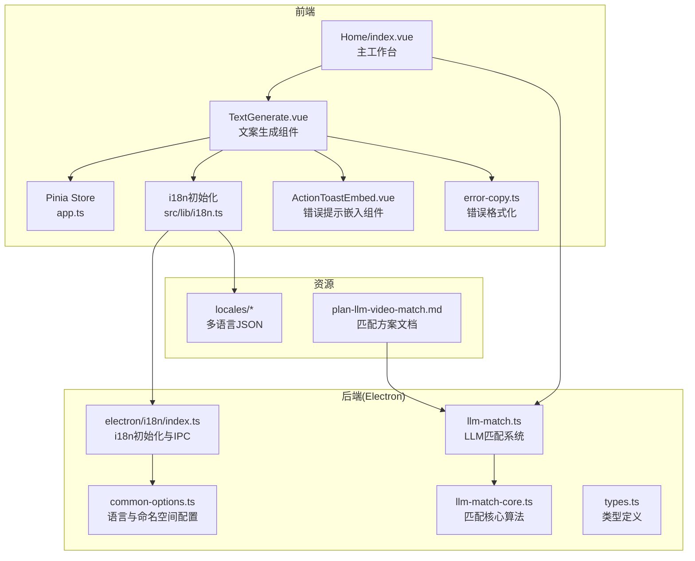
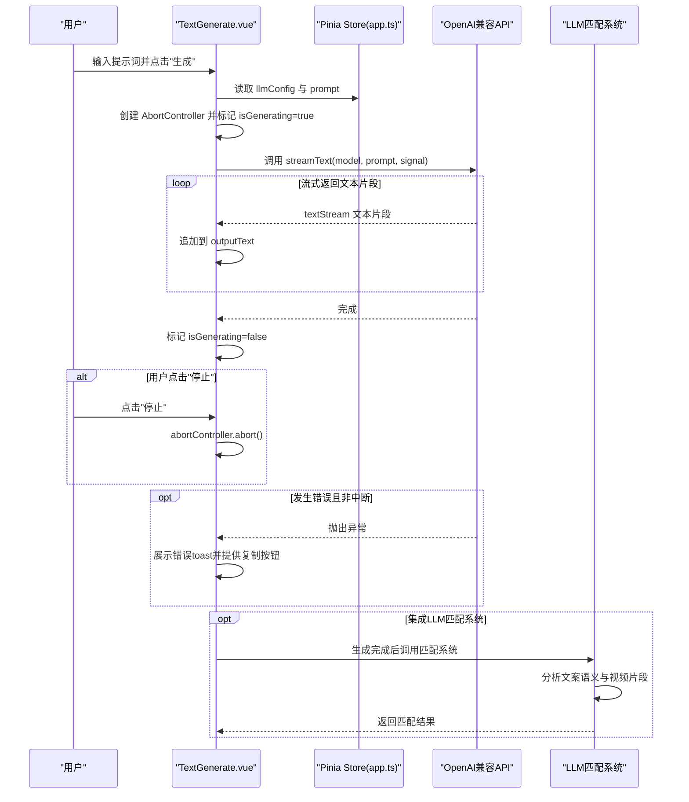
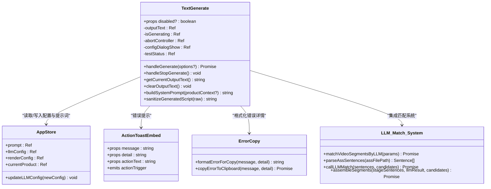
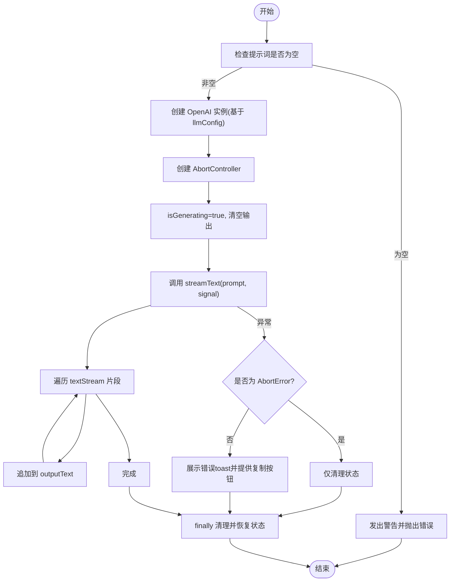
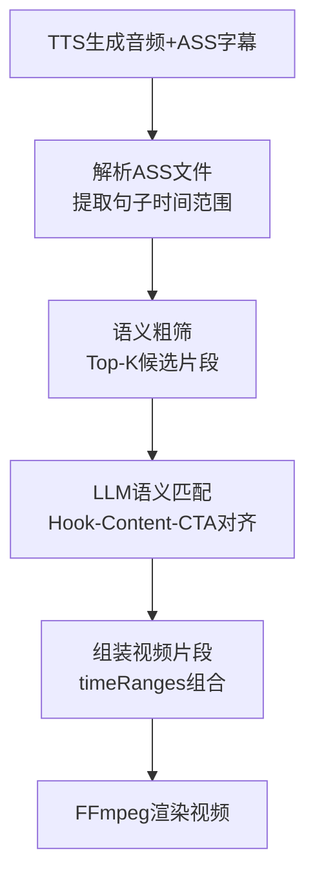
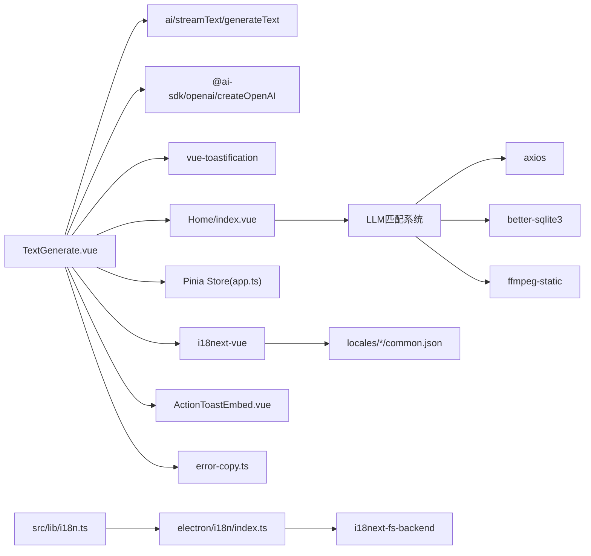

# 文案生成组件

<cite>
**本文档引用的文件**
- [TextGenerate.vue](file://src/views/Home/components/TextGenerate.vue)
- [app.ts](file://src/store/app.ts)
- [index.vue](file://src/views/Home/index.vue)
- [llm-match.ts](file://electron/vl/llm-match.ts)
- [llm-match-core.ts](file://electron/vl/llm-match-core.ts)
- [types.ts](file://electron/vl/types.ts)
- [plan-llm-video-match.md](file://docs/plan-llm-video-match.md)
- [i18n.ts](file://src/lib/i18n.ts)
- [index.ts](file://electron/i18n/index.ts)
- [common-options.ts](file://electron/i18n/common-options.ts)
- [common.json(en)](file://locales/en/common.json)
- [common.json(zh-CN)](file://locales/zh-CN/common.json)
- [ActionToastEmbed.vue](file://src/components/ActionToastEmbed.vue)
- [error-copy.ts](file://src/lib/error-copy.ts)
- [package.json](file://package.json)
- [vite.config.ts](file://vite.config.ts)
</cite>

## 更新摘要
**所做更改**
- 新增LLM匹配系统集成章节，详细说明文案生成与视频片段智能匹配的协同工作
- 更新提示工程改进部分，包括新的系统提示词结构和内容结构支持
- 增强内容结构支持说明，涵盖Hook、Content、CTA三段式结构
- 更新与LLM匹配系统的集成方式，包括产品上下文注入和匹配模式切换
- 新增LLM匹配系统的技术实现和风险控制机制

## 目录
1. [简介](#简介)
2. [项目结构](#项目结构)
3. [核心组件](#核心组件)
4. [架构总览](#架构总览)
5. [详细组件分析](#详细组件分析)
6. [LLM匹配系统集成](#llm-匹配系统集成)
7. [提示工程改进](#提示工程改进)
8. [内容结构支持](#内容结构支持)
9. [依赖关系分析](#依赖关系分析)
10. [性能考量](#性能考量)
11. [故障排查指南](#故障排查指南)
12. [结论](#结论)
13. [附录](#附录)

## 简介
本组件提供基于LLM的智能文案生成功能，支持通过OpenAI兼容API实时流式生成文本，并提供配置对话框用于设置模型名称、API地址与密钥。组件与Pinia状态管理集成，统一维护LLM配置；同时集成国际化与可访问性设计，提供测试连接、停止生成、复制错误详情等能力。

**重要更新**：组件现已深度集成LLM匹配系统，支持将生成的文案与视频片段进行智能语义对齐，包括产品特写和爆款场景两种匹配模式，以及完整的Hook-Content-CTA三段式内容结构支持。

## 项目结构
- 组件位于页面视图的Home页面中，负责文案生成与配置管理
- 状态管理采用Pinia，集中存放LLM配置与全局状态
- 国际化由i18next驱动，前后端分别初始化，前端通过http-backend加载本地资源
- 错误信息通过toast提示，支持复制错误详情到剪贴板
- **新增**：LLM匹配系统集成，支持将文案与视频片段进行智能语义对齐

**图表来源**
- [TextGenerate.vue:1-428](file://src/views/Home/components/TextGenerate.vue#L1-L428)
- [app.ts:1-151](file://src/store/app.ts#L1-L151)
- [index.vue:1-433](file://src/views/Home/index.vue#L1-L433)
- [llm-match.ts:1-304](file://electron/vl/llm-match.ts#L1-L304)
- [llm-match-core.ts:1-515](file://electron/vl/llm-match-core.ts#L1-L515)
- [types.ts:1-93](file://electron/vl/types.ts#L1-L93)

## 核心组件
- **组件职责**
  - 接收用户输入的提示词，调用OpenAI兼容API进行流式生成
  - 提供配置对话框，允许用户设置模型名称、API地址与密钥，并支持"测试连接"
  - 支持停止生成、清空输出、暴露方法给父组件调用
  - 集成国际化与错误提示，支持复制错误详情到剪贴板
  - **新增**：支持产品上下文注入，增强文案与产品信息的关联性
  - **新增**：支持匹配模式切换（产品特写/爆款场景）

- **关键属性**
  - disabled?: boolean —— 控制组件整体禁用态，影响按钮与表单交互

- **内部状态**
  - 输出文本 outputText: ref('')
  - 生成状态 isGenerating: ref(false)
  - 中断控制器 abortController: ref<AbortController | null>(null)
  - 配置对话框开关 configDialogShow: ref(false)
  - 测试状态 testStatus: ref<TestStatusEnum>()

- **暴露方法**
  - handleGenerate(options?): Promise<string> —— 执行流式生成
  - handleStopGenerate(): void —— 停止生成
  - getCurrentOutputText(): string —— 获取当前输出文案
  - clearOutputText(): void —— 清空输出文案

**章节来源**
- [TextGenerate.vue:173-175](file://src/views/Home/components/TextGenerate.vue#L173-L175)
- [TextGenerate.vue:268-271](file://src/views/Home/components/TextGenerate.vue#L268-L271)
- [TextGenerate.vue:329-339](file://src/views/Home/components/TextGenerate.vue#L329-L339)
- [TextGenerate.vue:364-369](file://src/views/Home/components/TextGenerate.vue#L364-L369)

## 架构总览
组件通过ai库的streamText实现OpenAI兼容API的实时流式生成，使用AbortController支持中断；配置通过Pinia store更新，UI通过vuetify组件呈现；国际化由i18next-vue驱动，前后端IPC协同切换语言；错误通过toast与ActionToastEmbed嵌入组件展示，并支持复制错误详情。

**重要更新**：架构现已扩展支持LLM匹配系统，文案生成后可与视频片段进行智能语义对齐，包括产品特写和爆款场景两种匹配模式。

**图表来源**
- [TextGenerate.vue:272-322](file://src/views/Home/components/TextGenerate.vue#L272-L322)
- [app.ts:26-34](file://src/store/app.ts#L26-L34)
- [index.vue:158-162](file://src/views/Home/index.vue#L158-L162)

## 详细组件分析

### 组件类图

**图表来源**
- [TextGenerate.vue:149-370](file://src/views/Home/components/TextGenerate.vue#L149-L370)
- [ActionToastEmbed.vue:16-30](file://src/components/ActionToastEmbed.vue#L16-L30)
- [error-copy.ts:1-17](file://src/lib/error-copy.ts#L1-L17)
- [app.ts:15-151](file://src/store/app.ts#L15-L151)
- [llm-match.ts:161-303](file://electron/vl/llm-match.ts#L161-L303)

### 生成流程（流式）
- **输入校验**：若提示词为空，发出警告并抛出错误
- **创建OpenAI实例**：使用store中的llmConfig.apiUrl与apiKey
- **创建AbortController**：并开启生成状态，清空输出文本
- **调用streamText**：遍历textStream将片段追加到输出文本
- **异常处理**：除AbortError外的错误均通过toast展示，支持复制错误详情
- **finally**：清理abortController，恢复isGenerating=false

**图表来源**
- [TextGenerate.vue:272-322](file://src/views/Home/components/TextGenerate.vue#L272-L322)

### 配置与测试流程
- **配置对话框**：显示模型名称、API地址、API Key字段，支持清空与关闭
- **保存配置**：将当前编辑的配置写回store
- **测试连接**：使用generateText对指定模型发送简单请求，成功/失败分别展示成功/错误toast

**图表来源**
- [TextGenerate.vue:329-362](file://src/views/Home/components/TextGenerate.vue#L329-L362)
- [app.ts:32-34](file://src/store/app.ts#L32-L34)

### 事件与交互
- **生成/停止**
  - 生成：handleGenerate(options?)
  - 停止：handleStopGenerate()
- **配置**
  - 打开/关闭：configDialogShow
  - 保存：handleSaveConfig()
  - 测试：handleTestConfig()
- **输出控制**
  - 获取：getCurrentOutputText()
  - 清空：clearOutputText()

**章节来源**
- [TextGenerate.vue:272-322](file://src/views/Home/components/TextGenerate.vue#L272-L322)
- [TextGenerate.vue:329-362](file://src/views/Home/components/TextGenerate.vue#L329-L362)
- [TextGenerate.vue:364-369](file://src/views/Home/components/TextGenerate.vue#L364-L369)

## LLM匹配系统集成

### 系统架构
组件现已深度集成LLM匹配系统，支持将生成的文案与视频片段进行智能语义对齐。系统通过解析ASS字幕文件，提取每个句子的时间范围和内容，然后使用DeepSeek LLM进行语义匹配。

**图表来源**
- [plan-llm-video-match.md:14-24](file://docs/plan-llm-video-match.md#L14-L24)
- [llm-match.ts:265-303](file://electron/vl/llm-match.ts#L265-L303)

### 匹配模式支持
组件支持两种匹配模式：

1. **产品特写模式 (product)**
   - 重点描述"显性卖点"：材质、手感、细节
   - 强调产品的物理特性，如质感、重量、尺寸等
   - 适合展示产品核心功能和质量优势

2. **爆款场景模式 (scene)**
   - 重点描述"使用反差"：没用之前多痛苦，用了之后多爽
   - 强化场景带入感，展示产品实际使用效果
   - 通过对比突出产品价值，增强购买欲望

### 产品上下文注入
组件支持将产品信息注入到系统提示词中，确保生成的文案与具体产品高度相关：

- **产品名称**：直接在提示词中注入产品名称
- **核心功能**：包含产品的核心功能特点
- **产品亮点**：突出产品的独特卖点和优势
- **目标受众**：针对特定用户群体定制文案风格

**章节来源**
- [TextGenerate.vue:14-26](file://src/views/Home/components/TextGenerate.vue#L14-L26)
- [TextGenerate.vue:215-263](file://src/views/Home/components/TextGenerate.vue#L215-L263)
- [index.vue:74-93](file://src/views/Home/index.vue#L74-L93)

## 提示工程改进

### 系统提示词结构
组件采用了全新的系统提示词结构，包含五个关键部分：

1. **核心人设与字数对标**
   - 明确角色定位：短视频爆款带货编剧
   - 严格字数控制：100-150字之间
   - 语感要求：拒绝AI腔，使用口语化表达

2. **严格的黄金三段式结构**
   - Hook (黄金3秒)：第1句，必须一句话封喉
   - Content (产品价值)：中间大部分，占比70%
   - CTA (转化引导)：最后1-2句，直接给行动指令

3. **语感准则**
   - 拒绝AI腔：禁止使用"想象一下"等废话
   - 严禁捏造：绝不能虚构产品参数
   - 风格要求：经验丰富的带货主播语感

4. **动态数据注入**
   - 自动注入当前产品信息
   - 支持多语言输出控制
   - 包含规避极限词的要求

5. **输出格式规范**
   - 完全纯文本格式
   - 严禁使用Markdown符号
   - 连贯自然的一整段话

### 内容结构支持
系统提示词明确支持Hook-Content-CTA三段式结构：

- **Hook阶段**：使用动态冲击、特写、爆发力画面
- **Content阶段**：展示产品参数、细节、质感或性能价值
- **CTA阶段**：展示成果、产品全貌或收尾转化镜头

**章节来源**
- [TextGenerate.vue:215-263](file://src/views/Home/components/TextGenerate.vue#L215-L263)

## 内容结构支持

### Hook-Content-CTA三段式
系统严格按照短视频带货标准，实现完整的三段式内容结构：

1. **Hook (黄金3秒)**
   - 必须使用强视觉冲击的画面
   - 通过惊人事实或产品最硬核瞬间吸引注意力
   - 示例：掰不断、划不破、直接砸等视觉冲击

2. **Content (产品价值)**
   - 占比最大，通常70%以上
   - 重点描述产品卖点和价值
   - 使用动词而非空洞形容词
   - 强调使用效果和体验

3. **CTA (转化引导)**
   - 最后1-2句直接引导行动
   - 简洁明确的购买指令
   - 如"看左下角"、"库存不多"等

### 语感模型
系统采用"反AI模板化"的语感模型：

- **拒绝AI腔**：避免使用"想象一下"、"探索"等套路
- **真实可信**：基于实际产品信息进行扩写
- **口语化表达**：像真人主播一样自然流畅
- **高转化率**：每句话都有含金量，直戳痛点

**章节来源**
- [TextGenerate.vue:227-259](file://src/views/Home/components/TextGenerate.vue#L227-L259)

## 依赖关系分析
- **组件依赖**
  - ai：streamText/generateText
  - @ai-sdk/openai：createOpenAI
  - vue-toastification：toast提示
  - i18next-vue：国际化
  - pinia：状态管理
  - vuetify：UI组件
- **LLM匹配系统依赖**
  - axios：HTTP请求处理
  - child_process：FFmpeg进程管理
  - better-sqlite3：视频帧分析数据存储
  - ffmpeg-static：FFmpeg二进制文件
- **国际化链路**
  - 前端：i18next-vue + i18next-http-backend，加载locales/*下的common.json
  - Electron：i18next-fs-backend，提供IPC接口与语言切换
- **错误处理**
  - ActionToastEmbed嵌入组件承载错误详情与复制动作
  - error-copy工具格式化JSON并写入剪贴板

**图表来源**
- [TextGenerate.vue:149-156](file://src/views/Home/components/TextGenerate.vue#L149-L156)
- [llm-match.ts:1-21](file://electron/vl/llm-match.ts#L1-L21)
- [i18n.ts:15-22](file://src/lib/i18n.ts#L15-L22)
- [index.ts:13-35](file://electron/i18n/index.ts#L13-L35)

**章节来源**
- [package.json:33-63](file://package.json#L33-L63)
- [TextGenerate.vue:149-156](file://src/views/Home/components/TextGenerate.vue#L149-L156)
- [llm-match.ts:1-21](file://electron/vl/llm-match.ts#L1-L21)
- [i18n.ts:15-22](file://src/lib/i18n.ts#L15-L22)
- [index.ts:13-35](file://electron/i18n/index.ts#L13-L35)

## 性能考量
- **流式生成**
  - 使用streamText逐片追加输出，避免一次性等待全部响应，提升交互流畅度
- **中断机制**
  - 使用AbortController在用户点击"停止"时立即中断请求，释放资源
- **状态管理**
  - 将llmConfig存储于Pinia，避免重复创建OpenAI实例，减少初始化成本
- **UI交互**
  - 通过isGenerating切换按钮状态，防止重复触发生成
- **LLM匹配优化**
  - **新增**：支持产品上下文注入，减少LLM理解负担
  - **新增**：支持匹配模式切换，优化不同场景下的匹配效果
  - **新增**：智能降级机制，API失败时自动回退到启发式算法
- **国际化与构建**
  - 前端按需加载多语言资源，避免打包体积过大；Electron侧通过IPC提供语言切换

## 故障排查指南
- **提示词为空**
  - 现象：点击生成弹出警告并抛错
  - 处理：确保在生成前填写提示词
- **生成失败**
  - 现象：toast显示"生成失败"，并提供复制错误详情按钮
  - 处理：检查llmConfig的模型名、API地址与密钥是否正确；使用"测试连接"验证
- **连接失败**
  - 现象：测试连接失败，toast显示"连接失败"
  - 处理：确认网络可达、API地址与密钥有效；必要时更换模型或代理
- **停止无效**
  - 现象：点击"停止"后仍继续生成
  - 处理：确保AbortController已创建并在handleStopGenerate中调用abort()
- **错误详情复制**
  - 功能：点击"复制错误详情"将格式化的JSON写入剪贴板，便于反馈问题
- **LLM匹配失败**
  - **新增**：现象：LLM匹配API调用失败，系统自动回退到启发式算法
  - 处理：检查DeepSeek API配置，确认网络连接正常；查看控制台错误日志

**章节来源**
- [TextGenerate.vue:272-322](file://src/views/Home/components/TextGenerate.vue#L272-L322)
- [TextGenerate.vue:351-362](file://src/views/Home/components/TextGenerate.vue#L351-L362)
- [ActionToastEmbed.vue:16-30](file://src/components/ActionToastEmbed.vue#L16-L30)
- [error-copy.ts:1-17](file://src/lib/error-copy.ts#L1-L17)

## 结论
该组件以简洁的UI与完善的交互实现了LLM驱动的文案生成，具备流式输出、中断控制、配置测试与错误提示等关键能力。通过Pinia统一管理LLM配置，结合i18next的国际化与可访问性设计，满足短视频工厂场景下的高效创作需求。

**重要更新**：组件现已深度集成LLM匹配系统，支持将生成的文案与视频片段进行智能语义对齐，包括产品特写和爆款场景两种匹配模式，以及完整的Hook-Content-CTA三段式内容结构。这一集成显著提升了文案与视频内容的契合度，为用户提供更加专业和高效的短视频制作体验。

建议在生产环境中配合缓存与重试策略，进一步提升稳定性与用户体验。

## 附录

### 组件使用示例（步骤说明）
- **基本用法**
  - 在页面中引入TextGenerate组件，绑定disabled可控件禁用
  - 通过store.prompt传入初始提示词，生成完成后从组件暴露的方法获取输出文案
  - **新增**：通过renderConfig.matchMode选择匹配模式（产品特写/爆款场景）
- **配置测试**
  - 打开配置对话框，填写模型名称、API地址与密钥，点击"测试"验证连通性
  - **新增**：配置语言选项，支持中文、英文、日文、韩文等多种语言输出
- **错误处理**
  - 生成失败时，使用复制错误详情功能快速定位问题
  - **新增**：LLM匹配失败时自动回退到启发式算法，确保系统稳定性
- **性能优化建议**
  - 合理设置提示词长度，避免过长导致响应时间过长
  - 在UI层对生成按钮进行防抖，避免重复触发
  - 对外层容器设置合理的滚动与布局，保证流式输出的可读性
  - **新增**：利用产品上下文注入减少LLM理解负担，提升生成效率

### 国际化与可访问性
- **国际化**
  - 前端通过i18next-vue与i18next-http-backend加载locales/*下的common.json
  - Electron侧通过i18next-fs-backend提供IPC接口，实现语言切换
- **可访问性**
  - 表单字段提供标签与计数器，按钮具备明确的图标与文本描述，便于屏幕阅读器识别
  - 错误提示通过toast呈现，支持复制错误详情，降低用户操作成本
  - **新增**：支持多种语言输出，包括中文、英文、日文、韩文、泰语、越南语、马来语、德语等

**章节来源**
- [i18n.ts:7-23](file://src/lib/i18n.ts#L7-L23)
- [index.ts:13-35](file://electron/i18n/index.ts#L13-L35)
- [common-options.ts:8-15](file://electron/i18n/common-options.ts#L8-L15)
- [common.json:80-105](file://locales/zh-CN/common.json#L80-L105)
- [TextGenerate.vue:177-186](file://src/views/Home/components/TextGenerate.vue#L177-L186)