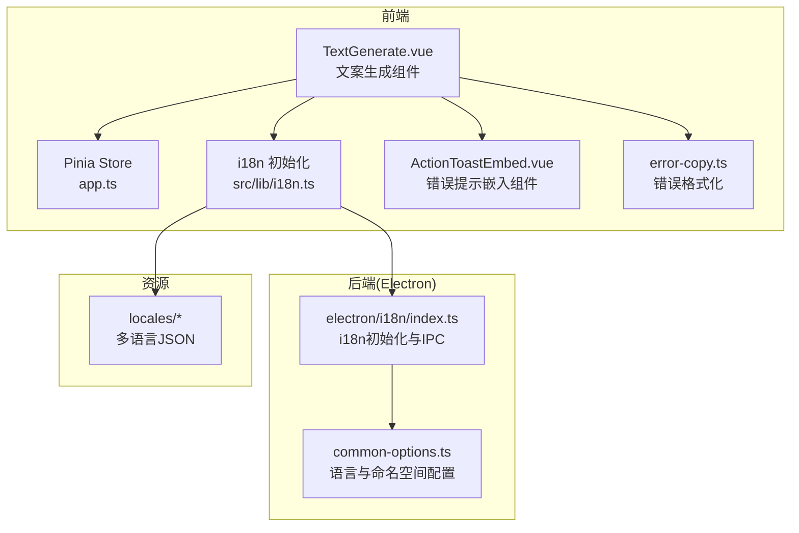
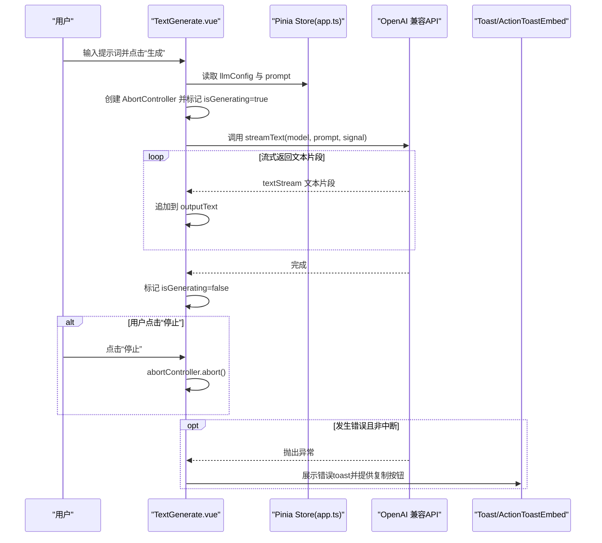
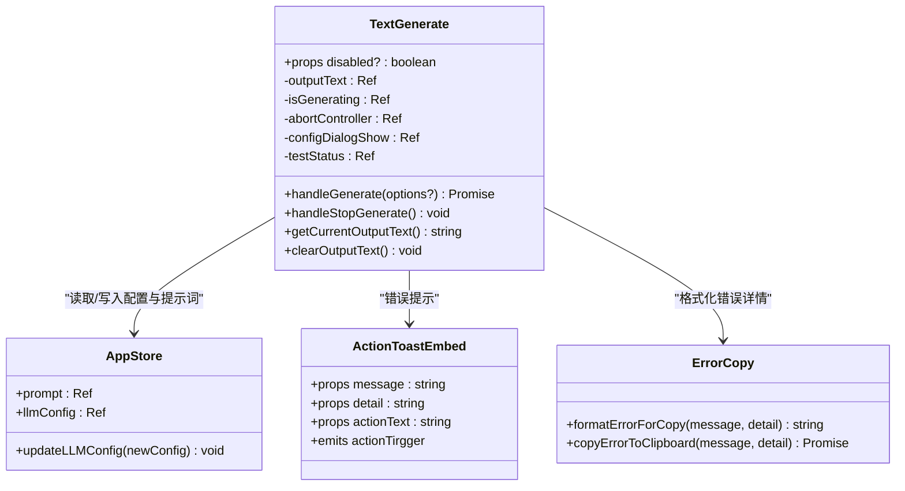
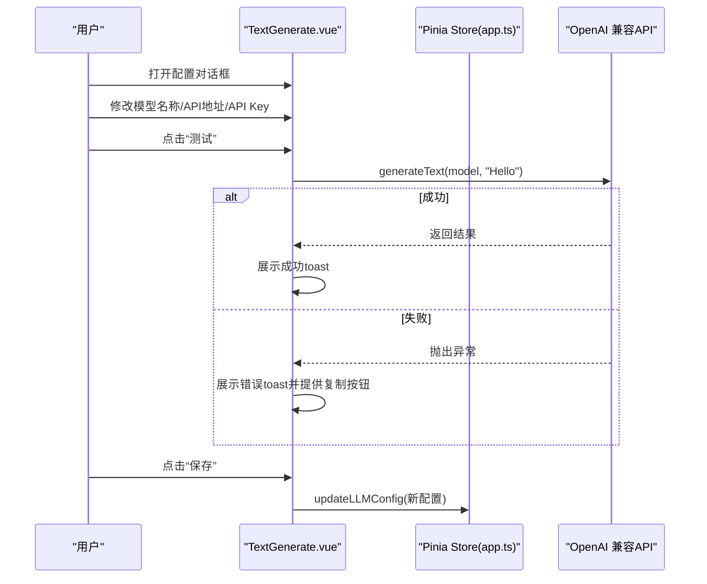
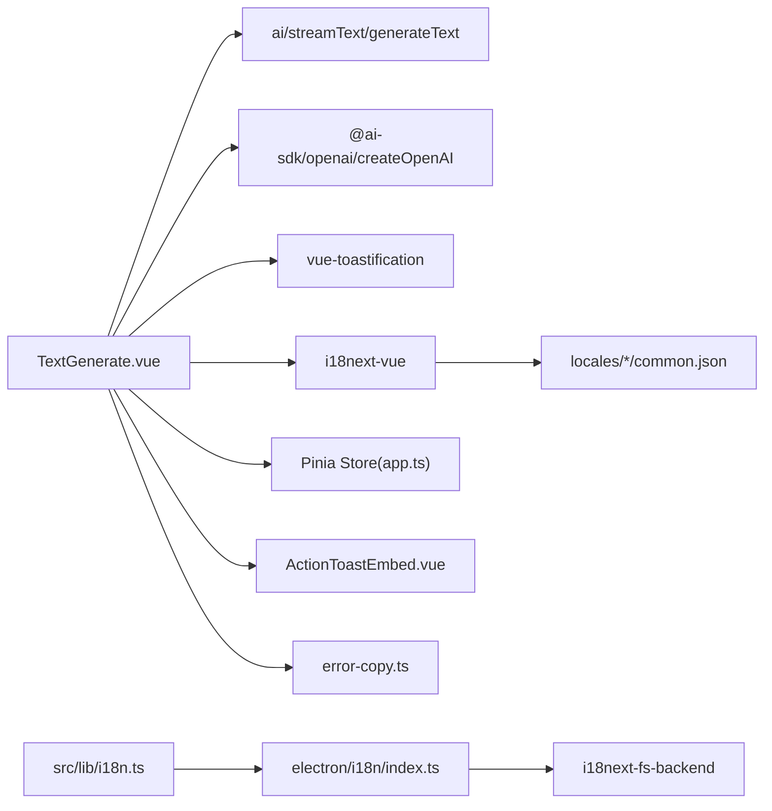

# 文案生成组件

<cite>
**本文引用的文件**
- [TextGenerate.vue](file://src/views/Home/components/TextGenerate.vue)
- [app.ts](file://src/store/app.ts)
- [i18n.ts](file://src/lib/i18n.ts)
- [index.ts](file://electron/i18n/index.ts)
- [common-options.ts](file://electron/i18n/common-options.ts)
- [common.json(en)](file://locales/en/common.json)
- [common.json(zh-CN)](file://locales/zh-CN/common.json)
- [main.ts](file://src/main.ts)
- [ActionToastEmbed.vue](file://src/components/ActionToastEmbed.vue)
- [error-copy.ts](file://src/lib/error-copy.ts)
- [package.json](file://package.json)
- [vite.config.ts](file://vite.config.ts)
</cite>

## 目录
1. [简介](#简介)
2. [项目结构](#项目结构)
3. [核心组件](#核心组件)
4. [架构总览](#架构总览)
5. [详细组件分析](#详细组件分析)
6. [依赖关系分析](#依赖关系分析)
7. [性能考量](#性能考量)
8. [故障排查指南](#故障排查指南)
9. [结论](#结论)
10. [附录](#附录)

## 简介
本组件提供基于 LLM 的智能文案生成功能，支持通过 OpenAI 兼容 API 实时流式生成文本，并提供配置对话框用于设置模型名称、API 地址与密钥。组件与 Pinia 状态管理集成，统一维护 LLM 配置；同时集成国际化与可访问性设计，提供测试连接、停止生成、复制错误详情等能力，便于在短视频工厂场景中作为“脚本生成”环节使用。

## 项目结构
- 组件位于页面视图的 Home 页面中，负责文案生成与配置管理。
- 状态管理采用 Pinia，集中存放 LLM 配置与全局状态。
- 国际化由 i18next 驱动，前后端分别初始化，前端通过 http-backend 加载本地资源。
- 错误信息通过 toast 提示，支持复制错误详情到剪贴板。

图表来源
- [TextGenerate.vue:1-272](file://src/views/Home/components/TextGenerate.vue#L1-L272)
- [app.ts:1-114](file://src/store/app.ts#L1-L114)
- [i18n.ts:1-28](file://src/lib/i18n.ts#L1-L28)
- [index.ts:1-43](file://electron/i18n/index.ts#L1-L43)
- [common-options.ts:1-16](file://electron/i18n/common-options.ts#L1-L16)
- [common.json(en):1-178](file://locales/en/common.json#L1-L178)
- [common.json(zh-CN):1-178](file://locales/zh-CN/common.json#L1-L178)

章节来源
- [TextGenerate.vue:1-272](file://src/views/Home/components/TextGenerate.vue#L1-L272)
- [app.ts:1-114](file://src/store/app.ts#L1-L114)
- [i18n.ts:1-28](file://src/lib/i18n.ts#L1-L28)
- [index.ts:1-43](file://electron/i18n/index.ts#L1-L43)
- [common-options.ts:1-16](file://electron/i18n/common-options.ts#L1-L16)
- [common.json(en):1-178](file://locales/en/common.json#L1-L178)
- [common.json(zh-CN):1-178](file://locales/zh-CN/common.json#L1-L178)

## 核心组件
- 组件职责
  - 接收用户输入的提示词，调用 OpenAI 兼容 API 进行流式生成。
  - 提供配置对话框，允许用户设置模型名称、API 地址与密钥，并支持“测试连接”。
  - 支持停止生成、清空输出、暴露方法给父组件调用。
  - 集成国际化与错误提示，支持复制错误详情到剪贴板。

- 关键属性
  - disabled?: boolean —— 控制组件整体禁用态，影响按钮与表单交互。

- 内部状态
  - 输出文本 outputText: ref('')
  - 生成状态 isGenerating: ref(false)
  - 中断控制器 abortController: ref<AbortController | null>(null)
  - 配置对话框开关 configDialogShow: ref(false)
  - 测试状态 testStatus: ref<TestStatusEnum>()

- 暴露方法
  - handleGenerate(options?): Promise<string> —— 执行流式生成
  - handleStopGenerate(): void —— 停止生成
  - getCurrentOutputText(): string —— 获取当前输出文案
  - clearOutputText(): void —— 清空输出文案

章节来源
- [TextGenerate.vue:124-126](file://src/views/Home/components/TextGenerate.vue#L124-L126)
- [TextGenerate.vue:129-131](file://src/views/Home/components/TextGenerate.vue#L129-L131)
- [TextGenerate.vue:201-205](file://src/views/Home/components/TextGenerate.vue#L201-L205)
- [TextGenerate.vue:216-221](file://src/views/Home/components/TextGenerate.vue#L216-L221)
- [TextGenerate.vue:266-266](file://src/views/Home/components/TextGenerate.vue#L266-L266)

## 架构总览
组件通过 ai 库的 streamText 实现 OpenAI 兼容 API 的实时流式生成，使用 AbortController 支持中断；配置通过 Pinia store 更新，UI 通过 vuetify 组件呈现；国际化由 i18next-vue 驱动，前后端 IPC 协同切换语言；错误通过 toast 与 ActionToastEmbed 嵌入组件展示，并支持复制错误详情。

图表来源
- [TextGenerate.vue:132-193](file://src/views/Home/components/TextGenerate.vue#L132-L193)
- [app.ts:24-33](file://src/store/app.ts#L24-L33)

## 详细组件分析

### 组件类图

图表来源
- [TextGenerate.vue:110-266](file://src/views/Home/components/TextGenerate.vue#L110-L266)
- [ActionToastEmbed.vue:16-30](file://src/components/ActionToastEmbed.vue#L16-L30)
- [error-copy.ts:1-17](file://src/lib/error-copy.ts#L1-L17)
- [app.ts:24-33](file://src/store/app.ts#L24-L33)

### 生成流程（流式）
- 输入校验：若提示词为空，发出警告并抛出错误。
- 创建 OpenAI 实例：使用 store 中的 llmConfig.apiUrl 与 apiKey。
- 创建 AbortController 并开启生成状态，清空输出文本。
- 调用 streamText，遍历 textStream 将片段追加到输出文本。
- 异常处理：除 AbortError 外的错误均通过 toast 展示，支持复制错误详情。
- finally：清理 abortController，恢复 isGenerating=false。

图表来源
- [TextGenerate.vue:132-193](file://src/views/Home/components/TextGenerate.vue#L132-L193)

### 配置与测试流程
- 配置对话框：显示模型名称、API 地址、API Key 字段，支持清空与关闭。
- 保存配置：将当前编辑的配置写回 store。
- 测试连接：使用 generateText 对指定模型发送简单请求，成功/失败分别展示成功/错误 toast。

图表来源
- [TextGenerate.vue:201-255](file://src/views/Home/components/TextGenerate.vue#L201-L255)
- [app.ts:31-33](file://src/store/app.ts#L31-L33)

### 事件与交互
- 生成/停止
  - 生成：handleGenerate(options?)
  - 停止：handleStopGenerate()
- 配置
  - 打开/关闭：configDialogShow
  - 保存：handleSaveConfig()
  - 测试：handleTestConfig()
- 输出控制
  - 获取：getCurrentOutputText()
  - 清空：clearOutputText()

章节来源
- [TextGenerate.vue:132-193](file://src/views/Home/components/TextGenerate.vue#L132-L193)
- [TextGenerate.vue:201-255](file://src/views/Home/components/TextGenerate.vue#L201-L255)
- [TextGenerate.vue:257-266](file://src/views/Home/components/TextGenerate.vue#L257-L266)

## 依赖关系分析
- 组件依赖
  - ai：streamText/generateText
  - @ai-sdk/openai：createOpenAI
  - vue-toastification：toast 提示
  - i18next-vue：国际化
  - pinia：状态管理
  - vuetify：UI 组件
- 国际化链路
  - 前端：i18next-vue + i18next-http-backend，加载 locales/* 下的 common.json
  - Electron：i18next-fs-backend，提供 IPC 接口与语言切换
- 错误处理
  - ActionToastEmbed 嵌入组件承载错误详情与复制动作
  - error-copy 工具格式化 JSON 并写入剪贴板

图表来源
- [TextGenerate.vue:110-118](file://src/views/Home/components/TextGenerate.vue#L110-L118)
- [i18n.ts:15-22](file://src/lib/i18n.ts#L15-L22)
- [index.ts:13-35](file://electron/i18n/index.ts#L13-L35)
- [common-options.ts:8-15](file://electron/i18n/common-options.ts#L8-L15)
- [ActionToastEmbed.vue:16-30](file://src/components/ActionToastEmbed.vue#L16-L30)
- [error-copy.ts:1-17](file://src/lib/error-copy.ts#L1-L17)

章节来源
- [package.json:33-63](file://package.json#L33-L63)
- [TextGenerate.vue:110-118](file://src/views/Home/components/TextGenerate.vue#L110-L118)
- [i18n.ts:15-22](file://src/lib/i18n.ts#L15-L22)
- [index.ts:13-35](file://electron/i18n/index.ts#L13-L35)
- [common-options.ts:8-15](file://electron/i18n/common-options.ts#L8-L15)
- [ActionToastEmbed.vue:16-30](file://src/components/ActionToastEmbed.vue#L16-L30)
- [error-copy.ts:1-17](file://src/lib/error-copy.ts#L1-L17)

## 性能考量
- 流式生成
  - 使用 streamText 逐片追加输出，避免一次性等待全部响应，提升交互流畅度。
- 中断机制
  - 使用 AbortController 在用户点击“停止”时立即中断请求，释放资源。
- 状态管理
  - 将 llmConfig 存储于 Pinia，避免重复创建 OpenAI 实例，减少初始化成本。
- UI 交互
  - 通过 isGenerating 切换按钮状态，防止重复触发生成。
- 国际化与构建
  - 前端按需加载多语言资源，避免打包体积过大；Electron 侧通过 IPC 提供语言切换。

[本节为通用性能建议，无需特定文件引用]

## 故障排查指南
- 提示词为空
  - 现象：点击生成弹出警告并抛错。
  - 处理：确保在生成前填写提示词。
- 生成失败
  - 现象：toast 显示“生成失败”，并提供复制错误详情按钮。
  - 处理：检查 llmConfig 的模型名、API 地址与密钥是否正确；使用“测试连接”验证。
- 连接失败
  - 现象：测试连接失败，toast 显示“连接失败”。
  - 处理：确认网络可达、API 地址与密钥有效；必要时更换模型或代理。
- 停止无效
  - 现象：点击“停止”后仍继续生成。
  - 处理：确保 AbortController 已创建并在 handleStopGenerate 中调用 abort()。
- 错误详情复制
  - 功能：点击“复制错误详情”将格式化的 JSON 写入剪贴板，便于反馈问题。

章节来源
- [TextGenerate.vue:132-193](file://src/views/Home/components/TextGenerate.vue#L132-L193)
- [TextGenerate.vue:222-255](file://src/views/Home/components/TextGenerate.vue#L222-L255)
- [ActionToastEmbed.vue:16-30](file://src/components/ActionToastEmbed.vue#L16-L30)
- [error-copy.ts:1-17](file://src/lib/error-copy.ts#L1-L17)

## 结论
该组件以简洁的 UI 与完善的交互实现了 LLM 驱动的文案生成，具备流式输出、中断控制、配置测试与错误提示等关键能力。通过 Pinia 统一管理 LLM 配置，结合 i18next 的国际化与可访问性设计，满足短视频工厂场景下的高效创作需求。建议在生产环境中配合缓存与重试策略，进一步提升稳定性与用户体验。

[本节为总结性内容，无需特定文件引用]

## 附录

### 组件使用示例（步骤说明）
- 基本用法
  - 在页面中引入 TextGenerate 组件，绑定 disabled 可控件禁用。
  - 通过 store.prompt 传入初始提示词，生成完成后从组件暴露的方法获取输出文案。
- 配置测试
  - 打开配置对话框，填写模型名称、API 地址与密钥，点击“测试”验证连通性。
- 错误处理
  - 生成失败时，使用复制错误详情功能快速定位问题。
- 性能优化建议
  - 合理设置提示词长度，避免过长导致响应时间过长。
  - 在 UI 层对生成按钮进行防抖，避免重复触发。
  - 对外层容器设置合理的滚动与布局，保证流式输出的可读性。

[本节为概念性说明，无需特定文件引用]

### 国际化与可访问性
- 国际化
  - 前端通过 i18next-vue 与 i18next-http-backend 加载 locales/* 下的 common.json。
  - Electron 侧通过 i18next-fs-backend 提供 IPC 接口，实现语言切换。
- 可访问性
  - 表单字段提供标签与计数器，按钮具备明确的图标与文本描述，便于屏幕阅读器识别。
  - 错误提示通过 toast 呈现，支持复制错误详情，降低用户操作成本。

章节来源
- [i18n.ts:7-23](file://src/lib/i18n.ts#L7-L23)
- [index.ts:13-35](file://electron/i18n/index.ts#L13-L35)
- [common-options.ts:8-15](file://electron/i18n/common-options.ts#L8-L15)
- [common.json(en):78-96](file://locales/en/common.json#L78-L96)
- [common.json(zh-CN):78-96](file://locales/zh-CN/common.json#L78-L96)