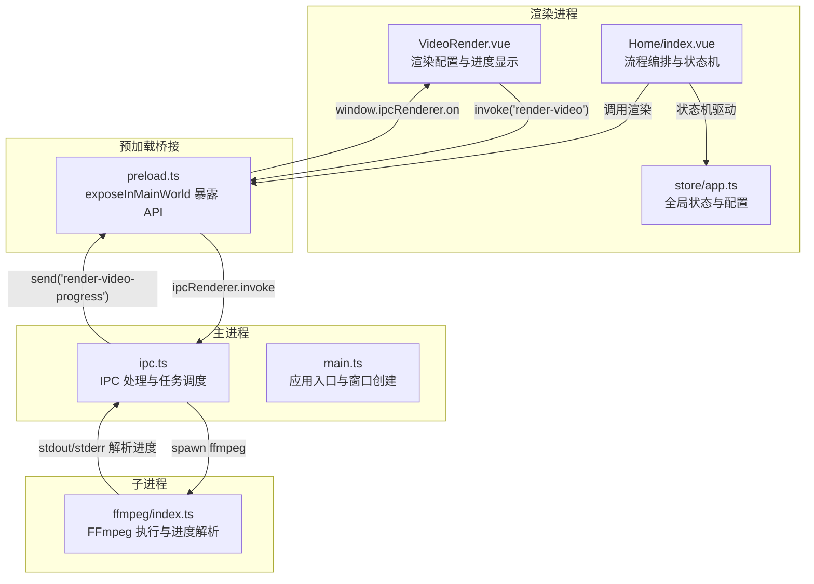
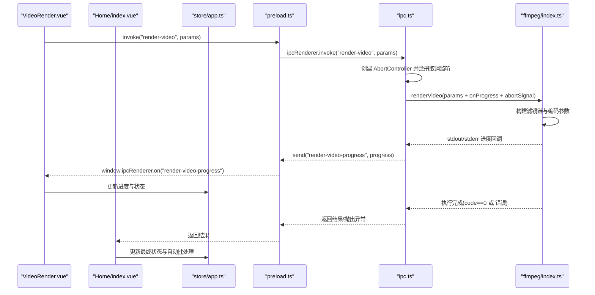
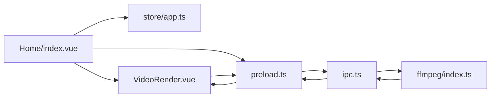

# 视频渲染组件

<cite>
**本文引用的文件**
- [src/views/Home/components/VideoRender.vue](file://src/views/Home/components/VideoRender.vue)
- [src/views/Home/index.vue](file://src/views/Home/index.vue)
- [src/store/app.ts](file://src/store/app.ts)
- [electron/ffmpeg/index.ts](file://electron/ffmpeg/index.ts)
- [electron/ffmpeg/types.ts](file://electron/ffmpeg/types.ts)
- [electron/ipc.ts](file://electron/ipc.ts)
- [electron/main.ts](file://electron/main.ts)
- [electron/preload.ts](file://electron/preload.ts)
- [electron/tts/index.ts](file://electron/tts/index.ts)
- [electron/vl/types.ts](file://electron/vl/types.ts)
- [locales/zh-CN/common.json](file://locales/zh-CN/common.json)
</cite>

## 目录
1. [简介](#简介)
2. [项目结构](#项目结构)
3. [核心组件](#核心组件)
4. [架构总览](#架构总览)
5. [详细组件分析](#详细组件分析)
6. [依赖关系分析](#依赖关系分析)
7. [性能考量](#性能考量)
8. [故障排除指南](#故障排除指南)
9. [结论](#结论)
10. [附录](#附录)

## 简介
本组件提供基于 FFmpeg 的视频合成与渲染能力，涵盖视频轨道拼接、音频响度归一化与混合、字幕嵌入、滤镜链处理等核心功能。结合主进程 IPC 通信，实现渲染任务提交、实时进度回调、状态同步与取消控制。UI 层提供渲染配置面板、进度条显示、日志提示与取消操作，支持批量渲染与自动重试。

## 项目结构
该功能位于 Electron 应用的前端与主进程之间，采用“渲染进程 UI + 预加载桥接 + 主进程 IPC + 子进程 FFmpeg”的分层架构。关键模块如下：
- 前端 UI：负责渲染配置、进度展示、用户交互与状态提示
- 预加载桥接：向渲染进程暴露安全的 IPC 接口
- 主进程 IPC：接收渲染请求、转发到 FFmpeg 并返回进度与结果
- FFmpeg 引擎：执行视频轨道合成、音频混合、字幕嵌入与编码

图表来源
- [src/views/Home/components/VideoRender.vue:1-276](file://src/views/Home/components/VideoRender.vue#L1-L276)
- [src/views/Home/index.vue:1-313](file://src/views/Home/index.vue#L1-L313)
- [src/store/app.ts:1-147](file://src/store/app.ts#L1-L147)
- [electron/preload.ts:1-100](file://electron/preload.ts#L1-L100)
- [electron/ipc.ts:1-295](file://electron/ipc.ts#L1-L295)
- [electron/ffmpeg/index.ts:1-272](file://electron/ffmpeg/index.ts#L1-L272)

章节来源
- [src/views/Home/components/VideoRender.vue:1-276](file://src/views/Home/components/VideoRender.vue#L1-L276)
- [src/views/Home/index.vue:1-313](file://src/views/Home/index.vue#L1-L313)
- [src/store/app.ts:1-147](file://src/store/app.ts#L1-L147)
- [electron/preload.ts:1-100](file://electron/preload.ts#L1-L100)
- [electron/ipc.ts:1-295](file://electron/ipc.ts#L1-L295)
- [electron/ffmpeg/index.ts:1-272](file://electron/ffmpeg/index.ts#L1-L272)

## 核心组件
- 渲染 UI 组件：负责渲染配置面板、进度条、启动/取消按钮、日志提示与 VL 模型配置
- 渲染流程编排：负责文案生成、TTS 合成、视频片段获取、调用渲染并处理结果与错误
- 状态管理：集中维护渲染状态、配置与自动批处理开关
- IPC 通道：提供渲染任务提交、进度回调、取消控制
- FFmpeg 引擎：构建复杂滤镜链、执行合成与编码、解析进度

章节来源
- [src/views/Home/components/VideoRender.vue:1-276](file://src/views/Home/components/VideoRender.vue#L1-L276)
- [src/views/Home/index.vue:1-313](file://src/views/Home/index.vue#L1-L313)
- [src/store/app.ts:1-147](file://src/store/app.ts#L1-L147)
- [electron/ipc.ts:1-295](file://electron/ipc.ts#L1-L295)
- [electron/ffmpeg/index.ts:1-272](file://electron/ffmpeg/index.ts#L1-L272)

## 架构总览
渲染组件的端到端工作流如下：
- 用户在 UI 中配置输出尺寸、文件名、导出目录、背景音乐目录与 VL 模型参数
- 编排层根据当前状态依次执行文案生成、TTS 合成、视频片段获取
- 调用预加载桥接的渲染接口，提交渲染任务
- 主进程接收任务，创建 AbortController 并监听取消事件
- 子进程执行 FFmpeg，解析进度并通过 IPC 回调渲染进程
- 渲染进程更新 UI 进度与状态，处理成功/失败与自动批处理

图表来源
- [src/views/Home/components/VideoRender.vue:224-226](file://src/views/Home/components/VideoRender.vue#L224-L226)
- [src/views/Home/index.vue:231-246](file://src/views/Home/index.vue#L231-L246)
- [electron/preload.ts:64](file://electron/preload.ts#L64)
- [electron/ipc.ts:183-198](file://electron/ipc.ts#L183-L198)
- [electron/ffmpeg/index.ts:188-244](file://electron/ffmpeg/index.ts#L188-L244)

## 详细组件分析

### 渲染 UI 组件（VideoRender.vue）
- 功能要点
  - 渲染状态指示：空闲、生成文案、合成语音、分割视频、渲染中、成功、失败
  - 进度显示：圆形进度条，渲染中时显示百分比，非渲染阶段可显示不确定进度
  - 控制按钮：启动渲染与取消渲染；渲染进行中禁用配置与启动
  - 配置面板：输出尺寸、文件名、导出目录、背景音乐目录、VL 模型参数
  - 文件夹选择：通过预加载桥接调用系统对话框选择目录
  - 自动批处理：渲染完成后自动触发下一次渲染（若启用）

- 关键交互
  - 监听渲染进度回调，更新进度条
  - 发射渲染与取消事件给父组件编排层
  - 保存配置到全局状态

章节来源
- [src/views/Home/components/VideoRender.vue:1-276](file://src/views/Home/components/VideoRender.vue#L1-L276)

### 渲染流程编排（Home/index.vue）
- 功能要点
  - 参数校验：输出文件名、导出目录、输出尺寸必填
  - 背景音乐随机选择：从指定目录筛选 MP3 并随机选取
  - 文案生成：可直接使用已有输出或触发生成
  - TTS 合成：生成语音文件并提取时长，校验有效性
  - 视频片段获取：优先智能匹配（VL），失败则回退到随机片段
  - 调用渲染：组装参数并调用渲染接口
  - 结果处理：成功提示与状态更新；失败弹出错误详情并复制到剪贴板
  - 取消逻辑：根据当前状态调用不同停止策略，发送取消信号给主进程

- 任务队列与状态机
  - 使用全局状态枚举渲染状态，严格限制各阶段的可执行性
  - 支持自动批处理：成功后清空文案并再次触发渲染

章节来源
- [src/views/Home/index.vue:1-313](file://src/views/Home/index.vue#L1-L313)
- [src/store/app.ts:6-14](file://src/store/app.ts#L6-L14)

### 状态管理（store/app.ts）
- 渲染状态枚举：None、GenerateText、SynthesizedSpeech、SegmentVideo、Rendering、Completed、Failed
- 渲染配置：输出尺寸、导出目录、文件名、扩展名、背景音乐目录
- VL 配置：模型名称、API 地址、API Key
- 自动批处理开关与渲染状态字段

章节来源
- [src/store/app.ts:1-147](file://src/store/app.ts#L1-L147)

### IPC 通信（ipc.ts）
- 渲染任务处理
  - 注册渲染接口：接收参数，创建进度回调与取消控制器
  - 监听取消事件：收到取消信号后中断子进程
  - 调用 FFmpeg 渲染函数并返回结果
- 进度回调：将子进程解析的进度通过 IPC 发送给渲染进程

章节来源
- [electron/ipc.ts:183-198](file://electron/ipc.ts#L183-L198)

### 预加载桥接（preload.ts）
- 暴露安全 API：窗口控制、文件夹选择、TTS、渲染、VL、SQLite 等
- 渲染接口：向主进程发起渲染任务并接收进度回调

章节来源
- [electron/preload.ts:1-100](file://electron/preload.ts#L1-L100)

### FFmpeg 引擎（ffmpeg/index.ts）
- 参数与默认值
  - 视频输入：多路视频轨道按时间范围裁剪、缩放、填充、统一帧率与色彩空间
  - 音频输入：语音音轨与背景音乐，响度归一化后混合
  - 字幕嵌入：在视频拼接后叠加 SRT 字幕
  - 编码参数：H.264 编码、AAC 音频、固定帧率与输出尺寸
- 进度解析
  - 从标准输出解析时间戳，换算为近似进度百分比
  - 在关闭事件中确保进度达到 100%
- 取消控制
  - 通过 AbortSignal 发送 SIGTERM 中断子进程

章节来源
- [electron/ffmpeg/index.ts:26-186](file://electron/ffmpeg/index.ts#L26-L186)
- [electron/ffmpeg/index.ts:188-244](file://electron/ffmpeg/index.ts#L188-L244)
- [electron/ffmpeg/index.ts:261-271](file://electron/ffmpeg/index.ts#L261-L271)

### 类型定义（ffmpeg/types.ts）
- 渲染参数：视频文件列表、时间范围、音频文件、字幕文件、输出尺寸、输出路径、输出时长、音量配置
- 执行结果：标准输出、标准错误、退出码

章节来源
- [electron/ffmpeg/types.ts:1-23](file://electron/ffmpeg/types.ts#L1-L23)

### TTS 与字幕（tts/index.ts）
- 语音合成：生成 MP3 与可选字幕 SRT 文件
- 元数据解析：读取音频时长，校验有效性
- 临时文件清理：应用退出前清理当前会话的临时文件

章节来源
- [electron/tts/index.ts:1-86](file://electron/tts/index.ts#L1-L86)

### VL 类型（vl/types.ts）
- 视觉大模型配置与分析参数
- 匹配视频片段所需的颜色与标签参数

章节来源
- [electron/vl/types.ts:1-85](file://electron/vl/types.ts#L1-L85)

### 国际化与文案（locales/zh-CN/common.json）
- 渲染相关文案：状态提示、按钮标签、错误信息、成功提示等
- 用于 UI 组件中的多语言显示

章节来源
- [locales/zh-CN/common.json:1-200](file://locales/zh-CN/common.json#L1-L200)

## 依赖关系分析
- 组件耦合
  - UI 仅通过预加载桥接与主进程通信，避免直接访问 Node 能力
  - 主进程仅处理 IPC 与任务调度，不直接操作 UI
  - FFmpeg 作为独立子进程运行，通过标准输入输出与主进程交互
- 数据流
  - 渲染参数从 UI 传递到预加载桥接，再到主进程，最后到达 FFmpeg
  - 进度与结果从 FFmpeg 通过主进程回调到 UI
- 取消与错误
  - 取消通过 AbortController 传播至子进程
  - 错误通过异常与状态机反馈到 UI

图表来源
- [src/views/Home/components/VideoRender.vue:1-276](file://src/views/Home/components/VideoRender.vue#L1-L276)
- [src/views/Home/index.vue:1-313](file://src/views/Home/index.vue#L1-L313)
- [src/store/app.ts:1-147](file://src/store/app.ts#L1-L147)
- [electron/preload.ts:1-100](file://electron/preload.ts#L1-L100)
- [electron/ipc.ts:1-295](file://electron/ipc.ts#L1-L295)
- [electron/ffmpeg/index.ts:1-272](file://electron/ffmpeg/index.ts#L1-L272)

## 性能考量
- 视频处理
  - 使用统一帧率与色彩空间，减少转码开销
  - 按需裁剪与缩放，避免不必要的大尺寸处理
- 音频处理
  - 先响度归一化再裁剪，避免截断导致的音量突变
  - 音频混合采用“以语音为准”的时长策略，保证自然过渡
- 进度解析
  - 基于时间戳的近似进度，避免频繁高成本解析
- I/O 与缓存
  - 临时文件在会话结束后清理，避免磁盘占用
- 批处理
  - 成功后自动触发下一次渲染，提升吞吐量

## 故障排除指南
- FFmpeg 未找到或权限问题
  - 现象：启动失败或抛出找不到可执行文件
  - 处理：确认 FFmpeg 路径与可执行权限；开发环境与打包环境路径差异已在代码中处理
- 输出路径不存在
  - 现象：渲染初始化即报错
  - 处理：确保导出目录存在且可写
- TTS 时长为 0 或文件损坏
  - 现象：音频时长校验失败
  - 处理：检查网络与 TTS 配置，重试合成
- 背景音乐读取失败
  - 现象：随机选取失败并弹出错误
  - 处理：检查背景音乐目录权限与文件格式
- 渲染被取消
  - 现象：渲染中途停止
  - 处理：检查取消信号是否被意外触发；确认 UI 状态与取消按钮绑定
- 进度不更新
  - 现象：进度条卡住
  - 处理：确认主进程进度回调是否正常发送；检查 FFmpeg 输出解析逻辑

章节来源
- [electron/ffmpeg/index.ts:50-54](file://electron/ffmpeg/index.ts#L50-L54)
- [electron/ffmpeg/index.ts:246-259](file://electron/ffmpeg/index.ts#L246-L259)
- [src/views/Home/index.vue:115-139](file://src/views/Home/index.vue#L115-L139)
- [src/views/Home/index.vue:163-168](file://src/views/Home/index.vue#L163-L168)
- [src/views/Home/index.vue:282-307](file://src/views/Home/index.vue#L282-L307)

## 结论
该视频渲染组件通过清晰的分层架构与严格的 IPC 通信，实现了从 UI 到 FFmpeg 的完整渲染流水线。组件具备完善的进度监控、取消控制与错误反馈机制，并提供灵活的配置面板与自动批处理能力。建议在生产环境中进一步增强日志记录与重试策略，以提升稳定性与可观测性。

## 附录

### 使用示例与最佳实践
- 渲染参数配置
  - 输出尺寸与文件名：在渲染配置面板中设置
  - 导出目录与背景音乐目录：通过系统对话框选择
  - VL 模型参数：用于智能匹配与素材分析
- 批量处理
  - 启用自动批处理后，成功渲染完成后自动触发下一次
- 性能优化
  - 合理设置输出尺寸，避免过大分辨率
  - 使用统一帧率与色彩空间，减少转码
  - 音频响度归一化与裁剪顺序优化
- 故障排除
  - 确认 FFmpeg 可执行与路径正确
  - 检查导出目录权限与可用空间
  - 校验 TTS 配置与网络连通性

### 与状态管理的集成
- 全局状态维护渲染状态、配置与自动批处理
- UI 与编排层通过状态机驱动流程，避免竞态
- 错误与成功状态均通过状态更新反馈到 UI

章节来源
- [src/store/app.ts:65-89](file://src/store/app.ts#L65-L89)
- [src/views/Home/index.vue:252-256](file://src/views/Home/index.vue#L252-L256)