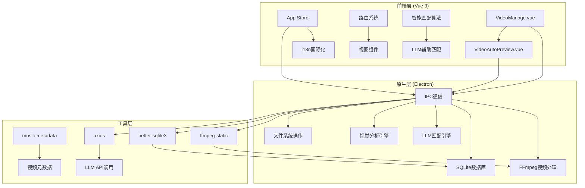
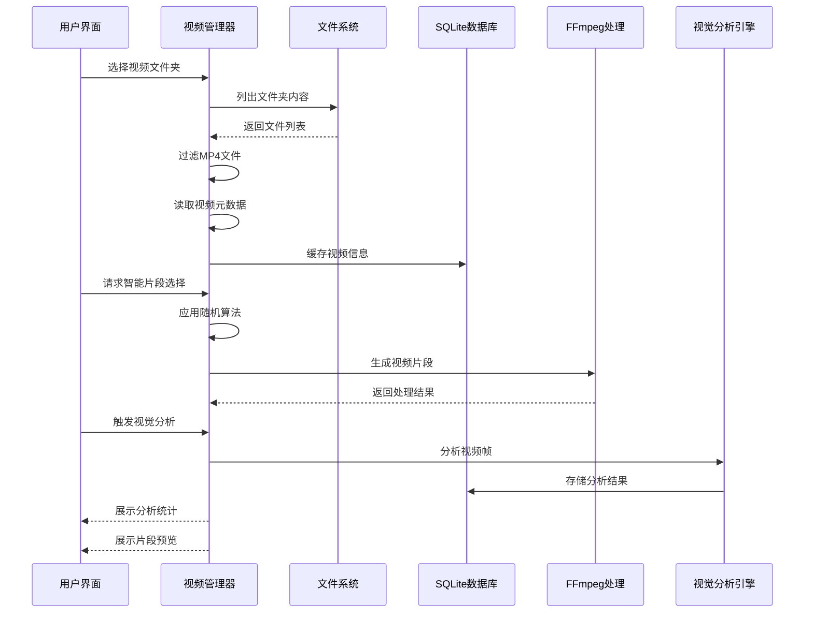
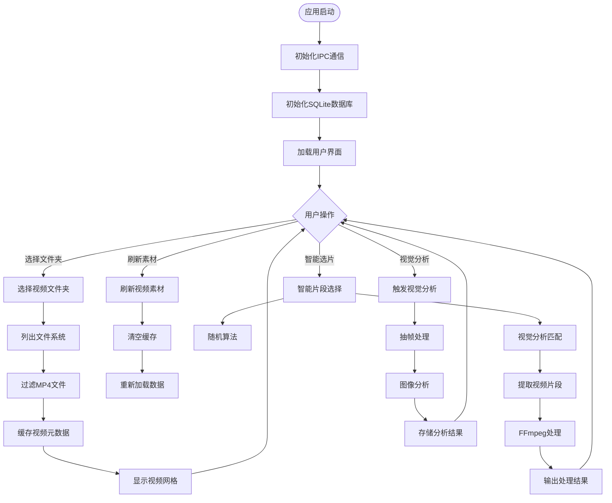
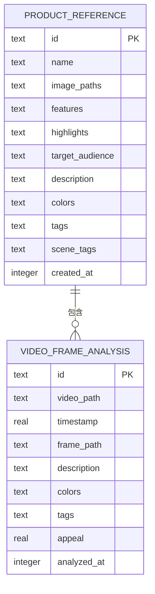
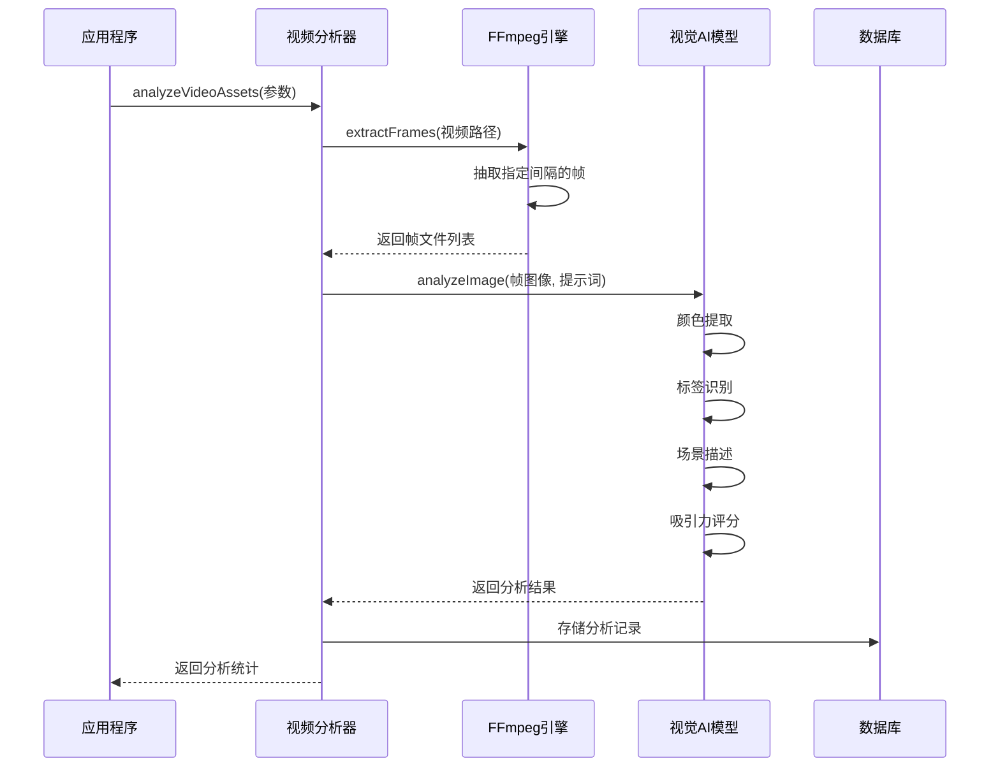
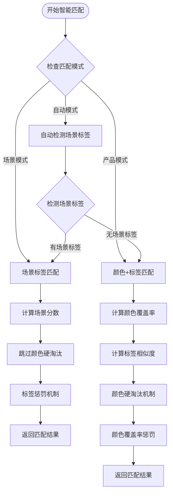
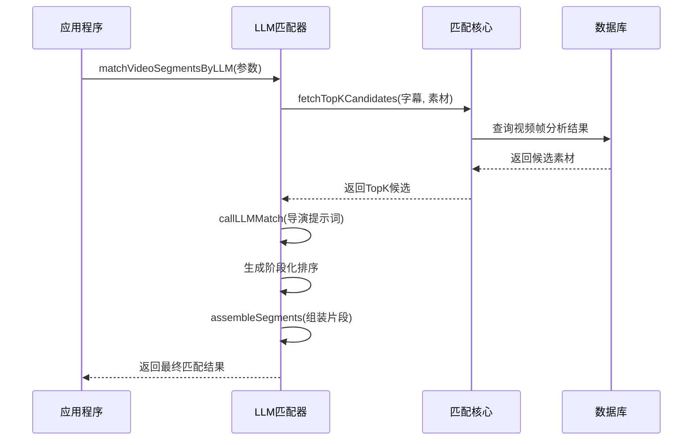
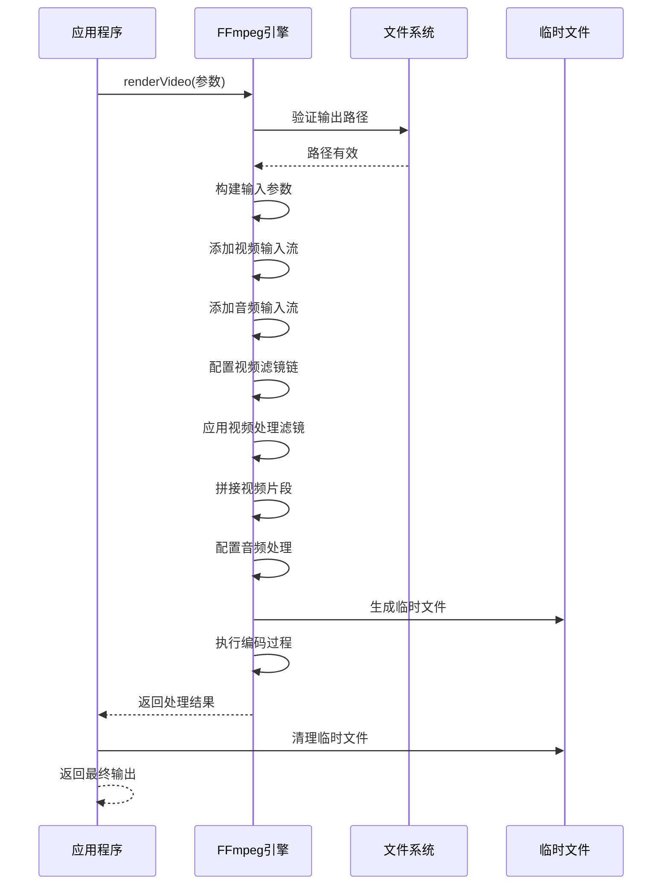
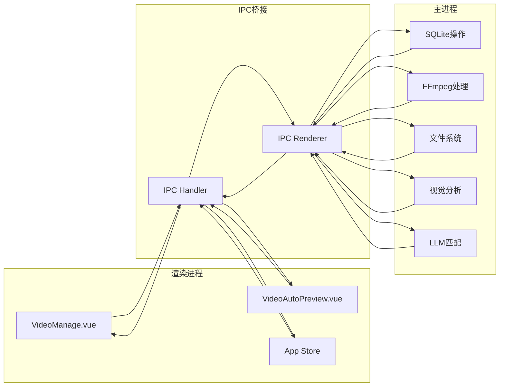
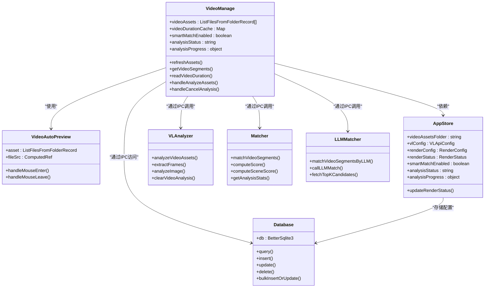

# 视频管理组件

<cite>
**本文档引用的文件**
- [VideoManage.vue](file://src/views/Home/components/VideoManage.vue)
- [VideoAutoPreview.vue](file://src/components/VideoAutoPreview.vue)
- [index.ts](file://electron/sqlite/index.ts)
- [types.ts](file://electron/sqlite/types.ts)
- [index.ts](file://electron/ffmpeg/index.ts)
- [types.ts](file://electron/ffmpeg/types.ts)
- [ipc.ts](file://electron/ipc.ts)
- [main.ts](file://electron/main.ts)
- [app.ts](file://src/store/app.ts)
- [i18n.ts](file://src/lib/i18n.ts)
- [index.ts](file://electron/vl/index.ts)
- [analyze-video.ts](file://electron/vl/analyze-video.ts)
- [match.ts](file://electron/vl/match.ts)
- [llm-match.ts](file://electron/vl/llm-match.ts)
- [types.ts](file://electron/vl/types.ts)
- [package.json](file://package.json)
- [README.md](file://README.md)
</cite>

## 更新摘要
**变更内容**
- 新增视觉分析(VL)功能模块，支持视频帧分析和智能匹配
- 增强资产组织和过滤能力，支持基于颜色、标签的智能筛选
- 集成LLM辅助的剪辑匹配算法，提供导演级的素材选择
- 改进分析统计和进度监控功能
- 优化智能片段选择算法，支持多种匹配模式

## 目录
1. [简介](#简介)
2. [项目结构](#项目结构)
3. [核心组件](#核心组件)
4. [架构概览](#架构概览)
5. [详细组件分析](#详细组件分析)
6. [依赖关系分析](#依赖关系分析)
7. [性能考虑](#性能考虑)
8. [故障排除指南](#故障排除指南)
9. [结论](#结论)
10. [附录](#附录)

## 简介

视频管理组件是短视频工厂项目的核心功能模块，负责管理视频素材库、实现智能片段选择算法，并提供完整的视频处理工作流。该组件集成了MP4视频文件的导入、索引、元数据提取和缓存机制，同时实现了基于SQLite数据库的视频信息存储和查询优化。

**新增功能**：组件现已集成强大的视觉分析(VL)功能，支持视频帧级别的内容分析，包括颜色提取、标签识别、场景描述和视觉吸引力评分。通过AI驱动的智能匹配算法，能够根据产品特征和文案内容自动选择最合适的视频片段。

项目采用Electron + Vue 3 + TypeScript的技术栈，通过IPC通信实现前端与原生功能的无缝集成。组件支持多语言国际化，提供直观的UI界面，包括视频网格展示、搜索过滤、批量操作等功能。

## 项目结构

短视频工厂项目采用现代化的前后端分离架构，主要分为以下几个层次：



**图表来源**
- [VideoManage.vue:1-457](file://src/views/Home/components/VideoManage.vue#L1-L457)
- [ipc.ts:1-200](file://electron/ipc.ts#L1-L200)
- [main.ts:187-204](file://electron/main.ts#L187-L204)

**章节来源**
- [package.json:1-85](file://package.json#L1-L85)
- [README.md:44-62](file://README.md#L44-L62)

## 核心组件

### 视频管理器 (VideoManage.vue)

视频管理器是整个组件的核心控制器，负责视频素材库的完整生命周期管理：

#### 主要功能特性
- **文件夹选择与监控**：支持用户选择视频素材文件夹，实时监控文件变化
- **视频网格展示**：采用响应式网格布局展示视频缩略图
- **智能片段选择**：基于随机算法的智能视频片段抽取
- **元数据缓存**：高效的视频时长缓存机制
- **错误处理**：完善的异常捕获和用户反馈系统
- **视觉分析集成**：支持视频帧分析和智能匹配功能
- **分析统计**：实时显示分析进度和统计信息

#### 数据流控制


**图表来源**
- [VideoManage.vue:170-243](file://src/views/Home/components/VideoManage.vue#L170-L243)
- [VideoManage.vue:274-303](file://src/views/Home/components/VideoManage.vue#L274-L303)

**章节来源**
- [VideoManage.vue:1-457](file://src/views/Home/components/VideoManage.vue#L1-L457)

### 视频自动预览组件 (VideoAutoPreview.vue)

这是一个轻量级的视频预览组件，提供自动播放的视频缩略图功能：

#### 核心特性
- **自动播放**：鼠标悬停时自动播放视频
- **循环播放**：支持视频循环播放效果
- **资源优化**：使用metadata预加载模式减少内存占用
- **路径处理**：智能处理不同操作系统的文件路径格式

**章节来源**
- [VideoAutoPreview.vue:1-42](file://src/components/VideoAutoPreview.vue#L1-L42)

## 架构概览

### 整体架构设计

```mermaid
graph TB
subgraph "用户界面层"
UI[Vue组件] --> VM[视频管理器]
UI --> VP[视频预览组件]
UI --> AS[应用状态管理]
end
subgraph "IPC通信层"
IPC[Electron IPC] --> SQ[SQLite操作]
IPC --> FF[FFmpeg处理]
IPC --> FS[文件系统]
IPC --> VA[视觉分析]
IPC --> LLM[LLM匹配]
end
subgraph "数据持久化层"
DB[(SQLite数据库)]
CACHE[内存缓存]
end
subgraph "原生功能层"
FFMPEG[FFmpeg编解码]
METADATA[music-metadata]
FILESYS[文件系统API]
VL_ENGINE[视觉分析引擎]
LLM_ENGINE[LLM匹配引擎]
END
VM --> IPC
VP --> IPC
AS --> IPC
IPC --> DB
IPC --> FFMPEG
IPC --> FILESYS
IPC --> VA
IPC --> LLM
DB --> CACHE
VA --> VL_ENGINE
LLM --> LLM_ENGINE
```

**图表来源**
- [ipc.ts:1-200](file://electron/ipc.ts#L1-L200)
- [main.ts:187-204](file://electron/main.ts#L187-L204)

### 数据流架构



**图表来源**
- [VideoManage.vue:170-243](file://src/views/Home/components/VideoManage.vue#L170-L243)
- [VideoManage.vue:274-303](file://src/views/Home/components/VideoManage.vue#L274-L303)

## 详细组件分析

### SQLite数据库管理系统

#### 数据库设计



**图表来源**
- [index.ts:149-182](file://electron/sqlite/index.ts#L149-L182)

#### 数据库操作接口

数据库提供了完整的CRUD操作接口，支持批量插入和更新：

| 操作类型 | 方法名 | 功能描述 |
|---------|--------|----------|
| 查询 | `sqQuery()` | 执行SQL查询语句 |
| 插入 | `sqInsert()` | 单条记录插入 |
| 更新 | `sqUpdate()` | 单条记录更新 |
| 删除 | `sqDelete()` | 单条记录删除 |
| 批量操作 | `sqBulkInsertOrUpdate()` | 批量插入或更新 |

**章节来源**
- [index.ts:38-140](file://electron/sqlite/index.ts#L38-L140)
- [types.ts:1-26](file://electron/sqlite/types.ts#L1-L26)

### 视觉分析引擎

#### 视频帧分析流程



**图表来源**
- [analyze-video.ts:95-199](file://electron/vl/analyze-video.ts#L95-L199)

#### 分析功能特性

| 功能模块 | 描述 | 输出格式 |
|----------|------|----------|
| 颜色分析 | 提取产品主体颜色，最多4种 | JSON数组 |
| 标签识别 | 识别物品/场景标签，最多5个 | JSON数组 |
| 场景描述 | 中文简短描述画面主体 | 字符串 |
| 吸引力评分 | 1-10分的视觉吸引力评分 | 整数 |
| 帧缓存 | 基于MD5的帧文件缓存 | 文件系统 |

**章节来源**
- [index.ts:26-120](file://electron/vl/index.ts#L26-L120)
- [analyze-video.ts:29-68](file://electron/vl/analyze-video.ts#L29-L68)

### 智能匹配算法

#### 多模式匹配策略



**图表来源**
- [match.ts:278-382](file://electron/vl/match.ts#L278-L382)

#### 匹配算法参数

| 参数类别 | 配置项 | 值 | 说明 |
|----------|--------|----|-----|
| 颜色权重 | 产品模式 | 0.4 | 颜色匹配在总分中的权重 |
| 标签权重 | 产品模式 | 0.6 | 标签匹配在总分中的权重 |
| 颜色权重 | 场景模式 | 0.2 | 颜色匹配在总分中的权重 |
| 标签权重 | 场景模式 | 0.8 | 标签匹配在总分中的权重 |
| 最小片段时长 | 默认值 | 2秒 | 单个片段的最短时长 |
| 最大片段时长 | 默认值 | 15秒 | 单个片段的最长时长 |
| 颜色硬淘汰阈值 | 产品模式 | 0.34 | 覆盖率低于此值直接淘汰 |
| 颜色覆盖率惩罚 | 产品模式 | 0.3-1.0 | 根据覆盖率渐进惩罚 |

**章节来源**
- [match.ts:101-137](file://electron/vl/match.ts#L101-L137)
- [match.ts:143-157](file://electron/vl/match.ts#L143-L157)

### LLM辅助剪辑匹配

#### 导演级匹配算法



**图表来源**
- [llm-match.ts:265-303](file://electron/vl/llm-match.ts#L265-L303)

#### LLM匹配特性

| 功能特性 | 描述 | 实现方式 |
|----------|------|----------|
| 三段式结构 | Hook → Content → CTA | 导演级提示词约束 |
| 阶段匹配 | 严格匹配各阶段需求 | stageHints智能匹配 |
| 多候选推荐 | 每句推荐多个备选 | 备选索引列表 |
| 时间槽填充 | 按字幕时长精确填充 | 语义对齐算法 |
| 去重处理 | 自动去除重叠片段 | 时间范围检查 |

**章节来源**
- [llm-match.ts:161-241](file://electron/vl/llm-match.ts#L161-L241)

### FFmpeg视频处理引擎

#### 视频渲染流程



**图表来源**
- [index.ts:26-186](file://electron/ffmpeg/index.ts#L26-L186)

#### 视频处理参数

| 参数类别 | 配置项 | 值 | 说明 |
|----------|--------|----|-----|
| 编码器 | 视频编码 | libx264 | H.264编码 |
| 编码器 | 音频编码 | aac | AAC音频编码 |
| 分辨率 | 输出尺寸 | 1080x1920 | 竖屏视频标准 |
| 帧率 | 输出帧率 | 30fps | 标准播放帧率 |
| 质量 | CRF值 | 23 | 编码质量控制 |
| 音频 | 响度归一化 | -16 LUFS | 语音响度标准 |

**章节来源**
- [index.ts:26-186](file://electron/ffmpeg/index.ts#L26-L186)

### IPC通信机制

#### 主进程与渲染进程通信



**图表来源**
- [ipc.ts:1-200](file://electron/ipc.ts#L1-L200)
- [main.ts:187-204](file://electron/main.ts#L187-L204)

**章节来源**
- [ipc.ts:1-200](file://electron/ipc.ts#L1-L200)

## 依赖关系分析

### 核心依赖关系

```mermaid
graph TB
subgraph "前端依赖"
VUE[Vue 3.5.17]
PINIA[Pinia 3.0.3]
VITE[Vite 7.0.3]
Vuetify 3.11.5
end
subgraph "原生依赖"
ELECTRON[Electron 22.3.27]
SQLITE[better-sqlite3 9.6.0]
FFMPEG[ffmpeg-static 5.2.0]
METADATA[music-metadata 11.7.3]
AXIOS[axios 1.6.0]
end
subgraph "第三方服务"
I18N[i18next 25.4.0]
VL_API[视觉分析API]
LLM_API[大模型API]
end
VUE --> PINIA
VUE --> VITE
VUE --> Vuetify
VITE --> ELECTRON
ELECTRON --> SQLITE
ELECTRON --> FFMPEG
ELECTRON --> METADATA
ELECTRON --> AXIOS
VUE --> I18N
VUE --> VL_API
VUE --> LLM_API
```

**图表来源**
- [package.json:22-63](file://package.json#L22-L63)

### 组件间依赖关系



**图表来源**
- [VideoManage.vue:1-457](file://src/views/Home/components/VideoManage.vue#L1-L457)
- [VideoAutoPreview.vue:16-42](file://src/components/VideoAutoPreview.vue#L16-L42)
- [app.ts:16-151](file://src/store/app.ts#L16-L151)

**章节来源**
- [package.json:22-63](file://package.json#L22-L63)

## 性能考虑

### 内存优化策略

1. **视频元数据缓存**
   - 使用Map结构缓存视频时长信息
   - 缓存有效期与应用生命周期绑定
   - 避免重复的DOM操作和文件读取

2. **帧缓存管理**
   - 基于MD5的帧文件缓存机制
   - 自动清理过期的帧文件
   - 支持增量分析，跳过已分析视频

3. **并发控制**
   - 帧分析并发数限制为3
   - 进度回调机制避免UI阻塞
   - 支持取消信号中断长时间操作

4. **虚拟滚动优化**
   - 采用CSS Grid布局而非虚拟列表
   - 控制网格单元格的最大高度(200px)
   - 减少DOM节点数量和内存占用

### 数据库性能优化

1. **索引策略**
   - 为video_frame_analysis表建立video_path索引
   - 支持按视频路径快速查询帧分析结果
   - 优化频繁查询场景的性能表现

2. **连接池管理**
   - 使用better-sqlite3的原生连接
   - 支持事务批量操作减少IO开销
   - 自动化的连接管理和清理

3. **分析数据优化**
   - 支持增量分析，跳过已分析视频
   - 帧文件自动清理机制
   - 分析统计的快速查询接口

### 网络和I/O优化

1. **文件系统访问**
   - 使用Node.js内置fs模块进行高效文件操作
   - 支持跨平台文件路径处理
   - 异常情况下的容错处理机制

2. **IPC通信优化**
   - 采用事件驱动的消息传递
   - 支持取消信号中断长时间操作
   - 进度回调提供实时状态反馈

3. **AI模型调用优化**
   - 帧分析并发限制避免API限流
   - 响应解析容错处理
   - 超时控制和重试机制

## 故障排除指南

### 常见问题及解决方案

#### 视频文件导入失败

**问题症状**：选择视频文件夹后无法显示视频文件

**可能原因**：
1. 文件夹权限不足
2. 网络路径访问受限
3. 文件系统编码问题

**解决步骤**：
1. 检查文件夹读取权限
2. 尝试使用本地磁盘路径
3. 确认文件扩展名为.mp4
4. 查看应用日志获取详细错误信息

#### 视频时长读取超时

**问题症状**：视频网格显示但时长信息加载缓慢

**可能原因**：
1. 视频文件损坏
2. FFmpeg不可用
3. 系统资源不足

**解决步骤**：
1. 验证视频文件完整性
2. 检查FFmpeg安装状态
3. 关闭其他占用CPU的应用
4. 重启应用尝试重新加载

#### SQLite数据库连接错误

**问题症状**：应用启动时报数据库连接失败

**可能原因**：
1. 数据库文件被其他进程占用
2. 权限不足无法写入用户数据目录
3. better-sqlite3绑定文件缺失

**解决步骤**：
1. 关闭所有可能使用数据库的进程
2. 检查用户数据目录写入权限
3. 重新安装应用或手动复制绑定文件
4. 清理损坏的数据库文件

#### 视觉分析失败

**问题症状**：触发视觉分析后无结果或报错

**可能原因**：
1. VL API配置错误
2. 网络连接问题
3. 视频文件格式不支持
4. AI模型响应异常

**解决步骤**：
1. 检查VL API配置是否正确
2. 验证网络连接状态
3. 确认视频文件格式和编码
4. 查看AI模型响应日志
5. 重试分析或清理缓存

### 调试和诊断

#### 日志收集方法

1. **应用日志**：查看控制台输出的错误信息
2. **系统日志**：检查Electron主进程日志
3. **数据库日志**：启用SQLite调试模式
4. **网络日志**：监控IPC通信状态
5. **AI分析日志**：查看视觉分析详细日志

#### 性能监控指标

| 指标类型 | 正常范围 | 警告阈值 | 错误阈值 |
|----------|----------|----------|----------|
| 内存使用 | < 500MB | 500-800MB | > 800MB |
| CPU使用 | < 50% | 50-80% | > 80% |
| 磁盘IO | < 100MB/s | 100-500MB/s | > 500MB/s |
| 网络延迟 | < 100ms | 100-500ms | > 500ms |
| AI分析时间 | < 5s/帧 | 5-10s/帧 | > 10s/帧 |

**章节来源**
- [VideoManage.vue:217-239](file://src/views/Home/components/VideoManage.vue#L217-L239)
- [index.ts:184-187](file://electron/sqlite/index.ts#L184-L187)

## 结论

视频管理组件展现了现代桌面应用开发的最佳实践，通过精心设计的架构实现了高性能的视频素材管理功能。组件的主要优势包括：

1. **模块化设计**：清晰的职责分离和接口定义
2. **AI增强功能**：集成视觉分析和智能匹配算法
3. **性能优化**：多层缓存机制和异步处理策略
4. **用户体验**：直观的界面设计和流畅的操作体验
5. **可扩展性**：良好的架构为未来功能扩展奠定基础

**新增亮点**：
- **视觉分析引擎**：支持视频帧级别的内容理解和分析
- **智能匹配算法**：基于颜色、标签和场景的多维度匹配
- **LLM辅助剪辑**：导演级的素材选择和组合算法
- **分析统计系统**：实时显示分析进度和结果统计

该组件为短视频工厂项目提供了坚实的基础，支持从简单的视频素材管理到复杂的AI驱动智能片段选择和视频渲染处理。通过合理的架构设计和技术选型，确保了应用在不同平台上的稳定性和性能表现。

## 附录

### 使用指南

#### 视频导入流程

1. **选择素材文件夹**
   - 点击"选择文件夹"按钮
   - 导航到包含MP4视频的目录
   - 确认选择并等待文件扫描完成

2. **素材库刷新**
   - 点击"刷新素材"按钮
   - 系统自动扫描并过滤MP4文件
   - 显示视频网格预览

3. **智能片段选择**
   - 调整目标视频时长
   - 点击"智能选片"按钮
   - 等待算法处理并显示结果

#### 视觉分析流程

1. **配置AI分析**
   - 在设置中配置VL API参数
   - 确认API连接正常
   - 选择分析间隔（默认3秒）

2. **触发分析**
   - 点击"分析素材"按钮
   - 等待分析进度条完成
   - 查看分析统计结果

3. **智能匹配**
   - 启用智能匹配开关
   - 系统自动使用分析结果进行匹配
   - 支持产品模式和场景模式切换

#### 性能优化建议

1. **文件组织**
   - 将视频文件按主题分类存放
   - 使用统一命名规范便于管理
   - 定期清理损坏或重复的视频文件

2. **系统配置**
   - 确保足够的磁盘空间
   - 关闭不必要的后台应用
   - 使用SSD硬盘提升I/O性能

3. **AI分析优化**
   - 合理设置分析间隔（2-5秒）
   - 定期清理分析缓存
   - 监控AI API使用情况

### 技术规格

#### 系统要求

| 平台 | 最低要求 | 推荐配置 |
|------|----------|----------|
| Windows | Win 10 64位 | Win 11 64位 |
| macOS | macOS 10.15 | macOS 12+ |
| Linux | Ubuntu 18.04 | Ubuntu 20.04+ |

#### 硬件要求

- **CPU**: Intel i5 或同等AMD处理器
- **内存**: 8GB RAM (16GB推荐)
- **存储**: 至少1GB可用空间
- **显卡**: 集成显卡即可满足需求

#### 兼容性

- **视频格式**: MP4 (H.264/H.265)
- **音频格式**: AAC, MP3
- **字幕格式**: SRT, ASS
- **操作系统**: Windows 10+, macOS 10.15+, Linux
- **AI模型**: 支持多种视觉分析模型

#### AI分析配置

- **API类型**: 支持多种视觉分析API
- **模型选择**: qwen-vl-plus等主流模型
- **并发限制**: 帧分析并发数限制为3
- **缓存策略**: 基于MD5的帧文件缓存
- **增量分析**: 支持跳过已分析视频