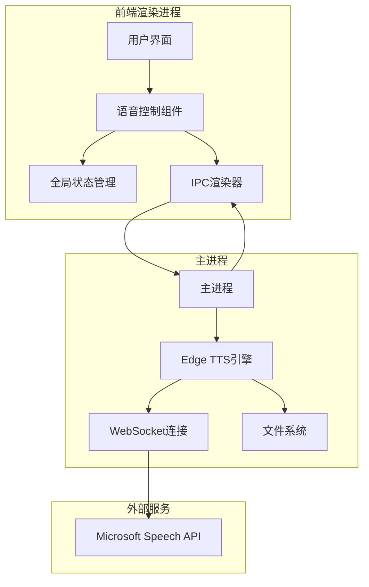
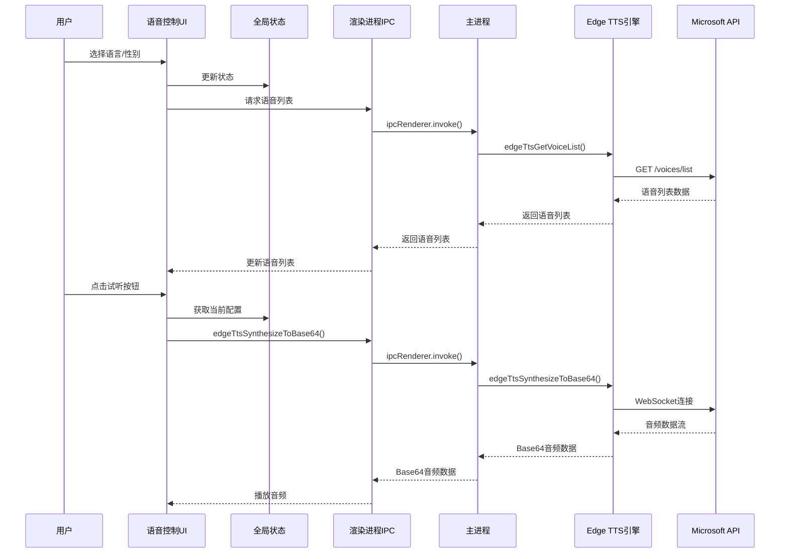
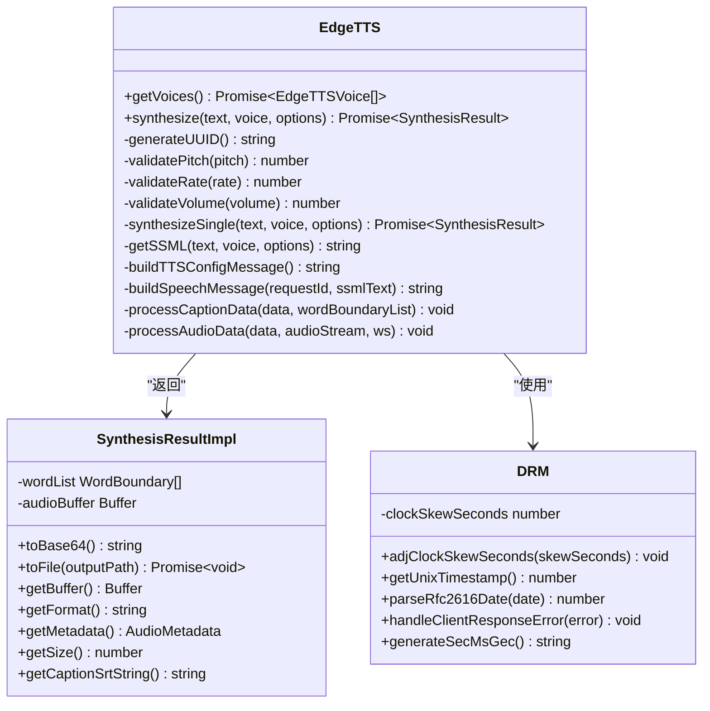
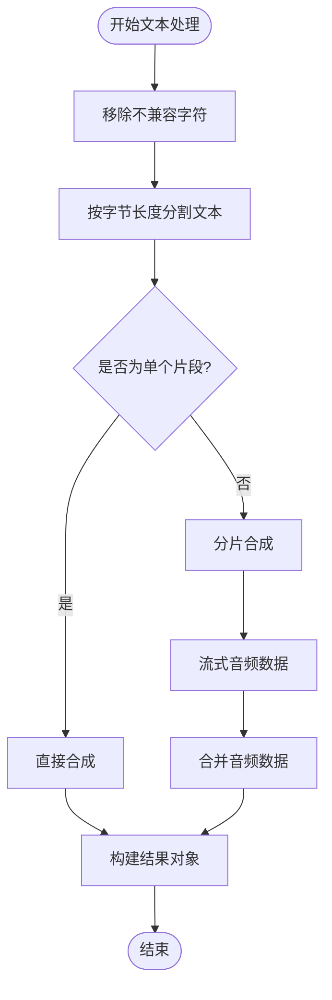
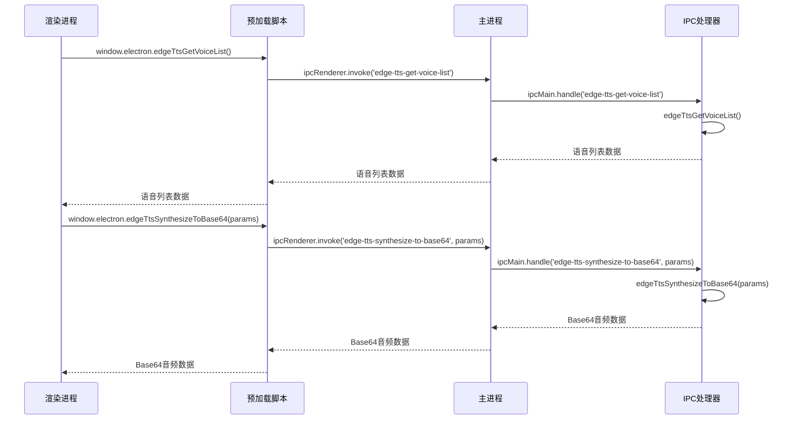
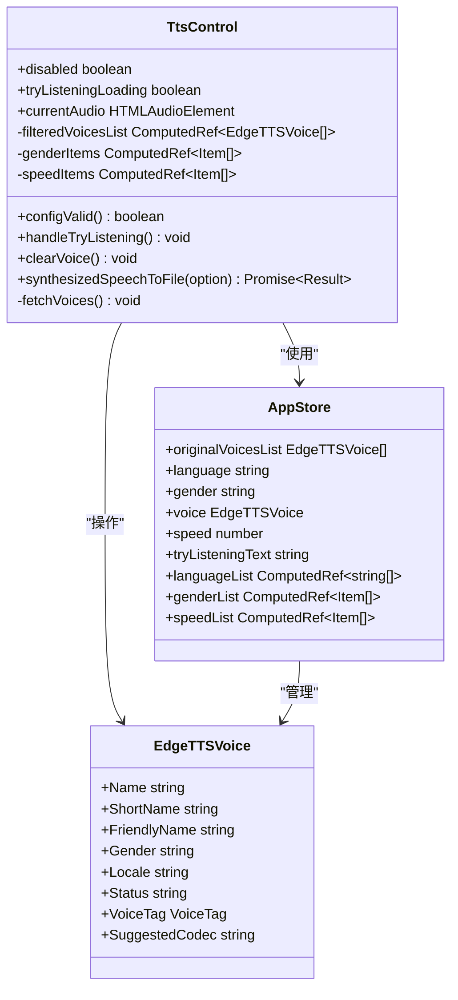
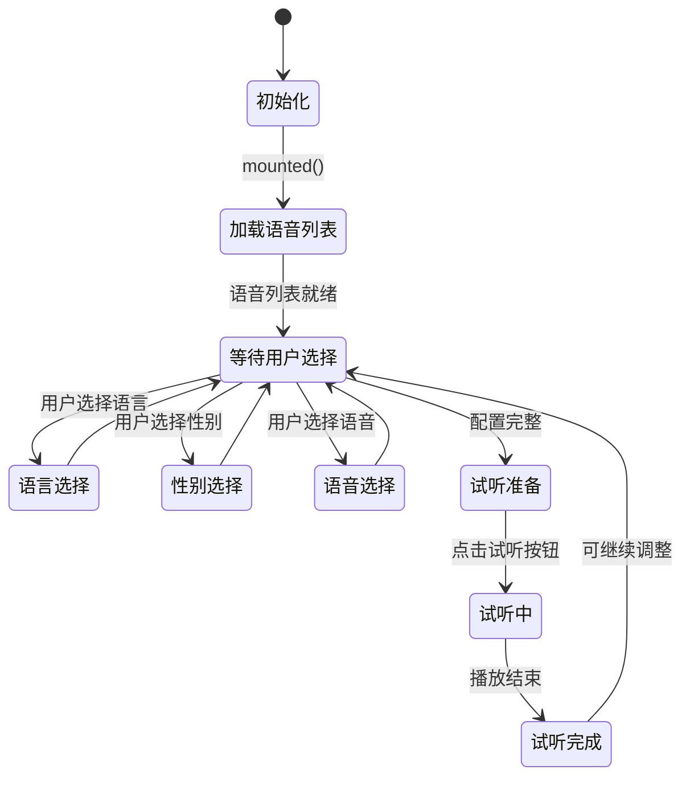
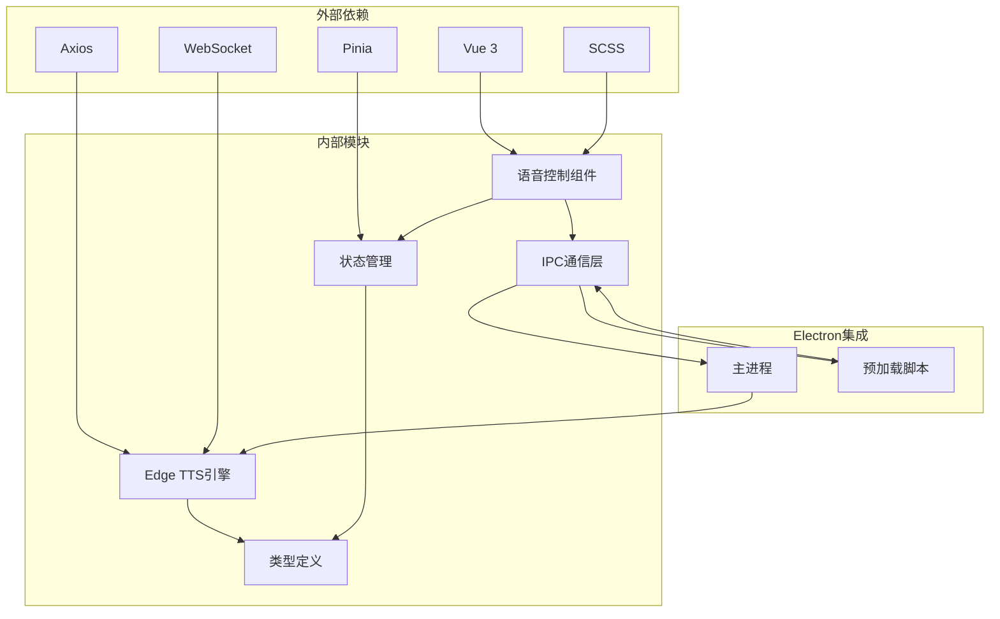

# 语音控制组件

<cite>
**本文档引用的文件**
- [TtsControl.vue](file://src/views/Home/components/TtsControl.vue)
- [edge-tts.ts](file://electron/lib/edge-tts.ts)
- [tts/index.ts](file://electron/tts/index.ts)
- [ipc.ts](file://electron/ipc.ts)
- [preload.ts](file://electron/preload.ts)
- [app.ts](file://src/store/app.ts)
- [main.ts](file://electron/main.ts)
- [types.ts](file://electron/tts/types.ts)
- [common.json](file://locales/zh-CN/common.json)
- [index.vue](file://src/views/Home/index.vue)
</cite>

## 目录
1. [简介](#简介)
2. [项目结构](#项目结构)
3. [核心组件](#核心组件)
4. [架构概览](#架构概览)
5. [详细组件分析](#详细组件分析)
6. [依赖分析](#依赖分析)
7. [性能考虑](#性能考虑)
8. [故障排除指南](#故障排除指南)
9. [结论](#结论)
10. [附录](#附录)

## 简介

语音控制组件是短视频工厂项目中的核心功能模块，负责集成Microsoft Edge TTS（文本转语音）技术，提供完整的语音合成解决方案。该组件实现了语音列表获取、参数调节（语言、性别、语速）、实时试听等功能，并通过Electron IPC机制与主进程进行双向通信。

本组件采用Vue 3 Composition API开发，结合Pinia状态管理，提供了直观的用户界面和强大的语音合成能力。用户可以通过下拉框选择语言和性别，筛选合适的语音，通过滑块调节语速，并实时试听效果。

## 项目结构

该项目采用Electron + Vue 3的双进程架构，语音控制组件位于前端渲染进程中，而Edge TTS的底层实现位于主进程中。



**图表来源**
- [main.ts:187-204](file://electron/main.ts#L187-L204)
- [preload.ts:49-65](file://electron/preload.ts#L49-L65)
- [TtsControl.vue:1-234](file://src/views/Home/components/TtsControl.vue#L1-L234)

**章节来源**
- [main.ts:1-204](file://electron/main.ts#L1-L204)
- [preload.ts:1-75](file://electron/preload.ts#L1-L75)

## 核心组件

语音控制组件由多个核心部分组成，每个部分都有明确的职责和功能：

### 用户界面组件
- **语言选择下拉框**：基于用户选择的语言过滤可用语音
- **性别选择下拉框**：支持男性和女性语音选择
- **语音选择下拉框**：显示符合当前语言和性别条件的语音列表
- **语速调节滑块**：提供慢、中、快三种语速选项
- **试听文本输入框**：用户可输入要试听的文本
- **试听按钮**：触发实时语音合成和播放

### 状态管理
- **全局语音状态**：维护当前选择的语言、性别、语音和语速
- **语音列表缓存**：存储从API获取的完整语音列表
- **试听文本**：维护试听功能使用的默认文本

### IPC通信层
- **语音列表获取**：通过IPC从主进程获取Edge TTS语音列表
- **语音合成**：支持Base64格式和文件格式的语音合成
- **实时试听**：即时播放试听音频

**章节来源**
- [TtsControl.vue:1-234](file://src/views/Home/components/TtsControl.vue#L1-L234)
- [app.ts:1-114](file://src/store/app.ts#L1-L114)

## 架构概览

语音控制组件采用了清晰的分层架构，确保了代码的可维护性和扩展性。



**图表来源**
- [ipc.ts:157-169](file://electron/ipc.ts#L157-L169)
- [preload.ts:58-62](file://electron/preload.ts#L58-L62)
- [TtsControl.vue:102-110](file://src/views/Home/components/TtsControl.vue#L102-L110)

## 详细组件分析

### EdgeTTS引擎实现

EdgeTTS引擎是整个语音合成系统的核心，负责与Microsoft Speech API进行通信。



**图表来源**
- [edge-tts.ts:420-631](file://electron/lib/edge-tts.ts#L420-L631)

#### 文本处理算法

EdgeTTS引擎实现了复杂的文本处理算法，确保文本能够正确传输到语音合成服务。



**图表来源**
- [edge-tts.ts:477-504](file://electron/lib/edge-tts.ts#L477-L504)
- [edge-tts.ts:199-234](file://electron/lib/edge-tts.ts#L199-L234)

**章节来源**
- [edge-tts.ts:1-632](file://electron/lib/edge-tts.ts#L1-L632)

### IPC通信机制

语音控制组件通过Electron的IPC机制实现前后端通信，提供了安全的API暴露方式。



**图表来源**
- [preload.ts:58-62](file://electron/preload.ts#L58-L62)
- [ipc.ts:157-169](file://electron/ipc.ts#L157-L169)

#### IPC API定义

组件暴露了三个主要的IPC API：

1. **语音列表获取**：`edge-tts-get-voice-list`
2. **语音合成（Base64）**：`edge-tts-synthesize-to-base64`
3. **语音合成（文件）**：`edge-tts-synthesize-to-file`

**章节来源**
- [preload.ts:1-75](file://electron/preload.ts#L1-L75)
- [ipc.ts:1-188](file://electron/ipc.ts#L1-L188)

### 用户界面组件

语音控制组件提供了直观的用户界面，支持多种交互模式。



**图表来源**
- [TtsControl.vue:59-228](file://src/views/Home/components/TtsControl.vue#L59-L228)
- [app.ts:15-106](file://src/store/app.ts#L15-L106)

#### 交互逻辑

组件实现了智能的交互逻辑，包括：

1. **动态语音过滤**：根据语言和性别自动过滤可用语音
2. **实时试听**：点击按钮即可播放试听音频
3. **错误处理**：完善的错误捕获和用户提示机制
4. **状态管理**：通过Pinia管理全局语音配置状态

**章节来源**
- [TtsControl.vue:1-234](file://src/views/Home/components/TtsControl.vue#L1-L234)
- [app.ts:1-114](file://src/store/app.ts#L1-L114)

### 状态管理集成

语音控制组件与全局状态管理系统深度集成，确保配置的一致性和持久化。



**图表来源**
- [TtsControl.vue:194-207](file://src/views/Home/components/TtsControl.vue#L194-L207)
- [app.ts:40-61](file://src/store/app.ts#L40-L61)

**章节来源**
- [app.ts:1-114](file://src/store/app.ts#L1-L114)

## 依赖分析

语音控制组件的依赖关系清晰明确，遵循了模块化设计原则。



**图表来源**
- [TtsControl.vue:60-65](file://src/views/Home/components/TtsControl.vue#L60-L65)
- [edge-tts.ts:1-10](file://electron/lib/edge-tts.ts#L1-L10)
- [ipc.ts:1-15](file://electron/ipc.ts#L1-L15)

### 关键依赖关系

1. **Vue生态依赖**：使用Vue 3 Composition API和Pinia状态管理
2. **网络通信依赖**：Axios用于HTTP请求，WebSocket用于实时音频流
3. **Electron集成**：通过IPC实现前后端通信
4. **类型安全**：完整的TypeScript类型定义确保代码质量

**章节来源**
- [TtsControl.vue:1-234](file://src/views/Home/components/TtsControl.vue#L1-L234)
- [edge-tts.ts:1-632](file://electron/lib/edge-tts.ts#L1-L632)

## 性能考虑

语音控制组件在设计时充分考虑了性能优化，特别是在音频处理和网络通信方面。

### 音频处理优化

1. **流式音频处理**：EdgeTTS引擎采用流式处理方式，避免内存峰值
2. **分片合成**：长文本自动分割，减少单次请求压力
3. **缓存机制**：语音列表缓存在内存中，避免重复网络请求
4. **实时播放**：试听音频直接播放，无需等待完整下载

### 网络通信优化

1. **WebSocket复用**：音频流通过WebSocket连接传输
2. **连接池管理**：合理管理WebSocket连接生命周期
3. **错误重试**：网络异常时自动重试机制
4. **超时控制**：设置合理的请求超时时间

### 内存管理

1. **音频资源清理**：组件卸载时自动清理音频资源
2. **状态清理**：离开页面时清理语音状态
3. **临时文件管理**：自动清理临时生成的音频文件

## 故障排除指南

语音控制组件提供了完善的错误处理和用户反馈机制。

### 常见问题及解决方案

#### 语音列表获取失败
- **症状**：无法显示可用语音列表
- **原因**：网络连接问题或API限制
- **解决方案**：检查网络连接，稍后重试

#### 语音合成失败
- **症状**：试听或导出音频失败
- **原因**：语音配置错误或网络问题
- **解决方案**：检查语音配置，确认网络连接

#### 音频播放问题
- **症状**：试听音频无法播放
- **原因**：浏览器安全策略或音频格式问题
- **解决方案**：检查浏览器权限，尝试不同浏览器

### 错误处理机制

组件实现了多层次的错误处理：

1. **网络错误处理**：捕获网络异常并提供用户友好的错误信息
2. **音频处理错误**：处理音频解码和播放过程中的异常
3. **状态恢复**：错误发生后自动恢复到安全状态
4. **日志记录**：详细的错误日志便于调试

**章节来源**
- [TtsControl.vue:112-137](file://src/views/Home/components/TtsControl.vue#L112-L137)
- [TtsControl.vue:169-192](file://src/views/Home/components/TtsControl.vue#L169-L192)

## 结论

语音控制组件是一个功能完整、架构清晰的语音合成解决方案。它成功地将Edge TTS技术集成到桌面应用中，提供了流畅的用户体验和强大的语音合成能力。

### 主要优势

1. **技术集成度高**：完美整合了Edge TTS、Electron IPC和Vue 3技术栈
2. **用户体验优秀**：直观的界面设计和实时反馈机制
3. **性能表现良好**：优化的音频处理和网络通信机制
4. **错误处理完善**：全面的错误捕获和用户提示系统

### 技术亮点

1. **流式音频处理**：实现了高效的音频流处理机制
2. **智能状态管理**：通过Pinia实现了复杂的状态管理
3. **安全的IPC通信**：通过contextBridge实现了安全的API暴露
4. **国际化支持**：完整的多语言支持和本地化机制

该组件为短视频工厂项目提供了坚实的语音合成基础，为后续的功能扩展和优化奠定了良好的技术基础。

## 附录

### 使用示例

#### 基础配置
```typescript
// 在组件中使用
const appStore = useAppStore()
const ttsControl = ref()

// 获取语音列表
await ttsControl.value.fetchVoices()

// 设置语音参数
appStore.language = 'English'
appStore.gender = 'Female'
appStore.speed = 0

// 实时试听
appStore.tryListeningText = 'Hello, world!'
await ttsControl.value.handleTryListening()
```

#### 高级用法
```typescript
// 导出音频文件
const result = await ttsControl.value.synthesizedSpeechToFile({
  text: '您的文本内容',
  withCaption: true,
  outputPath: '自定义输出路径'
})

// 检查音频时长
if (result.duration > 0) {
  console.log(`音频时长: ${result.duration}秒`)
}
```

### 配置选项

#### 语音参数
- **语言**：支持多种语言的语音选择
- **性别**：男性、女性语音选择
- **语速**：慢(-30%)、中(0%)、快(+30%)

#### 音频格式
- **输出格式**：MP3音频文件
- **采样率**：24kHz
- **比特率**：48kbps
- **声道**：单声道

### 最佳实践

1. **网络环境**：确保稳定的网络连接以获得最佳语音质量
2. **音频格式**：优先使用MP3格式以获得最佳兼容性
3. **内存管理**：及时清理不再使用的音频资源
4. **错误处理**：妥善处理网络异常和音频播放错误
5. **性能优化**：合理使用缓存机制避免重复网络请求