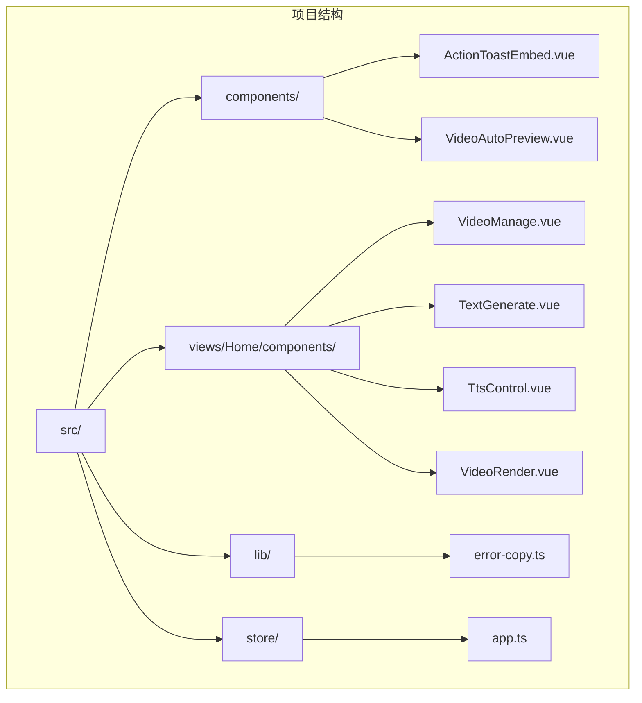
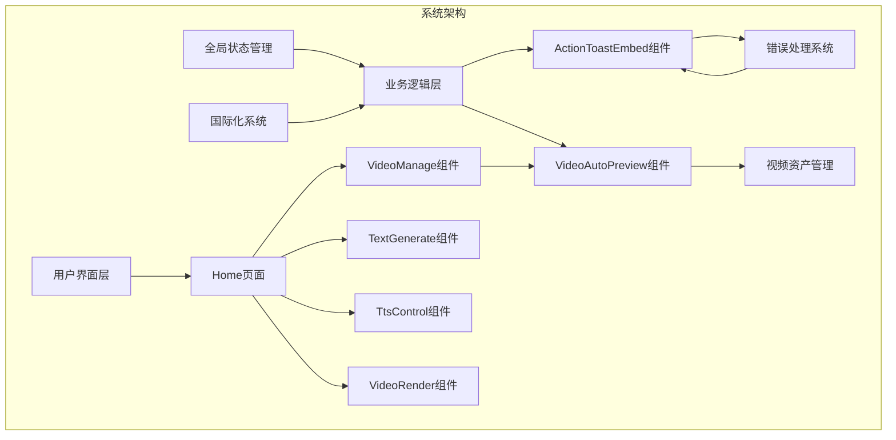
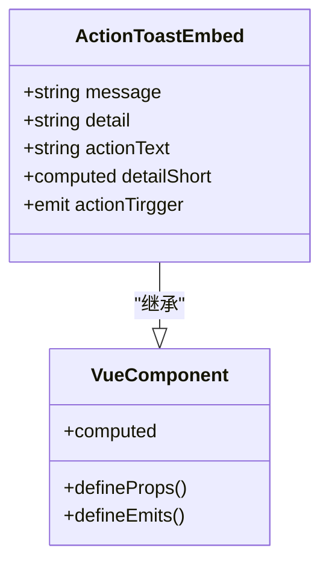
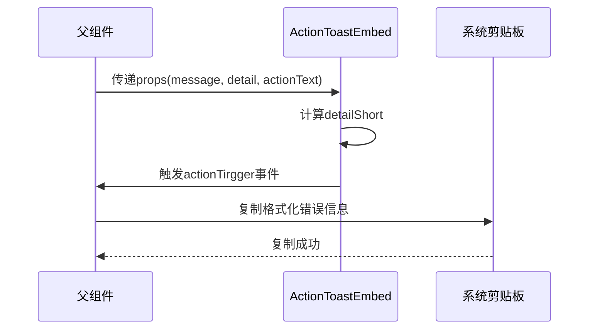
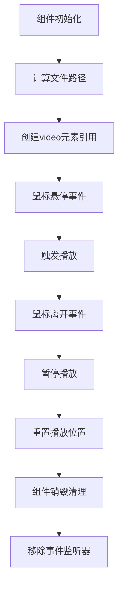
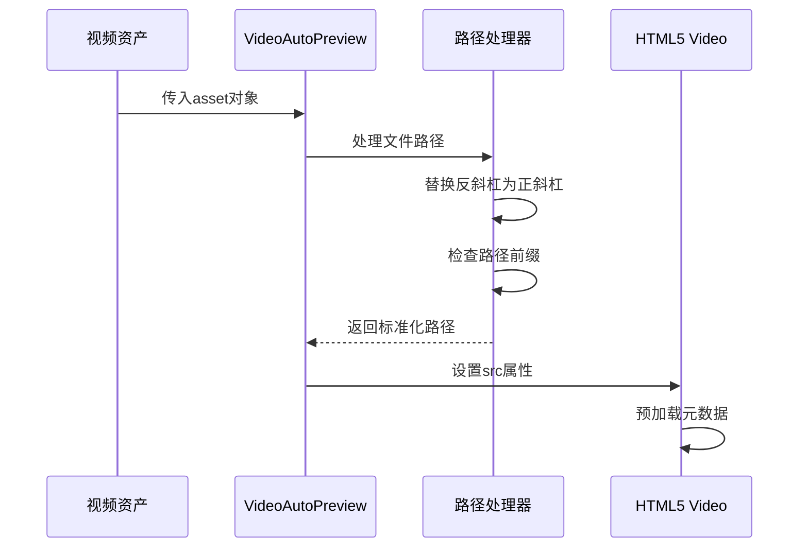
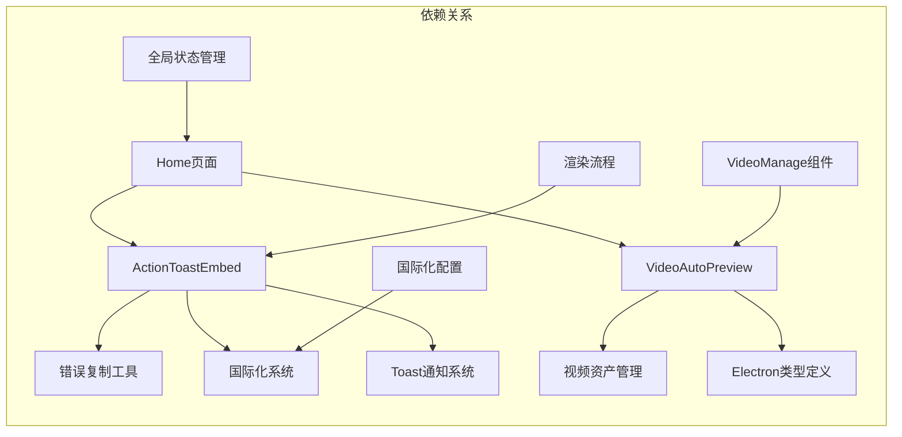

# 通用工具组件

<cite>
**本文档引用的文件**
- [ActionToastEmbed.vue](file://src/components/ActionToastEmbed.vue)
- [VideoAutoPreview.vue](file://src/components/VideoAutoPreview.vue)
- [error-copy.ts](file://src/lib/error-copy.ts)
- [index.vue](file://src/views/Home/index.vue)
- [VideoManage.vue](file://src/views/Home/components/VideoManage.vue)
- [app.ts](file://src/store/app.ts)
- [package.json](file://package.json)
</cite>

## 目录
1. [简介](#简介)
2. [项目结构](#项目结构)
3. [核心组件](#核心组件)
4. [架构概览](#架构概览)
5. [详细组件分析](#详细组件分析)
6. [依赖关系分析](#依赖关系分析)
7. [性能考虑](#性能考虑)
8. [故障排除指南](#故障排除指南)
9. [结论](#结论)
10. [附录](#附录)

## 简介

本文档详细介绍短视频工厂项目中的两个重要通用工具组件：ActionToastEmbed动作提示组件和VideoAutoPreview视频自动预览组件。这两个组件在整体UI架构中发挥着关键作用，提供了统一的消息展示、操作按钮集成和视频预览功能，显著提升了用户体验和开发效率。

项目采用Vue 3 + TypeScript + Vite构建，集成了AI驱动的短视频制作功能，包括文案生成、语音合成、视频剪辑等核心特性。两个工具组件的设计理念体现了现代前端开发的最佳实践，注重可复用性、可扩展性和用户体验优化。

## 项目结构

项目采用模块化的组织方式，核心组件位于`src/components/`目录下，业务逻辑组件位于`src/views/Home/components/`目录下，工具函数位于`src/lib/`目录下。



**图表来源**
- [ActionToastEmbed.vue:1-36](file://src/components/ActionToastEmbed.vue#L1-L36)
- [VideoAutoPreview.vue:1-42](file://src/components/VideoAutoPreview.vue#L1-L42)
- [VideoManage.vue:1-394](file://src/views/Home/components/VideoManage.vue#L1-L394)

**章节来源**
- [package.json:1-85](file://package.json#L1-L85)

## 核心组件

### ActionToastEmbed组件

ActionToastEmbed是一个专门用于错误消息展示的Vue组件，提供了简洁而功能丰富的用户界面。该组件的核心设计理念是将错误信息、详细描述和操作按钮有机结合，为用户提供清晰的问题诊断和解决方案入口。

组件的主要特性包括：
- 自动截断长文本，保持界面整洁
- 集成操作按钮，支持一键复制错误详情
- 响应式设计，适配不同屏幕尺寸
- 内置动画效果，提升用户体验

### VideoAutoPreview组件

VideoAutoPreview组件专注于视频素材的实时预览功能，通过鼠标悬停触发视频播放，为用户提供直观的素材浏览体验。该组件实现了高效的资源管理和播放控制机制。

组件的核心功能：
- 自动播放控制，鼠标悬停时播放，离开时暂停
- 缩略图生成，基于视频元数据创建预览
- 播放状态管理，精确控制播放进度
- 跨平台兼容，支持多种操作系统

**章节来源**
- [ActionToastEmbed.vue:1-36](file://src/components/ActionToastEmbed.vue#L1-L36)
- [VideoAutoPreview.vue:1-42](file://src/components/VideoAutoPreview.vue#L1-L42)

## 架构概览

两个组件在整个系统架构中扮演着重要的桥梁角色，连接了业务逻辑层和用户界面层。



**图表来源**
- [index.vue:1-313](file://src/views/Home/index.vue#L1-L313)
- [VideoManage.vue:1-394](file://src/views/Home/components/VideoManage.vue#L1-L394)
- [app.ts:1-147](file://src/store/app.ts#L1-L147)

## 详细组件分析

### ActionToastEmbed组件深度解析

ActionToastEmbed组件采用了简洁而高效的设计模式，通过响应式计算属性和事件发射机制实现了灵活的消息展示功能。

#### 组件结构分析



**图表来源**
- [ActionToastEmbed.vue:16-31](file://src/components/ActionToastEmbed.vue#L16-L31)

#### 数据流分析

组件的数据流遵循单向数据绑定原则，从父组件传递props到子组件，通过计算属性进行数据处理，最终渲染到模板中。



**图表来源**
- [ActionToastEmbed.vue:25-30](file://src/components/ActionToastEmbed.vue#L25-L30)
- [index.vue:122-136](file://src/views/Home/index.vue#L122-L136)

#### 错误详情复制功能实现

组件集成了完整的错误信息格式化和复制功能，通过专用的工具函数确保错误信息的一致性和可读性。

**章节来源**
- [ActionToastEmbed.vue:1-36](file://src/components/ActionToastEmbed.vue#L1-L36)
- [index.vue:118-140](file://src/views/Home/index.vue#L118-L140)

### VideoAutoPreview组件深度解析

VideoAutoPreview组件展现了现代前端开发中视频处理的最佳实践，通过原生HTML5视频API实现了高效的媒体播放控制。

#### 技术架构分析



**图表来源**
- [VideoAutoPreview.vue:23-36](file://src/components/VideoAutoPreview.vue#L23-L36)

#### 跨平台路径处理机制

组件实现了智能的文件路径规范化处理，确保在不同操作系统环境下都能正确加载视频资源。



**图表来源**
- [VideoAutoPreview.vue:23-26](file://src/components/VideoAutoPreview.vue#L23-L26)

#### 性能优化策略

组件采用了多项性能优化措施，包括预加载策略、事件监听器管理、内存清理等，确保长时间使用下的稳定性。

**章节来源**
- [VideoAutoPreview.vue:1-42](file://src/components/VideoAutoPreview.vue#L1-L42)
- [VideoManage.vue:34-35](file://src/views/Home/components/VideoManage.vue#L34-L35)

## 依赖关系分析

两个组件在项目中形成了紧密的协作关系，共同服务于视频资产管理系统的各个层面。



**图表来源**
- [index.vue:48-50](file://src/views/Home/index.vue#L48-L50)
- [VideoManage.vue:105-108](file://src/views/Home/components/VideoManage.vue#L105-L108)
- [error-copy.ts:1-17](file://src/lib/error-copy.ts#L1-L17)

### 组件间交互模式

系统采用了事件驱动的交互模式，通过Vue的事件系统实现了松耦合的组件通信。

**章节来源**
- [index.vue:118-140](file://src/views/Home/index.vue#L118-L140)
- [VideoManage.vue:159-176](file://src/views/Home/components/VideoManage.vue#L159-L176)

## 性能考虑

### ActionToastEmbed组件性能优化

- **计算属性缓存**：使用Vue的computed属性自动缓存计算结果，避免重复计算
- **条件渲染**：根据内容长度动态决定是否显示操作按钮，减少DOM节点数量
- **事件节流**：通过事件委托机制减少事件监听器数量

### VideoAutoPreview组件性能优化

- **懒加载策略**：只在需要时创建和销毁video元素
- **内存管理**：组件销毁时自动清理事件监听器和定时器
- **资源复用**：通过引用共享避免重复创建相同的DOM元素

## 故障排除指南

### ActionToastEmbed常见问题

**问题1：操作按钮不显示**
- 检查detail属性是否为空或undefined
- 确认actionText是否正确传递
- 验证父组件的事件处理函数是否正确绑定

**问题2：错误信息格式化异常**
- 检查formatErrorForCopy函数的输入参数
- 确认JSON序列化过程是否正常
- 验证navigator.clipboard API的可用性

### VideoAutoPreview常见问题

**问题1：视频无法播放**
- 检查文件路径是否正确规范化
- 确认视频文件格式是否受支持
- 验证Electron环境的媒体支持能力

**问题2：播放控制失效**
- 检查video元素引用是否正确设置
- 确认事件监听器是否正确绑定
- 验证浏览器的自动播放策略

**章节来源**
- [error-copy.ts:13-17](file://src/lib/error-copy.ts#L13-L17)
- [VideoAutoPreview.vue:28-36](file://src/components/VideoAutoPreview.vue#L28-L36)

## 结论

ActionToastEmbed和VideoAutoPreview两个组件代表了现代前端开发中工具组件设计的优秀实践。它们不仅解决了具体的业务需求，更重要的是为整个项目提供了可复用、可扩展的基础能力。

这两个组件的价值体现在：

1. **统一的用户体验**：通过一致的设计语言和交互模式提升用户满意度
2. **高效的开发效率**：减少重复代码，加速功能开发周期
3. **强大的可扩展性**：清晰的接口设计便于功能扩展和定制
4. **优秀的性能表现**：经过精心优化，确保在各种场景下的稳定运行

随着项目的不断发展，这两个组件将继续发挥重要作用，为更多功能模块提供基础支撑。

## 附录

### 组件使用示例

#### ActionToastEmbed组件使用模式

```typescript
// 基础使用
<template>
  <ActionToastEmbed 
    :message="errorMessage"
    :detail="errorDetail"
    :actionText="copyButtonText"
    @actionTirgger="handleCopyError"
  />
</template>

// 在业务逻辑中集成
const handleCopyError = async () => {
  try {
    await copyErrorToClipboard(message, detail)
    toast.success('复制成功')
  } catch (error) {
    toast.error('复制失败')
  }
}
```

#### VideoAutoPreview组件使用模式

```typescript
// 在素材列表中使用
<div v-for="asset in videoAssets" :key="asset.id">
  <VideoAutoPreview :asset="asset" />
</div>

// 自定义样式覆盖
<VideoAutoPreview 
  :asset="asset" 
  class="custom-preview-style"
/>
```

### 最佳实践建议

1. **组件组合**：将ActionToastEmbed与Toast通知系统结合使用，提供完整的错误处理体验
2. **样式定制**：通过CSS变量和类名覆盖实现组件样式的灵活定制
3. **事件处理**：建立统一的事件处理机制，确保组件间的协调工作
4. **性能监控**：定期检查组件的性能表现，及时发现和解决潜在问题

### 二次开发指导

对于希望扩展这两个组件功能的开发者，建议遵循以下指导原则：

1. **保持接口兼容性**：新增功能时确保现有props和事件的向后兼容
2. **遵循设计规范**：保持组件风格与项目整体UI设计的一致性
3. **文档同步更新**：修改代码时同步更新相关文档和注释
4. **测试覆盖完善**：为新功能编写充分的单元测试和集成测试