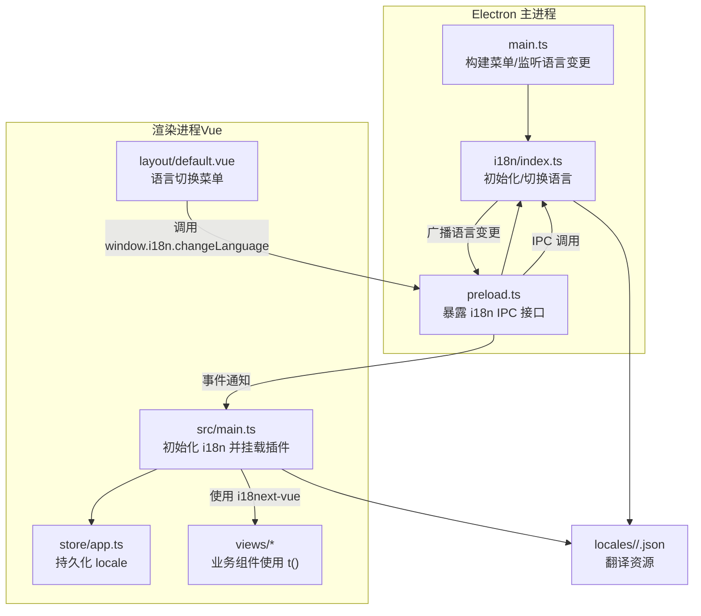
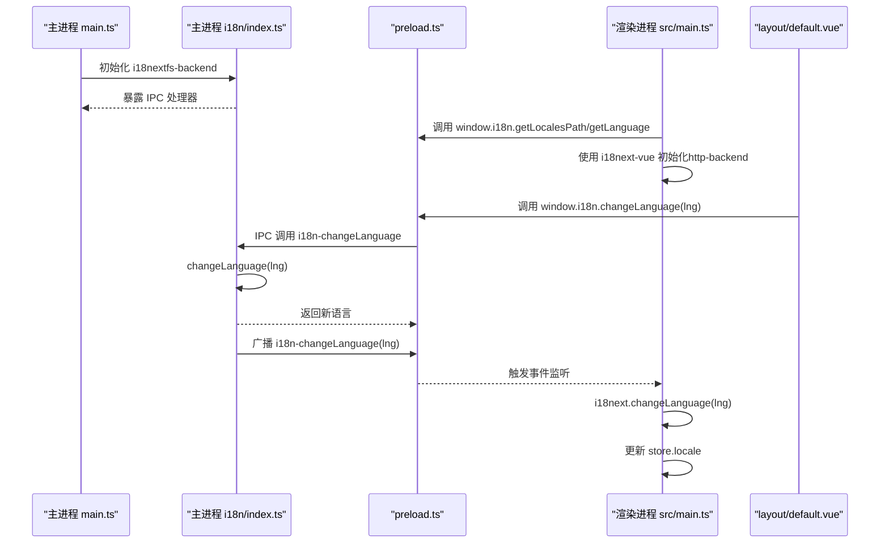
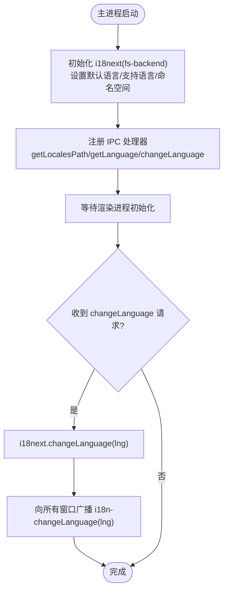
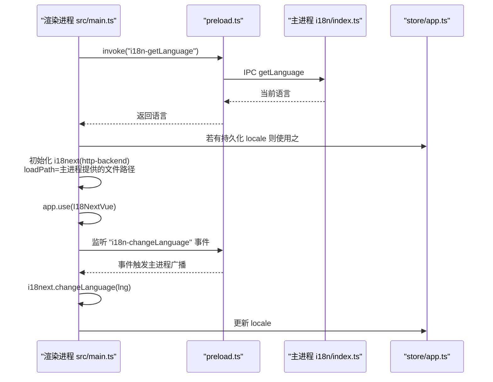
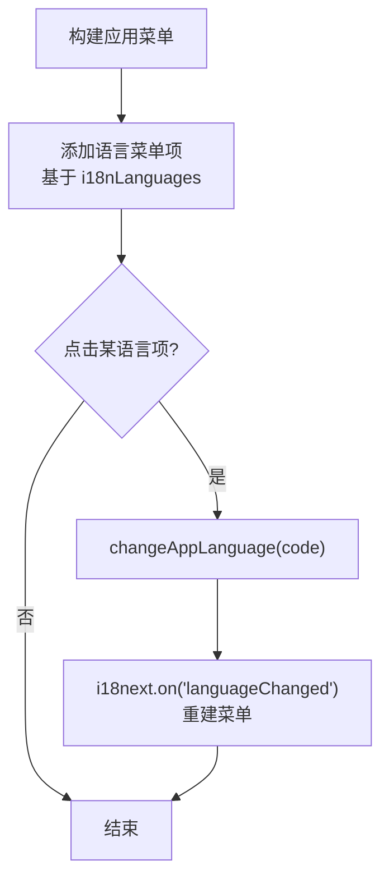
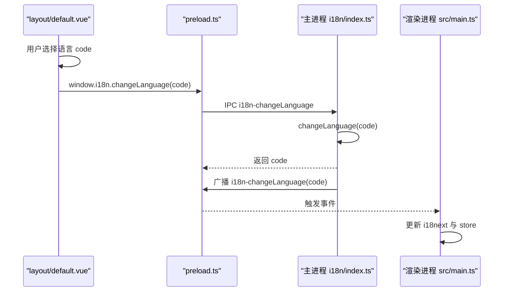
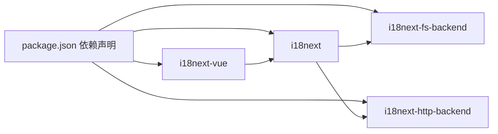

# 国际化系统

<cite>
**本文引用的文件**
- [electron/i18n/index.ts](file://electron/i18n/index.ts)
- [electron/i18n/common-options.ts](file://electron/i18n/common-options.ts)
- [src/lib/i18n.ts](file://src/lib/i18n.ts)
- [electron/main.ts](file://electron/main.ts)
- [electron/preload.ts](file://electron/preload.ts)
- [src/main.ts](file://src/main.ts)
- [src/store/app.ts](file://src/store/app.ts)
- [src/layout/default.vue](file://src/layout/default.vue)
- [src/views/Home/components/TextGenerate.vue](file://src/views/Home/components/TextGenerate.vue)
- [locales/en/common.json](file://locales/en/common.json)
- [locales/zh-CN/common.json](file://locales/zh-CN/common.json)
- [package.json](file://package.json)
</cite>

## 目录
1. [简介](#简介)
2. [项目结构](#项目结构)
3. [核心组件](#核心组件)
4. [架构总览](#架构总览)
5. [详细组件分析](#详细组件分析)
6. [依赖关系分析](#依赖关系分析)
7. [性能考量](#性能考量)
8. [故障排查指南](#故障排查指南)
9. [结论](#结论)
10. [附录](#附录)

## 简介
本文件面向短视频工厂的国际化系统，系统采用 Electron 主进程 + Vue 前端的双端 i18n 架构，基于 i18next 实现，结合 i18next-fs-backend（主进程）与 i18next-http-backend（渲染进程），通过 IPC 在主进程与渲染进程之间同步语言状态，实现动态语言切换与菜单国际化。翻译资源集中于 locales 目录，按语言与命名空间组织；前端通过 i18next-vue 提供模板与逻辑层的翻译能力。

## 项目结构
国际化相关的关键目录与文件如下：
- electron/i18n：主进程 i18n 初始化与语言切换逻辑
- src/lib/i18n.ts：渲染进程 i18n 初始化与与主进程通信
- locales/<lang>/<namespace>.json：翻译资源文件
- src/layout/default.vue：前端语言切换入口（菜单）
- electron/main.ts：构建应用菜单并监听语言变更
- electron/preload.ts：通过 contextBridge 暴露出 i18n 的 IPC 接口
- src/store/app.ts：持久化的区域设置（locale）

图表来源
- [electron/main.ts:78-164](file://electron/main.ts#L78-L164)
- [electron/i18n/index.ts:13-42](file://electron/i18n/index.ts#L13-L42)
- [electron/preload.ts:43-47](file://electron/preload.ts#L43-L47)
- [src/main.ts:47-61](file://src/main.ts#L47-L61)
- [src/store/app.ts:15-113](file://src/store/app.ts#L15-L113)
- [src/layout/default.vue:49-84](file://src/layout/default.vue#L49-L84)
- [locales/en/common.json:1-178](file://locales/en/common.json#L1-178)
- [locales/zh-CN/common.json:1-178](file://locales/zh-CN/common.json#L1-178)

章节来源
- [electron/main.ts:78-164](file://electron/main.ts#L78-L164)
- [electron/i18n/index.ts:13-42](file://electron/i18n/index.ts#L13-L42)
- [electron/preload.ts:43-47](file://electron/preload.ts#L43-L47)
- [src/main.ts:47-61](file://src/main.ts#L47-L61)
- [src/store/app.ts:15-113](file://src/store/app.ts#L15-L113)
- [src/layout/default.vue:49-84](file://src/layout/default.vue#L49-L84)
- [locales/en/common.json:1-178](file://locales/en/common.json#L1-178)
- [locales/zh-CN/common.json:1-178](file://locales/zh-CN/common.json#L1-178)

## 核心组件
- 主进程 i18n 初始化与切换
  - 初始化：加载 fs-backend，设置默认语言、支持语言集、命名空间等
  - 切换：通过 changeLanguage 更新语言，广播给所有窗口
- 渲染进程 i18n 初始化
  - 优先使用 store 中持久化的 locale；否则回退到主进程语言
  - 使用 http-backend 从主进程提供的文件路径加载翻译
- IPC 桥接
  - preload 暴露 getLocalesPath/getLanguage/changeLanguage
- 应用菜单与语言菜单
  - 主进程根据当前语言构建语言菜单，点击触发切换
- 前端语言切换 UI
  - layout/default.vue 提供下拉菜单，调用 window.i18n.changeLanguage
- 翻译资源
  - locales/<lang>/<ns>.json，当前仅使用 common 命名空间

章节来源
- [electron/i18n/index.ts:13-42](file://electron/i18n/index.ts#L13-L42)
- [electron/i18n/common-options.ts:3-15](file://electron/i18n/common-options.ts#L3-L15)
- [src/lib/i18n.ts:7-23](file://src/lib/i18n.ts#L7-L23)
- [electron/preload.ts:43-47](file://electron/preload.ts#L43-L47)
- [electron/main.ts:105-115](file://electron/main.ts#L105-L115)
- [src/layout/default.vue:64-69](file://src/layout/default.vue#L64-L69)
- [locales/en/common.json:1-178](file://locales/en/common.json#L1-178)
- [locales/zh-CN/common.json:1-178](file://locales/zh-CN/common.json#L1-178)

## 架构总览
整体流程：主进程启动时初始化 i18next，注册 IPC；渲染进程启动时根据 store 或主进程语言初始化 i18next-http-backend；用户在前端菜单选择语言，通过 IPC 通知主进程切换，主进程广播语言变更，渲染进程更新本地语言并持久化。

图表来源
- [electron/main.ts:187-195](file://electron/main.ts#L187-L195)
- [electron/i18n/index.ts:25-34](file://electron/i18n/index.ts#L25-L34)
- [electron/preload.ts:43-47](file://electron/preload.ts#L43-L47)
- [src/main.ts:47-61](file://src/main.ts#L47-L61)
- [src/layout/default.vue:64-69](file://src/layout/default.vue#L64-L69)

## 详细组件分析

### 主进程 i18n 初始化与切换
- 初始化要点
  - 使用 fs-backend，从 APP_ROOT 下的 locales 目录加载翻译
  - 默认语言来自系统语言（getLocale）
  - 支持语言与命名空间由公共配置提供
- 语言切换
  - changeAppLanguage 调用 i18next.changeLanguage，然后向所有窗口广播事件
- IPC 暴露
  - 提供 getLocalesPath、getLanguage、changeLanguage 三个处理器

图表来源
- [electron/i18n/index.ts:13-42](file://electron/i18n/index.ts#L13-L42)

章节来源
- [electron/i18n/index.ts:13-42](file://electron/i18n/index.ts#L13-L42)
- [electron/i18n/common-options.ts:3-15](file://electron/i18n/common-options.ts#L3-L15)

### 渲染进程 i18n 初始化与与主进程通信
- 初始化策略
  - 若 store 中已有 locale，则直接切换到该语言
  - 否则从主进程查询当前语言作为回退
  - 使用 http-backend，loadPath 指向主进程提供的文件系统路径前缀
- 插件集成
  - 使用 i18next-vue，在模板中通过 t() 访问翻译
- 事件监听
  - 监听主进程广播的语言变更事件，更新 i18next 与 store

图表来源
- [src/lib/i18n.ts:7-23](file://src/lib/i18n.ts#L7-L23)
- [src/main.ts:47-61](file://src/main.ts#L47-L61)
- [src/store/app.ts:15-113](file://src/store/app.ts#L15-L113)
- [electron/preload.ts:43-47](file://electron/preload.ts#L43-L47)

章节来源
- [src/lib/i18n.ts:7-23](file://src/lib/i18n.ts#L7-L23)
- [src/main.ts:47-61](file://src/main.ts#L47-L61)
- [src/store/app.ts:15-113](file://src/store/app.ts#L15-L113)
- [electron/preload.ts:43-47](file://electron/preload.ts#L43-L47)

### 应用菜单与语言菜单
- 主进程在构建菜单时，将“语言”项设为单选菜单，项名为各语言的显示名称，勾选状态反映当前语言
- 点击某语言项即调用 changeAppLanguage 切换语言并重建菜单

图表来源
- [electron/main.ts:105-115](file://electron/main.ts#L105-L115)
- [electron/main.ts:193-195](file://electron/main.ts#L193-L195)
- [electron/i18n/common-options.ts:3-6](file://electron/i18n/common-options.ts#L3-L6)

章节来源
- [electron/main.ts:105-115](file://electron/main.ts#L105-L115)
- [electron/main.ts:193-195](file://electron/main.ts#L193-L195)
- [electron/i18n/common-options.ts:3-6](file://electron/i18n/common-options.ts#L3-L6)

### 前端语言切换 UI 与交互
- UI 组件提供语言选择下拉菜单，激活值绑定当前语言
- 选择后调用 window.i18n.changeLanguage，触发 IPC 切换流程

图表来源
- [src/layout/default.vue:64-69](file://src/layout/default.vue#L64-L69)
- [electron/preload.ts:43-47](file://electron/preload.ts#L43-L47)
- [electron/i18n/index.ts:31-34](file://electron/i18n/index.ts#L31-L34)

章节来源
- [src/layout/default.vue:64-69](file://src/layout/default.vue#L64-L69)
- [electron/preload.ts:43-47](file://electron/preload.ts#L43-L47)
- [electron/i18n/index.ts:31-34](file://electron/i18n/index.ts#L31-L34)

### 翻译资源组织与命名规范
- 结构
  - locales/<语言>/<命名空间>.json
  - 当前仅使用 common 命名空间
- 命名规范建议
  - 采用层级式点号命名，如 features.llm.config.promptLabel
  - 分类清晰：app、menu、common、features.*、dialogs、footer 等
  - 前端模板中统一使用 t('...') 访问
- 示例来源
  - 英文与中文资源均包含 app、menu、common、features.* 等键树

章节来源
- [locales/en/common.json:1-178](file://locales/en/common.json#L1-178)
- [locales/zh-CN/common.json:1-178](file://locales/zh-CN/common.json#L1-178)

### Vue 组件中的翻译使用
- 模板中使用 t('...') 显示文案
- 逻辑中使用 t(...) 进行提示与错误信息展示
- 示例覆盖了 LLM 配置、按钮、对话框标题、状态与错误信息等

章节来源
- [src/layout/default.vue:49-84](file://src/layout/default.vue#L49-L84)
- [src/views/Home/components/TextGenerate.vue:1-200](file://src/views/Home/components/TextGenerate.vue#L1-L200)

## 依赖关系分析
- 主进程依赖
  - i18next、i18next-fs-backend、Electron IPC 与 BrowserWindow
- 渲染进程依赖
  - i18next、i18next-http-backend、i18next-vue、Pinia store
- 关键依赖版本
  - i18next、i18next-fs-backend、i18next-http-backend、i18next-vue

图表来源
- [package.json:22-63](file://package.json#L22-L63)

章节来源
- [package.json:22-63](file://package.json#L22-L63)

## 性能考量
- 加载策略
  - 主进程使用 fs-backend，按需加载当前语言文件，减少初始开销
  - 渲染进程使用 http-backend，通过主进程提供的文件路径访问，避免网络请求复杂度
- 缓存与回退
  - 支持语言列表与默认语言在公共配置中集中管理，便于缓存与一致性
- 事件驱动更新
  - 语言切换通过事件广播，避免重复初始化与全局刷新
- 建议
  - 可考虑在渲染进程启用命名空间级别的按需加载，进一步降低首屏翻译体积
  - 对高频使用的键进行本地缓存或预热，减少重复查找

[本节为通用性能建议，无需特定文件引用]

## 故障排查指南
- 无法切换语言
  - 检查主进程是否正确注册 IPC 处理器与广播事件
  - 检查 preload 是否正确暴露 window.i18n 接口
  - 检查渲染进程是否监听到 i18n-changeLanguage 事件并更新 i18next 与 store
- 翻译缺失或显示占位
  - 确认 locales 目录下对应语言与命名空间的 JSON 文件存在且键名匹配
  - 确认命名空间与默认命名空间一致（当前为 common）
- 菜单语言未更新
  - 检查主进程是否在 languageChanged 事件后重建菜单
  - 检查语言菜单项的勾选状态逻辑

章节来源
- [electron/i18n/index.ts:25-34](file://electron/i18n/index.ts#L25-L34)
- [electron/preload.ts:43-47](file://electron/preload.ts#L43-L47)
- [src/main.ts:55-59](file://src/main.ts#L55-L59)
- [electron/main.ts:193-195](file://electron/main.ts#L193-L195)
- [locales/en/common.json:1-178](file://locales/en/common.json#L1-178)
- [locales/zh-CN/common.json:1-178](file://locales/zh-CN/common.json#L1-178)

## 结论
该国际化系统通过主进程与渲染进程的协同，实现了稳定的多语言支持与动态切换。主进程负责语言初始化与切换广播，渲染进程负责 UI 层面的翻译与持久化。当前仅使用 common 命名空间，结构清晰、易于扩展。后续可在命名空间与缓存策略上进一步优化，以提升性能与可维护性。

[本节为总结性内容，无需特定文件引用]

## 附录

### 新增语言支持开发指南
- 步骤
  - 在 locales 目录新增语言代码子目录（如 fr、de）
  - 在该目录下创建 common.json，复制现有键树并填入目标语言翻译
  - 在公共配置中添加新语言条目（code 与 name）
  - 如需菜单显示新语言，确保主进程语言菜单构建逻辑可用
- 注意事项
  - 键名保持一致，避免 t('...') 查找不到
  - 验证主进程与渲染进程均可加载新语言文件
  - 如需更多命名空间，需同步更新公共配置与渲染进程初始化

章节来源
- [electron/i18n/common-options.ts:3-6](file://electron/i18n/common-options.ts#L3-L6)
- [locales/en/common.json:1-178](file://locales/en/common.json#L1-178)
- [locales/zh-CN/common.json:1-178](file://locales/zh-CN/common.json#L1-178)

### 翻译资源管理最佳实践
- 组织
  - 按功能模块拆分子命名空间（如 features.llm、features.tts），减少冲突与维护成本
- 命名
  - 采用语义化、层级化的键名，避免过深嵌套
- 统一
  - 在公共配置中集中管理支持语言与默认语言，保证主/渲染两端一致
- 版本
  - 为翻译文件增加版本号或时间戳，便于追踪与回滚

[本节为通用最佳实践，无需特定文件引用]