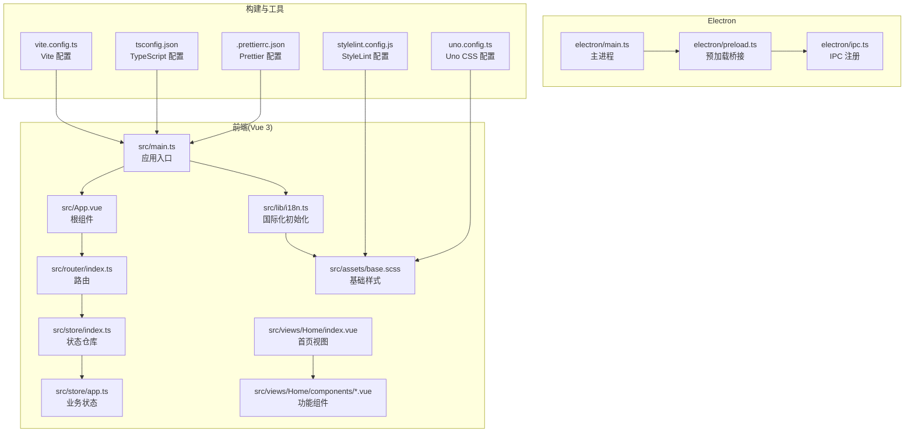
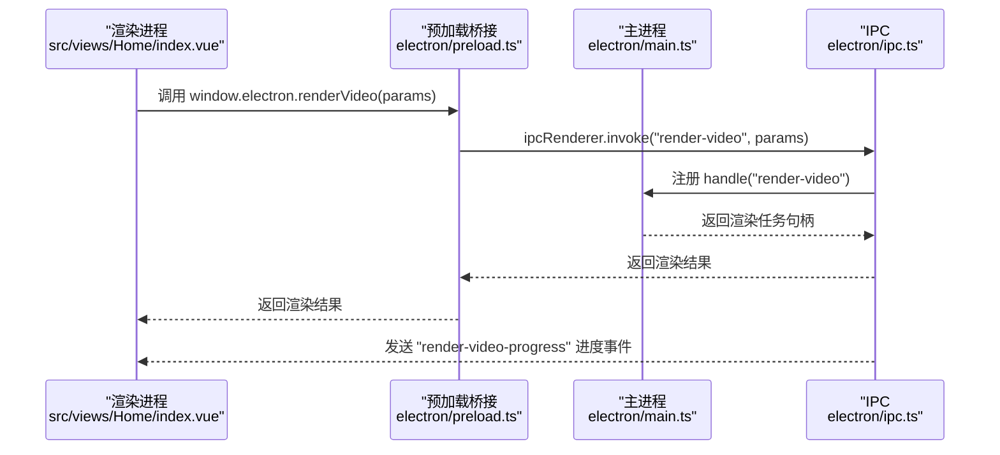
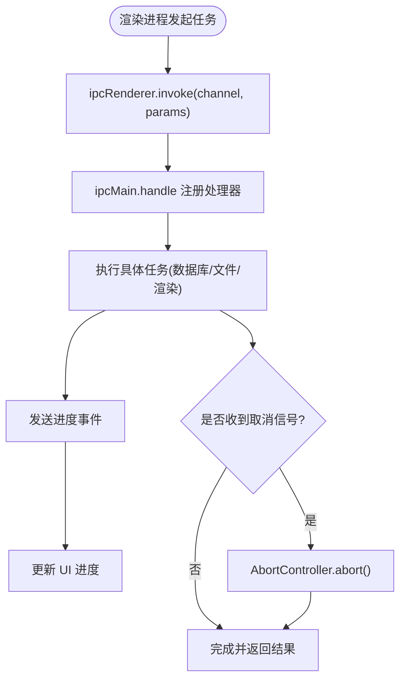
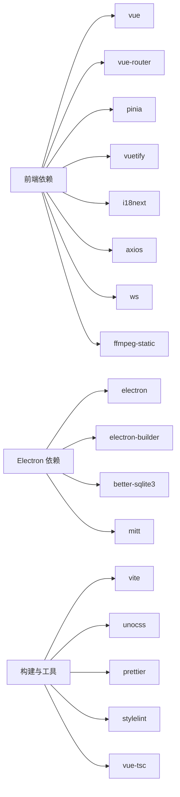

# 代码规范

<cite>
**本文引用的文件**
- [.prettierrc.json](file://.prettierrc.json)
- [stylelint.config.js](file://stylelint.config.js)
- [uno.config.ts](file://uno.config.ts)
- [tsconfig.json](file://tsconfig.json)
- [vite.config.ts](file://vite.config.ts)
- [package.json](file://package.json)
- [src/main.ts](file://src/main.ts)
- [src/App.vue](file://src/App.vue)
- [src/router/index.ts](file://src/router/index.ts)
- [src/store/index.ts](file://src/store/index.ts)
- [src/store/app.ts](file://src/store/app.ts)
- [src/views/Home/index.vue](file://src/views/Home/index.vue)
- [src/views/Home/components/TextGenerate.vue](file://src/views/Home/components/TextGenerate.vue)
- [src/lib/i18n.ts](file://src/lib/i18n.ts)
- [src/assets/base.scss](file://src/assets/base.scss)
- [electron/main.ts](file://electron/main.ts)
- [electron/preload.ts](file://electron/preload.ts)
- [electron/ipc.ts](file://electron/ipc.ts)
</cite>

## 目录
1. [引言](#引言)
2. [项目结构](#项目结构)
3. [核心组件](#核心组件)
4. [架构总览](#架构总览)
5. [详细组件分析](#详细组件分析)
6. [依赖分析](#依赖分析)
7. [性能考虑](#性能考虑)
8. [故障排查指南](#故障排查指南)
9. [结论](#结论)
10. [附录](#附录)

## 引言
本文件为“短视频工厂”项目的代码规范文档，面向前端、Electron 主/渲染进程与样式编写的团队协作与质量保障。内容覆盖 TypeScript 编码标准、Vue 3 组合式 API 最佳实践、Electron IPC 通信规范、CSS/SCSS 与 Uno CSS 使用规范，以及 Prettier、StyleLint 的配置与使用方法。文档同时提供正反面示例的路径指引，帮助开发者快速理解与遵循项目标准。

## 项目结构
项目采用 Vite + Vue 3 + Electron 的混合架构，前端位于 src 目录，Electron 主进程与预加载脚本位于 electron 目录；样式通过 Uno CSS 提供原子化能力，并结合 SCSS 基础样式。

**图表来源**
- [src/main.ts:1-62](file://src/main.ts#L1-L62)
- [src/App.vue:1-12](file://src/App.vue#L1-L12)
- [src/router/index.ts:1-22](file://src/router/index.ts#L1-L22)
- [src/store/index.ts:1-9](file://src/store/index.ts#L1-L9)
- [src/store/app.ts:1-114](file://src/store/app.ts#L1-L114)
- [src/views/Home/index.vue:1-244](file://src/views/Home/index.vue#L1-L244)
- [src/views/Home/components/TextGenerate.vue:1-272](file://src/views/Home/components/TextGenerate.vue#L1-L272)
- [src/lib/i18n.ts:1-28](file://src/lib/i18n.ts#L1-L28)
- [src/assets/base.scss:1-39](file://src/assets/base.scss#L1-L39)
- [electron/main.ts:1-204](file://electron/main.ts#L1-L204)
- [electron/preload.ts:1-75](file://electron/preload.ts#L1-L75)
- [electron/ipc.ts:1-188](file://electron/ipc.ts#L1-L188)
- [vite.config.ts:1-53](file://vite.config.ts#L1-L53)
- [tsconfig.json:1-32](file://tsconfig.json#L1-L32)
- [.prettierrc.json:1-7](file://.prettierrc.json#L1-L7)
- [stylelint.config.js:1-13](file://stylelint.config.js#L1-L13)
- [uno.config.ts:1-45](file://uno.config.ts#L1-L45)

**章节来源**
- [vite.config.ts:1-53](file://vite.config.ts#L1-L53)
- [tsconfig.json:1-32](file://tsconfig.json#L1-L32)

## 核心组件
- 应用入口与插件注册：在应用入口集中初始化 UI 框架、路由、状态、国际化与通知等插件，确保全局一致性与可维护性。
- 路由与布局：采用嵌套路由与默认布局，首页作为根路由子视图承载核心功能模块。
- 状态管理：基于 Pinia 的组合式 Store，集中管理渲染状态、LLM 配置、TTS 参数与导出配置。
- 国际化：前后端双通道，主进程提供系统语言与资源路径，渲染进程按需切换语言并持久化区域设置。
- 样式体系：基础 SCSS 与 Uno CSS 原子类并存，统一滚动条与字体等全局样式。

**章节来源**
- [src/main.ts:1-62](file://src/main.ts#L1-L62)
- [src/router/index.ts:1-22](file://src/router/index.ts#L1-L22)
- [src/store/index.ts:1-9](file://src/store/index.ts#L1-L9)
- [src/store/app.ts:1-114](file://src/store/app.ts#L1-L114)
- [src/lib/i18n.ts:1-28](file://src/lib/i18n.ts#L1-L28)
- [src/assets/base.scss:1-39](file://src/assets/base.scss#L1-L39)

## 架构总览
下图展示前端与 Electron 的交互关系：渲染进程通过预加载桥接调用主进程能力，主进程通过 IPC 注册处理函数，渲染进程订阅进度与状态事件。

**图表来源**
- [src/views/Home/index.vue:162-177](file://src/views/Home/index.vue#L162-L177)
- [electron/preload.ts:63](file://electron/preload.ts#L63)
- [electron/ipc.ts:171-186](file://electron/ipc.ts#L171-L186)
- [electron/main.ts:63-69](file://electron/main.ts#L63-L69)

## 详细组件分析

### TypeScript 编码标准
- 语言特性与严格性
  - 目标与模块：ES2020 与 ESNext，启用 bundler 模式解析，禁用 emit，开启严格模式与未使用检查。
  - 路径别名：@ 指向 src，~ 指向项目根，便于跨层引用。
- 命名约定
  - 接口与类型：使用名词短语或抽象描述，如 RenderVideoParams、EdgeTTSVoice。
  - 变量与函数：采用小驼峰，避免缩写；常量使用全大写加下划线。
  - 枚举：采用名词复数或状态描述，如 RenderStatus。
- 类型定义与模块导入
  - 明确导出类型与参数对象，避免在组件模板中直接使用复杂类型。
  - 导入优先使用相对路径与明确的模块边界，减少循环依赖。
- 错误处理与可选链
  - 对外部调用返回值进行健壮性判断，使用可选链与空值合并，避免运行时异常。

**章节来源**
- [tsconfig.json:1-32](file://tsconfig.json#L1-L32)
- [src/store/app.ts:5-13](file://src/store/app.ts#L5-L13)
- [src/views/Home/index.vue:41](file://src/views/Home/index.vue#L41)
- [electron/preload.ts:3-16](file://electron/preload.ts#L3-L16)

### Vue 3 组件开发规范
- 组合式 API 使用
  - 在 <script setup> 中集中声明响应式状态、计算属性与方法，保持模板简洁。
  - 使用 defineExpose 暴露必要的公共方法，供父组件通过 ref 调用。
- 响应式数据管理
  - 将跨组件共享的状态放入 Pinia Store，组件内部仅保留局部状态。
  - 使用 computed 与 ref 管理派生状态，避免重复计算。
- 组件通信模式
  - 父子通信：通过 props 传递只读数据，通过 emits 或回调函数回传变更。
  - 跨组件：通过 Pinia Store 或事件总线（mitt）解耦。
- 生命周期钩子最佳实践
  - 在 onMounted 中执行副作用初始化，在 onUnmounted 中清理定时器与监听。
  - 对外部资源（如流式生成）使用 AbortController 控制中断。
- 模板与样式
  - 使用 Uno CSS 原子类提升可读性与一致性；局部样式使用 scoped 并限制作用域。
  - 避免在模板中进行复杂逻辑，将逻辑前置到 script 中。

**章节来源**
- [src/views/Home/components/TextGenerate.vue:110-272](file://src/views/Home/components/TextGenerate.vue#L110-L272)
- [src/views/Home/index.vue:31-244](file://src/views/Home/index.vue#L31-L244)
- [src/store/app.ts:15-114](file://src/store/app.ts#L15-L114)

### Electron 主进程与渲染进程代码组织
- 主进程职责
  - 窗口创建与菜单构建、国际化初始化、SQLite 初始化、IPC 注册与事件分发。
  - 通过 commandLine 开关禁用安全策略以满足本地开发需求。
- 预加载桥接
  - 使用 contextBridge 暴露受控 API 到渲染进程，封装 ipcRenderer 方法，统一参数类型。
  - 将 Electron 原生能力（窗口控制、文件系统访问、TTS、FFmpeg 渲染）以类型安全的方式暴露。
- IPC 通信规范
  - 主进程使用 ipcMain.handle/on 注册异步/同步处理函数，渲染进程通过 ipcRenderer.invoke/send 调用。
  - 进度与状态通过事件通道实时反馈，支持取消信号（AbortController）中断长耗时任务。
- 模块划分标准
  - 将 SQLite、TTS、FFmpeg、统计埋点等功能拆分为独立模块，主进程仅负责编排与注册。

**图表来源**
- [electron/ipc.ts:171-186](file://electron/ipc.ts#L171-L186)
- [electron/preload.ts:63](file://electron/preload.ts#L63)
- [src/views/Home/index.vue:162-177](file://src/views/Home/index.vue#L162-L177)

**章节来源**
- [electron/main.ts:1-204](file://electron/main.ts#L1-L204)
- [electron/preload.ts:1-75](file://electron/preload.ts#L1-L75)
- [electron/ipc.ts:1-188](file://electron/ipc.ts#L1-L188)

### CSS/SCSS 与 Uno CSS 规范
- 原子化设计原则
  - 优先使用 Uno CSS 提供的原子类（如 flex、gap、border、rounded 等），减少自定义样式数量。
  - 自定义规则通过 shortcuts 与 rules 定义，保证命名一致与可复用。
- SCSS 基础样式
  - 在 base.scss 中统一字体、滚动条与全局背景，避免重复声明。
  - 局部组件样式使用 scoped，避免污染。
- At-rule 与规则
  - StyleLint 配置允许特定指令（如 @apply、@variants）与变体组，适配 Uno CSS 的使用场景。

**章节来源**
- [uno.config.ts:11-45](file://uno.config.ts#L11-L45)
- [src/assets/base.scss:1-39](file://src/assets/base.scss#L1-L39)
- [stylelint.config.js:1-13](file://stylelint.config.js#L1-L13)

### 代码格式化与校验工具
- Prettier
  - 配置项：不加分号、单引号、行长 100。
  - 使用命令：npm 脚本提供格式化入口，建议在提交前统一格式化。
- StyleLint
  - 配置项：忽略特定 at-rule，允许尾部分号与降序选择器警告为空。
  - 与 Uno CSS 协同：通过 transformer 支持变体组与指令，避免误报。
- TypeScript
  - 严格模式与未使用检查，确保类型安全与代码整洁。
- Vite 构建
  - 通过插件集成 Vue、DevTools、Uno CSS 与 Electron 插件，统一构建流程。

**章节来源**
- [.prettierrc.json:1-7](file://.prettierrc.json#L1-L7)
- [stylelint.config.js:1-13](file://stylelint.config.js#L1-L13)
- [tsconfig.json:16-23](file://tsconfig.json#L16-L23)
- [vite.config.ts:1-53](file://vite.config.ts#L1-L53)

## 依赖分析
- 前端依赖
  - Vue 3、Vue Router、Pinia、Vuetify、i18next、axios、ws、subtitle、music-metadata、ffmpeg-static 等。
- Electron 依赖
  - electron、electron-builder、mitt、better-sqlite3、ffmpeg-static 等。
- 构建与工具
  - vite、vite-plugin-electron、unocss、prettier、stylelint、vue-tsc 等。

**图表来源**
- [package.json:22-63](file://package.json#L22-L63)

**章节来源**
- [package.json:1-85](file://package.json#L1-L85)

## 性能考虑
- 渲染流程
  - 文案生成采用流式输出，避免一次性渲染导致卡顿；TTS 与视频片段获取阶段设置状态机，防止并发冲突。
- 文件操作
  - 选择文件夹与读取文件夹列表时进行权限与路径有效性检查，降低异常开销。
- 进度与取消
  - 通过 AbortController 与一次性事件实现可控的长任务中断，避免资源浪费。
- 样式体积
  - Uno CSS 原子类减少重复样式，结合按需引入与变体组，控制打包体积。

**章节来源**
- [src/views/Home/index.vue:123-177](file://src/views/Home/index.vue#L123-L177)
- [electron/ipc.ts:178-186](file://electron/ipc.ts#L178-L186)

## 故障排查指南
- 国际化问题
  - 若语言切换无效，检查主进程语言变更事件与渲染进程 i18n 初始化顺序。
- IPC 调用失败
  - 确认预加载桥接已正确暴露 API，主进程已注册对应 channel 的 handle/on。
- 渲染取消无效
  - 确保渲染进程中发送 cancel-render-video 事件，并在主进程侧正确绑定一次性监听。
- 样式异常
  - 检查 Uno CSS 配置与 StyleLint 规则，确认未被误报影响。

**章节来源**
- [src/lib/i18n.ts:7-23](file://src/lib/i18n.ts#L7-L23)
- [electron/preload.ts:43-65](file://electron/preload.ts#L43-L65)
- [electron/ipc.ts:181-186](file://electron/ipc.ts#L181-L186)
- [stylelint.config.js:1-13](file://stylelint.config.js#L1-L13)

## 结论
本规范文档从 TypeScript、Vue 3、Electron、样式与工具链五个维度，给出了短视频工厂项目的统一标准与最佳实践。建议团队在日常开发中严格遵循命名、类型、通信与样式规范，并配合 Prettier、StyleLint 与构建工具形成自动化质量保障闭环。

## 附录
- 正反面示例路径参考
  - 组合式 API 使用：[src/views/Home/components/TextGenerate.vue:132-193](file://src/views/Home/components/TextGenerate.vue#L132-L193)
  - 状态机与错误处理：[src/views/Home/index.vue:119-211](file://src/views/Home/index.vue#L119-L211)
  - 预加载桥接与类型安全：[electron/preload.ts:20-65](file://electron/preload.ts#L20-L65)
  - IPC 注册与进度回调：[electron/ipc.ts:171-186](file://electron/ipc.ts#L171-L186)
  - Uno CSS 原子类与规则：[uno.config.ts:17-32](file://uno.config.ts#L17-L32)
  - 基础 SCSS 与滚动条：[src/assets/base.scss:15-38](file://src/assets/base.scss#L15-L38)