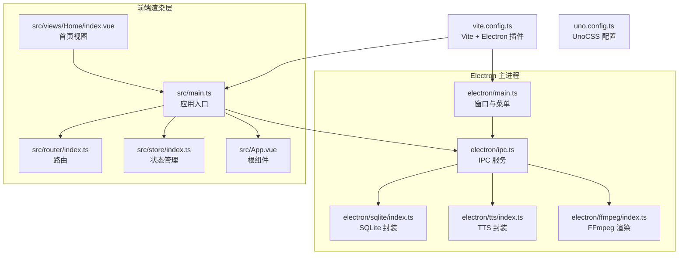
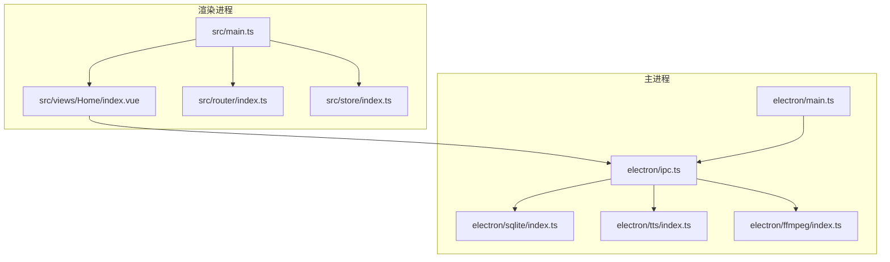
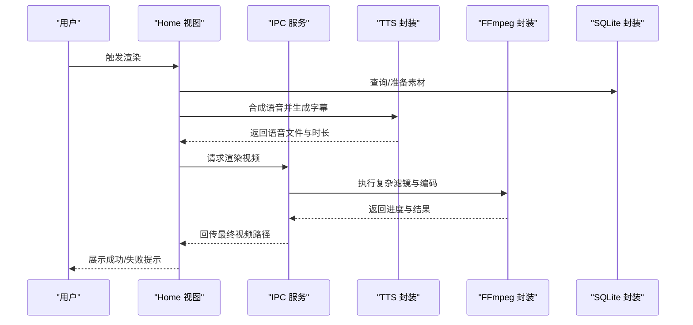
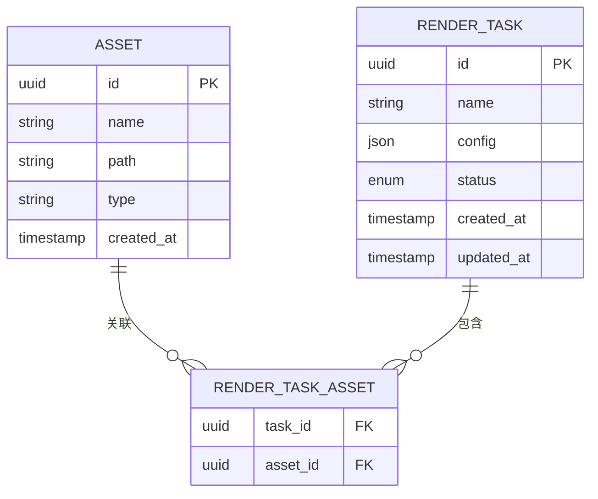
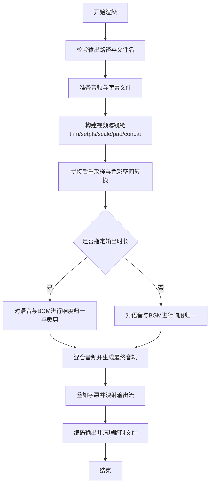
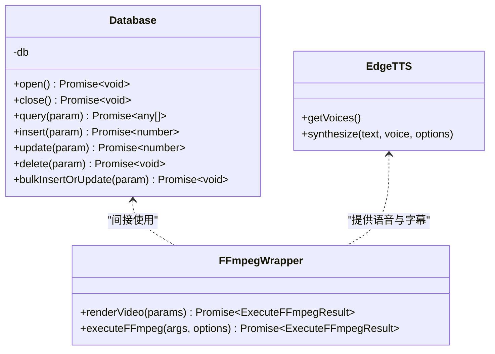
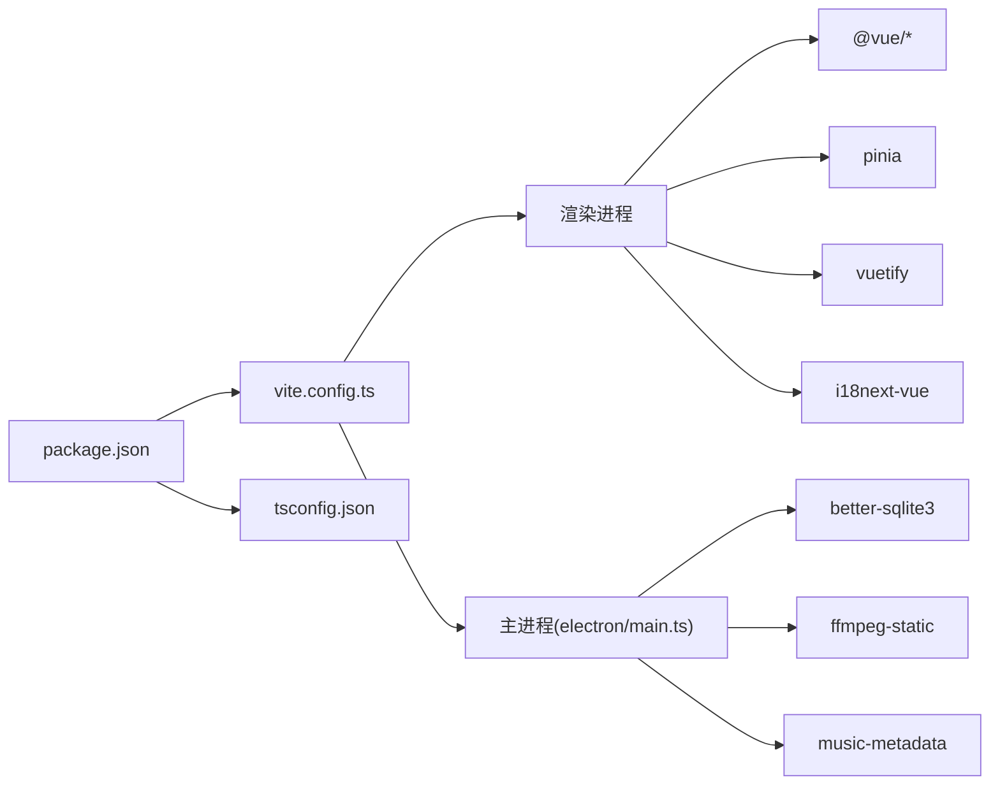

# 开发指南

<cite>
**本文引用的文件**
- [package.json](file://package.json)
- [README.md](file://README.md)
- [tsconfig.json](file://tsconfig.json)
- [vite.config.ts](file://vite.config.ts)
- [electron/main.ts](file://electron/main.ts)
- [src/main.ts](file://src/main.ts)
- [src/App.vue](file://src/App.vue)
- [src/router/index.ts](file://src/router/index.ts)
- [src/store/index.ts](file://src/store/index.ts)
- [electron/ipc.ts](file://electron/ipc.ts)
- [electron/sqlite/index.ts](file://electron/sqlite/index.ts)
- [electron/tts/index.ts](file://electron/tts/index.ts)
- [electron/ffmpeg/index.ts](file://electron/ffmpeg/index.ts)
- [src/views/Home/index.vue](file://src/views/Home/index.vue)
- [uno.config.ts](file://uno.config.ts)
</cite>

## 目录
1. [简介](#简介)
2. [项目结构](#项目结构)
3. [核心组件](#核心组件)
4. [架构总览](#架构总览)
5. [详细组件分析](#详细组件分析)
6. [依赖关系分析](#依赖关系分析)
7. [性能考量](#性能考量)
8. [故障排查指南](#故障排查指南)
9. [结论](#结论)
10. [附录](#附录)

## 简介
短视频工厂是一个基于 Vue 3 + Electron 的跨平台桌面应用，集成 AI 文案生成、语音合成（EdgeTTS）、视频剪辑与字幕合成、批量渲染等能力，提供“提示词 + 分镜素材”到成品短视频的一键自动化生产流程。项目采用 TypeScript、Vite、UnoCSS、Pinia、Vue Router、i18next 等现代前端技术栈，并通过 Electron 将渲染进程与原生能力打通。

## 项目结构
项目采用“前端渲染层 + Electron 主进程 + 原生能力封装”的分层组织方式：
- electron：主进程、IPC、SQLite、TTS、FFmpeg、国际化与工具库
- src：Vue 应用入口、路由、状态管理、视图与组件
- scripts：打包前/后置脚本与资源处理
- native：原生模块适配目录
- uno.config.ts：原子化 CSS 配置
- vite.config.ts：Vite + Electron 插件配置
- tsconfig.json：TypeScript 编译选项

图表来源
- [src/main.ts:1-62](file://src/main.ts#L1-L62)
- [src/router/index.ts:1-22](file://src/router/index.ts#L1-L22)
- [src/store/index.ts:1-9](file://src/store/index.ts#L1-L9)
- [src/views/Home/index.vue:1-244](file://src/views/Home/index.vue#L1-L244)
- [src/App.vue:1-12](file://src/App.vue#L1-L12)
- [vite.config.ts:1-53](file://vite.config.ts#L1-L53)
- [electron/main.ts:1-204](file://electron/main.ts#L1-L204)
- [electron/ipc.ts:1-188](file://electron/ipc.ts#L1-L188)
- [electron/sqlite/index.ts:1-154](file://electron/sqlite/index.ts#L1-L154)
- [electron/tts/index.ts:1-86](file://electron/tts/index.ts#L1-L86)
- [electron/ffmpeg/index.ts:1-272](file://electron/ffmpeg/index.ts#L1-L272)
- [uno.config.ts:1-45](file://uno.config.ts#L1-L45)

章节来源
- [package.json:1-85](file://package.json#L1-L85)
- [vite.config.ts:1-53](file://vite.config.ts#L1-L53)
- [tsconfig.json:1-32](file://tsconfig.json#L1-L32)

## 核心组件
- 应用入口与框架
  - 渲染进程入口：初始化 Vuetify、路由、状态、国际化、全局样式与 Toast 插件，挂载应用。
  - 主进程入口：创建窗口、构建菜单、初始化 SQLite、IPC、国际化与跨域/跨站 Cookie 支持。
- 路由与状态
  - 路由：使用 HashHistory，根路由指向默认布局，布局内嵌 Home 视图。
  - 状态：Pinia + 持久化插件，集中管理渲染状态、输出配置等。
- IPC 与原生能力
  - IPC：统一注册数据库、窗口控制、文件夹选择、语音合成、视频渲染等接口。
  - SQLite：封装 better-sqlite3，支持查询、增删改、批量插入/更新与外键约束。
  - TTS：基于 EdgeTTS，支持语音列表查询、合成到 Base64/文件、字幕生成与时长解析。
  - FFmpeg：封装复杂滤镜链与音频响度归一、混合、裁剪、拼接、字幕叠加、编码参数等。
- 视图与交互
  - Home 视图：三栏布局，左侧文案生成、中间素材管理、右侧 TTS 控制与渲染面板；协调各子组件完成一键渲染。

章节来源
- [src/main.ts:1-62](file://src/main.ts#L1-L62)
- [electron/main.ts:1-204](file://electron/main.ts#L1-L204)
- [src/router/index.ts:1-22](file://src/router/index.ts#L1-L22)
- [src/store/index.ts:1-9](file://src/store/index.ts#L1-L9)
- [electron/ipc.ts:1-188](file://electron/ipc.ts#L1-L188)
- [electron/sqlite/index.ts:1-154](file://electron/sqlite/index.ts#L1-L154)
- [electron/tts/index.ts:1-86](file://electron/tts/index.ts#L1-L86)
- [electron/ffmpeg/index.ts:1-272](file://electron/ffmpeg/index.ts#L1-L272)
- [src/views/Home/index.vue:1-244](file://src/views/Home/index.vue#L1-L244)

## 架构总览
应用采用“渲染进程 + 主进程 + 原生模块”的经典 Electron 架构。渲染进程负责 UI 与业务编排，主进程负责系统级能力（文件系统、窗口、菜单、统计上报）与 IPC 桥接，原生模块（better-sqlite3、ffmpeg-static）提供高性能数据存储与媒体处理。

图表来源
- [src/main.ts:1-62](file://src/main.ts#L1-L62)
- [src/views/Home/index.vue:1-244](file://src/views/Home/index.vue#L1-L244)
- [electron/main.ts:1-204](file://electron/main.ts#L1-L204)
- [electron/ipc.ts:1-188](file://electron/ipc.ts#L1-L188)
- [electron/sqlite/index.ts:1-154](file://electron/sqlite/index.ts#L1-L154)
- [electron/tts/index.ts:1-86](file://electron/tts/index.ts#L1-L86)
- [electron/ffmpeg/index.ts:1-272](file://electron/ffmpeg/index.ts#L1-L272)

## 详细组件分析

### 渲染流程与状态机
从文案生成到视频渲染的完整流程如下：

图表来源
- [src/views/Home/index.vue:61-212](file://src/views/Home/index.vue#L61-L212)
- [electron/ipc.ts:171-186](file://electron/ipc.ts#L171-L186)
- [electron/tts/index.ts:39-85](file://electron/tts/index.ts#L39-L85)
- [electron/ffmpeg/index.ts:26-186](file://electron/ffmpeg/index.ts#L26-L186)
- [electron/sqlite/index.ts:63-135](file://electron/sqlite/index.ts#L63-L135)

章节来源
- [src/views/Home/index.vue:1-244](file://src/views/Home/index.vue#L1-L244)
- [electron/ipc.ts:1-188](file://electron/ipc.ts#L1-L188)
- [electron/tts/index.ts:1-86](file://electron/tts/index.ts#L1-L86)
- [electron/ffmpeg/index.ts:1-272](file://electron/ffmpeg/index.ts#L1-L272)
- [electron/sqlite/index.ts:1-154](file://electron/sqlite/index.ts#L1-L154)

### SQLite 数据模型与事务
SQLite 封装提供基础 CRUD 与批量写入能力，并启用外键约束。以下 ER 图展示典型表关系（以抽象实体示意）：

图表来源
- [electron/sqlite/index.ts:63-135](file://electron/sqlite/index.ts#L63-L135)

章节来源
- [electron/sqlite/index.ts:1-154](file://electron/sqlite/index.ts#L1-L154)

### FFmpeg 渲染算法流程
渲染函数根据输入视频片段、语音与背景音乐，构建复杂滤镜链，进行裁剪、缩放、拼接、字幕叠加与音频响度归一化、混合，最后编码输出。

图表来源
- [electron/ffmpeg/index.ts:26-186](file://electron/ffmpeg/index.ts#L26-L186)

章节来源
- [electron/ffmpeg/index.ts:1-272](file://electron/ffmpeg/index.ts#L1-L272)

### 类与依赖关系（代码级）

图表来源
- [electron/sqlite/index.ts:38-135](file://electron/sqlite/index.ts#L38-L135)
- [electron/tts/index.ts:13-37](file://electron/tts/index.ts#L13-L37)
- [electron/ffmpeg/index.ts:26-244](file://electron/ffmpeg/index.ts#L26-L244)

章节来源
- [electron/sqlite/index.ts:1-154](file://electron/sqlite/index.ts#L1-L154)
- [electron/tts/index.ts:1-86](file://electron/tts/index.ts#L1-L86)
- [electron/ffmpeg/index.ts:1-272](file://electron/ffmpeg/index.ts#L1-L272)

## 依赖关系分析
- 构建与运行
  - Vite + Electron 插件：将主进程与渲染进程整合，主进程入口由 electron(main.entry) 指定，preload 由 input 指定，renderer 在非测试环境下启用 Node polyfill。
  - TypeScript：严格模式、未使用变量/参数检查、switch 穷举检查，路径别名 @ 与 ~。
  - 包管理：pnpm，限制构建依赖，要求 Node >= 22.17.0。
- 第三方库
  - 渲染层：Vue 3、Vue Router、Pinia、Vuetify、i18next、Vue DevTools 插件。
  - 原生层：better-sqlite3、ffmpeg-static、music-metadata、subtitle、ws。
  - 工具：mitt（事件总线）、random（随机）、UnoCSS（原子化 CSS）。

图表来源
- [package.json:1-85](file://package.json#L1-L85)
- [vite.config.ts:1-53](file://vite.config.ts#L1-L53)
- [tsconfig.json:1-32](file://tsconfig.json#L1-L32)

章节来源
- [package.json:1-85](file://package.json#L1-L85)
- [vite.config.ts:1-53](file://vite.config.ts#L1-L53)
- [tsconfig.json:1-32](file://tsconfig.json#L1-L32)

## 性能考量
- 渲染性能
  - FFmpeg 编码参数：使用 libx264 中等预设、CRF 23、AAC 128k、固定帧率 30、尺寸缩放与填充，兼顾质量与体积。
  - 音频响度归一：对语音与背景音乐分别进行 loudnorm，避免音量不均；必要时按目标时长裁剪，减少无效计算。
  - 进度上报：基于 FFmpeg stderr 解析时间戳，实时反馈进度，避免阻塞 UI。
- 存储与 I/O
  - better-sqlite3：外键开启、事务批量写入，降低磁盘写放大；临时文件在渲染完成后清理。
- 内存与并发
  - 渲染过程使用 AbortController 支持取消；UI 侧通过状态机避免并发冲突。
- 打包体积
  - Rollup chunkSizeWarningLimit 提升阈值，减少警告；外部化 better-sqlite3，避免重复打包。

章节来源
- [electron/ffmpeg/index.ts:141-164](file://electron/ffmpeg/index.ts#L141-L164)
- [electron/ffmpeg/index.ts:237-243](file://electron/ffmpeg/index.ts#L237-L243)
- [electron/sqlite/index.ts:112-135](file://electron/sqlite/index.ts#L112-L135)
- [vite.config.ts:48-51](file://vite.config.ts#L48-L51)

## 故障排查指南
- 启动与窗口
  - 窗口未显示：确认 ready-to-show 事件与最小宽高限制；检查 preload 路径与 Vite 构建产物。
  - 菜单语言切换：监听 i18next.languageChanged 并重建菜单。
- 文件与路径
  - 选择文件夹失败：回退策略依次尝试 downloads/desktop/documents/home/cwd；若均不可用，记录警告。
  - 列出文件夹：过滤仅文件条目，统一路径分隔符。
- SQLite
  - 连接失败：检查 userData 目录权限与 native binding 路径；确认 foreign_keys 已开启。
  - 批量写入：使用事务包裹，避免逐条提交带来的性能与一致性问题。
- TTS
  - 语音合成异常：检查 EdgeTTS 可用性、网络连通与语音列表；时长解析失败需检查 MIME 与缓冲区。
  - 临时文件清理：应用退出前清理当前会话的临时语音与字幕文件。
- FFmpeg
  - 找不到可执行文件：Windows 下验证可执行权限；非 Windows 平台检查 X_OK；开发/生产环境路径差异。
  - 渲染中断：通过 AbortController 发送 SIGTERM；渲染结束后清理临时文件。
- IPC 与跨域
  - 跨站携带 Cookie：启用跨站 Cookie 策略；禁用 CORS 与私有网络限制开关，便于本地调试。
- 日志与统计
  - 主进程消息：渲染器监听 did-finish-load 后接收消息；统计事件上报通过 IPC 调用。

章节来源
- [electron/main.ts:40-76](file://electron/main.ts#L40-L76)
- [electron/main.ts:193-196](file://electron/main.ts#L193-L196)
- [electron/ipc.ts:119-144](file://electron/ipc.ts#L119-L144)
- [electron/ipc.ts:146-155](file://electron/ipc.ts#L146-L155)
- [electron/sqlite/index.ts:38-61](file://electron/sqlite/index.ts#L38-L61)
- [electron/sqlite/index.ts:112-135](file://electron/sqlite/index.ts#L112-L135)
- [electron/tts/index.ts:31-33](file://electron/tts/index.ts#L31-L33)
- [electron/tts/index.ts:74-80](file://electron/tts/index.ts#L74-L80)
- [electron/ffmpeg/index.ts:246-259](file://electron/ffmpeg/index.ts#L246-L259)
- [electron/ffmpeg/index.ts:237-243](file://electron/ffmpeg/index.ts#L237-L243)
- [electron/main.ts:197-202](file://electron/main.ts#L197-L202)

## 结论
本项目以清晰的分层架构与完善的 IPC 能力，实现了从文案到视频的全链路自动化。通过严格的 TypeScript 配置、合理的 Electron 构建策略与原生模块封装，兼顾了开发体验与运行性能。建议后续在测试覆盖、国际化扩展与性能监控方面持续完善。

## 附录

### 代码规范与最佳实践
- TypeScript 编码标准
  - 严格模式与未使用检查：开启 strict、noUnusedLocals、noUnusedParameters、noFallthroughCasesInSwitch。
  - 路径别名：统一使用 @ 与 ~，提升可移植性。
  - 无副作用构建：隔离模块、bundler 模式、noEmit。
- Vue 组件开发规范
  - 组合式 API：优先使用 <script setup>；合理拆分小组件，职责单一。
  - 状态管理：Pinia 持久化插件用于关键配置；渲染状态机避免竞态。
  - 国际化：i18next-vue 统一接入；菜单与提示语均需可翻译。
- Electron 开发最佳实践
  - 主/渲染分离：敏感操作集中于主进程，IPC 作为桥接。
  - 资源路径：区分开发/生产环境 Vite_PUBLIC 与 dist-electron 路径。
  - 安全与权限：禁用 webSecurity 仅限开发；生产环境谨慎放开跨域。
  - 可靠性：异常捕获、进度上报、超时与取消机制、临时文件清理。

章节来源
- [tsconfig.json:2-24](file://tsconfig.json#L2-L24)
- [vite.config.ts:15-40](file://vite.config.ts#L15-L40)
- [src/main.ts:14-61](file://src/main.ts#L14-L61)
- [src/store/index.ts:1-9](file://src/store/index.ts#L1-L9)
- [electron/main.ts:51-54](file://electron/main.ts#L51-L54)

### 开发工具与配置
- IDE 设置
  - VSCode：推荐启用 ESLint、Prettier、TypeScript TSServer；启用 Vue DevTools 插件。
  - 路径别名：确保 tsconfig.json 的 path 映射生效。
- 调试技巧
  - 渲染进程：Vue DevTools；浏览器开发者工具；日志与 Toast 双通道反馈。
  - 主进程：Electron Dev Mode；日志打印与 IPC 事件监听；菜单语言切换验证。
  - FFmpeg：逐步注释滤镜链定位问题；输出进度与 stderr 实时观察。
- 性能分析
  - Vite 构建：关注 chunkSizeWarningLimit；分析 Rollup 输出。
  - SQLite：批量写入事务；外键约束与索引设计。
  - TTS：时长解析失败时检查 MIME 与网络；避免重复合成。

章节来源
- [vite.config.ts:1-53](file://vite.config.ts#L1-L53)
- [uno.config.ts:1-45](file://uno.config.ts#L1-L45)
- [electron/main.ts:187-203](file://electron/main.ts#L187-L203)

### 代码审查清单
- 代码质量
  - 是否通过 TypeScript 严格检查？
  - 是否存在未使用的局部变量/参数？
  - switch 是否穷举所有分支？
- 安全与健壮性
  - 文件路径与权限检查是否完备？
  - 异常捕获与错误提示是否友好？
  - IPC 参数校验与默认值处理是否充分？
- 可维护性
  - 组件职责是否单一？命名是否清晰？
  - 是否使用统一的国际化与 Toast 机制？
  - 是否有必要的日志与统计埋点？

章节来源
- [tsconfig.json:16-20](file://tsconfig.json#L16-L20)
- [electron/ipc.ts:29-75](file://electron/ipc.ts#L29-L75)
- [src/views/Home/index.vue:65-212](file://src/views/Home/index.vue#L65-L212)

### 测试策略与覆盖率
- 当前仓库未包含测试文件与覆盖率配置，建议：
  - 单元测试：针对 IPC、SQLite、TTS、FFmpeg 的关键函数编写单元测试。
  - 集成测试：模拟渲染流程，验证 IPC 与文件系统交互。
  - 覆盖率：目标至少 80%，重点覆盖错误分支与边界条件。
  - CI：在 GitHub Actions 中集成构建、测试与打包流程。

章节来源
- [.github/workflows/build.yml](file://.github/workflows/build.yml)

### 新贡献者参与指南
- 环境搭建
  - Node >= 22.17.0，pnpm >= 10.12.4；安装依赖后执行 postinstall。
  - 开发：npm 脚本 dev；构建：npm 脚本 build；预览：npm 脚本 preview。
- 提交流程
  - Fork 仓库 → 创建特性分支 → 提交并推送 → 发起 Pull Request。
  - 参考贡献说明与路线图，优先处理已标记的问题与增强项。
- 文档与支持
  - 使用手册与示例视频见 README 与官方文档链接。

章节来源
- [package.json:13-20](file://package.json#L13-L20)
- [README.md:65-91](file://README.md#L65-L91)
- [README.md:116-128](file://README.md#L116-L128)