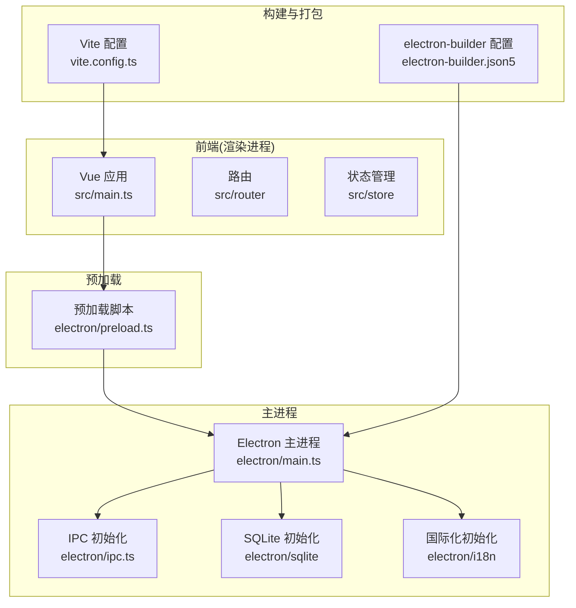
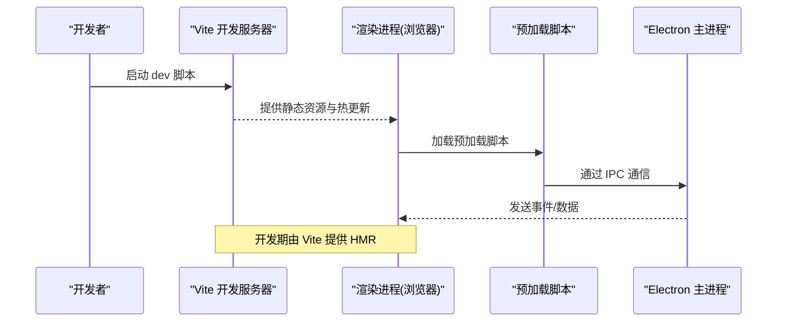
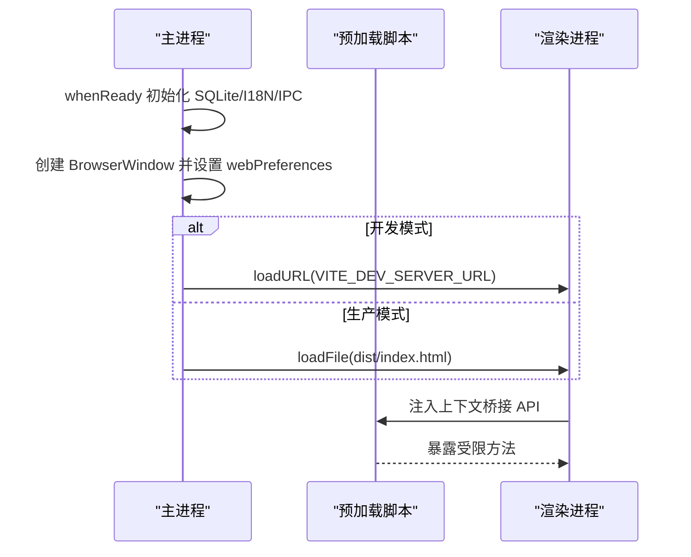
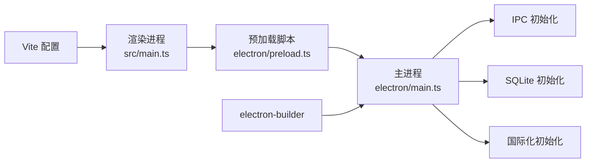

# 开发环境配置

<cite>
**本文档引用的文件**
- [package.json](file://package.json)
- [vite.config.ts](file://vite.config.ts)
- [tsconfig.json](file://tsconfig.json)
- [tsconfig.node.json](file://tsconfig.node.json)
- [electron/main.ts](file://electron/main.ts)
- [electron/preload.ts](file://electron/preload.ts)
- [electron/lib/is-dev.ts](file://electron/lib/is-dev.ts)
- [electron-builder.json5](file://electron-builder.json5)
- [scripts/post-install.js](file://scripts/post-install.js)
- [scripts/lipo-ffmpeg.js](file://scripts/lipo-ffmpeg.js)
- [.prettierrc.json](file://.prettierrc.json)
- [uno.config.ts](file://uno.config.ts)
- [src/main.ts](file://src/main.ts)
</cite>

## 目录
1. [简介](#简介)
2. [项目结构](#项目结构)
3. [核心组件](#核心组件)
4. [架构总览](#架构总览)
5. [详细组件分析](#详细组件分析)
6. [依赖关系分析](#依赖关系分析)
7. [性能考虑](#性能考虑)
8. [故障排除指南](#故障排除指南)
9. [结论](#结论)
10. [附录](#附录)

## 简介
本指南面向短视频工厂项目的开发者，提供从系统要求、前置依赖到 IDE 配置、构建配置、Electron 开发调试以及常见问题排查的完整开发环境搭建方案。项目采用 Vue 3 + TypeScript + Vite + Electron 技术栈，并通过 electron-builder 进行打包分发。

## 项目结构
项目采用前后端分离的 Electron 架构：
- 前端（渲染进程）：Vue 3 应用，使用 Vite 作为开发服务器与构建工具
- 主进程：Electron 主进程负责窗口创建、菜单、IPC 初始化等
- 预加载脚本：通过 contextBridge 暴露受限 API 至渲染进程
- 打包配置：electron-builder 统一管理多平台产物

图表来源
- [vite.config.ts:10-52](file://vite.config.ts#L10-L52)
- [electron/main.ts:187-204](file://electron/main.ts#L187-L204)
- [electron/preload.ts:18-75](file://electron/preload.ts#L18-L75)
- [electron-builder.json5:1-46](file://electron-builder.json5#L1-L46)

章节来源
- [package.json:13-21](file://package.json#L13-L21)
- [vite.config.ts:10-52](file://vite.config.ts#L10-L52)
- [electron/main.ts:187-204](file://electron/main.ts#L187-L204)

## 核心组件
- 包管理与脚本
  - 使用 pnpm 作为包管理器，限制仅允许 pnpm 安装
  - 提供开发、构建、预览、格式化、安装后处理与 FFmpeg 合并脚本
- TypeScript 编译配置
  - 两套 tsconfig：src 侧与 node 工具侧，启用 bundler 模式与严格模式
- Vite 构建配置
  - 集成 Vue 插件、UnoCSS、Vue DevTools，以及 electron 插件简化主/预加载配置
- Electron 打包配置
  - 多平台产物、asar 压缩、NSIS 安装器、mac AppImage 等

章节来源
- [package.json:13-21](file://package.json#L13-L21)
- [package.json:65-83](file://package.json#L65-L83)
- [tsconfig.json:1-32](file://tsconfig.json#L1-L32)
- [tsconfig.node.json:1-16](file://tsconfig.node.json#L1-L16)
- [vite.config.ts:10-52](file://vite.config.ts#L10-L52)
- [electron-builder.json5:1-46](file://electron-builder.json5#L1-L46)

## 架构总览
下图展示开发期与生产期的关键交互流程：

图表来源
- [package.json:14](file://package.json#L14)
- [vite.config.ts:15-40](file://vite.config.ts#L15-L40)
- [electron/main.ts:71-76](file://electron/main.ts#L71-L76)
- [electron/preload.ts:18-75](file://electron/preload.ts#L18-L75)

## 详细组件分析

### 系统要求与前置依赖
- Node.js 版本
  - 要求 Node.js >= 22.17.0，pnpm >= 10.12.4
- Python 环境
  - 项目使用 better-sqlite3 与 ffmpeg-static，均通过预构建二进制提供，通常无需手动安装 Python
- FFmpeg 安装与权限
  - 通过 post-install 脚本自动下载并设置权限；在非 Windows 平台需确保可执行权限
  - 提供 lipo-ffmpeg 脚本合并 x64/arm64 为通用二进制

章节来源
- [package.json:80-83](file://package.json#L80-L83)
- [scripts/post-install.js:6-18](file://scripts/post-install.js#L6-L18)
- [scripts/lipo-ffmpeg.js:1-49](file://scripts/lipo-ffmpeg.js#L1-L49)

### IDE 配置建议（VSCode）
- 推荐插件
  - Vue Language Features (Volar)、TypeScript Importer、Prettier、ESLint
- TypeScript 配置
  - 使用内置 tsconfig.json 与 tsconfig.node.json，确保 Volar 以 Vite 模式解析
- Vue 开发工具
  - 启用 Vue DevTools 插件，便于调试渲染进程组件

章节来源
- [tsconfig.json:1-32](file://tsconfig.json#L1-L32)
- [tsconfig.node.json:1-16](file://tsconfig.node.json#L1-L16)
- [vite.config.ts:13](file://vite.config.ts#L13)

### 构建配置（Vite + Electron）
- 开发服务器与热重载
  - dev 脚本启动 Vite，渲染进程通过 VITE_DEV_SERVER_URL 加载开发页面
  - electron 插件启用主进程与预加载脚本的构建与外部化
- 路径别名与构建优化
  - 配置 @ 与 ~ 别名，构建时增大 chunk 警告阈值
- UnoCSS 与样式
  - 集成 UnoCSS，提供原子化样式能力

章节来源
- [package.json:14](file://package.json#L14)
- [vite.config.ts:15-40](file://vite.config.ts#L15-L40)
- [vite.config.ts:42-51](file://vite.config.ts#L42-L51)
- [uno.config.ts:1-45](file://uno.config.ts#L1-L45)

### Electron 开发环境特殊配置
- 主进程
  - 通过 electron 插件指定入口与 Rollup 外部化依赖（better-sqlite3）
  - 在开发期读取 VITE_DEV_SERVER_URL，否则加载已构建的 index.html
  - 窗口偏好与 IPC 初始化在 whenReady 后执行
- 预加载脚本
  - 使用 contextBridge 暴露受控 API 至渲染进程，包括 IPC、SQLite、TTS、视频渲染等
- 开发模式判断
  - isDev 依据是否存在 VITE_DEV_SERVER_URL

图表来源
- [vite.config.ts:15-40](file://vite.config.ts#L15-L40)
- [electron/main.ts:36](file://electron/main.ts#L36)
- [electron/main.ts:71-76](file://electron/main.ts#L71-L76)
- [electron/preload.ts:18-75](file://electron/preload.ts#L18-L75)
- [electron/lib/is-dev.ts:1-2](file://electron/lib/is-dev.ts#L1-L2)

章节来源
- [vite.config.ts:15-40](file://vite.config.ts#L15-L40)
- [electron/main.ts:187-204](file://electron/main.ts#L187-L204)
- [electron/main.ts:71-76](file://electron/main.ts#L71-L76)
- [electron/preload.ts:18-75](file://electron/preload.ts#L18-L75)
- [electron/lib/is-dev.ts:1-2](file://electron/lib/is-dev.ts#L1-L2)

### 开发工具链配置
- TypeScript
  - 严格模式、bundler 解析、路径映射、禁用 emit
- ESLint/Prettier
  - 仓库未提供 ESLint 配置文件，建议在 VSCode 中启用 Prettier 与 ESLint 插件
  - Prettier 配置已提供，遵循单引号、无分号、打印宽度 100
- 构建脚本
  - dev：启动 Vite 开发服务器
  - build：先类型检查，再构建前端与打包 Electron
  - preview：本地预览构建产物
  - postinstall：自动下载并设置 FFmpeg 权限
  - lipo-ffmpeg：合并多架构 FFmpeg 二进制

章节来源
- [tsconfig.json:15-24](file://tsconfig.json#L15-L24)
- [package.json:13-21](file://package.json#L13-L21)
- [.prettierrc.json:1-7](file://.prettierrc.json#L1-L7)

## 依赖关系分析
- 内部依赖
  - 渲染进程依赖预加载脚本提供的受限 API
  - 主进程负责窗口生命周期、菜单、IPC、SQLite 初始化
- 外部依赖
  - better-sqlite3 通过 electron 插件外部化，避免二次构建
  - ffmpeg-static 通过 post-install 自动下载并设置权限
- 打包与分发
  - electron-builder 统一管理产物目录与平台目标

图表来源
- [src/main.ts:14-62](file://src/main.ts#L14-L62)
- [electron/preload.ts:18-75](file://electron/preload.ts#L18-L75)
- [electron/main.ts:187-204](file://electron/main.ts#L187-L204)
- [vite.config.ts:10-52](file://vite.config.ts#L10-L52)
- [electron-builder.json5:7-12](file://electron-builder.json5#L7-L12)

章节来源
- [vite.config.ts:20-26](file://vite.config.ts#L20-L26)
- [scripts/post-install.js:6-18](file://scripts/post-install.js#L6-L18)
- [electron-builder.json5:1-46](file://electron-builder.json5#L1-L46)

## 性能考虑
- 构建体积与警告阈值
  - 已将 chunkSizeWarningLimit 提升至 2048KB，减少大模块带来的误报
- 外部化依赖
  - better-sqlite3 通过 external 避免重复构建，缩短开发与打包时间
- UnoCSS
  - 按需生成样式，避免全量引入导致体积膨胀

章节来源
- [vite.config.ts:48-51](file://vite.config.ts#L48-L51)
- [vite.config.ts:20-24](file://vite.config.ts#L20-L24)
- [uno.config.ts:1-45](file://uno.config.ts#L1-L45)

## 故障排除指南
- 依赖冲突与安装失败
  - 确保使用 pnpm，且版本满足 engines 要求
  - 若安装失败，清理缓存后重试
- FFmpeg 权限问题
  - 非 Windows 平台需确保 ffmpeg 可执行权限
  - 可运行 postinstall 脚本或 lipo-ffmpeg 脚本修复
- 路径配置错误
  - 确认 VITE_DEV_SERVER_URL 存在时加载开发页面，否则加载已构建的 index.html
  - 检查 APP_ROOT、VITE_PUBLIC 等环境变量是否正确设置
- 跨域与本地网络请求
  - 主进程已禁用 CORS 与私有网络限制，确保开发期接口可访问
- 打包产物缺失
  - 确认 electron-builder 的 files 字段包含 dist、dist-electron、dist-native、locales

章节来源
- [package.json:80-83](file://package.json#L80-L83)
- [scripts/post-install.js:12-18](file://scripts/post-install.js#L12-L18)
- [scripts/lipo-ffmpeg.js:42-49](file://scripts/lipo-ffmpeg.js#L42-L49)
- [electron/main.ts:36](file://electron/main.ts#L36)
- [electron/main.ts:71-76](file://electron/main.ts#L71-L76)
- [electron/main.ts:199-202](file://electron/main.ts#L199-L202)
- [electron-builder.json5:10](file://electron-builder.json5#L10)

## 结论
本指南覆盖了短视频工厂项目从系统要求、依赖安装、IDE 配置到构建与打包的全流程。按照本文档配置，可在不同平台上快速搭建一致的开发与调试环境，并通过 electron-builder 实现多平台产物的稳定产出。

## 附录
- 快速检查清单
  - 安装 pnpm 并满足 Node.js 版本要求
  - 运行安装脚本，确保 FFmpeg 权限正确
  - 启动 dev 脚本验证 HMR 与 IPC 通信
  - 使用 build 脚本生成可分发产物