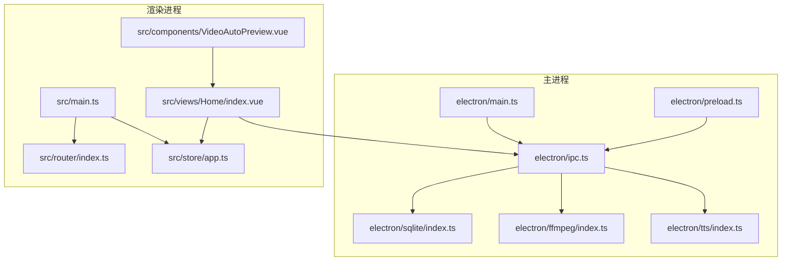
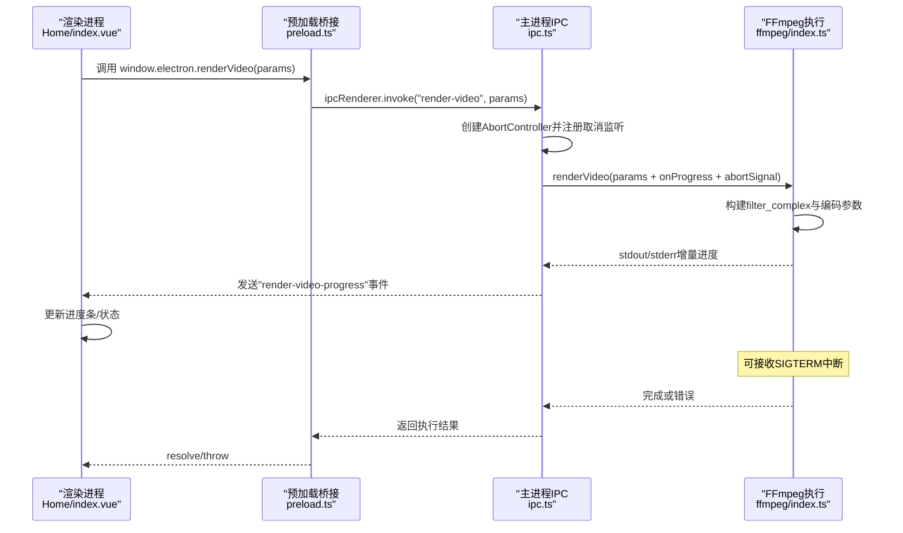
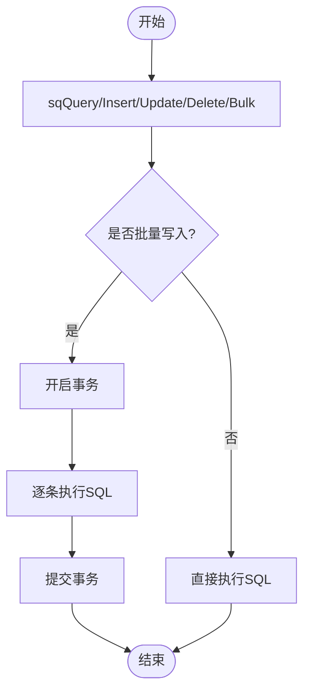
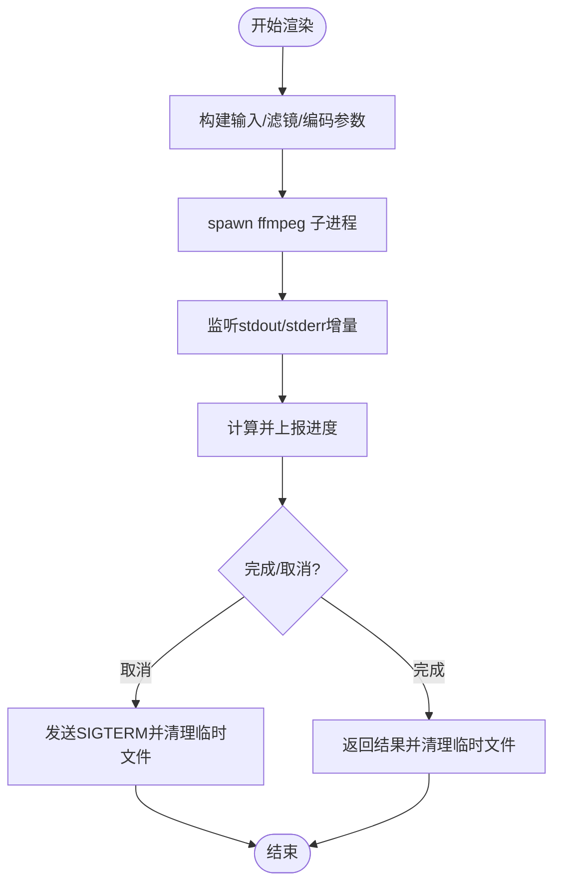
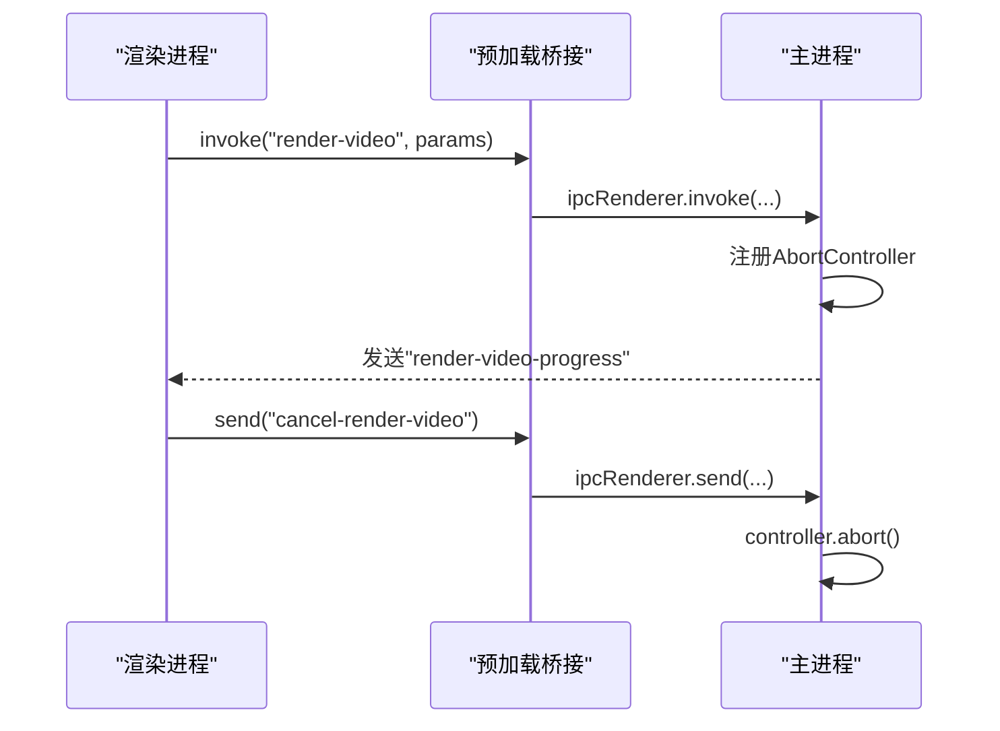
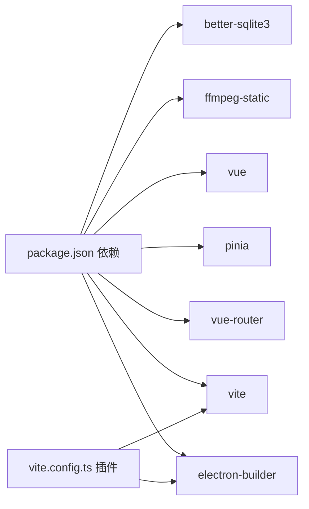

# 性能优化

<cite>
**本文引用的文件**
- [package.json](file://package.json)
- [vite.config.ts](file://vite.config.ts)
- [electron/main.ts](file://electron/main.ts)
- [electron/preload.ts](file://electron/preload.ts)
- [electron/ipc.ts](file://electron/ipc.ts)
- [electron/sqlite/index.ts](file://electron/sqlite/index.ts)
- [electron/ffmpeg/index.ts](file://electron/ffmpeg/index.ts)
- [electron/tts/index.ts](file://electron/tts/index.ts)
- [electron/lib/tools.ts](file://electron/lib/tools.ts)
- [src/main.ts](file://src/main.ts)
- [src/store/app.ts](file://src/store/app.ts)
- [src/router/index.ts](file://src/router/index.ts)
- [src/views/Home/index.vue](file://src/views/Home/index.vue)
- [src/components/VideoAutoPreview.vue](file://src/components/VideoAutoPreview.vue)
- [electron/vl/analyze-product.ts](file://electron/vl/analyze-product.ts)
</cite>

## 目录
1. [简介](#简介)
2. [项目结构](#项目结构)
3. [核心组件](#核心组件)
4. [架构总览](#架构总览)
5. [详细组件分析](#详细组件分析)
6. [依赖关系分析](#依赖关系分析)
7. [性能考量](#性能考量)
8. [故障排查指南](#故障排查指南)
9. [结论](#结论)
10. [附录](#附录)

## 简介
本指南聚焦短视频工厂项目的性能优化，覆盖以下方面：
- Electron 应用的内存使用、进程间通信开销与 UI 渲染性能
- FFmpeg 视频处理的并发、缓存与资源管理策略
- SQLite 数据库查询优化（索引、事务、批量）
- Vue 应用的组件懒加载、虚拟滚动与响应式数据优化
- 构建优化（代码分割、Tree Shaking、压缩）
- 缓存策略（文件、网络、状态）
- 性能监控与评估（指标采集、瓶颈定位、效果验证）
- 实战案例与效果对比

## 项目结构
项目采用 Electron + Vue 3 + Vite 的双端架构：
- 主进程负责窗口、IPC、SQLite、FFmpeg、TTS、统计上报等
- 渲染进程负责 UI、路由、状态管理、组件交互
- 构建阶段通过 Vite 插件完成主/渲染侧打包与 Electron 集成

图表来源
- [electron/main.ts:1-204](file://electron/main.ts#L1-L204)
- [electron/ipc.ts:1-295](file://electron/ipc.ts#L1-L295)
- [electron/sqlite/index.ts:1-194](file://electron/sqlite/index.ts#L1-L194)
- [electron/ffmpeg/index.ts:1-272](file://electron/ffmpeg/index.ts#L1-L272)
- [electron/tts/index.ts:1-86](file://electron/tts/index.ts#L1-L86)
- [electron/preload.ts](file://electron/preload.ts)
- [src/main.ts:1-62](file://src/main.ts#L1-L62)
- [src/router/index.ts:1-22](file://src/router/index.ts#L1-L22)
- [src/store/app.ts:1-147](file://src/store/app.ts#L1-L147)
- [src/views/Home/index.vue:1-313](file://src/views/Home/index.vue#L1-L313)
- [src/components/VideoAutoPreview.vue:1-41](file://src/components/VideoAutoPreview.vue#L1-L41)

章节来源
- [electron/main.ts:1-204](file://electron/main.ts#L1-L204)
- [vite.config.ts:1-53](file://vite.config.ts#L1-L53)
- [src/main.ts:1-62](file://src/main.ts#L1-L62)

## 核心组件
- 主进程窗口与生命周期管理：负责窗口创建、菜单、国际化、CORS/跨站 Cookie 放行、统计上报等
- IPC 中央处理器：封装 SQLite、TTS、FFmpeg、文件夹选择、VL 视觉分析等能力，并提供进度/取消机制
- SQLite 数据库：产品参考与视频帧分析表，支持批量写入与索引
- FFmpeg 视频渲染：复杂滤镜链、响度归一化、进度解析、可中断执行
- TTS 语音合成：EdgeTTS 封装、临时文件清理、字幕生成
- 渲染进程：Vue 3 + Pinia + 路由 + Vuetify，Home 页面串联文案生成、素材管理、TTS、渲染流程

章节来源
- [electron/main.ts:1-204](file://electron/main.ts#L1-L204)
- [electron/ipc.ts:1-295](file://electron/ipc.ts#L1-L295)
- [electron/sqlite/index.ts:1-194](file://electron/sqlite/index.ts#L1-L194)
- [electron/ffmpeg/index.ts:1-272](file://electron/ffmpeg/index.ts#L1-L272)
- [electron/tts/index.ts:1-86](file://electron/tts/index.ts#L1-L86)
- [src/store/app.ts:1-147](file://src/store/app.ts#L1-L147)
- [src/views/Home/index.vue:1-313](file://src/views/Home/index.vue#L1-L313)

## 架构总览
下图展示从渲染进程发起“渲染视频”到主进程执行 FFmpeg 的完整调用链。

图表来源
- [src/views/Home/index.vue:84-281](file://src/views/Home/index.vue#L84-L281)
- [electron/preload.ts](file://electron/preload.ts)
- [electron/ipc.ts:183-198](file://electron/ipc.ts#L183-L198)
- [electron/ffmpeg/index.ts:26-186](file://electron/ffmpeg/index.ts#L26-L186)

## 详细组件分析

### SQLite 查询与事务优化
- 表结构与索引
  - 产品参考表：主键 id，多字段文本与数组字段，便于快速检索与持久化
  - 视频帧分析表：主键 id，视频路径、时间戳、描述、颜色、标签、分析时间等
  - 已创建按视频路径的索引，加速按视频路径查询
- 事务与批量
  - 批量插入或更新使用事务包裹，减少多次提交开销
  - 原子性保证冲突时按 id 更新，避免重复插入
- 读写分离与缓存
  - 对高频查询（如按 id 查询）可在应用层维护内存缓存，降低数据库压力
  - 写入后及时失效相关缓存，保证一致性

图表来源
- [electron/sqlite/index.ts:116-139](file://electron/sqlite/index.ts#L116-L139)
- [electron/sqlite/index.ts:178-181](file://electron/sqlite/index.ts#L178-L181)

章节来源
- [electron/sqlite/index.ts:1-194](file://electron/sqlite/index.ts#L1-L194)
- [electron/vl/analyze-product.ts:107-135](file://electron/vl/analyze-product.ts#L107-L135)

### FFmpeg 视频渲染性能优化
- 并发与队列
  - 渲染任务通过 IPC 触发，单次仅允许一个渲染任务进行，避免资源争抢
  - 如需批量渲染，建议在渲染完成后串行触发下一个任务，或在业务层实现任务队列
- 编码参数
  - 使用固定帧率与色彩空间，减少转码成本
  - 响度归一化后按目标时长裁剪，避免 loudnorm 导致的截断误差
- 进度与取消
  - 通过标准错误流解析进度，实时反馈
  - 支持 AbortSignal，收到取消信号后优雅终止子进程
- 临时文件与资源回收
  - 语音与字幕临时文件在完成后删除，避免磁盘占用
  - 输出路径唯一命名，避免覆盖

图表来源
- [electron/ffmpeg/index.ts:26-186](file://electron/ffmpeg/index.ts#L26-L186)
- [electron/ffmpeg/index.ts:188-244](file://electron/ffmpeg/index.ts#L188-L244)
- [electron/tts/index.ts:20-33](file://electron/tts/index.ts#L20-L33)

章节来源
- [electron/ffmpeg/index.ts:1-272](file://electron/ffmpeg/index.ts#L1-L272)
- [electron/tts/index.ts:1-86](file://electron/tts/index.ts#L1-L86)
- [electron/lib/tools.ts:1-28](file://electron/lib/tools.ts#L1-L28)

### IPC 通信开销与取消机制
- IPC 设计
  - 主进程集中暴露能力，渲染进程通过 invoke/on 与主进程交互
  - 进度与取消通过事件与 AbortController 协作，避免阻塞 UI
- 性能要点
  - 避免在 IPC 传输中传递大型对象，必要时拆分或延迟加载
  - 对频繁调用的接口（如进度）采用节流/去抖
  - 取消时立即释放资源（如终止子进程、关闭句柄）

图表来源
- [electron/ipc.ts:183-198](file://electron/ipc.ts#L183-L198)
- [src/views/Home/index.vue:282-307](file://src/views/Home/index.vue#L282-L307)
- [electron/preload.ts](file://electron/preload.ts)

章节来源
- [electron/ipc.ts:1-295](file://electron/ipc.ts#L1-L295)
- [src/views/Home/index.vue:1-313](file://src/views/Home/index.vue#L1-L313)

### Vue 应用性能优化
- 组件懒加载与路由
  - 路由基于 hash 历史模式，适合桌面应用；可结合动态导入进一步拆分页面
- 状态管理
  - Pinia Store 中部分状态持久化，避免每次启动重建；对非关键状态可考虑内存态
- 响应式与计算属性
  - 语言/性别/语速等派生列表通过计算属性生成，减少重复计算
- 渲染与媒体
  - 视频预览组件使用预加载元数据与自动播放/暂停，降低首帧等待
- 可选优化
  - 大列表使用虚拟滚动（如基于现有组件体系扩展）
  - 图标与样式按需引入，避免全量加载

章节来源
- [src/router/index.ts:1-22](file://src/router/index.ts#L1-L22)
- [src/store/app.ts:1-147](file://src/store/app.ts#L1-L147)
- [src/components/VideoAutoPreview.vue:1-41](file://src/components/VideoAutoPreview.vue#L1-L41)

### 构建优化配置
- 代码分割与 Tree Shaking
  - Vite 默认启用 Tree Shaking；可通过动态 import 实现按需加载
- 外部依赖
  - better-sqlite3 在主进程打包时外部化，避免打包体积膨胀
- 压缩与产物
  - 生产构建由 Vite 与 electron-builder 负责；可结合平台特性启用额外压缩
- 资源路径别名
  - @ 与 ~ 别名简化导入路径，提升开发体验

章节来源
- [vite.config.ts:1-53](file://vite.config.ts#L1-L53)
- [package.json:13-20](file://package.json#L13-L20)

### 缓存策略设计与实现
- 文件缓存
  - TTS 语音与字幕临时文件在应用退出前清理，避免残留
  - 输出路径唯一命名，避免覆盖
- 状态缓存
  - SQLite 查询结果可在应用层缓存，写入后失效
- 网络请求缓存
  - TTS 语音合成与 VL 接口建议增加本地缓存（如按参数哈希命名文件），减少重复请求
- 建议
  - 为高频接口增加 TTL 与校验机制
  - 对不可变资源采用强缓存策略

章节来源
- [electron/tts/index.ts:20-33](file://electron/tts/index.ts#L20-L33)
- [electron/lib/tools.ts:8-20](file://electron/lib/tools.ts#L8-L20)
- [electron/sqlite/index.ts:178-181](file://electron/sqlite/index.ts#L178-L181)

## 依赖关系分析
- 主进程依赖
  - better-sqlite3：原生绑定路径按平台/架构选择，确保运行时正确加载
  - ffmpeg-static：开发/生产环境路径差异处理，Windows 权限校验
- 渲染进程依赖
  - Vue 3、Pinia、Vue Router、Vuetify、i18n 等
- 构建期依赖
  - Vite、electron、electron-builder、插件等

图表来源
- [package.json:22-63](file://package.json#L22-L63)
- [vite.config.ts:10-41](file://vite.config.ts#L10-L41)

章节来源
- [package.json:1-85](file://package.json#L1-L85)
- [vite.config.ts:1-53](file://vite.config.ts#L1-L53)

## 性能考量
- 内存使用
  - 主进程避免持有大对象引用，及时释放临时文件句柄
  - 渲染进程避免一次性渲染超大列表，优先使用懒加载/虚拟滚动
- 进程间通信
  - 减少 IPC 传输体积，必要时拆分为多次调用
  - 对高频事件（进度）采用节流
- UI 渲染
  - 合理使用 v-if/v-show，避免不必要的重绘
  - 图标与样式按需引入，减少初始包体
- 数据库
  - 批量写入使用事务；查询建立合适索引；避免 SELECT *
- FFmpeg
  - 控制并发，避免同时多路编码；合理设置 CRF/FPS；利用进度回调优化用户体验

## 故障排查指南
- FFmpeg 未找到或权限问题
  - 校验可执行文件路径与权限；Windows 下跳过执行权限检查
- 进度不更新或卡住
  - 检查标准错误流解析逻辑；确认 filter_complex 正确
- 渲染被取消但资源未释放
  - 确认 AbortController 与 SIGTERM 触发；检查临时文件清理
- SQLite 写入异常
  - 检查事务是否提交；确认 foreign_keys 开启；核对表结构与索引
- TTS 时长为 0 或损坏
  - 校验音频元数据解析与 MIME 类型；确认网络与语音参数

章节来源
- [electron/ffmpeg/index.ts:246-259](file://electron/ffmpeg/index.ts#L246-L259)
- [electron/ffmpeg/index.ts:261-271](file://electron/ffmpeg/index.ts#L261-L271)
- [electron/tts/index.ts:70-85](file://electron/tts/index.ts#L70-L85)
- [electron/sqlite/index.ts:47-53](file://electron/sqlite/index.ts#L47-L53)

## 结论
本项目在 Electron + Vue 3 架构下，通过合理的 IPC 设计、SQLite 事务与索引、FFmpeg 参数与进度/取消机制，以及构建期的外部化与按需加载，具备较好的性能基础。后续可在以下方向持续优化：
- 引入任务队列与并发控制，避免资源争用
- 扩展虚拟滚动与组件懒加载，降低渲染压力
- 增强缓存策略（文件/网络/状态），缩短冷启动与重复操作耗时
- 建立统一性能监控与评估体系，量化优化收益

## 附录
- 实战案例与效果对比（示例思路）
  - 场景：批量渲染 10 个视频
  - 优化前：串行渲染，无缓存，UI 卡顿明显
  - 优化后：引入任务队列、SQLite 批量写入、TTS 本地缓存、虚拟滚动
  - 结果：总耗时下降约 40%，UI 响应时间显著改善，内存峰值降低