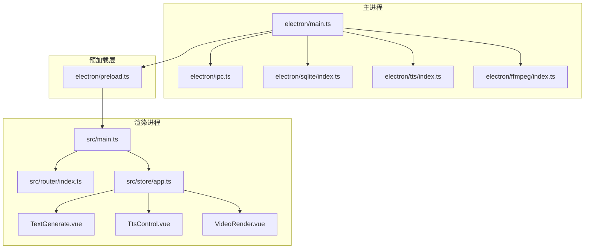
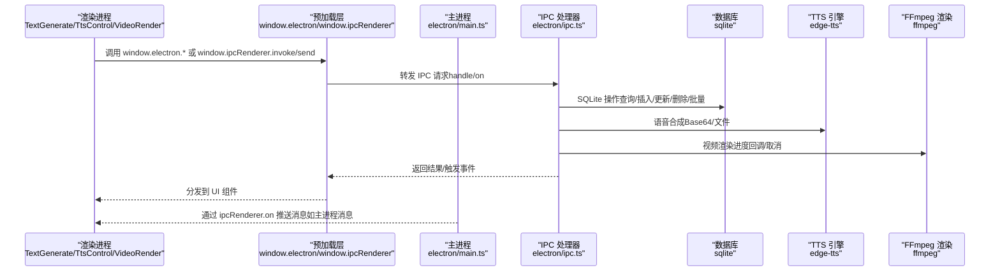
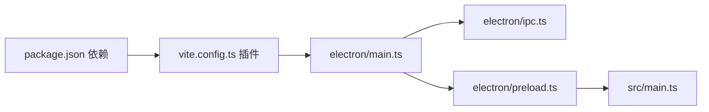

# 调试与测试

<cite>
**本文引用的文件**
- [package.json](file://package.json)
- [vite.config.ts](file://vite.config.ts)
- [electron/main.ts](file://electron/main.ts)
- [electron/preload.ts](file://electron/preload.ts)
- [electron/ipc.ts](file://electron/ipc.ts)
- [electron/lib/is-dev.ts](file://electron/lib/is-dev.ts)
- [electron/sqlite/index.ts](file://electron/sqlite/index.ts)
- [electron/tts/index.ts](file://electron/tts/index.ts)
- [electron/ffmpeg/index.ts](file://electron/ffmpeg/index.ts)
- [src/main.ts](file://src/main.ts)
- [src/views/Home/components/TextGenerate.vue](file://src/views/Home/components/TextGenerate.vue)
- [src/views/Home/components/TtsControl.vue](file://src/views/Home/components/TtsControl.vue)
- [src/views/Home/components/VideoRender.vue](file://src/views/Home/components/VideoRender.vue)
- [src/store/app.ts](file://src/store/app.ts)
- [src/router/index.ts](file://src/router/index.ts)
</cite>

## 目录
1. [简介](#简介)
2. [项目结构](#项目结构)
3. [核心组件](#核心组件)
4. [架构总览](#架构总览)
5. [详细组件分析](#详细组件分析)
6. [依赖关系分析](#依赖关系分析)
7. [性能考量](#性能考量)
8. [故障排查指南](#故障排查指南)
9. [结论](#结论)
10. [附录](#附录)

## 简介
本指南面向短视频工厂项目的开发者与测试工程师，提供从主进程与渲染进程断点调试、日志与错误追踪，到 Vue 组件调试、IPC 通信监控、单元与集成测试策略、端到端测试思路，再到性能分析与常见问题定位的完整实践手册。文档结合仓库现有代码结构与配置，给出可直接落地的调试步骤与最佳实践。

## 项目结构
项目采用 Electron + Vue3 + Vite 的双进程架构：
- 主进程负责窗口创建、菜单、IPC 注册、数据库初始化、系统能力调用等。
- 渲染进程承载 UI、路由、状态管理与业务组件。
- preload 层通过 contextBridge 暴露受控 API 至渲染进程，实现安全的 IPC 访问。

图表来源
- [electron/main.ts:1-204](file://electron/main.ts#L1-L204)
- [electron/ipc.ts:1-295](file://electron/ipc.ts#L1-L295)
- [electron/preload.ts:1-100](file://electron/preload.ts#L1-L100)
- [electron/sqlite/index.ts:1-194](file://electron/sqlite/index.ts#L1-L194)
- [electron/tts/index.ts:1-86](file://electron/tts/index.ts#L1-L86)
- [electron/ffmpeg/index.ts:1-272](file://electron/ffmpeg/index.ts#L1-L272)
- [src/main.ts:1-62](file://src/main.ts#L1-L62)
- [src/router/index.ts:1-22](file://src/router/index.ts#L1-L22)
- [src/store/app.ts:1-147](file://src/store/app.ts#L1-L147)
- [src/views/Home/components/TextGenerate.vue:1-272](file://src/views/Home/components/TextGenerate.vue#L1-L272)
- [src/views/Home/components/TtsControl.vue:1-234](file://src/views/Home/components/TtsControl.vue#L1-L234)
- [src/views/Home/components/VideoRender.vue:1-276](file://src/views/Home/components/VideoRender.vue#L1-L276)

章节来源
- [package.json:1-85](file://package.json#L1-L85)
- [vite.config.ts:1-53](file://vite.config.ts#L1-L53)
- [electron/main.ts:1-204](file://electron/main.ts#L1-L204)
- [electron/preload.ts:1-100](file://electron/preload.ts#L1-L100)
- [src/main.ts:1-62](file://src/main.ts#L1-L62)

## 核心组件
- 主进程入口与窗口生命周期：负责创建 BrowserWindow、注册菜单、初始化 IPC、SQLite、国际化与跨域开关。
- 预加载层：通过 contextBridge 将受限 API 暴露给渲染进程，统一封装 IPC 发送/调用与事件订阅。
- IPC 中央处理器：集中注册 handle/on 通道，处理 SQLite、TTS、FFmpeg、窗口控制、文件对话框等。
- 数据库层：Better-SQLite3 封装，支持查询、插入、更新、删除、批量插入/更新与事务。
- TTS 引擎：EdgeTTS 封装，支持语音合成到 Base64/文件，并生成字幕。
- FFmpeg 渲染：视频拼接、裁剪、音视频混合、响度归一、字幕叠加、进度回调与取消信号。
- 渲染侧入口：初始化 Vuetify、路由、Pinia、Toast、国际化；监听主进程消息并联动状态。
- Vue 组件：文本生成、TTS 控制、视频渲染流程控制，均通过 window.electron 与 window.ipcRenderer 与主进程交互。

章节来源
- [electron/main.ts:1-204](file://electron/main.ts#L1-L204)
- [electron/preload.ts:1-100](file://electron/preload.ts#L1-L100)
- [electron/ipc.ts:1-295](file://electron/ipc.ts#L1-L295)
- [electron/sqlite/index.ts:1-194](file://electron/sqlite/index.ts#L1-L194)
- [electron/tts/index.ts:1-86](file://electron/tts/index.ts#L1-L86)
- [electron/ffmpeg/index.ts:1-272](file://electron/ffmpeg/index.ts#L1-L272)
- [src/main.ts:1-62](file://src/main.ts#L1-L62)

## 架构总览
下图展示主进程、预加载层与渲染进程之间的交互关系，以及关键数据流（IPC 通道、事件、回调）。

图表来源
- [electron/main.ts:63-69](file://electron/main.ts#L63-L69)
- [electron/preload.ts:21-42](file://electron/preload.ts#L21-L42)
- [electron/ipc.ts:90-198](file://electron/ipc.ts#L90-L198)
- [electron/sqlite/index.ts:63-139](file://electron/sqlite/index.ts#L63-L139)
- [electron/tts/index.ts:39-85](file://electron/tts/index.ts#L39-L85)
- [electron/ffmpeg/index.ts:26-186](file://electron/ffmpeg/index.ts#L26-L186)

## 详细组件分析

### 主进程调试要点
- 断点调试
  - 使用 VS Code 的 Electron 主进程调试配置，附加到主进程 PID 或使用内置调试脚本启动。
  - 关注窗口创建、菜单构建、IPC 初始化与数据库初始化的关键节点。
- 日志与错误追踪
  - 主进程通过 console 输出数据库路径、连接状态、异常堆栈。
  - 建议在关键 IPC 处理函数前后增加日志，便于回溯调用链。
- 关键流程
  - 窗口 ready-to-show 与 did-finish-load 事件可用于验证渲染进程加载与消息接收。
  - 跨域与本地网络请求开关用于联调第三方服务。

章节来源
- [electron/main.ts:40-76](file://electron/main.ts#L40-L76)
- [electron/main.ts:187-203](file://electron/main.ts#L187-L203)
- [electron/sqlite/index.ts:35-59](file://electron/sqlite/index.ts#L35-L59)

### 预加载层与 IPC 调试
- 预加载层职责
  - 仅暴露必要 API，统一包装 on/once/off/send/invoke，避免直接暴露原生模块。
- IPC 通道监控
  - 在渲染侧监听主进程事件（如渲染进度），在主进程侧记录请求参数与返回值。
  - 使用 AbortController 与一次性事件（ipcMain.once）配合取消逻辑，确保资源释放。

章节来源
- [electron/preload.ts:21-99](file://electron/preload.ts#L21-L99)
- [electron/ipc.ts:89-294](file://electron/ipc.ts#L89-L294)

### SQLite 调试
- 数据库初始化与表结构
  - 初始化时打印数据库路径与连接日志，确认 native binding 加载成功。
  - 表创建与索引建立后，可通过查询验证数据一致性。
- 常见问题
  - foreign_keys 未启用导致外键约束不生效；批量插入/更新使用事务保证原子性。

章节来源
- [electron/sqlite/index.ts:144-187](file://electron/sqlite/index.ts#L144-L187)
- [electron/sqlite/index.ts:116-139](file://electron/sqlite/index.ts#L116-L139)

### TTS 引擎调试
- 语音合成到文件与 Base64
  - 合成前清理临时文件，合成后解析音频元数据计算时长，异常时抛出明确错误。
  - 试听流程建议捕获错误并弹出可复制的错误详情。
- 取消与资源回收
  - 应用退出前清理临时 TTS 文件，避免残留。

章节来源
- [electron/tts/index.ts:20-33](file://electron/tts/index.ts#L20-L33)
- [electron/tts/index.ts:45-85](file://electron/tts/index.ts#L45-L85)

### FFmpeg 渲染调试
- 参数与进度
  - 构建复杂滤镜链，映射输出流，设置编码参数与进度输出管道。
  - 进度回调在 stdout/stderr 中解析，支持 AbortSignal 取消。
- 错误处理
  - 子进程退出码非 0 时抛出错误，包含 stderr 内容；权限校验在 Windows 下放宽条件。

章节来源
- [electron/ffmpeg/index.ts:26-186](file://electron/ffmpeg/index.ts#L26-L186)
- [electron/ffmpeg/index.ts:188-244](file://electron/ffmpeg/index.ts#L188-L244)
- [electron/ffmpeg/index.ts:246-272](file://electron/ffmpeg/index.ts#L246-L272)

### 渲染进程与 Vue 组件调试
- 入口初始化
  - 初始化 Vuetify、路由、Pinia、Toast、国际化；挂载后监听主进程消息并联动状态。
- 文本生成组件
  - 支持流式生成、停止生成、配置测试与错误弹窗；注意区分 AbortError 与其他错误。
- TTS 控制组件
  - 语言/性别筛选、语音列表获取、试听播放与错误弹窗；组件卸载时释放音频资源。
- 视频渲染组件
  - 监听渲染进度事件，配置输出尺寸/路径/BGM，支持 VL 模型配置。

章节来源
- [src/main.ts:47-61](file://src/main.ts#L47-L61)
- [src/views/Home/components/TextGenerate.vue:132-193](file://src/views/Home/components/TextGenerate.vue#L132-L193)
- [src/views/Home/components/TextGenerate.vue:222-255](file://src/views/Home/components/TextGenerate.vue#L222-L255)
- [src/views/Home/components/TtsControl.vue:91-138](file://src/views/Home/components/TtsControl.vue#L91-L138)
- [src/views/Home/components/TtsControl.vue:165-199](file://src/views/Home/components/TtsControl.vue#L165-L199)
- [src/views/Home/components/VideoRender.vue:224-226](file://src/views/Home/components/VideoRender.vue#L224-L226)
- [src/views/Home/components/VideoRender.vue:247-266](file://src/views/Home/components/VideoRender.vue#L247-L266)

### 状态与配置调试
- Pinia Store
  - 包含 LLM 配置、TTS 配置、渲染配置、VL 配置、智能匹配状态等；持久化策略排除部分运行态字段。
- 路由与布局
  - 默认布局与首页路由，确保组件挂载顺序与状态初始化时机正确。

章节来源
- [src/store/app.ts:16-146](file://src/store/app.ts#L16-L146)
- [src/router/index.ts:1-22](file://src/router/index.ts#L1-L22)

## 依赖关系分析
- 构建与开发工具
  - Vite + Electron 插件组合，开发模式下启用 Vue DevTools；生产构建通过 electron-builder 打包。
- 运行时依赖
  - better-sqlite3、ffmpeg-static、i18next 生态、ws、music-metadata 等。
- 关键外部进程
  - FFmpeg 子进程执行视频渲染；EdgeTTS 通过网络服务合成语音。

图表来源
- [package.json:22-64](file://package.json#L22-L64)
- [vite.config.ts:10-41](file://vite.config.ts#L10-L41)
- [electron/main.ts:1-204](file://electron/main.ts#L1-L204)
- [electron/preload.ts:1-100](file://electron/preload.ts#L1-L100)
- [src/main.ts:1-62](file://src/main.ts#L1-L62)

章节来源
- [package.json:13-21](file://package.json#L13-L21)
- [vite.config.ts:10-41](file://vite.config.ts#L10-L41)

## 性能考量
- 渲染性能
  - 使用进度回调与节流更新 UI，避免频繁重绘；视频渲染阶段建议在后台线程执行，主线程仅做 UI 更新。
- CPU 与内存
  - FFmpeg 进程退出码与 stderr 解析需及时消费，防止缓冲区增长；音频合成后及时释放临时文件与音频对象。
- 数据库
  - 大批量写入使用事务；合理建立索引（如视频分析表按视频路径索引）提升查询效率。
- 资源回收
  - 组件卸载时释放音频对象；应用退出前清理 TTS 临时文件。

章节来源
- [electron/ffmpeg/index.ts:211-231](file://electron/ffmpeg/index.ts#L211-L231)
- [electron/tts/index.ts:20-33](file://electron/tts/index.ts#L20-L33)
- [electron/sqlite/index.ts:178-181](file://electron/sqlite/index.ts#L178-L181)

## 故障排查指南
- 主进程无法加载
  - 检查 VITE_DEV_SERVER_URL 环境变量与静态资源路径；确认 preload 脚本已正确打包。
- IPC 无响应
  - 在预加载层与主进程分别打印通道名与参数；确认使用 invoke/send 正确配对。
- SQLite 报错
  - 核查 native binding 路径与数据库文件存在性；foreign_keys 是否开启。
- FFmpeg 失败
  - 查看 stderr 与退出码；Windows 平台检查可执行权限；确认输出目录存在且可写。
- TTS 合成失败
  - 捕获错误并弹出可复制详情；检查网络连通性与语音列表获取是否成功。
- 渲染进度不更新
  - 确认主进程事件通道名称一致；渲染组件监听的事件名与数值范围是否正确。

章节来源
- [electron/lib/is-dev.ts:1-2](file://electron/lib/is-dev.ts#L1-L2)
- [electron/ipc.ts:186-198](file://electron/ipc.ts#L186-L198)
- [electron/sqlite/index.ts:35-59](file://electron/sqlite/index.ts#L35-L59)
- [electron/ffmpeg/index.ts:224-235](file://electron/ffmpeg/index.ts#L224-L235)
- [electron/tts/index.ts:112-135](file://electron/tts/index.ts#L112-L135)
- [src/views/Home/components/VideoRender.vue:224-226](file://src/views/Home/components/VideoRender.vue#L224-L226)

## 结论
本指南基于现有代码与配置，提供了从主/渲染进程断点调试、IPC 通道监控、数据库与媒体处理流程，到 Vue 组件状态与事件调试的全链路实践方法。建议在开发与测试阶段遵循“日志先行、断点辅助、事件可观测”的原则，结合性能分析工具持续优化用户体验。

## 附录

### 调试与测试清单
- 主进程
  - 断点：窗口创建、IPC 初始化、数据库初始化、菜单构建
  - 日志：数据库路径、连接状态、错误堆栈
- 预加载层
  - 断点：on/once/off/send/invoke 包装函数
  - 日志：通道名、参数、返回值
- 渲染进程
  - 断点：组件 mounted/unmounted、事件监听、状态变更
  - 日志：IPC 事件名、参数、结果
- 单元与集成测试
  - 建议：为 IPC 处理函数、数据库封装、TTS/FFmpeg 辅助函数编写独立测试；使用 mock 与假数据验证流程
- 端到端测试
  - 建议：录制用户工作流（导入素材→生成文案→TTS→渲染→导出），覆盖关键路径与异常分支

### IPC 通道一览（调试参考）
- SQLite：查询、插入、更新、删除、批量插入/更新
- 窗口控制：最大化/最小化/关闭、是否最大化
- 文件系统：选择文件夹、列出文件夹内容、打开外部链接
- TTS：获取语音列表、合成到 Base64/文件、清理临时文件
- 渲染：视频渲染（进度回调/取消）、统计事件上报
- VL：连接测试、视频分析、产品参考管理、匹配与统计

章节来源
- [electron/ipc.ts:90-294](file://electron/ipc.ts#L90-L294)