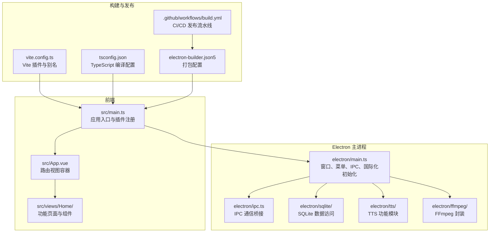
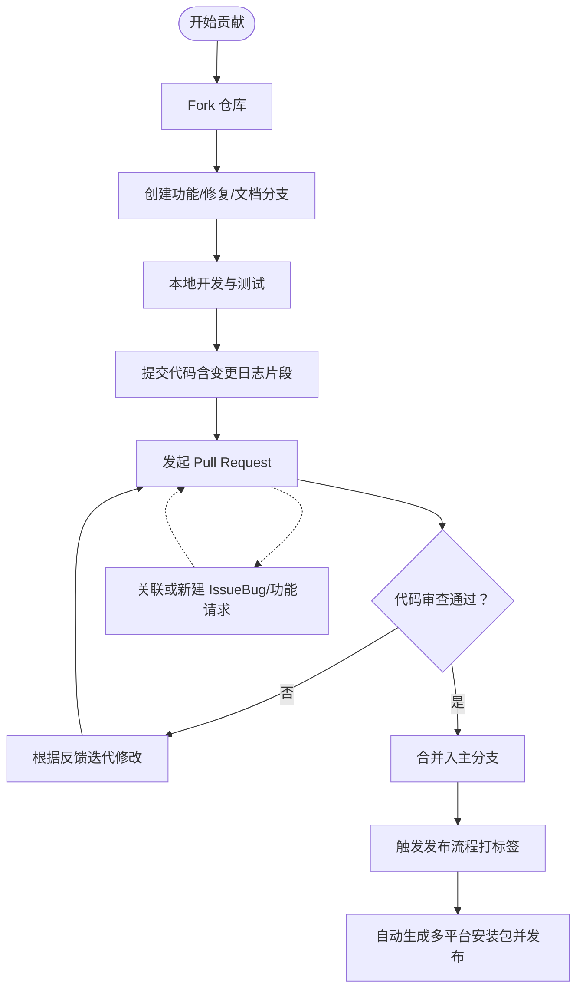
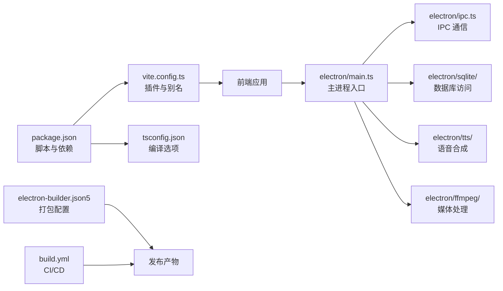

# 贡献指南

<cite>
**本文引用的文件**
- [README.md](file://README.md)
- [package.json](file://package.json)
- [.github/workflows/build.yml](file://.github/workflows/build.yml)
- [electron-builder.json5](file://electron-builder.json5)
- [vite.config.ts](file://vite.config.ts)
- [tsconfig.json](file://tsconfig.json)
- [.prettierrc.json](file://.prettierrc.json)
- [src/main.ts](file://src/main.ts)
- [electron/main.ts](file://electron/main.ts)
- [locales/zh-CN/common.json](file://locales/zh-CN/common.json)
- [locales/en/common.json](file://locales/en/common.json)
</cite>

## 目录
1. [简介](#简介)
2. [项目结构](#项目结构)
3. [核心组件](#核心组件)
4. [架构总览](#架构总览)
5. [详细组件分析](#详细组件分析)
6. [依赖分析](#依赖分析)
7. [性能考虑](#性能考虑)
8. [故障排查指南](#故障排查指南)
9. [结论](#结论)
10. [附录](#附录)

## 简介
本指南面向希望参与“短视频工厂”项目的贡献者，提供从 Fork 仓库、创建分支、提交代码到发起 Pull Request 的完整流程；明确代码审查流程与标准；规范 Issue 报告与分类；说明文档与翻译贡献方式；介绍版本发布流程与变更日志维护；给出社区行为准则与沟通规范；并为新贡献者提供入门建议与常见场景最佳实践。

## 项目结构
短视频工厂采用 Electron + Vue 3 + TypeScript 技术栈，前端通过 Vite 构建，主进程负责窗口管理、菜单、国际化与 IPC；资源与国际化文案分布在 locales 中；构建与发布由 GitHub Actions 驱动。

图表来源
- [src/main.ts:1-62](file://src/main.ts#L1-L62)
- [electron/main.ts:1-204](file://electron/main.ts#L1-L204)
- [vite.config.ts:1-53](file://vite.config.ts#L1-L53)
- [tsconfig.json:1-32](file://tsconfig.json#L1-L32)
- [electron-builder.json5:1-46](file://electron-builder.json5#L1-L46)
- [.github/workflows/build.yml:1-90](file://.github/workflows/build.yml#L1-L90)

章节来源
- [README.md:114-135](file://README.md#L114-L135)
- [package.json:13-21](file://package.json#L13-L21)

## 核心组件
- 应用入口与插件注册：初始化 Vuetify、Toast、路由、Pinia、国际化等，并挂载应用。
- Electron 主进程：创建窗口、构建菜单、初始化 IPC、SQLite、国际化；处理窗口生命周期与系统命令行开关。
- 国际化：多语言文案集中于 locales，支持中英双语；菜单与界面文案均来自 i18n。
- 构建与打包：Vite 配置插件链路；electron-builder 统一打包多平台产物；GitHub Actions 自动发布。

章节来源
- [src/main.ts:14-62](file://src/main.ts#L14-L62)
- [electron/main.ts:40-204](file://electron/main.ts#L40-L204)
- [locales/zh-CN/common.json:1-239](file://locales/zh-CN/common.json#L1-L239)
- [locales/en/common.json:1-239](file://locales/en/common.json#L1-L239)
- [vite.config.ts:10-53](file://vite.config.ts#L10-L53)
- [electron-builder.json5:1-46](file://electron-builder.json5#L1-L46)

## 架构总览
下图展示了贡献流程、代码审查、Issue 分类与版本发布的整体关系。

## 详细组件分析

### 贡献流程（Fork → 分支 → 提交 → PR）
- Fork 仓库：在 GitHub 上 Fork 主仓库。
- 创建分支：建议使用 feature/xxx、fix/xxx、docs/xxx 命名规范，避免在 main 分支直接工作。
- 提交代码：遵循代码风格与格式化配置；提交信息清晰描述变更目的与影响范围。
- 推送分支并发起 PR：在 PR 描述中简述变更内容、动机、测试要点与相关 Issue 编号。

章节来源
- [README.md:123-127](file://README.md#L123-L127)
- [package.json:17](file://package.json#L17)
- [.prettierrc.json:1-7](file://.prettierrc.json#L1-L7)

### 代码审查流程与标准
- 审查清单
  - 功能正确性：是否满足需求，边界条件与异常路径覆盖。
  - 代码质量：命名规范、函数拆分、注释与可读性。
  - 性能与资源：避免阻塞主线程、合理使用内存与磁盘。
  - 安全性：输入校验、敏感信息处理、权限控制。
  - 兼容性：Electron 版本、Node 与打包策略、跨平台差异。
  - 国际化：新增文案是否补充中英双语。
  - 变更日志：PR 是否包含对应版本的变更记录片段。
- 反馈处理：对审查意见逐条响应，必要时提供测试截图或说明；修改后重新请求审查。
- 合并要求：至少一名维护者批准；CI 通过；变更日志完善；避免大改动无前置讨论。

章节来源
- [README.md:116-128](file://README.md#L116-L128)
- [tsconfig.json:16-23](file://tsconfig.json#L16-L23)
- [electron-builder.json5:10-12](file://electron-builder.json5#L10-L12)

### Issue 报告规范
- Bug 报告
  - 环境信息：操作系统、应用版本、Node/PNPM 版本。
  - 复现步骤：最小可复现步骤与预期/实际结果。
  - 日志与截图：关键错误日志、控制台输出、视频/音频异常片段。
  - 影响范围：是否全局性问题，是否可规避。
- 功能请求
  - 背景与动机：为什么需要该功能。
  - 期望行为：具体交互与输出。
  - 参考实现：竞品或现有能力的对比。
- 问题分类
  - 类型：Bug、Enhancement、Question、Documentation。
  - 优先级：Critical、High、Medium、Low。
  - 标签：按功能域（LLM/TTS/渲染/国际化）与平台（Windows/macOS/Linux）标注。

章节来源
- [README.md:36-39](file://README.md#L36-L39)

### 文档与翻译贡献
- 文档更新流程
  - 在 docs 或 README 中更新相应章节，确保前后文一致。
  - 更新英文与中文版本，保持键值对一致。
  - 本地预览 Markdown 渲染效果，避免链接失效。
- 翻译贡献
  - 新增键值：在 locales/zh-CN 与 locales/en 中同步添加。
  - 保持上下文一致性：避免直译破坏语义。
  - 本地化测试：在应用中切换语言验证显示。
- 示例代码贡献
  - 仅提交最小可运行示例，避免冗余。
  - 注释说明关键逻辑与注意事项。
  - 与现有代码风格一致（命名、缩进、分号策略）。

章节来源
- [locales/zh-CN/common.json:1-239](file://locales/zh-CN/common.json#L1-L239)
- [locales/en/common.json:1-239](file://locales/en/common.json#L1-L239)
- [.prettierrc.json:1-7](file://.prettierrc.json#L1-L7)

### 版本发布流程
- 版本号规则
  - 采用语义化版本：主版本.次版本.修订号；重大破坏性变更递增主版本，新增向后兼容功能递增次版本，修复递增修订号。
- 变更日志维护
  - 在每次 PR 合并时，在变更日志中追加一行简要说明（类型：feat/fix/docs/chore），并标注相关 Issue/PR 编号。
- 发布准备
  - 合并目标分支至 main；在本地创建带前缀 v 的标签并推送到远端。
  - GitHub Actions 自动触发多平台构建与发布。
- 发布产物
  - macOS dmg（Universal）、Windows exe、Linux AppImage/RPM/Deb 等，产物归档至 release/{version}。

章节来源
- [.github/workflows/build.yml:5-6](file://.github/workflows/build.yml#L5-L6)
- [.github/workflows/build.yml:65-73](file://.github/workflows/build.yml#L65-L73)
- [electron-builder.json5:7-11](file://electron-builder.json5#L7-L11)
- [package.json:4](file://package.json#L4)

### 社区行为准则与沟通规范
- 讨论礼仪
  - 尊重他人观点，避免人身攻击；就事论事，提供可验证证据。
- 问题解决
  - 先搜索已有 Issue/PR，避免重复；提供充分上下文与最小复现。
- 团队协作
  - 积极响应审查意见；对长期无人跟进的 PR 可主动联系维护者。
  - 对新手贡献者提供耐心指导，鼓励提问与分享。

章节来源
- [README.md:116-128](file://README.md#L116-L128)

### 新贡献者入门指导
- 开发环境搭建
  - Node 与 PNPM：满足 engines 要求；使用 pnpm 进行依赖安装。
  - 依赖安装：执行安装脚本，必要时运行构建脚本以准备原生模块。
  - 启动应用：使用开发脚本启动前端与 Electron 主进程。
- 第一个 PR 建议
  - 从文档/翻译/小修复入手，熟悉流程与代码风格。
  - 提交前运行格式化与构建脚本，确保 CI 顺利。
- 导师制度
  - 可在社区中寻找导师或通过 Issue/PR 互动获得指导。

章节来源
- [package.json:80-83](file://package.json#L80-L83)
- [package.json:14-20](file://package.json#L14-L20)
- [README.md:116-128](file://README.md#L116-L128)

### 常见贡献场景与最佳实践
- 修改 UI/文案
  - 在 locales 中统一更新中英双语；确保键值未被占用。
- 新增功能模块
  - 在 src/components 或 electron 子模块中按职责拆分；提供必要的 IPC 接口与错误处理。
- 修复跨平台问题
  - 注意 Electron/Node 版本差异与打包策略；在 Actions 中验证多平台构建。
- 性能优化
  - 避免在渲染进程进行重型计算；使用 preload 与主进程协作；合理缓存与并发控制。
- 安全加固
  - 输入校验与白名单；禁用不必要的 Node 集成功能；注意跨站请求与本地网络限制。

章节来源
- [electron/main.ts:197-202](file://electron/main.ts#L197-L202)
- [vite.config.ts:15-40](file://vite.config.ts#L15-L40)
- [electron-builder.json5:10-12](file://electron-builder.json5#L10-L12)

## 依赖分析
- 前端与构建
  - Vue 3 + Vite + TypeScript；UnoCSS、Vue DevTools、Electron 插件集成。
- Electron 主进程
  - 窗口与菜单、IPC、SQLite、国际化、统计事件上报。
- 打包与发布
  - electron-builder 配置多平台产物；GitHub Actions 自动构建与发布。

图表来源
- [package.json:13-64](file://package.json#L13-L64)
- [vite.config.ts:10-53](file://vite.config.ts#L10-L53)
- [tsconfig.json:1-32](file://tsconfig.json#L1-32)
- [electron/main.ts:1-204](file://electron/main.ts#L1-L204)
- [electron-builder.json5:1-46](file://electron-builder.json5#L1-L46)
- [.github/workflows/build.yml:1-90](file://.github/workflows/build.yml#L1-L90)

章节来源
- [package.json:13-64](file://package.json#L13-L64)
- [vite.config.ts:10-53](file://vite.config.ts#L10-L53)
- [electron/main.ts:1-204](file://electron/main.ts#L1-L204)

## 性能考虑
- 渲染性能
  - 合理拆分组件，避免不必要的响应式数据；使用虚拟滚动与懒加载。
- 主进程与 IPC
  - 将耗时任务移至主进程或子线程；减少频繁 IPC；批量处理数据。
- 打包体积
  - electron-builder 关闭 npmRebuild 并使用预构建二进制；按需引入依赖。
- 构建警告
  - 控制分包大小与警告阈值；避免引入过大的第三方库。

章节来源
- [electron-builder.json5:10-12](file://electron-builder.json5#L10-L12)
- [vite.config.ts:48-51](file://vite.config.ts#L48-L51)

## 故障排查指南
- 构建失败
  - 检查 Node 与 PNPM 版本是否满足 engines；确认 pnpm 锁定文件与 onlyBuilt 依赖。
- 打包产物缺失
  - 确认 electron-builder 文件包含与输出目录；检查 beforePack 脚本。
- 多平台构建
  - macOS 使用 Universal dmg；Linux 安装必要系统依赖；Windows 使用 NSIS。
- 国际化显示异常
  - 检查 locales 键值是否一致；确认 i18n 初始化顺序与语言切换事件。

章节来源
- [package.json:80-83](file://package.json#L80-L83)
- [electron-builder.json5:7-11](file://electron-builder.json5#L7-L11)
- [.github/workflows/build.yml:30-58](file://.github/workflows/build.yml#L30-L58)
- [src/main.ts:47-61](file://src/main.ts#L47-L61)

## 结论
本指南提供了从入门到发布的全流程规范，涵盖贡献流程、审查标准、Issue 规范、文档与翻译贡献、版本发布与社区协作。请在实践中结合项目现状与维护者反馈持续优化流程，共同提升项目质量与社区活力。

## 附录
- 快速检查清单
  - 本地构建与预览通过
  - 代码风格符合 Prettier 配置
  - 新增文案已在中英双语文件中补齐
  - 变更日志包含本次改动摘要
  - CI 通过，必要时提供截图或日志
  - PR 描述包含动机、方案与测试要点