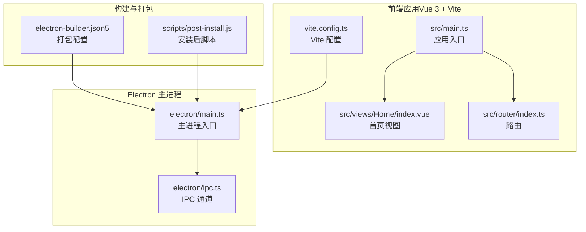
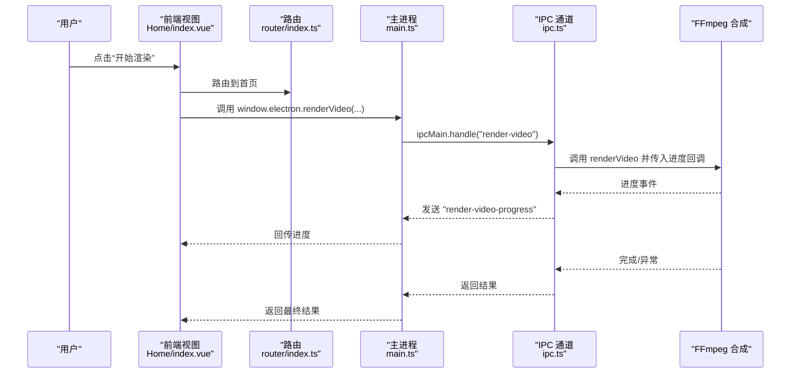
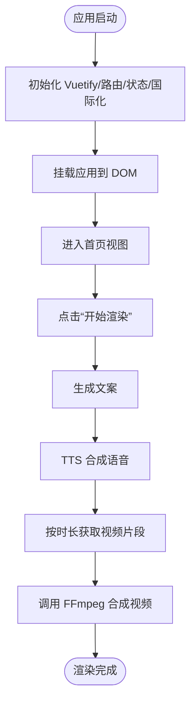
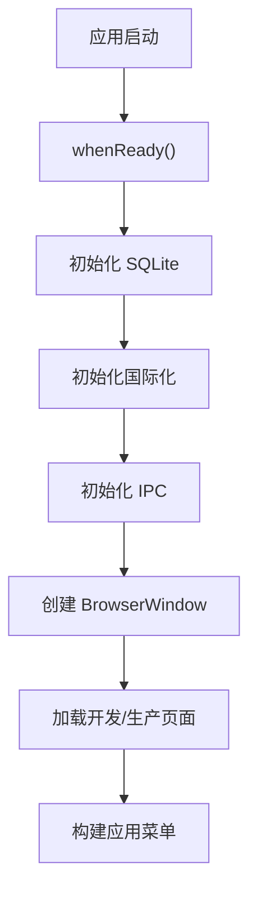
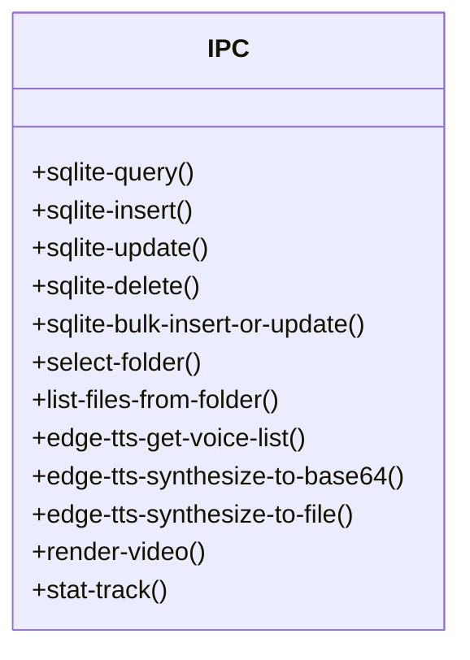
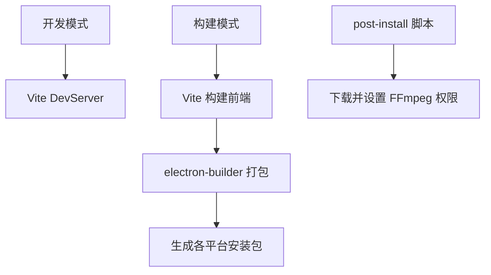
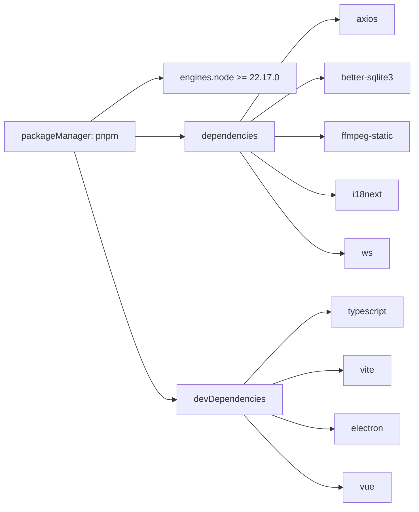

# 快速开始

<cite>
**本文引用的文件**
- [package.json](file://package.json)
- [README.md](file://README.md)
- [vite.config.ts](file://vite.config.ts)
- [tsconfig.json](file://tsconfig.json)
- [electron/main.ts](file://electron/main.ts)
- [electron/ipc.ts](file://electron/ipc.ts)
- [src/main.ts](file://src/main.ts)
- [src/views/Home/index.vue](file://src/views/Home/index.vue)
- [src/router/index.ts](file://src/router/index.ts)
- [scripts/post-install.js](file://scripts/post-install.js)
- [electron-builder.json5](file://electron-builder.json5)
</cite>

## 目录
1. [简介](#简介)
2. [项目结构](#项目结构)
3. [核心组件](#核心组件)
4. [架构总览](#架构总览)
5. [详细组件分析](#详细组件分析)
6. [依赖分析](#依赖分析)
7. [性能考虑](#性能考虑)
8. [故障排除指南](#故障排除指南)
9. [结论](#结论)
10. [附录](#附录)

## 简介
短视频工厂是一个基于 Electron + Vue 3 的跨平台桌面应用，目标是通过 AI 技术简化短视频制作流程。你只需准备提示词文本与视频分镜素材，即可一键生成高质量的营销与泛内容短视频。项目内置 AI 文案生成、语音合成、自动剪辑、字幕特效与批量处理能力，支持多语言与多平台部署。

## 项目结构
该工程采用“前端（Vue 3 + Vite）+ Electron 主进程 + IPC 通信”的典型架构，源码位于 src 目录，Electron 主进程与预加载逻辑位于 electron 目录，构建与打包配置集中在根目录的配置文件中。

图表来源
- [src/main.ts:1-62](file://src/main.ts#L1-L62)
- [src/views/Home/index.vue:1-244](file://src/views/Home/index.vue#L1-L244)
- [src/router/index.ts:1-22](file://src/router/index.ts#L1-L22)
- [vite.config.ts:1-53](file://vite.config.ts#L1-L53)
- [electron/main.ts:1-204](file://electron/main.ts#L1-L204)
- [electron/ipc.ts:1-188](file://electron/ipc.ts#L1-L188)
- [electron-builder.json5:1-46](file://electron-builder.json5#L1-L46)
- [scripts/post-install.js:1-19](file://scripts/post-install.js#L1-L19)

章节来源
- [package.json:1-85](file://package.json#L1-L85)
- [vite.config.ts:1-53](file://vite.config.ts#L1-L53)
- [electron/main.ts:1-204](file://electron/main.ts#L1-L204)

## 核心组件
- 应用入口与框架初始化：前端应用在入口文件中完成 Vuetify、路由、状态管理、国际化与全局插件的注册。
- 主进程与窗口：Electron 主进程负责创建窗口、构建菜单、初始化 IPC 与 SQLite、禁用 CORS 与启用跨站 Cookie。
- IPC 通道：提供文件夹选择、文件枚举、SQLite 操作、EdgeTTS 语音合成、视频渲染、统计事件上报等接口。
- 构建与打包：Vite 配置集成 Electron 插件；electron-builder 负责多平台产物打包与安装器生成；安装后脚本自动下载并设置 FFmpeg 权限。

章节来源
- [src/main.ts:1-62](file://src/main.ts#L1-L62)
- [electron/main.ts:1-204](file://electron/main.ts#L1-L204)
- [electron/ipc.ts:1-188](file://electron/ipc.ts#L1-L188)
- [vite.config.ts:1-53](file://vite.config.ts#L1-L53)
- [electron-builder.json5:1-46](file://electron-builder.json5#L1-L46)
- [scripts/post-install.js:1-19](file://scripts/post-install.js#L1-L19)

## 架构总览
下图展示了从用户操作到系统执行的关键交互链路：前端触发渲染流程，经由 IPC 到主进程，再调用 FFmpeg 进行视频合成，并通过进度事件回传到前端。

图表来源
- [src/views/Home/index.vue:65-177](file://src/views/Home/index.vue#L65-L177)
- [src/router/index.ts:1-22](file://src/router/index.ts#L1-L22)
- [electron/main.ts:71-75](file://electron/main.ts#L71-L75)
- [electron/ipc.ts:171-186](file://electron/ipc.ts#L171-L186)

## 详细组件分析

### 前端应用启动流程
- 入口文件完成 Vuetify、路由、状态管理、Toast、国际化初始化，并挂载应用。
- 首页视图组织三大功能区：文案生成、视频素材管理、TTS 控制与渲染控制。
- 用户点击“开始渲染”后，依次执行文案生成、TTS 合成、视频片段获取与最终视频渲染。

图表来源
- [src/main.ts:1-62](file://src/main.ts#L1-L62)
- [src/views/Home/index.vue:65-177](file://src/views/Home/index.vue#L65-L177)

章节来源
- [src/main.ts:1-62](file://src/main.ts#L1-L62)
- [src/views/Home/index.vue:1-244](file://src/views/Home/index.vue#L1-L244)

### Electron 主进程与窗口
- 主进程负责创建窗口、设置窗口行为、构建菜单、初始化 IPC 与 SQLite、禁用 CORS 与允许跨站请求携带 Cookie。
- 开发模式下加载 Vite DevServer，生产模式加载构建后的静态页面。

图表来源
- [electron/main.ts:187-204](file://electron/main.ts#L187-L204)
- [electron/main.ts:40-76](file://electron/main.ts#L40-L76)

章节来源
- [electron/main.ts:1-204](file://electron/main.ts#L1-L204)

### IPC 通道与功能
- 文件系统：选择文件夹、枚举文件夹内容。
- 数据库：SQLite 查询、插入、更新、删除、批量写入。
- 语音合成：EdgeTTS 语音列表、合成到 Base64、合成到文件。
- 视频渲染：接收参数与进度回调，支持取消渲染。
- 统计事件：上报应用使用事件。

图表来源
- [electron/ipc.ts:77-187](file://electron/ipc.ts#L77-L187)

章节来源
- [electron/ipc.ts:1-188](file://electron/ipc.ts#L1-L188)

### 构建与打包
- Vite 配置集成 Electron 插件，区分主进程与渲染进程，设置别名与构建参数。
- electron-builder 配置多平台产物、安装器类型与命名规则，禁用 npm 重建以复用预编译二进制。
- 安装后脚本自动下载 FFmpeg 并设置权限（非 Windows 平台）。

图表来源
- [vite.config.ts:10-41](file://vite.config.ts#L10-L41)
- [electron-builder.json5:1-46](file://electron-builder.json5#L1-L46)
- [scripts/post-install.js:1-19](file://scripts/post-install.js#L1-L19)

章节来源
- [vite.config.ts:1-53](file://vite.config.ts#L1-L53)
- [electron-builder.json5:1-46](file://electron-builder.json5#L1-L46)
- [scripts/post-install.js:1-19](file://scripts/post-install.js#L1-L19)

## 依赖分析
- 包管理器：项目强制使用 pnpm，并指定最低版本。
- Node.js 版本：要求 Node.js 版本满足 engines 字段。
- 依赖分类：运行时依赖（如 axios、better-sqlite3、ffmpeg-static、i18next、ws）、开发依赖（如 electron、electron-builder、vite、vue、typescript 等）。
- pnpm 专属配置：忽略某些原生模块的构建、仅重建特定依赖，减少安装与构建时间。

图表来源
- [package.json:79-83](file://package.json#L79-L83)
- [package.json:32-64](file://package.json#L32-L64)

章节来源
- [package.json:1-85](file://package.json#L1-L85)

## 性能考虑
- 构建体积与警告阈值：Vite 构建配置中设置了较大的体积警告阈值，便于大型项目管理。
- 依赖预构建：electron-builder 禁用 npm 重建，复用预编译二进制，缩短打包时间。
- FFmpeg 权限：安装后脚本为非 Windows 平台设置可执行权限，避免运行时权限问题导致的性能退化。

章节来源
- [vite.config.ts:48-51](file://vite.config.ts#L48-L51)
- [electron-builder.json5:10-11](file://electron-builder.json5#L10-L11)
- [scripts/post-install.js:12-18](file://scripts/post-install.js#L12-L18)

## 故障排除指南
- Node.js 版本不匹配
  - 现象：安装或运行时报错，提示 Node.js 版本过低。
  - 解决：升级 Node.js 至满足 engines 字段的版本。
  - 参考：[package.json:80-83](file://package.json#L80-L83)
- 包管理器不是 pnpm
  - 现象：preinstall 脚本阻止安装。
  - 解决：改用 pnpm 并确保版本满足 engines 字段。
  - 参考：[package.json:18](file://package.json#L18)
- FFmpeg 无法执行
  - 现象：渲染视频时报权限错误或找不到可执行文件。
  - 解决：确认 post-install 脚本已执行；非 Windows 平台检查 FFmpeg 权限是否被正确设置。
  - 参考：[scripts/post-install.js:6-18](file://scripts/post-install.js#L6-L18)
- 跨域与跨站 Cookie
  - 现象：请求受限或无法携带 Cookie。
  - 解决：主进程已禁用 CORS 并允许跨站请求携带 Cookie，无需额外配置。
  - 参考：[electron/main.ts:197-202](file://electron/main.ts#L197-L202)
- 渲染过程中断
  - 现象：用户取消渲染或中途异常。
  - 解决：前端监听取消事件并通过 IPC 通知主进程；主进程使用 AbortController 中断渲染。
  - 参考：[src/views/Home/index.vue:213-238](file://src/views/Home/index.vue#L213-L238), [electron/ipc.ts:178-186](file://electron/ipc.ts#L178-L186)
- 语言切换无效
  - 现象：菜单语言切换后界面未更新。
  - 解决：主进程监听语言变更并重建菜单；前端通过 IPC 接收语言变更并更新 Store。
  - 参考：[electron/main.ts:193-195](file://electron/main.ts#L193-L195), [src/main.ts:55-61](file://src/main.ts#L55-L61)

章节来源
- [package.json:18](file://package.json#L18)
- [package.json:80-83](file://package.json#L80-L83)
- [scripts/post-install.js:6-18](file://scripts/post-install.js#L6-L18)
- [electron/main.ts:197-202](file://electron/main.ts#L197-L202)
- [src/views/Home/index.vue:213-238](file://src/views/Home/index.vue#L213-L238)
- [electron/ipc.ts:178-186](file://electron/ipc.ts#L178-L186)
- [electron/main.ts:193-195](file://electron/main.ts#L193-L195)
- [src/main.ts:55-61](file://src/main.ts#L55-L61)

## 结论
通过本快速开始指南，你可以完成环境准备、依赖安装、开发与生产模式启动，并理解项目的核心流程与常见问题的解决方法。建议优先验证 Node.js 与 pnpm 版本、确保 FFmpeg 权限正确，然后在开发模式下运行项目，逐步熟悉界面与功能。

## 附录

### 环境要求与前置条件
- Node.js 版本：满足 engines 字段要求。
- 包管理器：pnpm，版本满足 engines 字段。
- 参考：[package.json:80-83](file://package.json#L80-L83), [package.json:79](file://package.json#L79)

章节来源
- [package.json:79-83](file://package.json#L79-L83)

### 依赖安装步骤
- 全局依赖：确保 Node.js 与 pnpm 版本满足要求。
- 项目依赖：使用 pnpm 安装，preinstall 会限制只能使用 pnpm。
- 安装后处理：post-install 脚本会自动下载 FFmpeg 并设置权限（非 Windows）。
- 参考：[package.json:18](file://package.json#L18), [scripts/post-install.js:6-18](file://scripts/post-install.js#L6-L18)

章节来源
- [package.json:18](file://package.json#L18)
- [scripts/post-install.js:6-18](file://scripts/post-install.js#L6-L18)

### 项目启动与运行
- 开发模式：运行开发服务器，前端热更新，Electron 加载 Vite DevServer。
- 生产模式：先构建前端与 Electron，再使用 electron-builder 打包。
- 参考：[package.json:13-16](file://package.json#L13-L16), [vite.config.ts:10-41](file://vite.config.ts#L10-L41), [electron-builder.json5:1-46](file://electron-builder.json5#L1-46)

章节来源
- [package.json:13-16](file://package.json#L13-L16)
- [vite.config.ts:10-41](file://vite.config.ts#L10-L41)
- [electron-builder.json5:1-46](file://electron-builder.json5#L1-L46)

### 基本使用流程与界面导航
- 首页布局分为三列：左侧文案生成、中间视频素材管理、右侧 TTS 控制与渲染控制。
- 渲染流程：填写输出文件名、输出路径与输出尺寸 → 开始渲染 → 文案生成 → TTS 合成 → 获取视频片段 → FFmpeg 合成 → 成功提示。
- 取消渲染：在渲染中可取消，主进程收到取消信号后中断。
- 参考：[src/views/Home/index.vue:7-28](file://src/views/Home/index.vue#L7-L28), [src/views/Home/index.vue:65-177](file://src/views/Home/index.vue#L65-L177), [src/router/index.ts:1-22](file://src/router/index.ts#L1-L22)

章节来源
- [src/views/Home/index.vue:7-28](file://src/views/Home/index.vue#L7-L28)
- [src/views/Home/index.vue:65-177](file://src/views/Home/index.vue#L65-L177)
- [src/router/index.ts:1-22](file://src/router/index.ts#L1-L22)