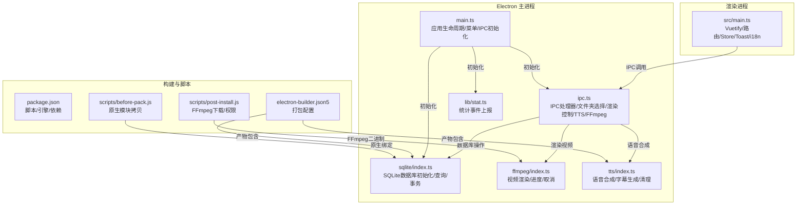
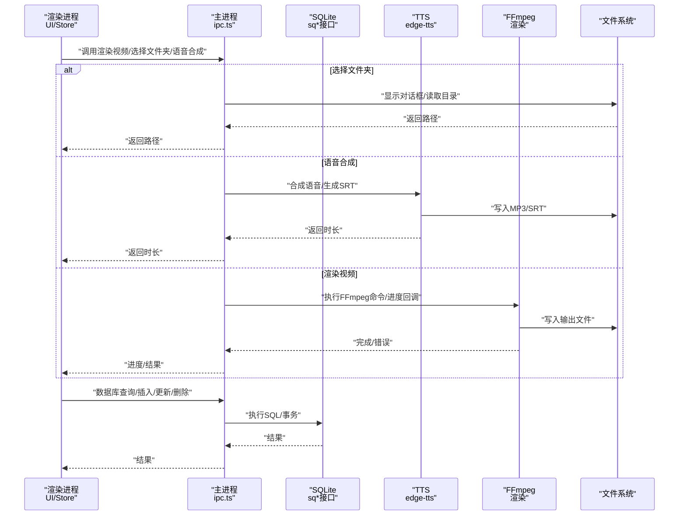
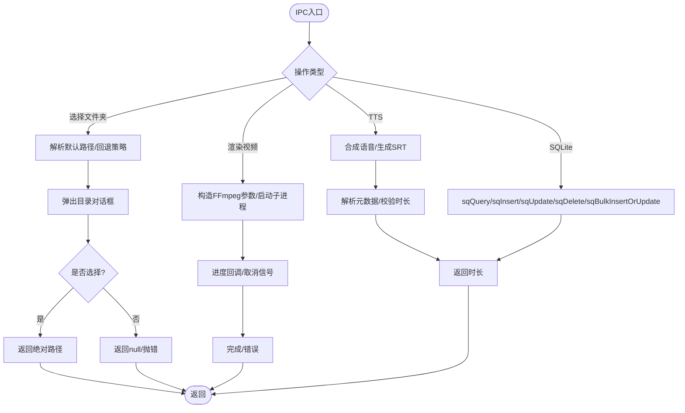
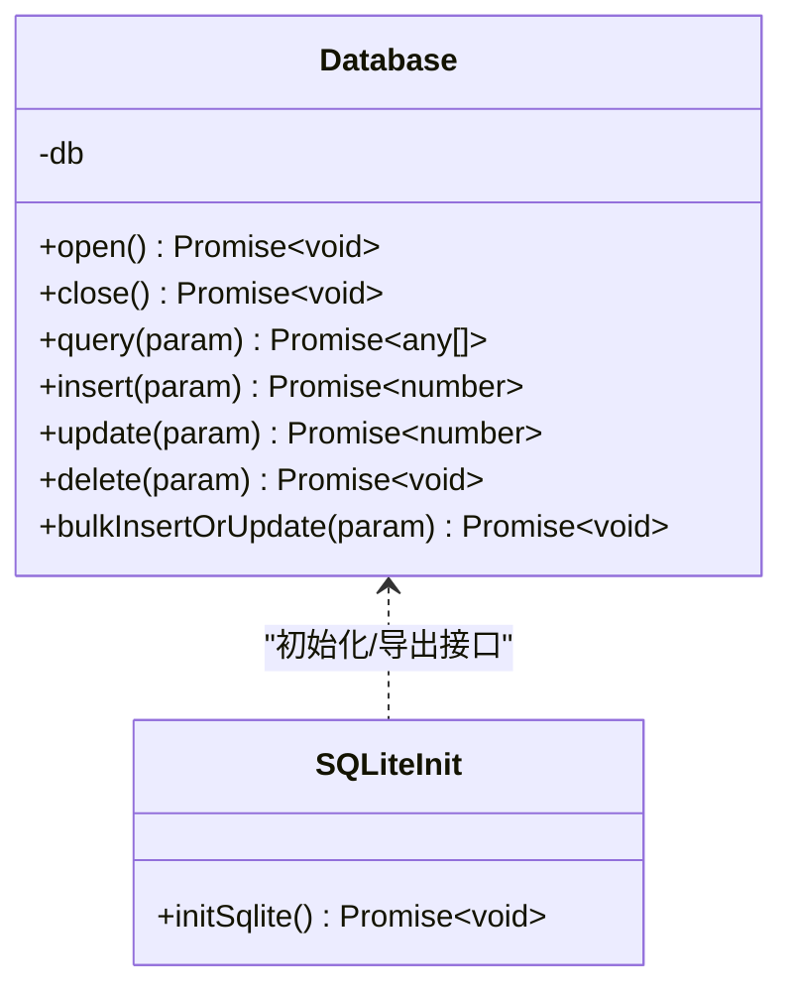
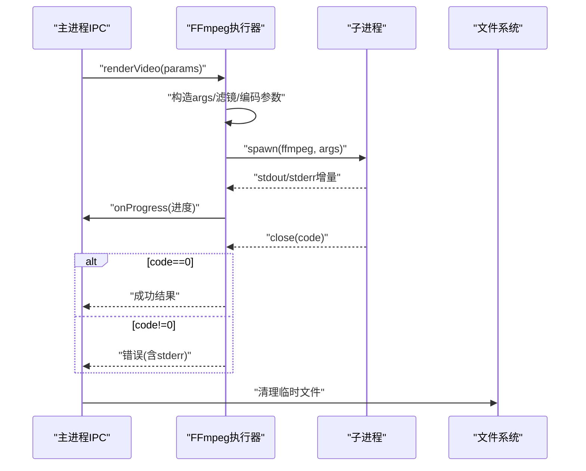
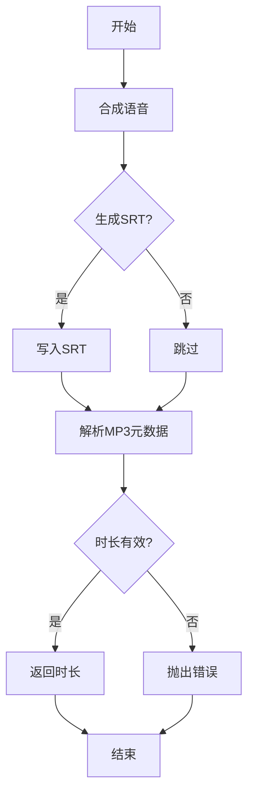
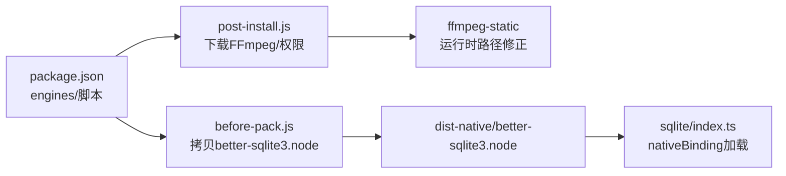

# 故障排除

<cite>
**本文引用的文件**
- [package.json](file://package.json)
- [README.md](file://README.md)
- [electron/main.ts](file://electron/main.ts)
- [src/main.ts](file://src/main.ts)
- [electron/ipc.ts](file://electron/ipc.ts)
- [electron/sqlite/index.ts](file://electron/sqlite/index.ts)
- [electron/ffmpeg/index.ts](file://electron/ffmpeg/index.ts)
- [electron/tts/index.ts](file://electron/tts/index.ts)
- [electron/lib/stat.ts](file://electron/lib/stat.ts)
- [scripts/post-install.js](file://scripts/post-install.js)
- [scripts/before-pack.js](file://scripts/before-pack.js)
- [electron-builder.json5](file://electron-builder.json5)
- [src/lib/error-copy.ts](file://src/lib/error-copy.ts)
</cite>

## 目录
1. [简介](#简介)
2. [项目结构](#项目结构)
3. [核心组件](#核心组件)
4. [架构总览](#架构总览)
5. [详细组件分析](#详细组件分析)
6. [依赖关系分析](#依赖关系分析)
7. [性能考虑](#性能考虑)
8. [故障排除指南](#故障排除指南)
9. [结论](#结论)
10. [附录](#附录)

## 简介
本指南面向“短视频工厂”项目的使用者与开发者，提供系统化的故障排除流程与方法。内容覆盖安装问题、运行时错误、性能问题、兼容性问题、错误日志分析、调试技巧、系统环境检查清单、依赖验证方法、错误代码含义与处理、跨平台特定问题、性能监控与诊断工具使用，以及问题报告的标准格式与信息收集要求。

## 项目结构
项目采用 Electron + Vue 3 前后端分离架构：
- Electron 主进程负责窗口、菜单、IPC、SQLite、FFmpeg、TTS、统计上报等
- 渲染进程负责 UI、路由、状态管理、国际化、Toast 提示等
- 构建与打包通过 electron-builder 配置，脚本负责下载/设置 FFmpeg、拷贝原生依赖

图表来源
- [electron/main.ts:187-204](file://electron/main.ts#L187-L204)
- [electron/ipc.ts:77-188](file://electron/ipc.ts#L77-L188)
- [electron/sqlite/index.ts:140-154](file://electron/sqlite/index.ts#L140-L154)
- [electron/ffmpeg/index.ts:26-186](file://electron/ffmpeg/index.ts#L26-L186)
- [electron/tts/index.ts:35-85](file://electron/tts/index.ts#L35-L85)
- [electron/lib/stat.ts:39-80](file://electron/lib/stat.ts#L39-L80)
- [src/main.ts:35-62](file://src/main.ts#L35-L62)
- [package.json:13-21](file://package.json#L13-L21)
- [electron-builder.json5:1-46](file://electron-builder.json5#L1-L46)
- [scripts/post-install.js:1-19](file://scripts/post-install.js#L1-L19)
- [scripts/before-pack.js:24-35](file://scripts/before-pack.js#L24-L35)

章节来源
- [package.json:1-85](file://package.json#L1-L85)
- [electron-builder.json5:1-46](file://electron-builder.json5#L1-L46)

## 核心组件
- 应用入口与生命周期：主进程初始化数据库、国际化、IPC、窗口；渲染进程初始化 UI 框架、路由、状态、Toast、国际化。
- IPC 层：封装 SQLite、窗口控制、文件夹选择、外部链接、TTS、FFmpeg 渲染、统计上报等。
- 数据层：SQLite 使用原生绑定，按平台/架构选择对应 .node 文件，数据库位于 userData 目录。
- 媒体处理：TTS 将文本转语音并生成 SRT 字幕；FFmpeg 负责复杂滤镜拼接、响度归一、混音、编码与进度回调。
- 构建与打包：electron-builder 配置产物、NSIS 安装器、AppImage、DMG；post-install 脚本下载 FFmpeg 并设置权限；before-pack 拷贝原生模块。

章节来源
- [electron/main.ts:187-204](file://electron/main.ts#L187-L204)
- [src/main.ts:35-62](file://src/main.ts#L35-L62)
- [electron/ipc.ts:77-188](file://electron/ipc.ts#L77-L188)
- [electron/sqlite/index.ts:140-154](file://electron/sqlite/index.ts#L140-L154)
- [electron/ffmpeg/index.ts:26-186](file://electron/ffmpeg/index.ts#L26-L186)
- [electron/tts/index.ts:35-85](file://electron/tts/index.ts#L35-L85)
- [scripts/post-install.js:1-19](file://scripts/post-install.js#L1-L19)
- [scripts/before-pack.js:24-35](file://scripts/before-pack.js#L24-L35)
- [electron-builder.json5:1-46](file://electron-builder.json5#L1-L46)

## 架构总览
下图展示从渲染进程发起任务到主进程处理、数据库与媒体处理的端到端流程。

图表来源
- [electron/ipc.ts:119-186](file://electron/ipc.ts#L119-L186)
- [electron/sqlite/index.ts:63-135](file://electron/sqlite/index.ts#L63-L135)
- [electron/tts/index.ts:39-85](file://electron/tts/index.ts#L39-L85)
- [electron/ffmpeg/index.ts:188-244](file://electron/ffmpeg/index.ts#L188-L244)

## 详细组件分析

### 组件A：IPC 与窗口控制
- 功能要点：SQLite CRUD、窗口最小化/最大化/关闭、选择文件夹、列出文件、外部链接、TTS、FFmpeg 渲染、统计上报。
- 错误处理：窗口句柄缺失、路径不可访问、对话框取消、渲染取消信号。
- 调试建议：监听渲染进程的进度事件；在主进程打印关键路径与参数；确认 Electron 对话框权限。

图表来源
- [electron/ipc.ts:119-186](file://electron/ipc.ts#L119-L186)

章节来源
- [electron/ipc.ts:77-188](file://electron/ipc.ts#L77-L188)

### 组件B：SQLite 数据库
- 初始化：根据平台/架构选择 better-sqlite3 原生绑定，数据库文件位于 userData 目录。
- 事务与并发：批量插入/更新使用事务，开启外键约束。
- 常见问题：原生绑定不匹配、数据库文件损坏、权限不足、路径不可访问。

图表来源
- [electron/sqlite/index.ts:38-154](file://electron/sqlite/index.ts#L38-L154)

章节来源
- [electron/sqlite/index.ts:140-154](file://electron/sqlite/index.ts#L140-L154)

### 组件C：FFmpeg 视频渲染
- 参数与流程：多路输入、复杂滤镜链、响度归一、混音、编码、进度解析、取消信号。
- 跨平台注意：Windows 可执行权限校验；asar 打包后路径修正。
- 常见问题：FFmpeg 未找到/无执行权限、输入路径不存在、编码失败、进度解析异常。

图表来源
- [electron/ffmpeg/index.ts:26-186](file://electron/ffmpeg/index.ts#L26-L186)
- [electron/ffmpeg/index.ts:188-244](file://electron/ffmpeg/index.ts#L188-L244)

章节来源
- [electron/ffmpeg/index.ts:246-272](file://electron/ffmpeg/index.ts#L246-L272)

### 组件D：TTS 语音合成
- 功能：合成语音、生成 MP3/SRT、解析音频时长、清理临时文件。
- 常见问题：网络/服务不可达、元数据解析失败、时长无效、输出路径不存在。

图表来源
- [electron/tts/index.ts:39-85](file://electron/tts/index.ts#L39-L85)

章节来源
- [electron/tts/index.ts:35-85](file://electron/tts/index.ts#L35-L85)

## 依赖关系分析
- Node 引擎与包管理器：要求 Node 版本与 pnpm 版本，postinstall 与 before-pack 脚本分别负责 FFmpeg 与原生模块。
- 二进制与权限：FFmpeg 通过静态二进制提供，post-install 脚本下载并设置权限；asar 打包后路径需解包访问。
- 原生模块：better-sqlite3 的 .node 文件按平台/架构拷贝至 dist-native，在运行时加载。

图表来源
- [package.json:80-83](file://package.json#L80-L83)
- [scripts/post-install.js:1-19](file://scripts/post-install.js#L1-L19)
- [scripts/before-pack.js:24-35](file://scripts/before-pack.js#L24-L35)
- [electron/sqlite/index.ts:25-31](file://electron/sqlite/index.ts#L25-L31)

章节来源
- [package.json:65-83](file://package.json#L65-L83)
- [scripts/post-install.js:1-19](file://scripts/post-install.js#L1-L19)
- [scripts/before-pack.js:24-35](file://scripts/before-pack.js#L24-L35)
- [electron/sqlite/index.ts:25-31](file://electron/sqlite/index.ts#L25-L31)

## 性能考虑
- FFmpeg 编码参数：使用 libx264 中等预设、CRF 23、AAC 128k、固定帧率，兼顾质量与速度。
- 响度归一与混音：对语音与背景音乐进行 loudnorm 归一，避免音量不均；amix 混合时以语音时长为主，减少截断。
- 进度与取消：通过子进程 stdout 解析进度，支持 AbortController 取消，避免长时间卡死。
- SQLite：批量插入使用事务，减少磁盘 IO；外键约束开启，保证一致性。

章节来源
- [electron/ffmpeg/index.ts:142-164](file://electron/ffmpeg/index.ts#L142-L164)
- [electron/ffmpeg/index.ts:100-133](file://electron/ffmpeg/index.ts#L100-L133)
- [electron/ffmpeg/index.ts:237-243](file://electron/ffmpeg/index.ts#L237-L243)
- [electron/sqlite/index.ts:125-134](file://electron/sqlite/index.ts#L125-L134)

## 故障排除指南

### 一、安装问题
- 症状：安装后无法启动、黑屏、白屏
  - 检查 Node 与 pnpm 版本是否满足要求
  - 确认 post-install 脚本是否成功下载并设置 FFmpeg 权限
  - 确认 before-pack 是否正确拷贝 better-sqlite3 原生模块
- 症状：打包产物缺少原生模块或 FFmpeg
  - 检查 electron-builder 配置 files 是否包含 dist-native 与 locales
  - 确认构建平台与架构映射是否正确
- 症状：asar 打包后 FFmpeg 无法执行
  - 确认运行时路径修正逻辑（asar 解包）
  - 确认 FFmpeg 可执行权限

章节来源
- [package.json:80-83](file://package.json#L80-L83)
- [scripts/post-install.js:1-19](file://scripts/post-install.js#L1-L19)
- [scripts/before-pack.js:24-35](file://scripts/before-pack.js#L24-L35)
- [electron-builder.json5:10-11](file://electron-builder.json5#L10-L11)
- [electron/ffmpeg/index.ts:12-14](file://electron/ffmpeg/index.ts#L12-L14)
- [electron/ffmpeg/index.ts:246-259](file://electron/ffmpeg/index.ts#L246-L259)

### 二、运行时错误
- 症状：选择文件夹失败/无响应
  - 检查窗口句柄是否存在
  - 检查默认路径与回退路径是否可访问
- 症状：渲染视频报错或卡住
  - 检查输入路径是否存在、可读
  - 检查 FFmpeg 是否可执行、权限是否正确
  - 检查输出目录是否存在、可写
  - 监听进度回调，确认是否被取消
- 症状：TTS 合成失败或时长无效
  - 检查网络连通性与服务可用性
  - 检查生成的 MP3/SRT 是否存在
  - 检查元数据解析是否成功
- 症状：SQLite 报错
  - 检查 better-sqlite3 原生绑定是否与 Electron 版本匹配
  - 检查数据库文件路径与权限
  - 检查外键约束与事务是否正确

章节来源
- [electron/ipc.ts:120-144](file://electron/ipc.ts#L120-L144)
- [electron/ffmpeg/index.ts:50-54](file://electron/ffmpeg/index.ts#L50-L54)
- [electron/ffmpeg/index.ts:246-259](file://electron/ffmpeg/index.ts#L246-L259)
- [electron/tts/index.ts:74-81](file://electron/tts/index.ts#L74-L81)
- [electron/sqlite/index.ts:42-44](file://electron/sqlite/index.ts#L42-L44)

### 三、性能问题
- 症状：渲染缓慢
  - 调整 FFmpeg 编码参数（预设、CRF、码率）
  - 减少滤镜复杂度或拆分任务
  - 分批处理大任务，避免内存峰值过高
- 症状：CPU/内存占用高
  - 检查是否有大量并发渲染任务
  - 使用取消信号及时中断无意义任务
- 症状：磁盘 IO 抖动
  - 控制临时文件数量与清理时机
  - 使用 SSD 或合适的存储介质

章节来源
- [electron/ffmpeg/index.ts:142-164](file://electron/ffmpeg/index.ts#L142-L164)
- [electron/ffmpeg/index.ts:237-243](file://electron/ffmpeg/index.ts#L237-L243)
- [electron/tts/index.ts:20-29](file://electron/tts/index.ts#L20-L29)

### 四、兼容性问题
- Windows
  - 注意可执行权限标志（X_OK）在 Windows 上可能不适用
  - 确保 FFmpeg 可执行文件存在且可运行
- macOS/Linux
  - 确认 FFmpeg 权限与路径
  - 确认原生模块 .node 与 Electron 版本匹配

章节来源
- [electron/ffmpeg/index.ts:246-259](file://electron/ffmpeg/index.ts#L246-L259)
- [scripts/post-install.js:12-18](file://scripts/post-install.js#L12-L18)
- [scripts/before-pack.js:30-34](file://scripts/before-pack.js#L30-L34)

### 五、错误日志分析与调试技巧
- 日志位置
  - 主进程控制台：数据库连接、FFmpeg 进程、TTS 元数据解析、统计上报
  - 渲染进程控制台：IPC 消息、国际化切换、Toast 提示
- 关键日志点
  - SQLite 初始化与错误：数据库路径、原生绑定路径
  - FFmpeg 进程：stderr 中的进度与错误信息
  - TTS：时长解析失败、SRT 写入
  - 统计上报：开发模式下失败会警告
- 调试技巧
  - 在渲染进程监听主进程消息与进度事件
  - 使用 AbortController 取消长时间任务
  - 使用错误复制工具生成标准化错误信息

章节来源
- [electron/sqlite/index.ts:33-36](file://electron/sqlite/index.ts#L33-L36)
- [electron/ffmpeg/index.ts:211-231](file://electron/ffmpeg/index.ts#L211-L231)
- [electron/tts/index.ts:74-76](file://electron/tts/index.ts#L74-L76)
- [electron/lib/stat.ts:75-79](file://electron/lib/stat.ts#L75-L79)
- [src/main.ts:51-60](file://src/main.ts#L51-L60)
- [src/lib/error-copy.ts:1-17](file://src/lib/error-copy.ts#L1-L17)

### 六、系统环境检查清单
- Node 与 pnpm
  - 版本满足 engines 要求
- 包管理与安装
  - 使用 pnpm 安装依赖
  - post-install 成功下载并设置 FFmpeg 权限
- 原生模块
  - before-pack 成功拷贝 better-sqlite3.node
  - 运行时 nativeBinding 路径正确
- FFmpeg
  - 可执行文件存在且可执行
  - asar 打包后路径修正生效
- 权限
  - 输出目录可写
  - 临时文件可读写
- 网络
  - TTS 服务可达
  - 统计上报接口可达（开发模式可禁用）

章节来源
- [package.json:80-83](file://package.json#L80-L83)
- [scripts/post-install.js:1-19](file://scripts/post-install.js#L1-L19)
- [scripts/before-pack.js:24-35](file://scripts/before-pack.js#L24-L35)
- [electron/ffmpeg/index.ts:12-14](file://electron/ffmpeg/index.ts#L12-L14)
- [electron/ffmpeg/index.ts:246-259](file://electron/ffmpeg/index.ts#L246-L259)
- [electron/lib/stat.ts:23-28](file://electron/lib/stat.ts#L23-L28)

### 七、依赖验证方法
- Node/pnpm 版本：核对 engines
- FFmpeg：执行前校验存在与权限
- better-sqlite3：确认 .node 文件存在且与平台/架构匹配
- electron-builder：确认产物包含 dist、dist-electron、dist-native、locales

章节来源
- [package.json:80-83](file://package.json#L80-L83)
- [electron/ffmpeg/index.ts:246-259](file://electron/ffmpeg/index.ts#L246-L259)
- [scripts/before-pack.js:30-34](file://scripts/before-pack.js#L30-L34)
- [electron-builder.json5:10-11](file://electron-builder.json5#L10-L11)

### 八、错误代码与含义
- FFmpeg 退出码非零
  - 含义：命令执行失败，stderr 中包含具体原因
  - 处理：检查输入路径、编码参数、磁盘空间
- FFmpeg 未找到/无执行权限
  - 含义：可执行文件缺失或权限不足
  - 处理：重新执行 post-install；设置权限；asar 路径修正
- SQLite 原生绑定不匹配
  - 含义：.node 文件与 Electron 版本不兼容
  - 处理：确认 before-pack 正确拷贝；升级/降级 Electron 或 better-sqlite3
- TTS 元数据解析失败/时长无效
  - 含义：生成的音频不可识别或网络异常
  - 处理：重试网络；检查 TTS 配置；确认输出文件存在

章节来源
- [electron/ffmpeg/index.ts:229-235](file://electron/ffmpeg/index.ts#L229-L235)
- [electron/ffmpeg/index.ts:246-259](file://electron/ffmpeg/index.ts#L246-L259)
- [electron/sqlite/index.ts:42-44](file://electron/sqlite/index.ts#L42-L44)
- [electron/tts/index.ts:74-81](file://electron/tts/index.ts#L74-L81)

### 九、跨平台特定问题与解决方案
- Windows
  - 可执行权限标志不适用；确保 FFmpeg 存在且可运行
  - asar 打包后路径修正
- macOS
  - universal 架构 DMG 安装器；确保签名与权限
- Linux
  - AppImage 安装器；确保 FFmpeg 权限与路径

章节来源
- [electron/ffmpeg/index.ts:12-14](file://electron/ffmpeg/index.ts#L12-L14)
- [electron-builder.json5:13-22](file://electron-builder.json5#L13-L22)
- [electron-builder.json5:39-43](file://electron-builder.json5#L39-L43)

### 十、性能监控与诊断工具使用
- FFmpeg 进度
  - 通过 stdout 增量解析 time 行，实时更新进度
- 取消机制
  - 使用 AbortController 发送 SIGTERM 中断渲染
- 统计上报
  - 生产环境默认启用；开发模式可通过环境变量控制
- 日志
  - 主/渲染进程控制台输出关键信息，便于定位问题

章节来源
- [electron/ffmpeg/index.ts:261-271](file://electron/ffmpeg/index.ts#L261-L271)
- [electron/ffmpeg/index.ts:237-243](file://electron/ffmpeg/index.ts#L237-L243)
- [electron/lib/stat.ts:23-28](file://electron/lib/stat.ts#L23-L28)
- [electron/main.ts:63-69](file://electron/main.ts#L63-L69)

### 十一、问题报告标准格式
- 基本信息
  - 版本号、操作系统、架构
  - Node/pnpm 版本
- 复现步骤
  - 详细描述操作流程与触发条件
- 日志与截图
  - 主/渲染进程控制台日志
  - FFmpeg stderr 截图
  - 错误弹窗截图
- 期望与实际
  - 期望行为 vs 实际行为
- 附加信息
  - 输入文件列表、输出目录、网络环境
  - 是否可复现、复现概率

章节来源
- [src/lib/error-copy.ts:1-17](file://src/lib/error-copy.ts#L1-L17)

## 结论
本指南提供了从安装、运行、性能到兼容性的全栈故障排除方法，并结合项目实际代码路径给出定位与解决思路。建议在排查过程中优先核对环境与依赖、关注关键日志点、利用进度与取消机制提升诊断效率。

## 附录

### A. 常见问题速查表
- 安装阶段
  - Node/pnpm 版本不符 → 升级/降级至要求范围
  - post-install 失败 → 检查网络与 FFmpeg 镜像源
  - before-pack 缺失原生模块 → 检查平台/架构映射
- 运行阶段
  - 选择文件夹无响应 → 检查窗口句柄与默认路径
  - 渲染失败 → 检查输入/输出路径、权限、FFmpeg
  - TTS 时长无效 → 检查网络与元数据解析
  - SQLite 报错 → 检查原生绑定与数据库文件

章节来源
- [package.json:80-83](file://package.json#L80-L83)
- [scripts/post-install.js:1-19](file://scripts/post-install.js#L1-L19)
- [scripts/before-pack.js:24-35](file://scripts/before-pack.js#L24-L35)
- [electron/ipc.ts:120-144](file://electron/ipc.ts#L120-L144)
- [electron/ffmpeg/index.ts:50-54](file://electron/ffmpeg/index.ts#L50-L54)
- [electron/tts/index.ts:74-81](file://electron/tts/index.ts#L74-L81)
- [electron/sqlite/index.ts:42-44](file://electron/sqlite/index.ts#L42-L44)