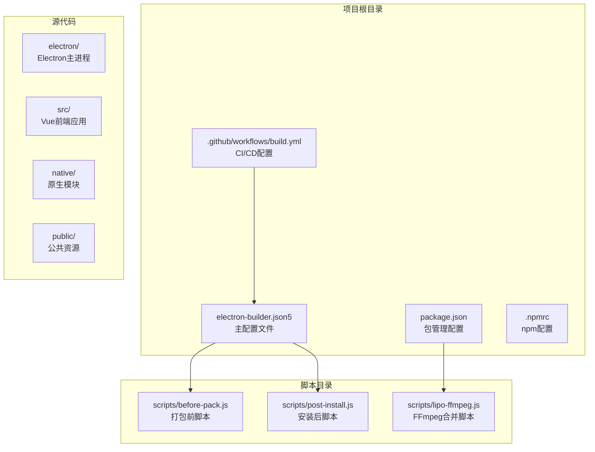
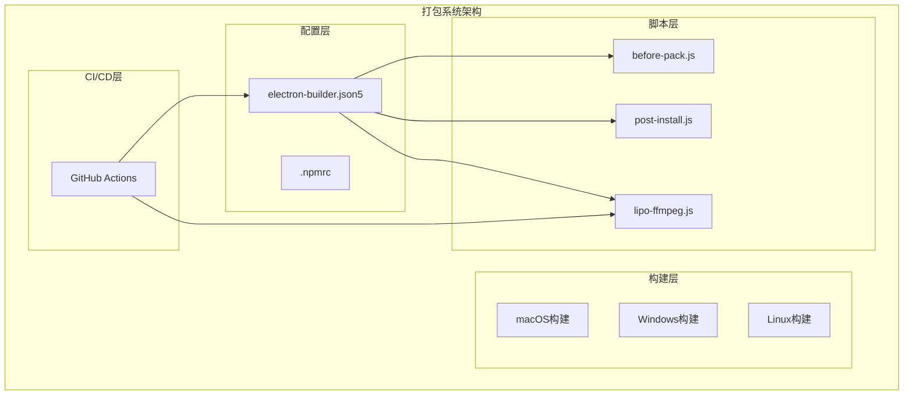
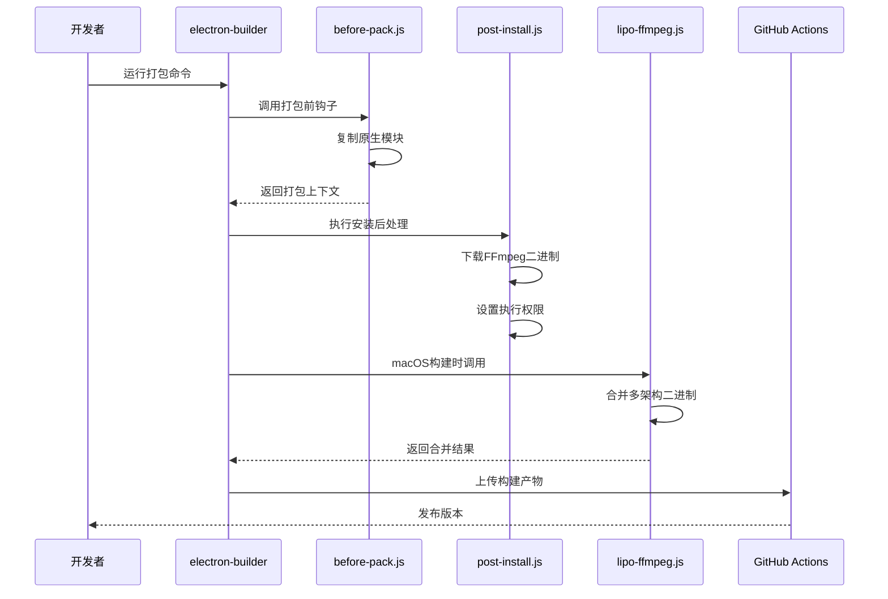
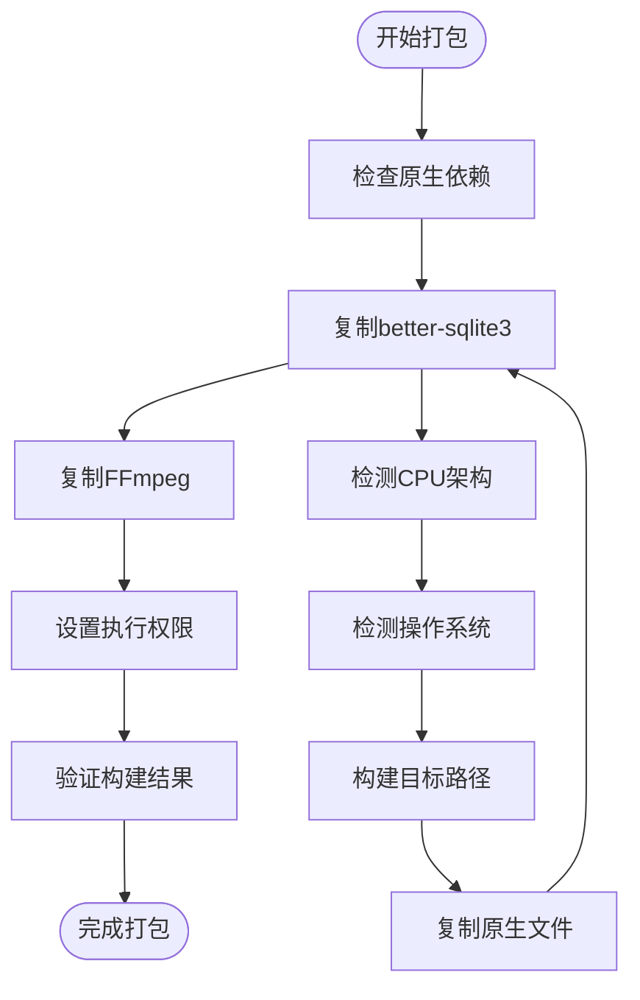
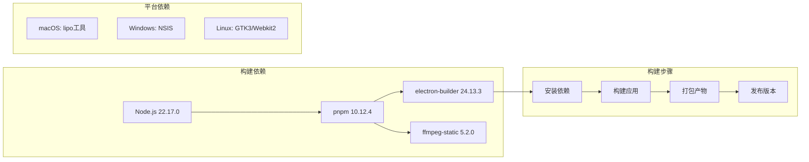

# Electron打包配置

<cite>
**本文档引用的文件**
- [electron-builder.json5](file://electron-builder.json5)
- [before-pack.js](file://scripts/before-pack.js)
- [post-install.js](file://scripts/post-install.js)
- [lipo-ffmpeg.js](file://scripts/lipo-ffmpeg.js)
- [package.json](file://package.json)
- [.github/workflows/build.yml](file://.github/workflows/build.yml)
- [.npmrc](file://.npmrc)
</cite>

## 目录
1. [简介](#简介)
2. [项目结构](#项目结构)
3. [核心组件](#核心组件)
4. [架构概览](#架构概览)
5. [详细组件分析](#详细组件分析)
6. [依赖关系分析](#依赖关系分析)
7. [性能考虑](#性能考虑)
8. [故障排除指南](#故障排除指南)
9. [结论](#结论)

## 简介

本文档提供了该Electron应用打包配置的完整指南。该应用是一个AI驱动的短视频工厂工具，支持Windows、macOS和Linux三大平台。项目采用了现代化的打包策略，包括原生依赖处理、asar打包、多平台构建以及自动化CI/CD流程。

## 项目结构

该项目采用模块化的项目结构，主要包含以下关键目录：

**图表来源**
- [electron-builder.json5:1-46](file://electron-builder.json5#L1-L46)
- [package.json:1-85](file://package.json#L1-L85)

**章节来源**
- [electron-builder.json5:1-46](file://electron-builder.json5#L1-L46)
- [package.json:1-85](file://package.json#L1-L85)

## 核心组件

### 主配置文件分析

electron-builder.json5是整个打包系统的核心配置文件，定义了应用元数据、构建目标、图标设置和平台特定配置。

#### 应用元数据配置

配置文件包含了完整的应用标识信息：
- **productName**: 应用显示名称"短视频工厂"
- **appId**: 应用唯一标识符"com.yils.short-video-factory"
- **version**: 版本号从package.json继承

#### 构建配置

- **asar打包**: 启用asar压缩以提高安全性
- **directories.output**: 输出目录结构为'release/${version}'
- **files**: 指定需要打包的文件和目录
- **npmRebuild**: 禁用重新构建，使用预构建的二进制文件

#### 平台特定配置

每个平台都有独立的配置块，包括目标类型、产物命名规则和图标路径。

**章节来源**
- [electron-builder.json5:1-46](file://electron-builder.json5#L1-L46)

### 打包前脚本

before-pack.js负责在打包过程中复制原生依赖到最终包中，特别是better-sqlite3的原生模块。

#### 原生模块处理机制

脚本实现了动态架构检测和文件复制功能：
- 架构映射表支持多种CPU架构
- 动态路径构建确保正确的原生模块选择
- 错误处理确保开发过程中的及时反馈

#### FFmpeg集成

虽然当前配置中未直接使用，但脚本为FFmpeg的原生集成预留了接口。

**章节来源**
- [before-pack.js:1-36](file://scripts/before-pack.js#L1-L36)

### 安装后脚本

post-install.js在npm安装后自动处理FFmpeg的下载和权限设置。

#### FFmpeg自动化处理

脚本实现了跨平台的FFmpeg处理流程：
- 环境变量传递支持自定义下载源
- 权限设置确保非Windows平台的可执行性
- 错误处理和日志记录

#### 架构特定处理

针对不同平台进行差异化处理，确保FFmpeg在所有目标平台上的正常运行。

**章节来源**
- [post-install.js:1-19](file://scripts/post-install.js#L1-L19)

### FFmpeg合并脚本

lipo-ffmpeg.js专门处理macOS的Universal二进制合并。

#### 多架构支持

脚本支持同时构建和合并x64和arm64架构：
- 环境变量配置自定义下载源
- 分别构建不同架构的二进制文件
- 使用lipo工具合并为Universal二进制

#### CI/CD集成

与GitHub Actions工作流深度集成，支持自动化构建流程。

**章节来源**
- [lipo-ffmpeg.js:1-49](file://scripts/lipo-ffmpeg.js#L1-L49)

## 架构概览

整个打包系统采用分层架构设计，确保各组件职责清晰、相互独立。

**图表来源**
- [electron-builder.json5:1-46](file://electron-builder.json5#L1-L46)
- [.github/workflows/build.yml:1-90](file://.github/workflows/build.yml#L1-L90)

## 详细组件分析

### 打包流程序列图

**图表来源**
- [electron-builder.json5:10-12](file://electron-builder.json5#L10-L12)
- [post-install.js:6-18](file://scripts/post-install.js#L6-L18)
- [lipo-ffmpeg.js:32-43](file://scripts/lipo-ffmpeg.js#L32-L43)

### 平台特定配置分析

#### macOS配置特点

- **目标类型**: dmg安装包，支持universal架构
- **产物命名**: 包含架构信息的详细命名
- **图标设置**: 使用统一的PNG图标资源

#### Windows配置特点

- **目标类型**: NSIS安装器
- **NSIS配置**: 中文界面、允许自定义安装路径
- **产物命名**: Windows专用命名规范

#### Linux配置特点

- **目标类型**: AppImage格式
- **依赖要求**: 需要GTK3和Webkit2依赖
- **权限设置**: 自动设置执行权限

**章节来源**
- [electron-builder.json5:13-43](file://electron-builder.json5#L13-L43)

### 原生依赖处理机制

**图表来源**
- [before-pack.js:24-35](file://scripts/before-pack.js#L24-L35)
- [post-install.js:12-18](file://scripts/post-install.js#L12-L18)

**章节来源**
- [before-pack.js:12-35](file://scripts/before-pack.js#L12-L35)
- [post-install.js:12-18](file://scripts/post-install.js#L12-L18)

## 依赖关系分析

### 包管理配置

项目使用pnpm作为包管理器，并配置了特殊的依赖处理策略：

#### 依赖忽略策略

- **ignoredBuiltDependencies**: better-sqlite3、ffmpeg-static
- **onlyBuiltDependencies**: 仅对特定包进行构建

#### 版本要求

- **Node.js**: >=22.17.0
- **pnpm**: >=10.12.4

### CI/CD依赖链

**图表来源**
- [.github/workflows/build.yml:20-28](file://.github/workflows/build.yml#L20-L28)
- [package.json:80-83](file://package.json#L80-L83)

**章节来源**
- [package.json:65-78](file://package.json#L65-L78)
- [.github/workflows/build.yml:20-57](file://.github/workflows/build.yml#L20-L57)

## 性能考虑

### 打包性能优化

1. **asar压缩**: 启用asar可以减少文件数量，提高加载速度
2. **原生模块缓存**: 使用预构建的原生模块避免重复编译
3. **增量构建**: CI/CD中利用缓存机制加速构建过程

### 内存使用优化

- **FFmpeg二进制大小**: 通过lipo合并减少不必要的重复
- **依赖精简**: 仅包含必要的依赖项
- **资源优化**: 图标和静态资源的合理组织

### 并行构建策略

GitHub Actions配置了矩阵构建，可以在多个平台上并行执行构建任务。

## 故障排除指南

### 常见问题及解决方案

#### 原生模块加载失败

**症状**: 应用启动时报错，提示找不到原生模块
**解决方案**: 
1. 检查before-pack.js是否正确复制了原生模块
2. 验证目标平台和架构匹配
3. 确认dist-native目录存在且权限正确

#### FFmpeg权限问题

**症状**: 非Windows平台无法执行FFmpeg
**解决方案**:
1. 检查post-install.js是否正确设置执行权限
2. 验证FFmpeg二进制文件的完整性
3. 确认环境变量FFMPEG_BINARIES_URL配置正确

#### CI/CD构建失败

**症状**: GitHub Actions构建过程中断
**解决方案**:
1. 检查平台特定的依赖安装
2. 验证环境变量配置
3. 确认构建参数正确传递

### 调试技巧

1. **启用调试模式**: 设置DEBUG=electron-builder环境变量
2. **检查日志输出**: 关注脚本执行过程中的错误信息
3. **验证文件完整性**: 确保所有必需文件都已正确打包

**章节来源**
- [before-pack.js:15-17](file://scripts/before-pack.js#L15-L17)
- [post-install.js:6-18](file://scripts/post-install.js#L6-L18)
- [.github/workflows/build.yml:39-40](file://.github/workflows/build.yml#L39-L40)

## 结论

该Electron应用的打包配置展现了现代桌面应用开发的最佳实践。通过精心设计的配置文件、自动化脚本和CI/CD流程，实现了跨平台的一致性和可靠性。

### 主要优势

1. **跨平台一致性**: 统一的配置管理确保各平台表现一致
2. **自动化程度高**: 从依赖安装到最终发布的全流程自动化
3. **原生支持完善**: 原生模块和FFmpeg的处理方案成熟可靠
4. **性能优化到位**: asar压缩和原生模块缓存提升应用性能

### 改进建议

1. **签名验证**: 可以添加代码签名配置以增强安全性
2. **增量更新**: 实现应用的增量更新机制
3. **测试覆盖**: 增加自动化测试确保打包质量
4. **文档完善**: 为开发者提供更详细的配置说明

该配置体系为类似Electron应用的打包提供了优秀的参考模板，涵盖了从基础配置到高级特性的各个方面。