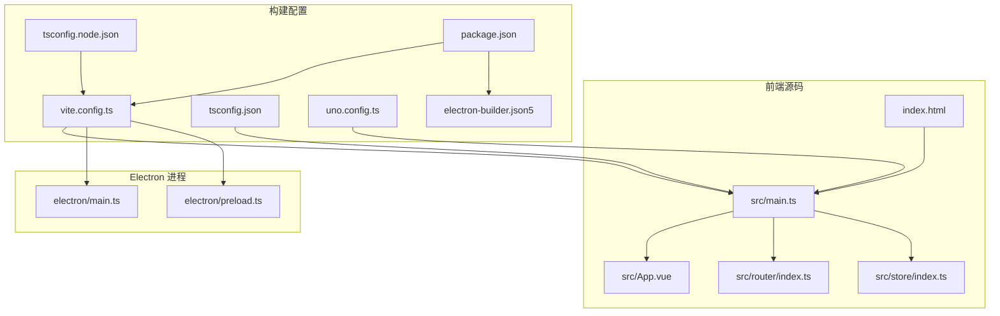
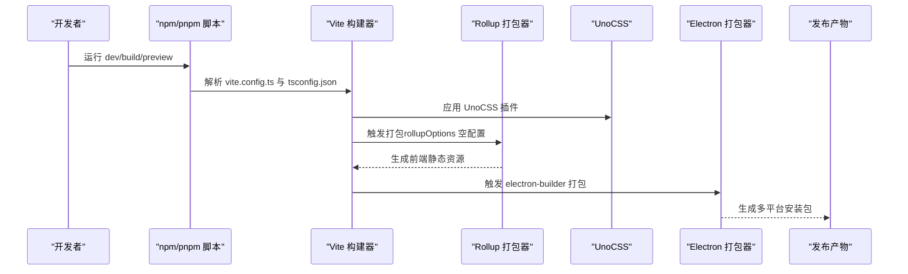
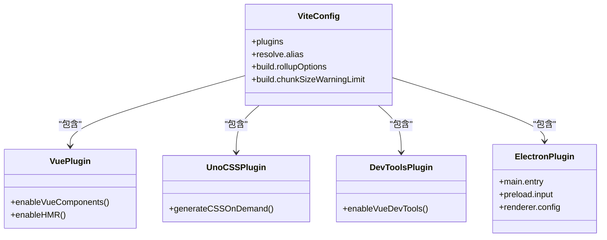
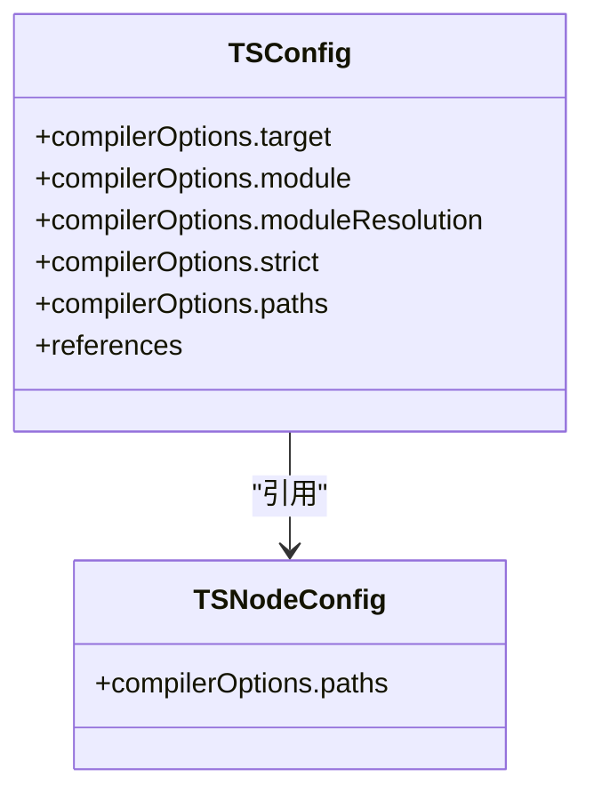
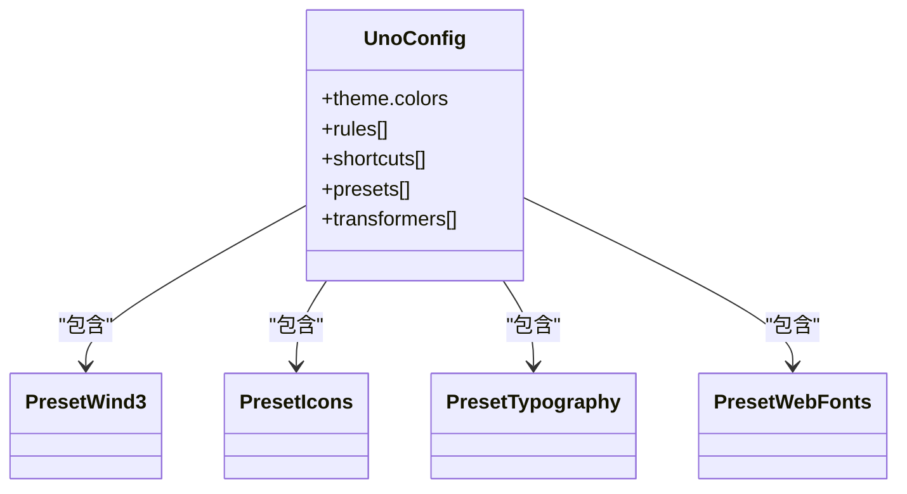
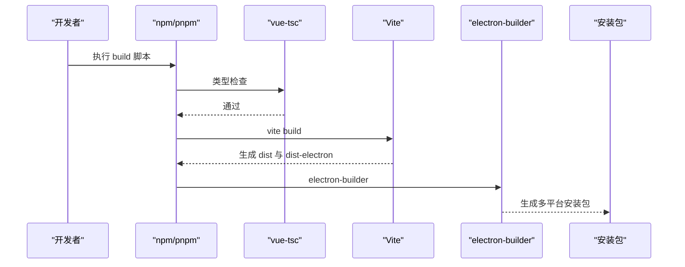
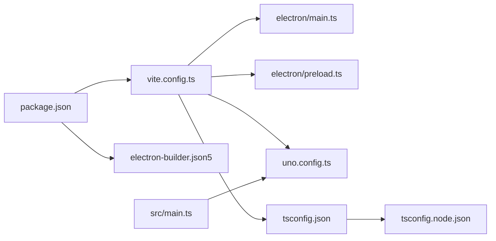

# 前端构建配置

<cite>
**本文引用的文件列表**
- [vite.config.ts](file://vite.config.ts)
- [tsconfig.json](file://tsconfig.json)
- [tsconfig.node.json](file://tsconfig.node.json)
- [uno.config.ts](file://uno.config.ts)
- [package.json](file://package.json)
- [electron-builder.json5](file://electron-builder.json5)
- [scripts/post-install.js](file://scripts/post-install.js)
- [src/main.ts](file://src/main.ts)
- [src/App.vue](file://src/App.vue)
- [src/router/index.ts](file://src/router/index.ts)
- [src/store/index.ts](file://src/store/index.ts)
- [index.html](file://index.html)
- [electron/main.ts](file://electron/main.ts)
- [electron/preload.ts](file://electron/preload.ts)
</cite>

## 目录
1. [简介](#简介)
2. [项目结构](#项目结构)
3. [核心组件](#核心组件)
4. [架构总览](#架构总览)
5. [详细组件分析](#详细组件分析)
6. [依赖关系分析](#依赖关系分析)
7. [性能考量](#性能考量)
8. [故障排查指南](#故障排查指南)
9. [结论](#结论)
10. [附录](#附录)

## 简介
本文件系统性梳理本项目的前端构建配置，重点覆盖：
- Vite 配置：插件体系（Vue、UnoCSS、开发工具）、路径别名、构建优化、Rollup 打包配置、chunk 大小限制、开发服务器行为
- TypeScript 配置：编译目标、模块解析、严格模式、路径映射、引用关系
- 开发与生产差异：环境变量、构建流程、产物目录与打包策略
- 性能优化建议与常见问题处理

## 项目结构
本项目采用 Vite + Vue 3 + Electron 的混合架构，前端代码位于 src 目录，Electron 主进程与预加载脚本位于 electron 目录；构建脚本通过 package.json 中的 scripts 调用 Vite 与 electron-builder 完成打包。

图表来源
- [vite.config.ts:1-53](file://vite.config.ts#L1-L53)
- [tsconfig.json:1-32](file://tsconfig.json#L1-L32)
- [tsconfig.node.json:1-16](file://tsconfig.node.json#L1-L16)
- [uno.config.ts:1-45](file://uno.config.ts#L1-L45)
- [package.json:1-85](file://package.json#L1-L85)
- [electron-builder.json5:1-46](file://electron-builder.json5#L1-L46)
- [src/main.ts:1-62](file://src/main.ts#L1-L62)
- [src/App.vue:1-12](file://src/App.vue#L1-L12)
- [src/router/index.ts:1-22](file://src/router/index.ts#L1-L22)
- [src/store/index.ts:1-9](file://src/store/index.ts#L1-L9)
- [index.html:1-15](file://index.html#L1-L15)
- [electron/main.ts:1-204](file://electron/main.ts#L1-L204)
- [electron/preload.ts:1-75](file://electron/preload.ts#L1-L75)

章节来源
- [vite.config.ts:1-53](file://vite.config.ts#L1-L53)
- [package.json:13-21](file://package.json#L13-L21)

## 核心组件
- Vite 插件体系
  - Vue 插件：支持 .vue 单文件组件与热更新
  - UnoCSS 插件：原子化 CSS 框架，按需生成样式
  - 开发工具插件：Vue DevTools 支持
  - Electron 插件：集成主进程、预加载脚本与渲染器的构建与运行
- 路径别名
  - @ 指向 src 目录
  - ~ 指向项目根目录
- 构建优化
  - RollupOptions 空对象占位，便于后续扩展
  - chunkSizeWarningLimit 提升警告阈值以适应较大体积
- TypeScript 配置
  - 编译目标 ES2020，模块解析 bundler，严格模式开启
  - 路径映射与引用关系指向 tsconfig.node.json
- Electron 打包
  - electron-builder.json5 定义多平台产物与安装器参数
  - post-install.js 在安装时下载并设置 ffmpeg 权限

章节来源
- [vite.config.ts:10-52](file://vite.config.ts#L10-L52)
- [tsconfig.json:20-23](file://tsconfig.json#L20-L23)
- [tsconfig.node.json:9-12](file://tsconfig.node.json#L9-L12)
- [electron-builder.json5:1-46](file://electron-builder.json5#L1-L46)
- [scripts/post-install.js:1-19](file://scripts/post-install.js#L1-L19)

## 架构总览
下图展示从开发到生产的整体流程，以及各配置文件之间的协作关系。

图表来源
- [vite.config.ts:10-52](file://vite.config.ts#L10-L52)
- [tsconfig.json:1-32](file://tsconfig.json#L1-L32)
- [electron-builder.json5:1-46](file://electron-builder.json5#L1-L46)
- [package.json:13-21](file://package.json#L13-L21)

## 详细组件分析

### Vite 配置详解
- 插件配置
  - Vue 插件：启用 .vue 组件与热更新
  - UnoCSS 插件：按需生成样式，减少运行时开销
  - 开发工具插件：提供 Vue DevTools 能力
  - Electron 插件：主进程入口为 electron/main.ts，预加载入口为 electron/preload.ts；渲染器在非测试环境下启用
- 路径别名
  - @ 指向 src
  - ~ 指向项目根
- 构建优化
  - rollupOptions 留空，便于后续扩展
  - chunkSizeWarningLimit 设为 2048KB，避免大体积 chunk 导致频繁警告
- 开发服务器
  - 通过 Vite 默认行为提供 HMR 与本地服务

章节来源
- [vite.config.ts:10-52](file://vite.config.ts#L10-L52)
- [electron/main.ts:31-36](file://electron/main.ts#L31-L36)

#### 类图：Vite 插件与 Electron 集成

图表来源
- [vite.config.ts:10-41](file://vite.config.ts#L10-L41)

### TypeScript 配置详解
- 编译目标与模块解析
  - 目标：ES2020
  - 模块：ESNext
  - 模块解析：bundler（与 Vite 配合）
- 严格模式与类型检查
  - 严格模式开启，未使用局部变量/参数、switch 不可穿透等规则启用
- 路径映射
  - @/* 映射到 src/*
  - ~/* 映射到项目根
- 引用关系
  - 引用 tsconfig.node.json，确保 Vite 配置文件的类型正确解析

章节来源
- [tsconfig.json:1-32](file://tsconfig.json#L1-L32)
- [tsconfig.node.json:1-16](file://tsconfig.node.json#L1-L16)

#### 类图：TS 配置与路径映射

图表来源
- [tsconfig.json:1-32](file://tsconfig.json#L1-L32)
- [tsconfig.node.json:1-16](file://tsconfig.node.json#L1-L16)

### UnoCSS 配置详解
- 预设与规则
  - Wind3、Icons、Typography、WebFonts 等预设
  - 自定义规则：窗口拖拽区域、禁用拖拽区域等
- 变换器
  - 指令与变体组变换器，提升类名组合灵活性
- 主题与快捷方式
  - 定义主题颜色与常用快捷类

章节来源
- [uno.config.ts:1-45](file://uno.config.ts#L1-L45)

#### 类图：UnoCSS 预设与规则

图表来源
- [uno.config.ts:11-44](file://uno.config.ts#L11-L44)

### Electron 打包与脚本
- 构建脚本
  - dev：启用 CJS 忽略警告，启动 Vite 开发服务器
  - build：先进行类型检查，再执行 Vite 构建并调用 electron-builder
  - preview：本地预览构建产物
- 打包配置
  - asar 启用，输出目录 release/${version}
  - 多平台安装器：mac dmg（universal）、win nsis、linux AppImage
  - NSIS 中文语言、自定义安装路径等
- 安装后处理
  - post-install.js 下载 ffmpeg 并设置权限（非 Windows）

章节来源
- [package.json:13-21](file://package.json#L13-L21)
- [electron-builder.json5:1-46](file://electron-builder.json5#L1-L46)
- [scripts/post-install.js:1-19](file://scripts/post-install.js#L1-L19)

#### 序列图：构建与打包流程

图表来源
- [package.json:15](file://package.json#L15)
- [electron-builder.json5:1-46](file://electron-builder.json5#L1-L46)

### 开发与生产差异
- 开发环境
  - 通过 Vite 提供 HMR 与本地服务
  - Electron 渲染器在非测试环境下启用
- 生产环境
  - 构建产物由 Vite 输出至 dist 与 dist-electron
  - electron-builder 将 dist、dist-electron、dist-native、locales 等文件打包为安装包
- 路径别名与模块解析
  - 开发与生产均使用 bundler 模式，保证与 Vite 的一致行为

章节来源
- [vite.config.ts:36-40](file://vite.config.ts#L36-L40)
- [electron-builder.json5:10](file://electron-builder.json5#L10)
- [tsconfig.json:9](file://tsconfig.json#L9)

## 依赖关系分析
- Vite 与 Electron 的耦合点
  - electron/main.ts 通过 Vite 环境变量加载开发或生产页面
  - vite.config.ts 的 electron 插件负责主进程与预加载脚本的构建
- TypeScript 与 Vite 的协同
  - tsconfig.json 与 tsconfig.node.json 分别服务于应用与 Vite 配置文件
- UnoCSS 与前端样式
  - 通过虚拟模块 virtual:uno.css 注入样式，减少运行时开销

图表来源
- [vite.config.ts:10-41](file://vite.config.ts#L10-L41)
- [tsconfig.json:26-30](file://tsconfig.json#L26-L30)
- [tsconfig.node.json:14](file://tsconfig.node.json#L14)
- [uno.config.ts:11](file://uno.config.ts#L11)
- [package.json:13-21](file://package.json#L13-L21)
- [electron-builder.json5:1-46](file://electron-builder.json5#L1-L46)
- [src/main.ts:11](file://src/main.ts#L11)

## 性能考量
- 构建体积控制
  - 当前 chunkSizeWarningLimit 设置为 2048KB，适合大型 Electron 应用
  - 如需进一步优化，可在 rollupOptions 中配置 splitChunks 或 external 外部依赖
- 依赖外部化
  - vite.config.ts 中对 better-sqlite3 进行 external，避免将其打包进渲染器，降低体积
- UnoCSS 按需生成
  - 仅生成实际使用的样式，减少运行时体积
- 模块解析与缓存
  - 使用 bundler 模式与路径映射，提升类型检查与打包速度
- 资源与安装器
  - asar 启用提升安全性与加载效率；NSIS 自定义安装路径减少二次安装成本

章节来源
- [vite.config.ts:22](file://vite.config.ts#L22)
- [electron-builder.json5:6](file://electron-builder.json5#L6)

## 故障排查指南
- 构建失败或类型错误
  - 确认已先执行类型检查（build 脚本已内置 vue-tsc）
  - 检查 tsconfig.json 与 tsconfig.node.json 的 paths 与引用关系
- UnoCSS 样式未生效
  - 确认已导入 virtual:uno.css（src/main.ts 中已导入）
  - 检查 uno.config.ts 的预设与规则是否正确
- Electron 渲染器无法加载开发服务器
  - 确认 VITE_DEV_SERVER_URL 环境变量存在且可访问
  - 检查 vite.config.ts 中 electron 插件的 renderer 配置
- FFmpeg 权限问题
  - 安装后会自动下载并设置权限（post-install.js），若失败请检查平台与权限设置
- 包体积过大
  - 使用 rollupOptions.external 控制外部依赖
  - 结合 splitChunks 与动态导入减少首屏体积

章节来源
- [package.json:15](file://package.json#L15)
- [src/main.ts:11](file://src/main.ts#L11)
- [uno.config.ts:11](file://uno.config.ts#L11)
- [vite.config.ts:31-40](file://vite.config.ts#L31-L40)
- [scripts/post-install.js:6-18](file://scripts/post-install.js#L6-L18)

## 结论
本项目的前端构建配置围绕 Vite + Vue + UnoCSS + Electron 展开，通过明确的插件体系、严格的 TypeScript 配置与合理的 Electron 打包策略，实现了开发与生产的高效协同。建议在后续迭代中结合业务场景进一步细化 Rollup 优化策略与体积控制方案，以获得更佳的用户体验与维护性。

## 附录
- 关键文件与职责
  - vite.config.ts：插件、别名、构建与 Electron 集成
  - tsconfig.json/tsconfig.node.json：编译目标、模块解析、路径映射与引用
  - uno.config.ts：UnoCSS 预设、规则与变换器
  - electron-builder.json5：多平台打包与安装器配置
  - scripts/post-install.js：安装后处理与 FFmpeg 权限设置
  - src/main.ts：应用入口与 UnoCSS/Vuetify/路由/状态初始化
  - electron/main.ts：Electron 主进程窗口与菜单
  - electron/preload.ts：上下文桥接与 IPC 暴露