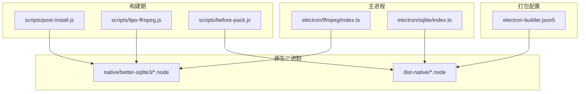
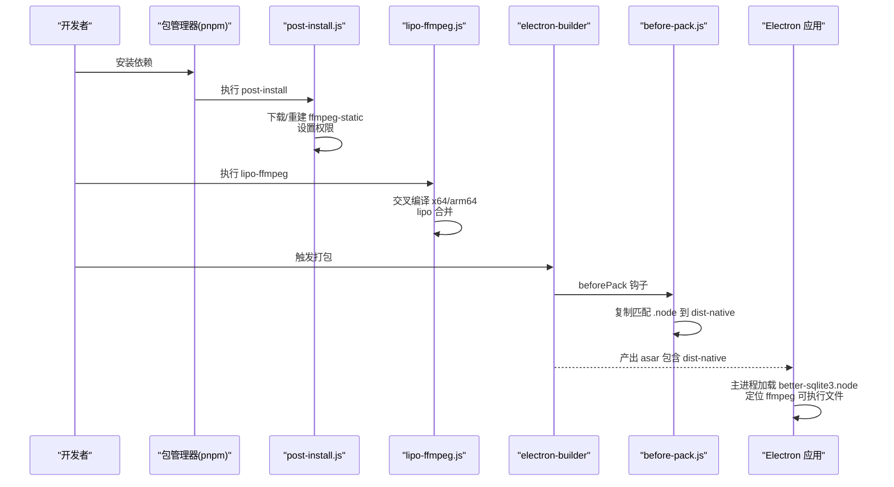
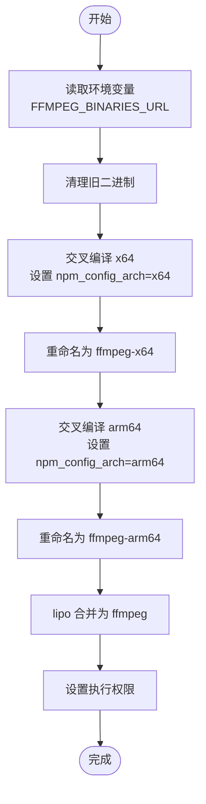
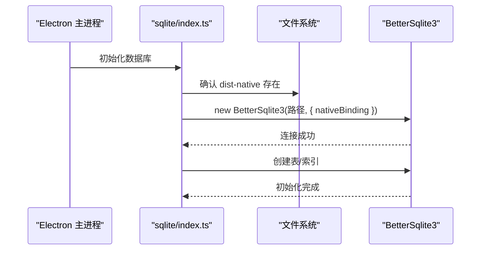
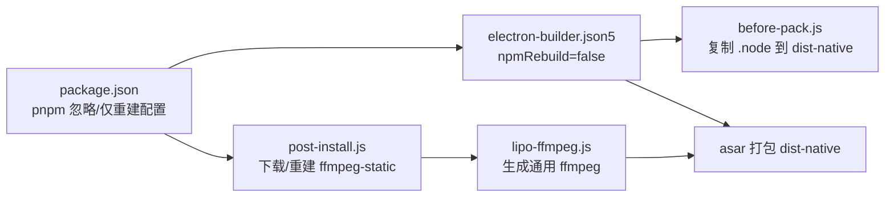

# 原生依赖处理

<cite>
**本文引用的文件**
- [package.json](file://package.json)
- [scripts/lipo-ffmpeg.js](file://scripts/lipo-ffmpeg.js)
- [scripts/post-install.js](file://scripts/post-install.js)
- [scripts/before-pack.js](file://scripts/before-pack.js)
- [electron-builder.json5](file://electron-builder.json5)
- [electron/ffmpeg/index.ts](file://electron/ffmpeg/index.ts)
- [electron/ffmpeg/types.ts](file://electron/ffmpeg/types.ts)
- [electron/sqlite/index.ts](file://electron/sqlite/index.ts)
- [electron/sqlite/types.ts](file://electron/sqlite/types.ts)
- [vite.config.ts](file://vite.config.ts)
- [electron/ipc.ts](file://electron/ipc.ts)
- [electron/preload.ts](file://electron/preload.ts)
</cite>

## 目录
1. [简介](#简介)
2. [项目结构](#项目结构)
3. [核心组件](#核心组件)
4. [架构总览](#架构总览)
5. [详细组件分析](#详细组件分析)
6. [依赖关系分析](#依赖关系分析)
7. [性能考虑](#性能考虑)
8. [故障排查指南](#故障排查指南)
9. [结论](#结论)
10. [附录](#附录)

## 简介
本指南聚焦于本项目的原生依赖处理实践，涵盖以下主题：
- FFmpeg 的集成与多架构通用二进制生成（lipo-ffmpeg.js 脚本工作原理）
- better-sqlite3 原生模块的编译、打包与运行时加载
- 原生模块的兼容性、版本管理与性能优化
- Electron 主进程 external 依赖配置
- 调试技巧与常见问题解决方案
- 跨平台原生依赖的适配策略

## 项目结构
围绕原生依赖的关键目录与文件：
- scripts：构建期原生依赖准备脚本（下载、权限设置、合并）
- native：预编译好的 better-sqlite3 原生二进制（按平台/架构命名）
- dist-native：打包阶段复制到产物的原生二进制
- electron：主进程封装 FFmpeg 与 SQLite 的调用逻辑
- electron-builder.json5：打包配置，控制 npmRebuild、beforePack 钩子等
- vite.config.ts：开发期外部化 better-sqlite3，避免 Vite 误重建

图表来源
- [scripts/post-install.js:1-19](file://scripts/post-install.js#L1-L19)
- [scripts/lipo-ffmpeg.js:1-49](file://scripts/lipo-ffmpeg.js#L1-L49)
- [scripts/before-pack.js:1-36](file://scripts/before-pack.js#L1-L36)
- [electron-builder.json5:1-46](file://electron-builder.json5#L1-L46)
- [electron/ffmpeg/index.ts:1-272](file://electron/ffmpeg/index.ts#L1-L272)
- [electron/sqlite/index.ts:1-194](file://electron/sqlite/index.ts#L1-L194)

章节来源
- [package.json:1-85](file://package.json#L1-L85)
- [scripts/post-install.js:1-19](file://scripts/post-install.js#L1-L19)
- [scripts/lipo-ffmpeg.js:1-49](file://scripts/lipo-ffmpeg.js#L1-L49)
- [scripts/before-pack.js:1-36](file://scripts/before-pack.js#L1-L36)
- [electron-builder.json5:1-46](file://electron-builder.json5#L1-L46)
- [vite.config.ts](file://vite.config.ts)

## 核心组件
- FFmpeg 集成与渲染
  - 主进程封装 FFmpeg 调用，负责命令拼装、进度解析、错误处理与可中断执行
  - 开发模式与打包后模式分别定位 ffmpeg-static 二进制，并在 Windows 上进行可执行权限校验
- better-sqlite3 数据库
  - 运行时根据平台与架构选择对应 .node 文件，通过 BetterSqlite3 构造函数注入 nativeBinding
  - 初始化数据库文件与必要表结构，提供基础 CRUD 与批量插入/更新能力
- 构建期脚本
  - post-install.js：下载/重建 ffmpeg-static 并设置权限
  - lipo-ffmpeg.js：交叉编译 x64/arm64，使用 lipo 合并为通用二进制
  - before-pack.js：打包前将匹配平台/架构的 .node 复制到 dist-native
- 打包配置
  - electron-builder.json5：启用 asar、禁用 npmRebuild、注册 beforePack 钩子、配置 macOS universal 架构

章节来源
- [electron/ffmpeg/index.ts:1-272](file://electron/ffmpeg/index.ts#L1-L272)
- [electron/ffmpeg/types.ts:1-23](file://electron/ffmpeg/types.ts#L1-L23)
- [electron/sqlite/index.ts:1-194](file://electron/sqlite/index.ts#L1-L194)
- [electron/sqlite/types.ts:1-26](file://electron/sqlite/types.ts#L1-L26)
- [scripts/post-install.js:1-19](file://scripts/post-install.js#L1-L19)
- [scripts/lipo-ffmpeg.js:1-49](file://scripts/lipo-ffmpeg.js#L1-L49)
- [scripts/before-pack.js:1-36](file://scripts/before-pack.js#L1-L36)
- [electron-builder.json5:1-46](file://electron-builder.json5#L1-L46)

## 架构总览
下图展示了从“安装/构建”到“运行时”的原生依赖流转：

图表来源
- [scripts/post-install.js:1-19](file://scripts/post-install.js#L1-L19)
- [scripts/lipo-ffmpeg.js:1-49](file://scripts/lipo-ffmpeg.js#L1-L49)
- [scripts/before-pack.js:1-36](file://scripts/before-pack.js#L1-L36)
- [electron-builder.json5:1-46](file://electron-builder.json5#L1-L46)
- [electron/sqlite/index.ts:1-194](file://electron/sqlite/index.ts#L1-L194)
- [electron/ffmpeg/index.ts:1-272](file://electron/ffmpeg/index.ts#L1-L272)

## 详细组件分析

### FFmpeg 集成与 lipo-ffmpeg.js 工作原理
- 环境变量与 URL 定制
  - 通过 npm_config_ffmpeg_binaries_url 注入自定义下载源，便于内网/加速场景
- 交叉编译与合并
  - 依次针对 x64/arm64 执行 ffmpeg-static 的安装（设置 npm_config_arch）
  - 将生成的 ffmpeg-x64/ffmpeg-arm64 用 lipo 合并为通用 ffmpeg
  - 统一赋予执行权限，确保跨平台可用
- 主进程调用
  - 开发模式与打包后模式分别解析 ffmpeg-static 的路径；Windows 下额外校验可执行权限
  - 通过子进程执行，解析 stderr 中的时间戳信息计算进度，支持 AbortSignal 中断

图表来源
- [scripts/lipo-ffmpeg.js:1-49](file://scripts/lipo-ffmpeg.js#L1-L49)

章节来源
- [scripts/lipo-ffmpeg.js:1-49](file://scripts/lipo-ffmpeg.js#L1-L49)
- [scripts/post-install.js:1-19](file://scripts/post-install.js#L1-L19)
- [electron/ffmpeg/index.ts:1-272](file://electron/ffmpeg/index.ts#L1-L272)

### better-sqlite3 原生模块编译与部署
- 版本与 Electron ABI
  - 项目使用 better-sqlite3@9.6.0，匹配 Electron v22（对应 Node-API 版本约 v110）
  - 原生二进制命名包含 better-sqlite3-v9.6.0-electron-v110-{platform}-{arch}.node
- 运行时加载
  - 开发模式：直接从本地 native 目录加载对应 .node
  - 打包后：从 dist-native 加载，BetterSqlite3 构造时通过 nativeBinding 指定路径
- 打包复制
  - beforePack 根据打包时的平台与架构，将匹配的 .node 复制到 dist-native/better-sqlite3.node
- 数据库初始化
  - 初始化数据库文件位置位于 userData 目录
  - 创建产品参考表与视频帧分析表，并建立索引以提升查询性能

图表来源
- [electron/sqlite/index.ts:1-194](file://electron/sqlite/index.ts#L1-L194)
- [scripts/before-pack.js:1-36](file://scripts/before-pack.js#L1-L36)

章节来源
- [electron/sqlite/index.ts:1-194](file://electron/sqlite/index.ts#L1-L194)
- [electron/sqlite/types.ts:1-26](file://electron/sqlite/types.ts#L1-L26)
- [scripts/before-pack.js:1-36](file://scripts/before-pack.js#L1-L36)

### Electron 主进程 external 依赖配置
- better-sqlite3 在开发期被外部化（external），避免 Vite 对其进行不必要的重建
- 这样可确保 better-sqlite3 的原生二进制在运行时由 Electron 正确加载

章节来源
- [vite.config.ts](file://vite.config.ts)

### IPC 与原生能力暴露
- 主进程通过 ipcMain 暴露数据库与 FFmpeg 相关能力
- 预加载脚本通过 contextBridge 将这些能力暴露给渲染进程，供 UI 调用

章节来源
- [electron/ipc.ts:1-39](file://electron/ipc.ts#L1-L39)
- [electron/preload.ts:50-70](file://electron/preload.ts#L50-L70)

## 依赖关系分析
- 包管理与忽略重建
  - pnpm 的 ignoredBuiltDependencies 包含 better-sqlite3 与 ffmpeg-static，避免在安装时触发原生重建
  - onlyBuiltDependencies 控制哪些包需要强制原生重建（如 esbuild、electron 等）
- 打包策略
  - electron-builder 禁用 npmRebuild，改用内置 .node 二进制
  - beforePack 钩子确保 dist-native 中包含正确的 .node
  - macOS 配置为 universal 架构，配合 lipo-ffmpeg 生成的通用 ffmpeg

图表来源
- [package.json:65-78](file://package.json#L65-L78)
- [electron-builder.json5:10-12](file://electron-builder.json5#L10-L12)
- [scripts/before-pack.js:30-35](file://scripts/before-pack.js#L30-L35)
- [scripts/post-install.js:6-10](file://scripts/post-install.js#L6-L10)
- [scripts/lipo-ffmpeg.js:32-43](file://scripts/lipo-ffmpeg.js#L32-L43)

章节来源
- [package.json:65-78](file://package.json#L65-L78)
- [electron-builder.json5:10-12](file://electron-builder.json5#L10-L12)
- [scripts/before-pack.js:30-35](file://scripts/before-pack.js#L30-L35)
- [scripts/post-install.js:6-10](file://scripts/post-install.js#L6-L10)
- [scripts/lipo-ffmpeg.js:32-43](file://scripts/lipo-ffmpeg.js#L32-L43)

## 性能考虑
- FFmpeg 渲染
  - 使用 libx264 编码、固定帧率与色彩空间，结合响度归一化与混合策略，保证输出一致性
  - 通过进度解析与可中断执行，提升用户体验与资源控制
- SQLite
  - 启用外键约束，创建索引加速查询
  - 使用事务批量插入/更新，减少磁盘写入次数
- 打包与加载
  - 通过 asar 与 external 配置减少不必要的重建与打包体积
  - 使用 dist-native 精准加载 .node，避免 Electron 默认查找的不确定性

章节来源
- [electron/ffmpeg/index.ts:142-164](file://electron/ffmpeg/index.ts#L142-L164)
- [electron/sqlite/index.ts:116-139](file://electron/sqlite/index.ts#L116-L139)
- [electron-builder.json5:6](file://electron-builder.json5#L6)
- [vite.config.ts](file://vite.config.ts)

## 故障排查指南
- FFmpeg 未找到或无执行权限（Windows）
  - 现象：启动时报错找不到 ffmpeg 或权限不足
  - 处理：确认 post-install.js 已执行并设置权限；Windows 下 validateExecutables 会抛出明确错误
- lipo 合并不生效
  - 现象：生成的 ffmpeg 不是通用二进制
  - 处理：检查 lipo-ffmpeg.js 是否正确交叉编译并使用 lipo 合并；确认 ffmpeg-x64/ffmpeg-arm64 存在
- better-sqlite3.node 无法加载
  - 现象：Electron 报错无法加载 .node
  - 处理：确认 beforePack 已复制正确平台/架构的 .node 至 dist-native；检查 nativeBinding 路径
- 打包后路径不一致
  - 现象：开发正常但打包后路径异常
  - 处理：确认开发/打包后模式下的路径解析逻辑一致；asar.unpack 与 APP_ROOT 环境变量设置
- Vite 误重建 better-sqlite3
  - 现象：开发时出现原生模块重建
  - 处理：确认 vite.config.ts 中 external 配置已生效

章节来源
- [scripts/post-install.js:6-18](file://scripts/post-install.js#L6-L18)
- [scripts/lipo-ffmpeg.js:28-46](file://scripts/lipo-ffmpeg.js#L28-L46)
- [scripts/before-pack.js:12-22](file://scripts/before-pack.js#L12-L22)
- [electron/ffmpeg/index.ts:246-259](file://electron/ffmpeg/index.ts#L246-L259)
- [electron/sqlite/index.ts:24-31](file://electron/sqlite/index.ts#L24-L31)
- [vite.config.ts](file://vite.config.ts)

## 结论
本项目采用“构建期准备 + 打包期复制 + 运行时精准加载”的策略，系统性解决了 FFmpeg 与 better-sqlite3 的多架构与跨平台问题。通过 lipo-ffmpeg.js 生成通用二进制、before-pack.js 精准复制 .node、以及 electron-builder.json5 的 asar 与 external 配置，实现了稳定、可控且高性能的原生依赖交付。

## 附录
- 关键实现路径
  - FFmpeg 主进程封装：[electron/ffmpeg/index.ts:1-272](file://electron/ffmpeg/index.ts#L1-L272)
  - FFmpeg 类型定义：[electron/ffmpeg/types.ts:1-23](file://electron/ffmpeg/types.ts#L1-L23)
  - SQLite 主进程封装：[electron/sqlite/index.ts:1-194](file://electron/sqlite/index.ts#L1-L194)
  - SQLite 类型定义：[electron/sqlite/types.ts:1-26](file://electron/sqlite/types.ts#L1-L26)
  - 构建期脚本：[scripts/post-install.js:1-19](file://scripts/post-install.js#L1-L19)、[scripts/lipo-ffmpeg.js:1-49](file://scripts/lipo-ffmpeg.js#L1-L49)、[scripts/before-pack.js:1-36](file://scripts/before-pack.js#L1-L36)
  - 打包配置：[electron-builder.json5:1-46](file://electron-builder.json5#L1-L46)
  - 开发期 external 配置：[vite.config.ts](file://vite.config.ts)
  - IPC 暴露：[electron/ipc.ts:1-39](file://electron/ipc.ts#L1-L39)、[electron/preload.ts:50-70](file://electron/preload.ts#L50-L70)