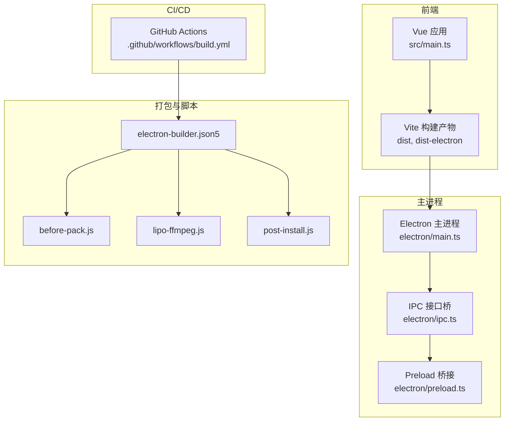
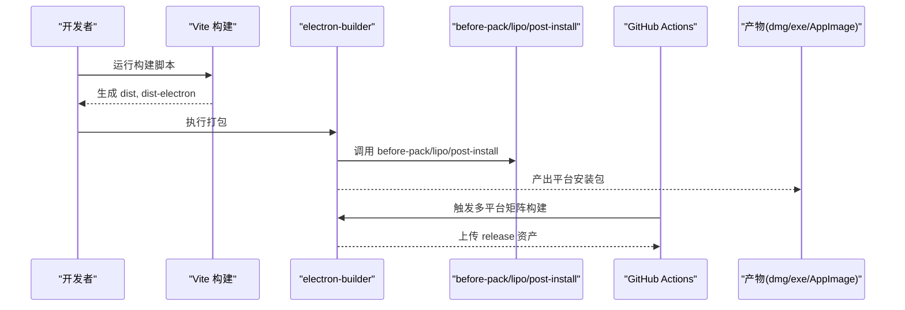
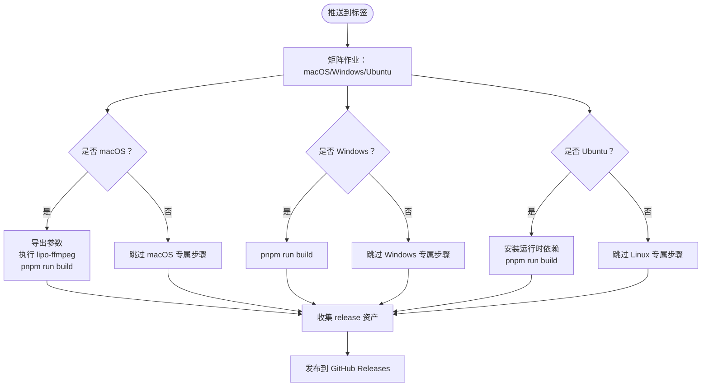
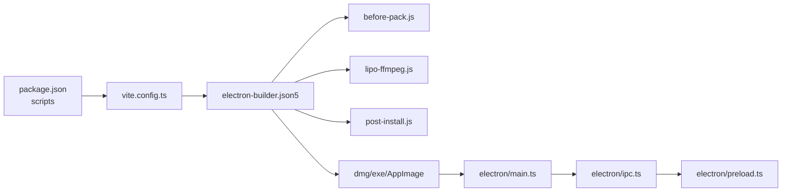

# 多平台构建

<cite>
**本文引用的文件**
- [package.json](file://package.json)
- [electron-builder.json5](file://electron-builder.json5)
- [.github/workflows/build.yml](file://.github/workflows/build.yml)
- [scripts/before-pack.js](file://scripts/before-pack.js)
- [scripts/lipo-ffmpeg.js](file://scripts/lipo-ffmpeg.js)
- [scripts/post-install.js](file://scripts/post-install.js)
- [electron/main.ts](file://electron/main.ts)
- [vite.config.ts](file://vite.config.ts)
- [src/main.ts](file://src/main.ts)
- [electron/preload.ts](file://electron/preload.ts)
- [electron/ipc.ts](file://electron/ipc.ts)
- [CHANGELOG.md](file://CHANGELOG.md)
</cite>

## 目录
1. [简介](#简介)
2. [项目结构](#项目结构)
3. [核心组件](#核心组件)
4. [架构总览](#架构总览)
5. [详细组件分析](#详细组件分析)
6. [依赖关系分析](#依赖关系分析)
7. [性能考虑](#性能考虑)
8. [故障排查指南](#故障排查指南)
9. [结论](#结论)
10. [附录](#附录)

## 简介
本指南面向需要在 Windows、macOS、Linux 三平台进行 Electron 应用构建与发布的团队与个人开发者。基于仓库现有配置，系统性梳理了：
- 平台差异与特殊配置（打包目标、签名与权限）
- CI/CD 自动化构建流程与发布策略
- 应用商店发布前准备与审核要点
- 性能优化与用户体验改进建议
- 平台兼容性测试与质量保证流程

## 项目结构
该项目采用 Electron + Vue 3 + Vite 的现代桌面应用架构，前端资源通过 Vite 构建，主进程入口位于 electron 目录，打包配置由 electron-builder 统一管理。脚本目录包含构建前置与后置处理逻辑，CI/CD 使用 GitHub Actions。

图表来源
- [vite.config.ts:10-53](file://vite.config.ts#L10-L53)
- [electron/main.ts:187-204](file://electron/main.ts#L187-L204)
- [electron/ipc.ts:89-295](file://electron/ipc.ts#L89-L295)
- [electron/preload.ts:19-100](file://electron/preload.ts#L19-L100)
- [electron-builder.json5:1-46](file://electron-builder.json5#L1-L46)
- [.github/workflows/build.yml:1-90](file://.github/workflows/build.yml#L1-L90)

章节来源
- [vite.config.ts:10-53](file://vite.config.ts#L10-L53)
- [electron/main.ts:187-204](file://electron/main.ts#L187-L204)
- [electron/ipc.ts:89-295](file://electron/ipc.ts#L89-L295)
- [electron/preload.ts:19-100](file://electron/preload.ts#L19-L100)
- [electron-builder.json5:1-46](file://electron-builder.json5#L1-L46)
- [.github/workflows/build.yml:1-90](file://.github/workflows/build.yml#L1-L90)

## 核心组件
- 构建与打包
  - electron-builder：统一配置三平台打包目标、产物命名、图标、NSIS 选项等。
  - before-pack.js：在打包前复制平台/架构对应的原生模块二进制至 dist-native，确保运行期可用。
  - lipo-ffmpeg.js：在 macOS 上合并 x64/arm64 架构 ffmpeg 二进制为 universal，提升兼容性。
  - post-install.js：安装/重装 ffmpeg-static 并设置可执行权限（非 Windows）。
- 主进程与 IPC
  - main.ts：创建窗口、初始化 SQLite、国际化、IPC、禁用 CORS/私网限制等。
  - ipc.ts：实现 SQLite、文件夹选择、EdgeTTS 合成、视频渲染、VL 视觉分析等 IPC 处理。
  - preload.ts：通过 contextBridge 暴露安全 API 至渲染进程。
- 前端与构建
  - vite.config.ts：集成 vite-plugin-electron，配置主进程入口、preload 输入、renderer polyfill。
  - src/main.ts：初始化 Vuetify、Toast、路由、Pinia、i18n 等。

章节来源
- [electron-builder.json5:1-46](file://electron-builder.json5#L1-L46)
- [scripts/before-pack.js:24-36](file://scripts/before-pack.js#L24-L36)
- [scripts/lipo-ffmpeg.js:1-49](file://scripts/lipo-ffmpeg.js#L1-L49)
- [scripts/post-install.js:1-19](file://scripts/post-install.js#L1-L19)
- [electron/main.ts:187-204](file://electron/main.ts#L187-L204)
- [electron/ipc.ts:89-295](file://electron/ipc.ts#L89-L295)
- [electron/preload.ts:19-100](file://electron/preload.ts#L19-L100)
- [vite.config.ts:10-53](file://vite.config.ts#L10-L53)
- [src/main.ts:14-62](file://src/main.ts#L14-L62)

## 架构总览
下图展示从开发到发布的端到端流程，包括平台差异与 CI/CD 关键步骤。

图表来源
- [package.json:13-21](file://package.json#L13-L21)
- [electron-builder.json5:10-45](file://electron-builder.json5#L10-L45)
- [scripts/before-pack.js:24-36](file://scripts/before-pack.js#L24-L36)
- [scripts/lipo-ffmpeg.js:24-49](file://scripts/lipo-ffmpeg.js#L24-L49)
- [scripts/post-install.js:6-19](file://scripts/post-install.js#L6-L19)
- [.github/workflows/build.yml:16-90](file://.github/workflows/build.yml#L16-L90)

## 详细组件分析

### 平台差异与特殊配置
- macOS
  - 打包目标：dmg，架构为 universal（同时包含 x64/arm64）。
  - 安装器命名：包含版本、架构信息。
  - 原生二进制：通过 before-pack.js 复制对应 better-sqlite3 的 .node 文件。
  - ffmpeg：通过 lipo-ffmpeg.js 合并 x64/arm64 二进制为通用版本。
  - 权限：post-install.js 在非 Windows 平台设置 ffmpeg 可执行权限。
  - 签名：当前工作流未启用签名；如需签名，请在 CI 中配置证书与签名参数。
- Windows
  - 打包目标：NSIS 安装器，支持多语言（简体中文）。
  - 安装器命名：包含版本、架构信息。
  - 原生二进制：同样通过 before-pack.js 复制对应 better-sqlite3 的 .node 文件。
  - ffmpeg：无需 lipo 合并，直接使用安装脚本下载的二进制。
  - 权限：post-install.js 在非 Windows 平台设置 ffmpeg 权限，Windows 默认可执行。
  - 签名：当前工作流未启用签名；如需签名，请在 CI 中配置证书与签名参数。
- Linux
  - 打包目标：AppImage。
  - 安装器命名：包含版本、架构信息。
  - 依赖：CI 步骤中安装 GTK/WebKit/Indicators 等运行时依赖。
  - 原生二进制：通过 before-pack.js 复制对应 better-sqlite3 的 .node 文件。
  - ffmpeg：无需 lipo 合并，直接使用安装脚本下载的二进制。
  - 权限：post-install.js 在非 Windows 平台设置 ffmpeg 权限。
  - 签名：当前工作流未启用签名；如需签名，请在 CI 中配置证书与签名参数。

章节来源
- [electron-builder.json5:13-43](file://electron-builder.json5#L13-L43)
- [scripts/before-pack.js:24-36](file://scripts/before-pack.js#L24-L36)
- [scripts/lipo-ffmpeg.js:24-49](file://scripts/lipo-ffmpeg.js#L24-L49)
- [scripts/post-install.js:6-19](file://scripts/post-install.js#L6-L19)
- [.github/workflows/build.yml:30-57](file://.github/workflows/build.yml#L30-L57)

### CI/CD 自动化构建流程
- 触发条件：推送标签（如 v1.2.2）触发发布作业。
- 矩阵构建：在 macOS、Windows、Ubuntu 三个平台上并行构建。
- macOS 特殊处理：导出构建参数以生成 universal 包，执行 lipo-ffmpeg 脚本，再进行打包。
- Linux 依赖：安装 GTK/WebKit/Indicators 等运行时依赖后再打包。
- 发布：从 release/${version} 目录收集 dmg/exe/deb/rpm/AppImage 等资产，发布到 GitHub Releases，正文提取自变更日志。

图表来源
- [.github/workflows/build.yml:3-90](file://.github/workflows/build.yml#L3-L90)

章节来源
- [.github/workflows/build.yml:3-90](file://.github/workflows/build.yml#L3-L90)

### 应用商店发布准备与审核要点
- Windows
  - 当前配置使用 NSIS 安装器，未启用代码签名。若计划提交 Microsoft Store 或企业分发，需在 CI 中配置签名证书与发布渠道。
  - 安装器语言已设为简体中文，符合国内用户习惯。
- macOS
  - 当前配置为 dmg 安装包，未启用签名。若计划提交 Mac App Store 或通过 Apple Distribution 发布，需在 CI 中配置 Developer ID 或 Apple Distribution 证书。
  - universal 目标确保 x64/arm64 兼容。
- Linux
  - 当前配置为 AppImage，未启用签名。若计划提交 Snap/Flatpak 等商店，需按相应规范准备元数据与签名。
- 通用建议
  - 提供清晰的隐私政策与用户协议链接。
  - 在应用内提供“关于”页面，包含版本号、版权信息与反馈渠道。
  - 准备应用截图与演示视频，满足商店审核要求。

章节来源
- [electron-builder.json5:23-43](file://electron-builder.json5#L23-L43)
- [.github/workflows/build.yml:37-48](file://.github/workflows/build.yml#L37-L48)

### 性能优化与用户体验改进
- 主进程启动体验
  - 主进程在 ready-to-show 时显示窗口，减少白屏时间。
  - 禁用 CORS 与私网限制以支持本地网络请求，便于调试与本地服务对接。
- 渲染器性能
  - Vite 构建配置中设置较大的 chunkSizeWarningLimit，避免过大包体积警告干扰。
- 原生模块与媒体工具
  - better-sqlite3 通过 before-pack.js 在打包前复制对应架构的 .node 文件，避免运行时重建。
  - ffmpeg 通过 lipo 合并为 universal，减少多架构分发成本。
- 国际化与菜单
  - 主进程动态构建菜单并支持语言切换，提升多语言用户的操作体验。
- 文件夹选择与回退
  - 选择文件夹时提供多级回退路径，避免因系统路径不可用导致对话框无法打开。

章节来源
- [electron/main.ts:40-76](file://electron/main.ts#L40-L76)
- [electron/main.ts:184-203](file://electron/main.ts#L184-L203)
- [vite.config.ts:48-51](file://vite.config.ts#L48-L51)
- [scripts/before-pack.js:12-35](file://scripts/before-pack.js#L12-L35)
- [scripts/lipo-ffmpeg.js:24-49](file://scripts/lipo-ffmpeg.js#L24-L49)
- [electron/main.ts:78-164](file://electron/main.ts#L78-L164)

### 平台兼容性测试与质量保证
- 测试范围
  - 三平台安装包功能验证：窗口创建、菜单、IPC、SQLite、EdgeTTS、视频渲染、VL 分析等。
  - 媒体工具兼容性：ffmpeg 在不同架构下的行为一致性。
  - 权限与路径：不同平台文件系统权限与路径回退策略。
- 质量保障
  - 变更日志：维护清晰的版本变更记录，便于发布与回溯。
  - CI 发布：自动化构建与发布，减少人工干预带来的错误。
  - 错误上报：主进程统计事件上报，辅助定位问题。

章节来源
- [CHANGELOG.md:1-148](file://CHANGELOG.md#L1-L148)
- [.github/workflows/build.yml:75-90](file://.github/workflows/build.yml#L75-L90)

## 依赖关系分析
- 构建链路
  - package.json 的构建脚本串联 Vue 构建与 electron-builder。
  - vite.config.ts 将 electron 主进程与 preload 作为入口，避免 Node 原生模块被错误打包。
- 打包链路
  - electron-builder.json5 指定输出目录、文件包含、平台目标与 NSIS 选项。
  - before-pack.js 在打包前注入原生二进制。
  - lipo-ffmpeg.js 在 macOS 上生成 universal ffmpeg。
  - post-install.js 在安装后设置 ffmpeg 权限。
- 运行链路
  - preload.ts 通过 contextBridge 暴露受控 API。
  - ipc.ts 实现各类 IPC 处理，包括文件夹选择、EdgeTTS、视频渲染等。
  - main.ts 初始化窗口、菜单、国际化与 IPC。

图表来源
- [package.json:13-21](file://package.json#L13-L21)
- [vite.config.ts:10-53](file://vite.config.ts#L10-L53)
- [electron-builder.json5:10-45](file://electron-builder.json5#L10-L45)
- [scripts/before-pack.js:24-36](file://scripts/before-pack.js#L24-L36)
- [scripts/lipo-ffmpeg.js:24-49](file://scripts/lipo-ffmpeg.js#L24-L49)
- [scripts/post-install.js:6-19](file://scripts/post-install.js#L6-L19)
- [electron/main.ts:187-204](file://electron/main.ts#L187-L204)
- [electron/ipc.ts:89-295](file://electron/ipc.ts#L89-L295)
- [electron/preload.ts:19-100](file://electron/preload.ts#L19-L100)

章节来源
- [package.json:13-21](file://package.json#L13-L21)
- [vite.config.ts:10-53](file://vite.config.ts#L10-L53)
- [electron-builder.json5:10-45](file://electron-builder.json5#L10-L45)
- [scripts/before-pack.js:24-36](file://scripts/before-pack.js#L24-L36)
- [scripts/lipo-ffmpeg.js:24-49](file://scripts/lipo-ffmpeg.js#L24-L49)
- [scripts/post-install.js:6-19](file://scripts/post-install.js#L6-L19)
- [electron/main.ts:187-204](file://electron/main.ts#L187-L204)
- [electron/ipc.ts:89-295](file://electron/ipc.ts#L89-L295)
- [electron/preload.ts:19-100](file://electron/preload.ts#L19-L100)

## 性能考虑
- 构建体积
  - 通过 external better-sqlite3，避免将其打包进主进程 bundle，减小体积。
  - chunkSizeWarningLimit 提升阈值，避免大体积警告干扰。
- 运行时性能
  - 主进程窗口在 ready-to-show 时显示，缩短首屏等待。
  - 禁用 CORS 与私网限制，减少网络层阻塞。
- 媒体工具
  - ffmpeg 通过 lipo 合并为 universal，减少多架构分发与兼容性问题。
  - better-sqlite3 原生二进制在打包前复制，避免运行时重建与加载失败。

章节来源
- [vite.config.ts:20-26](file://vite.config.ts#L20-L26)
- [vite.config.ts:48-51](file://vite.config.ts#L48-L51)
- [electron/main.ts:57-60](file://electron/main.ts#L57-L60)
- [electron/main.ts:198-202](file://electron/main.ts#L198-L202)
- [scripts/before-pack.js:30-35](file://scripts/before-pack.js#L30-L35)
- [scripts/lipo-ffmpeg.js:42-49](file://scripts/lipo-ffmpeg.js#L42-L49)

## 故障排查指南
- 打包失败或缺少原生二进制
  - 检查 before-pack.js 是否正确复制对应平台/架构的 .node 文件。
  - 确认 dist-native 目录存在且命名正确。
- ffmpeg 权限问题
  - 非 Windows 平台需确保 ffmpeg 可执行权限，post-install.js 会自动设置。
  - 若手动安装或修改 ffmpeg，请确认权限为可执行。
- macOS universal 包构建失败
  - 确保 lipo-ffmpeg.js 成功生成 ffmpeg-x64 与 ffmpeg-arm64，并合并为 ffmpeg。
  - 检查 CI 环境是否具备 lipo 工具。
- Windows 安装器语言与路径
  - NSIS 语言已设为简体中文；若路径选择失败，检查默认路径回退逻辑。
- Linux 运行时依赖
  - CI 中需安装 GTK/WebKit/Indicators 等依赖，否则 AppImage 可能无法运行。
- IPC 与菜单
  - 若菜单语言切换无效，检查主进程 i18n 事件监听与 preload 暴露的接口。

章节来源
- [scripts/before-pack.js:12-35](file://scripts/before-pack.js#L12-L35)
- [scripts/post-install.js:6-19](file://scripts/post-install.js#L6-L19)
- [scripts/lipo-ffmpeg.js:24-49](file://scripts/lipo-ffmpeg.js#L24-L49)
- [electron-builder.json5:32-38](file://electron-builder.json5#L32-L38)
- [.github/workflows/build.yml:52-55](file://.github/workflows/build.yml#L52-L55)
- [electron/main.ts:193-196](file://electron/main.ts#L193-L196)
- [electron/preload.ts:44-48](file://electron/preload.ts#L44-L48)

## 结论
本项目已具备完善的多平台构建基础：统一的打包配置、原生模块与媒体工具的平台适配、以及 CI/CD 的自动化发布。建议后续在签名、应用商店发布与更严格的兼容性测试方面进一步完善，以提升安全性与用户体验。

## 附录
- 变更日志与版本发布
  - 变更日志记录了各版本的功能新增、修复与优化，便于发布与回溯。
- 构建脚本与工具
  - package.json 的 scripts 定义了开发、构建与打包流程。
  - 脚本目录中的工具负责原生二进制复制、ffmpeg 合并与权限设置。

章节来源
- [CHANGELOG.md:1-148](file://CHANGELOG.md#L1-L148)
- [package.json:13-21](file://package.json#L13-L21)
- [scripts/before-pack.js:24-36](file://scripts/before-pack.js#L24-L36)
- [scripts/lipo-ffmpeg.js:24-49](file://scripts/lipo-ffmpeg.js#L24-L49)
- [scripts/post-install.js:6-19](file://scripts/post-install.js#L6-L19)