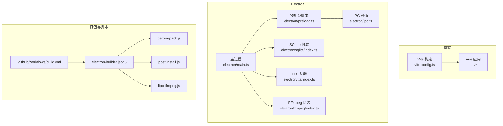
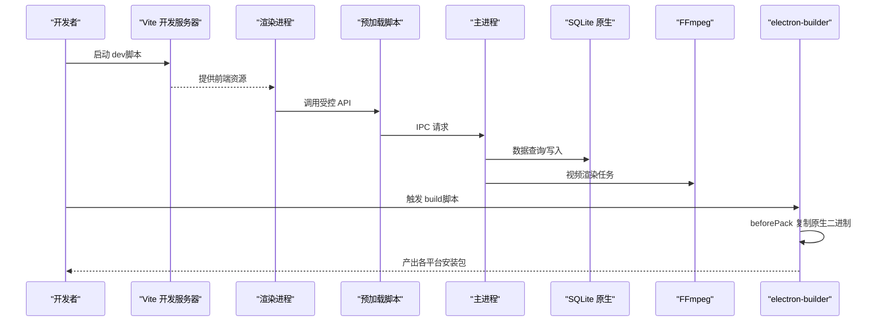
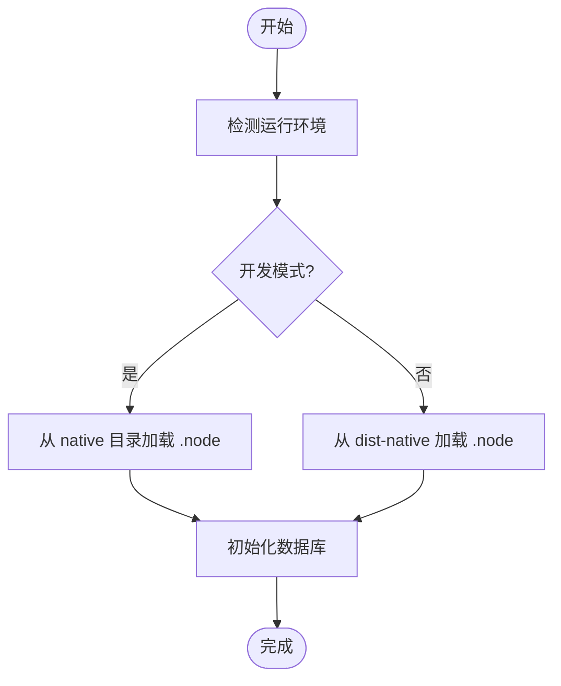
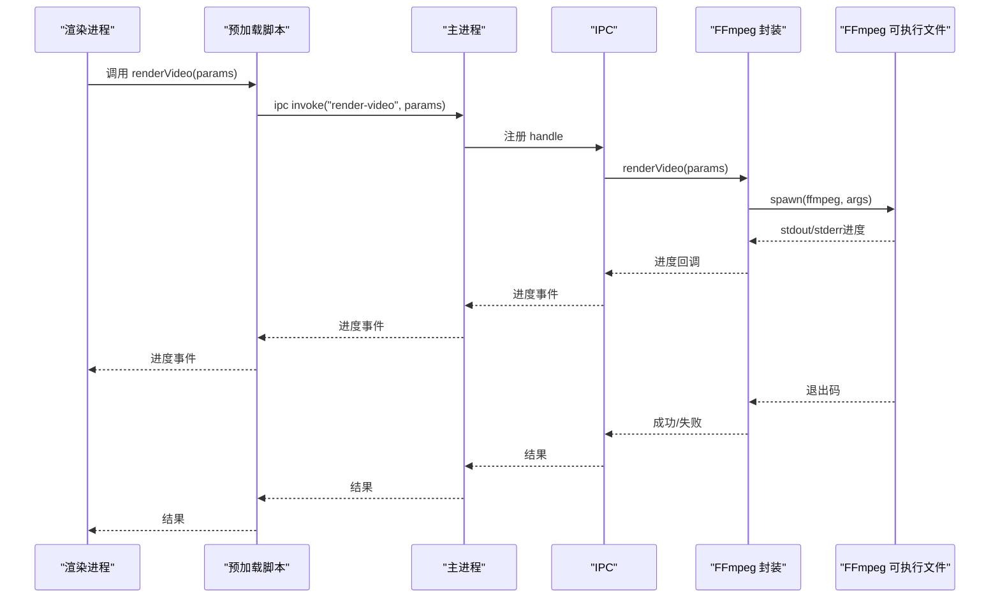
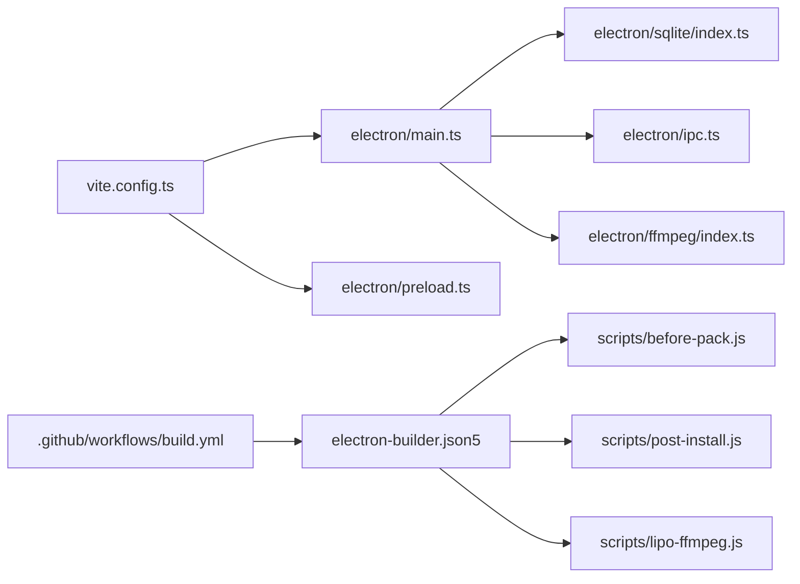

# 构建与部署

<cite>
**本文引用的文件**
- [package.json](file://package.json)
- [vite.config.ts](file://vite.config.ts)
- [electron-builder.json5](file://electron-builder.json5)
- [main.ts](file://electron/main.ts)
- [preload.ts](file://electron/preload.ts)
- [ipc.ts](file://electron/ipc.ts)
- [sqlite/index.ts](file://electron/sqlite/index.ts)
- [ffmpeg/index.ts](file://electron/ffmpeg/index.ts)
- [before-pack.js](file://scripts/before-pack.js)
- [post-install.js](file://scripts/post-install.js)
- [lipo-ffmpeg.js](file://scripts/lipo-ffmpeg.js)
- [.github/workflows/build.yml](file://.github/workflows/build.yml)
- [tsconfig.json](file://tsconfig.json)
- [uno.config.ts](file://uno.config.ts)
</cite>

## 目录
1. [简介](#简介)
2. [项目结构](#项目结构)
3. [核心组件](#核心组件)
4. [架构总览](#架构总览)
5. [详细组件分析](#详细组件分析)
6. [依赖关系分析](#依赖关系分析)
7. [性能考量](#性能考量)
8. [故障排查指南](#故障排查指南)
9. [结论](#结论)
10. [附录](#附录)

## 简介
本指南面向短视频工厂项目的构建与部署，覆盖以下重点：
- Vite 前端构建配置与 Electron 打包配置的设置与优化
- 多平台构建差异与注意事项（Windows、macOS、Linux）
- electron-builder 的配置项与打包流程
- 原生依赖处理（尤其是 FFmpeg 的集成与优化）
- CI/CD 集成与自动化发布流程
- 构建性能优化、包体积控制与安全加固
- 不同部署场景的最佳实践

## 项目结构
该项目采用“前端（Vue + Vite）+ Electron 主进程 + 预加载脚本 + 原生模块”的典型桌面应用结构，并通过 electron-builder 进行多平台打包。

图表来源
- [vite.config.ts:1-53](file://vite.config.ts#L1-L53)
- [main.ts:1-204](file://electron/main.ts#L1-L204)
- [preload.ts:1-75](file://electron/preload.ts#L1-L75)
- [ipc.ts:1-188](file://electron/ipc.ts#L1-L188)
- [sqlite/index.ts:1-154](file://electron/sqlite/index.ts#L1-L154)
- [tts/index.ts:1-86](file://electron/tts/index.ts#L1-L86)
- [ffmpeg/index.ts:1-272](file://electron/ffmpeg/index.ts#L1-L272)
- [electron-builder.json5:1-46](file://electron-builder.json5#L1-L46)
- [.github/workflows/build.yml:1-90](file://.github/workflows/build.yml#L1-L90)

章节来源
- [vite.config.ts:1-53](file://vite.config.ts#L1-L53)
- [electron-builder.json5:1-46](file://electron-builder.json5#L1-L46)
- [.github/workflows/build.yml:1-90](file://.github/workflows/build.yml#L1-L90)

## 核心组件
- 前端构建与开发服务器：基于 Vite，配合 Vue 插件、UnoCSS、开发工具插件，支持 Electron 主/渲染双进程开发体验。
- Electron 主进程：负责窗口生命周期、菜单、国际化、统计事件、原生能力开关等。
- 预加载与桥接：通过 contextBridge 暴露受控 API 至渲染进程，统一 IPC 调用入口。
- 数据持久化：better-sqlite3 原生绑定，按平台/架构分发二进制，打包前复制至 dist-native。
- 媒体处理：FFmpeg 静态二进制封装，支持进度回调、取消、跨平台权限处理与合并。
- 打包与发布：electron-builder 统一配置，CI 自动化多平台构建与发布。

章节来源
- [main.ts:1-204](file://electron/main.ts#L1-L204)
- [preload.ts:1-75](file://electron/preload.ts#L1-L75)
- [ipc.ts:1-188](file://electron/ipc.ts#L1-L188)
- [sqlite/index.ts:1-154](file://electron/sqlite/index.ts#L1-L154)
- [ffmpeg/index.ts:1-272](file://electron/ffmpeg/index.ts#L1-L272)
- [electron-builder.json5:1-46](file://electron-builder.json5#L1-L46)

## 架构总览
下图展示从开发到打包的关键交互与职责边界：

图表来源
- [package.json:13-21](file://package.json#L13-L21)
- [vite.config.ts:10-41](file://vite.config.ts#L10-L41)
- [main.ts:187-204](file://electron/main.ts#L187-L204)
- [preload.ts:18-75](file://electron/preload.ts#L18-L75)
- [ipc.ts:77-187](file://electron/ipc.ts#L77-L187)
- [sqlite/index.ts:38-154](file://electron/sqlite/index.ts#L38-L154)
- [ffmpeg/index.ts:26-244](file://electron/ffmpeg/index.ts#L26-L244)
- [electron-builder.json5:10-45](file://electron-builder.json5#L10-L45)

## 详细组件分析

### Vite 构建配置与优化
- 插件链路
  - Vue 插件：支持 .vue 单文件组件与模板编译。
  - UnoCSS：原子化样式与主题快捷方式。
  - 开发工具插件：提升开发体验。
  - Vite Electron 插件：将主进程入口指向 electron/main.ts；preload 作为独立输入；renderer 在非测试环境下启用 Node polyfill。
- 外部化策略
  - 将 better-sqlite3 设为外部依赖，避免被 Vite 打包，改由 electron-builder 打包阶段复制原生二进制。
- 构建参数
  - 警告阈值调大，避免因 chunk 体积过大触发警告。
- 路径别名
  - @ 指向 src，~ 指向项目根，便于导入组织。

章节来源
- [vite.config.ts:10-52](file://vite.config.ts#L10-L52)
- [package.json:22-31](file://package.json#L22-L31)

### Electron 主进程与窗口管理
- 窗口初始化
  - 读取屏幕工作区尺寸，设置窗口宽高与最小尺寸；设置预加载路径与 webPreferences。
  - 开发模式下加载 Vite Dev Server，生产模式加载 dist/index.html。
- 生命周期与菜单
  - 窗口关闭策略遵循 macOS 行为；构建动态菜单，支持语言切换。
- 安全与网络
  - 关闭 webSecurity 以便本地资源访问；禁用 CORS 与私有网络限制相关特性，满足本地开发需求。
- 国际化与统计
  - 初始化 i18n 与统计事件上报。

章节来源
- [main.ts:40-76](file://electron/main.ts#L40-L76)
- [main.ts:78-164](file://electron/main.ts#L78-L164)
- [main.ts:187-204](file://electron/main.ts#L187-L204)

### 预加载脚本与 API 暴露
- 通过 contextBridge 将 ipcRenderer、i18n、electron、sqlite 等 API 暴露给渲染进程，限定调用通道，避免直接注入全局对象。
- 统一的调用约定：send/on、invoke/once/off，便于错误追踪与调试。

章节来源
- [preload.ts:18-75](file://electron/preload.ts#L18-L75)

### IPC 通道与业务对接
- 数据库操作：query、insert、update、delete、bulkInsertOrUpdate。
- 窗口控制：最大化、最小化、关闭、是否最大化。
- 文件系统：选择文件夹、列出文件夹内容、打开外部链接。
- TTS：获取语音列表、合成到 Base64、合成到文件。
- 视频渲染：接收参数并返回进度事件，支持取消信号。

章节来源
- [ipc.ts:77-187](file://electron/ipc.ts#L77-L187)

### SQLite 原生绑定与打包集成
- 原生模块定位
  - 开发模式：从 native/better-sqlite3 下按平台/架构选择 .node 文件。
  - 生产模式：从 dist-native 复制而来，路径固定。
- 打包前准备
  - before-pack.js 根据打包上下文复制对应 better-sqlite3 原生二进制到 dist-native。
- 数据库初始化
  - 打开数据库、开启外键约束、导出常用方法。

图表来源
- [sqlite/index.ts:19-36](file://electron/sqlite/index.ts#L19-L36)
- [before-pack.js:24-35](file://scripts/before-pack.js#L24-L35)

章节来源
- [sqlite/index.ts:19-154](file://electron/sqlite/index.ts#L19-L154)
- [before-pack.js:24-35](file://scripts/before-pack.js#L24-L35)

### FFmpeg 集成与渲染管线
- 可执行文件定位
  - 开发模式：require ffmpeg-static。
  - 生产模式：替换 asar 路径为 asar.unpacked，保证可执行权限。
- 渲染流程
  - 支持多视频片段裁剪、缩放、拼接、字幕叠加、响度归一与混合、编码输出。
  - 提供进度解析与取消机制，适配长任务 UI。
- 平台权限
  - Windows 以外平台设置可执行权限，避免启动失败。
- CI 优化
  - macOS 使用 lipo-ffmpeg 脚本生成通用二进制，减少体积与兼容性问题。

图表来源
- [preload.ts:63-65](file://electron/preload.ts#L63-L65)
- [ipc.ts:171-186](file://electron/ipc.ts#L171-L186)
- [ffmpeg/index.ts:26-244](file://electron/ffmpeg/index.ts#L26-L244)

章节来源
- [ffmpeg/index.ts:12-15](file://electron/ffmpeg/index.ts#L12-L15)
- [ffmpeg/index.ts:26-186](file://electron/ffmpeg/index.ts#L26-L186)
- [ffmpeg/index.ts:188-244](file://electron/ffmpeg/index.ts#L188-L244)
- [post-install.js:6-18](file://scripts/post-install.js#L6-L18)
- [lipo-ffmpeg.js:10-48](file://scripts/lipo-ffmpeg.js#L10-L48)

### electron-builder 配置与打包流程
- 基本配置
  - asar 启用；输出目录 release/${version}；打包文件包含 dist、dist-electron、dist-native、locales。
  - 禁用 npmRebuild，使用内置预构建二进制。
- 平台目标
  - macOS：dmg，universal 架构；artifactName 包含 arch。
  - Windows：NSIS 安装包；artifactName 包含 arch。
  - Linux：AppImage；artifactName 包含 arch。
  - NSIS 中文化与自定义安装行为。
- 生命周期钩子
  - beforePack：复制 better-sqlite3 原生二进制到 dist-native。
- 发布策略
  - 默认不自动发布，防止重复发版。

章节来源
- [electron-builder.json5:1-46](file://electron-builder.json5#L1-L46)
- [before-pack.js:24-35](file://scripts/before-pack.js#L24-L35)

### CI/CD 与自动化发布
- 触发条件
  - 推送标签（如 v*）时触发。
- 步骤概览
  - 安装 Node.js 与 pnpm；安装依赖。
  - macOS：设置 universal 参数、执行 lipo-ffmpeg、执行 build。
  - Windows：直接 build。
  - Linux：安装 GTK/WebKit 等依赖后 build。
  - 从 Git 标签提取版本号，读取变更日志片段。
  - 发布制品到 GitHub Releases，匹配 dmg/exe/deb/rpm/AppImage。

章节来源
- [.github/workflows/build.yml:1-90](file://.github/workflows/build.yml#L1-L90)

## 依赖关系分析
- 构建期耦合
  - Vite 仅负责前端产物；electron-builder 负责最终打包，主进程入口由 Vite Electron 插件指定。
  - better-sqlite3 通过 external 与 beforePack 两处协同，确保运行时可用。
- 运行期耦合
  - 主进程依赖 SQLite、FFmpeg、IPC、TTS 等模块；预加载脚本作为 API 桥接层。
- 外部依赖
  - FFmpeg 静态二进制通过 post-install 与 lipo-ffmpeg 管理；NSIS 安装器依赖本地化语言配置。

图表来源
- [vite.config.ts:10-41](file://vite.config.ts#L10-L41)
- [main.ts:1-204](file://electron/main.ts#L1-L204)
- [preload.ts:1-75](file://electron/preload.ts#L1-L75)
- [ipc.ts:1-188](file://electron/ipc.ts#L1-L188)
- [sqlite/index.ts:1-154](file://electron/sqlite/index.ts#L1-L154)
- [ffmpeg/index.ts:1-272](file://electron/ffmpeg/index.ts#L1-L272)
- [electron-builder.json5:10-45](file://electron-builder.json5#L10-L45)
- [before-pack.js:24-35](file://scripts/before-pack.js#L24-L35)
- [post-install.js:6-18](file://scripts/post-install.js#L6-L18)
- [lipo-ffmpeg.js:10-48](file://scripts/lipo-ffmpeg.js#L10-L48)
- [.github/workflows/build.yml:1-90](file://.github/workflows/build.yml#L1-L90)

## 性能考量
- 构建体积控制
  - external better-sqlite3，避免重复打包原生二进制。
  - asar 启用，减小文件数量带来的 I/O 开销。
  - UnoCSS 按需生成样式，减少冗余 CSS。
- 运行时性能
  - FFmpeg 渲染采用进度解析与取消机制，避免长时间阻塞 UI。
  - macOS 通过 lipo 生成通用二进制，兼顾 x64/arm64，减少用户下载体积。
- 安全加固
  - 开发模式下关闭 webSecurity 仅用于本地开发；生产模式应谨慎评估安全影响。
  - 禁用 CORS 与私有网络限制相关特性，需结合实际网络策略评估风险。

章节来源
- [vite.config.ts:20-24](file://vite.config.ts#L20-L24)
- [electron-builder.json5:6](file://electron-builder.json5#L6)
- [uno.config.ts:11-44](file://uno.config.ts#L11-L44)
- [ffmpeg/index.ts:205-243](file://electron/ffmpeg/index.ts#L205-L243)
- [lipo-ffmpeg.js:25-48](file://scripts/lipo-ffmpeg.js#L25-L48)
- [main.ts:51-54](file://electron/main.ts#L51-L54)

## 故障排查指南
- better-sqlite3 原生二进制缺失
  - 现象：运行时报找不到原生模块。
  - 排查：确认 beforePack 是否正确复制；dist-native 是否存在对应 .node 文件。
  - 参考：[before-pack.js:24-35](file://scripts/before-pack.js#L24-L35)
- FFmpeg 权限问题（Linux/macOS）
  - 现象：spawn 失败或无执行权限。
  - 排查：post-install 是否设置可执行权限；lipo-ffmpeg 是否生成通用二进制。
  - 参考：[post-install.js:12-18](file://scripts/post-install.js#L12-L18)、[lipo-ffmpeg.js:42-48](file://scripts/lipo-ffmpeg.js#L42-L48)
- FFmpeg 路径与 asar 解包
  - 现象：asar 打包后无法找到可执行文件。
  - 排查：确认生产模式下路径替换为 asar.unpacked。
  - 参考：[ffmpeg/index.ts:12-14](file://electron/ffmpeg/index.ts#L12-L14)
- NSIS 安装语言与安装目录
  - 现象：安装界面语言或默认目录不符合预期。
  - 排查：检查 electron-builder 的 nsis 配置。
  - 参考：[electron-builder.json5:32-38](file://electron-builder.json5#L32-L38)
- CI 多平台依赖
  - 现象：Linux 打包失败。
  - 排查：确认安装 GTK/WebKit/AppIndicator 等系统依赖。
  - 参考：[build.yml:53-55](file://.github/workflows/build.yml#L53-L55)

章节来源
- [before-pack.js:24-35](file://scripts/before-pack.js#L24-L35)
- [post-install.js:12-18](file://scripts/post-install.js#L12-L18)
- [lipo-ffmpeg.js:42-48](file://scripts/lipo-ffmpeg.js#L42-L48)
- [ffmpeg/index.ts:12-14](file://electron/ffmpeg/index.ts#L12-L14)
- [electron-builder.json5:32-38](file://electron-builder.json5#L32-L38)
- [.github/workflows/build.yml:53-55](file://.github/workflows/build.yml#L53-L55)

## 结论
本项目通过 Vite + Electron 的组合实现了高效的前端开发体验与稳定的桌面应用打包。借助 electron-builder 的统一配置与 CI 自动化，能够稳定地在 Windows、macOS、Linux 三大平台上交付安装包。原生依赖（better-sqlite3、ffmpeg-static）通过 beforePack、post-install、lipo-ffmpeg 等脚本进行精细化管理，既保证了运行时可用性，也兼顾了包体积与性能。建议在生产环境中进一步收紧安全策略，并持续优化 FFmpeg 渲染参数与缓存策略以提升用户体验。

## 附录

### 多平台构建差异与注意事项
- Windows
  - 使用 NSIS 安装器，支持自定义安装目录与语言。
  - FFmpeg 在非 Windows 平台需要设置可执行权限。
- macOS
  - 生成 universal dmg，使用 lipo-ffmpeg 生成通用二进制。
  - 注意沙盒与签名策略（如需）。
- Linux
  - 生成 AppImage；需提前安装 GTK/WebKit/AppIndicator 等系统依赖。

章节来源
- [electron-builder.json5:23-43](file://electron-builder.json5#L23-L43)
- [build.yml:30-57](file://.github/workflows/build.yml#L30-L57)
- [post-install.js:12-18](file://scripts/post-install.js#L12-L18)

### electron-builder 常用配置要点
- asar：启用压缩与隐藏源码。
- files：明确包含 dist、dist-electron、dist-native、locales。
- npmRebuild：关闭以复用内置二进制。
- beforePack：复制原生二进制到 dist-native。
- 平台 target：Windows（nsis）、macOS（dmg/universal）、Linux（AppImage）。
- NSIS：语言、安装目录、卸载行为等。

章节来源
- [electron-builder.json5:6](file://electron-builder.json5#L6)
- [electron-builder.json5:10](file://electron-builder.json5#L10)
- [electron-builder.json5:11](file://electron-builder.json5#L11)
- [electron-builder.json5:13-43](file://electron-builder.json5#L13-L43)
- [before-pack.js:24-35](file://scripts/before-pack.js#L24-L35)

### FFmpeg 集成最佳实践
- 开发与生产路径分离，确保 asar.unpacked。
- 进度解析与取消信号，提升长任务体验。
- macOS 使用 lipo 合并 x64/arm64，减少体积与兼容性问题。
- 非 Windows 平台设置执行权限。

章节来源
- [ffmpeg/index.ts:12-15](file://electron/ffmpeg/index.ts#L12-L15)
- [ffmpeg/index.ts:205-243](file://electron/ffmpeg/index.ts#L205-L243)
- [lipo-ffmpeg.js:25-48](file://scripts/lipo-ffmpeg.js#L25-L48)
- [post-install.js:12-18](file://scripts/post-install.js#L12-L18)

### CI/CD 最佳实践
- 使用矩阵作业并行构建多平台。
- Linux 安装必要系统依赖后再打包。
- 从 Git 标签读取版本与发布说明，自动上传制品。
- 保持 electron-builder 的发布策略为手动发布，避免误发。

章节来源
- [.github/workflows/build.yml:8-90](file://.github/workflows/build.yml#L8-L90)
- [electron-builder.json5:44](file://electron-builder.json5#L44)