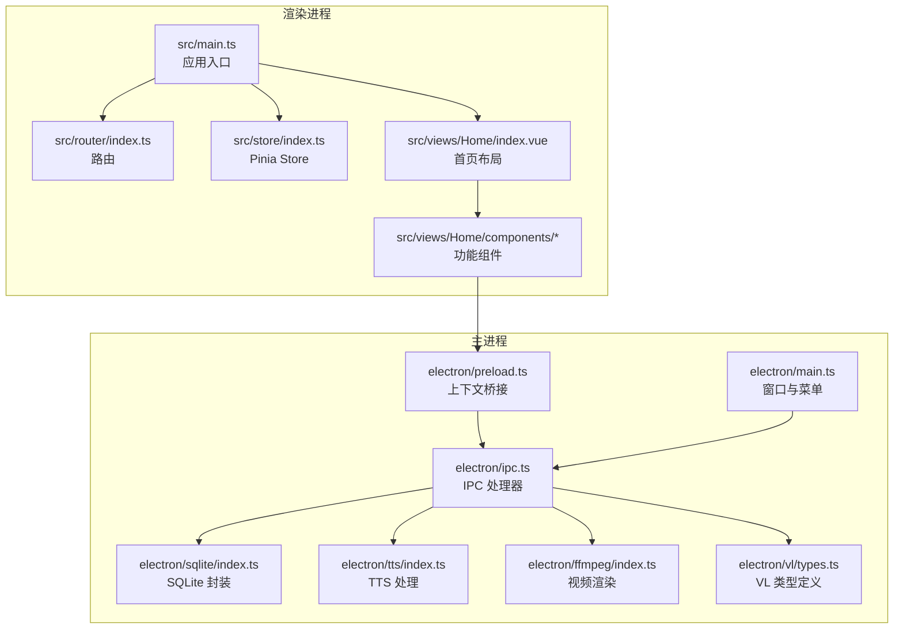
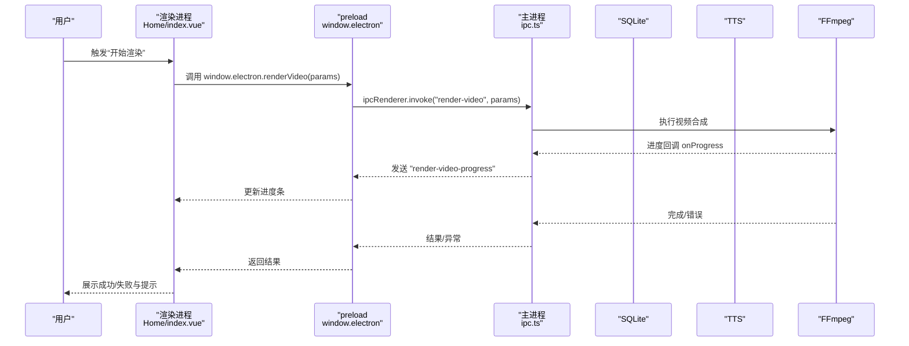
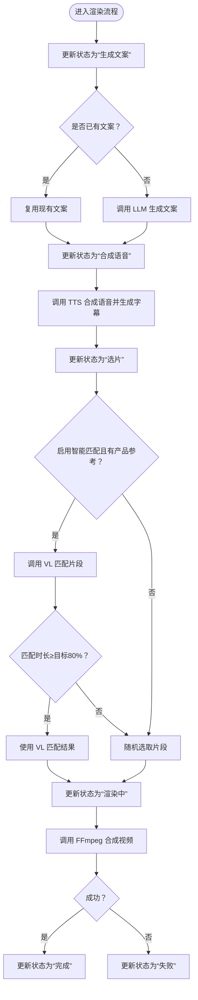
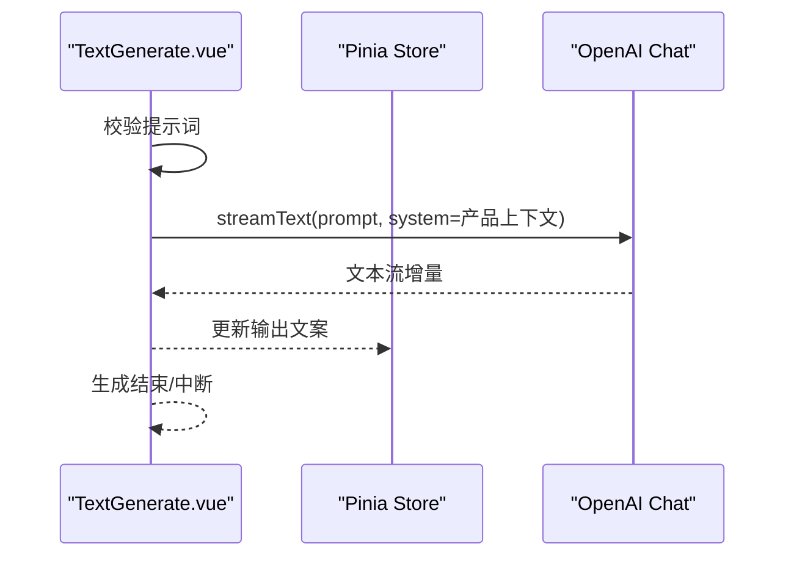
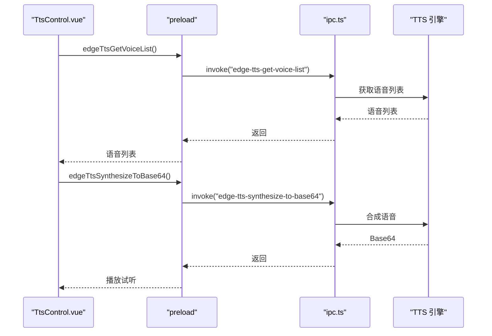
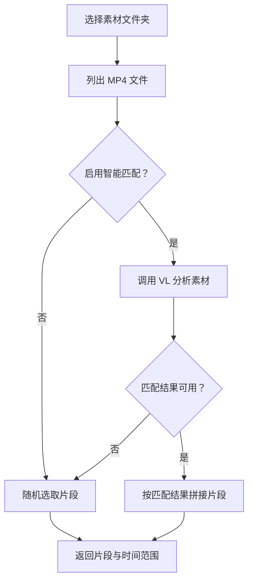
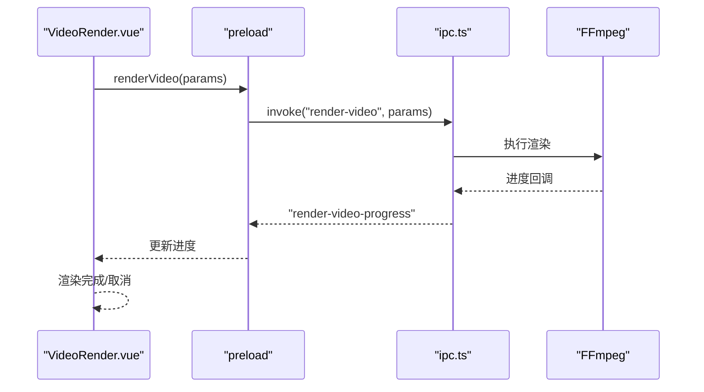
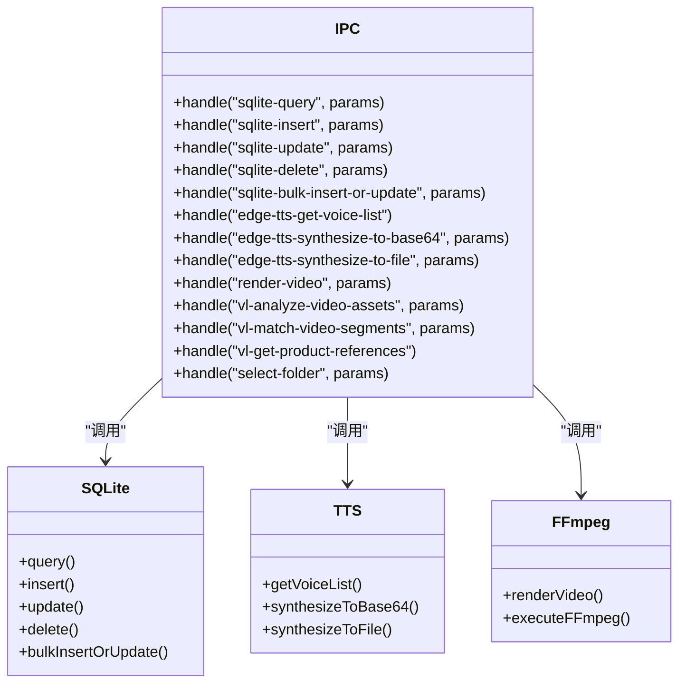
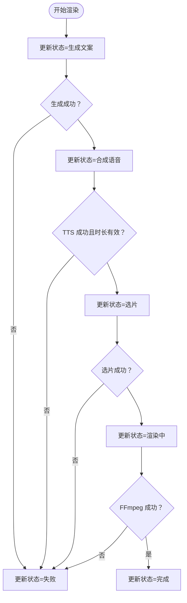
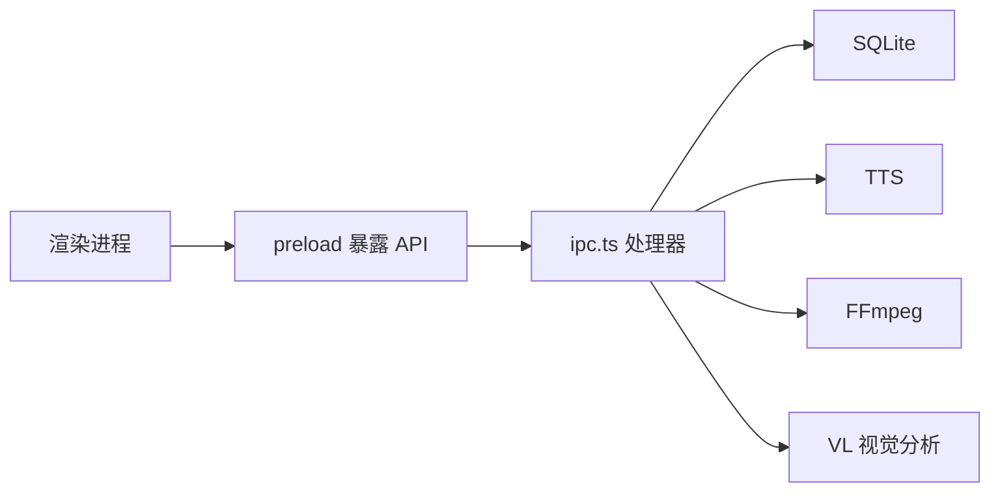

# 数据流设计

<cite>
**本文引用的文件**
- [README.md](file://README.md)
- [src/main.ts](file://src/main.ts)
- [src/router/index.ts](file://src/router/index.ts)
- [src/store/index.ts](file://src/store/index.ts)
- [src/store/app.ts](file://src/store/app.ts)
- [src/views/Home/index.vue](file://src/views/Home/index.vue)
- [src/views/Home/components/TextGenerate.vue](file://src/views/Home/components/TextGenerate.vue)
- [src/views/Home/components/TtsControl.vue](file://src/views/Home/components/TtsControl.vue)
- [src/views/Home/components/VideoManage.vue](file://src/views/Home/components/VideoManage.vue)
- [src/views/Home/components/VideoRender.vue](file://src/views/Home/components/VideoRender.vue)
- [electron/main.ts](file://electron/main.ts)
- [electron/preload.ts](file://electron/preload.ts)
- [electron/ipc.ts](file://electron/ipc.ts)
- [electron/sqlite/index.ts](file://electron/sqlite/index.ts)
- [electron/tts/index.ts](file://electron/tts/index.ts)
- [electron/ffmpeg/index.ts](file://electron/ffmpeg/index.ts)
- [electron/vl/types.ts](file://electron/vl/types.ts)
</cite>

## 目录
1. [简介](#简介)
2. [项目结构](#项目结构)
3. [核心组件](#核心组件)
4. [架构总览](#架构总览)
5. [详细组件分析](#详细组件分析)
6. [依赖关系分析](#依赖关系分析)
7. [性能考量](#性能考量)
8. [故障排查指南](#故障排查指南)
9. [结论](#结论)
10. [附录](#附录)

## 简介
本文件面向“短视频工厂”项目，系统化梳理从用户输入到UI更新的完整数据流与处理机制。重点覆盖：
- 状态变更与持久化（Pinia Store）
- IPC 通信（渲染进程 ↔ 主进程）
- 视图渲染与交互（Vue 组件）
- 数据验证、转换与缓存策略
- 异步处理、错误传播与状态回滚
- 性能优化、内存管理与并发控制
- 典型复杂数据流场景与最佳实践

## 项目结构
项目采用 Electron + Vue 3 技术栈，前端负责 UI 与业务编排，后端主进程负责系统级能力（文件系统、FFmpeg、SQLite、TTS、VL 视觉分析等），并通过 IPC 暴露受限 API。

图表来源
- [src/main.ts:1-62](file://src/main.ts#L1-L62)
- [src/router/index.ts:1-22](file://src/router/index.ts#L1-L22)
- [src/store/index.ts:1-9](file://src/store/index.ts#L1-L9)
- [src/views/Home/index.vue:1-313](file://src/views/Home/index.vue#L1-L313)
- [electron/main.ts:1-204](file://electron/main.ts#L1-L204)
- [electron/preload.ts:1-100](file://electron/preload.ts#L1-L100)
- [electron/ipc.ts:1-295](file://electron/ipc.ts#L1-L295)
- [electron/sqlite/index.ts:1-194](file://electron/sqlite/index.ts#L1-L194)
- [electron/tts/index.ts:1-86](file://electron/tts/index.ts#L1-L86)
- [electron/ffmpeg/index.ts:1-272](file://electron/ffmpeg/index.ts#L1-L272)
- [electron/vl/types.ts:1-85](file://electron/vl/types.ts#L1-L85)

章节来源
- [src/main.ts:1-62](file://src/main.ts#L1-L62)
- [electron/main.ts:1-204](file://electron/main.ts#L1-L204)

## 核心组件
- 应用入口与国际化：初始化 Vuetify、路由、Store，并挂载应用；监听主进程消息与语言切换事件。
- 路由系统：Hash 历史模式，根路径指向默认布局，再加载首页视图。
- 状态管理：Pinia Store，集中管理文案、TTS、渲染配置、渲染状态、VL 配置与产品参考等。
- 首页布局：组织文案生成、素材管理、TTS 控制、视频渲染四大区域，协调各组件协作。
- 主进程：创建窗口、构建菜单、初始化 IPC、SQLite、国际化；通过 preload 暴露受控 API。

章节来源
- [src/main.ts:1-62](file://src/main.ts#L1-L62)
- [src/router/index.ts:1-22](file://src/router/index.ts#L1-L22)
- [src/store/index.ts:1-9](file://src/store/index.ts#L1-L9)
- [src/store/app.ts:1-147](file://src/store/app.ts#L1-L147)
- [src/views/Home/index.vue:1-313](file://src/views/Home/index.vue#L1-L313)
- [electron/main.ts:1-204](file://electron/main.ts#L1-L204)

## 架构总览
渲染进程与主进程通过 IPC 协作，渲染进程通过 preload 暴露的 window.electron/window.sqlite 等 API 调用主进程能力；主进程在 IPC 处理器中完成实际 IO、计算与系统调用，并将结果与进度回调回传渲染进程。

图表来源
- [src/views/Home/index.vue:84-281](file://src/views/Home/index.vue#L84-L281)
- [electron/preload.ts:64-65](file://electron/preload.ts#L64-L65)
- [electron/ipc.ts:183-198](file://electron/ipc.ts#L183-L198)
- [electron/ffmpeg/index.ts:26-186](file://electron/ffmpeg/index.ts#L26-L186)

## 详细组件分析

### 状态与数据流（Pinia Store）
- 状态域
  - 国际化与 LLM 配置
  - 视频素材与导出路径
  - TTS 语音列表、语言/性别/语速、试听文本
  - 渲染配置（尺寸、输出路径、文件名、BGM）、渲染状态机、自动批处理
  - VL 配置与产品参考、智能匹配开关与分析进度
- 状态变更与持久化
  - 通过 store 的更新函数修改响应式状态
  - Pinia 持久化插件配置了部分字段不持久化，降低存储压力
- 状态机
  - 渲染状态枚举：未开始、生成文案、合成语音、选片、渲染中、完成、失败
  - 通过状态机驱动 UI 禁用/启用与按钮行为

图表来源
- [src/store/app.ts:6-14](file://src/store/app.ts#L6-L14)
- [src/views/Home/index.vue:146-250](file://src/views/Home/index.vue#L146-L250)

章节来源
- [src/store/app.ts:1-147](file://src/store/app.ts#L1-L147)
- [src/views/Home/index.vue:1-313](file://src/views/Home/index.vue#L1-L313)

### 文案生成（TextGenerate.vue）
- 输入校验：提示词必填
- LLM 调用：基于 ai-sdk/OpenAI，支持流式输出与中断
- UI 响应：生成中禁用按钮，错误弹窗与复制错误详情
- 产物：返回生成的文案字符串

图表来源
- [src/views/Home/components/TextGenerate.vue:132-193](file://src/views/Home/components/TextGenerate.vue#L132-L193)
- [src/views/Home/index.vue:147-151](file://src/views/Home/index.vue#L147-L151)

章节来源
- [src/views/Home/components/TextGenerate.vue:1-272](file://src/views/Home/components/TextGenerate.vue#L1-L272)

### TTS 控制（TtsControl.vue）
- 语音列表拉取：首次加载从主进程获取 EdgeTTS 语音列表
- 试听播放：Base64 音频即时播放
- 合成到文件：生成 MP3 与 SRT 字幕，解析时长并校验有效性
- UI 响应：配置校验、加载态、错误弹窗与复制

图表来源
- [src/views/Home/components/TtsControl.vue:165-199](file://src/views/Home/components/TtsControl.vue#L165-L199)
- [src/views/Home/components/TtsControl.vue:102-110](file://src/views/Home/components/TtsControl.vue#L102-L110)
- [electron/preload.ts:59-61](file://electron/preload.ts#L59-L61)
- [electron/ipc.ts:169-178](file://electron/ipc.ts#L169-L178)
- [electron/tts/index.ts:35-43](file://electron/tts/index.ts#L35-L43)

章节来源
- [src/views/Home/components/TtsControl.vue:1-234](file://src/views/Home/components/TtsControl.vue#L1-L234)
- [electron/tts/index.ts:1-86](file://electron/tts/index.ts#L1-L86)

### 素材管理与智能匹配（VideoManage.vue）
- 素材库加载：选择文件夹后列出 MP4 文件，清空时长缓存
- 元数据读取：使用 video 元素读取时长，带超时与缓存
- 随机选片：按目标时长动态拼接片段，限制片段最小/最大时长
- 智能匹配：VL 分析素材并匹配颜色/标签，若匹配时长达标则优先使用
- 进度与统计：订阅主进程分析进度，显示分析统计

图表来源
- [src/views/Home/components/VideoManage.vue:118-179](file://src/views/Home/components/VideoManage.vue#L118-L179)
- [src/views/Home/components/VideoManage.vue:213-230](file://src/views/Home/components/VideoManage.vue#L213-L230)
- [src/views/Home/components/VideoManage.vue:281-386](file://src/views/Home/components/VideoManage.vue#L281-L386)

章节来源
- [src/views/Home/components/VideoManage.vue:1-394](file://src/views/Home/components/VideoManage.vue#L1-L394)

### 视频渲染（VideoRender.vue）
- 渲染配置：输出尺寸、文件名、导出路径、BGM 路径、VL 配置
- 进度监听：订阅主进程的渲染进度事件，更新圆形进度条
- 启动/取消：触发渲染或向主进程发送取消信号

图表来源
- [src/views/Home/components/VideoRender.vue:224-226](file://src/views/Home/components/VideoRender.vue#L224-L226)
- [src/views/Home/index.vue:231-246](file://src/views/Home/index.vue#L231-L246)
- [electron/preload.ts:64-65](file://electron/preload.ts#L64-L65)
- [electron/ipc.ts:183-198](file://electron/ipc.ts#L183-L198)
- [electron/ffmpeg/index.ts:188-244](file://electron/ffmpeg/index.ts#L188-L244)

章节来源
- [src/views/Home/components/VideoRender.vue:1-276](file://src/views/Home/components/VideoRender.vue#L1-L276)

### 主进程与 IPC（electron/ipc.ts）
- SQLite：封装查询、插入、更新、删除、批量插入/更新
- 系统能力：窗口控制、文件夹选择、文件列表、外部打开
- TTS：语音列表、合成到 Base64、合成到文件
- 渲染：FFmpeg 合成，支持进度回调与取消（AbortController）
- VL：连接测试、素材分析、分析统计、片段匹配、产品参考管理

图表来源
- [electron/ipc.ts:89-294](file://electron/ipc.ts#L89-L294)
- [electron/sqlite/index.ts:116-139](file://electron/sqlite/index.ts#L116-L139)
- [electron/tts/index.ts:35-85](file://electron/tts/index.ts#L35-L85)
- [electron/ffmpeg/index.ts:26-186](file://electron/ffmpeg/index.ts#L26-L186)

章节来源
- [electron/ipc.ts:1-295](file://electron/ipc.ts#L1-L295)

### 数据验证、转换与缓存策略
- 输入验证
  - 渲染前校验输出文件名、输出路径、输出尺寸
  - 文案生成前校验提示词
  - TTS 合成前校验语音与试听文本
- 数据转换
  - 产品上下文拼接：将产品信息转为系统提示词
  - 字幕生成：TTS 合成时生成 SRT 字幕
  - FFmpeg 参数：根据输入视频、音频、字幕拼接滤镜链
- 缓存策略
  - 素材时长缓存：video 元素读取元数据并缓存，避免重复 IO
  - 语音列表缓存：组件挂载时一次性拉取，后续按需使用
  - Store 持久化：仅持久化必要字段，避免冗余存储

章节来源
- [src/views/Home/index.vue:89-100](file://src/views/Home/index.vue#L89-L100)
- [src/views/Home/components/TextGenerate.vue:132-136](file://src/views/Home/components/TextGenerate.vue#L132-L136)
- [src/views/Home/components/TtsControl.vue:75-87](file://src/views/Home/components/TtsControl.vue#L75-L87)
- [src/views/Home/components/VideoManage.vue:232-279](file://src/views/Home/components/VideoManage.vue#L232-L279)
- [electron/tts/index.ts:60-76](file://electron/tts/index.ts#L60-L76)
- [electron/ffmpeg/index.ts:56-164](file://electron/ffmpeg/index.ts#L56-L164)
- [src/store/app.ts:141-146](file://src/store/app.ts#L141-L146)

### 异步处理、错误传播与状态回滚
- 异步处理
  - LLM 流式生成、TTS 合成、FFmpeg 渲染均采用异步流程
  - 主进程使用 AbortController 支持取消
- 错误传播
  - 统一捕获并包装错误消息，通过 Toast 展示，支持复制错误详情
  - 渲染失败时更新渲染状态为失败，避免继续推进
- 状态回滚
  - 渲染取消时，根据当前状态调用对应组件停止或发送取消信号
  - 清理临时文件（TTS 合成后移除临时语音与字幕）

图表来源
- [src/views/Home/index.vue:146-280](file://src/views/Home/index.vue#L146-L280)
- [electron/ffmpeg/index.ts:237-242](file://electron/ffmpeg/index.ts#L237-L242)
- [electron/tts/index.ts:78-81](file://electron/tts/index.ts#L78-L81)

章节来源
- [src/views/Home/index.vue:282-307](file://src/views/Home/index.vue#L282-L307)
- [electron/ffmpeg/index.ts:188-244](file://electron/ffmpeg/index.ts#L188-L244)

### 性能优化、内存管理与并发控制
- 性能优化
  - FFmpeg 滤镜链：统一响度归一化、trim 到目标时长、fps 与色彩空间标准化
  - 随机选片：限制片段最小/最大时长，避免过多小片段导致编码压力
  - 进度回调：仅到 99%，最后由完成事件置 100，避免 UI 抖动
- 内存管理
  - 临时文件清理：TTS 合成完成后删除临时语音与字幕
  - 音频播放资源释放：试听播放时清理旧音频对象
  - 素材时长缓存：命中后复用，减少重复创建 video 元素
- 并发控制
  - 渲染任务串行：渲染中禁止再次启动
  - 取消信号：AbortController 与 SIGTERM 双通道取消
  - VL 分析：支持取消与进度回调，避免阻塞 UI

章节来源
- [electron/ffmpeg/index.ts:96-133](file://electron/ffmpeg/index.ts#L96-L133)
- [src/views/Home/components/VideoManage.vue:298-300](file://src/views/Home/components/VideoManage.vue#L298-L300)
- [src/views/Home/index.vue:298-300](file://src/views/Home/index.vue#L298-L300)
- [electron/tts/index.ts:20-33](file://electron/tts/index.ts#L20-L33)
- [src/views/Home/components/TtsControl.vue:201-207](file://src/views/Home/components/TtsControl.vue#L201-L207)

### 典型复杂数据流场景与最佳实践
- 场景一：启用智能匹配的渲染流程
  - 步骤：产品参考 → VL 分析 → 匹配片段 → 若匹配时长不足回退随机 → 合成
  - 最佳实践：匹配时长阈值（≥目标 80%）作为决策依据；异常时回退稳定策略
- 场景二：批量渲染（自动批处理）
  - 步骤：渲染成功后清空文案并递归触发下一次渲染
  - 最佳实践：渲染状态机与 UI 禁用联动，避免并发冲突
- 场景三：错误与取消
  - 步骤：捕获错误并展示；渲染中取消发送取消信号；清理临时文件
  - 最佳实践：AbortController 与 UI 状态双向同步

章节来源
- [src/views/Home/index.vue:179-217](file://src/views/Home/index.vue#L179-L217)
- [src/views/Home/index.vue:252-256](file://src/views/Home/index.vue#L252-L256)
- [src/views/Home/index.vue:282-307](file://src/views/Home/index.vue#L282-L307)

## 依赖关系分析
- 渲染进程依赖
  - 路由与 Store：驱动页面与状态
  - 组件间协作：首页布局协调四大功能区
- 主进程依赖
  - IPC：统一对外 API，屏蔽底层实现
  - SQLite：持久化产品参考与分析结果
  - TTS/FFmpeg/VL：系统级能力封装

图表来源
- [electron/preload.ts:19-90](file://electron/preload.ts#L19-L90)
- [electron/ipc.ts:89-294](file://electron/ipc.ts#L89-L294)
- [electron/sqlite/index.ts:144-194](file://electron/sqlite/index.ts#L144-L194)
- [electron/tts/index.ts:1-86](file://electron/tts/index.ts#L1-L86)
- [electron/ffmpeg/index.ts:1-272](file://electron/ffmpeg/index.ts#L1-L272)
- [electron/vl/types.ts:1-85](file://electron/vl/types.ts#L1-L85)

章节来源
- [electron/preload.ts:1-100](file://electron/preload.ts#L1-L100)
- [electron/ipc.ts:1-295](file://electron/ipc.ts#L1-L295)

## 性能考量
- I/O 与 CPU 密集型任务分离：TTS 与 FFmpeg 在主进程执行，避免阻塞 UI
- 进度反馈：渲染进度与分析进度实时回传，提升用户体验
- 资源释放：及时清理临时文件与音频对象，避免内存泄漏
- 参数裁剪：限制片段时长与数量，平衡质量与性能

## 故障排查指南
- 渲染失败
  - 检查输出路径是否存在、尺寸是否合法
  - 查看 FFmpeg 进程退出码与错误日志
- TTS 合成失败
  - 确认语音配置与网络连通性
  - 检查音频时长解析与临时文件清理
- 素材读取失败
  - 检查视频时长缓存与超时逻辑
  - 确认文件权限与路径格式
- 取消无效
  - 确认渲染状态与取消信号是否正确传递

章节来源
- [src/views/Home/index.vue:115-139](file://src/views/Home/index.vue#L115-L139)
- [src/views/Home/components/TtsControl.vue:112-137](file://src/views/Home/components/TtsControl.vue#L112-L137)
- [src/views/Home/components/VideoManage.vue:244-278](file://src/views/Home/components/VideoManage.vue#L244-L278)
- [electron/ffmpeg/index.ts:237-242](file://electron/ffmpeg/index.ts#L237-L242)

## 结论
本项目通过清晰的状态机、严格的输入校验、完善的错误传播与取消机制，以及合理的缓存与性能优化策略，实现了从用户输入到视频产出的高效闭环。渲染进程与主进程通过 IPC 协同，既保证了功能扩展性，也维持了 UI 的流畅体验。

## 附录
- 项目背景与特性概览参见 [README.md:44-61](file://README.md#L44-L61)