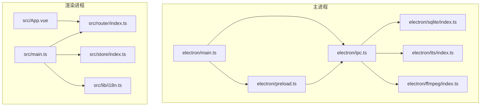
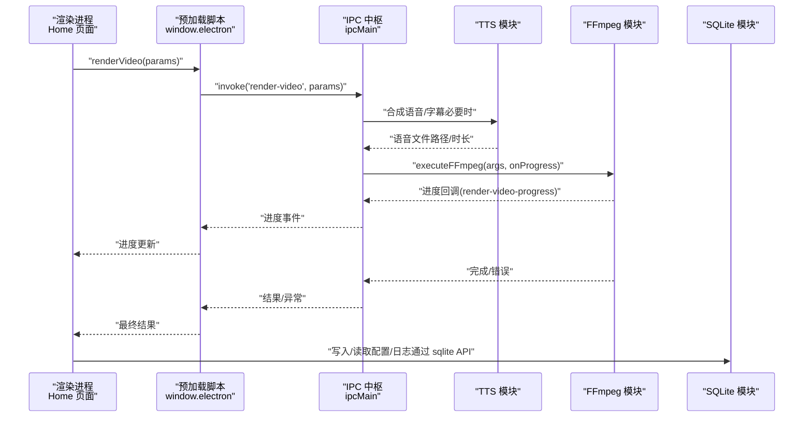
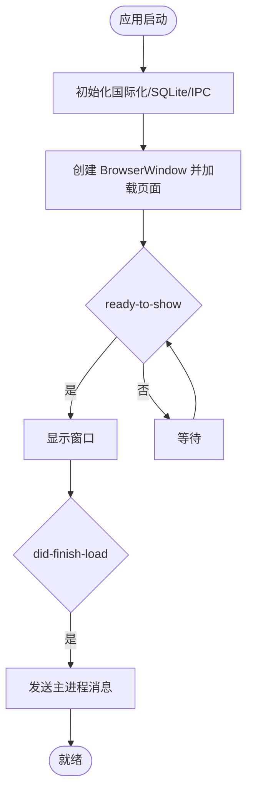
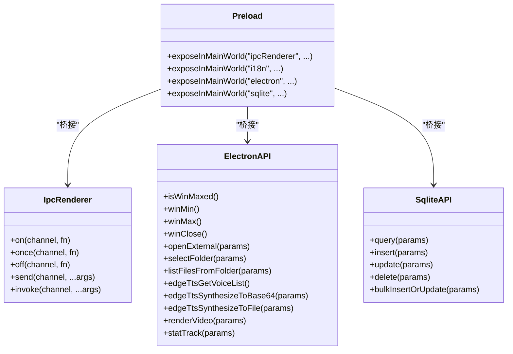
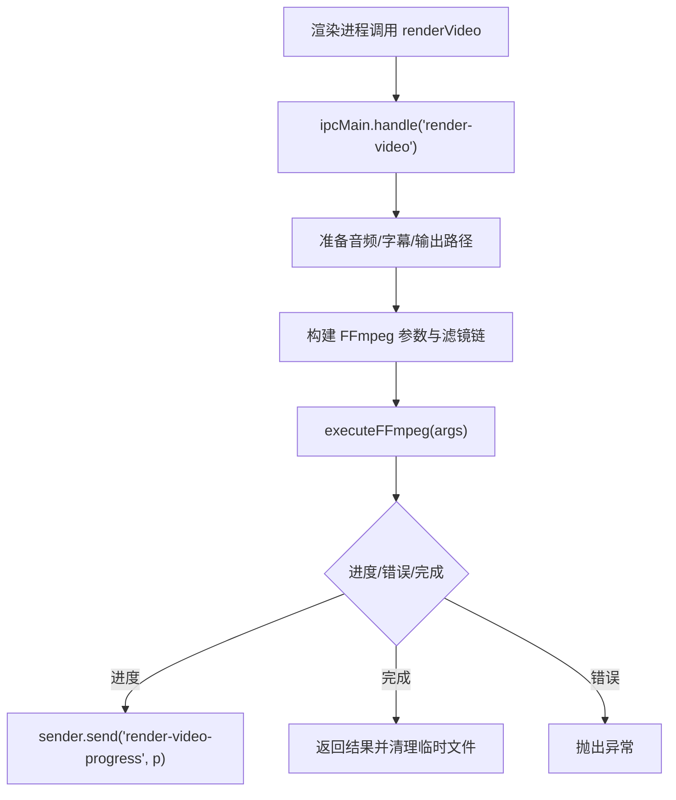
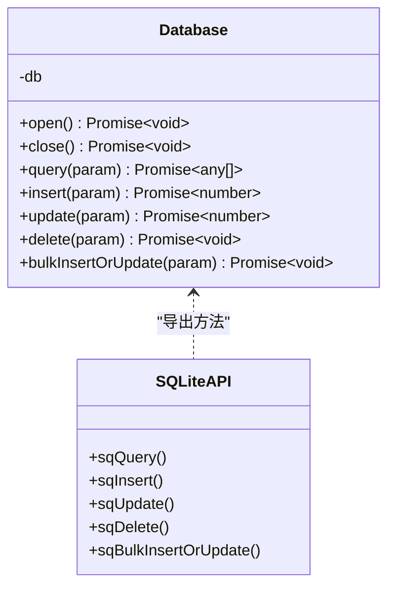
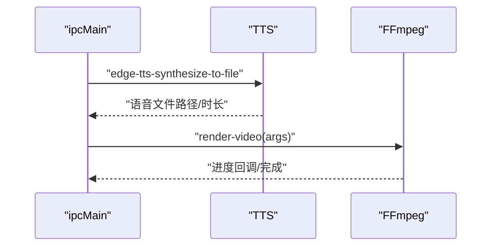
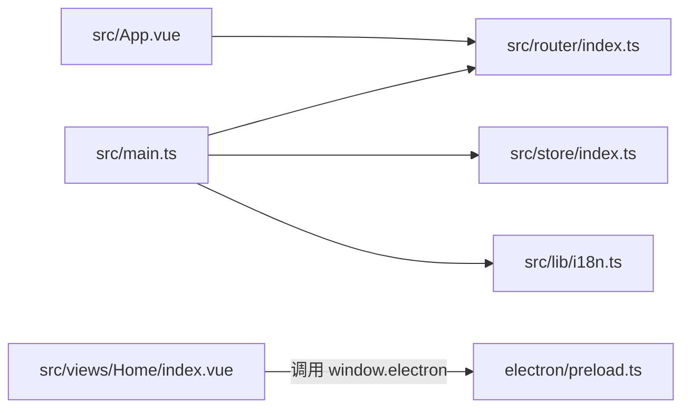
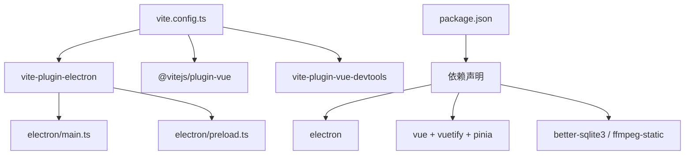

# 整体架构概览

<cite>
**本文引用的文件**
- [electron/main.ts](file://electron/main.ts)
- [electron/preload.ts](file://electron/preload.ts)
- [electron/ipc.ts](file://electron/ipc.ts)
- [electron/sqlite/index.ts](file://electron/sqlite/index.ts)
- [electron/tts/index.ts](file://electron/tts/index.ts)
- [electron/ffmpeg/index.ts](file://electron/ffmpeg/index.ts)
- [src/main.ts](file://src/main.ts)
- [src/App.vue](file://src/App.vue)
- [src/router/index.ts](file://src/router/index.ts)
- [src/store/index.ts](file://src/store/index.ts)
- [src/lib/i18n.ts](file://src/lib/i18n.ts)
- [vite.config.ts](file://vite.config.ts)
- [package.json](file://package.json)
</cite>

## 目录
1. [引言](#引言)
2. [项目结构](#项目结构)
3. [核心组件](#核心组件)
4. [架构总览](#架构总览)
5. [详细组件分析](#详细组件分析)
6. [依赖关系分析](#依赖关系分析)
7. [性能考虑](#性能考虑)
8. [故障排查指南](#故障排查指南)
9. [结论](#结论)

## 引言
本项目采用 Electron 双进程架构，结合 Vue 3 单页应用（SPA）与预加载脚本（Preload）的安全桥接机制，构建跨平台桌面端短视频生产工具。系统围绕“主进程-预加载-渲染进程”三层协作展开：主进程负责系统级能力（窗口、菜单、IPC、原生模块）、预加载脚本提供受控 API 暴露、渲染进程承载前端应用（路由、状态、UI 组件）。同时，系统集成 SQLite 数据持久化、EdgeTTS 语音合成、FFmpeg 视频渲染等核心能力，形成从文案生成到视频导出的完整工作流。

## 项目结构
项目采用“根目录 + electron/ + src/”的清晰分层：
- electron/：主进程入口、预加载脚本、IPC 中枢、SQLite/FFmpeg/TTS 原生封装
- src/：Vue 3 应用入口、路由、状态管理、视图与组件
- 构建与打包：Vite + Electron 插件，开发与生产环境分离

图表来源
- [electron/main.ts:1-204](file://electron/main.ts#L1-L204)
- [electron/ipc.ts:1-188](file://electron/ipc.ts#L1-L188)
- [electron/sqlite/index.ts:1-154](file://electron/sqlite/index.ts#L1-L154)
- [electron/tts/index.ts:1-86](file://electron/tts/index.ts#L1-L86)
- [electron/ffmpeg/index.ts:1-272](file://electron/ffmpeg/index.ts#L1-L272)
- [electron/preload.ts:1-75](file://electron/preload.ts#L1-L75)
- [src/main.ts:1-62](file://src/main.ts#L1-L62)
- [src/App.vue:1-12](file://src/App.vue#L1-L12)
- [src/router/index.ts:1-22](file://src/router/index.ts#L1-L22)
- [src/store/index.ts:1-9](file://src/store/index.ts#L1-L9)
- [src/lib/i18n.ts:1-28](file://src/lib/i18n.ts#L1-L28)

章节来源
- [vite.config.ts:1-53](file://vite.config.ts#L1-L53)
- [package.json:1-85](file://package.json#L1-L85)

## 核心组件
- 主进程（electron/main.ts）
  - 负责创建 BrowserWindow、设置 webPreferences（含 preload）、加载开发/生产页面、构建应用菜单、初始化国际化与 SQLite、禁用 CORS 与本地网络限制等。
  - 生命周期事件：window-all-closed、activate、ready 等。
- 预加载脚本（electron/preload.ts）
  - 通过 contextBridge 将有限、受控的 API 暴露至渲染进程，包括 IPC、国际化、窗口控制、文件系统交互、SQLite、TTS、FFmpeg 渲染等。
- IPC 中枢（electron/ipc.ts）
  - 注册 ipcMain.handle/on，承接来自渲染进程的调用，实现窗口控制、文件夹选择、列出文件、EdgeTTS、统计上报、视频渲染（含进度回调与取消）等。
- SQLite 封装（electron/sqlite/index.ts）
  - 基于 better-sqlite3，按平台/架构选择原生绑定，提供查询、插入、更新、删除、批量 upsert 等方法，并在应用启动时初始化数据库。
- TTS 封装（electron/tts/index.ts）
  - 基于 EdgeTTS，提供语音列表查询、合成到 Base64、合成到文件（含字幕 SRT 生成与时长解析）。
- FFmpeg 封装（electron/ffmpeg/index.ts）
  - 封装复杂滤镜链（裁剪、缩放、拼接、响度归一、混音、字幕叠加），支持进度回调、超时/取消（AbortSignal）、输出校验与清理。
- 渲染进程（src/main.ts + App + Router + Store + i18n）
  - 创建 Vue 应用，挂载 Vuetify、路由、状态管理、国际化；监听主进程消息，接收语言切换事件，触发 UI 与存储同步。

章节来源
- [electron/main.ts:1-204](file://electron/main.ts#L1-L204)
- [electron/preload.ts:1-75](file://electron/preload.ts#L1-L75)
- [electron/ipc.ts:1-188](file://electron/ipc.ts#L1-L188)
- [electron/sqlite/index.ts:1-154](file://electron/sqlite/index.ts#L1-L154)
- [electron/tts/index.ts:1-86](file://electron/tts/index.ts#L1-L86)
- [electron/ffmpeg/index.ts:1-272](file://electron/ffmpeg/index.ts#L1-L272)
- [src/main.ts:1-62](file://src/main.ts#L1-L62)
- [src/App.vue:1-12](file://src/App.vue#L1-L12)
- [src/router/index.ts:1-22](file://src/router/index.ts#L1-L22)
- [src/store/index.ts:1-9](file://src/store/index.ts#L1-L9)
- [src/lib/i18n.ts:1-28](file://src/lib/i18n.ts#L1-L28)

## 架构总览
下图展示了从渲染进程发起任务到主进程协调各子系统完成视频渲染的端到端流程。

图表来源
- [src/views/Home/index.vue:61-238](file://src/views/Home/index.vue#L61-L238)
- [electron/preload.ts:49-65](file://electron/preload.ts#L49-L65)
- [electron/ipc.ts:171-186](file://electron/ipc.ts#L171-L186)
- [electron/tts/index.ts:45-85](file://electron/tts/index.ts#L45-L85)
- [electron/ffmpeg/index.ts:188-244](file://electron/ffmpeg/index.ts#L188-L244)
- [electron/sqlite/index.ts:140-154](file://electron/sqlite/index.ts#L140-L154)

## 详细组件分析

### 主进程与窗口生命周期
- 创建 BrowserWindow 时启用预加载脚本，设置 ready-to-show 与 did-finish-load 回调，实现首屏优化与消息透传。
- 构建应用菜单，支持语言切换、编辑、视图、窗口、帮助等菜单项。
- 初始化国际化、SQLite、IPC；禁用 CORS 与本地网络限制以满足跨域与本地资源访问需求。

图表来源
- [electron/main.ts:187-203](file://electron/main.ts#L187-L203)
- [electron/main.ts:40-76](file://electron/main.ts#L40-L76)

章节来源
- [electron/main.ts:1-204](file://electron/main.ts#L1-L204)

### 预加载脚本与安全桥接
- 通过 contextBridge 将 ipcRenderer、i18n、electron、sqlite 等 API 暴露到 window，统一包装 on/once/off/send/invoke，保证类型安全与调用一致性。
- 仅暴露必要接口，避免直接注入全局对象，降低 XSS 与权限滥用风险。

图表来源
- [electron/preload.ts:18-75](file://electron/preload.ts#L18-L75)

章节来源
- [electron/preload.ts:1-75](file://electron/preload.ts#L1-L75)

### IPC 中枢与业务编排
- 注册 sqlite、窗口控制、文件夹选择、文件列举、EdgeTTS、统计上报、视频渲染等通道。
- 视频渲染通道支持进度回调与取消（AbortController），并在渲染完成后清理临时文件。

图表来源
- [electron/ipc.ts:171-186](file://electron/ipc.ts#L171-L186)
- [electron/ffmpeg/index.ts:188-244](file://electron/ffmpeg/index.ts#L188-L244)

章节来源
- [electron/ipc.ts:1-188](file://electron/ipc.ts#L1-L188)
- [electron/ffmpeg/index.ts:1-272](file://electron/ffmpeg/index.ts#L1-L272)

### SQLite 数据层
- 按平台/架构选择 better-sqlite3 原生绑定，数据库位于 userData 目录，启动时开启外键约束。
- 提供查询、插入、更新、删除、批量 upsert 等方法，便于持久化配置与日志。

图表来源
- [electron/sqlite/index.ts:38-154](file://electron/sqlite/index.ts#L38-L154)

章节来源
- [electron/sqlite/index.ts:1-154](file://electron/sqlite/index.ts#L1-L154)

### TTS 与 FFmpeg 子系统
- TTS：提供语音列表、合成到文件（含字幕 SRT 生成）、时长解析（基于音频元数据）。
- FFmpeg：构建复杂滤镜链（裁剪、缩放、拼接、响度归一、混音、字幕叠加），支持进度解析、超时/取消、输出校验与清理。

图表来源
- [electron/ipc.ts:157-169](file://electron/ipc.ts#L157-L169)
- [electron/tts/index.ts:45-85](file://electron/tts/index.ts#L45-L85)
- [electron/ffmpeg/index.ts:26-186](file://electron/ffmpeg/index.ts#L26-L186)

章节来源
- [electron/tts/index.ts:1-86](file://electron/tts/index.ts#L1-L86)
- [electron/ffmpeg/index.ts:1-272](file://electron/ffmpeg/index.ts#L1-L272)

### Vue 3 前端应用与单页架构
- 应用入口初始化 Vuetify、路由、状态、国际化；挂载后监听主进程消息与语言切换事件。
- 路由采用 Hash 模式，布局组件包裹 Home 视图，Home 内部通过多个功能组件协同完成“文案生成 → 语音合成 → 视频片段 → 视频渲染”的流水线。

图表来源
- [src/main.ts:14-61](file://src/main.ts#L14-L61)
- [src/router/index.ts:1-22](file://src/router/index.ts#L1-L22)
- [src/store/index.ts:1-9](file://src/store/index.ts#L1-L9)
- [src/lib/i18n.ts:1-28](file://src/lib/i18n.ts#L1-L28)
- [src/App.vue:1-12](file://src/App.vue#L1-L12)

章节来源
- [src/main.ts:1-62](file://src/main.ts#L1-L62)
- [src/router/index.ts:1-22](file://src/router/index.ts#L1-L22)
- [src/store/index.ts:1-9](file://src/store/index.ts#L1-L9)
- [src/lib/i18n.ts:1-28](file://src/lib/i18n.ts#L1-L28)
- [src/App.vue:1-12](file://src/App.vue#L1-L12)

## 依赖关系分析
- 构建插件：Vite 配置启用 electron 插件，主进程外部 better-sqlite3，预加载脚本独立 Rollup 输入，渲染进程通过插件桥接到主进程 API。
- 运行时依赖：Electron、better-sqlite3、ffmpeg-static、i18next、Vue 3 生态、Vuetify、Pinia 等。
- 包管理：锁定 Node/PNPM 版本，忽略 better-sqlite3/ffmpeg-static 的预构建，确保二进制兼容。

图表来源
- [vite.config.ts:10-41](file://vite.config.ts#L10-L41)
- [package.json:22-63](file://package.json#L22-L63)

章节来源
- [vite.config.ts:1-53](file://vite.config.ts#L1-L53)
- [package.json:1-85](file://package.json#L1-L85)

## 性能考虑
- 进程与资源
  - 主进程仅承担系统级与 I/O 密集任务，避免在渲染进程执行重型计算。
  - 预加载脚本集中暴露 API，减少跨上下文通信成本。
- 渲染管线
  - FFmpeg 滤镜链一次性构建，尽量减少多次子进程启动；进度解析与取消信号配合，提升交互体验。
  - 临时文件在完成后清理，避免磁盘占用累积。
- 数据持久化
  - SQLite 事务批量 upsert，降低频繁 I/O；外键约束保障数据一致性。
- 国际化与构建
  - 本地化资源通过 file:// 加载，避免网络延迟；Vite DevTools 与 UnoCSS 按需启用，减少包体与冷启动时间。

## 故障排查指南
- 渲染取消与进度
  - 若渲染中途取消，检查渲染状态机与取消事件是否正确发送；确认 AbortController 是否被触发。
- FFmpeg 执行失败
  - 核查输出路径是否存在、可执行文件权限与路径修正（asar 解包）、滤镜链参数合法性。
- TTS 时长异常
  - 确认音频元数据解析与 MIME 类型设置；检查网络与 EdgeTTS 服务可用性。
- IPC 通道未响应
  - 检查预加载脚本是否正确暴露 API；确认通道名称与参数类型一致；验证主进程是否注册 handle/on。
- SQLite 初始化失败
  - 核查 userData 目录权限、原生绑定路径与 better-sqlite3 版本匹配。

章节来源
- [electron/ffmpeg/index.ts:188-244](file://electron/ffmpeg/index.ts#L188-L244)
- [electron/tts/index.ts:70-85](file://electron/tts/index.ts#L70-L85)
- [electron/ipc.ts:171-186](file://electron/ipc.ts#L171-L186)
- [electron/sqlite/index.ts:140-154](file://electron/sqlite/index.ts#L140-L154)

## 结论
该架构以 Electron 双进程为核心，通过预加载脚本实现安全可控的 API 暴露，结合 Vue 3 SPA 的组件化与状态管理，形成从前端交互到原生能力调用的完整闭环。SQLite、TTS、FFmpeg 等子系统在主进程内协同，既保证了安全性，又兼顾了性能与可维护性。建议在后续迭代中进一步细化错误分类与日志体系，增强可视化监控与资源使用指标，持续优化渲染管线与缓存策略。