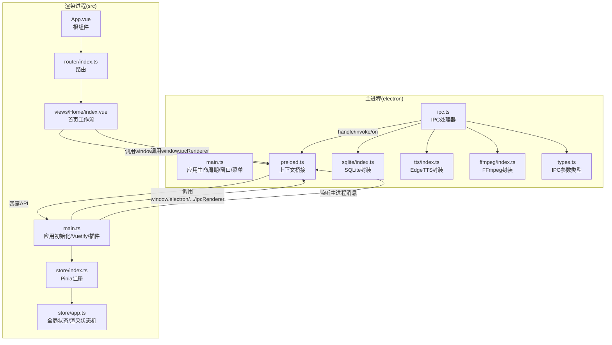
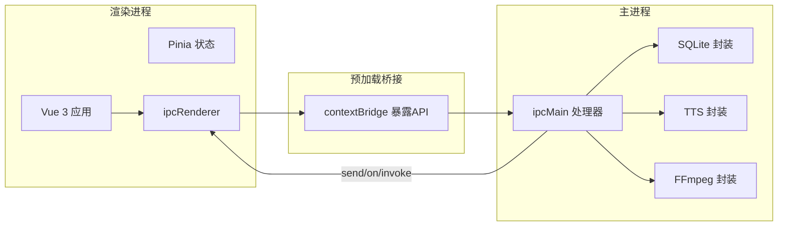
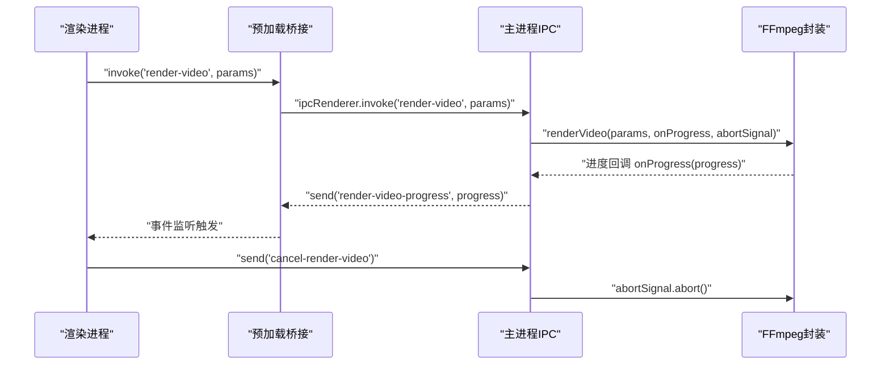
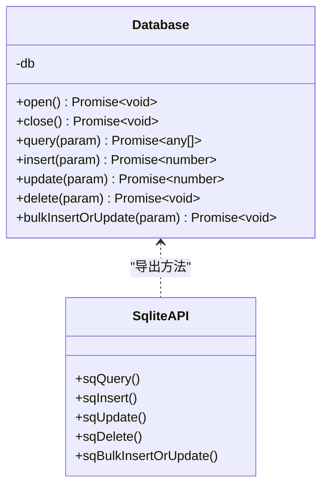
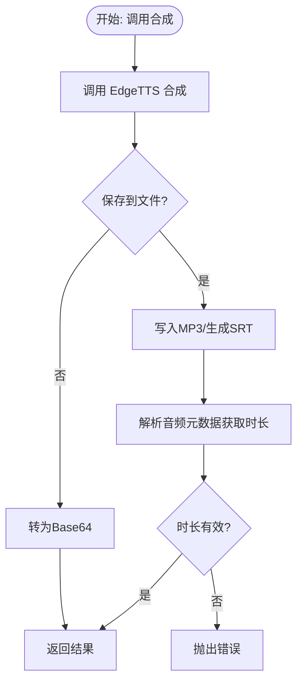
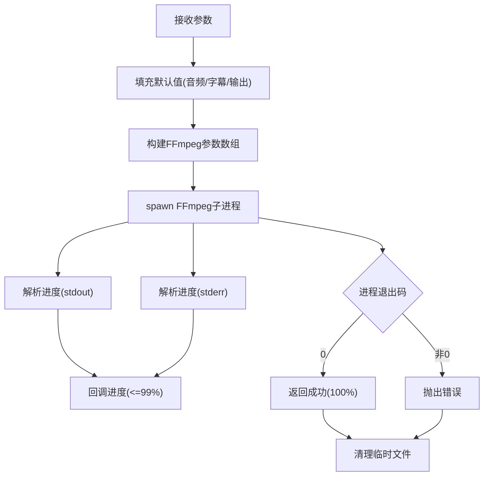
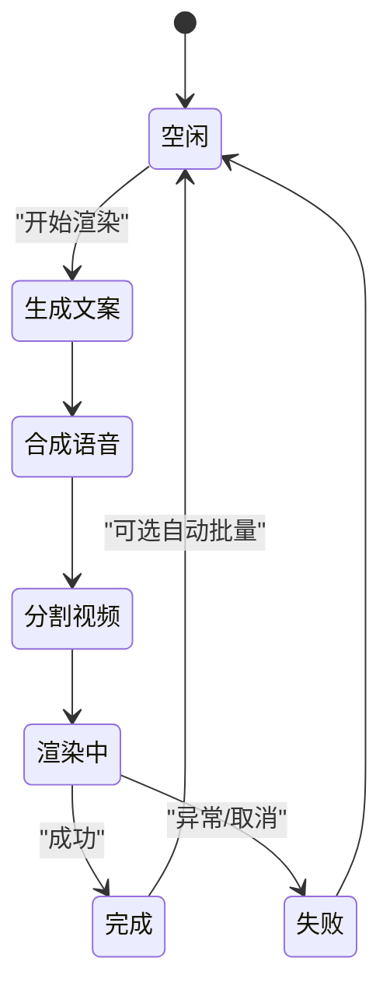
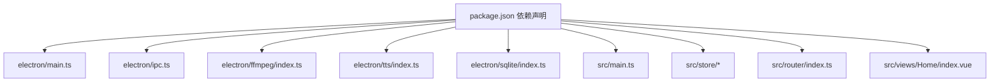
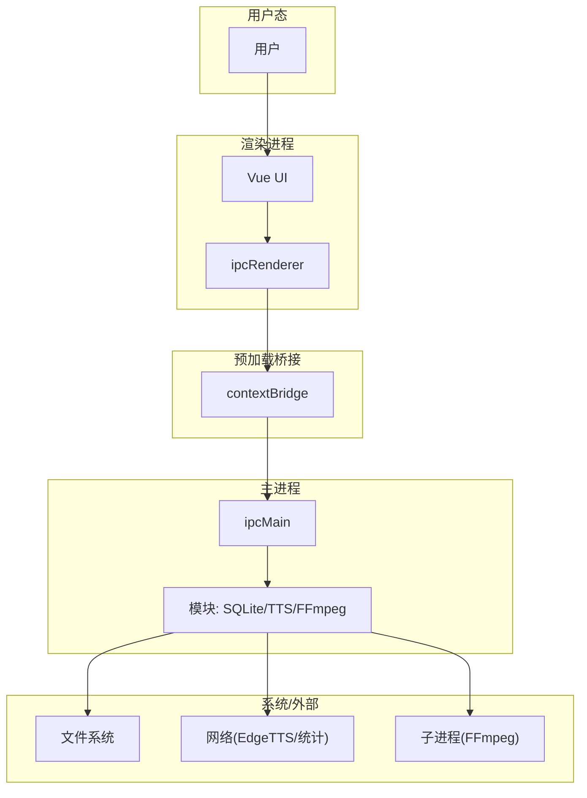

# 架构设计

<cite>
**本文引用的文件**
- [electron/main.ts](file://electron/main.ts)
- [electron/preload.ts](file://electron/preload.ts)
- [electron/ipc.ts](file://electron/ipc.ts)
- [electron/sqlite/index.ts](file://electron/sqlite/index.ts)
- [electron/sqlite/types.ts](file://electron/sqlite/types.ts)
- [electron/tts/index.ts](file://electron/tts/index.ts)
- [electron/tts/types.ts](file://electron/tts/types.ts)
- [electron/ffmpeg/index.ts](file://electron/ffmpeg/index.ts)
- [electron/ffmpeg/types.ts](file://electron/ffmpeg/types.ts)
- [electron/types.ts](file://electron/types.ts)
- [src/main.ts](file://src/main.ts)
- [src/store/index.ts](file://src/store/index.ts)
- [src/store/app.ts](file://src/store/app.ts)
- [src/router/index.ts](file://src/router/index.ts)
- [src/views/Home/index.vue](file://src/views/Home/index.vue)
- [src/App.vue](file://src/App.vue)
- [package.json](file://package.json)
- [README.md](file://README.md)
</cite>

## 目录
1. [简介](#简介)
2. [项目结构](#项目结构)
3. [核心组件](#核心组件)
4. [架构总览](#架构总览)
5. [详细组件分析](#详细组件分析)
6. [依赖分析](#依赖分析)
7. [性能考虑](#性能考虑)
8. [故障排查指南](#故障排查指南)
9. [结论](#结论)
10. [附录](#附录)

## 简介
短视频工厂是一个基于 Electron 的桌面应用，提供从 AI 文案生成、语音合成（EdgeTTS）、视频剪辑到字幕特效的一体化短视频生产流水线。应用采用双进程架构：主进程负责系统级能力（窗口、对话框、文件系统、FFmpeg、SQLite、统计上报等），渲染进程承载 Vue 3 前端应用，二者通过 IPC 通道进行安全、可控的通信。

## 项目结构
项目采用“根目录 + electron + src”的清晰分层：
- electron：主进程入口、预加载桥接、IPC 中央处理器、SQLite 数据访问层、TTS 引擎封装、FFmpeg 渲染引擎、国际化与统计等
- src：Vue 3 应用入口、路由、Pinia 状态管理、页面与组件
- 根目录：构建脚本、打包配置、依赖声明与平台适配

图表来源
- [electron/main.ts:1-204](file://electron/main.ts#L1-L204)
- [electron/preload.ts:1-75](file://electron/preload.ts#L1-L75)
- [electron/ipc.ts:1-188](file://electron/ipc.ts#L1-L188)
- [electron/sqlite/index.ts:1-154](file://electron/sqlite/index.ts#L1-L154)
- [electron/tts/index.ts:1-86](file://electron/tts/index.ts#L1-L86)
- [electron/ffmpeg/index.ts:1-272](file://electron/ffmpeg/index.ts#L1-L272)
- [src/main.ts:1-62](file://src/main.ts#L1-L62)
- [src/store/index.ts:1-9](file://src/store/index.ts#L1-L9)
- [src/store/app.ts:1-114](file://src/store/app.ts#L1-L114)
- [src/router/index.ts:1-22](file://src/router/index.ts#L1-L22)
- [src/views/Home/index.vue:1-244](file://src/views/Home/index.vue#L1-L244)
- [src/App.vue:1-12](file://src/App.vue#L1-L12)

章节来源
- [package.json:1-85](file://package.json#L1-L85)
- [README.md:1-195](file://README.md#L1-L195)

## 核心组件
- 主进程
  - 应用生命周期与窗口管理：创建 BrowserWindow、菜单构建、国际化菜单联动
  - IPC 中央处理器：注册 sqlite、TTS、FFmpeg、文件夹选择、外部链接、窗口控制、统计上报等通道
  - SQLite 封装：better-sqlite3 绑定、数据库路径、CRUD 与批量写入
  - FFmpeg 封装：子进程调用、进度解析、取消信号、输出校验
  - TTS 封装：EdgeTTS 语音列表、合成到 Base64/文件、字幕生成、时长解析
- 预加载桥接
  - 通过 contextBridge 暴露受控 API：window.electron、window.sqlite、window.i18n、window.ipcRenderer
- 渲染进程
  - Vue 3 应用：Vuetify、路由、Toast、国际化
  - Pinia 状态管理：全局状态、渲染状态机、配置持久化
  - 首页工作流：文案生成 → TTS → 视频分段 → FFmpeg 合成 → 结果反馈

章节来源
- [electron/main.ts:1-204](file://electron/main.ts#L1-L204)
- [electron/preload.ts:1-75](file://electron/preload.ts#L1-L75)
- [electron/ipc.ts:1-188](file://electron/ipc.ts#L1-L188)
- [electron/sqlite/index.ts:1-154](file://electron/sqlite/index.ts#L1-L154)
- [electron/tts/index.ts:1-86](file://electron/tts/index.ts#L1-L86)
- [electron/ffmpeg/index.ts:1-272](file://electron/ffmpeg/index.ts#L1-L272)
- [src/main.ts:1-62](file://src/main.ts#L1-L62)
- [src/store/index.ts:1-9](file://src/store/index.ts#L1-L9)
- [src/store/app.ts:1-114](file://src/store/app.ts#L1-L114)
- [src/router/index.ts:1-22](file://src/router/index.ts#L1-L22)
- [src/views/Home/index.vue:1-244](file://src/views/Home/index.vue#L1-L244)

## 架构总览
双进程架构遵循“安全隔离、职责清晰”的原则：
- 主进程：系统资源、文件系统、外部进程（FFmpeg）、数据库、网络请求、窗口控制
- 渲染进程：UI、业务逻辑、状态管理、IPC 调用与事件监听

图表来源
- [electron/preload.ts:1-75](file://electron/preload.ts#L1-L75)
- [electron/ipc.ts:1-188](file://electron/ipc.ts#L1-L188)
- [electron/sqlite/index.ts:1-154](file://electron/sqlite/index.ts#L1-L154)
- [electron/tts/index.ts:1-86](file://electron/tts/index.ts#L1-L86)
- [electron/ffmpeg/index.ts:1-272](file://electron/ffmpeg/index.ts#L1-L272)
- [src/main.ts:1-62](file://src/main.ts#L1-L62)

## 详细组件分析

### 主进程：应用生命周期与窗口
- 职责
  - 初始化应用根路径、开发/生产资源路径
  - 创建 BrowserWindow（无边框、最小尺寸、背景色、预加载脚本）
  - ready-to-show 时机显示窗口；did-finish-load 发送主进程消息并上报统计
  - 构建应用菜单（macOS 特性、语言切换菜单项）
  - app-level 事件：window-all-closed、activate、before-quit
- 协作
  - 与 IPC 层配合，提供窗口控制、文件夹选择、外部链接等能力
  - 与 SQLite、TTS、FFmpeg 模块协作完成数据与媒体处理

章节来源
- [electron/main.ts:1-204](file://electron/main.ts#L1-L204)

### 预加载桥接：安全 API 暴露
- 职责
  - 通过 contextBridge 将 ipcRenderer、electron、sqlite、i18n 等 API 暴露到渲染进程
  - 仅暴露白名单方法，避免直接注入全局对象
- 设计要点
  - 包装 on/once/off/send/invoke，保证 channel 与参数传递一致
  - 将原生能力映射为易用的函数（窗口控制、文件夹选择、TTS、FFmpeg、SQLite）

章节来源
- [electron/preload.ts:1-75](file://electron/preload.ts#L1-L75)

### IPC 通信层：消息协议与数据序列化
- 协议设计
  - 通道命名规范：统一使用字符串通道标识（如 “sqlite-query”、“render-video”、“win-max” 等）
  - 调用模式：
    - invoke/on：主进程 handle 注册，渲染进程 invoke 调用，支持 Promise 化返回
    - send/on：主进程 on 注册，渲染进程 send 调用，常用于事件推送（如渲染进度）
- 数据序列化
  - 通过 Electron IPC 自动序列化 JS 对象；复杂对象（如 Buffer、正则）需显式转换
  - 参数类型由各模块 types.ts 定义，确保强类型约束
- 取消与进度
  - 渲染视频支持 AbortController 与 “cancel-render-video” 通道，实现可中断渲染

图表来源
- [electron/ipc.ts:170-187](file://electron/ipc.ts#L170-L187)
- [electron/ffmpeg/index.ts:188-244](file://electron/ffmpeg/index.ts#L188-L244)
- [electron/preload.ts:63-65](file://electron/preload.ts#L63-L65)

章节来源
- [electron/ipc.ts:1-188](file://electron/ipc.ts#L1-188)
- [electron/types.ts:1-26](file://electron/types.ts#L1-L26)
- [electron/ffmpeg/types.ts:1-23](file://electron/ffmpeg/types.ts#L1-L23)

### SQLite 数据层：本地存储与批量写入
- 能力
  - 连接数据库、查询、插入、更新、删除、批量插入或更新（ON CONFLICT DO UPDATE）
  - 事务封装，保证批量写入一致性
- 平台适配
  - 根据平台与架构动态选择 better-sqlite3 原生绑定
  - 数据库文件位于 userData 目录
- 类型约束
  - 通过 QueryParams、InsertParams、UpdateParams、DeleteParams、BulkInsertOrUpdateParams 约束参数

图表来源
- [electron/sqlite/index.ts:38-154](file://electron/sqlite/index.ts#L38-L154)
- [electron/sqlite/types.ts:1-26](file://electron/sqlite/types.ts#L1-L26)

章节来源
- [electron/sqlite/index.ts:1-154](file://electron/sqlite/index.ts#L1-L154)
- [electron/sqlite/types.ts:1-26](file://electron/sqlite/types.ts#L1-L26)

### TTS 引擎：EdgeTTS 封装与字幕生成
- 能力
  - 获取语音列表、合成到 Base64/文件、生成 SRT 字幕
  - 时长解析与有效性校验，异常抛出
- 生命周期
  - 应用退出前清理临时 TTS 文件
- 类型约束
  - EdgeTtsSynthesizeCommonParams、EdgeTtsSynthesizeToFileParams、EdgeTtsSynthesizeToFileResult

图表来源
- [electron/tts/index.ts:39-86](file://electron/tts/index.ts#L39-L86)
- [electron/tts/types.ts:1-20](file://electron/tts/types.ts#L1-L20)

章节来源
- [electron/tts/index.ts:1-86](file://electron/tts/index.ts#L1-L86)
- [electron/tts/types.ts:1-20](file://electron/tts/types.ts#L1-L20)

### FFmpeg 渲染引擎：视频合成与进度回调
- 能力
  - 多视频片段拼接、裁剪、缩放、帧率统一、字幕叠加
  - 音频响度归一化、混合、trim 到目标时长
  - 进度解析（基于 stderr 时间戳）、可中断执行、输出校验与临时文件清理
- 参数与结果
  - RenderVideoParams：视频/音频/字幕/输出尺寸/路径/时长/音量配置
  - ExecuteFFmpegResult：stdout/stderr/code

图表来源
- [electron/ffmpeg/index.ts:26-186](file://electron/ffmpeg/index.ts#L26-L186)
- [electron/ffmpeg/index.ts:188-244](file://electron/ffmpeg/index.ts#L188-L244)
- [electron/ffmpeg/types.ts:1-23](file://electron/ffmpeg/types.ts#L1-L23)

章节来源
- [electron/ffmpeg/index.ts:1-272](file://electron/ffmpeg/index.ts#L1-L272)
- [electron/ffmpeg/types.ts:1-23](file://electron/ffmpeg/types.ts#L1-L23)

### 渲染进程：Vue 3 前端与状态管理
- 应用初始化
  - 注册 Vuetify、Toast、路由、Pinia；初始化国际化
  - 监听主进程消息与语言切换事件
- 路由与布局
  - 使用 HashHistory，根组件包裹 RouterView
- 状态管理
  - Pinia + 持久化插件，持久化部分字段，避免冗余
  - AppStore 定义渲染状态机（None/GenerateText/SynthesizedSpeech/SegmentVideo/Rendering/Completed/Failed）
- 首页工作流
  - 文案生成 → TTS 合成 → 视频分段 → FFmpeg 合成 → 成功/失败反馈
  - 支持批量自动重跑与取消渲染

图表来源
- [src/store/app.ts:5-13](file://src/store/app.ts#L5-L13)
- [src/views/Home/index.vue:65-238](file://src/views/Home/index.vue#L65-L238)

章节来源
- [src/main.ts:1-62](file://src/main.ts#L1-L62)
- [src/store/index.ts:1-9](file://src/store/index.ts#L1-L9)
- [src/store/app.ts:1-114](file://src/store/app.ts#L1-L114)
- [src/router/index.ts:1-22](file://src/router/index.ts#L1-L22)
- [src/views/Home/index.vue:1-244](file://src/views/Home/index.vue#L1-L244)
- [src/App.vue:1-12](file://src/App.vue#L1-L12)

## 依赖分析
- 内部耦合
  - 预加载桥接是渲染进程与主进程的唯一接口，降低直接依赖风险
  - IPC 处理器集中注册所有通道，便于维护与扩展
  - 渲染进程通过 window.electron/window.sqlite/window.ipcRenderer 统一调用
- 外部依赖
  - better-sqlite3、ffmpeg-static、i18next、Pinia、Vue 3、Vuetify、Vue Router、Vue Toastification
- 平台与构建
  - electron-builder 打包；原生模块通过 onlyBuiltDependencies 与 postinstall 脚本处理

图表来源
- [package.json:1-85](file://package.json#L1-L85)
- [electron/main.ts:1-204](file://electron/main.ts#L1-L204)
- [electron/ipc.ts:1-188](file://electron/ipc.ts#L1-L188)
- [electron/ffmpeg/index.ts:1-272](file://electron/ffmpeg/index.ts#L1-L272)
- [electron/tts/index.ts:1-86](file://electron/tts/index.ts#L1-L86)
- [electron/sqlite/index.ts:1-154](file://electron/sqlite/index.ts#L1-L154)
- [src/main.ts:1-62](file://src/main.ts#L1-L62)
- [src/store/index.ts:1-9](file://src/store/index.ts#L1-L9)
- [src/router/index.ts:1-22](file://src/router/index.ts#L1-L22)
- [src/views/Home/index.vue:1-244](file://src/views/Home/index.vue#L1-L244)

章节来源
- [package.json:1-85](file://package.json#L1-L85)

## 性能考虑
- 渲染性能
  - FFmpeg 编码参数（libx264 preset/crf/fps/aac/bits）平衡质量与速度
  - 响度归一化与混合在目标时长前 trim，减少无效计算
- I/O 与内存
  - SQLite 批量写入使用事务，降低磁盘写放大
  - TTS 与 FFmpeg 产物清理，避免临时文件堆积
- 可中断与进度反馈
  - AbortController + “cancel-render-video” 通道，提升用户体验
- 跨平台与原生模块
  - better-sqlite3 原生绑定按平台/架构选择，减少跨平台兼容成本

## 故障排查指南
- FFmpeg 执行失败
  - 检查可执行文件存在与权限；确认输出目录存在；关注 stderr 错误码
  - 参考路径与校验逻辑
    - [electron/ffmpeg/index.ts:246-259](file://electron/ffmpeg/index.ts#L246-L259)
    - [electron/ffmpeg/index.ts:233-235](file://electron/ffmpeg/index.ts#L233-L235)
- TTS 时长无效
  - 音频元数据解析失败或时长为非有限值，检查网络与 TTS 配置
  - 参考
    - [electron/tts/index.ts:74-81](file://electron/tts/index.ts#L74-L81)
- SQLite 写入异常
  - foreign_keys 与事务一致性；核对表结构与冲突键
  - 参考
    - [electron/sqlite/index.ts:49](file://electron/sqlite/index.ts#L49)
    - [electron/sqlite/index.ts:125-134](file://electron/sqlite/index.ts#L125-L134)
- IPC 通道未响应
  - 确认通道名称一致、参数类型匹配；检查预加载桥接是否正确暴露
  - 参考
    - [electron/preload.ts:20-41](file://electron/preload.ts#L20-L41)
    - [electron/ipc.ts:77-87](file://electron/ipc.ts#L77-L87)

章节来源
- [electron/ffmpeg/index.ts:233-259](file://electron/ffmpeg/index.ts#L233-L259)
- [electron/tts/index.ts:74-81](file://electron/tts/index.ts#L74-L81)
- [electron/sqlite/index.ts:49](file://electron/sqlite/index.ts#L49)
- [electron/sqlite/index.ts:125-134](file://electron/sqlite/index.ts#L125-L134)
- [electron/preload.ts:20-41](file://electron/preload.ts#L20-L41)
- [electron/ipc.ts:77-87](file://electron/ipc.ts#L77-L87)

## 结论
该架构以 Electron 双进程为核心，通过预加载桥接与 IPC 通道实现安全可控的进程间通信。主进程聚焦系统能力与媒体处理，渲染进程专注 UI 与业务编排。借助 Pinia 状态管理与组件化设计，系统具备良好的可维护性与扩展性。未来可在 IPC 类型体系、错误边界与日志追踪方面进一步增强工程化能力。

## 附录
- 系统边界图（概念示意）
