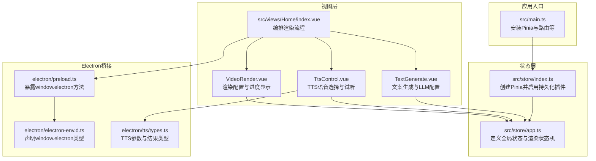
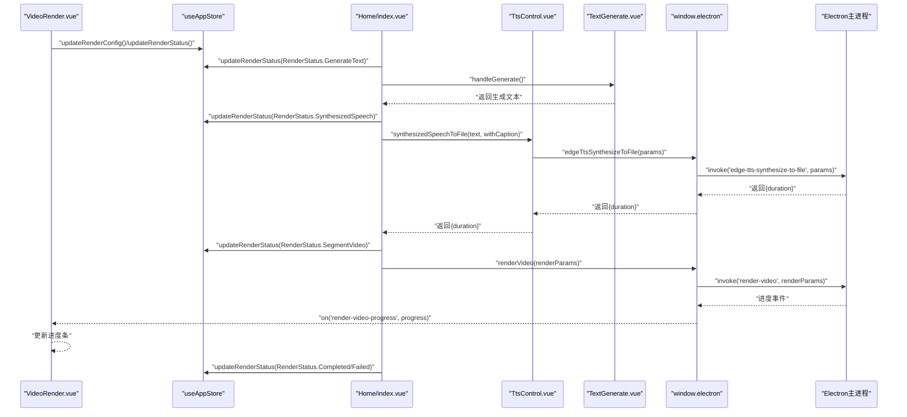
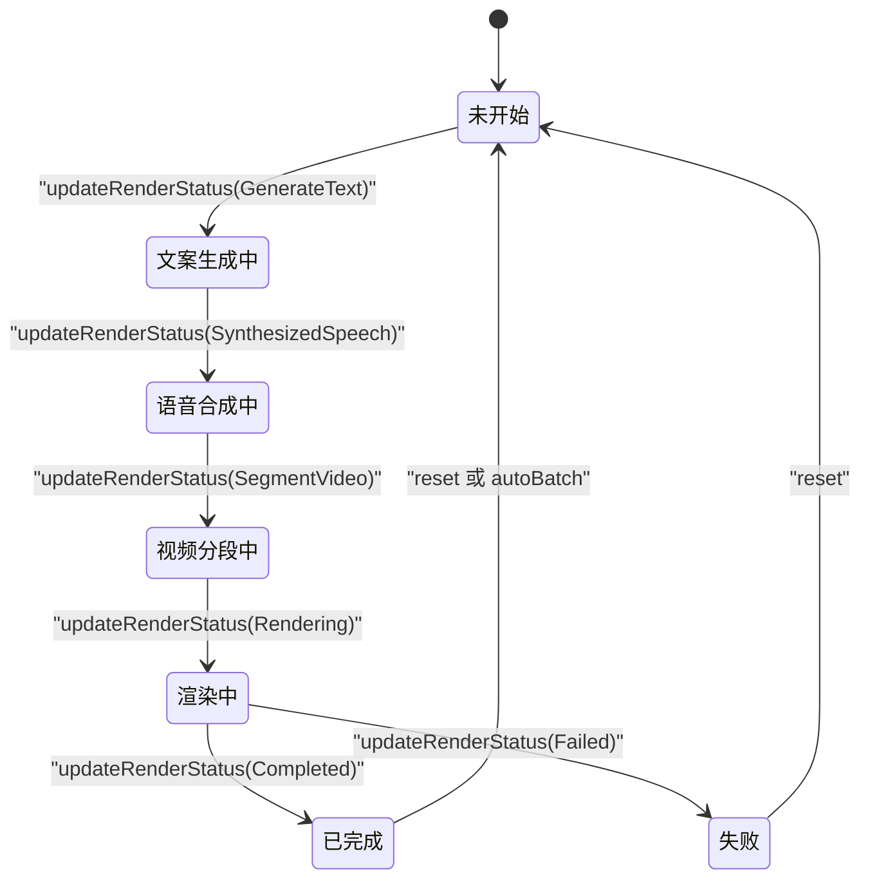
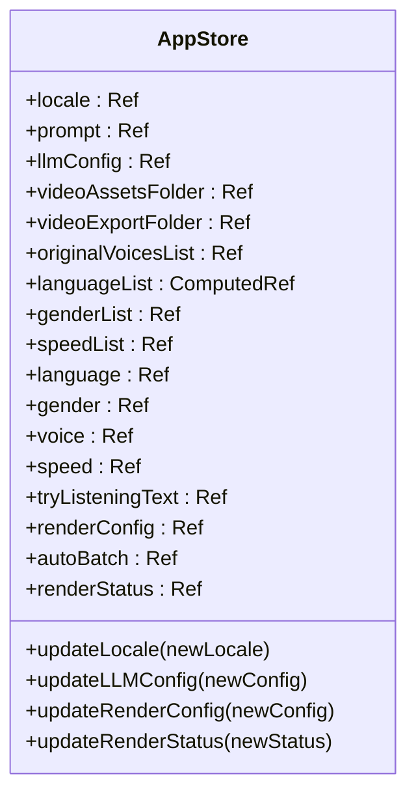
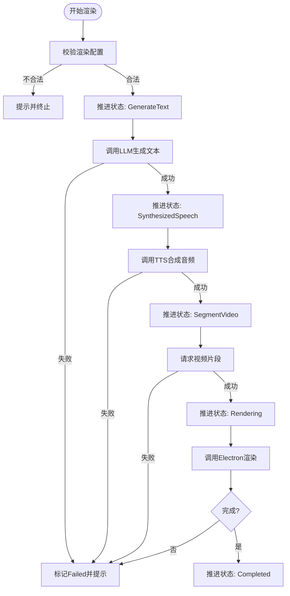
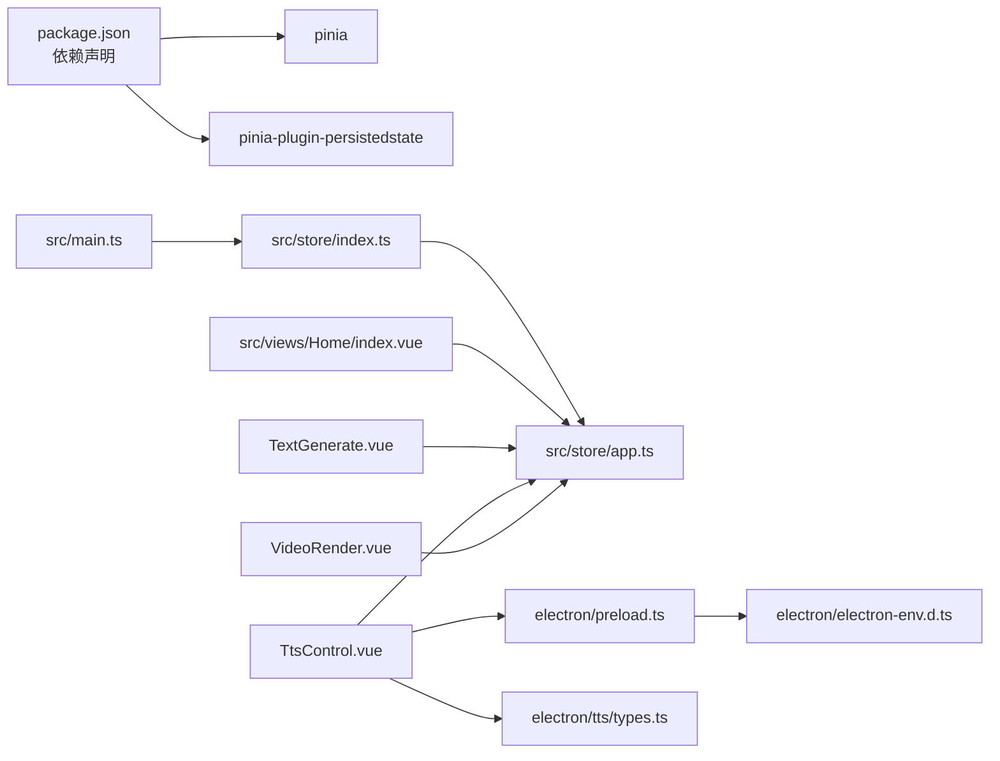

# 状态管理架构

<cite>
**本文引用的文件**
- [src/store/index.ts](file://src/store/index.ts)
- [src/store/app.ts](file://src/store/app.ts)
- [src/main.ts](file://src/main.ts)
- [src/views/Home/index.vue](file://src/views/Home/index.vue)
- [src/views/Home/components/TextGenerate.vue](file://src/views/Home/components/TextGenerate.vue)
- [src/views/Home/components/TtsControl.vue](file://src/views/Home/components/TtsControl.vue)
- [src/views/Home/components/VideoRender.vue](file://src/views/Home/components/VideoRender.vue)
- [electron/tts/types.ts](file://electron/tts/types.ts)
- [electron/electron-env.d.ts](file://electron/electron-env.d.ts)
- [electron/preload.ts](file://electron/preload.ts)
- [package.json](file://package.json)
</cite>

## 目录
1. [简介](#简介)
2. [项目结构](#项目结构)
3. [核心组件](#核心组件)
4. [架构总览](#架构总览)
5. [详细组件分析](#详细组件分析)
6. [依赖关系分析](#依赖关系分析)
7. [性能考量](#性能考量)
8. [故障排查指南](#故障排查指南)
9. [结论](#结论)
10. [附录](#附录)

## 简介
本文件面向“短视频工厂”项目的前端状态管理架构，围绕 Pinia 的设计理念与实现细节展开，系统阐述全局状态的组织结构、状态变更的触发机制与响应式更新策略；重点解析渲染状态机（RenderStatus）的设计原理、状态枚举与转换规则以及状态持久化机制；同时说明状态与 UI 组件的绑定方式、状态订阅与派发模式，并给出最佳实践、性能优化策略与调试技巧。文末提供具体场景下的代码示例路径，帮助读者快速定位实现位置。

## 项目结构
项目采用基于功能模块的组织方式，状态管理位于 src/store 目录，通过单一入口导出 Store 实例，并在应用入口完成安装。渲染状态机贯穿 Home 页面的三个子组件：文案生成、语音合成控制、视频渲染控制，形成完整的流水线。

图表来源
- [src/main.ts:14-44](file://src/main.ts#L14-L44)
- [src/store/index.ts:1-9](file://src/store/index.ts#L1-L9)
- [src/store/app.ts:15-114](file://src/store/app.ts#L15-L114)
- [src/views/Home/index.vue:31-244](file://src/views/Home/index.vue#L31-L244)
- [src/views/Home/components/TextGenerate.vue:110-272](file://src/views/Home/components/TextGenerate.vue#L110-L272)
- [src/views/Home/components/TtsControl.vue:59-234](file://src/views/Home/components/TtsControl.vue#L59-L234)
- [src/views/Home/components/VideoRender.vue:175-246](file://src/views/Home/components/VideoRender.vue#L175-L246)
- [electron/preload.ts:49-65](file://electron/preload.ts#L49-L65)
- [electron/electron-env.d.ts:24-54](file://electron/electron-env.d.ts#L24-L54)
- [electron/tts/types.ts:1-20](file://electron/tts/types.ts#L1-L20)

章节来源
- [src/main.ts:14-44](file://src/main.ts#L14-L44)
- [src/store/index.ts:1-9](file://src/store/index.ts#L1-L9)
- [src/store/app.ts:15-114](file://src/store/app.ts#L15-L114)

## 核心组件
- 全局状态容器：在状态入口中创建 Pinia 实例并启用持久化插件，确保关键状态在页面刷新后仍可恢复。
- 应用状态仓库：定义多类状态域（国际化、LLM 配置、素材目录、TTS 语音与速度、渲染配置与渲染状态），并通过返回值暴露 getter 与 setter，便于组件直接读写。
- 渲染状态机：以枚举形式定义渲染生命周期，作为跨组件协作的统一信号源，驱动 UI 禁用态、进度与提示信息。
- 持久化策略：通过 store 定义的持久化配置，仅持久化必要字段，避免冗余数据污染存储。

章节来源
- [src/store/index.ts:1-9](file://src/store/index.ts#L1-L9)
- [src/store/app.ts:15-114](file://src/store/app.ts#L15-L114)

## 架构总览
下图展示了从 UI 到状态再到 Electron 主进程的完整调用链路，体现状态驱动 UI、UI 触发状态变更、状态变更驱动外部能力调用的闭环。

图表来源
- [src/views/Home/components/VideoRender.vue:175-246](file://src/views/Home/components/VideoRender.vue#L175-L246)
- [src/views/Home/index.vue:65-212](file://src/views/Home/index.vue#L65-L212)
- [src/views/Home/components/TtsControl.vue:209-228](file://src/views/Home/components/TtsControl.vue#L209-L228)
- [src/views/Home/components/TextGenerate.vue:132-198](file://src/views/Home/components/TextGenerate.vue#L132-L198)
- [electron/preload.ts:49-65](file://electron/preload.ts#L49-L65)
- [electron/electron-env.d.ts:24-54](file://electron/electron-env.d.ts#L24-L54)

## 详细组件分析

### 渲染状态机设计与实现
- 状态枚举：RenderStatus 定义了从“未开始”到“完成/失败”的完整生命周期，作为跨组件协作的统一信号。
- 状态转换规则：
  - 文案生成阶段：由 Home 调用文案生成组件，完成后将状态推进至“语音合成”。
  - 语音合成阶段：由 Home 调用 TTS 控制组件进行文件合成，完成后推进至“视频分段”。
  - 视频分段阶段：由 Home 请求素材片段，完成后推进至“渲染中”。
  - 渲染阶段：通过 Electron 主进程执行渲染，期间接收进度事件，最终根据结果进入“完成”或“失败”。
- 状态持久化：在 store 定义中对部分字段进行持久化排除，避免将临时 UI 状态写入持久化存储。

图表来源
- [src/store/app.ts:5-13](file://src/store/app.ts#L5-L13)
- [src/store/app.ts:76-78](file://src/store/app.ts#L76-L78)
- [src/views/Home/index.vue:123-181](file://src/views/Home/index.vue#L123-L181)

章节来源
- [src/store/app.ts:5-13](file://src/store/app.ts#L5-L13)
- [src/store/app.ts:76-78](file://src/store/app.ts#L76-L78)
- [src/views/Home/index.vue:123-181](file://src/views/Home/index.vue#L123-L181)

### 全局状态组织与持久化策略
- 状态域划分：
  - 国际化与 LLM 配置：locale、prompt、llmConfig 及其更新函数。
  - 素材与输出：videoAssetsFolder、videoExportFolder。
  - TTS 语音与速度：originalVoicesList、languageList、genderList、speedList、language、gender、voice、speed、tryListeningText。
  - 渲染配置与状态：renderConfig、autoBatch、renderStatus 及其更新函数。
- 持久化配置：通过 store 的 persist 选项对特定字段进行排除，避免将临时 UI 状态写入持久化存储，减少存储体积与潜在冲突。

图表来源
- [src/store/app.ts:15-114](file://src/store/app.ts#L15-L114)

章节来源
- [src/store/app.ts:15-114](file://src/store/app.ts#L15-L114)

### UI 绑定与状态派发模式
- 绑定方式：各组件通过组合式 API 访问 useAppStore 并直接读取/修改状态，如 TTS 控件直接绑定 appStore.voice、speed 等。
- 派发模式：Home 页面在不同阶段调用对应组件的方法并推进状态机，例如在文案生成完成后调用 TTS 合成，并在 TTS 成功后再请求视频分段。
- 禁用态与进度：VideoRender 根据 renderStatus 显示不同状态芯片与进度条，任务进行中禁用配置与启动按钮，保证流程有序。

图表来源
- [src/views/Home/index.vue:65-212](file://src/views/Home/index.vue#L65-L212)
- [src/views/Home/components/TextGenerate.vue:132-198](file://src/views/Home/components/TextGenerate.vue#L132-L198)
- [src/views/Home/components/TtsControl.vue:209-228](file://src/views/Home/components/TtsControl.vue#L209-L228)
- [src/views/Home/components/VideoRender.vue:188-199](file://src/views/Home/components/VideoRender.vue#L188-L199)

章节来源
- [src/views/Home/index.vue:65-212](file://src/views/Home/index.vue#L65-L212)
- [src/views/Home/components/TextGenerate.vue:132-198](file://src/views/Home/components/TextGenerate.vue#L132-L198)
- [src/views/Home/components/TtsControl.vue:209-228](file://src/views/Home/components/TtsControl.vue#L209-L228)
- [src/views/Home/components/VideoRender.vue:188-199](file://src/views/Home/components/VideoRender.vue#L188-L199)

### 状态与 Electron 主进程的集成
- 类型声明：通过 electron/electron-env.d.ts 声明 window.electron 的可用方法，确保在渲染器中调用时具备类型安全。
- 方法暴露：electron/preload.ts 将主进程能力通过 contextBridge 暴露到 window.electron，供 UI 直接调用。
- 参数与返回：TTS 合成参数与结果在 electron/tts/types.ts 中定义，保证调用一致性。

章节来源
- [electron/electron-env.d.ts:24-54](file://electron/electron-env.d.ts#L24-L54)
- [electron/preload.ts:49-65](file://electron/preload.ts#L49-L65)
- [electron/tts/types.ts:1-20](file://electron/tts/types.ts#L1-L20)

## 依赖关系分析
- 状态管理依赖：Pinia 为核心，配合 pinia-plugin-persistedstate 实现持久化。
- 组件依赖：Home 页面聚合三个子组件，子组件依赖 useAppStore 进行状态读写。
- 外部依赖：Electron 提供窗口控制、文件系统访问、TTS 合成与视频渲染等能力，通过 preload 暴露到渲染器。

图表来源
- [package.json:48-49](file://package.json#L48-L49)
- [package.json:49](file://package.json#L49)
- [src/main.ts:16](file://src/main.ts#L16)
- [src/store/index.ts:1-9](file://src/store/index.ts#L1-L9)
- [src/store/app.ts:15-114](file://src/store/app.ts#L15-L114)
- [src/views/Home/index.vue:38](file://src/views/Home/index.vue#L38)
- [src/views/Home/components/TextGenerate.vue:111](file://src/views/Home/components/TextGenerate.vue#L111)
- [src/views/Home/components/TtsControl.vue:61](file://src/views/Home/components/TtsControl.vue#L61)
- [src/views/Home/components/VideoRender.vue:178](file://src/views/Home/components/VideoRender.vue#L178)
- [electron/preload.ts:49-65](file://electron/preload.ts#L49-L65)
- [electron/electron-env.d.ts:24-54](file://electron/electron-env.d.ts#L24-L54)
- [electron/tts/types.ts:1-20](file://electron/tts/types.ts#L1-L20)

章节来源
- [package.json:48-49](file://package.json#L48-L49)
- [package.json:49](file://package.json#L49)
- [src/main.ts:16](file://src/main.ts#L16)
- [src/store/index.ts:1-9](file://src/store/index.ts#L1-L9)
- [src/store/app.ts:15-114](file://src/store/app.ts#L15-L114)

## 性能考量
- 响应式粒度：将语言列表等计算属性拆分为 computed，避免每次渲染都重新计算，降低不必要的重渲染成本。
- 状态持久化：仅持久化必要字段，避免将临时 UI 状态写入存储，减少存储体积与初始化开销。
- 异步流程控制：在 Home 页面中严格检查当前状态再推进，防止并发状态导致的竞态与重复调用。
- 进度监听：通过 IPC 接收渲染进度事件，避免轮询带来的额外开销。

## 故障排查指南
- 状态未更新：确认组件是否正确导入并使用 useAppStore，检查状态更新函数是否被调用。
- 状态未持久化：核对 store 的 persist 配置，确认目标字段是否在排除列表之外。
- IPC 调用失败：检查 electron/preload.ts 是否正确暴露方法，electron/electron-env.d.ts 是否声明对应类型。
- TTS 合成异常：验证 voice、speed 等参数是否有效，参考 electron/tts/types.ts 的参数定义。
- 渲染失败：关注 Home 页面的错误处理逻辑，结合 toast 与日志定位问题。

章节来源
- [src/store/app.ts:108-112](file://src/store/app.ts#L108-L112)
- [electron/preload.ts:49-65](file://electron/preload.ts#L49-L65)
- [electron/electron-env.d.ts:24-54](file://electron/electron-env.d.ts#L24-L54)
- [electron/tts/types.ts:1-20](file://electron/tts/types.ts#L1-L20)
- [src/views/Home/index.vue:188-211](file://src/views/Home/index.vue#L188-L211)

## 结论
本项目以 Pinia 为核心构建状态管理，通过清晰的状态域划分与渲染状态机，实现了从文案生成到视频渲染的端到端流程控制。借助持久化插件与严格的异步流程控制，既保证了用户体验的一致性，也兼顾了性能与可维护性。建议在后续迭代中持续优化状态粒度与持久化策略，完善错误边界与可观测性，进一步提升系统的稳定性与可扩展性。

## 附录
- 代码示例路径（不含具体代码内容）：
  - 状态入口与持久化插件安装：[src/store/index.ts:1-9](file://src/store/index.ts#L1-L9)
  - 应用状态定义与渲染状态机：[src/store/app.ts:15-114](file://src/store/app.ts#L15-L114)
  - 应用入口安装 Store 与路由：[src/main.ts:14-44](file://src/main.ts#L14-L44)
  - 渲染流程编排与状态推进：[src/views/Home/index.vue:65-212](file://src/views/Home/index.vue#L65-L212)
  - 文案生成组件与 LLM 配置：[src/views/Home/components/TextGenerate.vue:110-272](file://src/views/Home/components/TextGenerate.vue#L110-L272)
  - TTS 控制组件与语音合成：[src/views/Home/components/TtsControl.vue:59-234](file://src/views/Home/components/TtsControl.vue#L59-L234)
  - 渲染配置与进度监听：[src/views/Home/components/VideoRender.vue:175-246](file://src/views/Home/components/VideoRender.vue#L175-L246)
  - Electron 桥接与类型声明：[electron/preload.ts:49-65](file://electron/preload.ts#L49-L65)、[electron/electron-env.d.ts:24-54](file://electron/electron-env.d.ts#L24-L54)
  - TTS 参数与返回类型：[electron/tts/types.ts:1-20](file://electron/tts/types.ts#L1-L20)