# 组件架构设计

<cite>
**本文引用的文件**
- [App.vue](file://src/App.vue)
- [main.ts](file://src/main.ts)
- [default.vue](file://src/layout/default.vue)
- [index.ts](file://src/router/index.ts)
- [index.ts](file://src/store/index.ts)
- [app.ts](file://src/store/app.ts)
- [index.vue](file://src/views/Home/index.vue)
- [TextGenerate.vue](file://src/views/Home/components/TextGenerate.vue)
- [VideoManage.vue](file://src/views/Home/components/VideoManage.vue)
- [TtsControl.vue](file://src/views/Home/components/TtsControl.vue)
- [VideoRender.vue](file://src/views/Home/components/VideoRender.vue)
- [ProductReference.vue](file://src/views/Home/components/ProductReference.vue)
- [VideoAutoPreview.vue](file://src/components/VideoAutoPreview.vue)
- [ActionToastEmbed.vue](file://src/components/ActionToastEmbed.vue)
- [package.json](file://package.json)
</cite>

## 目录
1. [简介](#简介)
2. [项目结构](#项目结构)
3. [核心组件](#核心组件)
4. [架构总览](#架构总览)
5. [组件详解](#组件详解)
6. [依赖关系分析](#依赖关系分析)
7. [性能考量](#性能考量)
8. [故障排查指南](#故障排查指南)
9. [结论](#结论)
10. [附录](#附录)

## 简介
本项目采用 Vue 3 + Vite + Vuetify 的桌面端应用架构，结合 Electron 进行跨平台运行与系统能力调用。组件化设计遵循“布局组件-页面组件-功能组件”的分层结构，通过 Pinia 实现全局状态管理，通过路由组织页面视图，通过插槽与事件实现组件间解耦协作。本文档系统梳理组件架构设计理念、层次职责、通信机制、生命周期与状态共享，并给出复用策略、性能优化与可维护性建议。

## 项目结构
项目采用按功能域与层级划分的目录组织方式：
- 布局层：统一窗口标题栏、语言切换、窗口控制等通用布局逻辑
- 页面层：Home 页面作为工作流编排中心，协调多个功能组件
- 功能组件层：文本生成、语音合成、素材管理、渲染控制、产品参考等独立功能模块
- 公共组件层：通用 UI 行为封装（如视频预览、可操作的 Toast 嵌入）
- 状态与路由：集中式状态与路由配置

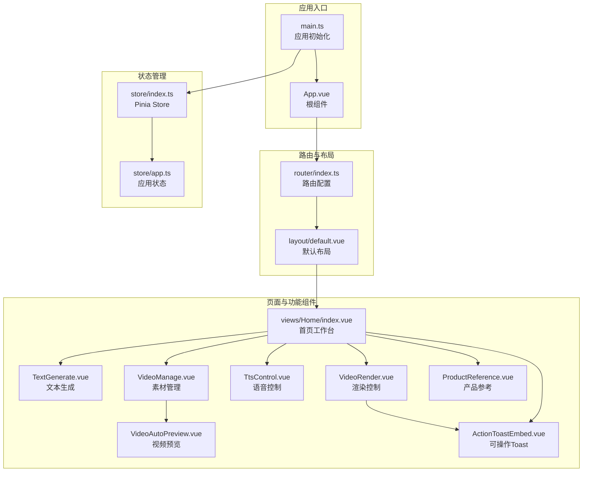

图表来源
- [main.ts:1-62](file://src/main.ts#L1-L62)
- [App.vue:1-12](file://src/App.vue#L1-L12)
- [index.ts:1-22](file://src/router/index.ts#L1-L22)
- [default.vue:1-148](file://src/layout/default.vue#L1-L148)
- [index.vue:1-309](file://src/views/Home/index.vue#L1-L309)
- [TextGenerate.vue:1-272](file://src/views/Home/components/TextGenerate.vue#L1-L272)
- [VideoManage.vue:1-394](file://src/views/Home/components/VideoManage.vue#L1-L394)
- [TtsControl.vue:1-234](file://src/views/Home/components/TtsControl.vue#L1-L234)
- [VideoRender.vue:1-276](file://src/views/Home/components/VideoRender.vue#L1-L276)
- [ProductReference.vue:1-357](file://src/views/Home/components/ProductReference.vue#L1-L357)
- [VideoAutoPreview.vue:1-42](file://src/components/VideoAutoPreview.vue#L1-L42)
- [ActionToastEmbed.vue:1-36](file://src/components/ActionToastEmbed.vue#L1-L36)
- [index.ts:1-9](file://src/store/index.ts#L1-L9)
- [app.ts:1-147](file://src/store/app.ts#L1-L147)

章节来源
- [main.ts:1-62](file://src/main.ts#L1-L62)
- [index.ts:1-22](file://src/router/index.ts#L1-L22)
- [default.vue:1-148](file://src/layout/default.vue#L1-L148)
- [index.vue:1-309](file://src/views/Home/index.vue#L1-L309)
- [index.ts:1-9](file://src/store/index.ts#L1-L9)
- [app.ts:1-147](file://src/store/app.ts#L1-L147)

## 核心组件
- 应用入口与框架装配：在入口文件中完成 UI 框架、路由、状态、国际化与 IPC 的初始化与挂载。
- 默认布局：提供窗口标题栏、语言菜单、窗口控制按钮与 RouterView 占位，承载全局交互。
- 首页工作台：作为业务编排中心，协调文本生成、语音合成、素材管理与渲染控制四大子流程。
- 功能组件：每个功能组件聚焦单一职责，通过 props 接收输入、通过事件向外广播状态变化、通过暴露方法供父组件调用。
- 公共组件：封装通用 UI 行为，如视频自动播放预览、可复制错误详情的 Toast 嵌入。
- 状态管理：集中存储渲染状态、配置参数、产品信息与分析进度等，支持持久化与响应式更新。

章节来源
- [main.ts:1-62](file://src/main.ts#L1-L62)
- [default.vue:1-148](file://src/layout/default.vue#L1-L148)
- [index.vue:1-309](file://src/views/Home/index.vue#L1-L309)
- [TextGenerate.vue:1-272](file://src/views/Home/components/TextGenerate.vue#L1-L272)
- [VideoManage.vue:1-394](file://src/views/Home/components/VideoManage.vue#L1-L394)
- [TtsControl.vue:1-234](file://src/views/Home/components/TtsControl.vue#L1-L234)
- [VideoRender.vue:1-276](file://src/views/Home/components/VideoRender.vue#L1-L276)
- [ProductReference.vue:1-357](file://src/views/Home/components/ProductReference.vue#L1-L357)
- [VideoAutoPreview.vue:1-42](file://src/components/VideoAutoPreview.vue#L1-L42)
- [ActionToastEmbed.vue:1-36](file://src/components/ActionToastEmbed.vue#L1-L36)
- [index.ts:1-9](file://src/store/index.ts#L1-L9)
- [app.ts:1-147](file://src/store/app.ts#L1-L147)

## 架构总览
应用采用“布局-页面-功能组件”三层结构，配合 Pinia 管理全局状态，路由驱动页面切换。组件间通过 props、事件与暴露方法进行协作，公共组件提升复用性与一致性。

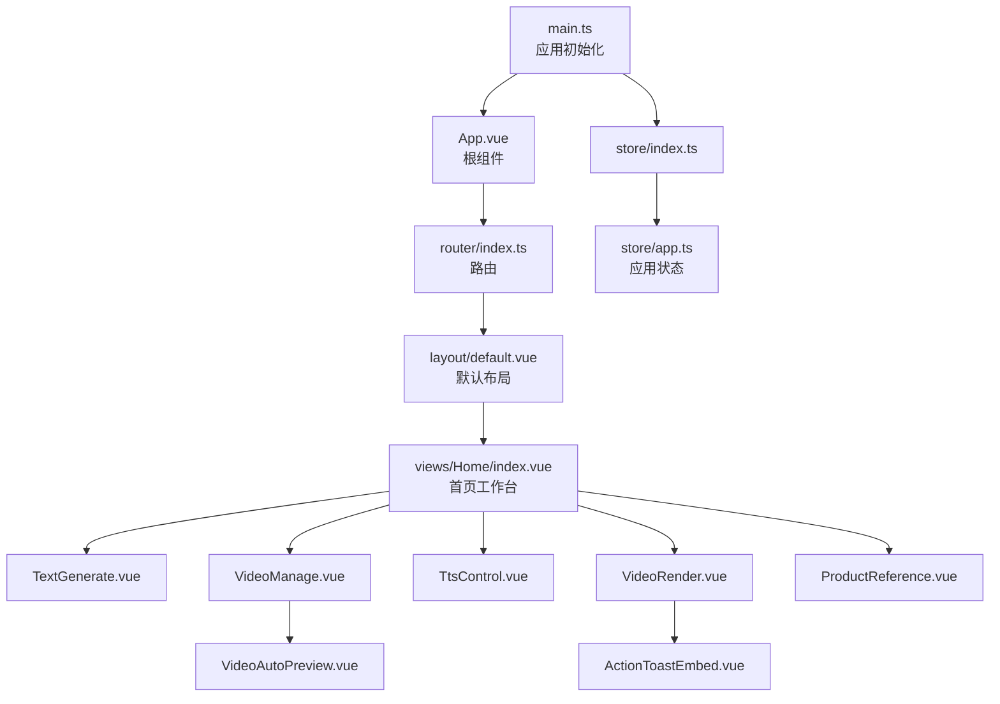

图表来源
- [main.ts:1-62](file://src/main.ts#L1-L62)
- [App.vue:1-12](file://src/App.vue#L1-L12)
- [index.ts:1-22](file://src/router/index.ts#L1-L22)
- [default.vue:1-148](file://src/layout/default.vue#L1-L148)
- [index.vue:1-309](file://src/views/Home/index.vue#L1-L309)
- [TextGenerate.vue:1-272](file://src/views/Home/components/TextGenerate.vue#L1-L272)
- [VideoManage.vue:1-394](file://src/views/Home/components/VideoManage.vue#L1-L394)
- [TtsControl.vue:1-234](file://src/views/Home/components/TtsControl.vue#L1-L234)
- [VideoRender.vue:1-276](file://src/views/Home/components/VideoRender.vue#L1-L276)
- [ProductReference.vue:1-357](file://src/views/Home/components/ProductReference.vue#L1-L357)
- [VideoAutoPreview.vue:1-42](file://src/components/VideoAutoPreview.vue#L1-L42)
- [ActionToastEmbed.vue:1-36](file://src/components/ActionToastEmbed.vue#L1-L36)
- [index.ts:1-9](file://src/store/index.ts#L1-L9)
- [app.ts:1-147](file://src/store/app.ts#L1-L147)

## 组件详解

### 布局组件：默认布局 default.vue
- 职责：提供窗口标题栏、语言切换菜单、窗口控制按钮与 RouterView 占位；监听窗口尺寸变化与语言切换事件。
- 通信机制：
  - 插槽：通过 RouterView 在布局内占位，承载子页面。
  - 事件：处理最小化、最大化/还原、关闭窗口等用户交互。
  - 国际化：从 i18next-vue 注入 t 与 i18next，动态更新语言并同步至应用状态。
- 生命周期：在 mounted 阶段初始化标题与监听器，保持与 Electron 环境的交互。

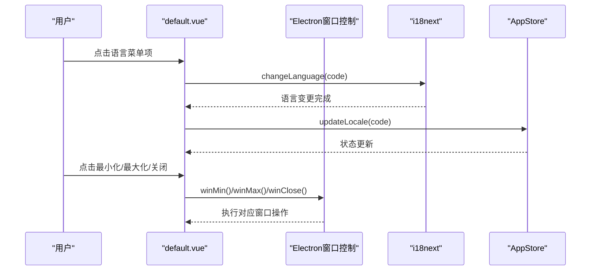

图表来源
- [default.vue:49-84](file://src/layout/default.vue#L49-L84)
- [default.vue:55-69](file://src/layout/default.vue#L55-L69)
- [main.ts:46-61](file://src/main.ts#L46-L61)

章节来源
- [default.vue:1-148](file://src/layout/default.vue#L1-L148)
- [main.ts:46-61](file://src/main.ts#L46-L61)

### 页面组件：首页工作台 index.vue
- 职责：作为工作流编排中心，协调文本生成、语音合成、素材管理与渲染控制，负责错误处理与统计上报。
- 通信机制：
  - 父子通信：通过 props 控制子组件禁用态；通过模板引用调用子组件暴露的方法。
  - 事件通信：接收 VideoRender 子组件的渲染与取消事件，驱动整体流程。
  - 状态共享：使用 Pinia 状态驱动各阶段渲染状态与配置。
- 生命周期：在渲染过程中根据状态更新 UI 与行为，确保流程可控与可观测。

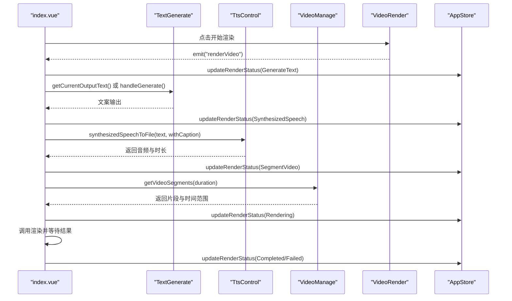

图表来源
- [index.vue:36-303](file://src/views/Home/index.vue#L36-L303)
- [TextGenerate.vue:132-198](file://src/views/Home/components/TextGenerate.vue#L132-L198)
- [TtsControl.vue:209-228](file://src/views/Home/components/TtsControl.vue#L209-L228)
- [VideoManage.vue:282-388](file://src/views/Home/components/VideoManage.vue#L282-L388)
- [VideoRender.vue:210-213](file://src/views/Home/components/VideoRender.vue#L210-L213)
- [app.ts:6-14](file://src/store/app.ts#L6-L14)

章节来源
- [index.vue:1-309](file://src/views/Home/index.vue#L1-L309)

### 功能组件：文本生成 TextGenerate.vue
- 职责：基于 LLM 生成短视频口播文案，支持配置测试、流式输出与中断。
- 通信机制：
  - 输入：通过 props 接收禁用态；从 Pinia 读取 LLM 配置与提示词。
  - 输出：通过 expose 暴漏方法供父组件调用；内部通过状态与事件反馈进度。
  - 错误处理：使用 ActionToastEmbed 嵌入可复制的错误详情。
- 性能与可用性：支持流式输出与中断；对异常进行分类处理并提示。

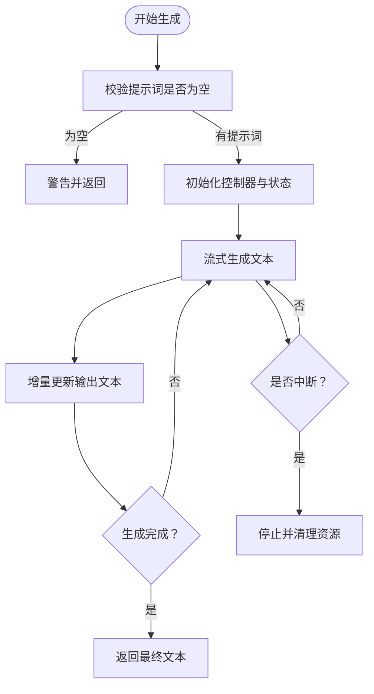

图表来源
- [TextGenerate.vue:124-198](file://src/views/Home/components/TextGenerate.vue#L124-L198)
- [TextGenerate.vue:257-266](file://src/views/Home/components/TextGenerate.vue#L257-L266)

章节来源
- [TextGenerate.vue:1-272](file://src/views/Home/components/TextGenerate.vue#L1-L272)

### 功能组件：素材管理 VideoManage.vue
- 职责：扫描并管理视频素材库，支持智能匹配与随机选片；提供元数据缓存与进度反馈。
- 通信机制：
  - 文件夹选择与刷新：通过 Electron API 获取素材列表并过滤 MP4。
  - 智能匹配：在启用时计算分析统计，监听进度事件并更新状态。
  - 选片算法：按目标时长收集片段，支持最小/最大片段约束与尾部修正。
- 性能与可用性：使用缓存避免重复读取元数据；对异常进行统一错误提示。

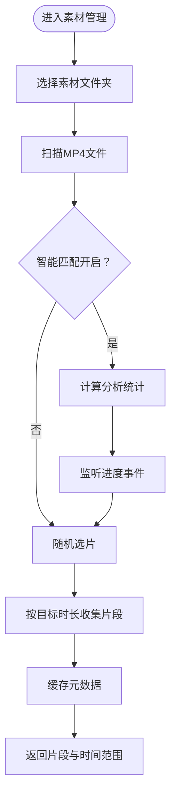

图表来源
- [VideoManage.vue:118-179](file://src/views/Home/components/VideoManage.vue#L118-L179)
- [VideoManage.vue:189-230](file://src/views/Home/components/VideoManage.vue#L189-L230)
- [VideoManage.vue:282-388](file://src/views/Home/components/VideoManage.vue#L282-L388)

章节来源
- [VideoManage.vue:1-394](file://src/views/Home/components/VideoManage.vue#L1-L394)

### 功能组件：语音控制 TtsControl.vue
- 职责：选择语言/性别/声音与语速，试听与合成到文件；提供语音列表拉取与清理。
- 通信机制：
  - 选择联动：语言/性别变化后清空声音选择；根据筛选条件动态生成可选项。
  - 试听与合成：调用 Electron API 进行语音合成，支持带字幕与无字幕两种模式。
- 生命周期：组件挂载时拉取语音列表；卸载时释放音频资源。

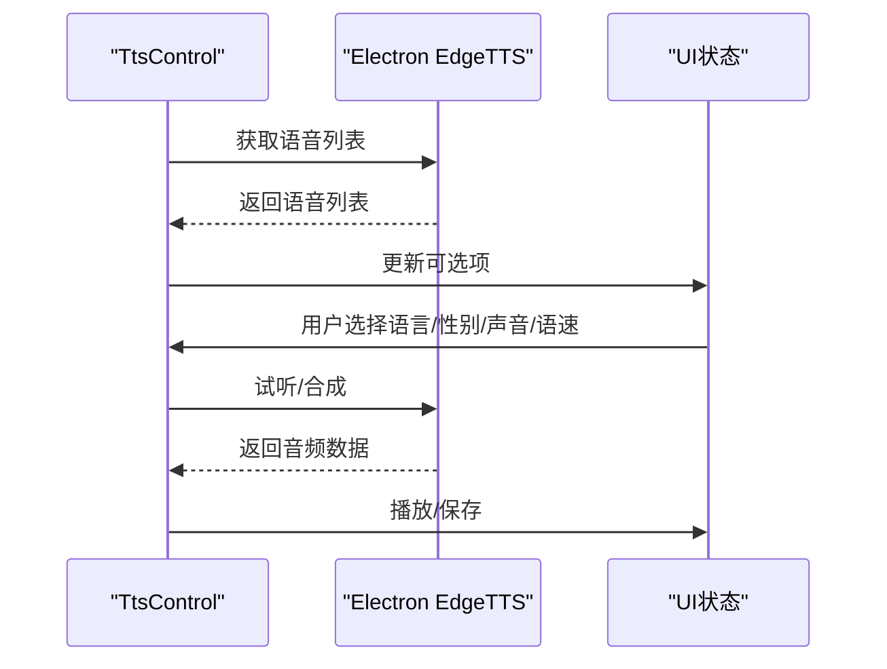

图表来源
- [TtsControl.vue:59-207](file://src/views/Home/components/TtsControl.vue#L59-L207)
- [TtsControl.vue:209-228](file://src/views/Home/components/TtsControl.vue#L209-L228)

章节来源
- [TtsControl.vue:1-234](file://src/views/Home/components/TtsControl.vue#L1-L234)

### 功能组件：渲染控制 VideoRender.vue
- 职责：配置输出分辨率、文件名、导出目录与背景音乐目录；启动/取消渲染；显示进度与状态。
- 通信机制：
  - 事件：向上游发出渲染与取消事件，由父组件承接并执行具体流程。
  - 状态：订阅 IPC 进度事件，实时更新 UI。
  - 配置：提供渲染与 VL 配置对话框，保存至 Pinia。
- 生命周期：监听进度事件并在组件销毁时清理。

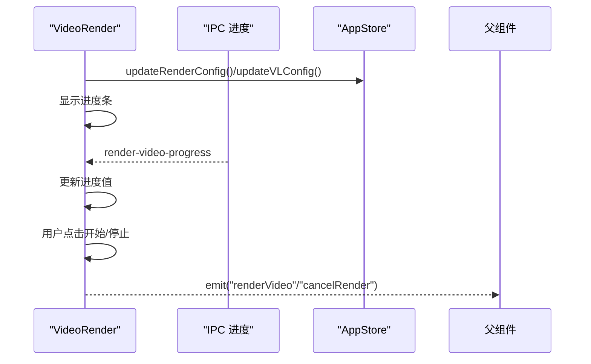

图表来源
- [VideoRender.vue:202-271](file://src/views/Home/components/VideoRender.vue#L202-L271)
- [VideoRender.vue:210-213](file://src/views/Home/components/VideoRender.vue#L210-L213)

章节来源
- [VideoRender.vue:1-276](file://src/views/Home/components/VideoRender.vue#L1-L276)

### 功能组件：产品参考 ProductReference.vue
- 职责：管理产品参考信息，支持新增、删除、分析外观（颜色与标签）并持久化。
- 通信机制：
  - 选择与新增：通过下拉选择与对话框管理产品集合。
  - 分析：调用 Electron API 对产品图片进行视觉分析并更新本地记录。
- 生命周期：组件挂载时加载产品列表并恢复当前选择。

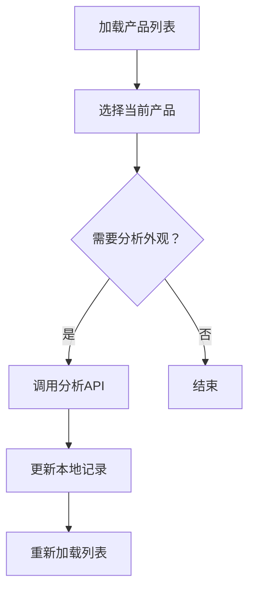

图表来源
- [ProductReference.vue:173-351](file://src/views/Home/components/ProductReference.vue#L173-L351)

章节来源
- [ProductReference.vue:1-357](file://src/views/Home/components/ProductReference.vue#L1-L357)

### 公共组件：视频自动预览 VideoAutoPreview.vue
- 职责：将本地视频文件以 file:// 协议自动播放与循环，鼠标悬停播放、离开暂停并回到开头。
- 通信机制：通过 props 接收文件对象，内部计算 file:// 源地址并绑定事件。

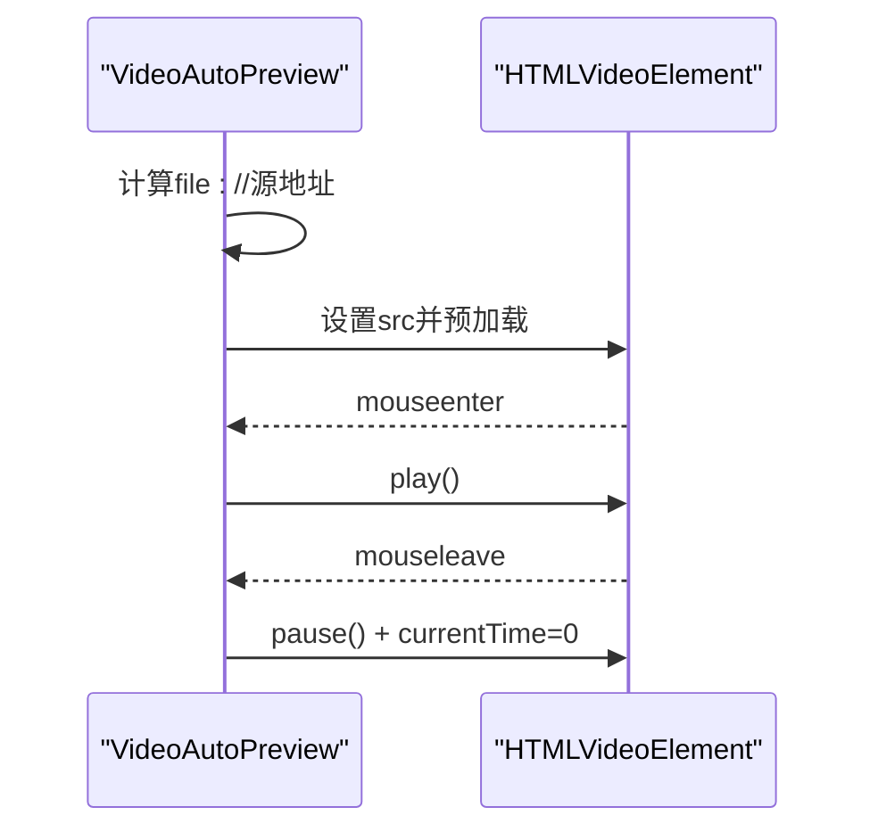

图表来源
- [VideoAutoPreview.vue:16-36](file://src/components/VideoAutoPreview.vue#L16-L36)

章节来源
- [VideoAutoPreview.vue:1-42](file://src/components/VideoAutoPreview.vue#L1-L42)

### 公共组件：可操作的 Toast 嵌入 ActionToastEmbed.vue
- 职责：在 Toast 中嵌入可点击的操作按钮，用于复制错误详情等场景。
- 通信机制：通过事件向父组件回调触发动作。

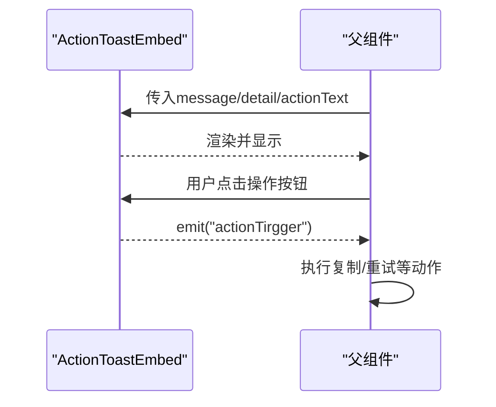

图表来源
- [ActionToastEmbed.vue:16-31](file://src/components/ActionToastEmbed.vue#L16-L31)

章节来源
- [ActionToastEmbed.vue:1-36](file://src/components/ActionToastEmbed.vue#L1-L36)

## 依赖关系分析
- 框架与工具链：Vue 3、Vite、Vuetify、Vue Router、Pinia、i18next-vue、vue-toastification。
- 状态与持久化：Pinia + pinia-plugin-persistedstate，部分状态持久化，部分状态仅内存。
- 路由与布局：单布局多页面，路由配置简洁清晰。
- 组件复用：公共组件与功能组件职责单一，便于复用与替换。

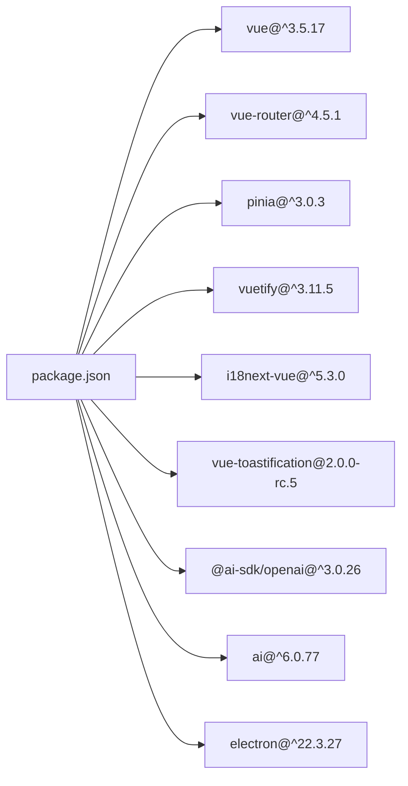

图表来源
- [package.json:22-64](file://package.json#L22-L64)

章节来源
- [package.json:1-85](file://package.json#L1-L85)

## 性能考量
- 组件粒度与职责分离：功能组件单一职责，减少不必要的重渲染。
- 状态集中与局部更新：Pinia 精准更新渲染状态，避免全量刷新。
- 缓存与节流：素材管理中的元数据缓存与随机选片算法的尝试次数限制，降低 IO 与 CPU 开销。
- 流式处理：文本生成采用流式输出，提升交互体验与首帧速度。
- IPC 事件监听：渲染进度与分析进度通过事件驱动，避免轮询。
- 资源释放：语音试听音频在组件卸载时释放，避免内存泄漏。

## 故障排查指南
- 文本生成失败：检查 LLM 配置与网络连通性；查看 ActionToastEmbed 嵌入的错误详情并复制到剪贴板辅助定位。
- 素材加载失败：确认素材文件夹路径与权限；检查是否有 MP4 文件；查看 Toast 提示。
- 语音合成失败：确认语音列表拉取成功与声音选择有效；检查网络与 API 配置。
- 渲染失败：检查输出路径、分辨率与文件名配置；查看渲染进度与失败原因。
- 语言切换无效：确认 IPC 监听与 i18next.changeLanguage 调用是否生效。

章节来源
- [TextGenerate.vue:160-192](file://src/views/Home/components/TextGenerate.vue#L160-L192)
- [VideoManage.vue:156-178](file://src/views/Home/components/VideoManage.vue#L156-L178)
- [TtsControl.vue:112-137](file://src/views/Home/components/TtsControl.vue#L112-L137)
- [VideoRender.vue:224-226](file://src/views/Home/components/VideoRender.vue#L224-L226)
- [default.vue:64-69](file://src/layout/default.vue#L64-L69)

## 结论
本项目通过清晰的分层架构与单一职责的功能组件，实现了短视频生成工作流的模块化与可维护性。借助 Pinia 的状态管理与 Vuetify 的 UI 能力，结合 Electron 的系统集成，形成了稳定高效的前端组件体系。建议持续完善错误日志与埋点统计，进一步增强可观测性与用户体验。

## 附录
- 最佳实践清单
  - 组件职责单一，避免过度耦合
  - 通过 props 与事件进行松耦合通信
  - 使用 expose 暴露必要方法，隐藏内部实现
  - 对外部依赖（IPC、Electron API）进行统一封装
  - 对耗时操作采用流式/异步处理并提供进度反馈
  - 对异常进行统一提示并通过嵌入组件提供可操作入口
  - 对关键状态进行持久化，兼顾性能与一致性