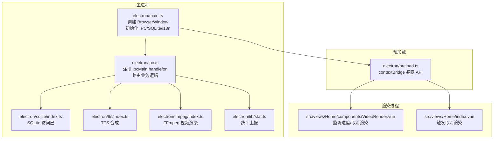
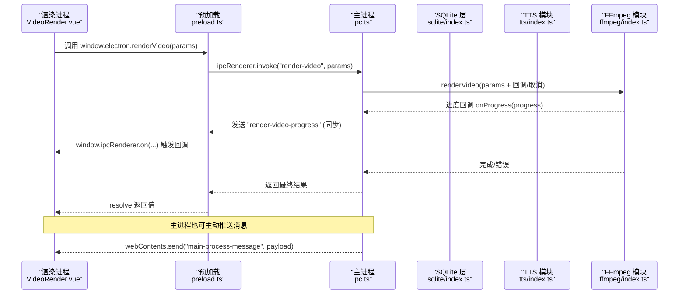
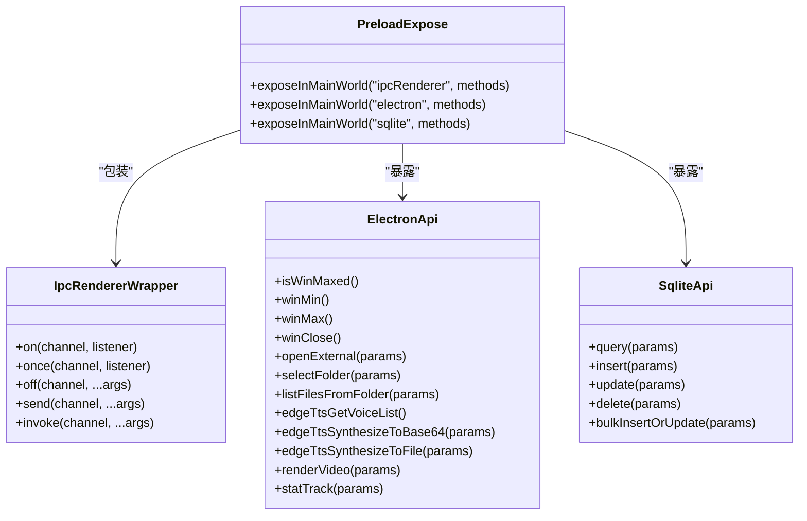
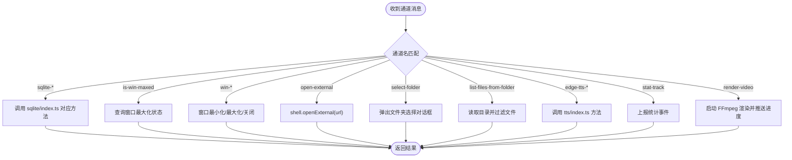
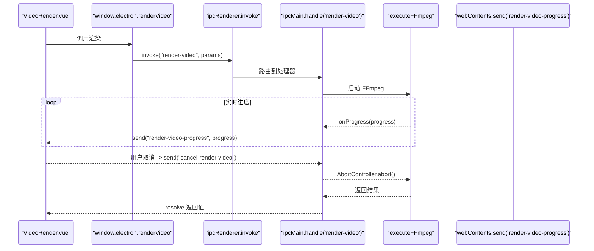
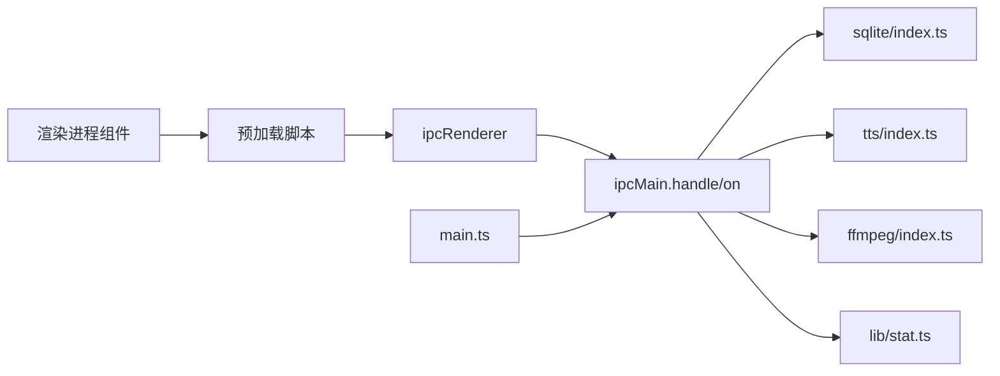

# 进程通信机制

<cite>
**本文引用的文件**
- [electron/main.ts](file://electron/main.ts)
- [electron/preload.ts](file://electron/preload.ts)
- [electron/ipc.ts](file://electron/ipc.ts)
- [electron/types.ts](file://electron/types.ts)
- [electron/sqlite/index.ts](file://electron/sqlite/index.ts)
- [electron/sqlite/types.ts](file://electron/sqlite/types.ts)
- [electron/tts/index.ts](file://electron/tts/index.ts)
- [electron/tts/types.ts](file://electron/tts/types.ts)
- [electron/ffmpeg/index.ts](file://electron/ffmpeg/index.ts)
- [electron/ffmpeg/types.ts](file://electron/ffmpeg/types.ts)
- [electron/lib/stat.ts](file://electron/lib/stat.ts)
- [src/views/Home/components/VideoRender.vue](file://src/views/Home/components/VideoRender.vue)
- [src/views/Home/index.vue](file://src/views/Home/index.vue)
</cite>

## 目录
1. [简介](#简介)
2. [项目结构](#项目结构)
3. [核心组件](#核心组件)
4. [架构总览](#架构总览)
5. [详细组件分析](#详细组件分析)
6. [依赖关系分析](#依赖关系分析)
7. [性能考量](#性能考量)
8. [故障排查指南](#故障排查指南)
9. [结论](#结论)
10. [附录](#附录)

## 简介
本文件系统性阐述短视频工厂项目的进程通信机制，聚焦 Electron 主进程与渲染进程之间的 IPC 通信原理与实现细节。内容涵盖：
- IPC 处理器注册机制与消息路由规则
- 数据序列化方式与类型约束
- 预加载脚本如何安全地向渲染进程暴露受限 API
- 同步与异步通信模式、错误处理与超时策略
- 常见通信场景示例：文件操作、数据库查询、外部工具调用（FFmpeg/TTS）
- 通信协议设计原则与性能优化技巧

## 项目结构
项目采用“主进程 + 预加载桥接 + 渲染进程”的三层架构：
- 主进程负责窗口生命周期、对话框、系统级能力与 IPC 注册
- 预加载脚本通过 contextBridge 将受控 API 暴露给渲染进程
- 渲染进程通过 window.electron/window.sqlite 等 API 与主进程交互

图表来源
- [electron/main.ts:187-204](file://electron/main.ts#L187-L204)
- [electron/ipc.ts:77-187](file://electron/ipc.ts#L77-L187)
- [electron/preload.ts:20-75](file://electron/preload.ts#L20-L75)
- [electron/sqlite/index.ts:140-154](file://electron/sqlite/index.ts#L140-L154)
- [electron/tts/index.ts:35-85](file://electron/tts/index.ts#L35-L85)
- [electron/ffmpeg/index.ts:26-186](file://electron/ffmpeg/index.ts#L26-L186)
- [electron/lib/stat.ts:39-80](file://electron/lib/stat.ts#L39-L80)
- [src/views/Home/components/VideoRender.vue:196-199](file://src/views/Home/components/VideoRender.vue#L196-L199)
- [src/views/Home/index.vue:229-231](file://src/views/Home/index.vue#L229-L231)

章节来源
- [electron/main.ts:40-76](file://electron/main.ts#L40-L76)
- [electron/preload.ts:20-75](file://electron/preload.ts#L20-L75)
- [electron/ipc.ts:77-187](file://electron/ipc.ts#L77-L187)

## 核心组件
- 主进程入口与窗口创建：负责初始化 IPC、SQLite、国际化等，并在窗口加载完成后主动向渲染进程发送消息。
- 预加载脚本：通过 contextBridge.exposeInMainWorld 安全暴露有限 API，统一包装 ipcRenderer 的 on/once/off/send/invoke。
- IPC 注册中心：集中注册 handle/on，按通道名路由到具体业务模块（SQLite、TTS、FFmpeg、系统能力等）。
- SQLite 访问层：封装 better-sqlite3，提供查询、插入、更新、删除、批量插入或更新。
- TTS 模块：提供语音列表、合成到 Base64、合成到文件。
- FFmpeg 模块：封装视频渲染流程，支持进度回调、取消信号、输出校验与临时文件清理。
- 统计模块：封装统计事件上报，带超时控制。

章节来源
- [electron/main.ts:187-204](file://electron/main.ts#L187-L204)
- [electron/preload.ts:20-75](file://electron/preload.ts#L20-L75)
- [electron/ipc.ts:77-187](file://electron/ipc.ts#L77-L187)
- [electron/sqlite/index.ts:38-136](file://electron/sqlite/index.ts#L38-L136)
- [electron/tts/index.ts:35-85](file://electron/tts/index.ts#L35-L85)
- [electron/ffmpeg/index.ts:26-186](file://electron/ffmpeg/index.ts#L26-L186)
- [electron/lib/stat.ts:39-80](file://electron/lib/stat.ts#L39-L80)

## 架构总览
下图展示了从渲染进程发起请求到主进程处理并返回结果的完整链路，以及主进程主动向渲染进程推送消息的机制。

图表来源
- [electron/preload.ts:63-65](file://electron/preload.ts#L63-L65)
- [electron/ipc.ts:171-186](file://electron/ipc.ts#L171-L186)
- [electron/ffmpeg/index.ts:170-186](file://electron/ffmpeg/index.ts#L170-L186)
- [electron/main.ts:63-69](file://electron/main.ts#L63-L69)

## 详细组件分析

### 预加载脚本与安全桥接
预加载脚本通过 contextBridge 将有限的 API 暴露到渲染进程全局命名空间，仅暴露必要的方法，避免直接访问 Node/Electron API。例如：
- 暴露 window.ipcRenderer 并包装 on/once/off/send/invoke
- 暴露 window.electron：窗口控制、外部链接、文件夹选择、文件列举、TTS、渲染、统计等
- 暴露 window.sqlite：数据库 CRUD 与批量写入

图表来源
- [electron/preload.ts:20-75](file://electron/preload.ts#L20-L75)

章节来源
- [electron/preload.ts:20-75](file://electron/preload.ts#L20-L75)

### IPC 处理器注册与消息路由
主进程集中注册所有通道：
- SQLite：sqlite-query、sqlite-insert、sqlite-update、sqlite-delete、sqlite-bulk-insert-or-update
- 窗口控制：is-win-maxed（handle）、win-min/win-max/win-close（on）
- 文件系统：open-external、select-folder、list-files-from-folder
- TTS：edge-tts-get-voice-list、edge-tts-synthesize-to-base64、edge-tts-synthesize-to-file
- 统计：stat-track
- 视频渲染：render-video（含进度推送与取消）

图表来源
- [electron/ipc.ts:77-187](file://electron/ipc.ts#L77-L187)

章节来源
- [electron/ipc.ts:77-187](file://electron/ipc.ts#L77-L187)

### 数据序列化与类型约束
- 预加载脚本与主进程之间传递的参数与返回值均为可序列化对象，遵循 JSON 可序列化规则。
- 类型定义文件确保通道参数与返回值的强类型约束：
  - 通用参数：OpenExternalParams、SelectFolderParams、ListFilesFromFolderParams、StatEventParams
  - SQLite 参数：QueryParams、InsertParams、UpdateParams、DeleteParams、BulkInsertOrUpdateParams
  - TTS 参数：EdgeTtsSynthesizeCommonParams、EdgeTtsSynthesizeToFileParams
  - FFmpeg 参数：RenderVideoParams、ExecuteFFmpegResult

章节来源
- [electron/types.ts:1-26](file://electron/types.ts#L1-L26)
- [electron/sqlite/types.ts:1-26](file://electron/sqlite/types.ts#L1-L26)
- [electron/tts/types.ts:1-20](file://electron/tts/types.ts#L1-L20)
- [electron/ffmpeg/types.ts:1-23](file://electron/ffmpeg/types.ts#L1-L23)

### 同步与异步通信模式
- 异步 invoke：渲染进程调用 window.electron.* 或 window.sqlite.*，主进程通过 ipcMain.handle 注册处理器，返回 Promise 结果。适用于需要等待结果的场景（如数据库查询、文件夹选择、TTS 合成、视频渲染）。
- 同步 send/on：主进程主动向渲染进程推送消息（如渲染进度、主进程消息），渲染进程通过 window.ipcRenderer.on 监听。

章节来源
- [electron/preload.ts:37-41](file://electron/preload.ts#L37-L41)
- [electron/ipc.ts:174-176](file://electron/ipc.ts#L174-L176)
- [electron/main.ts:63-69](file://electron/main.ts#L63-L69)

### 错误处理与超时管理
- FFmpeg 执行：子进程退出码非 0 时抛出错误；支持 AbortSignal 取消；stdout/stderr 流中解析进度，异常时进行错误聚合。
- 统计上报：HTTP 请求设置超时时间；开发模式下记录警告日志。
- 文件夹选择：窗口不可用时抛出错误；回退路径策略保障可用性。
- SQLite：构造函数阶段捕获异常并记录错误日志。

章节来源
- [electron/ffmpeg/index.ts:224-243](file://electron/ffmpeg/index.ts#L224-L243)
- [electron/lib/stat.ts:72-80](file://electron/lib/stat.ts#L72-L80)
- [electron/ipc.ts:120-124](file://electron/ipc.ts#L120-L124)
- [electron/sqlite/index.ts:140-147](file://electron/sqlite/index.ts#L140-L147)

### 常见通信场景示例

#### 场景一：视频渲染与进度推送
- 渲染进程调用 window.electron.renderVideo(params)
- 主进程启动 FFmpeg，实时推送 "render-video-progress" 到渲染进程
- 渲染进程监听进度并更新 UI
- 用户取消时，渲染进程发送 "cancel-render-video"，主进程通过 AbortController 中止

图表来源
- [electron/preload.ts:63-65](file://electron/preload.ts#L63-L65)
- [electron/ipc.ts:171-186](file://electron/ipc.ts#L171-L186)
- [electron/ffmpeg/index.ts:188-244](file://electron/ffmpeg/index.ts#L188-L244)
- [src/views/Home/components/VideoRender.vue:196-199](file://src/views/Home/components/VideoRender.vue#L196-L199)
- [src/views/Home/index.vue:229-231](file://src/views/Home/index.vue#L229-L231)

章节来源
- [src/views/Home/components/VideoRender.vue:196-199](file://src/views/Home/components/VideoRender.vue#L196-L199)
- [src/views/Home/index.vue:229-231](file://src/views/Home/index.vue#L229-L231)
- [electron/ipc.ts:171-186](file://electron/ipc.ts#L171-L186)
- [electron/ffmpeg/index.ts:188-244](file://electron/ffmpeg/index.ts#L188-L244)

#### 场景二：数据库查询与批量写入
- 渲染进程调用 window.sqlite.query/insert/update/delete/bulkInsertOrUpdate
- 预加载脚本通过 ipcRenderer.invoke 转发至主进程
- 主进程路由到 sqlite/index.ts 的对应方法，执行 SQL 并返回结果

章节来源
- [electron/preload.ts:67-74](file://electron/preload.ts#L67-L74)
- [electron/ipc.ts:78-87](file://electron/ipc.ts#L78-L87)
- [electron/sqlite/index.ts:63-135](file://electron/sqlite/index.ts#L63-L135)

#### 场景三：外部工具调用（TTS 合成）
- 渲染进程调用 window.electron.edgeTtsSynthesizeToBase64 或 edgeTtsSynthesizeToFile
- 主进程路由到 tts/index.ts 的对应方法，生成音频并返回时长或文件路径

章节来源
- [electron/preload.ts:58-65](file://electron/preload.ts#L58-L65)
- [electron/ipc.ts:157-169](file://electron/ipc.ts#L157-L169)
- [electron/tts/index.ts:39-85](file://electron/tts/index.ts#L39-L85)

#### 场景四：文件操作（选择文件夹、列举文件）
- 渲染进程调用 window.electron.selectFolder/listFilesFromFolder
- 主进程通过对话框与文件系统 API 返回结果

章节来源
- [electron/preload.ts:54-57](file://electron/preload.ts#L54-L57)
- [electron/ipc.ts:119-155](file://electron/ipc.ts#L119-L155)

### 通信协议设计原则
- 单一职责：每个通道只做一件事（如只负责渲染、只负责查询）
- 明确的错误语义：失败时抛出可识别的错误，便于前端统一处理
- 可取消性：对耗时任务提供取消信号，避免资源泄露
- 进度可见：对长时间任务提供进度回调，提升用户体验
- 类型安全：通过 TypeScript 接口约束参数与返回值，减少运行时错误

## 依赖关系分析
- 主进程依赖：Electron BrowserWindow、dialog、shell、ipcMain；第三方库 better-sqlite3、axios、music-metadata、ffmpeg-static
- 预加载依赖：Electron ipcRenderer、contextBridge
- 渲染进程依赖：Vue 组件与 window.electron/window.sqlite API

图表来源
- [electron/main.ts:187-204](file://electron/main.ts#L187-L204)
- [electron/preload.ts:20-75](file://electron/preload.ts#L20-L75)
- [electron/ipc.ts:77-187](file://electron/ipc.ts#L77-L187)
- [electron/sqlite/index.ts:38-136](file://electron/sqlite/index.ts#L38-L136)
- [electron/tts/index.ts:35-85](file://electron/tts/index.ts#L35-L85)
- [electron/ffmpeg/index.ts:26-186](file://electron/ffmpeg/index.ts#L26-L186)
- [electron/lib/stat.ts:39-80](file://electron/lib/stat.ts#L39-L80)

章节来源
- [electron/main.ts:187-204](file://electron/main.ts#L187-L204)
- [electron/preload.ts:20-75](file://electron/preload.ts#L20-L75)
- [electron/ipc.ts:77-187](file://electron/ipc.ts#L77-L187)

## 性能考量
- 事件驱动与流式处理：FFmpeg 使用 stdout/stderr 流解析进度，避免轮询带来的额外开销
- 取消即中断：通过 AbortController 与 SIGTERM 快速终止子进程，降低资源占用
- 本地化与缓存：预加载脚本仅暴露必要 API，减少不必要的上下文暴露
- 批量写入：SQLite 提供批量插入或更新接口，减少多次往返
- 超时控制：统计上报设置超时，避免阻塞渲染线程

## 故障排查指南
- 渲染取消未生效
  - 确认渲染进程是否正确发送 "cancel-render-video"
  - 确认主进程是否注册了对应的取消监听并传递了 AbortController
  - 参考：[src/views/Home/index.vue:229-231](file://src/views/Home/index.vue#L229-L231)、[electron/ipc.ts:181-183](file://electron/ipc.ts#L181-L183)、[electron/ffmpeg/index.ts:238-242](file://electron/ffmpeg/index.ts#L238-L242)
- 进度不更新
  - 检查主进程是否正确推送 "render-video-progress"
  - 检查渲染进程是否正确监听该通道
  - 参考：[electron/ipc.ts:174-176](file://electron/ipc.ts#L174-L176)、[src/views/Home/components/VideoRender.vue:196-199](file://src/views/Home/components/VideoRender.vue#L196-L199)
- FFmpeg 执行失败
  - 查看错误信息中的退出码与 stderr
  - 确认可执行文件存在且具备执行权限（Windows 特殊处理）
  - 参考：[electron/ffmpeg/index.ts:224-235](file://electron/ffmpeg/index.ts#L224-L235)、[electron/ffmpeg/index.ts:246-259](file://electron/ffmpeg/index.ts#L246-L259)
- 统计上报失败
  - 检查网络与超时设置
  - 开发模式下查看控制台警告
  - 参考：[electron/lib/stat.ts:72-80](file://electron/lib/stat.ts#L72-L80)
- 文件夹选择无响应
  - 确认窗口句柄有效
  - 检查回退路径策略
  - 参考：[electron/ipc.ts:120-144](file://electron/ipc.ts#L120-L144)

章节来源
- [src/views/Home/index.vue:229-231](file://src/views/Home/index.vue#L229-L231)
- [electron/ipc.ts:174-183](file://electron/ipc.ts#L174-L183)
- [electron/ffmpeg/index.ts:224-259](file://electron/ffmpeg/index.ts#L224-L259)
- [electron/lib/stat.ts:72-80](file://electron/lib/stat.ts#L72-L80)
- [electron/ipc.ts:120-144](file://electron/ipc.ts#L120-L144)

## 结论
本项目通过预加载脚本的安全桥接与主进程的集中路由，实现了清晰、可控、高性能的进程间通信。同步/异步混合模式满足不同场景需求，错误处理与超时策略保证了稳定性，进度推送与取消机制提升了用户体验。建议在扩展新功能时遵循现有协议与类型约束，确保一致性与可维护性。

## 附录
- 关键通道一览
  - 数据库：sqlite-query、sqlite-insert、sqlite-update、sqlite-delete、sqlite-bulk-insert-or-update
  - 窗口控制：is-win-maxed、win-min、win-max、win-close
  - 文件系统：open-external、select-folder、list-files-from-folder
  - TTS：edge-tts-get-voice-list、edge-tts-synthesize-to-base64、edge-tts-synthesize-to-file
  - 统计：stat-track
  - 视频渲染：render-video、render-video-progress、cancel-render-video
- 相关文件路径
  - [electron/main.ts](file://electron/main.ts)
  - [electron/preload.ts](file://electron/preload.ts)
  - [electron/ipc.ts](file://electron/ipc.ts)
  - [electron/types.ts](file://electron/types.ts)
  - [electron/sqlite/index.ts](file://electron/sqlite/index.ts)
  - [electron/sqlite/types.ts](file://electron/sqlite/types.ts)
  - [electron/tts/index.ts](file://electron/tts/index.ts)
  - [electron/tts/types.ts](file://electron/tts/types.ts)
  - [electron/ffmpeg/index.ts](file://electron/ffmpeg/index.ts)
  - [electron/ffmpeg/types.ts](file://electron/ffmpeg/types.ts)
  - [electron/lib/stat.ts](file://electron/lib/stat.ts)
  - [src/views/Home/components/VideoRender.vue](file://src/views/Home/components/VideoRender.vue)
  - [src/views/Home/index.vue](file://src/views/Home/index.vue)