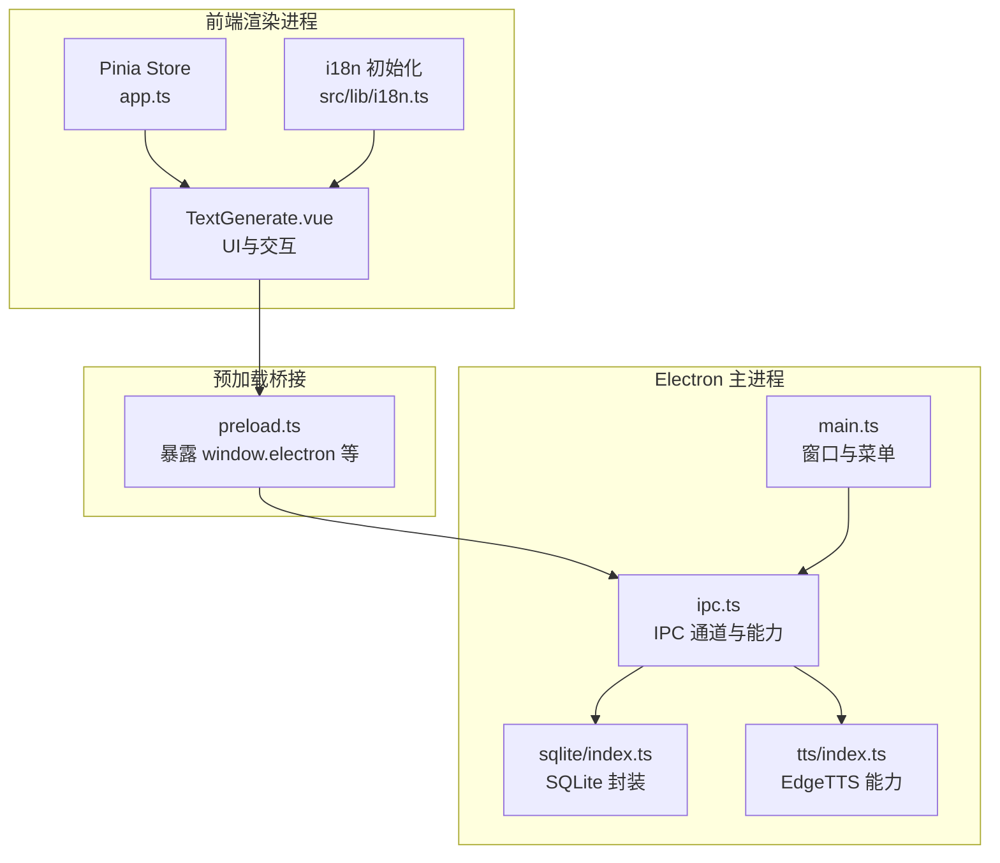
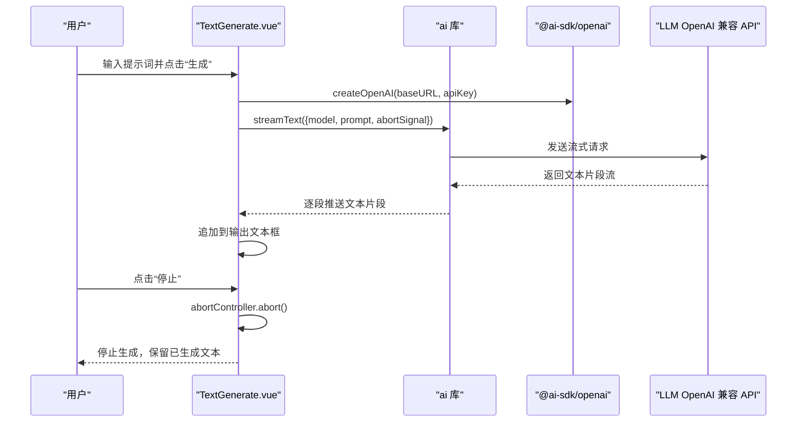
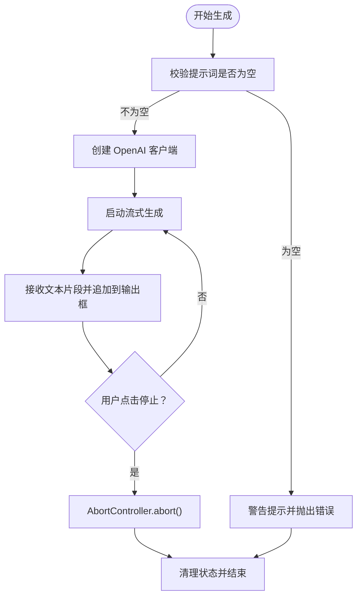
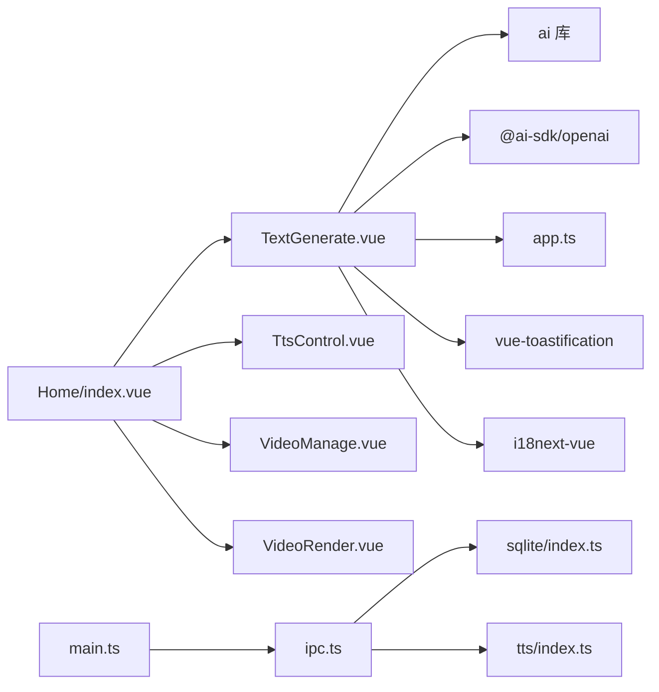

# AI文案生成系统

<cite>
**本文档引用的文件**
- [src/views/Home/components/TextGenerate.vue](file://src/views/Home/components/TextGenerate.vue)
- [src/store/app.ts](file://src/store/app.ts)
- [src/views/Home/index.vue](file://src/views/Home/index.vue)
- [electron/main.ts](file://electron/main.ts)
- [electron/ipc.ts](file://electron/ipc.ts)
- [electron/preload.ts](file://electron/preload.ts)
- [electron/tts/index.ts](file://electron/tts/index.ts)
- [electron/sqlite/index.ts](file://electron/sqlite/index.ts)
- [src/lib/i18n.ts](file://src/lib/i18n.ts)
- [src/lib/error-copy.ts](file://src/lib/error-copy.ts)
- [locales/en/common.json](file://locales/en/common.json)
- [locales/zh-CN/common.json](file://locales/zh-CN/common.json)
- [package.json](file://package.json)
</cite>

## 目录
1. [简介](#简介)
2. [项目结构](#项目结构)
3. [核心组件](#核心组件)
4. [架构总览](#架构总览)
5. [详细组件分析](#详细组件分析)
6. [依赖关系分析](#依赖关系分析)
7. [性能考虑](#性能考虑)
8. [故障排除指南](#故障排除指南)
9. [结论](#结论)
10. [附录](#附录)

## 简介
本系统是一个基于桌面端 Electron 应用的 AI 文案生成工具，围绕“提示词输入 → 大语言模型（LLM）流式生成 → 输出文案”的核心流程展开，并与语音合成（TTS）、视频素材管理、视频渲染等模块协同，形成完整的短视频内容生产管线。系统通过 OpenAI 兼容 API 实现 LLM 集成，采用流式文本生成技术，支持实时停止；通过 Pinia 状态管理持久化配置；通过 i18n 提供多语言支持；通过 IPC 在渲染进程与主进程间传递能力。

## 项目结构
系统采用前端框架 + Electron 主进程 + 预加载桥接的典型桌面应用架构：
- 前端层：Vue 3 + Vuetify UI 组件，负责用户界面与交互。
- 状态层：Pinia Store 管理全局状态（如提示词、LLM 配置、渲染状态等）。
- 业务层：LLM 文案生成组件、TTS 控制、视频素材管理、视频渲染等。
- 平台层：Electron 主进程负责窗口、IPC、SQLite 数据库、TTS 语音合成、FFmpeg 视频渲染等。
- 国际化：i18n 初始化与资源加载，支持中英文。

**图表来源**
- [src/views/Home/components/TextGenerate.vue](file://src/views/Home/components/TextGenerate.vue)
- [src/store/app.ts](file://src/store/app.ts)
- [src/lib/i18n.ts](file://src/lib/i18n.ts)
- [electron/preload.ts](file://electron/preload.ts)
- [electron/ipc.ts](file://electron/ipc.ts)
- [electron/sqlite/index.ts](file://electron/sqlite/index.ts)
- [electron/tts/index.ts](file://electron/tts/index.ts)
- [electron/main.ts](file://electron/main.ts)

**章节来源**
- [src/views/Home/components/TextGenerate.vue](file://src/views/Home/components/TextGenerate.vue)
- [src/store/app.ts](file://src/store/app.ts)
- [src/lib/i18n.ts](file://src/lib/i18n.ts)
- [electron/preload.ts](file://electron/preload.ts)
- [electron/ipc.ts](file://electron/ipc.ts)
- [electron/sqlite/index.ts](file://electron/sqlite/index.ts)
- [electron/tts/index.ts](file://electron/tts/index.ts)
- [electron/main.ts](file://electron/main.ts)

## 核心组件
- 文案生成组件（TextGenerate.vue）
  - 功能：提示词输入、生成/停止按钮、配置对话框、测试连接、流式输出。
  - 关键点：使用 ai 库的 streamText 进行流式生成；使用 AbortController 支持实时停止；错误弹窗与复制错误详情。
- 应用状态（app.ts）
  - 功能：维护提示词、LLM 配置（模型名、API 地址、API Key）、渲染状态等。
  - 关键点：LLM 配置持久化（除特定字段外），渲染状态机驱动整体流程。
- 主页编排（Home/index.vue）
  - 功能：协调文案生成、TTS、视频素材管理、视频渲染四个子模块，串联渲染管线。
  - 关键点：按状态机顺序执行各阶段；异常捕获与统计上报；自动批量渲染。
- 国际化（i18n.ts）
  - 功能：初始化 i18next，加载本地语言包，根据系统语言设置默认语言。
- 错误复制（error-copy.ts）
  - 功能：格式化错误对象为 JSON 字符串，便于复制到剪贴板。

**章节来源**
- [src/views/Home/components/TextGenerate.vue](file://src/views/Home/components/TextGenerate.vue)
- [src/store/app.ts](file://src/store/app.ts)
- [src/views/Home/index.vue](file://src/views/Home/index.vue)
- [src/lib/i18n.ts](file://src/lib/i18n.ts)
- [src/lib/error-copy.ts](file://src/lib/error-copy.ts)

## 架构总览
系统采用“渲染进程 + 预加载桥接 + 主进程 IPC”的分层架构：
- 渲染进程负责 UI 与业务交互；
- 预加载桥接将安全可控的主进程能力暴露给渲染进程；
- 主进程通过 IPC 提供数据库、文件系统、TTS、视频渲染等底层能力；
- LLM 通过 OpenAI 兼容 API 由渲染进程直接调用（ai + @ai-sdk/openai）。

**图表来源**
- [src/views/Home/components/TextGenerate.vue](file://src/views/Home/components/TextGenerate.vue)
- [package.json](file://package.json)

**章节来源**
- [src/views/Home/components/TextGenerate.vue](file://src/views/Home/components/TextGenerate.vue)
- [package.json](file://package.json)

## 详细组件分析

### 文案生成组件（TextGenerate.vue）
- 用户界面
  - 左侧提示词输入区、右侧输出文案区、中间操作区（生成/停止、配置、测试）。
  - 配置对话框包含模型名、API 地址、API Key 三项必填项。
- 生成流程
  - 参数校验：提示词非空。
  - 创建 OpenAI 客户端：使用 store 中的 llmConfig。
  - 启动流式生成：streamText 返回 textStream，逐段追加到输出框。
  - 异常处理：区分中断（AbortError）与其它错误；非中断错误弹出可复制详情的 Toast。
  - 停止机制：AbortController.abort() 可随时中断。
- 配置与测试
  - 保存配置：写回 store 的 llmConfig。
  - 测试连接：generateText 发送简单提示，成功/失败分别弹出成功/错误 Toast。
- 导出方法：对外暴露 handleGenerate、handleStopGenerate、getCurrentOutputText、clearOutputText。

**图表来源**
- [src/views/Home/components/TextGenerate.vue](file://src/views/Home/components/TextGenerate.vue)

**章节来源**
- [src/views/Home/components/TextGenerate.vue](file://src/views/Home/components/TextGenerate.vue)

### 应用状态（app.ts）
- 状态域
  - prompt：当前提示词
  - llmConfig：{ modelName, apiUrl, apiKey }
  - renderStatus：渲染状态机（None、GenerateText、SynthesizedSpeech、SegmentVideo、Rendering、Completed、Failed）
  - 其它：TTS 语音、速度、语言列表等（与本节重点无关）
- 行为
  - updateLLMConfig：更新 LLM 配置
  - updateRenderStatus：更新渲染状态
  - 持久化：除部分字段外，其余状态持久化存储

**章节来源**
- [src/store/app.ts](file://src/store/app.ts)

### 主页编排（Home/index.vue）
- 协调四个子模块：TextGenerate、VideoManage、TtsControl、VideoRender
- 渲染流程
  - 校验输出文件名、输出路径、输出尺寸
  - 获取文案：优先使用已生成文案，否则触发生成
  - TTS 合成语音并校验时长
  - 获取视频片段并等待随机延时
  - 调用主进程渲染视频
  - 成功/失败统一弹窗与统计上报
- 停止渲染
  - 根据当前状态调用对应模块的停止逻辑；渲染阶段通过 IPC 发送取消信号

**章节来源**
- [src/views/Home/index.vue](file://src/views/Home/index.vue)

### 国际化（i18n.ts）
- 初始化 i18next，加载本地语言包文件
- 根据系统语言设置默认语言
- 与 Electron 预加载桥接配合，通过 window.i18n 访问

**章节来源**
- [src/lib/i18n.ts](file://src/lib/i18n.ts)
- [locales/en/common.json](file://locales/en/common.json)
- [locales/zh-CN/common.json](file://locales/zh-CN/common.json)

### 预加载桥接（preload.ts）
- 暴露 window.ipcRenderer、window.electron、window.sqlite 等 API
- 为渲染进程提供安全访问主进程能力的入口

**章节来源**
- [electron/preload.ts](file://electron/preload.ts)

### 主进程（main.ts）
- 创建窗口、构建菜单、国际化、IPC 初始化
- 禁用 CORS、允许本地网络请求等安全策略调整

**章节来源**
- [electron/main.ts](file://electron/main.ts)

### IPC 通道（ipc.ts）
- 提供 SQLite CRUD、文件夹选择、文件列表、EdgeTTS 语音列表、语音合成、视频渲染、统计上报等能力
- 视频渲染支持 AbortController，实现取消渲染

**章节来源**
- [electron/ipc.ts](file://electron/ipc.ts)

### TTS 能力（tts/index.ts）
- 基于 EdgeTTS 的语音合成，支持生成 MP3 与字幕 SRT
- 自动清理临时文件，保证应用退出时资源释放

**章节来源**
- [electron/tts/index.ts](file://electron/tts/index.ts)

### SQLite 封装（sqlite/index.ts）
- Better-SQLite3 封装，提供查询、插入、更新、删除、批量插入或更新
- 根据平台与架构选择原生绑定文件

**章节来源**
- [electron/sqlite/index.ts](file://electron/sqlite/index.ts)

## 依赖关系分析
- 渲染进程依赖
  - ai 与 @ai-sdk/openai：实现 OpenAI 兼容 API 的流式文本生成
  - vue、vuetify：UI 组件与样式
  - pinia：状态管理
  - i18next-vue：国际化
  - vue-toastification：通知与错误弹窗
- 主进程依赖
  - better-sqlite3：本地数据库
  - ffmpeg：视频渲染
  - EdgeTTS：语音合成
  - i18next-http-backend：后端 i18n 资源加载

**图表来源**
- [src/views/Home/components/TextGenerate.vue](file://src/views/Home/components/TextGenerate.vue)
- [src/views/Home/index.vue](file://src/views/Home/index.vue)
- [src/store/app.ts](file://src/store/app.ts)
- [electron/main.ts](file://electron/main.ts)
- [electron/ipc.ts](file://electron/ipc.ts)
- [electron/sqlite/index.ts](file://electron/sqlite/index.ts)
- [electron/tts/index.ts](file://electron/tts/index.ts)
- [package.json](file://package.json)

**章节来源**
- [package.json](file://package.json)

## 性能考虑
- 流式生成
  - 使用 streamText 逐步接收文本片段，降低首帧延迟，提升交互体验。
- 中断控制
  - 通过 AbortController 实时停止，避免长时间等待。
- 状态机与并发
  - 渲染状态机避免并发阶段冲突；渲染阶段支持取消，减少无效计算。
- 资源清理
  - TTS 临时文件在应用退出前清理，避免磁盘占用。
- 网络与超时
  - 建议在实际部署中增加合理的超时与重试策略（当前实现未见显式重试逻辑）。

[本节为通用性能建议，不直接分析具体文件]

## 故障排除指南
- 提示词为空
  - 现象：点击生成弹出警告并抛错
  - 处理：输入有效提示词后重试
- LLM 连接失败
  - 现象：测试连接弹出错误 Toast，包含可复制的错误详情
  - 处理：核对模型名、API 地址、API Key；确认网络可达；必要时复制错误详情反馈
- 生成过程中断
  - 现象：点击停止后立即返回，保留已生成文本
  - 处理：再次点击生成继续
- 渲染失败
  - 现象：渲染阶段弹出错误 Toast，包含可复制的错误详情
  - 处理：检查输出路径、文件名、分辨率等配置；查看日志并复制错误详情

**章节来源**
- [src/views/Home/components/TextGenerate.vue](file://src/views/Home/components/TextGenerate.vue)
- [src/views/Home/index.vue](file://src/views/Home/index.vue)
- [src/lib/error-copy.ts](file://src/lib/error-copy.ts)

## 结论
该系统以简洁清晰的 UI 和明确的状态机为核心，实现了从提示词到文案、再到视频渲染的完整工作流。其关键优势在于：
- 基于 OpenAI 兼容 API 的 LLM 集成与流式文本生成，具备良好的兼容性与实时性；
- 明确的中断机制与错误处理，保障用户体验；
- 通过 IPC 将底层能力（数据库、TTS、视频渲染）安全地暴露给渲染进程；
- 国际化与配置测试功能提升了易用性。

对于开发者而言，系统提供了清晰的扩展点：可在现有状态机基础上新增阶段，或替换 LLM 提供方；在 UI 层面可增加更多配置项与可视化反馈。

[本节为总结性内容，不直接分析具体文件]

## 附录

### 使用示例：从配置到生成的完整工作流
- 步骤一：打开配置对话框，填写模型名、API 地址、API Key
- 步骤二：点击“测试”验证连接，成功后点击“保存”
- 步骤三：在提示词输入框中输入内容，点击“生成”
- 步骤四：在生成过程中可随时点击“停止”中断
- 步骤五：生成完成后可编辑输出文案，继续后续流程（如 TTS、视频渲染）

**章节来源**
- [src/views/Home/components/TextGenerate.vue](file://src/views/Home/components/TextGenerate.vue)
- [src/store/app.ts](file://src/store/app.ts)
- [src/views/Home/index.vue](file://src/views/Home/index.vue)

### 配置管理要点
- 存储位置：llmConfig（模型名、API 地址、API Key）
- 持久化：除特定字段外，其余状态持久化
- 测试连接：独立的测试流程，避免影响正式生成
- 国际化：配置标题、标签、说明文案均支持中英文

**章节来源**
- [src/store/app.ts](file://src/store/app.ts)
- [src/views/Home/components/TextGenerate.vue](file://src/views/Home/components/TextGenerate.vue)
- [locales/en/common.json](file://locales/en/common.json)
- [locales/zh-CN/common.json](file://locales/zh-CN/common.json)