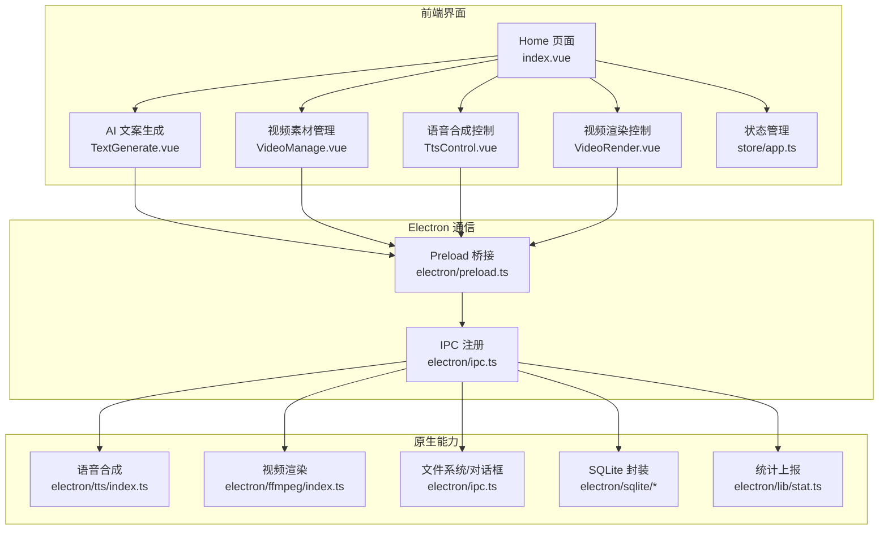
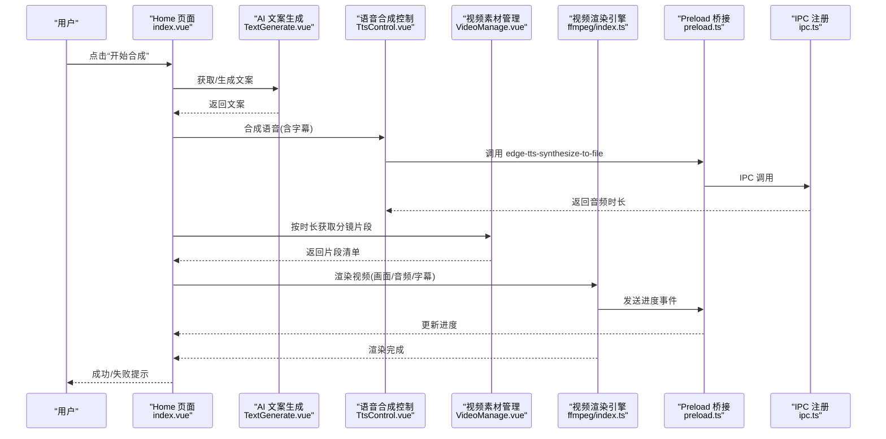
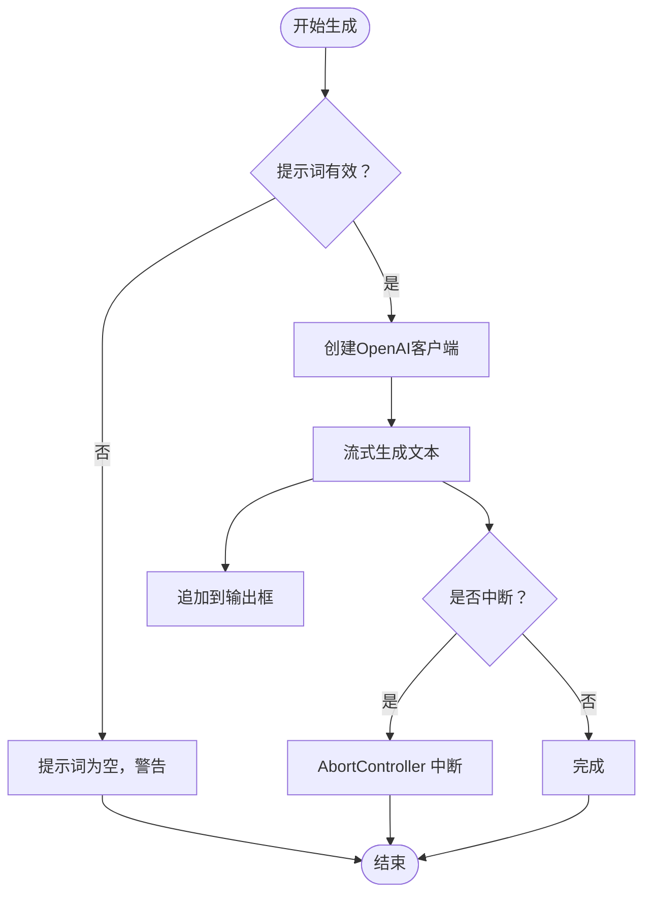
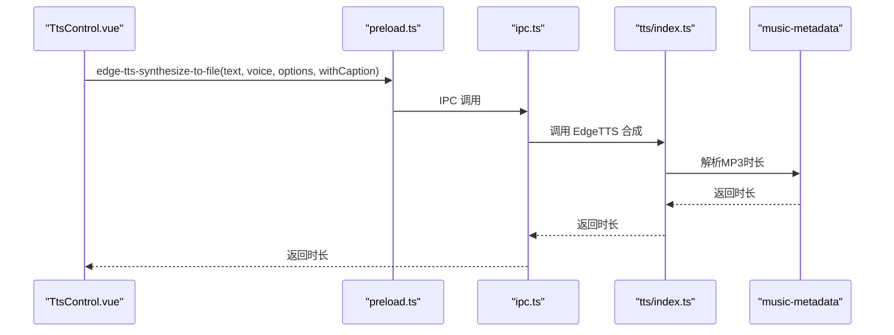
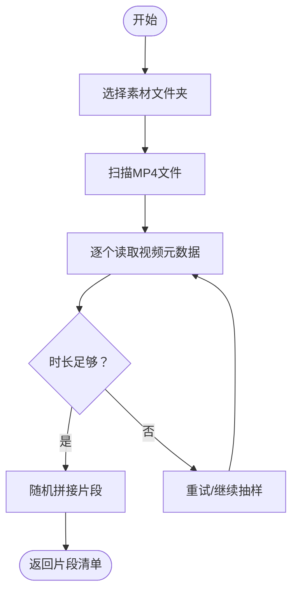
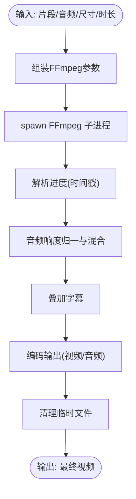
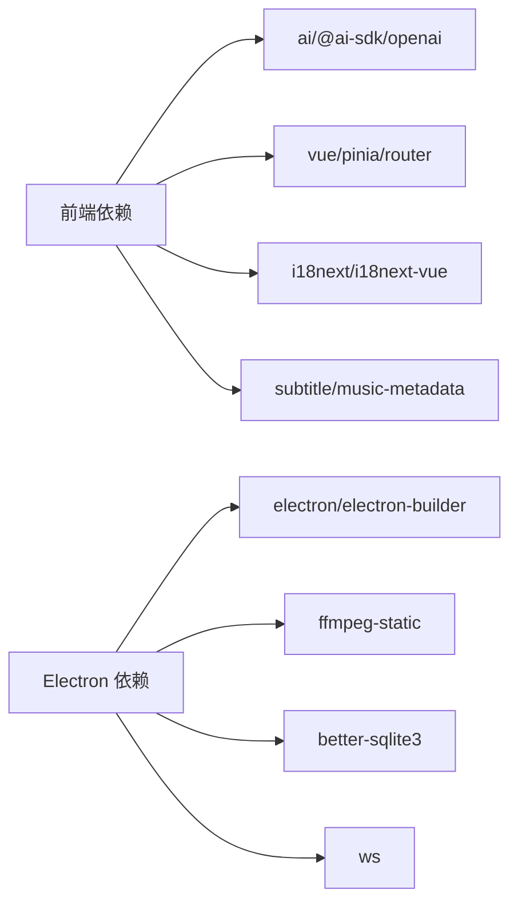

# 核心功能模块

<cite>
**本文引用的文件**
- [README.md](file://README.md)
- [package.json](file://package.json)
- [src/views/Home/index.vue](file://src/views/Home/index.vue)
- [src/views/Home/components/TextGenerate.vue](file://src/views/Home/components/TextGenerate.vue)
- [src/views/Home/components/VideoManage.vue](file://src/views/Home/components/VideoManage.vue)
- [src/views/Home/components/TtsControl.vue](file://src/views/Home/components/TtsControl.vue)
- [src/views/Home/components/VideoRender.vue](file://src/views/Home/components/VideoRender.vue)
- [src/store/app.ts](file://src/store/app.ts)
- [electron/main.ts](file://electron/main.ts)
- [electron/preload.ts](file://electron/preload.ts)
- [electron/ipc.ts](file://electron/ipc.ts)
- [electron/tts/index.ts](file://electron/tts/index.ts)
- [electron/ffmpeg/index.ts](file://electron/ffmpeg/index.ts)
- [locales/zh-CN/common.json](file://locales/zh-CN/common.json)
</cite>

## 目录
1. [简介](#简介)
2. [项目结构](#项目结构)
3. [核心组件](#核心组件)
4. [架构总览](#架构总览)
5. [详细组件分析](#详细组件分析)
6. [依赖分析](#依赖分析)
7. [性能考虑](#性能考虑)
8. [故障排查指南](#故障排查指南)
9. [结论](#结论)
10. [附录](#附录)

## 简介
短视频工厂是一个桌面端应用，围绕“AI文案生成 → 语音合成 → 视频素材管理 → 视频渲染”的流水线，提供一键生成高质量短视频的能力。其四大核心功能模块包括：
- AI文案生成系统：基于OpenAI兼容接口，通过提示词生成短视频文案，并支持在线连通性测试与配置校验。
- 语音合成系统：基于EdgeTTS，提供多语言、多性别、多语速的声音选择与试听，支持将语音与字幕同步生成。
- 视频素材管理系统：扫描指定文件夹内的MP4素材，动态读取视频元数据，按目标时长随机拼接分镜片段。
- 视频渲染引擎：基于FFmpeg，完成视频拼接、画面缩放、字幕叠加、音频响度归一与混合等全流程渲染。

该应用采用Electron + Vue 3 + Pinia的架构，通过IPC桥接渲染进程与主进程，结合本地SQLite与FFmpeg实现高性能、可扩展的本地化视频合成。

章节来源
- [README.md:44-62](file://README.md#L44-L62)

## 项目结构
项目采用“前端界面 + Electron主进程 + 原生能力封装”的分层组织：
- 前端层（Vue 3 + Vite）：Home页面包含四大功能区，状态由Pinia集中管理。
- 通信层（Electron IPC）：通过preload桥接暴露安全API至渲染进程。
- 原生能力层（主进程）：文件系统、FFmpeg、EdgeTTS、统计上报等。
- 本地存储（SQLite）：持久化配置与统计数据。

图表来源
- [src/views/Home/index.vue:1-244](file://src/views/Home/index.vue#L1-L244)
- [electron/preload.ts:1-75](file://electron/preload.ts#L1-L75)
- [electron/ipc.ts:1-188](file://electron/ipc.ts#L1-L188)
- [electron/tts/index.ts:1-86](file://electron/tts/index.ts#L1-L86)
- [electron/ffmpeg/index.ts:1-272](file://electron/ffmpeg/index.ts#L1-L272)

章节来源
- [package.json:13-21](file://package.json#L13-L21)
- [electron/main.ts:187-204](file://electron/main.ts#L187-L204)

## 核心组件
- AI文案生成系统：负责接收提示词，调用OpenAI兼容接口进行流式生成，支持中断与配置测试。
- 语音合成系统：提供语言/性别/声音/语速配置，支持试听与文件合成，生成语音与字幕。
- 视频素材管理系统：扫描并缓存MP4素材的时长，按目标时长随机拼接片段，保证总时长达标。
- 视频渲染引擎：基于FFmpeg，完成视频拼接、画面缩放、字幕叠加、音频响度归一与混合，输出最终视频。

章节来源
- [src/views/Home/components/TextGenerate.vue:128-193](file://src/views/Home/components/TextGenerate.vue#L128-L193)
- [src/views/Home/components/TtsControl.vue:209-228](file://src/views/Home/components/TtsControl.vue#L209-L228)
- [src/views/Home/components/VideoManage.vue:195-300](file://src/views/Home/components/VideoManage.vue#L195-L300)
- [electron/ffmpeg/index.ts:26-186](file://electron/ffmpeg/index.ts#L26-L186)

## 架构总览
整体工作流从Home页面发起，依次调用四大模块，期间通过状态机与IPC传递进度与结果。

图表来源
- [src/views/Home/index.vue:65-212](file://src/views/Home/index.vue#L65-L212)
- [src/views/Home/components/TextGenerate.vue:132-193](file://src/views/Home/components/TextGenerate.vue#L132-L193)
- [src/views/Home/components/TtsControl.vue:209-228](file://src/views/Home/components/TtsControl.vue#L209-L228)
- [src/views/Home/components/VideoManage.vue:195-300](file://src/views/Home/components/VideoManage.vue#L195-L300)
- [electron/ffmpeg/index.ts:171-186](file://electron/ffmpeg/index.ts#L171-L186)
- [electron/preload.ts:49-65](file://electron/preload.ts#L49-L65)
- [electron/ipc.ts:171-186](file://electron/ipc.ts#L171-L186)

## 详细组件分析

### AI文案生成系统
- 业务逻辑
  - 输入提示词，调用OpenAI兼容接口进行流式生成，支持中断。
  - 提供配置对话框，支持测试连通性与保存配置。
- 技术实现
  - 使用@ai-sdk/openai与ai库进行流式文本生成。
  - 通过AbortController实现中断；错误统一弹窗提示并支持复制错误详情。
- 用户交互
  - 生成按钮/停止按钮；配置对话框；测试连接；输出文案可编辑。

图表来源
- [src/views/Home/components/TextGenerate.vue:132-193](file://src/views/Home/components/TextGenerate.vue#L132-L193)

章节来源
- [src/views/Home/components/TextGenerate.vue:1-272](file://src/views/Home/components/TextGenerate.vue#L1-L272)
- [locales/zh-CN/common.json:78-96](file://locales/zh-CN/common.json#L78-L96)

### 语音合成系统
- 业务逻辑
  - 选择语言/性别/声音/语速，支持试听；正式合成时同时生成字幕文件。
  - 通过EdgeTTS合成MP3并解析时长，作为后续渲染时长依据。
- 技术实现
  - 通过preload暴露的IPC接口调用主进程的EdgeTTS能力。
  - 合成结果写入临时文件，解析MP3元数据获取时长。
- 用户交互
  - 下拉选择语言/性别/声音/语速；试听按钮；配置保存。

图表来源
- [src/views/Home/components/TtsControl.vue:209-228](file://src/views/Home/components/TtsControl.vue#L209-L228)
- [electron/preload.ts:59-64](file://electron/preload.ts#L59-L64)
- [electron/ipc.ts:163-169](file://electron/ipc.ts#L163-L169)
- [electron/tts/index.ts:45-85](file://electron/tts/index.ts#L45-L85)

章节来源
- [src/views/Home/components/TtsControl.vue:1-234](file://src/views/Home/components/TtsControl.vue#L1-L234)
- [electron/tts/index.ts:1-86](file://electron/tts/index.ts#L1-L86)
- [locales/zh-CN/common.json:97-125](file://locales/zh-CN/common.json#L97-L125)

### 视频素材管理系统
- 业务逻辑
  - 选择素材文件夹，扫描MP4文件；读取视频元数据（时长）并缓存。
  - 按目标时长随机拼接片段，保证总时长达标；支持超时/不足场景的容错。
- 技术实现
  - 使用HTMLVideoElement读取元数据，带超时与错误处理。
  - 随机抽样+片段裁剪，最后片段长度动态调整以满足目标时长。
- 用户交互
  - 选择文件夹；刷新素材库；展示预览；无MP4时给出提示。

图表来源
- [src/views/Home/components/VideoManage.vue:195-300](file://src/views/Home/components/VideoManage.vue#L195-L300)

章节来源
- [src/views/Home/components/VideoManage.vue:1-308](file://src/views/Home/components/VideoManage.vue#L1-L308)
- [locales/zh-CN/common.json:126-138](file://locales/zh-CN/common.json#L126-L138)

### 视频渲染引擎
- 业务逻辑
  - 接收视频片段、音频（语音/BGM）、输出尺寸与目标时长，执行拼接、缩放、字幕叠加与音频混合。
  - 实时上报进度，支持取消渲染。
- 技术实现
  - 基于FFmpeg复杂滤镜链：trim/setpts/scale/pad/concat/fps/format/subtitles/loudnorm/amix等。
  - 通过子进程执行，解析stderr中的时间戳提取进度；支持AbortSignal取消。
- 用户交互
  - 渲染进度环；开始/停止按钮；配置输出分辨率、文件名、导出路径、BGM路径。

图表来源
- [electron/ffmpeg/index.ts:26-186](file://electron/ffmpeg/index.ts#L26-L186)

章节来源
- [electron/ffmpeg/index.ts:1-272](file://electron/ffmpeg/index.ts#L1-L272)
- [src/views/Home/components/VideoRender.vue:188-240](file://src/views/Home/components/VideoRender.vue#L188-L240)
- [locales/zh-CN/common.json:139-176](file://locales/zh-CN/common.json#L139-L176)

## 依赖分析
- 前端依赖
  - ai、@ai-sdk/openai：流式文本生成。
  - vue、vue-router、pinia：界面与状态管理。
  - axios、i18next、i18next-vue：网络与国际化。
  - subtitle、music-metadata：字幕与音频元数据解析。
- Electron依赖
  - electron、electron-builder：打包与运行时。
  - ffmpeg-static：FFmpeg可执行文件。
  - better-sqlite3：本地数据库。
  - ws：WebSocket支持（用于统计上报等）。

图表来源
- [package.json:22-63](file://package.json#L22-L63)

章节来源
- [package.json:1-85](file://package.json#L1-L85)

## 性能考虑
- 文案生成
  - 流式生成减少首字延迟；中断机制避免长时间等待。
- 语音合成
  - 时长解析失败时抛出明确错误，避免无效渲染；字幕与音频同步生成。
- 素材管理
  - 元数据读取带超时与错误处理；缓存时长避免重复IO。
- 视频渲染
  - FFmpeg复杂滤镜链一次性计算；响度归一与混合减少后期处理成本；进度解析稳定可靠。
- 取消与中断
  - 渲染阶段支持AbortSignal取消，避免资源浪费。

[本节为通用性能讨论，不直接分析具体文件]

## 故障排查指南
- 文案生成
  - 提示词为空：检查输入；连通性测试失败：核对模型名、API地址、密钥。
- 语音合成
  - 语音列表获取失败：检查网络；试听失败：检查网络与TTS服务；时长为0或损坏：检查配置与网络。
- 素材管理
  - 文件夹为空或不含MP4：选择正确的素材目录；刷新失败：检查路径权限。
- 渲染
  - 输出路径不存在：选择有效导出目录；BGM读取失败：检查BGM文件夹；渲染失败：查看日志并复制错误详情。

章节来源
- [src/views/Home/components/TextGenerate.vue:160-193](file://src/views/Home/components/TextGenerate.vue#L160-L193)
- [src/views/Home/components/TtsControl.vue:112-138](file://src/views/Home/components/TtsControl.vue#L112-L138)
- [src/views/Home/components/VideoManage.vue:118-141](file://src/views/Home/components/VideoManage.vue#L118-L141)
- [src/views/Home/index.vue:188-212](file://src/views/Home/index.vue#L188-L212)
- [locales/zh-CN/common.json:88-176](file://locales/zh-CN/common.json#L88-L176)

## 结论
短视频工厂通过清晰的模块划分与稳定的IPC通信，实现了从AI文案到最终视频的一体化生产流程。四大模块职责明确、边界清晰，既便于业务用户理解价值，也为开发者提供了可扩展的技术基础。未来可在参数精细化、多TTS源接入、字幕特效增强等方面进一步演进。

[本节为总结性内容，不直接分析具体文件]

## 附录

### 使用示例与配置要点
- AI文案生成
  - 在提示词区输入内容，点击“生成”；如需测试连通性，使用“测试”按钮。
- 语音合成
  - 选择语言/性别/声音/语速；点击“试听”验证；正式合成时勾选生成字幕。
- 视频素材管理
  - 选择包含MP4素材的文件夹；点击“刷新素材库”；确保素材总时长覆盖目标时长。
- 视频渲染
  - 配置输出分辨率、文件名、导出目录与BGM目录；点击“开始合成”；支持自动批量连续合成。

章节来源
- [src/views/Home/components/TextGenerate.vue:35-94](file://src/views/Home/components/TextGenerate.vue#L35-L94)
- [src/views/Home/components/TtsControl.vue:1-57](file://src/views/Home/components/TtsControl.vue#L1-L57)
- [src/views/Home/components/VideoManage.vue:1-58](file://src/views/Home/components/VideoManage.vue#L1-L58)
- [src/views/Home/components/VideoRender.vue:62-151](file://src/views/Home/components/VideoRender.vue#L62-L151)

### 状态机与数据流
- 状态机
  - 空闲 → 生成文案 → 合成语音 → 处理素材 → 渲染 → 成功/失败。
- 数据流
  - 文案 → 语音时长 → 片段清单 → 渲染参数 → 输出视频。

章节来源
- [src/store/app.ts:5-13](file://src/store/app.ts#L5-L13)
- [src/views/Home/index.vue:122-181](file://src/views/Home/index.vue#L122-L181)