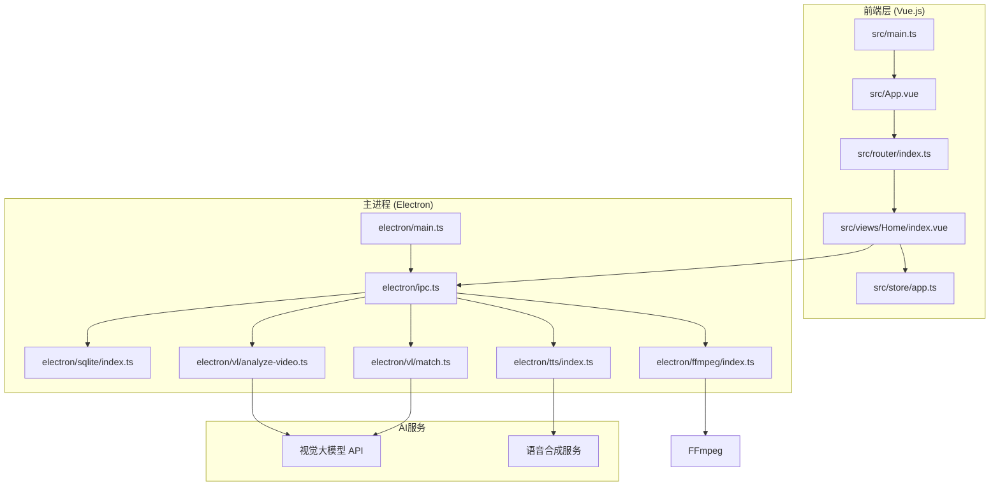
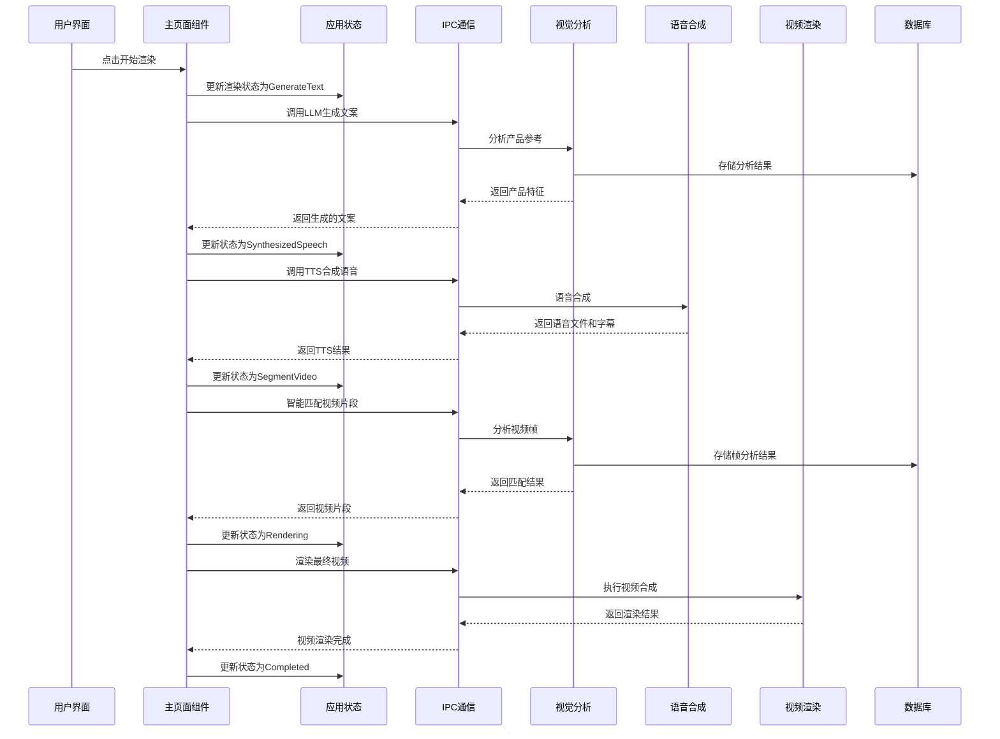
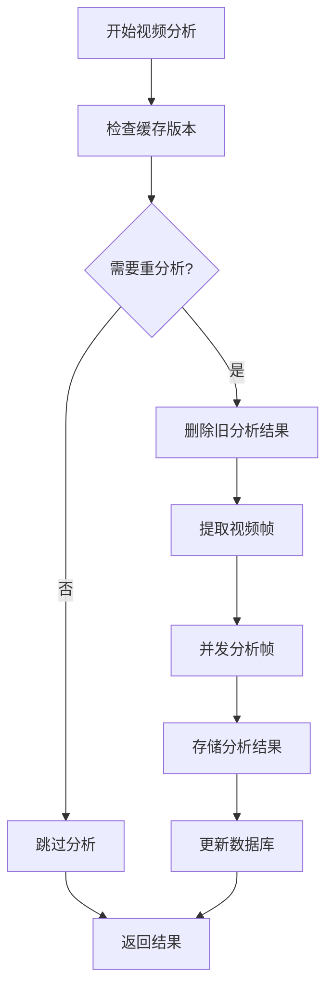
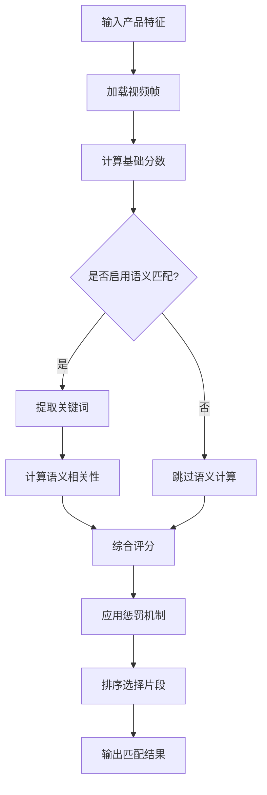
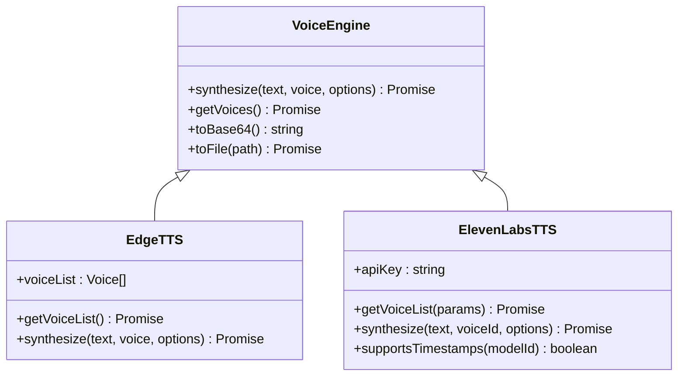
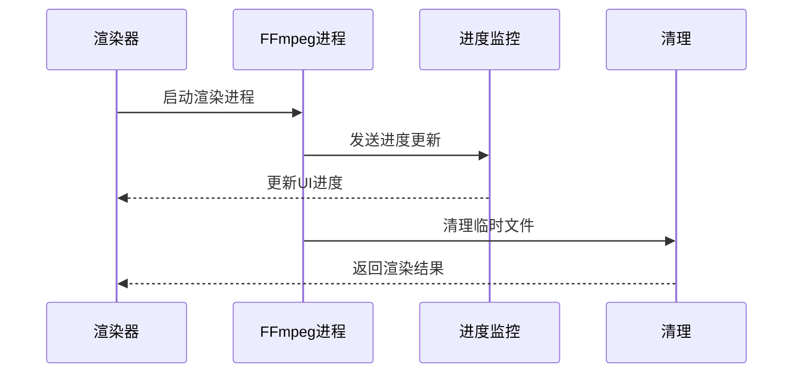
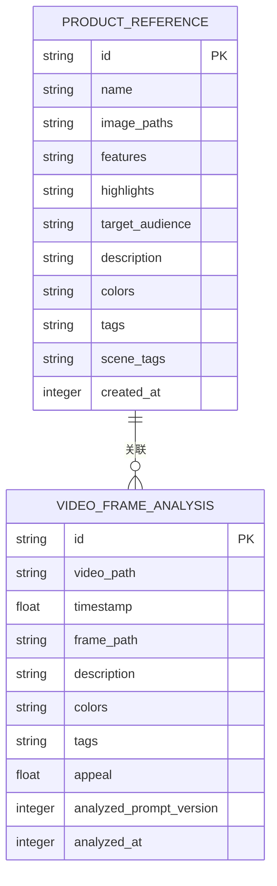
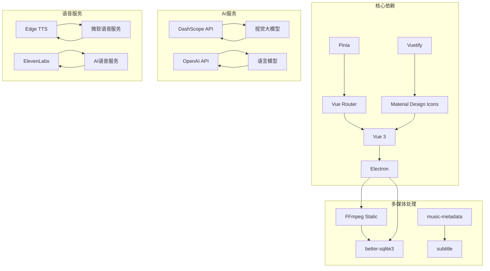
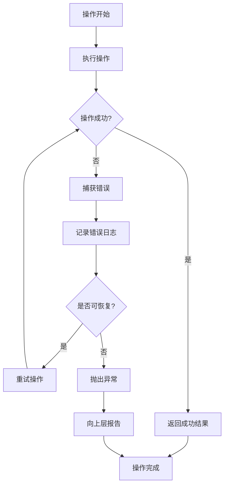

# 脚本生成系统

<cite>
**本文档引用的文件**
- [package.json](file://package.json)
- [src/main.ts](file://src/main.ts)
- [electron/main.ts](file://electron/main.ts)
- [src/App.vue](file://src/App.vue)
- [electron/ipc.ts](file://electron/ipc.ts)
- [src/store/app.ts](file://src/store/app.ts)
- [src/router/index.ts](file://src/router/index.ts)
- [electron/vl/analyze-video.ts](file://electron/vl/analyze-video.ts)
- [electron/vl/match.ts](file://electron/vl/match.ts)
- [electron/ffmpeg/index.ts](file://electron/ffmpeg/index.ts)
- [src/views/Home/index.vue](file://src/views/Home/index.vue)
- [electron/vl/analyze-product.ts](file://electron/vl/analyze-product.ts)
- [electron/sqlite/index.ts](file://electron/sqlite/index.ts)
- [electron/tts/index.ts](file://electron/tts/index.ts)
- [src/lib/video-matching-mode.ts](file://src/lib/video-matching-mode.ts)
</cite>

## 目录
1. [项目概述](#项目概述)
2. [项目结构](#项目结构)
3. [核心组件](#核心组件)
4. [架构概览](#架构概览)
5. [详细组件分析](#详细组件分析)
6. [依赖关系分析](#依赖关系分析)
7. [性能考虑](#性能考虑)
8. [故障排除指南](#故障排除指南)
9. [结论](#结论)

## 项目概述

这是一个基于 Electron 和 Vue.js 的智能脚本生成系统，专门用于自动生成带货短视频内容。系统集成了人工智能视觉分析、语音合成、视频渲染等功能，能够实现从产品参考到最终视频输出的完整自动化流程。

该系统的核心特色包括：
- AI视觉大模型驱动的智能素材匹配
- 多种语音合成引擎支持（Edge TTS、ElevenLabs）
- 高效的视频渲染管道
- 完整的产品参考管理系统
- 智能的文案生成和匹配策略

## 项目结构

**图表来源**
- [src/main.ts:1-127](file://src/main.ts#L1-L127)
- [electron/main.ts:1-204](file://electron/main.ts#L1-L204)
- [electron/ipc.ts:1-352](file://electron/ipc.ts#L1-L352)

**章节来源**
- [package.json:1-85](file://package.json#L1-L85)
- [src/main.ts:1-127](file://src/main.ts#L1-L127)
- [electron/main.ts:1-204](file://electron/main.ts#L1-L204)

## 核心组件

### 应用状态管理 (Pinia Store)

应用使用 Pinia 进行全局状态管理，主要包含以下核心状态：

- **国际化配置**：支持多语言切换和本地化
- **LLM配置**：大语言模型参数配置
- **视频资产管理**：素材文件夹路径和视频列表
- **语音合成配置**：ElevenLabs API密钥和语音参数
- **渲染配置**：输出尺寸、路径、匹配模式等
- **视觉大模型配置**：DashScope API配置
- **产品参考管理**：当前产品信息和分析结果

### 渲染状态机

系统实现了完整的渲染状态管理，包括：
- 无状态 (None)
- 文案生成 (GenerateText)
- 语音合成 (SynthesizedSpeech)
- 智能匹配 (SegmentVideo)
- 视频渲染 (Rendering)
- 完成 (Completed)
- 失败 (Failed)

### 匹配策略选择

系统提供三种智能匹配策略：
- **LLM语义匹配**：基于大语言模型进行语义层面的音视频同步
- **智能匹配**：基于视觉特征的颜色和标签匹配
- **随机匹配**：传统的时间片段随机选择

**章节来源**
- [src/store/app.ts:1-151](file://src/store/app.ts#L1-L151)
- [src/lib/video-matching-mode.ts:1-12](file://src/lib/video-matching-mode.ts#L1-L12)

## 架构概览

**图表来源**
- [src/views/Home/index.vue:97-350](file://src/views/Home/index.vue#L97-L350)
- [electron/ipc.ts:214-229](file://electron/ipc.ts#L214-L229)
- [electron/vl/match.ts:278-679](file://electron/vl/match.ts#L278-L679)

## 详细组件分析

### 视觉分析系统

#### 帧提取与分析

视觉分析系统采用分层抽帧策略，通过FFmpeg将视频转换为图像帧，然后使用视觉大模型进行分析。

**图表来源**
- [electron/vl/analyze-video.ts:96-213](file://electron/vl/analyze-video.ts#L96-L213)

#### 匹配算法

系统实现了复杂的匹配算法，结合颜色、标签和语义信息进行综合评分。

**图表来源**
- [electron/vl/match.ts:101-137](file://electron/vl/match.ts#L101-L137)

**章节来源**
- [electron/vl/analyze-video.ts:1-252](file://electron/vl/analyze-video.ts#L1-L252)
- [electron/vl/match.ts:1-701](file://electron/vl/match.ts#L1-L701)

### 语音合成系统

#### 多引擎支持

系统支持两种语音合成引擎，提供灵活的选择：

**图表来源**
- [electron/tts/index.ts:23-25](file://electron/tts/index.ts#L23-L25)

#### 字幕生成

系统支持自动生成ASS格式字幕，精确控制字幕的字体大小、位置和显示时间。

**章节来源**
- [electron/tts/index.ts:1-218](file://electron/tts/index.ts#L1-L218)

### 视频渲染系统

#### FFmpeg集成

系统深度集成了FFmpeg，提供了完整的视频渲染能力：

**图表来源**
- [electron/ffmpeg/index.ts:153-209](file://electron/ffmpeg/index.ts#L153-L209)

**章节来源**
- [electron/ffmpeg/index.ts:1-237](file://electron/ffmpeg/index.ts#L1-L237)

### 数据持久化

#### SQLite数据库设计

系统使用SQLite作为本地数据存储，设计了专门的表结构来支持各种功能需求。

**图表来源**
- [electron/sqlite/index.ts:149-206](file://electron/sqlite/index.ts#L149-L206)

**章节来源**
- [electron/sqlite/index.ts:1-218](file://electron/sqlite/index.ts#L1-L218)

## 依赖关系分析

**图表来源**
- [package.json:22-63](file://package.json#L22-L63)

**章节来源**
- [package.json:1-85](file://package.json#L1-L85)

## 性能考虑

### 并发处理优化

系统在多个环节采用了并发优化策略：

1. **帧分析并发**：使用固定数量的工作线程池处理视频帧分析
2. **数据库操作**：批量插入和事务处理减少I/O开销
3. **内存管理**：及时清理临时文件和缓存数据

### 缓存策略

- **帧缓存**：基于视频路径的MD5哈希生成缓存目录
- **分析版本控制**：自动检测和更新分析结果版本
- **临时文件管理**：应用退出时自动清理临时文件

### 资源管理

- **内存使用**：限制并发数量，避免内存溢出
- **磁盘空间**：监控缓存目录大小，定期清理
- **网络请求**：合理的超时和重试机制

## 故障排除指南

### 常见问题诊断

#### FFmpeg相关问题

**问题**：FFmpeg执行失败
**解决方案**：
1. 检查FFmpeg可执行文件是否存在
2. 验证文件权限和路径正确性
3. 查看详细的错误日志信息

#### 语音合成问题

**问题**：TTS合成失败或时长异常
**解决方案**：
1. 验证API密钥配置正确
2. 检查网络连接和代理设置
3. 确认目标模型支持时间戳功能

#### 视觉分析问题

**问题**：视频分析进度停滞
**解决方案**：
1. 检查AI服务API配置
2. 验证视频文件完整性
3. 监控系统资源使用情况

### 错误处理机制

系统实现了多层次的错误处理：

**章节来源**
- [electron/ffmpeg/index.ts:189-208](file://electron/ffmpeg/index.ts#L189-L208)
- [electron/tts/index.ts:197-217](file://electron/tts/index.ts#L197-L217)

## 结论

这个脚本生成系统展现了现代多媒体应用的完整架构设计，成功地将AI技术、多媒体处理和用户界面有机结合。系统的主要优势包括：

1. **完整的自动化流程**：从产品参考到最终视频输出的一站式解决方案
2. **灵活的匹配策略**：支持多种智能匹配模式，适应不同的使用场景
3. **高性能的处理能力**：通过并发优化和缓存策略提升处理效率
4. **稳定的错误处理**：完善的异常处理和恢复机制
5. **良好的扩展性**：模块化的架构设计便于功能扩展

该系统为短视频内容创作提供了强大的技术支持，特别适合电商带货等需要大量重复内容生产的场景。通过持续优化和功能扩展，可以进一步提升用户体验和生产效率。