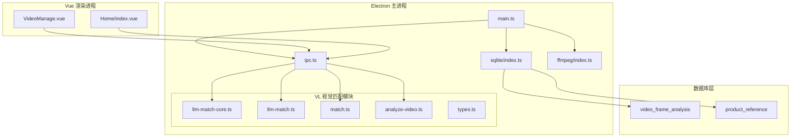
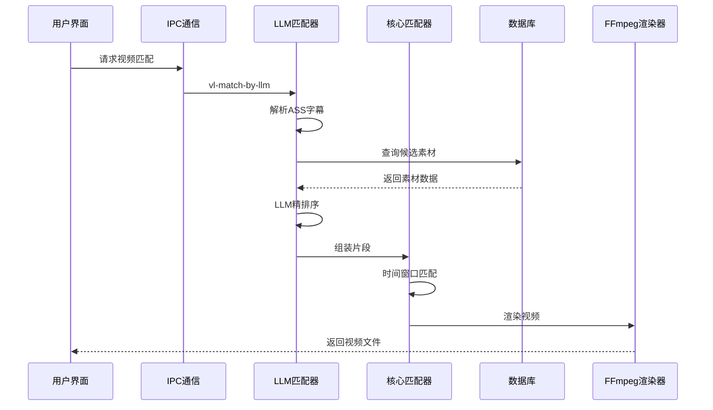
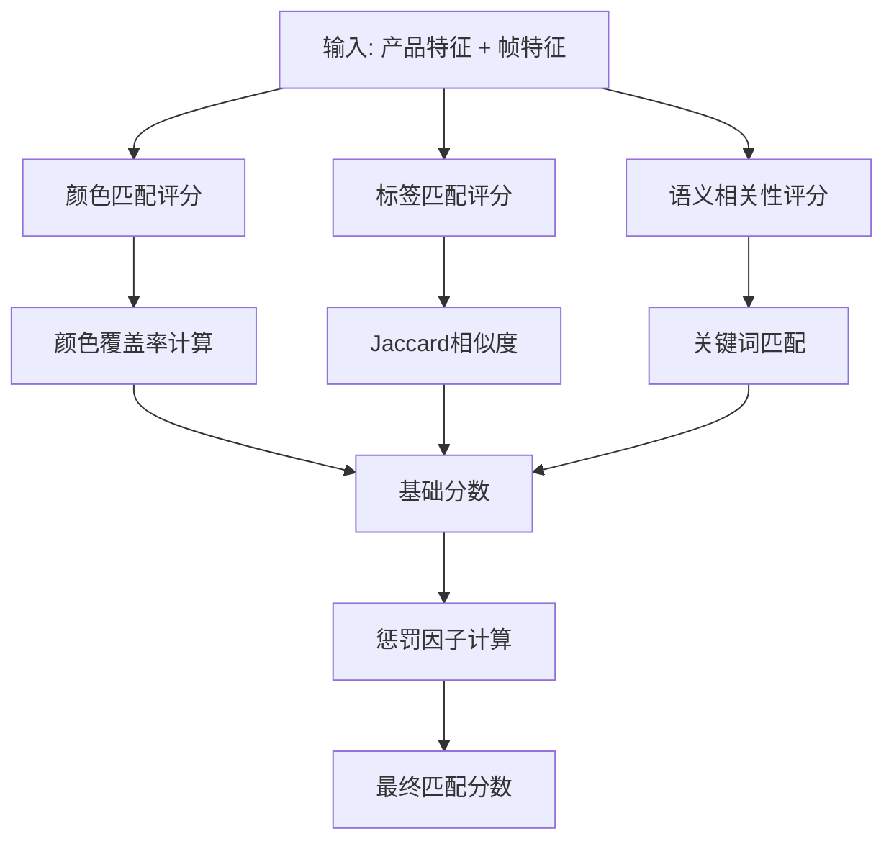
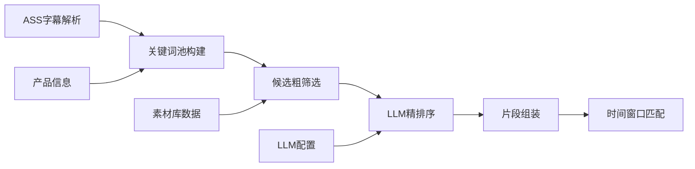
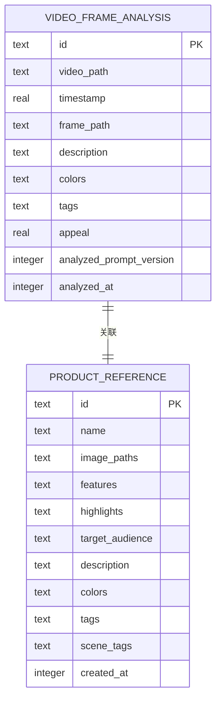
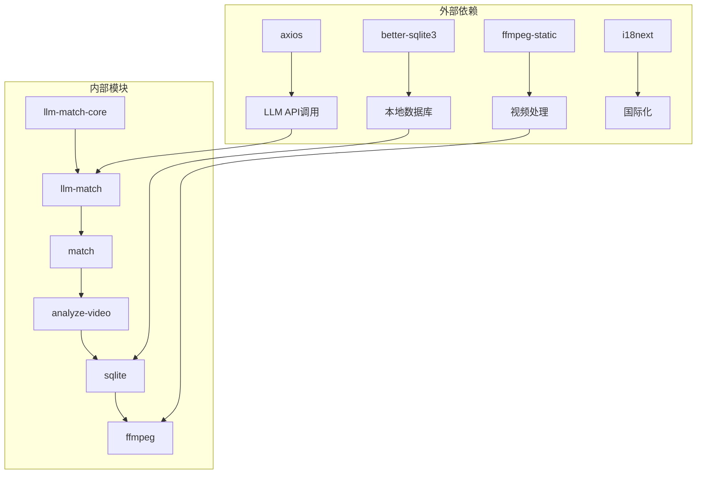
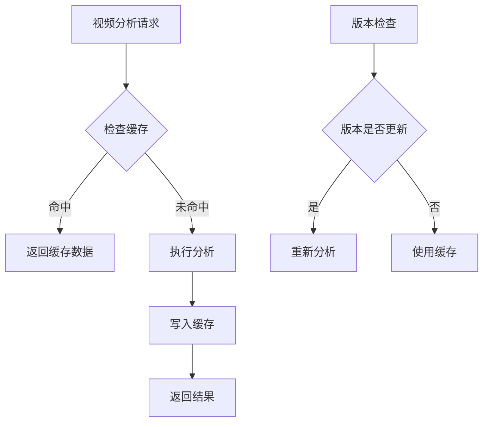

# 视频匹配策略系统

<cite>
**本文档引用的文件**
- [llm-match-core.ts](file://electron/vl/llm-match-core.ts)
- [llm-match.ts](file://electron/vl/llm-match.ts)
- [match.ts](file://electron/vl/match.ts)
- [types.ts](file://electron/vl/types.ts)
- [analyze-video.ts](file://electron/vl/analyze-video.ts)
- [analysis-version.ts](file://electron/vl/analysis-version.ts)
- [sqlite/index.ts](file://electron/sqlite/index.ts)
- [ffmpeg/index.ts](file://electron/ffmpeg/index.ts)
- [VideoManage.vue](file://src/views/Home/components/VideoManage.vue)
- [main.ts](file://electron/main.ts)
- [plan-llm-video-match.md](file://docs/plan-llm-video-match.md)
- [README.md](file://README.md)
</cite>

## 目录
1. [简介](#简介)
2. [项目结构](#项目结构)
3. [核心组件](#核心组件)
4. [架构概览](#架构概览)
5. [详细组件分析](#详细组件分析)
6. [依赖关系分析](#依赖关系分析)
7. [性能考量](#性能考量)
8. [故障排除指南](#故障排除指南)
9. [结论](#结论)

## 简介

视频匹配策略系统是一个基于人工智能的短视频自动剪辑解决方案，专为带货视频制作而设计。该系统能够将AI生成的口播文案与视频素材进行精确的语义对齐，实现智能化的视频片段选择和拼接。

系统采用双模式匹配策略：
- **智能匹配模式**：基于颜色、标签和语义的三重对齐
- **LLM增强模式**：利用大型语言模型实现更精准的语义匹配

该系统支持日产1000+条视频的批量自动化生产，适用于抖音、快手、TikTok等平台的带货视频制作。

## 项目结构

**图表来源**
- [main.ts:1-200](file://electron/main.ts#L1-L200)
- [sqlite/index.ts:144-218](file://electron/sqlite/index.ts#L144-L218)

**章节来源**
- [README.md:39-75](file://README.md#L39-L75)
- [main.ts:1-200](file://electron/main.ts#L1-L200)

## 核心组件

### 视觉匹配核心模块

系统的核心是视觉匹配算法，它实现了多层次的视频片段评估和选择机制：

#### 匹配算法层次
1. **颜色匹配层**：计算产品颜色覆盖率
2. **标签匹配层**：基于语义标签的相关性评分
3. **语义对齐层**：结合文案内容的深度匹配
4. **场景模式层**：针对不同场景类型的专门处理

#### 关键数据结构
- **CandidateClip**：候选视频片段信息
- **StageSentence**：带阶段标记的句子
- **MatchedSegment**：匹配结果片段

**章节来源**
- [match.ts:46-137](file://electron/vl/match.ts#L46-L137)
- [types.ts:44-66](file://electron/vl/types.ts#L44-L66)

### LLM增强匹配模块

该模块引入了大型语言模型来提升匹配精度：

#### LLM匹配流程
1. **ASS字幕解析**：提取句子时间和内容
2. **关键词池构建**：基于文案和产品信息生成搜索关键词
3. **候选粗筛选**：从素材库中选择相关性最高的候选
4. **LLM精排序**：使用深度学习模型进行最终排序
5. **片段组装**：生成最终的视频文件和时间戳

**章节来源**
- [llm-match.ts:26-337](file://electron/vl/llm-match.ts#L26-L337)
- [llm-match-core.ts:454-652](file://electron/vl/llm-match-core.ts#L454-L652)

### 视频分析模块

系统具备完整的视频分析能力，包括：

#### 分析功能
- **帧提取**：定时抽取视频关键帧
- **视觉特征分析**：识别颜色、标签和描述
- **缓存管理**：智能缓存避免重复分析
- **增量更新**：支持版本升级后的重新分析

**章节来源**
- [analyze-video.ts:96-252](file://electron/vl/analyze-video.ts#L96-L252)
- [sqlite/index.ts:165-184](file://electron/sqlite/index.ts#L165-L184)

## 架构概览

**图表来源**
- [llm-match.ts:298-337](file://electron/vl/llm-match.ts#L298-L337)
- [match.ts:278-679](file://electron/vl/match.ts#L278-L679)

## 详细组件分析

### 智能匹配算法

#### 匹配评分体系

系统采用多维度评分机制：

**图表来源**
- [match.ts:101-137](file://electron/vl/match.ts#L101-L137)

#### 场景模式切换

系统支持两种匹配模式：

| 模式 | 特征 | 适用场景 | 匹配策略 |
|------|------|----------|----------|
| 产品模式 | 严格颜色+标签 | 商品详情、参数展示 | 颜色覆盖率≥34% |
| 场景模式 | 标签优先 | 使用场景、生活场景 | 语义权重0.8 |

**章节来源**
- [match.ts:278-679](file://electron/vl/match.ts#L278-L679)

### LLM增强匹配系统

#### LLM匹配流程

**图表来源**
- [llm-match.ts:182-274](file://electron/vl/llm-match.ts#L182-L274)

#### LLM提示词设计

系统为LLM设计了专门的提示词模板，包含：

- **镜头结构约束**：确保视频符合带货视频的标准结构
- **匹配规则**：语义相关性优先于场景一致性
- **输出格式规范**：严格的JSON格式要求

**章节来源**
- [llm-match.ts:191-227](file://electron/vl/llm-match.ts#L191-L227)

### 数据库设计

#### 核心数据表

**图表来源**
- [sqlite/index.ts:165-206](file://electron/sqlite/index.ts#L165-L206)

**章节来源**
- [sqlite/index.ts:144-218](file://electron/sqlite/index.ts#L144-L218)

## 依赖关系分析

**图表来源**
- [package.json:22-64](file://package.json#L22-L64)
- [llm-match.ts:1-17](file://electron/vl/llm-match.ts#L1-L17)

**章节来源**
- [package.json:22-64](file://package.json#L22-L64)

## 性能考量

### 并发处理优化

系统采用了多级并发策略：

#### 帧分析并发
- **并发数**：3个并发进程
- **内存管理**：及时清理临时文件
- **进度反馈**：实时更新分析进度

#### 数据库操作
- **批量插入**：使用事务提高写入效率
- **索引优化**：为video_path建立索引
- **增量更新**：避免重复分析相同素材

### 缓存策略

**图表来源**
- [analyze-video.ts:115-137](file://electron/vl/analyze-video.ts#L115-L137)
- [analysis-version.ts:8-17](file://electron/vl/analysis-version.ts#L8-L17)

## 故障排除指南

### 常见问题及解决方案

#### LLM匹配失败
- **症状**：LLM API调用超时或返回错误
- **解决方案**：自动回退到传统匹配算法
- **预防措施**：检查网络连接和API密钥

#### 视频分析异常
- **症状**：FFmpeg执行失败或帧提取错误
- **解决方案**：清理缓存目录重新分析
- **预防措施**：确保视频文件完整性和权限正确

#### 内存不足
- **症状**：大量视频分析时内存占用过高
- **解决方案**：调整并发数和缓存大小
- **预防措施**：监控系统资源使用情况

**章节来源**
- [llm-match.ts:266-274](file://electron/vl/llm-match.ts#L266-L274)
- [analyze-video.ts:197-200](file://electron/vl/analyze-video.ts#L197-L200)

### 调试工具

系统提供了完善的调试功能：

#### 匹配日志系统
- **日志文件**：自动创建匹配过程日志
- **关键节点**：记录每个处理阶段的状态
- **性能监控**：跟踪处理时间和资源使用

#### 进度反馈
- **实时进度**：显示视频分析进度
- **错误详情**：提供详细的错误信息
- **操作指导**：引导用户进行故障排除

**章节来源**
- [match.ts:16-40](file://electron/vl/match.ts#L16-L40)
- [VideoManage.vue:269-273](file://src/views/Home/components/VideoManage.vue#L269-L273)

## 结论

视频匹配策略系统通过技术创新实现了带货视频制作的自动化和智能化。系统的主要优势包括：

### 技术创新
- **双模式匹配**：结合传统算法和LLM的优势
- **智能缓存**：避免重复分析，提高效率
- **容错机制**：完善的错误处理和回退策略

### 应用价值
- **生产效率**：支持日产1000+条视频的批量生产
- **质量保证**：通过语义对齐确保内容准确性
- **成本控制**：减少人工干预，降低制作成本

### 发展前景
系统为短视频内容创作者提供了强大的技术支撑，随着AI技术的不断发展，该系统将继续优化和扩展，为更多应用场景提供服务。