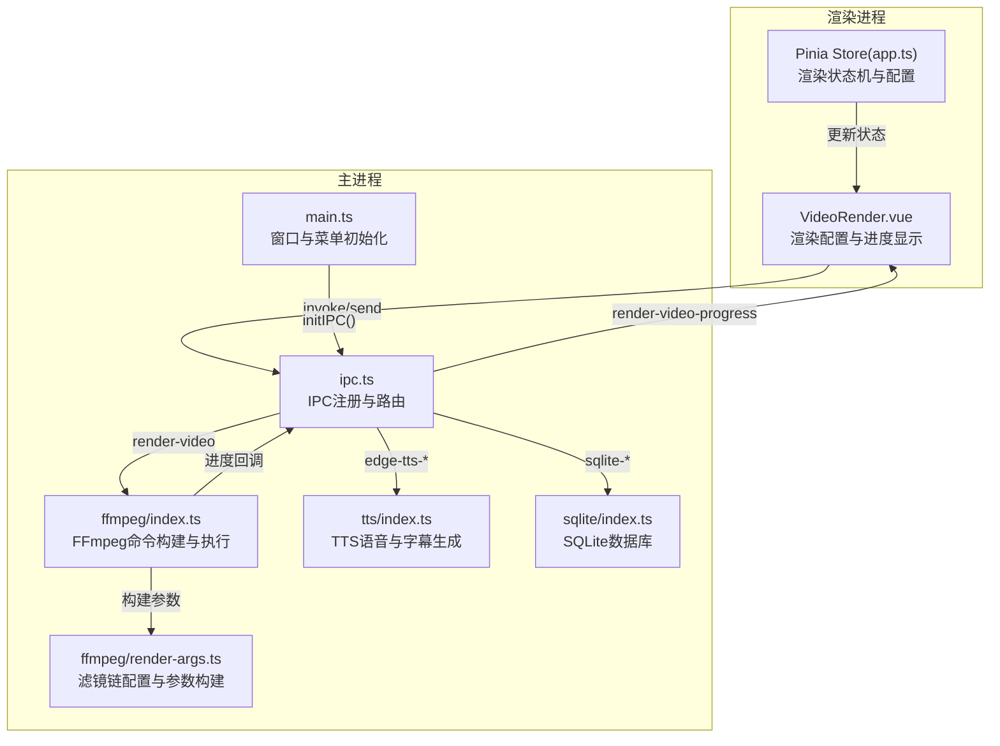
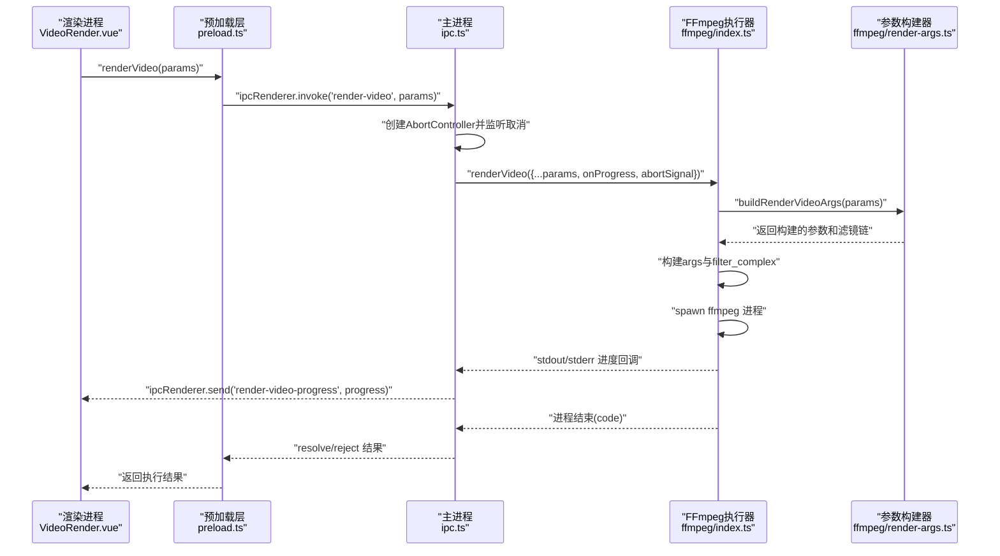
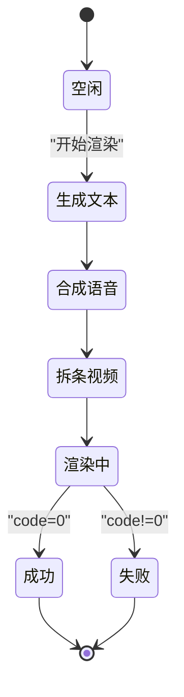
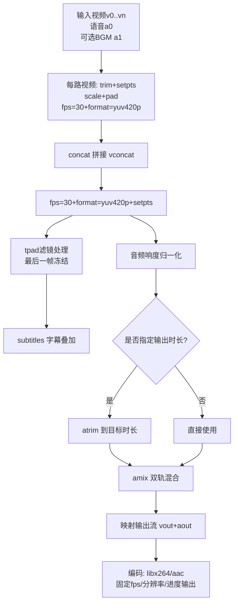
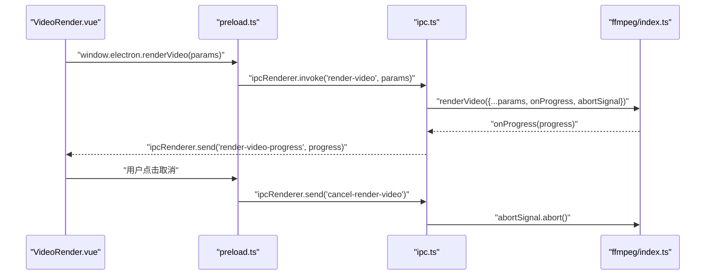
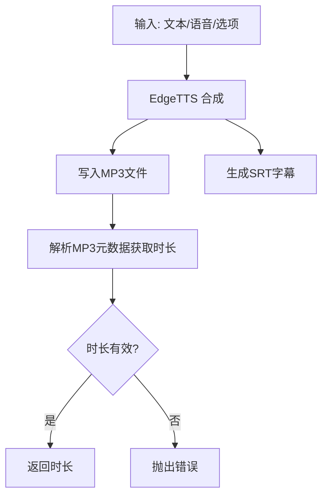
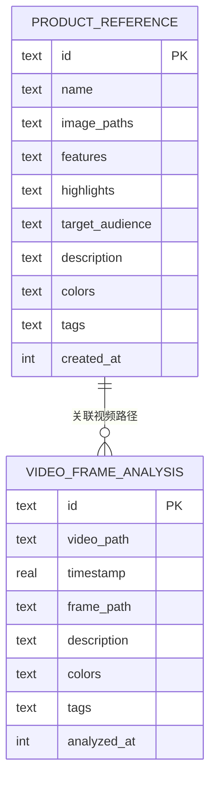
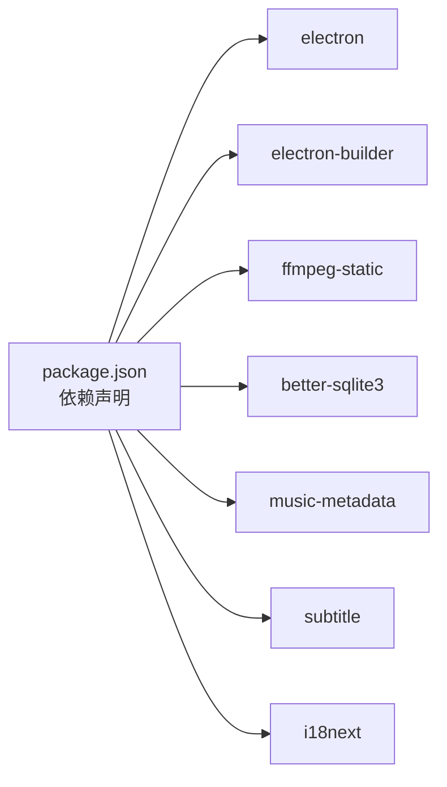

# 视频渲染引擎

<cite>
**本文引用的文件**
- [README.md](file://README.md)
- [package.json](file://package.json)
- [electron/main.ts](file://electron/main.ts)
- [electron/preload.ts](file://electron/preload.ts)
- [electron/ipc.ts](file://electron/ipc.ts)
- [electron/ffmpeg/index.ts](file://electron/ffmpeg/index.ts)
- [electron/ffmpeg/render-args.ts](file://electron/ffmpeg/render-args.ts)
- [electron/ffmpeg/types.ts](file://electron/ffmpeg/types.ts)
- [electron/tts/index.ts](file://electron/tts/index.ts)
- [electron/tts/types.ts](file://electron/tts/types.ts)
- [electron/lib/tools.ts](file://electron/lib/tools.ts)
- [electron/sqlite/index.ts](file://electron/sqlite/index.ts)
- [src/views/Home/components/VideoRender.vue](file://src/views/Home/components/VideoRender.vue)
- [src/store/app.ts](file://src/store/app.ts)
- [electron/types.ts](file://electron/types.ts)
</cite>

## 更新摘要
**变更内容**
- 新增tpad滤镜支持，解决视频终止问题和音视频同步
- 改进智能时长计算机制，确保视频时长与音频时长协调
- 添加XAVC编辑列表处理，通过-ignore_editlist 1参数
- 优化音视频同步算法，防止音频截断和视频提前结束
- 增强视频终止处理，最后一帧自动延长而非提前结束

## 目录
1. [简介](#简介)
2. [项目结构](#项目结构)
3. [核心组件](#核心组件)
4. [架构总览](#架构总览)
5. [详细组件分析](#详细组件分析)
6. [依赖关系分析](#依赖关系分析)
7. [性能考量](#性能考量)
8. [故障排除指南](#故障排除指南)
9. [结论](#结论)
10. [附录](#附录)

## 简介
本项目是一个基于 Electron 的桌面端短视频合成与渲染工具，核心能力围绕"视频渲染引擎"展开：通过 FFmpeg 实现多轨道视频拼接、字幕嵌入、音频混合与响度归一化、色彩空间与帧率统一等处理；借助 IPC 通道在主进程与渲染进程之间进行状态同步、进度回传与中断控制；同时提供 SQLite 数据持久化、TTS 语音合成与字幕生成、以及国际化与统计上报等配套能力。本文档面向从入门到进阶的开发者，系统梳理渲染引擎的架构设计、实现细节、配置参数、性能优化与故障排查方法。

## 项目结构
项目采用 Electron + Vue3/Vite 的双进程架构：
- 主进程负责窗口生命周期、IPC 注册、FFmpeg 调用、SQLite 数据库、统计上报等
- 渲染进程负责 UI 交互、状态管理、调用主进程接口发起渲染任务、接收进度与结果
- electron/ffmpeg 提供 FFmpeg 命令构建、滤镜链配置与执行封装
- electron/tts 提供 EdgeTTS 语音合成与字幕生成
- electron/sqlite 提供本地数据库初始化与 CRUD 封装
- src/views/Home/components/VideoRender.vue 为渲染配置与进度展示的前端组件
- src/store/app.ts 提供 Pinia 状态管理，承载渲染状态机与配置

**图表来源**
- [electron/main.ts:187-204](file://electron/main.ts#L187-L204)
- [electron/ipc.ts:89-198](file://electron/ipc.ts#L89-L198)
- [electron/ffmpeg/index.ts:26-186](file://electron/ffmpeg/index.ts#L26-L186)
- [electron/ffmpeg/render-args.ts:22-144](file://electron/ffmpeg/render-args.ts#L22-L144)
- [electron/tts/index.ts:39-85](file://electron/tts/index.ts#L39-L85)
- [electron/sqlite/index.ts:144-194](file://electron/sqlite/index.ts#L144-L194)
- [src/views/Home/components/VideoRender.vue:224-226](file://src/views/Home/components/VideoRender.vue#L224-L226)
- [src/store/app.ts:65-80](file://src/store/app.ts#L65-L80)

**章节来源**
- [README.md:44-62](file://README.md#L44-L62)
- [package.json:13-21](file://package.json#L13-L21)
- [electron/main.ts:40-76](file://electron/main.ts#L40-L76)
- [electron/preload.ts:21-90](file://electron/preload.ts#L21-L90)
- [electron/ipc.ts:89-198](file://electron/ipc.ts#L89-L198)

## 核心组件
- 渲染状态机：定义渲染生命周期状态，贯穿 UI 展示与业务流程控制
- FFmpeg 渲染器：负责命令行参数构建、滤镜链配置、编码参数设置、进度解析与中断控制
- IPC 通道：提供渲染、TTS、SQLite 等能力的主/渲染双向调用
- TTS 与字幕：生成语音与对应 SRT 字幕，供 FFmpeg subtitles 滤镜使用
- SQLite：本地数据库，支撑产品参考与视频帧分析等数据持久化
- 渲染配置 UI：提供分辨率、输出路径、背景音乐、VL 模型配置等参数入口

**章节来源**
- [src/store/app.ts:6-14](file://src/store/app.ts#L6-L14)
- [electron/ffmpeg/index.ts:26-186](file://electron/ffmpeg/index.ts#L26-L186)
- [electron/ipc.ts:183-198](file://electron/ipc.ts#L183-L198)
- [electron/tts/index.ts:39-85](file://electron/tts/index.ts#L39-L85)
- [electron/sqlite/index.ts:144-194](file://electron/sqlite/index.ts#L144-L194)
- [src/views/Home/components/VideoRender.vue:62-178](file://src/views/Home/components/VideoRender.vue#L62-L178)

## 架构总览
渲染引擎以"主进程执行 FFmpeg，渲染进程负责 UI 与状态"的模式组织。渲染进程通过 preload 暴露的 window.electron 接口调用主进程的 ipcMain.handle 方法；主进程在收到渲染请求后，启动 AbortController 并注册取消监听，将进度通过 ipcRenderer.send 回传渲染进程；FFmpeg 执行期间实时解析 stderr 中的时间戳，计算近似进度百分比。

**图表来源**
- [electron/preload.ts:64-64](file://electron/preload.ts#L64-L64)
- [electron/ipc.ts:183-198](file://electron/ipc.ts#L183-L198)
- [electron/ffmpeg/index.ts:188-244](file://electron/ffmpeg/index.ts#L188-L244)
- [electron/ffmpeg/render-args.ts:22-144](file://electron/ffmpeg/render-args.ts#L22-L144)

## 详细组件分析

### 渲染状态机与进度跟踪
- 状态枚举：None、GenerateText、SynthesizedSpeech、SegmentVideo、Rendering、Completed、Failed
- 渲染进度：主进程在执行 FFmpeg 时，通过解析 stderr 中的时间字段计算近似进度，并在接近完成时强制置为 99%，最后在进程成功退出时置为 100%
- 取消机制：主进程注册一次性监听 cancel-render-video 事件，触发 AbortController.abort，FFmpeg 进程收到 SIGTERM 后终止

**图表来源**
- [src/store/app.ts:6-14](file://src/store/app.ts#L6-L14)
- [electron/ffmpeg/index.ts:211-231](file://electron/ffmpeg/index.ts#L211-L231)
- [electron/ipc.ts:193-195](file://electron/ipc.ts#L193-L195)

**章节来源**
- [src/store/app.ts:65-80](file://src/store/app.ts#L65-L80)
- [src/views/Home/components/VideoRender.vue:4-29](file://src/views/Home/components/VideoRender.vue#L4-L29)
- [electron/ffmpeg/index.ts:211-231](file://electron/ffmpeg/index.ts#L211-L231)
- [electron/ipc.ts:183-198](file://electron/ipc.ts#L183-L198)

### FFmpeg 命令构建与滤镜链配置
- 输入源：多个视频片段、语音音轨、可选背景音乐
- 视频处理：每路视频先 trim/setpts，再按目标尺寸缩放并居中 pad，统一 fps=30、format=yuv420p、setsar=1，最后 concat 拼接
- **新增**：XAVC编辑列表处理，通过`-ignore_editlist 1`参数忽略编辑列表
- **新增**：tpad滤镜支持，当视频片段总时长略短于音频时，使用`tpad=stop_duration=ceil(outputDuration):stop_mode=clone`冻结最后一帧
- 字幕嵌入：在拼接后的视频流上叠加 subtitles 滤镜
- 音频处理：对语音与背景音乐分别进行响度归一化，若指定输出时长则先 atirm 再 amix，以语音时长为准，dropout_transition=0
- 编码参数：libx264、preset/CRF/比特率可控、固定帧率输出、指定分辨率、输出到管道用于进度解析

**图表来源**
- [electron/ffmpeg/render-args.ts:41-76](file://electron/ffmpeg/render-args.ts#L41-L76)
- [electron/ffmpeg/render-args.ts:65-76](file://electron/ffmpeg/render-args.ts#L65-L76)

**章节来源**
- [electron/ffmpeg/index.ts:26-186](file://electron/ffmpeg/index.ts#L26-L186)
- [electron/ffmpeg/render-args.ts:22-144](file://electron/ffmpeg/render-args.ts#L22-L144)
- [electron/ffmpeg/types.ts:7-16](file://electron/ffmpeg/types.ts#L7-L16)

### IPC 通信与数据传输
- 预加载桥接：preload.ts 暴露 window.electron 与 window.sqlite 等 API，统一通过 ipcRenderer.invoke/send 与主进程通信
- 主进程注册：ipc.ts 注册 sqlite、窗口控制、TTS、渲染、VL 相关等 handle/on
- 渲染进度：主进程在执行渲染时，通过 event.sender.send('render-video-progress', progress) 实时回传
- 取消渲染：渲染进程发送 'cancel-render-video'，主进程一次性监听后触发 AbortController.abort

**图表来源**
- [electron/preload.ts:64-64](file://electron/preload.ts#L64-L64)
- [electron/ipc.ts:183-198](file://electron/ipc.ts#L183-L198)
- [electron/ffmpeg/index.ts:237-242](file://electron/ffmpeg/index.ts#L237-L242)

**章节来源**
- [electron/preload.ts:21-90](file://electron/preload.ts#L21-L90)
- [electron/ipc.ts:89-198](file://electron/ipc.ts#L89-L198)

### TTS 与字幕嵌入
- 语音合成：edgeTts.synthesize 返回音频与字幕，支持写入文件与生成 SRT 字符串
- 时长校验：通过 music-metadata 解析 MP3 元数据得到时长，确保后续 atirm/loudnorm 参数合理
- 临时文件清理：应用退出前清理本次会话的临时语音与字幕文件

**图表来源**
- [electron/tts/index.ts:45-85](file://electron/tts/index.ts#L45-L85)

**章节来源**
- [electron/tts/index.ts:16-29](file://electron/tts/index.ts#L16-L29)
- [electron/tts/types.ts:3-19](file://electron/tts/types.ts#L3-L19)

### SQLite 数据持久化
- 初始化：根据平台与架构选择原生绑定，连接用户数据目录下的 data.db
- 表结构：产品参考表与视频帧分析表，含必要索引以提升查询性能
- 事务：批量插入/更新使用事务包裹，减少 IO 开销

**图表来源**
- [electron/sqlite/index.ts:148-182](file://electron/sqlite/index.ts#L148-L182)

**章节来源**
- [electron/sqlite/index.ts:144-194](file://electron/sqlite/index.ts#L144-L194)

### 渲染配置参数详解
- 视频输入：videoFiles（数组）、timeRanges（每段起止时间）
- 音频输入：audioFiles.voice（必填，TTS 生成）、audioFiles.bgm（可选）
- 字幕输入：subtitleFile（可选，默认与语音文件同名的 .srt）
- 输出：outputSize（宽×高）、outputPath（含文件名与扩展名）、outputDuration（可选）
- 音量与响度：AudioVolumeConfig 支持 voiceVolume、bgmVolume、targetLoudness
- UI 配置：输出目录、背景音乐目录、分辨率、文件名、格式、VL 模型配置等

**章节来源**
- [electron/ffmpeg/types.ts:7-16](file://electron/ffmpeg/types.ts#L7-L16)
- [src/views/Home/components/VideoRender.vue:71-133](file://src/views/Home/components/VideoRender.vue#L71-L133)
- [src/store/app.ts:65-71](file://src/store/app.ts#L65-L71)

## 依赖关系分析
- Electron 版本与打包：package.json 指定 electron 与 electron-builder，脚本包含构建与打包
- FFmpeg 依赖：通过 ffmpeg-static 引入静态二进制，主进程在 Windows 下进行可执行权限校验
- 第三方库：better-sqlite3、music-metadata、subtitle、i18n 等

**图表来源**
- [package.json:22-31](file://package.json#L22-L31)
- [package.json:42-63](file://package.json#L42-L63)

**章节来源**
- [package.json:13-21](file://package.json#L13-L21)
- [electron/ffmpeg/index.ts:12-14](file://electron/ffmpeg/index.ts#L12-L14)

## 性能考量
- 并行处理
  - 多轨道拼接：通过 filter_complex 的多输入并行处理，减少多次编码带来的性能损耗
  - 批量导入：SQLite 批量插入/更新使用事务，降低磁盘写入次数
- 内存管理
  - 临时文件：TTS 语音与字幕在应用退出时清理，避免磁盘占用累积
  - 唯一文件名：输出路径冲突时自动生成带序号的新文件名，避免覆盖与重复 IO
- GPU 加速
  - 当前实现未显式启用硬件加速开关；如需可考虑在主进程禁用硬件加速或在 FFmpeg 参数中启用相应编码器硬件加速选项
- 编码参数
  - CRF 与 preset 控制画质与速度平衡；固定帧率输出有助于播放器解码稳定性
- I/O 优化
  - 输出目录提前存在性校验，避免中途失败
  - FFmpeg 进程通过管道输出进度，减少额外日志解析成本

**章节来源**
- [electron/ffmpeg/index.ts:141-164](file://electron/ffmpeg/index.ts#L141-L164)
- [electron/lib/tools.ts:8-20](file://electron/lib/tools.ts#L8-L20)
- [electron/tts/index.ts:31-33](file://electron/tts/index.ts#L31-L33)
- [electron/main.ts:184-186](file://electron/main.ts#L184-L186)

## 故障排除指南
- FFmpeg 找不到或无执行权限
  - 现象：抛出"FFmpeg not found"或"execute permissions"类错误
  - 处理：确认 ffmpeg-static 是否正确安装；Windows 下跳过可执行位校验
- 渲染中途失败
  - 现象：进程非零退出，stderr 包含错误信息
  - 处理：检查输入路径、滤镜链语法、输出目录权限；查看主进程错误回调
- 进度不准确或卡住
  - 现象：进度长时间停留在 99% 或无更新
  - 处理：确认 FFmpeg 输出是否包含时间戳行；检查 AbortController 是否被触发；尝试缩短输出时长或简化滤镜
- 取消无效
  - 现象：点击停止按钮后渲染仍在继续
  - 处理：确认渲染进程是否发送 'cancel-render-video'；主进程是否注册一次性监听并传递 abortSignal
- **新增**：视频时长不足问题
  - 现象：视频提前结束，音频仍有剩余
  - 处理：检查是否启用了tpad滤镜；确认outputDuration参数设置；验证视频片段总时长计算
- **新增**：XAVC格式兼容性问题
  - 现象：XAVC视频导入后出现编辑列表错误
  - 处理：确认已添加-ignore_editlist 1参数；检查视频文件格式兼容性
- 字幕不同步
  - 现象：字幕与语音不同步
  - 处理：检查 TTS 时长与 atirm 参数；确保 subtitles 滤镜使用的字幕与音频时长一致
- 输出文件名冲突
  - 现象：文件名重复导致覆盖
  - 处理：使用生成唯一文件名的工具函数，避免覆盖已有文件

**章节来源**
- [electron/ffmpeg/index.ts:246-259](file://electron/ffmpeg/index.ts#L246-L259)
- [electron/ffmpeg/index.ts:224-231](file://electron/ffmpeg/index.ts#L224-L231)
- [electron/ffmpeg/index.ts:237-242](file://electron/ffmpeg/index.ts#L237-L242)
- [electron/tts/index.ts:74-81](file://electron/tts/index.ts#L74-L81)
- [electron/lib/tools.ts:8-20](file://electron/lib/tools.ts#L8-L20)

## 结论
该视频渲染引擎以 Electron 为载体，结合 FFmpeg 的强大滤镜链能力，实现了从多轨道视频拼接到字幕嵌入、音频混合与响度归一化的完整流水线。通过清晰的渲染状态机、稳定的 IPC 通信与进度回传、完善的错误处理与中断恢复机制，为上层 UI 提供了可靠的渲染能力。配合 SQLite 数据持久化与 TTS 字幕生成，形成从素材准备到成品输出的一体化解决方案。

**最新更新**：本次更新重点改进了视频终止问题和音视频同步机制，通过tpad滤镜确保视频时长与音频时长协调一致，解决了XAVC格式的编辑列表兼容性问题，显著提升了渲染质量和稳定性。

## 附录
- 常用命令与参数
  - FFmpeg 基本参数：编码器、预设、CRF、帧率、分辨率、进度输出、时长限制
  - subtitles 滤镜：支持本地化字幕文件路径转义
  - loudnorm：响度归一化，建议语音与背景音乐分别归一化后再混合
  - **新增**：tpad滤镜：`tpad=stop_duration=ceil(outputDuration):stop_mode=clone`，用于最后一帧冻结
  - **新增**：XAVC编辑列表处理：`-ignore_editlist 1`，忽略视频编辑列表
- 最佳实践
  - 输入素材尽量统一帧率与色彩空间，减少滤镜链开销
  - 输出前先进行 TTS 时长校验，避免后续 atirm 导致的截断问题
  - 使用唯一文件名策略，避免并发渲染时的文件冲突
  - **新增**：合理设置outputDuration，确保视频时长与音频时长协调
  - **新增**：处理XAVC格式视频时注意编辑列表兼容性