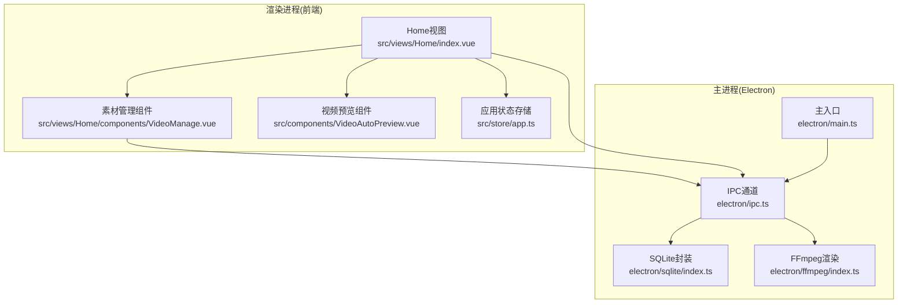
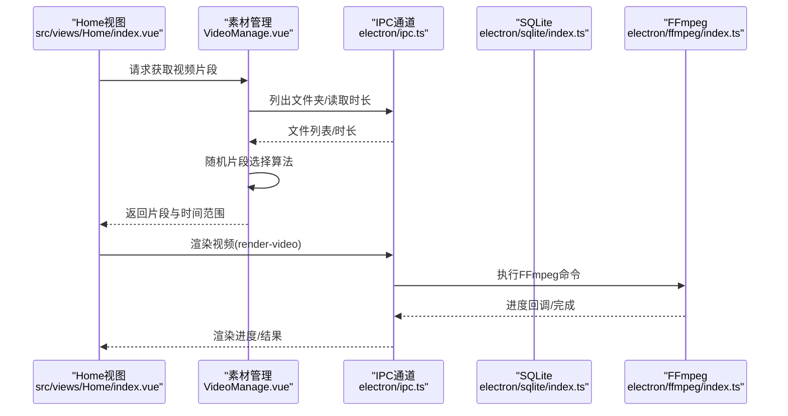
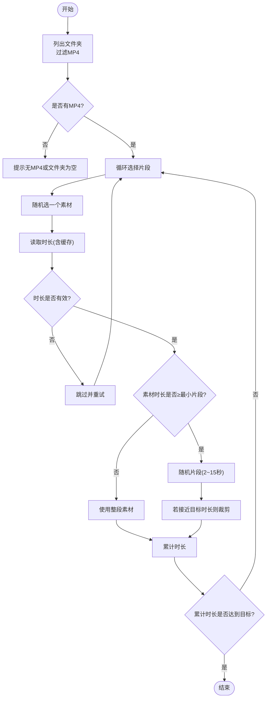
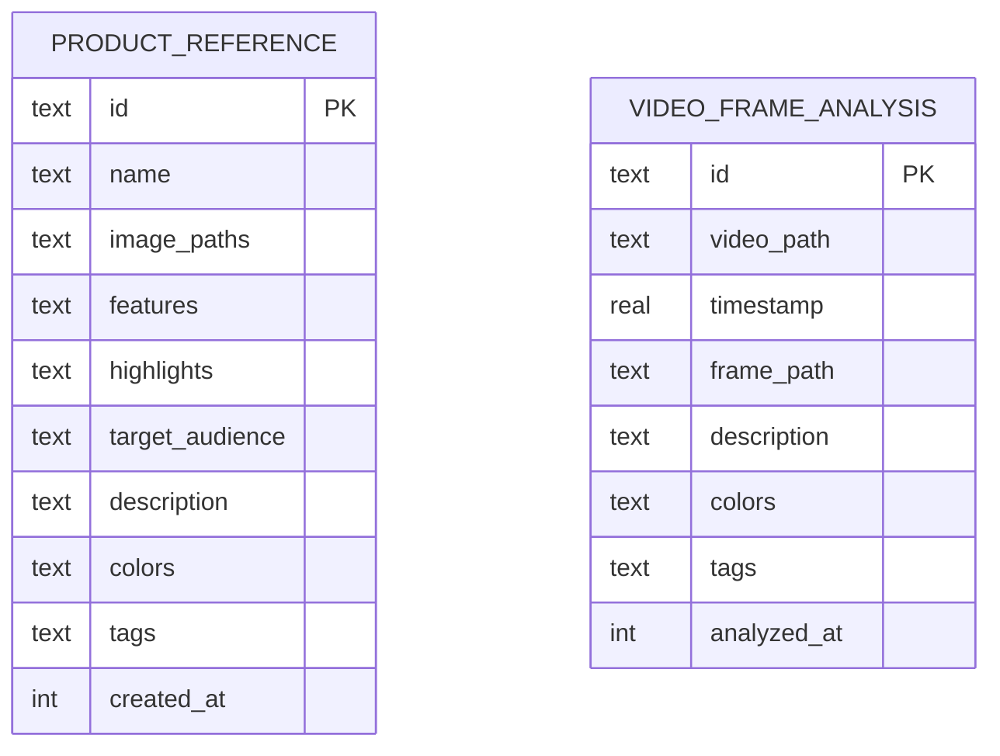
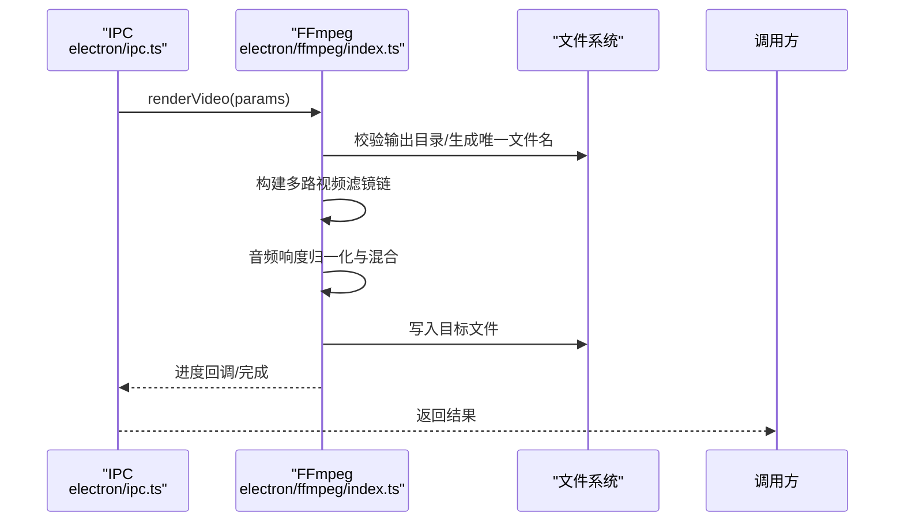
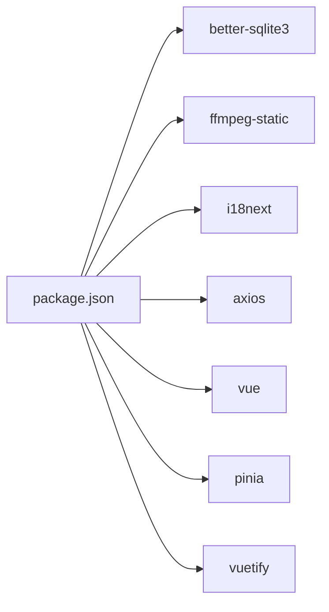

# 视频素材管理系统

<cite>
**本文引用的文件**
- [README.md](file://README.md)
- [package.json](file://package.json)
- [electron/main.ts](file://electron/main.ts)
- [electron/ipc.ts](file://electron/ipc.ts)
- [electron/sqlite/index.ts](file://electron/sqlite/index.ts)
- [electron/sqlite/types.ts](file://electron/sqlite/types.ts)
- [electron/ffmpeg/index.ts](file://electron/ffmpeg/index.ts)
- [electron/ffmpeg/types.ts](file://electron/ffmpeg/types.ts)
- [electron/types.ts](file://electron/types.ts)
- [src/views/Home/index.vue](file://src/views/Home/index.vue)
- [src/views/Home/components/VideoManage.vue](file://src/views/Home/components/VideoManage.vue)
- [src/components/VideoAutoPreview.vue](file://src/components/VideoAutoPreview.vue)
- [src/store/app.ts](file://src/store/app.ts)
- [src/router/index.ts](file://src/router/index.ts)
</cite>

## 目录
1. [简介](#简介)
2. [项目结构](#项目结构)
3. [核心组件](#核心组件)
4. [架构总览](#架构总览)
5. [详细组件分析](#详细组件分析)
6. [依赖关系分析](#依赖关系分析)
7. [性能考量](#性能考量)
8. [故障排查指南](#故障排查指南)
9. [结论](#结论)
10. [附录](#附录)

## 简介
本项目是一个桌面端短视频工厂应用，围绕“MP4视频素材库”的管理与使用展开，提供从素材导入、元数据提取、智能片段选择到最终视频渲染的完整工作流。系统采用 Electron + Vue 3 技术栈，结合 FFmpeg 进行视频处理，SQLite 存储辅助数据，支持批量渲染与多语言。

## 项目结构
项目采用“前端渲染层 + Electron 主进程 + IPC 通信 + 原生能力封装”的分层架构。核心模块包括：
- 主进程入口与菜单初始化
- IPC 通道：文件系统、SQLite、TTS、渲染视频等
- SQLite 数据库：产品参考与视频帧分析表
- FFmpeg 渲染管线：视频拼接、音频混合、字幕叠加、编码导出
- 前端视图与状态管理：素材库浏览、片段选择、渲染控制

图表来源
- [src/views/Home/index.vue:1-244](file://src/views/Home/index.vue#L1-L244)
- [src/views/Home/components/VideoManage.vue:1-308](file://src/views/Home/components/VideoManage.vue#L1-L308)
- [src/components/VideoAutoPreview.vue:1-42](file://src/components/VideoAutoPreview.vue#L1-L42)
- [src/store/app.ts:1-114](file://src/store/app.ts#L1-L114)
- [electron/main.ts:1-204](file://electron/main.ts#L1-L204)
- [electron/ipc.ts:1-188](file://electron/ipc.ts#L1-L188)
- [electron/sqlite/index.ts:1-194](file://electron/sqlite/index.ts#L1-L194)
- [electron/ffmpeg/index.ts:1-272](file://electron/ffmpeg/index.ts#L1-L272)

章节来源
- [src/router/index.ts:1-22](file://src/router/index.ts#L1-L22)
- [electron/main.ts:187-204](file://electron/main.ts#L187-L204)

## 核心组件
- 素材库浏览与片段选择：负责 MP4 素材的导入、筛选、缓存与随机片段抽取。
- SQLite 数据库：提供产品参考与视频帧分析表，支持索引优化与批量写入。
- FFmpeg 渲染：将多个视频片段按时间范围裁剪、缩放、拼接，叠加字幕与音频，导出目标尺寸与码率的视频。
- IPC 通道：封装文件系统读取、SQLite CRUD、TTS、渲染进度与取消信号。
- 应用状态：统一管理渲染状态、输出配置、素材库路径等。

章节来源
- [src/views/Home/components/VideoManage.vue:94-144](file://src/views/Home/components/VideoManage.vue#L94-L144)
- [electron/sqlite/index.ts:144-187](file://electron/sqlite/index.ts#L144-L187)
- [electron/ffmpeg/index.ts:26-186](file://electron/ffmpeg/index.ts#L26-L186)
- [electron/ipc.ts:77-187](file://electron/ipc.ts#L77-L187)
- [src/store/app.ts:5-13](file://src/store/app.ts#L5-L13)

## 架构总览
系统通过 IPC 将前端与主进程解耦，前端负责 UI 与交互，主进程负责文件系统、数据库与媒体处理。渲染流程由 Home 视图协调，依次完成文案生成、语音合成、素材片段选择与最终视频导出。

图表来源
- [src/views/Home/index.vue:65-187](file://src/views/Home/index.vue#L65-L187)
- [src/views/Home/components/VideoManage.vue:196-300](file://src/views/Home/components/VideoManage.vue#L196-L300)
- [electron/ipc.ts:171-186](file://electron/ipc.ts#L171-L186)
- [electron/ffmpeg/index.ts:26-186](file://electron/ffmpeg/index.ts#L26-L186)

## 详细组件分析

### 素材库浏览与片段选择
- 素材导入与筛选：通过 IPC 列出指定文件夹内的文件，过滤出 MP4 后展示为网格卡片。
- 预览播放：使用 HTMLVideoElement 预览素材，鼠标悬停自动播放并循环。
- 元数据提取：利用 video 元数据事件读取时长，带超时与错误处理，同时维护内存缓存。
- 智能片段选择：在目标时长范围内，按最小/最大片段长度限制随机抽取素材片段，动态调整最后片段长度以满足总时长要求。

图表来源
- [src/views/Home/components/VideoManage.vue:94-144](file://src/views/Home/components/VideoManage.vue#L94-L144)
- [src/views/Home/components/VideoManage.vue:146-193](file://src/views/Home/components/VideoManage.vue#L146-L193)
- [src/views/Home/components/VideoManage.vue:196-300](file://src/views/Home/components/VideoManage.vue#L196-L300)

章节来源
- [src/views/Home/components/VideoManage.vue:1-308](file://src/views/Home/components/VideoManage.vue#L1-L308)
- [src/components/VideoAutoPreview.vue:1-42](file://src/components/VideoAutoPreview.vue#L1-L42)

### SQLite 数据库应用
- 数据库位置：位于用户数据目录下的 data.db。
- 表结构设计：
  - 产品参考表：存储产品元信息与标签，便于内容创作关联。
  - 视频帧分析表：记录视频路径、时间戳、帧图路径、描述、颜色与标签，支持按视频路径索引加速查询。
- 索引优化：为视频帧分析表的视频路径字段建立索引，提升按视频检索效率。
- 批量写入：提供按主键冲突更新的批量插入接口，配合事务减少写入开销。

图表来源
- [electron/sqlite/index.ts:149-176](file://electron/sqlite/index.ts#L149-L176)
- [electron/sqlite/index.ts:178-181](file://electron/sqlite/index.ts#L178-L181)

章节来源
- [electron/sqlite/index.ts:1-194](file://electron/sqlite/index.ts#L1-L194)
- [electron/sqlite/types.ts:1-26](file://electron/sqlite/types.ts#L1-L26)

### FFmpeg 渲染管线
- 输入管理：多路视频输入按时间范围裁剪，统一缩放到目标分辨率并填充至目标尺寸；音频输入包括语音与背景音乐。
- 视频滤镜链：trim → setpts → scale → pad → fps → format → concat；最后叠加字幕。
- 音频处理：响度归一化(loudnorm)确保音量一致，按目标时长裁剪并混合，dropout_transition=0 降低切换噪声。
- 编码参数：H.264 + AAC，目标帧率与分辨率，进度输出与统计日志。
- 取消机制：通过 AbortController 与 SIGTERM 实现渲染取消。

图表来源
- [electron/ipc.ts:171-186](file://electron/ipc.ts#L171-L186)
- [electron/ffmpeg/index.ts:26-186](file://electron/ffmpeg/index.ts#L26-L186)
- [electron/ffmpeg/types.ts:7-16](file://electron/ffmpeg/types.ts#L7-L16)

章节来源
- [electron/ffmpeg/index.ts:1-272](file://electron/ffmpeg/index.ts#L1-L272)
- [electron/ffmpeg/types.ts:1-23](file://electron/ffmpeg/types.ts#L1-L23)

### IPC 与文件系统交互
- 文件夹选择：提供默认路径回退策略，优先使用可读路径。
- 文件列表：读取目录项，过滤文件并返回名称与绝对路径。
- SQLite CRUD：提供查询、插入、更新、删除与批量插入/更新接口。
- 统计上报：封装统计事件上报能力。

章节来源
- [electron/ipc.ts:119-155](file://electron/ipc.ts#L119-L155)
- [electron/ipc.ts:77-87](file://electron/ipc.ts#L77-L87)
- [electron/ipc.ts:160-161](file://electron/ipc.ts#L160-L161)

### 渲染编排与状态管理
- 渲染状态机：文案生成、语音合成、片段选择、渲染中、完成、失败。
- Home 视图：串联各阶段，校验输出配置，随机背景音乐，触发渲染并处理异常与复制错误详情。

章节来源
- [src/store/app.ts:5-13](file://src/store/app.ts#L5-L13)
- [src/views/Home/index.vue:65-212](file://src/views/Home/index.vue#L65-L212)

## 依赖关系分析
- 前端依赖：Vue 3、Pinia、Vuetify、i18n 等。
- 主进程依赖：better-sqlite3、ffmpeg-static、i18next、axios 等。
- 构建与打包：Vite、Electron Builder。

图表来源
- [package.json:22-64](file://package.json#L22-L64)

章节来源
- [package.json:1-85](file://package.json#L1-L85)

## 性能考量
- 素材时长缓存：避免重复解析同一素材的元数据，显著降低 I/O 与 DOM 解析成本。
- 索引优化：视频帧分析表按视频路径建立索引，加速按视频检索。
- 批量写入事务：批量插入/更新时使用事务，减少磁盘写入次数。
- FFmpeg 参数：合理设置 CRF、帧率与编码器参数，在质量与体积间取得平衡；响度归一化与混合在保证听感的同时控制文件大小。
- 进度与取消：渲染过程实时反馈进度，支持取消，避免长时间阻塞。

## 故障排查指南
- 素材加载失败：检查文件夹权限与路径有效性，确认存在 MP4 文件；查看错误弹窗并复制详细信息。
- 时长读取失败：浏览器限制导致 file:// 协议访问，确保路径标准化；超时或无效时长会抛错并跳过该素材。
- 渲染失败：核对输出路径是否存在、FFmpeg 可执行文件是否可用；查看 stderr 日志定位问题。
- 取消渲染：通过 IPC 发送取消信号，主进程收到后终止子进程。

章节来源
- [src/views/Home/components/VideoManage.vue:118-140](file://src/views/Home/components/VideoManage.vue#L118-L140)
- [src/views/Home/components/VideoManage.vue:158-193](file://src/views/Home/components/VideoManage.vue#L158-L193)
- [electron/ffmpeg/index.ts:246-259](file://electron/ffmpeg/index.ts#L246-L259)
- [src/views/Home/index.vue:213-238](file://src/views/Home/index.vue#L213-L238)

## 结论
本系统围绕 MP4 素材库实现了从导入、元数据提取到智能片段选择与最终渲染的完整闭环。SQLite 提供了轻量级的数据持久化与索引优化，FFmpeg 实现了高质量的视频处理与导出。通过 IPC 将前端与原生能力解耦，既保证了易用性，也为后续扩展（如内容特征分析、标签管理）提供了良好基础。

## 附录
- 使用场景建议：素材库应集中存放 MP4，确保命名规范与时长可控；渲染前预先配置输出尺寸与路径。
- 扩展方向：可增加视频关键帧抽样、颜色直方图分析、OCR 字幕识别等，进一步提升智能片段选择的准确性与多样性。