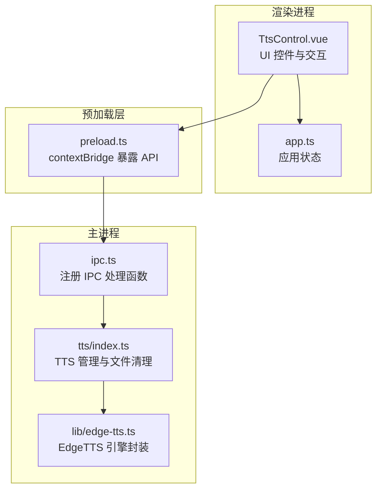
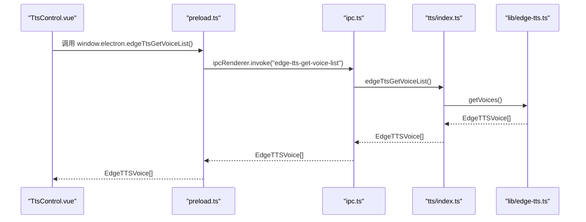
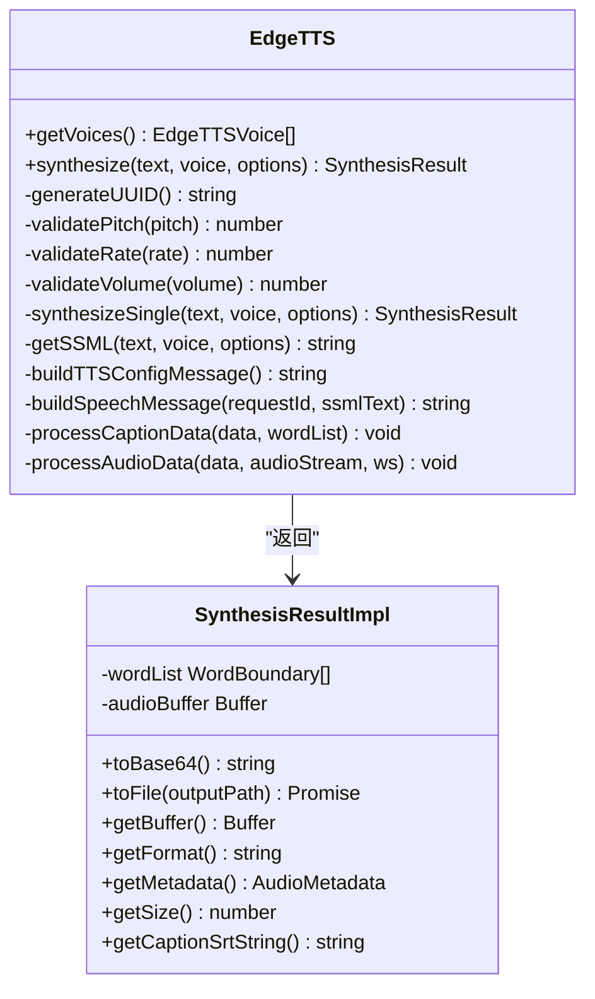
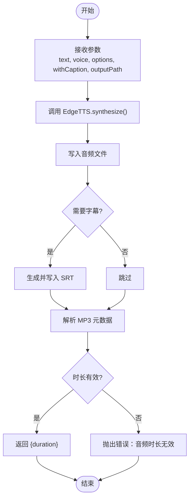
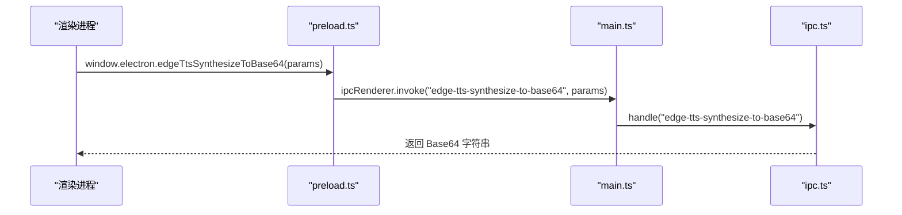
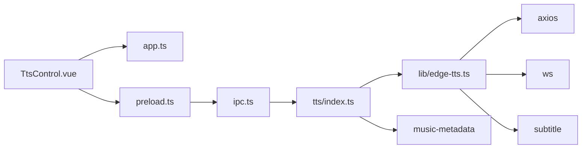

# 语音合成系统

<cite>
**本文档引用的文件**
- [electron/tts/index.ts](file://electron/tts/index.ts)
- [electron/tts/types.ts](file://electron/tts/types.ts)
- [electron/lib/edge-tts.ts](file://electron/lib/edge-tts.ts)
- [src/views/Home/components/TtsControl.vue](file://src/views/Home/components/TtsControl.vue)
- [electron/ipc.ts](file://electron/ipc.ts)
- [electron/preload.ts](file://electron/preload.ts)
- [src/store/app.ts](file://src/store/app.ts)
- [electron/main.ts](file://electron/main.ts)
- [locales/zh-CN/common.json](file://locales/zh-CN/common.json)
- [electron/electron-env.d.ts](file://electron/electron-env.d.ts)
</cite>

## 目录
1. [简介](#简介)
2. [项目结构](#项目结构)
3. [核心组件](#核心组件)
4. [架构总览](#架构总览)
5. [详细组件分析](#详细组件分析)
6. [依赖关系分析](#依赖关系分析)
7. [性能考量](#性能考量)
8. [故障排除指南](#故障排除指南)
9. [结论](#结论)
10. [附录](#附录)

## 简介
本项目为“短视频工厂”应用中的语音合成子系统，基于 EdgeTTS 引擎实现，提供语音列表获取、参数配置、实时试听与文件合成能力。系统采用 Electron 主进程与渲染进程分离的架构，通过 IPC 通道在前端界面与 TTS 引擎之间传递数据；同时提供完整的 UI 控件（语言/性别筛选、语音选择器、语速滑块、试听按钮），并支持字幕生成与音频时长计算，便于后续视频渲染阶段使用。

## 项目结构
语音合成模块主要分布在以下位置：
- Electron 主进程侧：TTS 引擎封装、IPC 注册、临时文件清理
- Electron 预加载脚本：向渲染进程暴露受控 API
- 前端 Vue 组件：TTS 控制面板、参数绑定、交互逻辑
- 应用状态管理：Pinia Store 存储语音列表、语言/性别/语速等配置
- 国际化资源：TTS 相关 UI 文案与错误提示



图表来源
- [src/views/Home/components/TtsControl.vue:1-234](file://src/views/Home/components/TtsControl.vue#L1-L234)
- [src/store/app.ts:1-114](file://src/store/app.ts#L1-L114)
- [electron/preload.ts:1-75](file://electron/preload.ts#L1-L75)
- [electron/ipc.ts:1-188](file://electron/ipc.ts#L1-L188)
- [electron/tts/index.ts:1-86](file://electron/tts/index.ts#L1-L86)
- [electron/lib/edge-tts.ts:1-632](file://electron/lib/edge-tts.ts#L1-L632)

章节来源
- [electron/main.ts:1-204](file://electron/main.ts#L1-L204)
- [electron/preload.ts:1-75](file://electron/preload.ts#L1-L75)
- [electron/ipc.ts:1-188](file://electron/ipc.ts#L1-L188)
- [electron/tts/index.ts:1-86](file://electron/tts/index.ts#L1-L86)
- [electron/lib/edge-tts.ts:1-632](file://electron/lib/edge-tts.ts#L1-L632)
- [src/views/Home/components/TtsControl.vue:1-234](file://src/views/Home/components/TtsControl.vue#L1-L234)
- [src/store/app.ts:1-114](file://src/store/app.ts#L1-L114)

## 核心组件
- EdgeTTS 引擎封装：负责与微软语音服务建立 WebSocket 连接、发送 SSML 请求、接收音频流与词边界元数据、拼接音频并生成 SRT 字幕。
- TTS 管理器：提供语音列表获取、文本转 Base64、文本转文件（含可选字幕）、临时文件清理等高层接口。
- IPC 层：在主进程注册处理函数，供渲染进程通过 invoke/send 调用；在预加载脚本中通过 contextBridge 暴露安全 API。
- UI 控件：语言/性别筛选、语音选择器、语速滑块、试听按钮；支持实时试听与文件合成。
- 应用状态：Pinia Store 统一管理语音列表、语言/性别/语速、试听文本等配置项。

章节来源
- [electron/lib/edge-tts.ts:420-632](file://electron/lib/edge-tts.ts#L420-L632)
- [electron/tts/index.ts:35-86](file://electron/tts/index.ts#L35-L86)
- [electron/ipc.ts:157-170](file://electron/ipc.ts#L157-L170)
- [src/views/Home/components/TtsControl.vue:1-234](file://src/views/Home/components/TtsControl.vue#L1-L234)
- [src/store/app.ts:1-114](file://src/store/app.ts#L1-L114)

## 架构总览
系统采用“渲染进程 UI + 预加载桥接 + 主进程 IPC + 引擎封装”的分层架构。渲染进程通过 preload 暴露的 window.electron 接口发起 IPC 调用，主进程在 ipc.ts 中注册对应处理函数，转发至 tts/index.ts 的管理器，最终由 lib/edge-tts.ts 封装的 EdgeTTS 类完成与微软服务的交互。



图表来源
- [src/views/Home/components/TtsControl.vue:165-193](file://src/views/Home/components/TtsControl.vue#L165-L193)
- [electron/preload.ts:58-58](file://electron/preload.ts#L58-L58)
- [electron/ipc.ts:157-159](file://electron/ipc.ts#L157-L159)
- [electron/tts/index.ts:35-37](file://electron/tts/index.ts#L35-L37)
- [electron/lib/edge-tts.ts:421-439](file://electron/lib/edge-tts.ts#L421-L439)

章节来源
- [electron/main.ts:187-203](file://electron/main.ts#L187-L203)
- [electron/preload.ts:49-65](file://electron/preload.ts#L49-L65)
- [electron/ipc.ts:77-187](file://electron/ipc.ts#L77-L187)
- [electron/tts/index.ts:1-86](file://electron/tts/index.ts#L1-L86)
- [electron/lib/edge-tts.ts:420-632](file://electron/lib/edge-tts.ts#L420-L632)

## 详细组件分析

### EdgeTTS 引擎封装
- 功能要点
  - 语音列表获取：通过 HTTP GET 请求微软语音列表接口，返回标准化的 EdgeTTSVoice 列表。
  - 文本合成：将输入文本按字节长度切分为若干片段，逐段通过 WebSocket 发送 SSML 请求，接收音频流与词边界元数据，最终拼接音频并生成 SRT 字幕。
  - 参数校验：对音高、语速、音量进行范围校验，确保符合 EdgeTTS 的期望值域。
  - 会话管理：生成唯一请求 ID，构造 speech.config 与 ssml 消息，监听 turn.end 关闭连接。
- 数据结构
  - EdgeTTSVoice：包含名称、短名、友好名称、性别、语言、状态、标签与建议编解码器等字段。
  - SynthesisOptions：音高（Hz）、语速（百分比）、音量（百分比）。
  - SynthesisResult：提供 toBase64、toFile、getBuffer、getFormat、getMetadata、getSize、getCaptionSrtString 等方法。
- 错误处理
  - 对不兼容字符进行清洗，避免传输异常。
  - 对 WebSocket 关闭信号进行识别，确保合成结果完整返回。
  - 对音频元数据解析失败与无效时长进行抛错，便于上层捕获与提示。



图表来源
- [electron/lib/edge-tts.ts:420-632](file://electron/lib/edge-tts.ts#L420-L632)
- [electron/lib/edge-tts.ts:313-418](file://electron/lib/edge-tts.ts#L313-L418)

章节来源
- [electron/lib/edge-tts.ts:420-632](file://electron/lib/edge-tts.ts#L420-L632)

### TTS 管理器与文件清理
- 功能要点
  - 语音列表获取：直接委托 EdgeTTS.getVoices。
  - 文本转 Base64：调用 synthesize 并将结果转为 Base64 字符串，便于前端实时试听。
  - 文本转文件：将合成结果写入指定路径，必要时生成 SRT 字幕文件；通过 music-metadata 解析 MP3 元数据获取时长，若时长无效则抛错。
  - 临时文件清理：应用退出前清理当前会话产生的临时音频与字幕文件。
- 输出与异常
  - 文件合成返回 duration（秒），用于后续渲染阶段的时间轴对齐。
  - 对元数据解析失败与无效时长进行明确错误提示。



图表来源
- [electron/tts/index.ts:45-85](file://electron/tts/index.ts#L45-L85)

章节来源
- [electron/tts/index.ts:1-86](file://electron/tts/index.ts#L1-L86)

### IPC 与预加载桥接
- 预加载层
  - 通过 contextBridge.exposeInMainWorld 暴露 window.ipcRenderer 与 window.electron，限定可用 API，避免直接访问 Electron 内核。
  - window.electron 暴露 edgeTtsGetVoiceList、edgeTtsSynthesizeToBase64、edgeTtsSynthesizeToFile 等方法。
- 主进程 IPC
  - 注册 handle('edge-tts-get-voice-list')、('edge-tts-synthesize-to-base64')、('edge-tts-synthesize-to-file') 等处理函数，转发到 tts/index.ts。
  - 注册渲染进度回调通道（渲染视频场景），并在取消时通过 AbortController 中断。



图表来源
- [electron/preload.ts:59-60](file://electron/preload.ts#L59-L60)
- [electron/ipc.ts:163-166](file://electron/ipc.ts#L163-L166)
- [electron/tts/index.ts:39-43](file://electron/tts/index.ts#L39-L43)

章节来源
- [electron/preload.ts:1-75](file://electron/preload.ts#L1-L75)
- [electron/ipc.ts:1-188](file://electron/ipc.ts#L1-L188)
- [electron/main.ts:187-203](file://electron/main.ts#L187-L203)

### TTS 控制组件（UI）
- 控件与行为
  - 语言选择：联动过滤语音列表。
  - 性别选择：联动过滤语音列表。
  - 语音选择：根据语言与性别筛选，显示 FriendlyName。
  - 语速滑块：提供慢/中/快三档，映射为 -30/0/30。
  - 试听文本：默认文案，支持修改。
  - 试听按钮：调用 window.electron.edgeTtsSynthesizeToBase64，播放 data:audio/mp3;base64 流。
- 状态与校验
  - 未选择语音或试听文本为空时给出警告提示。
  - 试听过程中自动释放上一次播放的音频对象。
  - 语音列表获取失败时弹出错误提示并支持复制错误详情。

```mermaid
sequenceDiagram
participant UI as "TtsControl.vue"
participant Store as "app.ts"
participant Preload as "preload.ts"
participant IPC as "ipc.ts"
participant TTS as "tts/index.ts"
UI->>Store : 更新 language/gender/voice/speed
UI->>Preload : window.electron.edgeTtsSynthesizeToBase64({text, voice.ShortName, options : {rate}})
Preload->>IPC : invoke("edge-tts-synthesize-to-base64")
IPC->>TTS : edgeTtsSynthesizeToBase64(params)
TTS-->>IPC : Base64
IPC-->>Preload : Base64
Preload-->>UI : Base64
UI->>UI : new Audio("data : audio/mp3;base64,...").play()
```

图表来源
- [src/views/Home/components/TtsControl.vue:91-138](file://src/views/Home/components/TtsControl.vue#L91-L138)
- [src/store/app.ts:57-61](file://src/store/app.ts#L57-L61)
- [electron/preload.ts:59-60](file://electron/preload.ts#L59-L60)
- [electron/ipc.ts:163-166](file://electron/ipc.ts#L163-L166)
- [electron/tts/index.ts:39-43](file://electron/tts/index.ts#L39-L43)

章节来源
- [src/views/Home/components/TtsControl.vue:1-234](file://src/views/Home/components/TtsControl.vue#L1-L234)
- [src/store/app.ts:1-114](file://src/store/app.ts#L1-L114)

### 参数调节机制
- 语言选择：从原始语音列表中提取语言标识，用于筛选匹配的语音。
- 性别设置：支持 Male/Female，与语音列表的 Gender 字段匹配。
- 语速控制：通过 SynthesisOptions.rate 设置，范围为 -100 到 100（百分比），UI 提供慢/中/快三档映射。
- 音量与音高：SynthesisOptions 支持 volume/pitch，分别控制音量与音高，范围均为 -100 到 100。
- 语音选择：使用 Voice.ShortName 作为实际合成参数，FriendlyName 用于 UI 展示。

章节来源
- [electron/lib/edge-tts.ts:82-86](file://electron/lib/edge-tts.ts#L82-L86)
- [src/views/Home/components/TtsControl.vue:143-163](file://src/views/Home/components/TtsControl.vue#L143-L163)
- [src/store/app.ts:47-61](file://src/store/app.ts#L47-L61)

### 实时试听与文件合成 API
- 实时试听
  - 调用 window.electron.edgeTtsSynthesizeToBase64，传入 text、voice.ShortName、options.rate。
  - 将返回的 Base64 字符串封装为 data:audio/mp3;base64 播放。
- 文件合成
  - 调用 window.electron.edgeTtsSynthesizeToFile，传入 text、voice.ShortName、options.rate、withCaption。
  - 返回 duration（秒），用于时间轴对齐与渲染阶段使用。
- 语音列表
  - 调用 window.electron.edgeTtsGetVoiceList，初始化 UI 语音选择器。

章节来源
- [src/views/Home/components/TtsControl.vue:102-108](file://src/views/Home/components/TtsControl.vue#L102-L108)
- [src/views/Home/components/TtsControl.vue:213-220](file://src/views/Home/components/TtsControl.vue#L213-L220)
- [src/views/Home/components/TtsControl.vue:167-167](file://src/views/Home/components/TtsControl.vue#L167-L167)
- [electron/tts/types.ts:3-12](file://electron/tts/types.ts#L3-L12)

## 依赖关系分析
- 组件耦合
  - TtsControl.vue 依赖 Pinia Store 与国际化资源，间接依赖 preload 暴露的 window.electron。
  - preload 仅暴露有限 API，降低渲染进程对 Electron 内核的直接依赖。
  - ipc.ts 作为主进程统一入口，集中处理 IPC 请求，避免业务分散。
  - tts/index.ts 作为门面，封装 lib/edge-tts.ts 的复杂细节，提供稳定接口。
- 外部依赖
  - axios：HTTP 请求语音列表与元数据解析。
  - ws：WebSocket 与微软语音服务通信。
  - music-metadata：解析 MP3 元数据获取时长。
  - subtitle：生成 SRT 字幕。
- 可能的循环依赖
  - 当前模块间为单向依赖（UI -> 预加载 -> 主进程 -> 管理器 -> 引擎），未发现循环。



图表来源
- [src/views/Home/components/TtsControl.vue:1-234](file://src/views/Home/components/TtsControl.vue#L1-L234)
- [src/store/app.ts:1-114](file://src/store/app.ts#L1-L114)
- [electron/preload.ts:1-75](file://electron/preload.ts#L1-L75)
- [electron/ipc.ts:1-188](file://electron/ipc.ts#L1-L188)
- [electron/tts/index.ts:1-86](file://electron/tts/index.ts#L1-L86)
- [electron/lib/edge-tts.ts:1-632](file://electron/lib/edge-tts.ts#L1-L632)

章节来源
- [electron/lib/edge-tts.ts:1-632](file://electron/lib/edge-tts.ts#L1-L632)
- [electron/tts/index.ts:1-86](file://electron/tts/index.ts#L1-L86)
- [electron/ipc.ts:1-188](file://electron/ipc.ts#L1-L188)

## 性能考量
- 文本切分策略
  - 将长文本按固定字节上限切分，避免一次性发送超长 SSML 导致连接不稳定。
- 音频拼接与偏移补偿
  - 多段合成时进行偏移补偿，减少拼接处的停顿感。
- 元数据解析
  - 使用明确 MIME（audio/mpeg）解析 MP3 时长，避免自动检测失败。
- 网络与协议
  - 使用 WebSocket 与微软语音服务通信，结合 Sec-MS-GEC 令牌与可信客户端 Token，提高稳定性。
- UI 响应
  - 试听按钮使用 loading 状态，避免重复触发；播放前释放上一个音频对象，防止内存泄漏。

章节来源
- [electron/lib/edge-tts.ts:199-234](file://electron/lib/edge-tts.ts#L199-L234)
- [electron/lib/edge-tts.ts:493-501](file://electron/lib/edge-tts.ts#L493-L501)
- [electron/tts/index.ts:70-76](file://electron/tts/index.ts#L70-L76)

## 故障排除指南
- 语音列表获取失败
  - 现象：弹出“获取EdgeTTS语音列表失败，请检查网络”提示。
  - 排查：检查网络连通性、代理设置；确认未被防火墙拦截。
- 试听语音合成失败
  - 现象：弹出“试听语音合成失败，请检查网络”提示。
  - 排查：确认网络可达、EdgeTTS 服务可用；检查请求参数（voice、rate）是否合法。
- 语音合成失败或音频损坏
  - 现象：弹出“语音合成失败”或“音频文件损坏”提示。
  - 排查：检查输出路径权限、磁盘空间；确认 withCaption 与 outputPath 配置正确。
- 音频时长为0或无效
  - 现象：抛出“音频时长无效，请检查TTS配置或网络连接”。
  - 排查：检查 TTS 配置（rate/pitch/volume）、网络状况；确认返回的音频数据非空。
- UI 交互问题
  - 现象：未选择语音或试听文本为空导致警告。
  - 排查：确保先选择语言与性别，再选择语音；试听文本不可为空。

章节来源
- [src/views/Home/components/TtsControl.vue:169-192](file://src/views/Home/components/TtsControl.vue#L169-L192)
- [src/views/Home/components/TtsControl.vue:112-137](file://src/views/Home/components/TtsControl.vue#L112-L137)
- [electron/tts/index.ts:74-80](file://electron/tts/index.ts#L74-L80)
- [locales/zh-CN/common.json:114-124](file://locales/zh-CN/common.json#L114-L124)

## 结论
该语音合成系统以 EdgeTTS 为核心，通过清晰的分层架构实现了从 UI 控件到主进程 IPC、再到引擎封装的完整链路。系统提供了完善的参数调节能力（语言、性别、语速、音量、音高）、实时试听与文件合成，并具备字幕生成与时长计算能力，满足短视频渲染阶段的时序对齐需求。通过严格的参数校验、错误处理与性能优化策略，系统在易用性与稳定性之间取得了良好平衡。

## 附录
- 国际化文案
  - TTS 相关文案集中在 locales/zh-CN/common.json 的 features.tts 节点，涵盖配置项、错误提示与信息提示。
- 类型定义
  - EdgeTtsSynthesizeCommonParams/EdgeTtsSynthesizeToFileParams/EdgeTtsSynthesizeToFileResult 定义了合成接口的输入输出规范。
- 环境声明
  - electron/electron-env.d.ts 声明了 window.electron 的类型，确保 TS 在渲染进程中的类型安全。

章节来源
- [locales/zh-CN/common.json:97-125](file://locales/zh-CN/common.json#L97-L125)
- [electron/tts/types.ts:1-20](file://electron/tts/types.ts#L1-L20)
- [electron/electron-env.d.ts:24-54](file://electron/electron-env.d.ts#L24-L54)