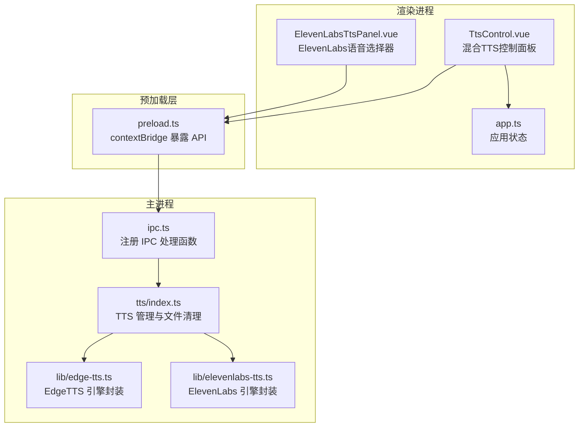
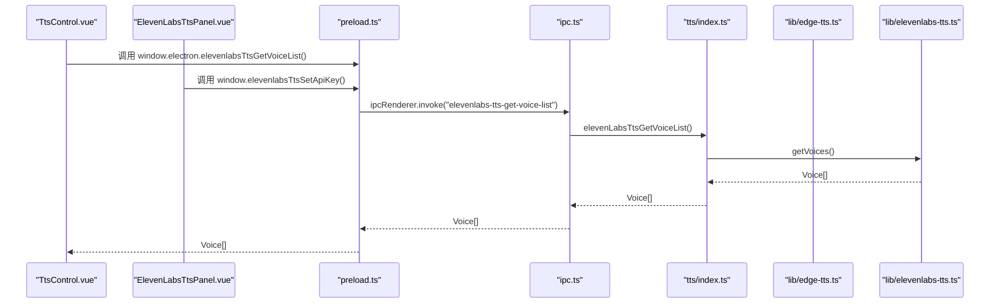
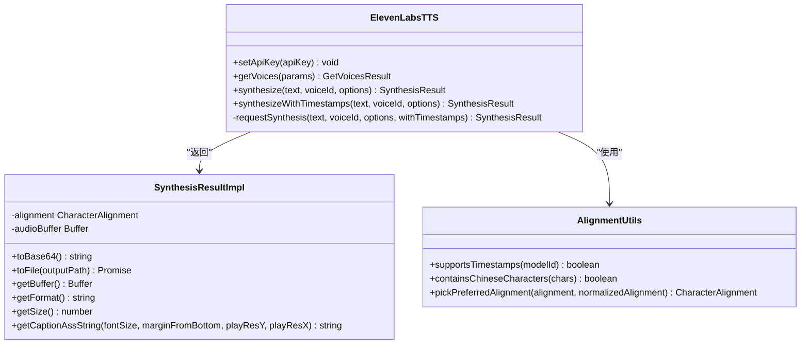
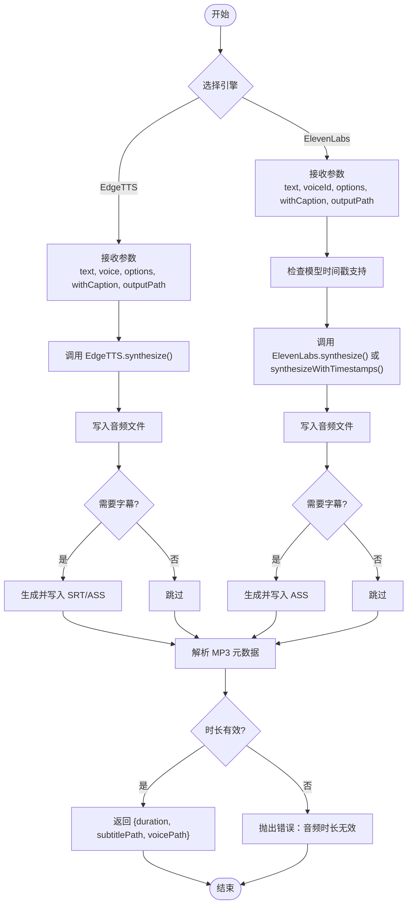
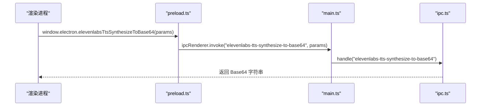
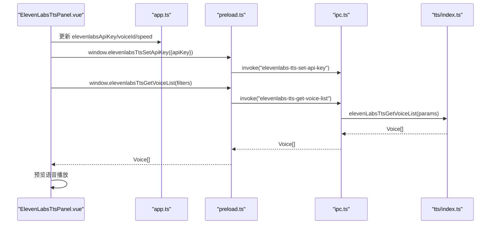
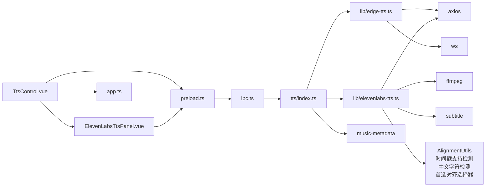

# 语音合成系统

<cite>
**本文档引用的文件**
- [electron/tts/index.ts](file://electron/tts/index.ts)
- [electron/tts/types.ts](file://electron/tts/types.ts)
- [electron/lib/edge-tts.ts](file://electron/lib/edge-tts.ts)
- [electron/lib/elevenlabs-tts.ts](file://electron/lib/elevenlabs-tts.ts)
- [src/views/Home/components/TtsControl.vue](file://src/views/Home/components/TtsControl.vue)
- [src/components/tts/ElevenLabsTtsPanel.vue](file://src/components/tts/ElevenLabsTtsPanel.vue)
- [electron/ipc.ts](file://electron/ipc.ts)
- [electron/preload.ts](file://electron/preload.ts)
- [src/store/app.ts](file://src/store/app.ts)
- [electron/main.ts](file://electron/main.ts)
- [locales/zh-CN/common.json](file://locales/zh-CN/common.json)
- [electron/electron-env.d.ts](file://electron/electron-env.d.ts)
</cite>

## 更新摘要
**变更内容**
- 新增ElevenLabs时间戳支持检测功能，区分可返回时间戳和不可返回时间戳的模型
- 新增ElevenLabs中文字符检测功能，优化中文语音的对齐选择
- 新增ElevenLabs首选对齐选择器，根据中文字符自动选择最佳对齐方案
- Edge TTS增强句子边界检测和字幕格式化，支持更精确的字幕生成
- 更新ElevenLabs模型兼容性检查，确保字幕功能的正确使用

## 目录
1. [简介](#简介)
2. [项目结构](#项目结构)
3. [核心组件](#核心组件)
4. [架构总览](#架构总览)
5. [详细组件分析](#详细组件分析)
6. [依赖关系分析](#依赖关系分析)
7. [性能考量](#性能考量)
8. [故障排除指南](#故障排除指南)
9. [结论](#结论)
10. [附录](#附录)

## 简介
本项目为"短视频工厂"应用中的语音合成子系统，现已升级为混合语音合成系统，集成了EdgeTTS和ElevenLabs两大语音合成引擎。系统提供语音列表获取、参数配置、实时试听与文件合成能力，支持两种不同的语音合成技术路线。采用Electron主进程与渲染进程分离的架构，通过IPC通道在前端界面与TTS引擎之间传递数据；同时提供完整的UI控件（语言/性别筛选、语音选择器、语速滑块、试听按钮），并支持字幕生成与音频时长计算，便于后续视频渲染阶段使用。

**更新** 新增ElevenLabs时间戳支持检测、中文字符检测和首选对齐选择器功能，以及Edge TTS增强的句子边界检测和字幕格式化能力。

## 项目结构
语音合成模块主要分布在以下位置：
- Electron主进程侧：TTS引擎封装、IPC注册、临时文件清理
- Electron预加载脚本：向渲染进程暴露受控API
- 前端Vue组件：TTS控制面板、ElevenLabs语音选择器、参数绑定、交互逻辑
- 应用状态管理：Pinia Store存储语音列表、语言/性别/语速等配置
- 国际化资源：TTS相关UI文案与错误提示



**图表来源**
- [src/views/Home/components/TtsControl.vue:1-442](file://src/views/Home/components/TtsControl.vue#L1-L442)
- [src/components/tts/ElevenLabsTtsPanel.vue:1-521](file://src/components/tts/ElevenLabsTtsPanel.vue#L1-L521)
- [src/store/app.ts:1-151](file://src/store/app.ts#L1-L151)
- [electron/preload.ts:1-127](file://electron/preload.ts#L1-L127)
- [electron/ipc.ts:1-352](file://electron/ipc.ts#L1-L352)
- [electron/tts/index.ts:1-218](file://electron/tts/index.ts#L1-L218)
- [electron/lib/edge-tts.ts:1-738](file://electron/lib/edge-tts.ts#L1-L738)
- [electron/lib/elevenlabs-tts.ts:1-394](file://electron/lib/elevenlabs-tts.ts#L1-L394)

**章节来源**
- [electron/main.ts:1-204](file://electron/main.ts#L1-L204)
- [electron/preload.ts:1-127](file://electron/preload.ts#L1-L127)
- [electron/ipc.ts:1-352](file://electron/ipc.ts#L1-L352)
- [electron/tts/index.ts:1-218](file://electron/tts/index.ts#L1-L218)
- [electron/lib/edge-tts.ts:1-738](file://electron/lib/edge-tts.ts#L1-L738)
- [electron/lib/elevenlabs-tts.ts:1-394](file://electron/lib/elevenlabs-tts.ts#L1-L394)
- [src/views/Home/components/TtsControl.vue:1-442](file://src/views/Home/components/TtsControl.vue#L1-L442)
- [src/components/tts/ElevenLabsTtsPanel.vue:1-521](file://src/components/tts/ElevenLabsTtsPanel.vue#L1-L521)
- [src/store/app.ts:1-151](file://src/store/app.ts#L1-L151)

## 核心组件
- **EdgeTTS引擎封装**：负责与微软语音服务建立WebSocket连接、发送SSML请求、接收音频流与词边界元数据、拼接音频并生成SRT/ASS字幕。**更新** 增强句子边界检测算法，支持更精确的字幕生成。
- **ElevenLabs引擎封装**：负责与ElevenLabs API交互，支持多模型选择、高级参数配置（稳定性、相似度、风格等）、实时语音合成与字幕生成。**更新** 新增时间戳支持检测、中文字符检测和首选对齐选择器功能。
- **混合TTS管理器**：提供统一的语音列表获取、文本转Base64、文本转文件（含可选字幕）等高层接口，支持两个引擎的无缝切换。
- **IPC层**：在主进程注册处理函数，供渲染进程通过invoke/send调用；在预加载脚本中通过contextBridge暴露安全API。
- **UI控件**：ElevenLabs语音选择器（支持搜索、筛选、实时预览）、语速滑块、试听按钮；支持实时试听与文件合成。
- **应用状态**：Pinia Store统一管理语音列表、语言/性别/语速、试听文本等配置项，支持双引擎配置分离。

**章节来源**
- [electron/lib/edge-tts.ts:378-524](file://electron/lib/edge-tts.ts#L378-L524)
- [electron/lib/elevenlabs-tts.ts:63-84](file://electron/lib/elevenlabs-tts.ts#L63-L84)
- [electron/tts/index.ts:148-218](file://electron/tts/index.ts#L148-L218)
- [electron/ipc.ts:191-209](file://electron/ipc.ts#L191-L209)
- [src/views/Home/components/TtsControl.vue:20-442](file://src/views/Home/components/TtsControl.vue#L20-L442)
- [src/components/tts/ElevenLabsTtsPanel.vue:1-521](file://src/components/tts/ElevenLabsTtsPanel.vue#L1-L521)
- [src/store/app.ts:45-61](file://src/store/app.ts#L45-L61)

## 架构总览
系统采用"渲染进程 UI + 预加载桥接 + 主进程 IPC + 引擎封装"的分层架构。渲染进程通过preload暴露的window.electron接口发起IPC调用，主进程在ipc.ts中注册对应处理函数，转发至tts/index.ts的管理器，最终由对应的引擎封装类完成与服务提供商的交互。



**图表来源**
- [src/views/Home/components/TtsControl.vue:169-184](file://src/views/Home/components/TtsControl.vue#L169-L184)
- [src/components/tts/ElevenLabsTtsPanel.vue:278-294](file://src/components/tts/ElevenLabsTtsPanel.vue#L278-L294)
- [electron/preload.ts:70-79](file://electron/preload.ts#L70-L79)
- [electron/ipc.ts:196-199](file://electron/ipc.ts#L196-L199)
- [electron/tts/index.ts:153-155](file://electron/tts/index.ts#L153-L155)
- [electron/lib/elevenlabs-tts.ts:213-238](file://electron/lib/elevenlabs-tts.ts#L213-L238)

**章节来源**
- [electron/main.ts:187-203](file://electron/main.ts#L187-L203)
- [electron/preload.ts:50-117](file://electron/preload.ts#L50-L117)
- [electron/ipc.ts:98-352](file://electron/ipc.ts#L98-L352)
- [electron/tts/index.ts:1-218](file://electron/tts/index.ts#L1-L218)
- [electron/lib/edge-tts.ts:420-738](file://electron/lib/edge-tts.ts#L420-L738)
- [electron/lib/elevenlabs-tts.ts:201-394](file://electron/lib/elevenlabs-tts.ts#L201-L394)

## 详细组件分析

### ElevenLabs TTS引擎封装
- **功能要点**
  - 语音列表获取：通过HTTP GET请求ElevenLabs共享语音接口，支持按语言、性别、类别、年龄筛选，返回标准化的Voice列表。
  - 文本合成：将输入文本发送到ElevenLabs API，支持多种模型（eleven_v2、eleven_v3、eleven_multilingual_v2、eleven_flash_v2_5），可选带时间戳的合成。
  - 高级参数配置：支持stability（稳定性）、similarity_boost（相似度）、style（风格）、speaker_boost等参数，提供更精细的语音控制。
  - 字幕生成：支持生成ASS格式字幕，精确控制字符级别的时序信息。
  - **新增** 时间戳支持检测：通过supportsTimestamps函数检测模型是否支持时间戳字幕生成。
  - **新增** 中文字符检测：通过containsChineseCharacters函数检测文本中的中文字符，优化对齐选择。
  - **新增** 首选对齐选择器：通过pickPreferredAlignment函数根据中文字符情况选择最佳对齐方案。
  - 错误处理：完善的API错误处理，包括网络超时、认证失败、余额不足等情况。
- **数据结构**
  - Voice：包含voice_id、name、description、labels、category、settings等字段。
  - SynthesisOptions：包含modelId、speed、stability、similarity_boost、style、speaker_boost等高级参数。
  - SynthesisResult：提供toBase64、toFile、getBuffer、getFormat、getSize、getCaptionAssString等方法。
  - CharacterAlignment：包含characters、character_start_times_seconds、character_end_times_seconds、character_start_times_ms、character_end_times_ms等字段。
- **模型支持**
  - eleven_v3：表现力最强，支持70+语言，**不支持时间戳字幕**，适合精细调优。
  - eleven_multilingual_v2：多语言模型，中文表现稳定，**支持时间戳字幕**。
  - eleven_flash_v2_5：低延迟模型，适合对话场景，**支持时间戳字幕**。

**更新** 新增时间戳支持检测、中文字符检测和首选对齐选择器功能，显著提升了ElevenLabs字幕生成的准确性和智能化程度。



**图表来源**
- [electron/lib/elevenlabs-tts.ts:63-84](file://electron/lib/elevenlabs-tts.ts#L63-L84)
- [electron/lib/elevenlabs-tts.ts:94-222](file://electron/lib/elevenlabs-tts.ts#L94-L222)
- [electron/lib/elevenlabs-tts.ts:224-394](file://electron/lib/elevenlabs-tts.ts#L224-L394)

**章节来源**
- [electron/lib/elevenlabs-tts.ts:63-84](file://electron/lib/elevenlabs-tts.ts#L63-L84)
- [electron/lib/elevenlabs-tts.ts:94-222](file://electron/lib/elevenlabs-tts.ts#L94-L222)
- [electron/lib/elevenlabs-tts.ts:224-394](file://electron/lib/elevenlabs-tts.ts#L224-L394)

### 混合TTS管理器与文件清理
- **功能要点**
  - 双引擎支持：同时管理EdgeTTS和ElevenLabs两个引擎，提供统一的接口调用。
  - 语音列表获取：分别委托各引擎的getVoices方法，支持参数过滤。
  - 文本转Base64：调用对应引擎的synthesize方法并将结果转为Base64字符串。
  - 文本转文件：将合成结果写入指定路径，必要时生成ASS字幕文件；ElevenLabs使用ffmpeg探测准确时长。
  - 临时文件清理：应用退出前清理当前会话产生的临时音频与字幕文件。
  - **新增** 模型兼容性检查：在ElevenLabs合成前检查模型是否支持时间戳字幕功能。
- **输出与异常**
  - 文件合成返回duration（秒），ElevenLabs使用ffmpeg探测确保准确性。
  - 对元数据解析失败与无效时长进行明确错误提示。
  - **新增** 模型不支持时间戳字幕时抛出明确错误提示。

**更新** 新增ElevenLabs模型兼容性检查功能，确保字幕功能的正确使用。



**图表来源**
- [electron/tts/index.ts:148-218](file://electron/tts/index.ts#L148-L218)

**章节来源**
- [electron/tts/index.ts:148-218](file://electron/tts/index.ts#L148-L218)

### IPC与预加载桥接
- **预加载层**
  - 通过contextBridge.exposeInMainWorld暴露window.ipcRenderer与window.electron，限定可用API，避免直接访问Electron内核。
  - window.electron暴露edgeTts系列和elevenlabsTts系列方法，包括API Key设置、语音列表获取、语音合成等。
- **主进程IPC**
  - 注册handle('elevenlabs-tts-set-api-key')、('elevenlabs-tts-get-voice-list')、('elevenlabs-tts-synthesize-to-base64')、('elevenlabs-tts-synthesize-to-file')等处理函数。
  - 注册渲染进度回调通道（渲染视频场景），并在取消时通过AbortController中断。



**图表来源**
- [electron/preload.ts:76-79](file://electron/preload.ts#L76-L79)
- [electron/ipc.ts:202-204](file://electron/ipc.ts#L202-L204)
- [electron/tts/index.ts:157-161](file://electron/tts/index.ts#L157-L161)

**章节来源**
- [electron/preload.ts:1-127](file://electron/preload.ts#L1-L127)
- [electron/ipc.ts:1-352](file://electron/ipc.ts#L1-L352)
- [electron/main.ts:187-203](file://electron/main.ts#L187-L203)

### ElevenLabs TTS控制组件（UI）
- **控件与行为**
  - 语音选择器：支持搜索、性别、类别、年龄、语言等多维筛选，实时预览语音效果。
  - 语速控制：提供慢/中/快三档，映射为0.8/1.0/1.2倍速。
  - API密钥配置：支持动态设置ElevenLabs API Key，自动拉取语音列表。
  - 实时预览：点击语音行的播放按钮可预览该语音的发音效果。
  - 语音卡片：显示语音头像、名称、描述、标签等信息。
  - **新增** 模型兼容性提示：根据模型支持情况显示相应的兼容性提示。
- **状态与校验**
  - API Key为空时禁用语音列表获取功能。
  - 语音选择后自动关闭对话框，支持键盘导航。
  - 预览音频自动释放，避免内存泄漏。
  - **新增** 字幕兼容性检查：根据模型支持情况动态调整字幕功能。

**更新** 新增模型兼容性提示和字幕兼容性检查功能，提升用户体验。



**图表来源**
- [src/components/tts/ElevenLabsTtsPanel.vue:268-294](file://src/components/tts/ElevenLabsTtsPanel.vue#L268-L294)
- [src/store/app.ts:45-61](file://src/store/app.ts#L45-L61)
- [electron/preload.ts:70-79](file://electron/preload.ts#L70-L79)
- [electron/ipc.ts:196-199](file://electron/ipc.ts#L196-L199)
- [electron/tts/index.ts:153-155](file://electron/tts/index.ts#L153-L155)

**章节来源**
- [src/components/tts/ElevenLabsTtsPanel.vue:1-521](file://src/components/tts/ElevenLabsTtsPanel.vue#L1-L521)
- [src/store/app.ts:45-61](file://src/store/app.ts#L45-L61)

### TTS控制组件（混合模式）
- **控件与行为**
  - 模型选择：支持ElevenV3、多语言V2、Flash V2.5三种模型，每种模型有不同的特性标签。
  - API配置：支持动态设置ElevenLabs API Key，自动验证并拉取语音列表。
  - 试听功能：调用window.electron.elevenlabsTtsSynthesizeToBase64，播放data:audio/mp3;base64流。
  - 配置对话框：提供模型选择、API Key配置、语音列表管理等功能。
  - **新增** 模型兼容性检查：在合成前检查模型是否支持时间戳字幕功能。
- **状态与校验**
  - API Key验证：必填项，为空时显示警告提示。
  - 语音选择验证：必须选择有效的语音ID。
  - 试听文本验证：不能为空，支持自定义试听内容。
  - **新增** 字幕兼容性验证：根据模型支持情况动态启用/禁用字幕功能。

**更新** 新增模型兼容性检查和字幕兼容性验证功能，确保功能使用的正确性。

```mermaid
sequenceDiagram
participant UI as "TtsControl.vue"
participant Store as "app.ts"
participant Preload as "preload.ts"
participant IPC as "ipc.ts"
participant TTS as "tts/index.ts"
UI->>Store : 更新 elevenlabsApiKey/modelId/voiceId/speed
UI->>Preload : window.electron.elevenlabsTtsSetApiKey({apiKey})
Preload->>IPC : invoke("elevenlabs-tts-set-api-key")
UI->>Preload : window.electron.elevenlabsTtsSynthesizeToBase64({text, voiceId, options})
Preload->>IPC : invoke("elevenlabs-tts-synthesize-to-base64")
IPC->>TTS : elevenLabsTtsSynthesizeToBase64(params)
TTS-->>IPC : Base64
IPC-->>Preload : Base64
Preload-->>UI : Base64
UI->>UI : new Audio("data : audio/mp3;base64,...").play()
```

**图表来源**
- [src/views/Home/components/TtsControl.vue:169-175](file://src/views/Home/components/TtsControl.vue#L169-L175)
- [src/views/Home/components/TtsControl.vue:225-234](file://src/views/Home/components/TtsControl.vue#L225-L234)
- [src/store/app.ts:45-61](file://src/store/app.ts#L45-L61)
- [electron/preload.ts:70-79](file://electron/preload.ts#L70-L79)
- [electron/ipc.ts:202-204](file://electron/ipc.ts#L202-L204)
- [electron/tts/index.ts:157-161](file://electron/tts/index.ts#L157-L161)

**章节来源**
- [src/views/Home/components/TtsControl.vue:1-442](file://src/views/Home/components/TtsControl.vue#L1-L442)
- [src/store/app.ts:45-61](file://src/store/app.ts#L45-L61)

### 参数调节机制
- **ElevenLabs参数**
  - API Key：ElevenLabs账户的访问密钥，必填项。
  - 模型选择：支持eleven_v3、eleven_multilingual_v2、eleven_flash_v2_5三种模型。
  - 语速控制：0.5-2.0范围，UI提供慢/中/快三档映射。
  - 高级参数：stability（0.0-1.0）、similarity_boost（0.0-1.0）、style（0.0-1.0）、speaker_boost等。
  - **新增** 模型兼容性：eleven_v3不支持时间戳字幕，eleven_multilingual_v2和eleven_flash_v2_5支持时间戳字幕。
- **EdgeTTS参数**
  - 语言选择：从原始语音列表中提取语言标识，用于筛选匹配的语音。
  - 性别设置：支持Male/Female/Neutral，与语音列表的Gender字段匹配。
  - 语速控制：通过SynthesisOptions.rate设置，范围为-100到100（百分比）。
  - 音量与音高：SynthesisOptions支持volume/pitch，范围均为-100到100。
- **语音选择**
  - EdgeTTS：使用Voice.ShortName作为实际合成参数。
  - ElevenLabs：使用Voice.voice_id作为实际合成参数，FriendlyName用于UI展示。

**更新** 新增ElevenLabs模型兼容性检查功能，确保字幕功能的正确使用。

**章节来源**
- [electron/lib/elevenlabs-tts.ts:4-19](file://electron/lib/elevenlabs-tts.ts#L4-L19)
- [electron/lib/edge-tts.ts:82-86](file://electron/lib/edge-tts.ts#L82-L86)
- [src/views/Home/components/TtsControl.vue:125-147](file://src/views/Home/components/TtsControl.vue#L125-L147)
- [src/store/app.ts:45-61](file://src/store/app.ts#L45-L61)

### 实时试听与文件合成 API
- **实时试听**
  - ElevenLabs：调用window.electron.elevenlabsTtsSynthesizeToBase64，传入text、voiceId、options。
  - EdgeTTS：调用window.electron.edgeTtsSynthesizeToBase64，传入text、voice、options。
  - 将返回的Base64字符串封装为data:audio/mp3;base64播放。
- **文件合成**
  - ElevenLabs：调用window.electron.elevenlabsTtsSynthesizeToFile，传入text、voiceId、options、withCaption。
  - EdgeTTS：调用window.electron.edgeTtsSynthesizeToFile，传入text、voice、options、withCaption。
  - 返回duration（秒），ElevenLabs使用ffmpeg探测确保准确性。
  - **新增** 模型兼容性检查：在合成前检查模型是否支持时间戳字幕功能。
- **语音列表**
  - ElevenLabs：调用window.electron.elevenlabsTtsGetVoiceList，初始化UI语音选择器。
  - EdgeTTS：调用window.electron.edgeTtsGetVoiceList，初始化UI语音选择器。

**更新** 新增ElevenLabs模型兼容性检查功能，确保字幕功能的正确使用。

**章节来源**
- [src/views/Home/components/TtsControl.vue:225-234](file://src/views/Home/components/TtsControl.vue#L225-L234)
- [src/views/Home/components/TtsControl.vue:287-296](file://src/views/Home/components/TtsControl.vue#L287-L296)
- [src/views/Home/components/TtsControl.vue:169-184](file://src/views/Home/components/TtsControl.vue#L169-L184)
- [electron/tts/types.ts:22-42](file://electron/tts/types.ts#L22-L42)

## 依赖关系分析
- **组件耦合**
  - TtsControl.vue依赖ElevenLabsTtsPanel.vue和Pinia Store，间接依赖preload暴露的window.electron。
  - ElevenLabsTtsPanel.vue独立管理ElevenLabs相关逻辑，通过预加载层与主进程通信。
  - preload仅暴露有限API，降低渲染进程对Electron内核的直接依赖。
  - ipc.ts作为主进程统一入口，集中处理IPC请求，避免业务分散。
  - tts/index.ts作为门面，封装两个引擎的复杂细节，提供稳定接口。
  - **新增** ElevenLabs引擎内部增加时间戳支持检测、中文字符检测和首选对齐选择器模块。
- **外部依赖**
  - axios：HTTP请求语音列表与元数据解析。
  - ws：WebSocket与微软语音服务通信（EdgeTTS）。
  - music-metadata：解析MP3元数据获取时长（EdgeTTS）。
  - ffmpeg：探测ElevenLabs合成音频的准确时长。
  - subtitle：生成ASS字幕（EdgeTTS）。
- **可能的循环依赖**
  - 当前模块间为单向依赖（UI -> 预加载 -> 主进程 -> 管理器 -> 引擎），未发现循环。

**更新** ElevenLabs引擎内部增加时间戳支持检测、中文字符检测和首选对齐选择器模块，提升字幕生成的智能化程度。



**图表来源**
- [src/views/Home/components/TtsControl.vue:1-442](file://src/views/Home/components/TtsControl.vue#L1-L442)
- [src/components/tts/ElevenLabsTtsPanel.vue:1-521](file://src/components/tts/ElevenLabsTtsPanel.vue#L1-L521)
- [src/store/app.ts:1-151](file://src/store/app.ts#L1-L151)
- [electron/preload.ts:1-127](file://electron/preload.ts#L1-L127)
- [electron/ipc.ts:1-352](file://electron/ipc.ts#L1-L352)
- [electron/tts/index.ts:1-218](file://electron/tts/index.ts#L1-L218)
- [electron/lib/edge-tts.ts:1-738](file://electron/lib/edge-tts.ts#L1-L738)
- [electron/lib/elevenlabs-tts.ts:1-394](file://electron/lib/elevenlabs-tts.ts#L1-L394)

**章节来源**
- [electron/lib/edge-tts.ts:1-738](file://electron/lib/edge-tts.ts#L1-L738)
- [electron/lib/elevenlabs-tts.ts:1-394](file://electron/lib/elevenlabs-tts.ts#L1-L394)
- [electron/tts/index.ts:1-218](file://electron/tts/index.ts#L1-L218)
- [electron/ipc.ts:1-352](file://electron/ipc.ts#L1-L352)

## 性能考量
- **文本切分策略**
  - EdgeTTS：将长文本按固定字节上限切分，避免一次性发送超长SSML导致连接不稳定。
  - ElevenLabs：支持整段文本合成，但建议合理控制文本长度以避免API超时。
- **音频拼接与偏移补偿**
  - EdgeTTS：多段合成时进行偏移补偿，减少拼接处的停顿感。
  - ElevenLabs：直接生成完整音频，无需拼接处理。
- **元数据解析**
  - EdgeTTS：使用明确MIME（audio/mpeg）解析MP3时长，避免自动检测失败。
  - ElevenLabs：使用ffmpeg探测准确时长，避免VBR编码导致的时长估算误差。
- **网络与协议**
  - EdgeTTS：使用WebSocket与微软语音服务通信，结合Sec-MS-GEC令牌与可信客户端Token。
  - ElevenLabs：使用标准HTTP API，支持多种模型和参数配置。
- **UI响应**
  - 试听按钮使用loading状态，避免重复触发；播放前释放上一个音频对象，防止内存泄漏。
  - ElevenLabs语音选择器支持虚拟滚动，提升大数据集的渲染性能。
- ****新增** 字幕生成优化**
  - ElevenLabs：通过首选对齐选择器自动选择最佳对齐方案，提升中文语音的字幕准确性。
  - EdgeTTS：增强句子边界检测算法，支持更精确的字幕生成。

**更新** 新增字幕生成优化功能，通过智能对齐选择器和增强的句子边界检测提升字幕质量。

**章节来源**
- [electron/lib/edge-tts.ts:199-234](file://electron/lib/edge-tts.ts#L199-L234)
- [electron/lib/edge-tts.ts:493-501](file://electron/lib/edge-tts.ts#L493-L501)
- [electron/tts/index.ts:192-200](file://electron/tts/index.ts#L192-L200)
- [src/components/tts/ElevenLabsTtsPanel.vue:296-302](file://src/components/tts/ElevenLabsTtsPanel.vue#L296-L302)

## 故障排除指南
- **ElevenLabs API Key配置失败**
  - 现象：弹出"请先配置 TTS API Key"提示。
  - 排查：确认API Key格式正确，网络连接正常；检查ElevenLabs账户状态。
- **语音列表获取失败**
  - 现象：弹出"获取语音列表失败，请检查网络"提示。
  - 排查：检查网络连通性、代理设置；确认API Key有效；查看ElevenLabs账户配额。
- **试听语音合成失败**
  - 现象：弹出"试听语音合成失败，请检查网络"提示。
  - 排查：确认网络可达、ElevenLabs服务可用；检查请求参数（voiceId、speed、modelId）是否合法。
- **ElevenLabs余额不足**
  - 现象：弹出"ElevenLabs 余额不足！请检查账户配额"提示。
  - 排查：检查ElevenLabs账户余额和配额；升级账户套餐；减少并发请求。
- **语音合成失败或音频损坏**
  - 现象：弹出"语音合成失败"或"音频文件损坏"提示。
  - 排查：检查输出路径权限、磁盘空间；确认withCaption与outputPath配置正确。
- **音频时长为0或无效**
  - 现象：抛出"音频时长无效，请检查TTS配置或网络连接"。
  - 排查：检查TTS配置（speed、modelId等）、网络状况；确认返回的音频数据非空。
- **ElevenLabs字幕功能不可用**
  - 现象：选择eleven_v3模型时字幕功能不可用。
  - 排查：切换到eleven_multilingual_v2或eleven_flash_v2_5模型；确认模型支持时间戳字幕功能。
- **EdgeTTS相关问题**
  - 现象：与EdgeTTS相关的错误提示。
  - 排查：参考原有EdgeTTS故障排除指南，检查网络连接、语音参数等。

**更新** 新增ElevenLabs字幕功能不可用的故障排除指南，帮助用户正确选择支持时间戳字幕的模型。

**章节来源**
- [src/views/Home/components/TtsControl.vue:149-163](file://src/views/Home/components/TtsControl.vue#L149-L163)
- [src/views/Home/components/TtsControl.vue:236-266](file://src/views/Home/components/TtsControl.vue#L236-L266)
- [src/views/Home/components/TtsControl.vue:185-208](file://src/views/Home/components/TtsControl.vue#L185-L208)
- [locales/zh-CN/common.json:148-166](file://locales/zh-CN/common.json#L148-L166)

## 结论
该语音合成系统现已升级为混合语音合成系统，集成了EdgeTTS和ElevenLabs两大引擎，提供了更丰富的语音选择和更高质量的语音合成能力。系统通过清晰的分层架构实现了从UI控件到主进程IPC、再到引擎封装的完整链路。ElevenLabs引擎支持多模型选择、高级参数配置、实时语音预览等功能，**新增** 的时间戳支持检测、中文字符检测和首选对齐选择器功能显著提升了字幕生成的智能化程度。EdgeTTS引擎保持原有的免费优势和字幕生成功能，**增强** 的句子边界检测算法进一步提升了字幕生成的准确性。系统在易用性与稳定性之间取得了良好平衡，为短视频渲染阶段提供了可靠的语音合成解决方案。

**更新** 新增的ElevenLabs智能化字幕生成功能和EdgeTTS增强的字幕生成算法，使得系统在字幕质量和用户体验方面都有了显著提升。

## 附录
- **国际化文案**
  - ElevenLabs相关文案集中在locales/zh-CN/common.json的features.tts节点，涵盖模型介绍、错误提示与信息提示。
  - **新增** 字幕兼容性提示文案，包括"不支持字幕渲染"、"带字幕视频渲染仅支持可返回时间戳的模型"等。
- **类型定义**
  - EdgeTtsSynthesizeCommonParams/EdgeTtsSynthesizeToFileParams/EdgeTtsSynthesizeToFileResult定义了EdgeTTS接口规范。
  - ElevenLabsTtsSynthesizeCommonParams/ElevenLabsTtsSynthesizeToFileParams/ElevenLabsTtsSynthesizeToFileResult定义了ElevenLabs接口规范。
  - **新增** CharacterAlignment接口，定义了时间戳对齐数据结构。
- **环境声明**
  - electron/electron-env.d.ts声明了window.electron的类型，确保TS在渲染进程中的类型安全。

**更新** 新增CharacterAlignment接口定义和国际化文案，支持新的字幕生成功能。

**章节来源**
- [locales/zh-CN/common.json:120-166](file://locales/zh-CN/common.json#L120-L166)
- [electron/tts/types.ts:1-42](file://electron/tts/types.ts#L1-L42)
- [electron/electron-env.d.ts:24-54](file://electron/electron-env.d.ts#L24-L54)