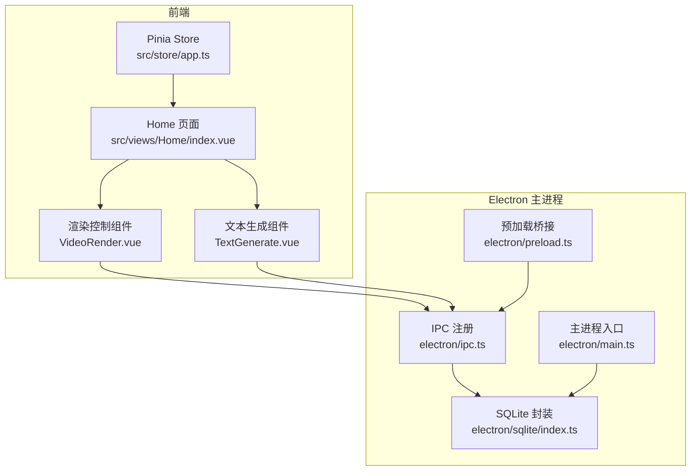
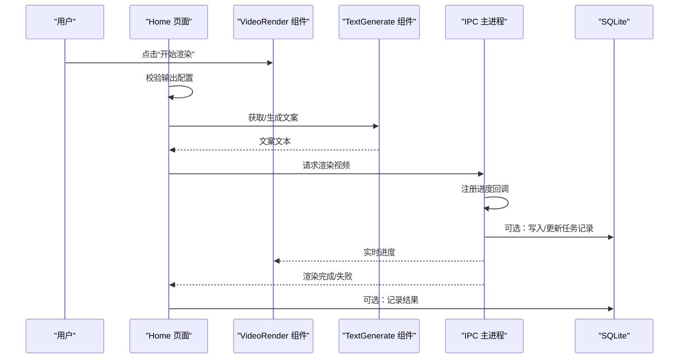
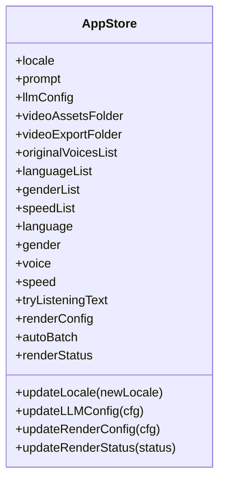
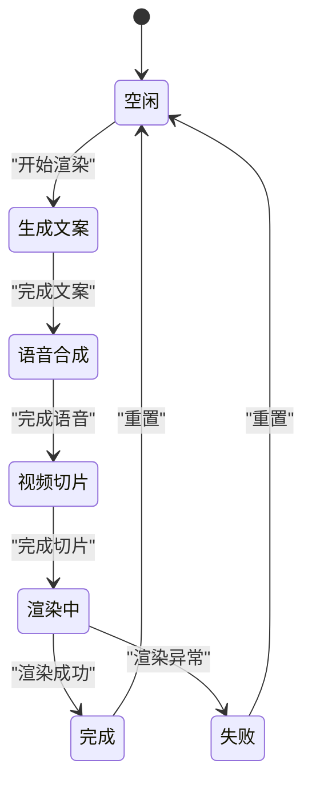
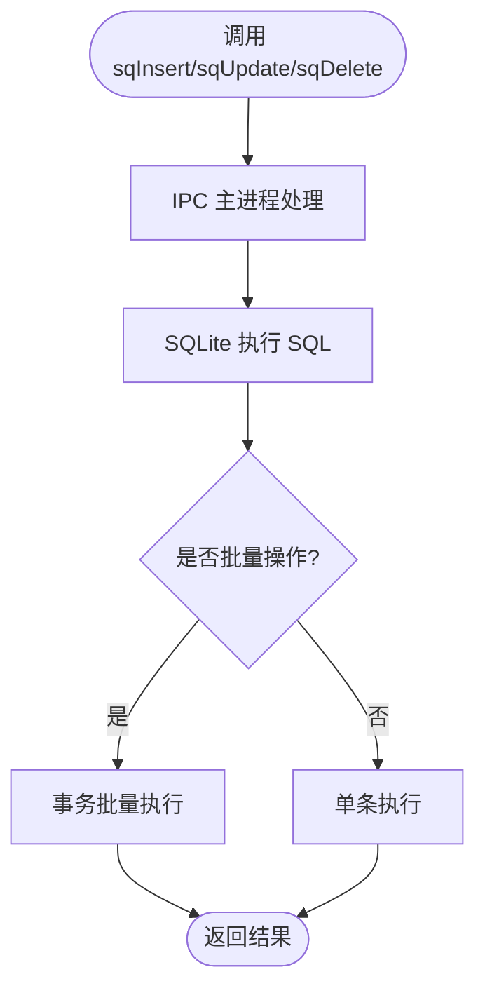
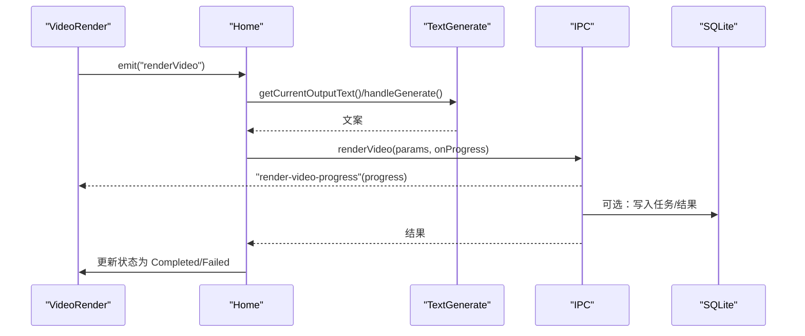
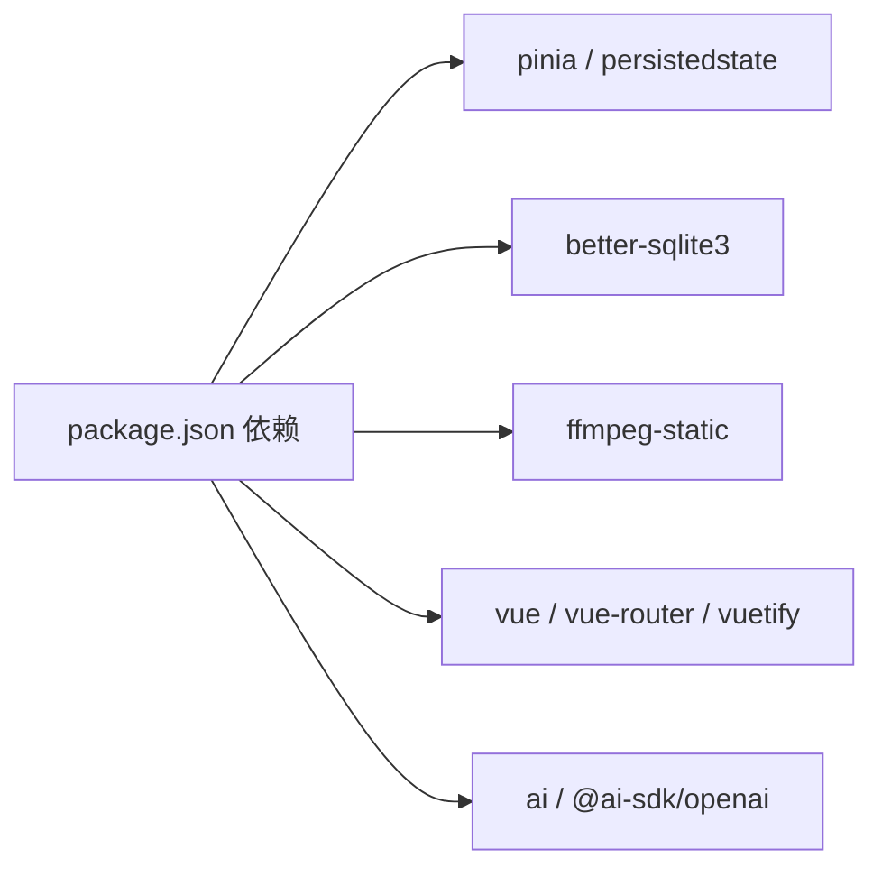

# 状态管理

<cite>
**本文引用的文件**
- [src/store/index.ts](file://src/store/index.ts)
- [src/store/app.ts](file://src/store/app.ts)
- [src/views/Home/index.vue](file://src/views/Home/index.vue)
- [src/views/Home/components/VideoRender.vue](file://src/views/Home/components/VideoRender.vue)
- [src/views/Home/components/TextGenerate.vue](file://src/views/Home/components/TextGenerate.vue)
- [electron/sqlite/index.ts](file://electron/sqlite/index.ts)
- [electron/sqlite/types.ts](file://electron/sqlite/types.ts)
- [electron/ipc.ts](file://electron/ipc.ts)
- [electron/preload.ts](file://electron/preload.ts)
- [electron/main.ts](file://electron/main.ts)
- [src/lib/error-copy.ts](file://src/lib/error-copy.ts)
- [package.json](file://package.json)
</cite>

## 目录
1. [简介](#简介)
2. [项目结构](#项目结构)
3. [核心组件](#核心组件)
4. [架构总览](#架构总览)
5. [详细组件分析](#详细组件分析)
6. [依赖关系分析](#依赖关系分析)
7. [性能考量](#性能考量)
8. [故障排查指南](#故障排查指南)
9. [结论](#结论)
10. [附录](#附录)

## 简介
本文件系统性梳理“短视频工厂”项目的状态管理方案，覆盖以下方面：
- 基于 Pinia 的前端状态模型与持久化策略
- 渲染状态机的设计理念与状态转换流程
- SQLite 在状态管理中的角色（数据模型、CRUD、同步）
- 全局状态与组件局部状态的划分原则
- 最佳实践与性能优化建议
- 调试技巧与常见问题解决

## 项目结构
项目采用“前端（Vue + Pinia）+ Electron 主进程（IPC + SQLite）”的分层架构。状态管理主要集中在前端 Store 中，同时通过 IPC 将需要持久化的数据写入 SQLite 数据库。

图表来源
- [src/store/app.ts:1-114](file://src/store/app.ts#L1-L114)
- [src/views/Home/index.vue:1-244](file://src/views/Home/index.vue#L1-L244)
- [src/views/Home/components/VideoRender.vue:1-246](file://src/views/Home/components/VideoRender.vue#L1-L246)
- [src/views/Home/components/TextGenerate.vue:1-272](file://src/views/Home/components/TextGenerate.vue#L1-L272)
- [electron/ipc.ts:1-188](file://electron/ipc.ts#L1-L188)
- [electron/sqlite/index.ts:1-154](file://electron/sqlite/index.ts#L1-L154)
- [electron/preload.ts:67-74](file://electron/preload.ts#L67-L74)
- [electron/main.ts:187-204](file://electron/main.ts#L187-L204)

章节来源
- [src/store/index.ts:1-9](file://src/store/index.ts#L1-L9)
- [src/store/app.ts:1-114](file://src/store/app.ts#L1-L114)
- [electron/main.ts:187-204](file://electron/main.ts#L187-L204)

## 核心组件
- Pinia Store（应用全局状态）
  - 提供语言、大模型配置、素材路径、TTS 列表与参数、渲染配置与状态等。
  - 使用持久化插件，仅持久化必要字段，避免冗余。
- 渲染状态机（RenderStatus）
  - 定义从“空闲/生成文案/语音合成/切片/渲染/完成/失败”的完整生命周期。
- SQLite 数据库
  - 提供查询、插入、更新、删除、批量插入/更新等能力，支持事务与冲突处理。
- IPC 层
  - 将 SQLite 能力暴露给渲染进程，统一由主进程执行数据库操作。

章节来源
- [src/store/app.ts:5-13](file://src/store/app.ts#L5-L13)
- [src/store/app.ts:15-114](file://src/store/app.ts#L15-L114)
- [electron/sqlite/index.ts:38-136](file://electron/sqlite/index.ts#L38-L136)
- [electron/ipc.ts:77-87](file://electron/ipc.ts#L77-L87)

## 架构总览
前端通过 Pinia 管理业务状态；渲染流程由 Home 页面协调各子组件按状态机推进；渲染过程中的进度与控制通过 IPC 与主进程交互；需要持久化的数据通过 IPC 写入 SQLite。

图表来源
- [src/views/Home/index.vue:65-212](file://src/views/Home/index.vue#L65-L212)
- [src/views/Home/components/VideoRender.vue:175-241](file://src/views/Home/components/VideoRender.vue#L175-L241)
- [src/views/Home/components/TextGenerate.vue:132-198](file://src/views/Home/components/TextGenerate.vue#L132-L198)
- [electron/ipc.ts:171-186](file://electron/ipc.ts#L171-L186)
- [electron/sqlite/index.ts:112-135](file://electron/sqlite/index.ts#L112-L135)

## 详细组件分析

### Pinia Store 设计与持久化
- 状态模型
  - 区域设置、大模型配置、素材路径、TTS 列表与筛选、渲染配置、自动批处理开关、渲染状态。
- 动作函数
  - 提供 updateLocale、updateLLMConfig、updateRenderConfig、updateRenderStatus 等更新器。
- 持久化策略
  - 使用持久化插件，通过 persist 选项排除不必要字段（如列表缓存、开关），仅持久化关键配置，降低存储体积与同步成本。

图表来源
- [src/store/app.ts:15-114](file://src/store/app.ts#L15-L114)

章节来源
- [src/store/index.ts:1-9](file://src/store/index.ts#L1-L9)
- [src/store/app.ts:108-112](file://src/store/app.ts#L108-L112)

### 渲染状态机与流程控制
- 状态枚举
  - None、GenerateText、SynthesizedSpeech、SegmentVideo、Rendering、Completed、Failed。
- 控制逻辑
  - Home 页面根据当前状态决定下一步步骤，串行推进：文案 → 语音 → 切片 → 渲染 → 完成/失败。
  - 支持取消：在不同阶段调用对应组件停止或发送取消信号。
  - 自动批处理：完成后可清空文案并再次触发渲染。

图表来源
- [src/store/app.ts:5-13](file://src/store/app.ts#L5-L13)
- [src/views/Home/index.vue:65-212](file://src/views/Home/index.vue#L65-L212)
- [src/views/Home/components/VideoRender.vue:188-194](file://src/views/Home/components/VideoRender.vue#L188-L194)

章节来源
- [src/views/Home/index.vue:65-212](file://src/views/Home/index.vue#L65-L212)
- [src/views/Home/components/VideoRender.vue:188-194](file://src/views/Home/components/VideoRender.vue#L188-L194)

### SQLite 数据模型与 CRUD
- 数据库初始化
  - 主进程启动时初始化 SQLite，连接路径位于用户数据目录。
- 接口封装
  - query、insert、update、delete、bulkInsertOrUpdate，均通过 IPC 暴露给渲染进程。
- 事务与冲突处理
  - 批量插入/更新使用 SQLite 的 ON CONFLICT 语法配合事务，保证一致性与性能。

图表来源
- [electron/ipc.ts:77-87](file://electron/ipc.ts#L77-L87)
- [electron/sqlite/index.ts:71-135](file://electron/sqlite/index.ts#L71-L135)
- [electron/preload.ts:67-74](file://electron/preload.ts#L67-L74)

章节来源
- [electron/sqlite/index.ts:38-136](file://electron/sqlite/index.ts#L38-L136)
- [electron/sqlite/types.ts:1-26](file://electron/sqlite/types.ts#L1-L26)
- [electron/ipc.ts:77-87](file://electron/ipc.ts#L77-L87)
- [electron/preload.ts:67-74](file://electron/preload.ts#L67-L74)

### 组件与状态的协作
- TextGenerate
  - 管理大模型配置与文案生成，支持测试配置与停止生成。
- VideoRender
  - 展示渲染状态与进度，提供配置对话框与开始/停止按钮。
- Home 页面
  - 协调三者，按状态机顺序推进，处理异常与统计上报。

图表来源
- [src/views/Home/components/VideoRender.vue:183-186](file://src/views/Home/components/VideoRender.vue#L183-L186)
- [src/views/Home/components/TextGenerate.vue:132-198](file://src/views/Home/components/TextGenerate.vue#L132-L198)
- [src/views/Home/index.vue:65-212](file://src/views/Home/index.vue#L65-L212)
- [electron/ipc.ts:171-186](file://electron/ipc.ts#L171-L186)

章节来源
- [src/views/Home/components/TextGenerate.vue:132-198](file://src/views/Home/components/TextGenerate.vue#L132-L198)
- [src/views/Home/components/VideoRender.vue:175-241](file://src/views/Home/components/VideoRender.vue#L175-L241)
- [src/views/Home/index.vue:65-212](file://src/views/Home/index.vue#L65-L212)

## 依赖关系分析
- 前端依赖
  - Pinia 与 pinia-plugin-persistedstate：提供状态容器与持久化。
  - Vue：响应式与组件化基础。
- Electron 依赖
  - better-sqlite3：高性能本地数据库。
  - ffmpeg：视频渲染工具链（通过 IPC 调用）。
- 构建与打包
  - Electron Builder、Vite、Vue 等工具链。

图表来源
- [package.json:22-63](file://package.json#L22-L63)

章节来源
- [package.json:22-63](file://package.json#L22-L63)

## 性能考量
- 状态持久化范围控制
  - 仅持久化必要字段，避免将大型列表或临时状态写入存储，减少序列化/反序列化开销。
- 渲染状态机的串行化
  - 严格按阶段推进，避免并发写入导致的资源竞争与状态不一致。
- IPC 调用粒度
  - 将数据库操作集中于主进程，渲染进程通过 invoke 调用，减少主线程阻塞。
- 批量操作事务化
  - 批量插入/更新使用事务，显著提升吞吐并保证一致性。
- 进度回调与 UI 更新
  - 使用轻量级事件通道传递进度，避免频繁重渲染。

## 故障排查指南
- 错误信息复制
  - 使用统一格式化函数生成可复制的错误内容，便于诊断与反馈。
- 常见问题定位
  - 渲染失败：检查当前状态是否处于 SegmentVideo 或 Rendering，确认 IPC 渲染调用是否被取消或中断。
  - 文案生成失败：检查大模型配置与网络连通性，查看测试配置结果。
  - 数据库写入失败：确认主进程已初始化 SQLite，检查 IPC 暴露方法是否可用。
- 调试技巧
  - 在主进程日志中观察数据库连接与 SQL 执行情况。
  - 在渲染进程监听进度事件，结合 Toast 与状态提示快速定位卡点。
  - 使用 AbortController 在各阶段及时取消任务，避免资源浪费。

章节来源
- [src/lib/error-copy.ts:1-16](file://src/lib/error-copy.ts#L1-L16)
- [src/views/Home/index.vue:188-211](file://src/views/Home/index.vue#L188-L211)
- [src/views/Home/components/TextGenerate.vue:160-193](file://src/views/Home/components/TextGenerate.vue#L160-L193)
- [electron/ipc.ts:171-186](file://electron/ipc.ts#L171-L186)

## 结论
本项目采用“Pinia 全局状态 + Electron 主进程数据库 + IPC 通信”的清晰分层设计。通过渲染状态机串联关键流程，借助 SQLite 实现必要的数据持久化，既保证了用户体验的流畅，也确保了数据的一致性与可恢复性。建议持续优化状态持久化范围与批量操作策略，进一步提升性能与稳定性。

## 附录
- 关键实现路径参考
  - Store 初始化与持久化：[src/store/index.ts:1-9](file://src/store/index.ts#L1-L9)
  - 应用状态模型与动作：[src/store/app.ts:15-114](file://src/store/app.ts#L15-L114)
  - 渲染状态机与流程控制：[src/views/Home/index.vue:65-212](file://src/views/Home/index.vue#L65-L212)
  - 渲染组件状态展示与交互：[src/views/Home/components/VideoRender.vue:175-241](file://src/views/Home/components/VideoRender.vue#L175-L241)
  - 文本生成组件与大模型交互：[src/views/Home/components/TextGenerate.vue:132-198](file://src/views/Home/components/TextGenerate.vue#L132-L198)
  - SQLite 封装与批量操作：[electron/sqlite/index.ts:71-135](file://electron/sqlite/index.ts#L71-L135)
  - IPC 数据库接口注册：[electron/ipc.ts:77-87](file://electron/ipc.ts#L77-L87)
  - 预加载桥接暴露 sqlite：[electron/preload.ts:67-74](file://electron/preload.ts#L67-L74)
  - 主进程初始化与 SQLite 启动：[electron/main.ts:187-204](file://electron/main.ts#L187-L204)