# 视觉学习系统

<cite>
**本文档引用的文件**
- [package.json](file://package.json)
- [electron/main.ts](file://electron/main.ts)
- [src/main.ts](file://src/main.ts)
- [electron/vl/index.ts](file://electron/vl/index.ts)
- [electron/vl/types.ts](file://electron/vl/types.ts)
- [electron/vl/analyze-product.ts](file://electron/vl/analyze-product.ts)
- [electron/vl/analyze-video.ts](file://electron/vl/analyze-video.ts)
- [electron/vl/match.ts](file://electron/vl/match.ts)
- [electron/ipc.ts](file://electron/ipc.ts)
- [electron/sqlite/index.ts](file://electron/sqlite/index.ts)
- [electron/vl/llm-match.ts](file://electron/vl/llm-match.ts)
- [src/views/Home/index.vue](file://src/views/Home/index.vue)
- [src/store/app.ts](file://src/store/app.ts)
- [src/router/index.ts](file://src/router/index.ts)
- [electron/preload.ts](file://electron/preload.ts)
</cite>

## 目录
1. [简介](#简介)
2. [项目结构](#项目结构)
3. [核心组件](#核心组件)
4. [架构概览](#架构概览)
5. [详细组件分析](#详细组件分析)
6. [依赖关系分析](#依赖关系分析)
7. [性能考量](#性能考量)
8. [故障排除指南](#故障排除指南)
9. [结论](#结论)

## 简介

视觉学习系统是一个基于 Electron 和 Vue.js 的桌面应用程序，专为短视频内容创作而设计。该系统集成了先进的视觉分析技术，能够自动分析产品图像和视频素材，实现智能化的视频片段匹配和内容生成。

系统的核心功能包括：
- 视觉大模型分析（VL Model）
- 智能视频片段匹配
- AI驱动的内容生成
- 多平台语音合成
- 自动化视频渲染

该应用支持多语言界面，提供完整的本地化体验，并具备强大的扩展性和定制能力。

## 项目结构

该项目采用现代化的前后端分离架构，结合了 Electron 的桌面应用优势和现代 Web 技术栈：

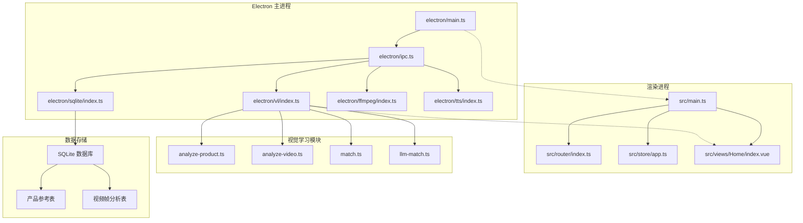

**图表来源**
- [electron/main.ts:1-204](file://electron/main.ts#L1-L204)
- [src/main.ts:1-127](file://src/main.ts#L1-L127)

**章节来源**
- [package.json:1-85](file://package.json#L1-L85)
- [electron/main.ts:1-204](file://electron/main.ts#L1-L204)
- [src/main.ts:1-127](file://src/main.ts#L1-L127)

## 核心组件

### 视觉分析引擎

视觉分析引擎是系统的核心组件，负责处理图像和视频的智能分析任务。它包含了完整的视觉特征提取、产品识别和场景理解能力。

**主要特性：**
- 多模态图像分析（文本+图像）
- 颜色识别和分类
- 物品标签生成
- 视觉吸引力评分
- 实时帧分析

### 智能匹配系统

智能匹配系统利用机器学习算法，将产品特征与视频素材进行精确匹配，实现自动化的内容选择和编排。

**核心算法：**
- 颜色覆盖率计算
- 标签相似度分析
- 语义对齐评分
- 时间段优化策略

### 数据存储层

系统采用 SQLite 作为本地数据存储解决方案，提供了高效的数据管理和持久化能力。

**数据库设计：**
- 产品参考信息表
- 视频帧分析记录表
- 自动索引优化
- 数据一致性保障

**章节来源**
- [electron/vl/index.ts:1-152](file://electron/vl/index.ts#L1-L152)
- [electron/vl/types.ts:1-93](file://electron/vl/types.ts#L1-L93)
- [electron/sqlite/index.ts:1-210](file://electron/sqlite/index.ts#L1-L210)

## 架构概览

系统采用分层架构设计，确保了良好的可维护性和扩展性：

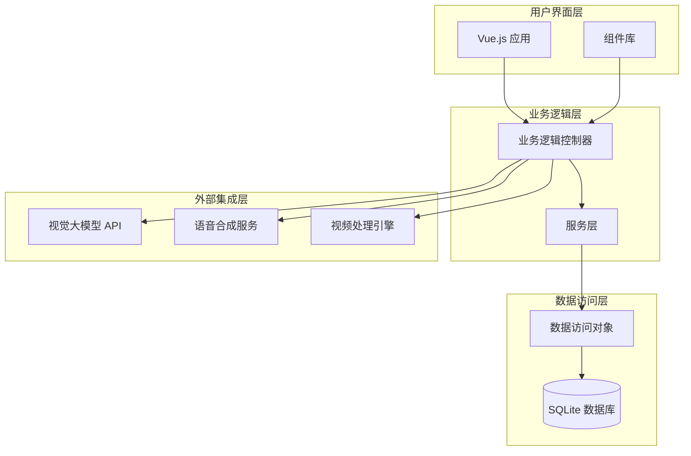

**图表来源**
- [src/views/Home/index.vue:1-433](file://src/views/Home/index.vue#L1-L433)
- [electron/ipc.ts:1-352](file://electron/ipc.ts#L1-L352)

### IPC 通信机制

系统通过 IPC（进程间通信）机制实现了主进程和渲染进程之间的高效数据交换：

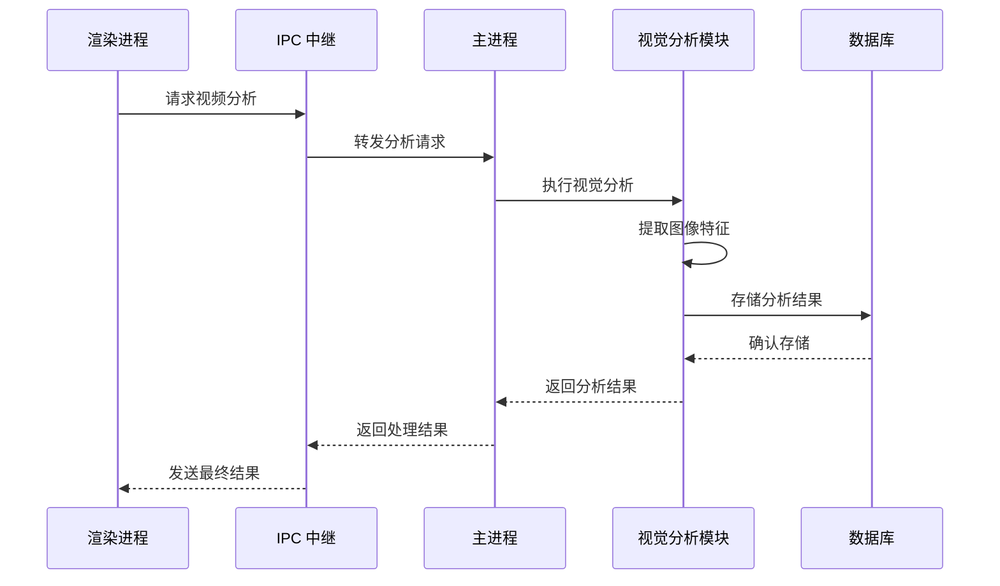

**图表来源**
- [electron/ipc.ts:235-284](file://electron/ipc.ts#L235-L284)
- [electron/vl/analyze-video.ts:95-199](file://electron/vl/analyze-video.ts#L95-L199)

**章节来源**
- [electron/ipc.ts:1-352](file://electron/ipc.ts#L1-L352)
- [electron/preload.ts:1-127](file://electron/preload.ts#L1-L127)

## 详细组件分析

### 视觉分析模块

视觉分析模块是整个系统的技术核心，负责处理复杂的计算机视觉任务：

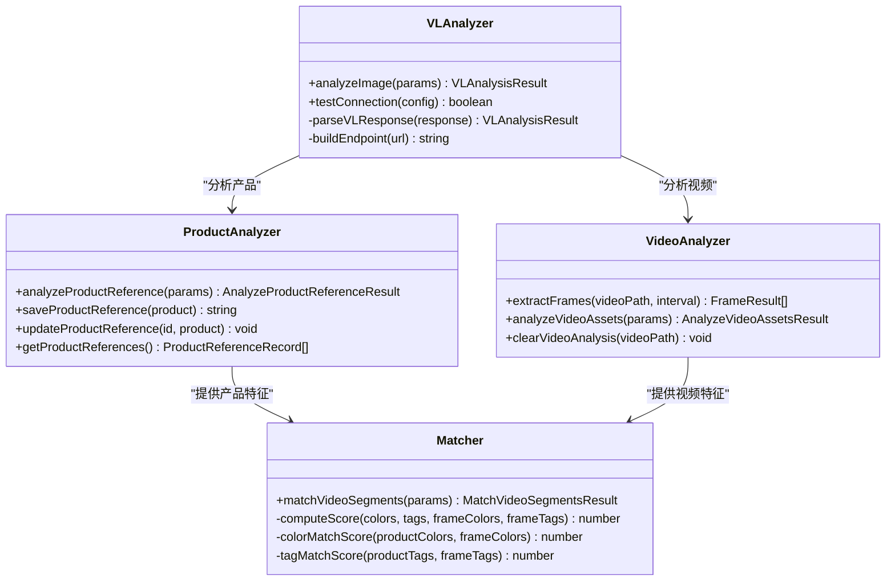

**图表来源**
- [electron/vl/index.ts:74-120](file://electron/vl/index.ts#L74-L120)
- [electron/vl/analyze-product.ts:14-52](file://electron/vl/analyze-product.ts#L14-L52)
- [electron/vl/analyze-video.ts:29-68](file://electron/vl/analyze-video.ts#L29-L68)
- [electron/vl/match.ts:278-382](file://electron/vl/match.ts#L278-L382)

#### 颜色匹配算法

系统实现了先进的颜色匹配算法，能够精确识别产品的主要颜色特征：

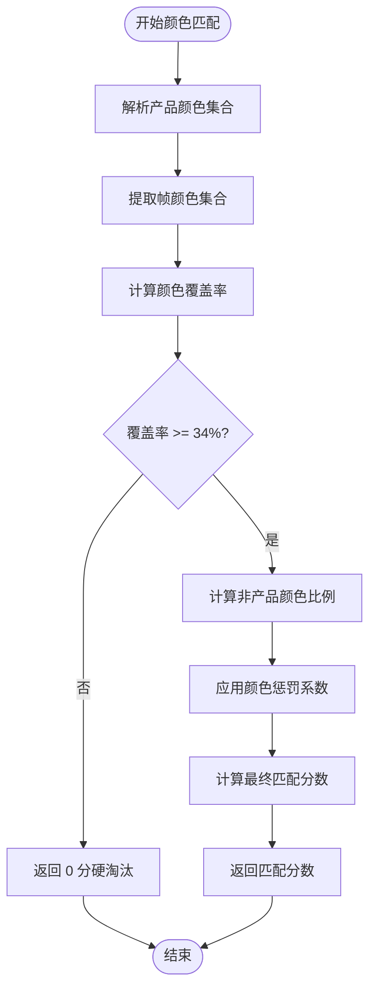

**图表来源**
- [electron/vl/match.ts:51-72](file://electron/vl/match.ts#L51-L72)
- [electron/vl/match.ts:125-137](file://electron/vl/match.ts#L125-L137)

#### 语义对齐机制

系统支持基于语义的智能匹配，通过分析文案内容与视频片段的语义关联度来优化选片效果：

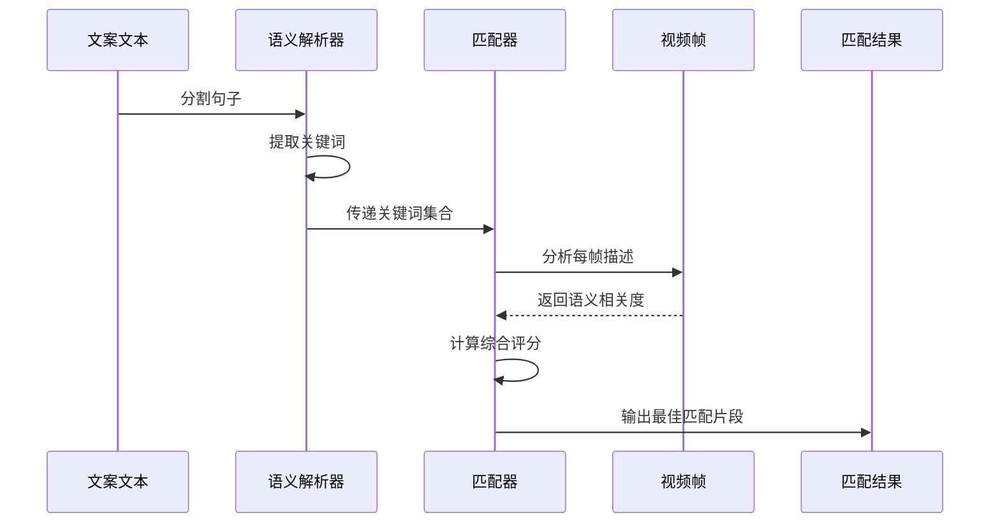

**图表来源**
- [electron/vl/match.ts:169-259](file://electron/vl/match.ts#L169-L259)
- [electron/vl/match.ts:464-542](file://electron/vl/match.ts#L464-L542)

**章节来源**
- [electron/vl/index.ts:1-152](file://electron/vl/index.ts#L1-L152)
- [electron/vl/analyze-product.ts:1-172](file://electron/vl/analyze-product.ts#L1-L172)
- [electron/vl/analyze-video.ts:1-238](file://electron/vl/analyze-video.ts#L1-L238)
- [electron/vl/match.ts:1-701](file://electron/vl/match.ts#L1-L701)

### 数据存储系统

系统采用 SQLite 作为本地数据存储，提供了高效且可靠的数据库解决方案：

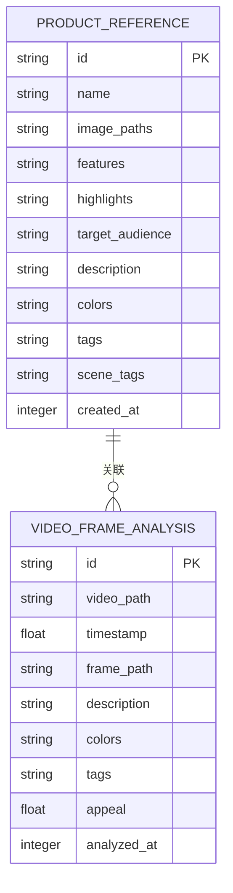

**图表来源**
- [electron/sqlite/index.ts:149-197](file://electron/sqlite/index.ts#L149-L197)

#### 数据库初始化流程

系统启动时会自动初始化数据库结构，确保所有必要的表和索引都已创建：

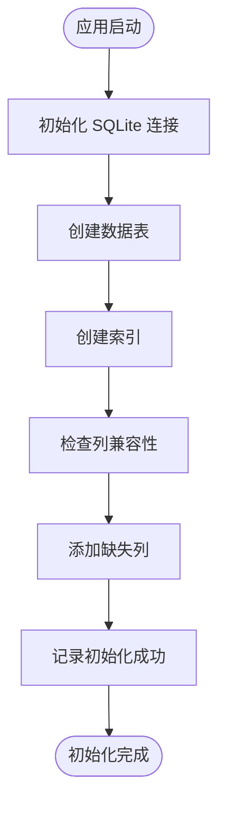

**图表来源**
- [electron/sqlite/index.ts:144-203](file://electron/sqlite/index.ts#L144-L203)

**章节来源**
- [electron/sqlite/index.ts:1-210](file://electron/sqlite/index.ts#L1-L210)

### 用户界面组件

系统采用 Vue.js 构建现代化的用户界面，提供了直观易用的操作体验：

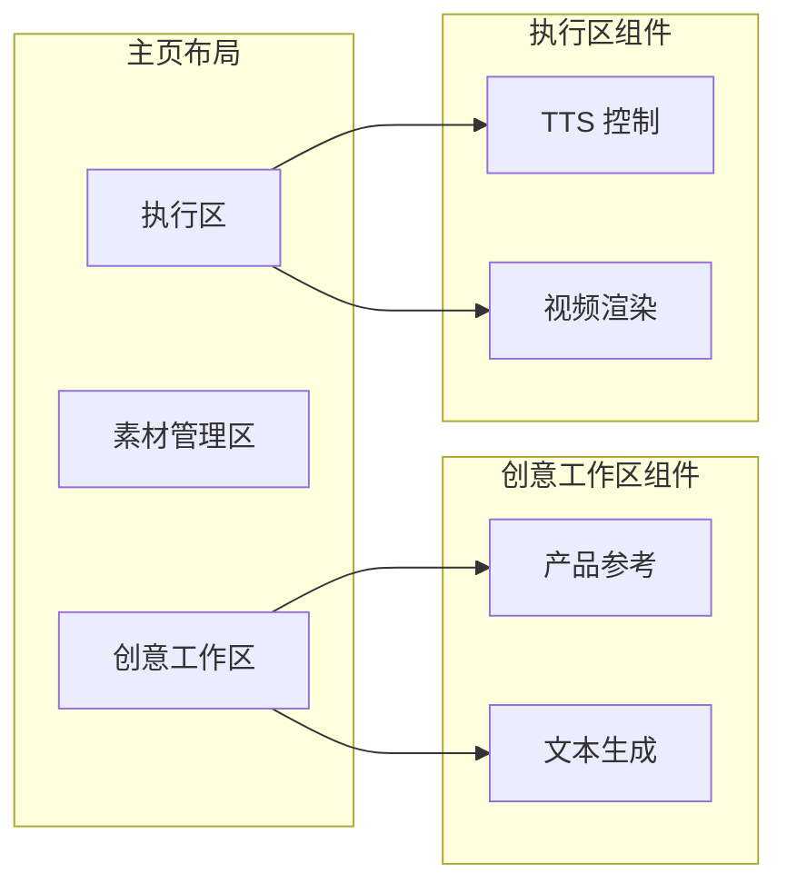

**图表来源**
- [src/views/Home/index.vue:8-38](file://src/views/Home/index.vue#L8-L38)

#### 渲染流程控制

系统实现了完整的渲染流程控制，确保从文本生成到最终视频输出的每个步骤都能正确执行：

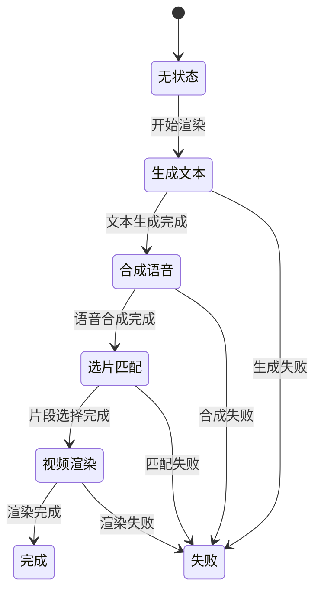

**图表来源**
- [src/views/Home/index.vue:99-344](file://src/views/Home/index.vue#L99-L344)

**章节来源**
- [src/views/Home/index.vue:1-433](file://src/views/Home/index.vue#L1-L433)
- [src/store/app.ts:1-151](file://src/store/app.ts#L1-L151)

## 依赖关系分析

系统采用了模块化的依赖管理策略，确保各组件之间的松耦合和高内聚：

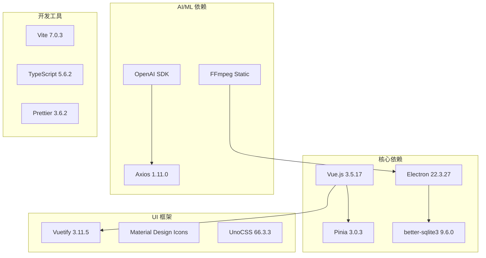

**图表来源**
- [package.json:22-64](file://package.json#L22-L64)

### 外部 API 集成

系统集成了多种外部服务，提供了丰富的功能扩展：

| 服务类型 | 名称 | 用途 | 配置参数 |
|---------|------|------|----------|
| 视觉分析 | DashScope/Qwen-VL | 图像分析、颜色识别 | apiUrl, apiKey, modelName |
| 语音合成 | Edge TTS | 免费语音合成 | 无需配置 |
| 语音合成 | ElevenLabs | 高质量语音合成 | apiKey, voiceId |
| 视频处理 | FFmpeg | 视频转码、合并 | 自动安装 |

**章节来源**
- [package.json:1-85](file://package.json#L1-L85)
- [electron/vl/index.ts:62-69](file://electron/vl/index.ts#L62-L69)

## 性能考量

系统在设计时充分考虑了性能优化，采用了多种策略来提升运行效率：

### 并发处理优化

系统实现了多级并发控制，确保资源的有效利用：

- **帧分析并发**：默认并发数为 3，平衡处理速度和系统负载
- **数据库操作**：使用事务批量插入，减少磁盘 I/O 操作
- **网络请求**：合理的超时设置和重试机制

### 内存管理

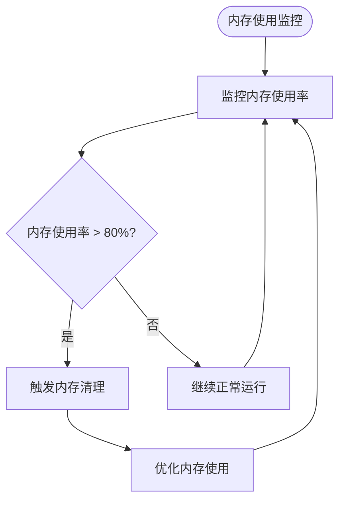

### 缓存策略

系统采用了多层次的缓存机制：

- **帧缓存**：本地临时文件存储，避免重复分析
- **分析结果缓存**：数据库持久化存储，支持增量分析
- **配置缓存**：内存中缓存常用配置信息

## 故障排除指南

### 常见问题诊断

#### 视觉分析失败

**症状**：视觉分析接口调用失败，返回错误信息

**可能原因**：
1. API 密钥配置错误
2. 网络连接不稳定
3. 模型接口不可用

**解决步骤**：
1. 验证 API 配置信息
2. 检查网络连接状态
3. 查看系统日志获取详细错误信息

#### 视频渲染卡顿

**症状**：视频渲染过程中出现卡顿或失败

**可能原因**：
1. 系统资源不足
2. FFmpeg 安装异常
3. 磁盘空间不足

**解决步骤**：
1. 关闭不必要的应用程序释放内存
2. 重新安装 FFmpeg
3. 清理磁盘空间

#### 数据库连接问题

**症状**：应用启动时数据库连接失败

**可能原因**：
1. 数据库文件损坏
2. 权限不足
3. 路径配置错误

**解决步骤**：
1. 检查数据库文件完整性
2. 验证文件权限设置
3. 重新初始化数据库

**章节来源**
- [electron/vl/index.ts:125-149](file://electron/vl/index.ts#L125-L149)
- [electron/sqlite/index.ts:144-203](file://electron/sqlite/index.ts#L144-L203)

## 结论

视觉学习系统是一个功能完整、架构清晰的现代化桌面应用程序。通过集成先进的计算机视觉技术和人工智能算法，该系统为短视频内容创作提供了强大的技术支持。

### 主要优势

1. **技术先进性**：采用最新的视觉分析技术和机器学习算法
2. **用户体验**：提供直观易用的界面和流畅的操作体验
3. **扩展性强**：模块化设计便于功能扩展和定制
4. **性能优异**：优化的并发处理和内存管理策略
5. **可靠性高**：完善的错误处理和故障恢复机制

### 发展方向

未来的发展重点包括：
- 进一步优化视觉分析算法的准确性和速度
- 增强多语言支持和本地化功能
- 扩展更多视频处理和编辑功能
- 提升系统的自动化程度和智能化水平

该系统为短视频创作者提供了强有力的技术支撑，有望成为行业内的标杆产品。